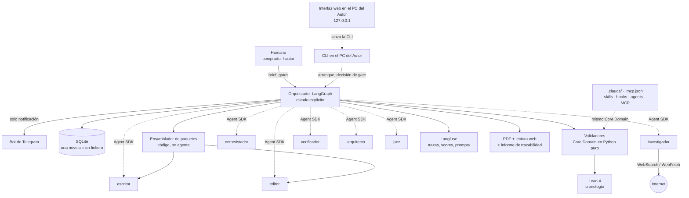
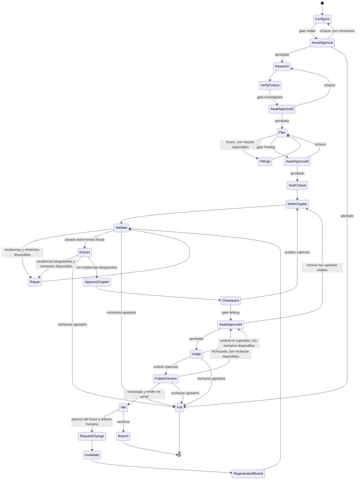

# Arquitectura — StoryMaker

Arnés multiagente para la generación de **novelas históricas personalizadas**.

Este documento no define *qué* se gestiona —eso está en [`definitions.md`](definitions.md) y [`domain-knowledge.md`](domain-knowledge.md)— sino *quién* lo gestiona, *cómo recibe su contexto*, *cómo se detiene* y *cómo se demuestra que funciona*.

---

## 0. El producto en una frase

El comprador quiere regalar una novela. StoryMaker convierte a la persona homenajeada en **personaje de un escenario histórico real y documentado**: el padre que se jubila aparece como armador en el Cádiz de 1805, la pareja como copista en un *scriptorium* del siglo XII. La personalización es el *qué*; el rigor histórico es el *cómo*, y es lo que distingue el producto de pedirle un cuento a un modelo generalista.

Esa decisión de dominio gobierna todo lo demás: justifica una fase de investigación con acceso a internet por novela, llena de contenido real la validación formal —las fechas históricas son duras y comprobables— y proporciona una familia entera de validadores deterministas que una novela contemporánea no tendría.

---

## 1. Decisiones fijadas

| Decisión | Elegida | Consecuencia principal |
|---|---|---|
| Dominio | Novela histórica personalizada | La investigación y la validación formal tienen materia real que verificar. |
| Motor de orquestación | LangGraph con estado explícito | Un nodo por acción de la especificación TLA+, con el mismo nombre. La correspondencia código↔spec es literal, no narrada. |
| Agentes | Claude Code vía **Claude Agent SDK** (Python), todos en Haiku 4.5 | Modelo, herramientas y turnos se fijan por invocación. Internet entra por `WebSearch`/`WebFetch`, sin proveedor adicional. |
| Roles | Nueve: entrevistador, extractor de intake, investigador, verificador, arquitecto, escritor, editor, extractor de capítulo, juez | El **editor repara dentro del bucle**; el **juez mide fuera** y no puede tocar el texto; el **verificador comprueba el corpus** contra las citas guardadas y no puede añadirle nada; los **dos extractores tipan y miden lo que no puede declarar quien lo produjo**. |
| Validadores | Nodos del grafo, nunca herramientas de un agente | Ningún modelo puede saltarse una validación. Las aristas condicionales leen booleanos de Python. |
| Paso de contexto | Empuje determinista en siete bloques | El escritor no tiene herramientas de recuperación. Contexto acotado, reproducible y auditable. |
| Estado | Un único fichero SQLite por novela | Checkpoint del grafo y datos de dominio en la misma transacción. Imposible que se desincronicen. |
| Versiones | Capítulos inmutables + manifiesto | Conservar la versión anterior es una propiedad de la estructura, no una disciplina. |
| Ejecuciones de fase | Grafo de `fase_run` inmutables | Rehacer, reanudar, ramificar y regenerar son **la misma operación** con distinto punto de entrada. |
| Intervención humana | Cinco gates bloqueantes; **Telegram solo avisa y el Autor decide en su PC**, en la interfaz o con la CLI | La máquina duerme en disco mientras espera. Nada fuera de la máquina del Autor reanuda una ejecución: la API solo escucha en `127.0.0.1`. Desactivables en modo batch. |
| Operación del arnés | **La interfaz opera la novela entera** —encargar, lanzar, seguir, decidir cada gate, continuar— **lanzando la CLI como proceso aparte** | La interfaz no ejecuta el grafo: cada acción es un comando de la CLI, el mismo que teclearía el Autor. El servidor no guarda nada en memoria, así que reiniciarlo no mata ninguna ejecución. Ver §16.5. |
| Validación formal | Lean 4 (la historia) + TLA+ (el arnés) | Lean verifica la cronología concreta; TLC verifica el comportamiento del sistema. |
| Observabilidad | Langfuse con spans manuales autorizados + OTLP nativo opcional | La semántica que importa (sesión = novela, span = capítulo/rol/intento) la pone el orquestador. |
| Presupuesto de contexto | 100.000 tokens concurrentes, garantizados por construcción | No se puede medir en vivo, así que se acota *a priori*. Ver §12. |
| Pila | FastAPI organizado *package by feature* con `commons`; React + Vite organizado en **Feature-Sliced Design v2.1** | En el backend, una fase es una carpeta. En el frontend manda la metodología estándar con su juego mínimo de capas. Ver §16.3. |
| Embeddings | FastEmbed local (ONNX), `paraphrase-multilingual-MiniLM-L12-v2`, 384d, indexados con **`sqlite-vec`** | Con SQLite, son la gestión de contexto: deciden qué porción del material entra en cada paquete. Locales, sin red y deterministas. Ver §16.2. |
| Correspondencia documento↔código | Comprobada por tests de trazabilidad, no por lectura | Lo que la spec declara y lo que el plan nombra tiene quien lo compruebe en G1. Un apartado especificado que nadie implementó, o un validador que dejó de bloquear, se ven en cuanto G1 corre. Ver §11e. |
| Requisitos de la spec | **Enunciados numerados derivados del propio documento**: `REQ-BE-nn` en el backend, `REQ-FE-nn` en el frontend | Una spec se lee como una lista de compromisos comprobables y no solo como prosa. El enunciado sale del contrato que el propio documento fija, nunca de un checklist externo, de modo que la spec sigue siendo su propia fuente. Ver §11e. |

### La decisión de la que cuelga todo

**Los validadores son nodos del grafo, no herramientas que un agente elige llamar.**

Si el editor decidiera cuándo validar, un modelo que se olvida de invocar una herramienta produciría un capítulo aprobado sin comprobar, indistinguible de uno comprobado y correcto. El arnés ejecuta los validadores siempre, y lo que el editor recibe es el **informe de incidencias ya producido**. Su único trabajo es emitir el parche. Con eso, las transiciones del grafo dependen de valores calculados en Python y no de la salida de un modelo — que es exactamente lo que TLC puede verificar.

---

## 2. Principios

1. **El agente no busca su contexto, lo recibe.** Un módulo determinista arma el paquete de cada capítulo, y para llenarlo puede consultar SQLite y buscar por similitud — pero lo hace él, con una consulta derivada de la escaleta, no el agente decidiendo sobre la marcha. Si la recuperación la hiciera el escritor, cada capítulo recibiría un contexto distinto y la estabilidad métrica dejaría de ser sostenible.
2. **Quien escribe no aprueba.** El escritor no valida. El editor no puntúa. El juez no edita.
3. **Determinista antes que modelo.** Fechas, disponibilidad de objetos, léxico fechado, longitudes, nombres exactos, palabras prohibidas: todo eso lo comprueba código. El modelo solo juzga lo que no se puede calcular.
4. **El canon manda sobre el texto.** Un cambio se aplica al hecho en la base de datos y el texto se regenera como consecuencia. Nunca al revés: un `buscar-y-reemplazar` sobre la prosa deja mintiendo a la biblia.
5. **Nada se sobrescribe.** Capítulos, versiones y ejecuciones de fase son inmutables. Lo que parece una modificación es siempre una fila nueva que apunta a la anterior.
6. **El orquestador no acumula.** Todo su conocimiento está en SQLite. Se puede matar el proceso en cualquier punto y reanudar sin pérdida.

---

## 3. Topología



Hay dos piezas que no son ni agente ni base de datos, y son las que sostienen el sistema:

- **El ensamblador de paquetes** traduce «voy a redactar el capítulo 7» en un fichero de contexto concreto. Es el corazón del arnés y conviene que no tenga nada de inteligente.
- **El Core Domain de validación** son scripts de Python puros, agnósticos a quién los llame. El grafo los llama como nodos en producción; Claude Code los llama como skill y como hook cuando un humano edita a mano. **Una sola implementación, dos puntos de ejecución.**

---

## 4. Las seis fases

| Fase | Nombre | Agente | Artefacto | Gate |
|---|---|---|---|---|
| 1 | **Intake** | entrevistador | `Brief` validado | ✅ |
| 2 | **Investigation** | investigador · verificador | Corpus histórico con respaldo comprobado | ✅ |
| 3 | **Plotting** | arquitecto | Premisa, tema, canon, escaleta · **sello del corpus** | ✅ |
| 4 | **Writing** | escritor · validadores · extractor · editor | Capítulos aprobados, resúmenes, continuidad | ✅ |
| 5 | **Publication** | juez | Versión publicada, PDF, lectura web | — |
| 6 | **Regeneration** | escritor · editor | Versión nueva con diff marcado | ✅ |

### Fase 1 · Intake

El sistema arranca de una **premisa inicial** libre que el comprador escribe. Esa premisa no es la Premisa narrativa del módulo 2 de la ontología: es materia prima. Se pasa por una extracción que rellena los huecos del esquema `Brief` (Pydantic) que pueda, y el entrevistador **solo pregunta por lo que sigue vacío o ambiguo** — es lo que impide que la conversación sea un formulario disfrazado.

**Qué recoge el `Brief`.** Tres bloques, y el reparto no es cosmético: el primero describe a quién se regala la novela, el segundo el mundo en el que va a vivir y el tercero las reglas con las que se escribe. Nada de lo que el arquitecto puede inventar entra aquí.

| Bloque | Campo | Quién lo consume |
|---|---|---|
| **Homenajeado** | `nombre_homenajeado`, tal como debe aparecer escrito | `nombres_exactos` |
| | `fecha_nacimiento` | Detección de contradicciones; es la de su personaje si cae dentro de la época, y si no la de su vida real, que no entra en el canon (Fase 3) |
| | `rol_epoca` — su oficio o posición en el período: armador, copista, boticaria | `canon_personaje` (estatus, voz), estructura social del corpus |
| | `ocasion` — jubilación, aniversario, despedida | Tono y dedicatoria |
| | `elementos_personalizacion` — lista tipada, cada elemento marcable como obligatorio | Bloque 7 del paquete, `cobertura_personalizacion` |
| **Mundo** | `periodo` — inicio, fin, denominación historiográfica | Sub-encargos del investigador |
| | `lugar` | Sub-encargos del investigador |
| | `evento_ancla`, opcional y orientativo — el acontecimiento del que cuelga la novela | Contradicciones, solo si viene relleno; si viene, entra como elemento obligatorio y lo cubren `cobertura_anclada` y `cobertura_personalizacion` |
| | `personajes_historicos` — figuras reales que deben aparecer o que deben evitarse | Plotting, Nota del autor |
| **Obra y frontera** | `genero` con su subgénero | `canon_obra` |
| | `tono` | Voz y estilo, contradicciones |
| | `punto_de_vista`, opcional — por defecto lo fija el arquitecto | Escaleta |
| | `grado_licencia` — estricto, moderado o amplio | `canon_obra.estilo_json` → bloque 6 del paquete; `canon_licencia`, rúbrica del juez |
| | `arcaismo` — mínimo, moderado o marcado | `canon_obra.estilo_json` → bloque 6 del paquete; `canon_glosario` |
| | `contenido_admisible` — violencia, sexo, crudeza | `canon_obra.estilo_json` → bloque 6 del paquete; rúbrica del juez |
| | `palabras_prohibidas`, niveles `novela` y `destinatario` | `canon_prohibida`, `guardrail_prohibidas` |
| | `n_capitulos` y `palabras_por_capitulo`, con los valores de §19 | `longitud_capitulo`, `canon_obra` |

**Los diales de la frontera historia–ficción viajan por el canon.** `grado_licencia`, `arcaismo` y `contenido_admisible` **no los lee ningún validador por sí solos**, y aun así son obligatorios: son la política contra la que el juez puntúa la autenticidad de época y contra la que se decide si comprimir el tiempo es una Licencia legítima o un error. Sin declararlos, esa política existe igualmente pero la pone el modelo, que es justo lo que este arnés evita en todo lo demás.

Para que lleguen a quien escribe, el arquitecto los copia a `canon_obra.estilo_json` al construir el canon, y de ahí entran en el **bloque 6 del paquete de contexto** junto a la voz, el estilo y el glosario (§6). No se convierten en validador nuevo: `contenido_admisible` en particular no es una palabra prohibida —«sin violencia explícita» no es un término que buscar en `canon_prohibida`—, así que lo juzga el juez con la rúbrica, que es la herramienta adecuada para lo que no se puede calcular.

`evento_ancla` es **opcional y orientativo**, y nadie lo rellena por el comprador. Si viene, el `@model_validator` lo contrasta con la fecha de nacimiento del homenajeado y **entra en `intake_dato` como un elemento obligatorio más**, de modo que el arquitecto lo ve con su clave, `cobertura_anclada` exige que alguna escena lo ancle y `cobertura_personalizacion` que algún capítulo aprobado lo cuente. «Debe anclarlo» deja así de ser una instrucción al arquitecto y pasa a ser una comprobación; si viene vacío, el arquitecto elige sus anclajes contra el corpus, que es lo que ya hace de todos modos. La comprobación vive en un solo sitio y en una sola fase, en lugar de repetirse en el gate de Plotting sobre un dato aparecido más tarde.

**Lo que no entra.** La Premisa, el Tema, la trama, los conflictos, los arcos y la escaleta son obra del arquitecto (Fase 3). Recogerlos en la entrada sería pedirle al comprador que escriba la novela.

**Texto libre no confiable.** Si el comprador pega una anécdota o una carta, el texto entra en una tabla de cuarentena y pasa por un extractor cuya salida está **restringida por esquema a hechos tipados** (`persona`, `lugar`, `fecha`, `objeto`, `anécdota`). El texto en bruto **no llega jamás al prompt del escritor**: solo llegan las filas extraídas, marcadas con `origen = 'texto_libre_no_confiable'`. La defensa contra *prompt injection* es estructural, no una instrucción de «ignora órdenes embebidas»: una inyección tiene que sobrevivir a convertirse en una fila tipada para hacer daño, y no sobrevive.

**Contradicciones.** Las detecta un `@model_validator` de Pydantic sobre el brief ya poblado, no un modelo: edad del homenajeado contra el período elegido, fecha de nacimiento contra el evento histórico ancla, tono festivo contra un período de duelo, dato aportado que coincide con una palabra prohibida. El agente captura el `ValueError`, lo traduce a pregunta y obliga a resolverlo antes de cerrar el brief. **Una fecha de nacimiento posterior al período no es una contradicción que preguntar**: es la fecha real de la persona, que es lo que un comprador escribe, y el aviso dice qué se hará con ella —el arquitecto le da a su personaje una de la época— en lugar de pedir que se mueva. Por la misma razón no se contrasta con el evento ancla.

**La entrevista pasa por el gate de Intake.** Las preguntas del entrevistador —lo que sigue vacío o ambiguo, y las contradicciones traducidas a pregunta— se guardan en la novela y **el gate las enseña**: el aviso de Telegram y de la CLI, y la pantalla del gate en la interfaz, que las presenta como preguntas con su casilla de respuesta. El Autor contesta en su PC con **«rehacer» y su comentario**, que en la interfaz es el conjunto de sus respuestas: `Configure` vuelve a correr con la premisa y **todas las respuestas dadas hasta entonces**, y el entrevistador cierra el `Brief` o pregunta lo que siga faltando. Cada vuelta es un gate más, y no hace falta nodo ni arista nueva: «rehacer» desde el gate de Intake ya devuelve a `Configure`. Repetir `Configure` **no duplica nada**: el texto pegado se extrae una sola vez y un dato del encargo que ya está no se vuelve a escribir. Si el Autor aprueba con preguntas pendientes, se sigue con el brief que haya, como pide el criterio de producto. En modo batch no hay nadie que conteste, así que el encargo tiene que venir completo.

**Los capítulos los fija el brief cerrado.** El número de capítulos con el que se lanza una novela es provisional: en el encargo por conversación ni siquiera viene, y el comprador puede decir otro en la entrevista. El que cuenta es el del `Brief` que cierra el entrevistador, que es con el que el arquitecto planifica la escaleta, y al cerrarse pasa al estado del grafo para que el bucle de Writing cuente los mismos.

### Fase 2 · Investigation

La fase tiene dos pasos y dos agentes distintos: uno **rellena** el corpus y otro **comprueba** que lo que dice está donde dice que está. La separación es la misma que rige al editor y al juez —quien escribe no aprueba—, aplicada aquí a los hechos históricos.

**Paso 1 · Una sesión, tres búsquedas.** El investigador no recibe «investiga el XIX», y tampoco una tanda de sub-encargos sueltos. Recibe el período y el lugar del brief y una **lista cerrada de seis dimensiones** que definen un período histórico: cronología y eventos, lugar y toponimia de época, cultura material, lenguaje de época, mentalidad, estructura social. Corre en **una única sesión macro con exactamente tres `WebSearch` permitidas**, y su trabajo es repartir esas tres búsquedas entre las seis dimensiones y dejarlas todas pobladas.

El límite lo impone el arnés, no una instrucción del prompt: `allowed_tools` y el contador de invocaciones lo aplican por construcción, y la llamada que sobra no se emite. Y el tope es doble, **tres `WebSearch` y tres `WebFetch`**, porque quien llena la ventana no es la búsqueda sino la página: una búsqueda devuelve una lista de resultados, así que topar solo las búsquedas permitiría abrir doce páginas y reventar el presupuesto igual que antes. Cada fetch va además acotado a 10.000 tokens. Con eso, «tres llamadas a internet» significa literalmente tres páginas leídas.

**Una llamada denegada dice qué hacer.** La que sobra se deniega, pero el mensaje de denegación no se limita a decir que la cuota se agotó: le dice al investigador que no lo intente de nuevo y que entregue ya su respuesta con lo que tenga. Cada intento denegado cuesta un turno, y un investigador que insiste en un período con poca información en la red puede quedarse sin turnos sin haber entregado nada; por eso la sesión única tiene además **veinte turnos**, holgura de sobra para tres búsquedas y tres páginas. Si aun así la sesión termina sin una respuesta válida, **la fase sigue con el corpus que haya** y un aviso en el informe del gate, como una sesión dirigida del modo exhaustivo: un encargo con poca documentación no justifica detener la novela.

Que sea una sesión y no seis tiene una contrapartida que conviene decir en voz alta. A favor: el investigador ve a la vez lo que lleva encontrado para cada dimensión y puede cruzarlo, porque la toponimia y la cultura material de un mismo lugar suelen venir de la misma página. En contra: arrastra en su ventana el material de las tres páginas a la vez, y por eso su techo declarado en §12 es el más alto del sistema y gobierna el peor caso de todo el arnés.

**Modo exhaustivo.** Tres páginas se quedan cortas para una novela que vive dentro de un oficio y alrededor de figuras reales: en la tercera novela real el corpus salió con doce hechos, siete de ellos de cultura material, y los errores que se vieron al leerla —una detención fechada seis meses tarde, el evento ancla sin narrar, la ley de imprenta que era el conflicto de la trama y nadie conocía— no eran del período en general, sino de lo concreto del encargo. Por eso existe un segundo modo de investigación, **elegido por novela al crearla** y desactivado por defecto. En lugar de la sesión única corre **una serie de sesiones dirigidas, una detrás de otra, cada una con una `WebSearch` y un `WebFetch`**:

- **Una por cada una de las seis dimensiones**, con el período, el lugar y esa dimensión como único encargo.
- **Una sobre los personajes históricos y el evento ancla** del brief: sus fechas, lo que hicieron en el período y lo que ocurrió exactamente en el evento. Se omite si el brief no trae ninguno de los dos.
- **Una sobre el oficio del homenajeado en la época** —el `rol_epoca` del brief—: cómo se ejercía, qué lo regulaba y qué riesgos tenía.

Las dos últimas **no son dimensiones nuevas**: son dos encargos cuya búsqueda sale del brief y no solo del período, y sus hechos se guardan con la dimensión de la que tratan —una fecha es `cronologia`, una ley es `estructura_social`, una herramienta es `cultura_material`—. La lista de seis sigue cerrada, y el esquema de `mundo_hecho` no cambia. Lo que reciben del brief son nombres de figuras históricas, un acontecimiento y un oficio, que describen la época y no a la persona (§15); **nunca el nombre del homenajeado, su fecha de nacimiento ni sus elementos de personalización**. Como el comprador puede haber escrito cualquiera de ellos donde no tocaba, **la guarda de PII mira cada prompt del investigador ya ensamblado** —la sesión única, las dirigidas y las micro-sesiones de Plotting— contra el nombre, la fecha y los elementos del homenajeado antes de emitirlo, y una sesión que los contenga **no sale**: se salta con un aviso.

Qué se gana: el corpus se construye con **ocho páginas en lugar de tres**, cada dimensión recibe la suya sin que el modelo decida el reparto, y las dos búsquedas dirigidas encuentran lo que ninguna búsqueda por período encuentra. Qué se paga: ocho sesiones en serie tardan más que una, y se pierde el cruce entre dimensiones dentro de una misma ventana. El techo de contexto, en cambio, **baja**: ninguna sesión dirigida lleva más de una página, y su techo en §12 es de 15.000 tokens frente a los 45.000 de la sesión única, que sigue siendo el peor caso del sistema porque el modo estándar existe.

El modo viaja en el **estado del grafo**, no en `Settings`, por la misma razón que `gates_enabled`: una novela empezada en exhaustivo se retoma, se rehace y se ramifica en exhaustivo aunque la instalación diga otra cosa. **No se cambia a mitad de novela**: quien quiera la otra investigación lanza una novela nueva. Se elige con `storymaker nueva --investigacion exhaustiva`, con la casilla del encargo en la interfaz o con el valor por defecto de la instalación; `storymaker evaluar` corre siempre en estándar, para que las evaluaciones sean comparables entre sí. El comentario de «rehacer» desde el gate llega a **las ocho sesiones**, y también a la sesión única del modo estándar. Una sesión dirigida cuya salida no valida tras sus reintentos **se salta con un aviso** en el informe del gate de Investigation, y las demás siguen: que falle la búsqueda del oficio no justifica perder las otras siete. Un error de entorno —el CLI caído, la sesión caducada— detiene la fase como siempre; una sesión que devuelve cero hechos no es un fallo, y si fallan todas se sigue con el corpus que haya, como en el estándar. El informe del gate enseña **una línea por sesión**: su encargo y sus hechos, o por qué se saltó. Los hechos de todas las sesiones pasan por el mismo verificador de respaldo, en lotes de veinte, y cuentan en el mismo `fase_run`. **No se deduplican**: dos sesiones pueden traer el mismo hecho, y el verificador y el arquitecto lo toleran mejor de lo que costaría compararlos por embeddings.

Cada hecho se guarda con su enunciado, el estado epistémico que **declara el investigador sobre lo que dice su fuente** —no sobre el consenso historiográfico, que con una página no puede conocer—, la fuente de la que sale, la ejecución de fase que lo escribió y la **cita textual** en la que se apoya: el fragmento de la fuente copiado tal cual, **acotado a 300 caracteres**. Ese límite hace dos cosas a la vez —obliga al investigador a señalar el fragmento que sostiene ese enunciado concreto en lugar de volcar media página, y mantiene acotado el contexto del verificador—, y la cita no es adorno: es lo único que hace verificable el paso 2. Las referencias que devuelve `WebSearch` —URL y título— se mapean directamente a la entidad `Fuente`.

**Rehacer no contamina el corpus.** Si el Autor rehace la fase desde el gate, el investigador vuelve a correr y escribe hechos nuevos; los de la ejecución anterior **no se borran ni se mezclan**, porque cada hecho lleva el `fase_run_id` que lo escribió y solo cuentan los de la ejecución vigente. Los antiguos quedan como historia consultable. Es el mismo mecanismo que §8 usa para todo lo demás —rehacer, reanudar y ramificar son la misma operación sobre `fase_run` inmutables—, no una excepción de esta fase, y el sello de §4 se calcula sobre las filas vigentes.

**Paso 2 · El verificador de respaldo.** El investigador deja, junto a cada hecho, **el fragmento de la fuente en el que se apoya, copiado como texto**. Cerrada su sesión, un agente distinto lee los pares —enunciado del hecho, fragmento citado— y responde una sola pregunta por hecho: **¿el fragmento dice lo que el hecho afirma, sí o no?**

| Veredicto | Significado | Efecto |
|---|---|---|
| `respaldado` | El fragmento sostiene el enunciado | La firmeza del hecho es la que declaró el investigador |
| `parcial` | El fragmento sostiene el dato central, pero el enunciado añade algo que no dice | Se guarda como `respaldado`, con el añadido copiado en `sin_respaldo`: la firmeza es la declarada, y el añadido viaja aparte como «no lo dice la cita» |
| `no_respaldado` | El fragmento no sostiene ni el dato central, o no hay fragmento | La firmeza del hecho **no pasa de `inferido`**, y el hecho queda marcado |

**El veredicto parcial existe porque el binario tiraba datos buenos.** En la primera novela verificada con firmeza, los seis hechos no respaldados tenían el dato central literalmente en la cita; lo que el verificador rechazaba era una glosa del investigador —«un evento de gran magnitud», «donde se fundó la UGT»—. Con un sí o un no, una glosa convertía un dato documentado en una inferencia. Con el parcial, el dato conserva su firmeza y la glosa se enseña como lo que es. El añadido se enseña **mientras siga en el enunciado**: si el Autor lo quita al corregir el hecho en el gate, deja de mostrarse sin que nadie reescriba el veredicto. Para saber si sigue se miran sus palabras significativas, no la copia literal, porque el verificador lo copia a veces con otras palabras.

**El dato central es lo que el hecho dice que existió u ocurrió**, no cada fecha y cada lugar del enunciado. La cita es un fragmento de 300 caracteres y a menudo no repite el lugar ni la época, que en la página dicen el título o el apartado: si el verificador exigiera verlos en el fragmento, tumbaría por eso hechos que la fuente sí sostiene. Una fecha, un lugar o un detalle que la cita no trae es un **añadido** y hace el veredicto parcial; `no_respaldado` queda para cuando la cita no sostiene lo que existió u ocurrió, o lo contradice. El verificador sigue sin ver otra cosa que el par enunciado–cita: ni el título de la fuente ni la red.

**Las lagunas no pasan por el verificador.** Un hecho `desconocido` dice que algo no se sabe y no lleva cita: nace con `respaldo = 'no_aplica'`, como una invención, porque no hay fragmento que comprobar. Vale igual para la sesión única, las dirigidas y la micro-sesión de Plotting.

**El verificador no reescribe el hecho: escribe su veredicto.** El estado que declaró el investigador se queda como lo declaró, y lo que el escritor y el arquitecto ven es la **firmeza**, que se calcula al leer a partir del estado, el respaldo y el origen (§7). Así cada columna la escribe un solo actor, y la etiqueta `inferido` deja de significar a la vez «lo deduje», «la cita no lo sostiene» e «inventado con permiso».

El verificador **no tiene herramientas y no sale a internet**: todo lo que necesita está ya en la base de datos. Eso lo hace barato, acotado y repetible, y mantiene en pie la regla de que la única puerta a la red es el investigador. Lo que comprueba es exactamente lo que se puede comprobar sin volver a la página: la correspondencia entre lo que el hecho afirma y lo que la referencia guardada dice. Que el fragmento fuera copiado fielmente de la URL es un riesgo que se acepta y queda anotado en §18.

Corre **por lotes de veinte hechos**, una sesión por lote. El troceo evita que el tamaño del corpus convierta la comprobación en una llamada que la guarda de §12 rechaza por pasarse de contexto, que sería el peor final posible: el corpus se quedaría sin verificar y nadie se enteraría.

**Nada de esto borra hechos ni detiene la fase.** Un hecho sin respaldo no desaparece: baja de firmeza y aparece destacado en el informe del gate, donde el Autor decide si lo corrige, lo borra a mano o lo deja pasar sabiendo lo que es. La bajada tiene consecuencia real más adelante —el bloque 5 del paquete lleva la firmeza hasta el escritor, que ve que ese dato es inferido y no documentado— sin convertir una fase de documentación en una puerta que se atasca.

### Fase 3 · Plotting

El arquitecto consume el brief validado y el corpus, e **inventa la Premisa y el Tema** (que pertenecen al módulo 2 de la ontología y no los escribe ni el cliente ni el entrevistador). Después construye el canon —personajes, relaciones, escenarios, voz, glosario de época— y la escaleta jerárquica: **capítulos → escenas → beats**, con sus anclajes históricos previstos.

**El hueco del arquitecto.** La investigación inicial se hizo sin saber todavía qué iba a necesitar la trama, así que la escaleta destapa huecos: un detalle de cultura material, el nombre de época de una calle, cómo se llamaba un oficio. El arquitecto declara cada hueco **con la escena que lo necesita, su dimensión y la afirmación que usaría si no se encuentra**, y el hueco queda en `plan_hueco`. Para cada uno, `FillGap` dispara **una única llamada** al investigador —una micro-sesión con `max_turns` de 1 o 2 y una sola `WebSearch`— que termina siempre de una de estas dos formas:

- **Lo encuentra.** El hecho entra en `mundo_hecho` con `origen = 'micro_arquitecto'` y sus fuentes.
- **No lo encuentra.** Devuelve un veredicto `no_encontrado` que **autoriza la invención**: la afirmación que el arquitecto propuso entra como fila de `mundo_hecho`, con `estado = 'inferido'`, `origen = 'invencion_autorizada'` y sin fuente. Su firmeza es `inventado`: es una licencia, no una deducción. Lo que entra es una afirmación y no la pregunta, porque el escritor la va a leer como un hecho.

**En los dos casos el hecho se ancla a la escena que lo pidió.** Los huecos se cubren después de escribir la escaleta, y el arquitecto no vuelve a planificar para recogerlos; si el hueco no llevara su escena, el hecho entraría en el corpus sin que ninguna parte de la trama se apoyara en él, y el escritor solo lo recibiría si la búsqueda semántica tuviera suerte. Una dimensión que el arquitecto escriba mal cae a `cultura_material`, que es la de casi todos los huecos: un error de forma no tumba la escaleta entera.

**El número de huecos está topado en cinco por ejecución de Plotting.** Sin tope, un arquitecto aplicado abre un hueco por escena y la fase que costó tres búsquedas se convierte en la más cara del sistema. Alcanzado el tope el arquitecto no se queda bloqueado: le queda la invención autorizada, que no cuesta nada y produce exactamente la misma fila.

**El arquitecto recibe qué hacer con cada firmeza**, no solo la etiqueta: el evento ancla y los giros de la trama se apoyan en lo `documentado`; lo `debatido` puede sostener una escena si la duda forma parte de ella; lo `inferido` sirve de ambiente; lo `desconocido` es hueco libre para inventar, y lo `inventado` ya es licencia. El informe del gate de Plotting **avisa de las escenas que solo se apoyan en hechos `inferido` o `desconocido`**. Es un aviso y no un bloqueo, por el criterio de producto: el Autor decide si esa escena merece otro ancla.

La invención, en cambio, **no se topa: se cuenta**. Poner límite a lo que el arquitecto puede inventar solo le dejaría salidas peores —fallar, o declarar otro origen—, así que lo que hace el arnés es enseñarlo: el informe del gate de Plotting dice cuántos hechos inventados hay y en qué dimensiones. Cuánta libertad es aceptable ya lo declara `grado_licencia` en el brief, y quien la juzga es el juez con el criterio de autenticidad de época.

Que el invento sea una fila del corpus y no prosa suelta no es burocracia: `anclaje_valido` exige en Writing que todo anclaje apunte a un hecho del corpus sellado o a una Licencia declarada. Un detalle inventado que viviera solo en la cabeza del arquitecto tumbaría ese validador en cuanto el escritor lo usara.

**Los hechos que la micro-sesión encuentra pasan por el verificador; los inventados, no.** Un hecho inventado no tiene cita que comprobar. Uno encontrado sí, y dejarlo sin mirar lo convertiría en el único material del corpus que llega al escritor sin que nadie haya leído su cita. Por eso `FillGap`, en cuanto lo escribe, le pasa al verificador ese único par enunciado–cita: una llamada sin herramientas ni red sobre un solo hecho, cinco como mucho por ejecución de Plotting. No es una segunda ronda de fetches, porque el verificador no vuelve a la página. Si su salida no valida, el hecho se queda con `respaldo = 'pendiente'` y su firmeza no pasa de `inferido`: lo que nadie ha comprobado no puede presentarse como documentado, y un fallo del verificador no detiene la escaleta. El informe del gate de Plotting dice cuántos de esos hechos quedaron sin respaldo, junto al recuento de inventados.

**Lo inventado es ambiente, no biografía.** La invención autorizada no tiene cita, pero sí puede decir algo falso de alguien real: la primera novela con gates convirtió al ingeniero del Metro en jefe de los telegrafistas del Palacio de Comunicaciones, y eso llegó al canon sin que nada lo parase. El prompt del arquitecto le pide que la afirmación de un hueco no atribuya cargos, oficios, lugares ni actos a personajes históricos, y **todo hecho inventado que nombra a uno deja un aviso** en el gate de Plotting con el hecho entero delante. Nombrarlo es escribir su nombre entero, o su último apellido con mayúscula si tiene cinco letras o más —«Valle dirigió la obra» sí, «el valle del Lozoya» no—, y **no detrás de una palabra de lugar**: el Canal de Isabel II no es la reina, ni la calle de Gravina el almirante. El Autor lo corrige con la edición directa del hecho o rehace, y tras editar un hecho o un personaje el aviso se recalcula, porque la revisión no se repite. No pasa por el verificador: preguntarle si el corpus sostiene una invención daría siempre que no, y costaría una llamada para decir lo que el nombre ya dice.

**Los anclajes se escriben con clave, y las claves válidas viajan en el contrato.** El JSON Schema del arquitecto enumera los `#id` de los hechos que ve y de los elementos del encargo en los campos del anclaje, que es donde aprende la forma de su salida. La enumeración **guía y no valida**: rechazar un anclaje mal escrito tumbaría la llamada más cara de la fase por un despiste. Lo que no llega como clave se resuelve al volcar en tres pasos —la clave o el texto exacto en su campo, lo mismo en el campo cruzado, y el parecido léxico con el encargo y luego con el corpus— y lo resuelto por parecido **se dice** en un aviso con lo que se eligió. Solo lo que ni así apunta a nada queda como anclaje sin resolver. El parecido es léxico y no de embeddings a propósito: determinista, sin un umbral de coseno que dependa del modelo, y explicable en una línea.

**La fecha de nacimiento del homenajeado en el canon es la de época.** El prompt se lo pide así al arquitecto, y el volcado lo asegura: vale la suya si le da al homenajeado al menos la edad mínima razonable del Intake al final del período; si no, la del encargo con la misma condición; y si ninguna, ninguna, porque sin fecha no hay restricción y una falsa sí la hay. Copiar la fecha real dejaba al protagonista sin nacer en todas sus escenas: seis avisos de cronología en Plotting y, lo grave, una cronología que el Lean de la publicación no deja pasar. «Sin fecha» significa lo mismo en la revisión de la escaleta y en la publicación: un nacimiento tan temprano que ninguna escena cae antes.

**La revisión de la escaleta corre al terminar `Plan`, se guarda y no cierra el gate.** Son `cobertura_anclada`, `arco_anclado`, el rango de escenas por capítulo, los anclajes sin resolver y la cronología de §11c, y lo que encuentran se escribe como `incidencia` sin capítulo. Guardarlo es lo que permite que lo lean tres sitios sin recalcularlo: el aviso del gate, la pantalla del gate y el prompt del arquitecto si el Autor rehace. Que no cierre el gate es el criterio de producto: el Autor puede aprobar con avisos, y lo grave se le enseña primero. Pero la revisión no se queda en informar:

- **Un elemento obligatorio sin anclar se ancla solo** a la escena que más se le parece por embeddings **entre las de su fecha**, y el aviso dice a cuál. Si el elemento lleva fecha —el evento ancla lleva la del encargo—, compiten solo las escenas de su año, y de ellas las de su mes si las hay; sin fecha, o sin ninguna escena de su año, compiten todas. Los embeddings no saben de tiempo: sin el filtro, la inauguración de octubre de 1919 quedó anclada a una escena de 1917 porque hablaba del Metro. Así llega al paquete del escritor con su escena, que es donde el escritor mira lo que tiene que usar; `cobertura_capitulo` y `cobertura_personalizacion` siguen detrás para comprobar que se escribió.
- **Lo demás viaja al arquitecto al rehacer**, de modo que «rehacer» sin comentario ya es un reintento dirigido y no una tirada de dado.

**Rehacer la Trama sustituye la trama.** Tras «rehacer» o «editar» en el gate de Plotting, `Plan` vuelve a llamar al arquitecto, que recibe tres cosas: la trama anterior resumida —con las fichas de personaje tal como el Autor las dejó en el gate—, todos los comentarios de rehacer de la fase y los avisos de la revisión. Después borra canon y escaleta, con su índice semántico, y vuelca la nueva; el contador de huecos vuelve a su tope. Qué distingue una vuelta de `FillGap`, que no replanifica, de un «rehacer» lo dice la base y no el estado del grafo: `canon_obra.fase_run_id` guarda la ejecución que escribió la trama, y se replanifica si hay un gate de Plotting decidido como «rehacer» o «editar» en esa ejecución o en una posterior. Reanudar tras un fallo no pasa por el gate y, por tanto, no replanifica.

Sustituir en lugar de versionar es admisible solo aquí: **antes del sello nada usa la trama** —ni un capítulo escrito ni una cronología extraída—, y llevar `fase_run_id` en las catorce tablas de canon y escaleta para conservar la anterior costaría más de lo que protege. Si algo ya la usara, las claves foráneas abortarían el borrado, que es lo que tiene que pasar. Los hechos que cubrieron huecos de la trama anterior siguen en el corpus: son hechos, y el arquitecto nuevo puede volver a anclarlos.

**Sello del corpus.** Al aprobarse la escaleta en el gate, se calcula un hash sobre el contenido ordenado de las tablas `mundo_*` —el `respaldo` y `sin_respaldo` incluidos, porque la firmeza y el aviso de lo que no dice la cita que verá el escritor dependen de ellos— y queda registrado en el manifiesto. A partir de ese instante el corpus es de solo lectura: durante Writing nadie puede añadir hechos históricos, solo **anclar** a los existentes o **declarar una Licencia**. El sello se coloca aquí y no al cerrar Investigation por dos razones: permite las micro-sesiones del arquitecto, y garantiza que cualquier rama posterior parta del mismo corpus, sin lo cual las ramas no serían comparables.

### Fase 4 · Writing

Bucle por capítulo, la unidad de generación, validación, checkpoint y regeneración:

1. El **ensamblador** monta el paquete del capítulo N (§6).
2. El **escritor** redacta de una sola vez. Se genera el capítulo entero, no escena a escena: coser escenas generadas por separado es la forma más fiable de producir la prosa mecánica y los saltos que el enunciado prohíbe. La escena queda como unidad de planificación y de traza, no de redacción.
3. **`Validate` corre en dos pasadas**, y las dos viven dentro del bucle de reparación:
   - **Determinista**, de coste cero: los validadores programáticos de §11a que actúan sobre el capítulo. Solo texto contra filas ya escritas.
   - **Del extractor**, una sola llamada y solo si la anterior no dejó incidencias: un **extractor independiente** lee el capítulo y devuelve resumen, delta del estado de continuidad, hechos realmente usados, elementos de personalización usados, **eventos de cronología narrativa** y **veredicto de ejecución** — qué beats planificados y qué hitos de arco anclados a las escenas de este capítulo ocurrieron. Sobre su salida corren `cobertura_capitulo`, `ejecucion_escaleta`, `arco_ejecutado` y **los cuatro invariantes de Lean sobre la cronología acumulada**.
4. Si hay incidencias **bloqueantes**, el **editor** recibe el informe y emite un parche; vuelta a (3), con límite de reintentos. **Un parche que devuelve el mismo texto no es un intento**: no se guarda, deja la incidencia `reparacion_sin_cambios` y agota los reintentos, de modo que el capítulo va a `Fail` como pide G3 sin pagar más parches sobre el mismo texto.
5. **`ApproveChapter`** marca el estado del capítulo.
6. **Checkpoint** en la misma transacción.

**El extractor es independiente porque mide lo que no puede declarar quien lo hizo.** Si el escritor dijera qué hechos ha usado, el índice hecho→capítulo se construiría sobre la autodeclaración de quien tiene incentivo en decir que los usó todos; y si dijera qué beats ha ejecutado, la comprobación de que el capítulo cumple la escaleta sería el escritor dándose el visto bueno. Es el mismo argumento que separa al editor del juez y al investigador del verificador.

**Corre antes de aprobar y no después, y esto es lo que hace que sirva.** Un veredicto emitido después de `ApproveChapter` no tendría adónde ir: el capítulo ya estaría aprobado y la máquina de estados no tiene ninguna arista de vuelta desde `Checkpoint` a `Repair`. Dentro de `Validate`, en cambio, un beat no ejecutado es una incidencia como cualquier otra. El coste es que el extractor se invoca una vez por intento que supere la pasada determinista, tres veces por capítulo en el peor caso — una llamada de Haiku sobre un texto de mil doscientas palabras, que es el precio más barato al que se puede comprar la comprobación de que el texto ejecutó el plan.

**Dos pasadas y no una, porque preguntar cuesta y contar no.** No tiene sentido preguntarle a un modelo si los beats ocurrieron en un capítulo al que le faltan cuatrocientas palabras o que escribe mal el nombre del homenajeado. Primero lo que es gratis y seguro; la llamada, solo cuando el capítulo ya es defendible.

**Lean va en la segunda pasada y no en la primera, porque depende del extractor.** Lean se genera desde `cronologia_evento`, y las filas con `origen = 'narrativo'` del capítulo N **las escribe el extractor al leerlo**: nadie más sabe qué ocurrió en esa prosa. Ponerlo en la pasada determinista lo dejaría verificando una cronología que llega hasta N−1, es decir, detectando un capítulo tarde justo el fallo que mejor detecta. Sigue siendo barato —generar el fichero y correr `decide` no cuesta tokens— y sigue estando dentro del bucle, que es lo que importa: su veredicto todavía puede volver al editor.

Eso no deja la cronología sin vigilar hasta el capítulo N: lo que la escaleta ya declara —qué día ocurre cada escena y quién está en ella— Lean lo verifica en el **gate de Plotting**, antes de redactar una línea. Los tres puntos en los que corre y qué mira cada uno están en §11c.

**La cronología de la pasada del extractor es la acumulada, y bloquea solo por lo suyo.** Son los personajes del canon con sus fechas y los eventos históricos, más los narrativos de las versiones aprobadas vigentes y los del intento que se valida. Solo vuelven al editor las incidencias que tocan a un evento de ese intento: un choque entre dos capítulos ya aprobados no es algo que el editor de este pueda arreglar. Y como cada intento escribe sus propios eventos —la clave lleva la versión—, un evento que el editor corrigió no deja atrás la fila errónea del intento anterior; con la clave sin versión, esa fila se quedaba y seguía tumbando el capítulo.

**Las filas del extractor cuelgan del intento, no del capítulo.** `uso_hecho`, `intake_uso_dato` y `continuidad` se escriben con el `capitulo_version_id` del intento que las produjo, así que las de un intento descartado quedan colgando de una versión que nunca se aprueba y que ningún manifiesto recoge. No hace falta marcarlas ni borrarlas: la inmutabilidad de §7 ya las deja fuera.

### Fase 5 · Publication

El **juez** lee la novela terminada y aplica la rúbrica de ocho criterios. No tiene permiso de escritura sobre el texto: su única salida es un esquema de puntuaciones que se inyecta como *scores* en la traza de Langfuse. Si pasa el gate del juez y el de Lean, se arma el manifiesto de la **versión candidata** y se renderiza contra él la lectura web —índice navegable, ficha de personajes y lugares enlazada a sus capítulos, portada con dedicatoria—. `render_visual` comprueba ese render **antes del `commit`**: si algo no renderiza, la transacción se deshace y no hay versión publicada. Solo después se maqueta el PDF imprimiendo esa misma ruta.

**El navegador ve la versión candidata porque se le sirve, no porque la lea.** La transacción sigue abierta, así que ningún otro proceso puede consultar ese manifiesto: pedirlo a la API devolvería la versión anterior o nada. Lo que hace el nodo es **conducir el navegador con las peticiones de datos interceptadas**, respondiéndolas desde el manifiesto candidato que tiene en memoria. De ahí sale una exigencia sobre el frontend que §16.3 recoge: **todas sus peticiones salen de un único cliente**, porque un componente que se trajera los datos por su cuenta dejaría de ser interceptable y el validador estaría juzgando un render distinto del que se va a publicar.

**Que el render se compruebe antes de publicar y no después es lo que lo hace una puerta.** G5 no admite excepción, y un índice roto detectado tras `PublishVersion` sería una versión ya publicada con la portada mal: no habría adónde volver, igual que le pasaba al extractor antes de meterlo dentro de `Validate`. No hace falta nodo nuevo ni arista nueva, porque la comprobación cabe dentro del propio nodo mientras la transacción sigue abierta.

Publication no lleva gate humano porque el manuscrito ya se aprobó al cerrar Writing, y lo único que queda entre medias es automático.

**En modo batch el umbral del juez informa y no detiene.** Sin gates nadie puede decidir qué capítulo rehacer, y volver a juzgar el mismo texto solo llevaría a `Fail` al segundo rechazo. La nota se registra igual y la novela se publica. **El PDF se imprime después de publicar y su fallo es un aviso**, porque se deriva de una versión ya validada y un navegador ausente no dice nada sobre el texto.

### Fase 6 · Regeneration

El lector pide un cambio: *«el perro se llama Nala, no Toby»*. Por CLI al principio, desde la propia página cuando exista la web.

1. La petición se resuelve contra la story bible: la búsqueda propone candidatos y **el Autor elige en el gate la fila y escribe su valor nuevo**. Después **se modifica esa fila**, no el texto. Ningún modelo interpreta la petición, así que el valor nuevo no se deduce de la frase del lector: lo escribe quien confirma, y una aprobación sin fila y valor no cambia nada.
2. El índice `uso_hecho` dice qué capítulos lo usan. Digamos 2, 5 y 9. Si lo que cambia es una ficha del canon, los capítulos que la usan salen de las tablas que dicen dónde aparece: para un personaje, `continuidad` —que el extractor escribe sobre el texto aprobado—, la escaleta y `uso_hito`.
3. **Esos tres se regeneran**, produciendo filas nuevas en `capitulo_version`.
4. Los posteriores pasan a `Invalidado` y se les corren **solo los validadores de coste cero** —Python y Lean—. Si ninguno falla, se quedan como están y no cuestan un token. Solo se paga la reescritura de los que Lean tumbe.

   Que Lean viva en la pasada del extractor no rompe esto: un capítulo ya aprobado **tiene sus filas de `cronologia_evento` escritas desde que se aprobó**, así que verificarlo es generar el fichero y correr `decide`, sin invocar a nadie. El extractor solo hace falta cuando hay prosa nueva que leer.
5. Se publica un manifiesto nuevo que reutiliza los capítulos no tocados. La versión anterior sobrevive entera.
6. El diff sale de comparar dos manifiestos con un `JOIN`: página de novedades en el PDF, distintivo en el índice web.

Esta política —**invalidación barata, regeneración cara**— existe porque las alternativas son malas: regenerar solo los que usan el hecho deja incoherencias, y regenerar en cascada todo lo posterior convierte un cambio de nombre en reescribir media novela.

La Fase 6 es la prueba de fuego del resto del sistema: solo funciona si el índice hecho→capítulo se pobló bien, si los capítulos son inmutables, si el canon es la fuente de verdad y si Lean puede juzgar la continuidad sin reescribir nada. Si cualquiera de esas cuatro piezas falla, la regeneración lo destapa.

**Cómo se entra y en qué orden se paga.** El gate de Regeneration lo abre la API como fila, no un `interrupt()`, así que decidirlo no reanuda nada: la novela está en `Idle`. Aprobarlo **escribe `pc = RequestChange` en el checkpoint como salida de `Idle`** y reanuda, con el mismo mecanismo con que se reabre un capítulo fallido. Si la petición no nombra fila y valor, o nombra una fila que ningún capítulo usa, se resuelve sin entrar en el grafo. Dentro del grafo, `Checkpoint` en regeneración pasa al siguiente de la cola de afectados en lugar de al capítulo siguiente. Con la cola vacía, revisa los invalidados con los validadores de coste cero: **después de regenerar y no antes**, porque Lean mira la cronología entera. El detalle está en §9 de la [spec de escritura](../specs/escritura/spec.md).

---

## 5. Los nueve roles

| Rol | Fase | Entrada | Salida | Herramientas |
|---|---|---|---|---|
| **entrevistador** | 1 | Premisa libre, respuestas, texto pegado | `Brief` Pydantic | — |
| **extractor de intake** | 1 | Texto pegado en cuarentena | Filas tipadas de `intake_dato` | — |
| **investigador** | 2, 3 | Período y lugar del brief (fase 2) · hueco concreto (fase 3) | Filas `mundo_hecho` + `mundo_fuente`, o veredicto `no_encontrado` | `WebSearch` (3 en fase 2, 1 en fase 3), `WebFetch` |
| **verificador** | 2 y 3 | Hechos del corpus con su cita textual; en Plotting, cada hecho que encuentra la micro-sesión | Veredicto `respaldado` / `no_respaldado` por hecho | — |
| **arquitecto** | 3 | Brief + corpus | Premisa, tema, canon, escaleta | — |
| **escritor** | 4, 6 | Paquete de contexto (7 bloques) | Prosa del capítulo | — |
| **editor** | 4, 6 | Capítulo + informe de incidencias | Parche de corrección | — |
| **extractor de capítulo** | 4, 6 | Capítulo redactado + escaleta de sus escenas, con sus beats y los hitos de arco anclados a ellas | Resumen, delta de continuidad, hechos usados, elementos usados, eventos de cronología narrativa y veredicto de ejecución | — |
| **juez** | 5 | Novela completa + rúbrica | Puntuaciones 1-10 + justificación | — |

Todos en **Haiku 4.5**, con `max_turns` y `allowed_tools` declarados por invocación. Solo el investigador tiene acceso a internet; el resto —verificador incluido— trabaja exclusivamente sobre lo que el arnés le entrega.

**El contrato de salida viaja con la llamada.** La salida de cada rol es un modelo Pydantic, y es ese mismo modelo el que le dice al rol qué forma tiene que tener su respuesta: la puerta única de invocación adjunta al prompt el **JSON Schema generado del modelo**, y `schema_guard` valida contra el mismo modelo. El prompt de Langfuse dice *qué* hacer; la *forma* no la escribe nadie a mano, así que no hay dos descripciones que puedan divergir. El esquema es parte del prompt y **cuenta contra el techo del rol** como cualquier otra. Sin esto, un rol que solo recibe su prompt de rol improvisa los nombres de los campos: es lo que hizo el entrevistador en la primera ejecución real.

**Los dos extractores son roles y no funciones del arnés**, y conviene decirlo porque su salida no es prosa: es estructura. Lo son porque consumen contexto y por tanto necesitan techo declarado —el presupuesto de §12 se garantiza sumando techos, y un agente sin fila sería un hueco en ese método—, y porque su independencia es exactamente la misma que la del verificador: el de intake convierte texto no confiable en filas tipadas sin que el texto llegue nunca a un prompt de redacción, y el de capítulo mide qué se usó y qué se ejecutó sin ser quien lo escribió.

**Investigador y verificador son dos agentes distintos por la misma razón que editor y juez.** Si el propio investigador declarase que sus hechos están respaldados, el respaldo mediría la seguridad en sí mismo de quien tiene incentivo en haber terminado, no si la página dice lo que él afirma. Es el mismo argumento que hace independiente al extractor que puebla `uso_hecho` en §4.

**Editor y juez son dos agentes distintos y esto no es negociable.** El editor pertenece al bucle de control; el juez, a la capa de observabilidad. Si los fusionas, el mismo agente que optimiza la métrica es el que la produce, y los *scores* dejan de significar nada. La separación además hace que la revisión humana del apartado 5b del enunciado ocupe **exactamente el asiento del juez**: misma rúbrica, mismos criterios, y sin poder editar tampoco.

### Sobre el juez en Haiku

Un Haiku puntuando ocho criterios es más ruidoso que un modelo mayor, y la estabilidad métrica es una de las dos promesas de reproducibilidad del sistema (§13). No se asume: **se mide**. El juez se ejecuta N veces sobre la misma novela y se publica la desviación por criterio. Si cae dentro de la tolerancia declarada, queda *demostrado* que Haiku basta, que es un resultado más fuerte que suponerlo. Si no, subir solo ese rol es una línea en el frontmatter del agente, y la tabla antes/después es la iteración de tuning documentada.

---

## 6. Paso de contexto

El escritor **no tiene herramientas de recuperación**. Un módulo Python puro lee SQLite y monta el paquete del capítulo N con siete bloques, en este orden:

| # | Bloque | Contenido | Techo |
|---|---|---|---|
| 1 | **Encargo** | Capítulo N, sus escenas con sus beats, objetivo dramático, extensión objetivo, los hitos de arco que este capítulo debe cubrir y **lo que quedó pendiente en N−1** | 800 |
| 2 | **Canon relevante** | Fichas de los personajes presentes en esas escenas y de sus escenarios, más los que la búsqueda semántica marque como relevantes. No la biblia entera | 2.500 |
| 3 | **Continuidad** | Estado estructurado al cierre de N−1: dónde está cada personaje, qué sabe, qué posee, heridas, relaciones, fecha narrativa. Y **lo que ya ha pasado**: los eventos narrativos de los capítulos aprobados anteriores a N−1, uno por línea | 2.500 |
| 4 | **Memoria** | **Texto íntegro de N−1** + los resúmenes previos más relevantes para este capítulo, ordenados por similitud | 3.000 |
| 5 | **Anclajes** | Los hechos anclados por la escaleta a las escenas de este capítulo, más los vecinos semánticos del corpus sellado, con su firmeza, su fuente y, si lo tiene, lo que el enunciado añade y la cita no dice | 1.500 |
| 6 | **Reglas** | Voz, estilo, glosario de época, palabras prohibidas, y la política de licencia, arcaísmo y contenido admisible. Además, las **reglas de escritura** fijas y **lo que la novela ya ha gastado**: las palabras más repetidas hasta N−1 y las frases con las que cerraron los capítulos anteriores | 1.200 |
| 7 | **Personalización** | Elementos del brief que este capítulo tiene que tocar | 500 |
| | **Total** | | **12.000** |

El bloque 4 incluye el **texto íntegro** del capítulo anterior y no solo su resumen porque la voz y el gancho se heredan de la prosa, no de un sumario.

**La continuidad lleva la trama, no solo el estado.** El estado al cierre de N−1 dice dónde está cada personaje y qué posee, pero no qué se prometió, qué se entregó ni qué se decidió tres capítulos atrás, y una contradicción con eso no se ve desde el capítulo anterior. Por eso el bloque 3 lleva también los eventos narrativos que el extractor ya escribe en `cronologia_evento` para Lean, de los capítulos aprobados anteriores a N−1, en una línea cada uno y del más reciente al más antiguo. Los de N−1 no hacen falta, porque ese capítulo va entero en el bloque 4. No hay tabla nueva ni rol nuevo: es una lectura más de algo que ya existía. El techo del bloque sube a 2.500 a costa de la memoria, que baja a 3.000; el total no se mueve, y la continuidad sigue siendo lo último que se recorta.

**Las reglas llevan lo que la novela ya ha gastado.** Además de la política del encargo, el bloque 6 lleva cuatro reglas de escritura fijas —narrar en pretérito, entregar solo prosa sin títulos ni encabezados, que ningún personaje sepa ni cuente lo que aún no ha ocurrido en la fecha narrativa de su escena, histórico incluido, y no contradecir lo que el bloque 3 dice que ya pasó— y dos listas calculadas en Python sobre los capítulos aprobados: las palabras y expresiones que más se repiten en la novela hasta N−1, y la última frase de cada capítulo anterior. La repetición de una novela escrita capítulo a capítulo no la ve el escritor, que solo lee N−1; se le dice cuál es. Lleva además **qué hacer con cada firmeza**: lo `documentado` se cuenta como hecho, con sus fechas y cifras; lo `debatido`, sin tomar partido, mejor por boca de un personaje; lo `inferido`, como ambiente, sin cifras exactas y sin que la trama gire sobre ello; lo `desconocido` es espacio libre para la ficción mientras no contradiga lo documentado, y lo `inventado` se usa dentro del grado de licencia del encargo. Lo que el enunciado añade y la cita no dice no se cuenta como hecho. Sin estas reglas la firmeza era una etiqueta que el escritor leía y no usaba.

### Selección por relevancia

Los bloques 2, 4 y 5 no se llenan por orden ni por recencia, sino **por relevancia semántica**. El ensamblador construye la consulta a partir del texto de las escenas del capítulo N —objetivo, conflicto, escenario, personajes, fecha narrativa— la vectoriza con FastEmbed y recupera los `k` vecinos más próximos con una consulta KNN de `sqlite-vec` sobre los tres índices: corpus sellado, canon y resúmenes previos. Los anclajes explícitos de la escaleta entran siempre; la búsqueda añade lo que el arquitecto no previó, típicamente cultura material y léxico de época.

Esto es lo que hace que el sistema escale a novelas largas: en el capítulo 10 no hacen falta los nueve resúmenes anteriores con el mismo peso, hacen falta los tres que importan. Sin recuperación por relevancia, la única política posible es recortar por antigüedad, que es tanto como decidir que lo viejo no importa.

El ensamblador **trunca por prioridad** al llegar al techo: se corta por la cola de la lista ya ordenada por relevancia, y el bloque 3 es el último que se toca.

**La recuperación la hace el ensamblador, no el agente, y por eso el principio del §2 sigue en pie.** Sigue siendo determinista: FastEmbed corre en local con el modelo fijado, el corpus está sellado, la consulta se deriva mecánicamente de la escaleta, `k` es un parámetro declarado y la búsqueda de `sqlite-vec` es exhaustiva y no aproximada (§16.2). Con las mismas entradas salen los mismos vecinos, siempre. Lo que cambia respecto a una selección puramente estructural es que **el contexto pasa a depender del corpus**: si el corpus cambia —una edición humana, una regeneración posterior a un cambio de hecho—, el paquete puede recuperar hechos distintos. Es el comportamiento deseado, y es auditable porque el paquete se persiste entero.

**Cada paquete se persiste y se enlaza desde su span en Langfuse.** Poder abrir, delante del evaluador, literalmente lo que el modelo vio cuando escribió el capítulo 7 es la definición operativa de «interpretable». Cuesta casi nada y vale mucho.

---

## 7. Modelo de datos

Un único fichero SQLite por novela, con siete familias de tablas más las propias de LangGraph. La razón de que sea uno solo: el checkpoint del grafo y el capítulo recién aprobado se escriben **en la misma transacción**. Con ficheros separados existiría un instante en que el grafo cree que el capítulo 6 está hecho y la biblia no lo tenga — y ese es justo el fallo que TLC encontraría.

### `intake_*` — encargo y material del comprador

```sql
intake_brief(id, fase_run_id, version, json, hash, creado_en)
intake_texto_crudo(id, texto, recibido_en, procesado_en)
intake_dato(id, texto_crudo_id, tipo, valor_json, origen, obligatorio)   -- texto_crudo_id anulable
intake_uso_dato(capitulo_version_id, escena_id, dato_id, tipo_uso)
```

**La verdad son las filas de `intake_dato`, no el JSON del brief.** `intake_brief` guarda el `Brief` serializado tal como se cerró en el gate, con el `hash` que después viaja al `manifiesto`, y **no se consulta para decidir nada**: es la fotografía que permite enseñar meses después qué se encargó exactamente, y sostiene la auditabilidad de §13. Lo vivo son las filas: se editan, se cuentan, se anclan, y si se borran disparan la invalidación. Guardar el mismo dato en los dos sitios y dejar que ambos manden sería el error que el resto del documento evita en todas partes — es el mismo razonamiento de «el canon manda sobre el texto», aplicado a la entrada.

`intake_texto_crudo` es la tabla de cuarentena de §4: el texto pegado vive ahí y **no sale de ahí**. Las filas de `intake_dato` son tipadas (`persona`, `lugar`, `fecha`, `objeto`, `anécdota`) y entran por dos puertas, que su columna `origen` distingue: `entrevista`, dictado por el comprador, y `texto_libre_no_confiable`, extraído de la cuarentena. Solo las segundas tienen texto de procedencia, y por eso `texto_crudo_id` admite nulo.

`intake_dato.obligatorio` es lo que hace contable la cobertura, y se comprueba **dos veces**: `cobertura_anclada` verifica en el gate de Plotting que cada elemento obligatorio está anclado a alguna escena, y `cobertura_personalizacion` verifica en el gate de Writing, contra `intake_uso_dato`, que acabó apareciendo en algún capítulo. La primera cuesta un `SELECT` y convierte un fallo de diez capítulos escritos y pagados en un fallo de escaleta; la segunda se queda como red de seguridad, porque anclar no es lo mismo que haber escrito. El índice lo puebla el mismo extractor independiente que puebla `uso_hecho` al aprobar un capítulo, y por el mismo motivo: si lo declarase el escritor, la cobertura se mediría sobre el testimonio de quien tiene interés en decir que lo cubrió todo.

Los datos del comprador viven en esta familia y **no se mezclan con `mundo_*`**, que es corpus histórico y se sella. La consecuencia es que `plan_anclaje` lleva una columna `dato_id` anulable junto a `hecho_id`: una escena puede anclarse a un hecho del corpus, a una entidad o a un elemento de personalización, y los tres caminos quedan registrados igual.

### `mundo_*` — corpus histórico (append-only hasta el sello)

```sql
mundo_fuente(id, tipo, autor, fecha, url, titulo, fiabilidad)
mundo_hecho(id, fase_run_id, enunciado, estado, entidades_json, dimension, origen,
            cita, respaldo, sin_respaldo, creado_en)
mundo_hecho_fuente(hecho_id, fuente_id)
mundo_entidad(id, tipo, nombre, nombre_epoca, fecha_inicio, fecha_fin, atributos_json)
mundo_sello(id, hash, fase_run_id, calculado_en)
```

`mundo_entidad` cubre períodos, lugares, personajes históricos, cultura material y léxico. Sus columnas `fecha_inicio` y `fecha_fin` son las que alimentan el detector de anacronismos y el cuarto invariante de Lean.

En `mundo_hecho`, `dimension` dice a cuál de las seis dimensiones del período pertenece el hecho; `origen` distingue las tres procedencias posibles —`investigacion_inicial`, `micro_arquitecto`, `invencion_autorizada`—; `fase_run_id` dice qué ejecución lo escribió, y solo son vigentes los de la última; `cita` guarda el fragmento textual de la fuente, de 300 caracteres como mucho; `respaldo`, el veredicto del verificador, y `sin_respaldo`, cuando el veredicto es parcial, lo que el enunciado añade y la cita no dice.

**`estado`, `respaldo` y firmeza son tres cosas, y cada una tiene un solo dueño.**

- **`estado` es lo que dice la fuente del hecho**, no lo que opina la historiografía, que el investigador no puede conocer con una página: si la fuente lo afirma (`verificado`), si recoge versiones o dudas (`debatido`), si lo deduce el investigador de lo que la fuente dice (`inferido`) o si la fuente dice que no se sabe o no se encontró nada (`desconocido`, una laguna, sin cita). Los valores guardados conservan sus nombres de siempre para no migrar las novelas existentes; lo que cambia es su definición. Lo escribe **quien crea la fila** —el investigador, o el arnés al registrar una invención— y **nadie lo reescribe después**.
- **`respaldo` es una propiedad de la cita**: si el fragmento guardado sostiene o no el enunciado. Lo escribe **solo el verificador**, y con él `sin_respaldo` cuando el veredicto es parcial. Nace `pendiente`, salvo en las invenciones y en las lagunas, que nacen `no_aplica` porque no hay nada que comprobar. Que el Autor corrija después el enunciado en el gate no reabre el veredicto: sobre el corpus decide él, y su corrección queda trazada en `edicion_humana`.
- **La firmeza es lo que el escritor y el arquitecto necesitan saber**: cuánto pueden apoyarse en el hecho. **No se guarda: se calcula al leer**, con una función pura del Core Domain sobre las otras dos columnas y `origen`.

Un hecho puede estar perfectamente respaldado por su cita y ser `debatido` —la fuente dice con todas las letras que los historiadores discuten esa fecha—, y otro afirmarse como `verificado` y resultar `no_respaldado` porque la cita hable de otra cosa. La firmeza junta las dos cosas así:

| Firmeza | Cuándo |
|---|---|
| `inventado` | `origen = 'invencion_autorizada'`, sea cual sea lo demás |
| `documentado` | `estado = 'verificado'` y `respaldo = 'respaldado'`, con o sin añadido en `sin_respaldo` |
| `debatido` | `estado = 'debatido'` y `respaldo = 'respaldado'`, con o sin añadido en `sin_respaldo` |
| `inferido` | `estado = 'inferido'`, o un `verificado` o `debatido` cuyo respaldo no es `respaldado` |
| `desconocido` | `estado = 'desconocido'`, con cualquier respaldo |

La regla de fondo es una sola: **la firmeza es el mínimo entre lo declarado y lo que el respaldo permite**, en el orden `documentado > debatido > inferido > desconocido`. Un hecho sin respaldo comprobado —`no_respaldado` o todavía `pendiente`— tiene como techo `inferido`. Por eso una cita floja nunca sube a nadie de categoría: un `desconocido` sin respaldo sigue siendo `desconocido`.

Las cinco firmezas son las tres procedencias que el principio rector de la ontología exige poder rastrear —**hecho documentado, inferencia plausible, licencia declarada**—, con el matiz de lo debatido y el hueco de lo desconocido. Que se calculen y no se guarden tiene dos consecuencias buscadas: no hay una columna más que pueda desincronizarse de las otras dos, y las novelas que ya existían no necesitan migración, porque la regla da lo mismo sobre sus filas. **La firmeza es la única etiqueta que el Autor ve de un hecho**: el estado declarado y el respaldo siguen guardados y explican el porqué —el motivo del verificador, lo que no dice la cita—, pero ya no salen como insignias propias.

`sin_respaldo` sí es una columna nueva, y es lo único de este apartado que migra. Entra con un `ALTER TABLE` al abrir cualquier novela que no la tenga, vacía en las filas que ya existían, **sin subir la versión del esquema**: es aditiva y admite nulos, así que el código anterior sigue abriendo el fichero y simplemente no la lee. Subir la versión habría hecho que un servidor arrancado con el código anterior se negara a abrir una novela en cuanto el código nuevo la tocara, con Ejecuciones vivas de por medio.

### `canon_*` — biblia de la obra (viva)

```sql
canon_obra(id, titulo, premisa, tema, genero, n_capitulos, palabras_por_capitulo, voz, estilo_json,
          homenajeado_id)
canon_personaje(id, nombre, tipo, rasgos_json, objetivo, miedo, voz, estatus,
                personaje_historico_id, fecha_nacimiento, fecha_muerte)
canon_relacion(a_id, b_id, tipo, intensidad)
canon_arco(id, personaje_id, tipo, estado_inicial, estado_final)
canon_arco_hito(id, arco_id, orden, descripcion, escena_id)
canon_escenario(id, lugar_entidad_id, descripcion, detalles_json)
canon_licencia(id, hecho_id, alteracion, justificacion, declarada)
canon_glosario(id, termino, significado, registro)
canon_prohibida(id, nivel, termino, normalizado)
```

`canon_prohibida.nivel` toma tres valores: `global`, `novela` y `destinatario`.

**El Arco tiene tabla porque si no, no puede tener validador.** La ontología de [`definitions.md`](definitions.md) declara el Arco de personaje con su tipo, su estado inicial, su estado final y sus **hitos**, y era lo único del módulo de Historia que el modelo de datos no llevaba: `canon_personaje` guarda objetivo, miedo, voz y estatus, que son estados, no transformación. La consecuencia era que el arco solo podía juzgarlo el juez, sobre la novela entera y una sola vez, porque **todos los validadores deterministas de este sistema hacen lo mismo — comparar el texto contra una fila —** y no había fila.

`canon_arco_hito.escena_id` ancla cada hito a una escena de la escaleta, igual que `plan_anclaje` ancla los hechos. Eso es lo que permite preguntar en el capítulo N si el hito que le tocaba ocurrió, y lo que convierte `plan_beat.cambio_de_valor` —el giro de valor de cada beat, que hasta ahora se rellenaba y no lo leía nadie— en la materia prima de esa comprobación.

`canon_arco.tipo` toma los tres valores de la ontología: **positivo**, **negativo** y **plano**. Que el plano sea un tipo legítimo es lo que hace exigible el arco sin volverlo una carga: declarar que un personaje no se transforma es una decisión sobre él, y es justo la decisión que `arco_anclado` reclama.

`canon_obra.homenajeado_id` apunta a la ficha de la persona a quien se regala la novela. Hasta ahora el homenajeado solo existía como cadena en el `Brief`, que sirve para que `nombres_exactos` compruebe cómo se escribe, pero no para que ninguna consulta sepa **cuál de las fichas es la suya** — y sin eso no se le puede exigir nada distinto que a los demás.

### `plan_*` — escaleta

```sql
plan_capitulo(id, numero, titulo, funcion, gancho)
plan_escena(id, capitulo_id, orden, escenario_id, fecha_narrativa,
            pdv_personaje_id, objetivo, conflicto, resultado)
plan_beat(id, escena_id, orden, accion, cambio_de_valor)
plan_escena_personaje(escena_id, personaje_id)
plan_anclaje(id, escena_id, hecho_id, entidad_id, dato_id, tipo_vinculo)
```

### `texto_*` — capítulos inmutables y versiones

```sql
capitulo_version(id, capitulo_id, fase_run_id, intento, texto, palabras,
                 resumen, estado, creado_en)
version_novela(id, numero, gate_id, judge_score_json, creada_en)
version_capitulo(version_id, capitulo_version_id)
uso_hecho(capitulo_version_id, escena_id, hecho_id, tipo_uso)
uso_hito(capitulo_version_id, escena_id, hito_id, ejecutado)
continuidad(id, capitulo_version_id, personaje_id, escenario_id, fecha_narrativa,
            conocimiento_json, posesiones_json, estado_json)
```

**Nunca se reescribe el contenido de un capítulo.** Lo único que cambia de una fila ya escrita es su `estado`, que es lo que hace `ApproveChapter` en §9; el texto, el intento y a qué capítulo pertenece son intocables, y un `DELETE` no existe. La distinción importa porque una inmutabilidad literal de la fila entera haría imposible cerrar una `fase_run` con su consumo y obligaría a una fila nueva para registrar que algo terminó. Una versión de la novela es el manifiesto `version_capitulo`: la lista ordenada de qué `capitulo_version_id` la componen. De ahí salen gratis tres cosas: la versión anterior se conserva **por construcción y no por disciplina**, el «qué cambió» es comparar dos manifiestos en vez de diffear texto, y un capítulo no regenerado se comparte entre versiones sin duplicarse.

`uso_hecho` registra a granularidad de **escena**; la consulta de regeneración lo agrega a **capítulo**, que es la unidad de reescritura.

`uso_hito` es su gemelo para el arco y existe por la misma razón. [§8](#8-el-grafo-de-ejecuciones-de-fase) fija que la edición humana dispara la misma maquinaria que la petición del lector, y esa maquinaria es un índice: sin él, mover un hito del capítulo 8 al 5 o cambiar el estado final de un arco no invalidaría nada y los avisos de ejecución quedarían calculados contra un arco que ya no existe. Lo puebla el mismo extractor y en la misma llamada —su veredicto de ejecución dice exactamente qué hitos ocurrieron y en qué escena—, así que la tabla cuesta un `CREATE` y ningún token.

### `cronologia_*` — la materia prima de Lean

```sql
cronologia_evento(id, clave, descripcion, momento, lugar_entidad_id, origen)
cronologia_participante(evento_id, personaje_id)
```

`origen` distingue `historico` de `narrativo`. Mezclar ambos en la misma tabla es deliberado: es en esa mezcla donde aparecen las incoherencias que ningún validador semántico detecta.

### `arnes_*` — estado del sistema

```sql
fase_run(id, fase, estado, input_run_id, artefacto_hash, prompt_nombre, prompt_version,
         modelo, tokens_in, tokens_out, coste_usd, trace_id, inicio, fin)
gate(id, fase_run_id, estado, decision, comentario, decidido_por, notificado_en, decidido_en)
incidencia(id, capitulo_version_id, validador, severidad, ubicacion, mensaje, propuesta)
score(id, objeto_tipo, objeto_id, validador, valor, detalle_json)
audit_log(id, momento, actor, accion, objeto, antes_json, despues_json)
edicion_humana(id, fase_run_id, tabla, fila_id, campo, antes, despues, motivo)
procedencia(origen_db, origen_fase_run_id, creada_en)
manifiesto(id, version_novela_id, brief_hash, sello_corpus_hash, prompts_json,
           modelos_json, embeddings_json, sdk_version, creado_en)
```

### `vec_*` — índices semánticos

```sql
CREATE VIRTUAL TABLE vec_hecho USING vec0(
  hecho_id integer primary key,
  embedding float[384] distance_metric=cosine,
  estado text,                     -- metadato: el estado declarado (verificado, debatido, inferido, desconocido)
  dimension text                   -- metadato: la dimensión del período a la que pertenece
);

CREATE VIRTUAL TABLE vec_canon USING vec0(
  id integer primary key,
  embedding float[384] distance_metric=cosine,
  familia text,                    -- metadato: personaje, escenario, glosario
  +tabla text,                     -- auxiliar: canon_personaje, canon_escenario, canon_glosario
  +fila_id integer                 -- auxiliar: la fila que el vector describe
);

CREATE VIRTUAL TABLE vec_resumen USING vec0(
  capitulo_version_id integer primary key,
  embedding float[384] distance_metric=cosine,
  capitulo_numero integer,         -- metadato: permite pedir solo lo anterior al capítulo N
  vigente integer                  -- metadato: 1 si es la versión que compone la novela hoy
);
```

**Tres índices y no uno**, porque son los tres que el §6 consulta por separado y sus identificadores viven en espacios distintos. `vec_hecho` y `vec_resumen` toman como clave primaria el identificador de la fila de dominio que describen, así que la unión es directa. `vec_canon` no puede: la biblia son tres tablas —personajes, escenarios y glosario— y la clave primaria de una tabla `vec0` es un único entero, de modo que ese índice lleva identificador propio y guarda en **columnas auxiliares** —las del prefijo `+`, que se almacenan sin indexar— a qué tabla y a qué fila apunta.

`estado`, `dimension`, `familia`, `capitulo_numero` y `vigente` son **columnas de metadato**, y por eso se filtran dentro de la propia consulta KNN. `tabla` y `fila_id` son auxiliares porque nunca se filtra por ellas: solo se leen al resolver el resultado.

**`vec_resumen` necesita `vigente` porque de un mismo capítulo hay varias `capitulo_version`**: los reintentos del bucle de Writing y las que deja cada regeneración. El bucle pone `vigente = 1` al aprobar una versión y a 0 la que sustituye, y el bloque 4 del paquete pide `capitulo_numero < N AND vigente = 1`. Sin ese filtro, el escritor del capítulo 7 podría recibir el resumen de un intento rechazado del 3: un fallo silencioso, porque el capítulo saldría bien escrito recordando algo que ya no está en la novela. No se filtra contra el manifiesto porque las columnas de metadato de `vec0` no admiten `IN`.

Ninguna tabla de dominio guarda ya el vector. `mundo_hecho` y `canon_personaje` han perdido su columna `vector`, y recuperar es la consulta KNN seguida de un `JOIN` por identificador.

Las tablas de checkpoint de LangGraph y las tablas `vec0` viven en el mismo fichero.

---

## 8. El grafo de ejecuciones de fase

Una novela no es una cadena lineal de fases: es un **grafo de ejecuciones**. Cada `fase_run` es una fila inmutable que apunta a la ejecución que le sirvió de entrada (`input_run_id`) y registra el hash de su artefacto, la versión de prompt que la produjo, el modelo, el consumo y el coste.

Esto unifica cuatro operaciones que parecían distintas:

| Operación | Es un `fase_run` nuevo cuyo `input_run_id` es… |
|---|---|
| Rehacer tras un gate | la ejecución de la fase anterior |
| Reanudar tras un fallo | el último checkpoint válido |
| Ramificar | cualquier ejecución pasada que el autor elija |
| Regenerar por petición del lector | la ejecución de Writing de los capítulos afectados |

Un solo camino de código y un solo conjunto de invariantes. Y trazabilidad completa: cualquier capítulo de cualquier versión se rastrea hasta la escaleta, el canon y el corpus exactos que lo produjeron, con la versión de prompt de cada paso.

### Ramificación

Ramificar es **copiar el fichero**. `novela-7.db` → `novela-7b.db`, se escribe una fila en `procedencia` con el fichero y el `fase_run` de origen, y se continúa desde ahí. El caso de uso es el del autor que, con la novela terminada, quiere ver qué habría salido retomando desde la escaleta.

La alternativa —ramas conviviendo en un mismo fichero con una columna de rama— obligaría a meter un filtro en **todas** las consultas del sistema (índice hecho→capítulo, continuidad, manifiestos, generación de Lean) y bastaría con que una lo olvidara para que la rama B leyese capítulos de la rama A. El coste de copiar es unos cientos de kilobytes de corpus duplicado, y se conserva una propiedad cómoda: una novela es un fichero, y descargarla es copiarlo.

### Edición humana directa

El autor puede eliminar afirmaciones del corpus y modificar el canon o la escaleta. Es una operación de primera clase: queda como fila en `edicion_humana` y en `audit_log` con `origen = 'humano'`, y **dispara exactamente la misma maquinaria que la petición del lector**. Si se borra un hecho que tres capítulos estaban usando, esos tres se invalidan solos por `uso_hecho`. No hace falta código nuevo: es el motor de la Fase 6 entrando por otra puerta. El corpus se re-sella y el manifiesto registra qué sello se usó.

---

## 9. Máquina de estados

Los nodos de LangGraph y las acciones de la especificación TLA+ **se llaman igual**. La tabla de correspondencia del README no es una narración: es una lista de identidades.



`VerifyCorpus` es un nodo y no una herramienta que el investigador decida invocar, por la razón de §1: lo que un agente puede olvidarse de llamar no es una comprobación. `FillGap` también lo es, y además por una razón práctica: el contador de huecos vive en el estado del grafo, que es el único sitio donde un tope se puede imponer de verdad.

`ResumeFromCheckpoint` no aparece como estado porque es una **arista de entrada** a cualquier nodo desde el checkpoint persistido: el mismo mecanismo sirve para reanudar tras un fallo, tras un gate y tras una ramificación. En el modelo es una acción que no mueve el `pc`, emparejada con `Caida`, que mata el proceso en cualquier nodo que no sea un reposo: como el checkpoint se escribe en la misma transacción que las filas de dominio, lo que el nodo en curso no confirmó no existe, y reanudar es volver a ejecutarlo entero.

**`Reintentar` tampoco es una arista, y por eso no está en el diagrama.** `storymaker reintentar` reabre el capítulo que agotó sus reintentos escribiendo en el checkpoint el estado de un capítulo recién empezado *como salida de `SealCorpus`*, y la invocación sigue por la única arista de ese nodo. El modelo lo declara igual: exige la arista `SealCorpus → WriteChapter` en lugar de inventarse una `Fail → WriteChapter`.

**`PublishVersion` tiene tres salidas.** Dentro del nodo, antes de escribir ninguna fila de la versión, corren la cronología completa y `render_visual`. Si pasan, la versión se escribe y la novela va a `Idle`. Si no, no hay versión: el fallo queda como incidencia que cita los capítulos culpables y la novela vuelve al gate de Writing, desde donde el Autor rehace esos capítulos (§11a, §11c). El rechazo comparte contador con el del juez y, agotado, va a `Fail`: un render que falla siempre frente a un Autor que aprueba siempre sería el mismo ciclo que TLC encontró entre `Judge` y el gate.

### Correspondencia acción ↔ implementación

| Acción TLA+ | Nodo LangGraph | Efecto en SQLite |
|---|---|---|
| `Configure` | `intake.configure` | Inserta `Brief`, abre `fase_run` |
| `Research` | `investigation.research` | Puebla `mundo_*` con la ejecución vigente |
| `VerifyCorpus` | `investigation.verify` | Escribe `respaldo` en `mundo_hecho`; no toca `estado` |
| `Plan` | `plotting.plan` | Puebla `canon_*` y `plan_*` —sustituyéndolos si el Autor rehízo—, registra los huecos en `plan_hueco` y guarda la revisión de la escaleta como `incidencia` |
| `FillGap` | `plotting.fill_gap` | Inserta un `mundo_hecho` con `origen = 'micro_arquitecto'` o `'invencion_autorizada'`; escribe el `respaldo` del primero; lo ancla a la escena del hueco en `plan_anclaje`; descuenta un hueco |
| `SealCorpus` | `plotting.seal` | Escribe `mundo_sello` |
| `WriteChapter` | `writing.write` | Inserta `capitulo_version` |
| `Validate` | `writing.validate` | Inserta `incidencia` y `score` de la pasada determinista |
| `Extract` | `writing.extract` | Puebla `uso_hecho`, `uso_hito`, `intake_uso_dato`, `continuidad` y `cronologia_evento` del intento; inserta `incidencia` y `score` de cobertura, ejecución y Lean |
| `Repair` | `writing.repair` | Inserta `capitulo_version` con `intento+1` |
| `ApproveChapter` | `writing.approve` | Marca el estado del capítulo |
| `Checkpoint` | `writing.checkpoint` | Checkpoint de LangGraph, misma transacción |
| `AwaitApproval` … `AwaitApproval4` | `gates.await_approval`, un solo nodo para los cuatro | `interrupt()`, inserta `gate` pendiente. En `AwaitApproval4`, también en batch, inserta la `incidencia` y el `score` de `cobertura_personalizacion` |
| `GateIntake` … `GateWriting` (`Aprobar`, `Rehacer`, `RehacerWriting`, `Abortar`) | `storymaker decidir`, o la pantalla del gate que lo lanza | Actualiza `gate` y reanuda con `Command(resume=...)`. `RehacerWriting` pone `regenerando` y la cola `a_regenerar` con los capítulos que citan las incidencias de la novela |
| `Judge` | `publication.judge` | Inserta `score` del juez |
| `PublishVersion` | `publication.publish` | Compone la versión candidata y corre la cronología completa y `render_visual` en un navegador; con las dos en verde inserta `version_novela` y `version_capitulo`, y si no, inserta la `incidencia` del rechazo citando capítulos y suma un rechazo. Las dos dejan `score` |
| `IdleRequest` | `regenerar` | Escribe en el checkpoint `pc = RequestChange` como salida de `Idle` y pone a cero los rechazos |
| `RequestChange` | `regeneration.request` | Modifica el hecho, registra en `audit_log` |
| `Invalidate` | `regeneration.invalidate` | Marca capítulos posteriores |
| `RegenerateAffected` | `regeneration.regenerate` | Nuevas `capitulo_version` |
| `Caida` · `ResumeFromCheckpoint` | el proceso muere · `storymaker continuar`, con `Command(resume=...)` | Nada: lo no confirmado no existe, y el nodo pendiente se vuelve a ejecutar |
| `Reintentar` | `storymaker reintentar`, con `aupdate_state(..., as_node="SealCorpus")` | Reabre el capítulo con los intentos a cero; lo aprobado no se toca |
| `Branch` | `branch.fork` | Copia el fichero, inserta `procedencia` |

**La identidad se comprueba sobre los nombres y sobre las aristas.** Un grafo con los veinticuatro estados bien nombrados y el cableado equivocado pasaría una comparación de conjuntos de nombres sin parecerse en nada al modelo que TLC verificó, porque lo que TLC explora son transiciones. Por eso la prueba compara además el conjunto de aristas del `StateGraph` con la relación de transición de `harness.tla`. Esa relación no se extrae parseando el modelo, que estaría desparramada por las guardas de cada `process`: la especificación la declara en una definición TLA+ explícita, `Aristas`, **que gobierna el `Next` que TLC explora**. Leerla desde la prueba es entonces trivial y no puede divergir de lo verificado; si la definición solo acompañara al modelo en vez de gobernarlo, sería una tercera copia más que mantener a mano. Es donde más importa: que `Repair` tenga dos aristas de entrada compartiendo un único contador de intentos es, según §11d, la razón por la que `RetriesBounded` existe.

La tercera columna de la tabla —el efecto en SQLite— no la comprueba ninguna prueba de identidad, sino las de integración, y cada una declara qué fila de esta tabla demuestra.

---

## 10. Gates humanos y notificación

Cinco gates bloqueantes: **Intake, Investigation, Plotting, Writing y Regeneration**. Publication no lo lleva porque solo maqueta lo ya aprobado.

### Mecánica

El nodo del gate llama a `interrupt()` de LangGraph; el checkpointer persiste el estado en el mismo SQLite de la novela y **el proceso termina**. Cuando el autor decide, lo hace **en su PC**, desde la pantalla del gate en la interfaz o tecleando `storymaker decidir`, que es lo mismo: la interfaz lanza ese comando (§16.5). `decidir` escribe la decisión en `gate` y reanuda el grafo con `Command(resume=...)`.

Tres consecuencias encadenadas: no hay un proceso vivo doce horas, reiniciar el servidor no mata nada porque el estado está en disco y no en memoria, y **la reanudación por gate usa exactamente el mismo mecanismo que la reanudación por fallo** — un solo camino de código.

### Decisiones disponibles

| Decisión | Efecto |
|---|---|
| **Aprobar** | Avanza a la fase siguiente |
| **Rehacer con comentario** | El texto libre se inyecta como bloque extra en el prompt de esa fase. Cuenta contra el límite de reintentos |
| **Editar** | Modificación directa del corpus, canon o escaleta (§8), tras la cual la fase se repite. En la interfaz, editar es corregir filas y **después** aprobar o rehacer (§16.5) |
| **Abortar** | Termina la ejecución con estado de error. **Solo desde el gate de Intake**: es la única arista que declara el modelo TLA+. En los demás gates, no decidir ya deja la novela parada sin coste, y se aparca al agotar el *timeout* |

«Rehacer» a secas hace que el agente vuelva a tirar el dado; el comentario es lo que convierte el reintento en dirigido. En el gate de Plotting, además, el arquitecto recibe siempre la trama anterior y los avisos de su revisión (§4, Fase 3), así que ni siquiera el rehacer sin comentario empieza de cero. Todo comentario y toda edición se guardan como fila, se versionan y van al audit log y a Langfuse — la intervención del autor queda trazada igual que la de un agente, y de paso es parte de la revisión humana que exige el enunciado.

### Canal

**Telegram, y solo para avisar**, detrás de una interfaz `Notifier`. WhatsApp exige Meta Business, número verificado y aprobación previa de plantillas de mensaje; Telegram es un token en el `.env`. El mensaje de un gate dice qué fase espera, **resume su informe en cifras** —los recuentos de la fase y, en el de Plotting, los huecos encontrados e inventados y los avisos de la revisión agrupados por tipo, lo grave primero— y termina con **«Decide en el PC»**; solo las preguntas del entrevistador van enteras, porque son lo que hay que contestar. El informe entero sale por la salida del proceso y en la pantalla del gate. El título nombra la fase como la interfaz —«Trama: espera tu decisión»—. Todo ello, sin comandos ni botones: **la decisión se toma en el PC**, donde el informe se lee entero y no en una pantalla de móvil, y allí la pantalla del gate o `storymaker decidir` ya dicen cómo. Esto tiene además una consecuencia de superficie: sin decisiones por Telegram no hace falta webhook, ni URL pública, ni túnel, ni secreto compartido, y **nada fuera de la máquina del Autor puede reanudar una ejecución**. Si el envío falla, se avisa en la salida del proceso y el gate sigue bloqueando igual: se pierde el aviso, no la puerta. La interfaz `Notifier` deja WhatsApp Business como un adaptador futuro.

Aparte de los gates, y desactivadas por defecto, hay **notificaciones informativas** que no bloquean: «capítulo 6 de 10 aprobado, 0,41 $ acumulados».

Hay además **tres avisos que no son de gate y que salen siempre**, también en batch, porque son justo los momentos en que la novela necesita a alguien y nadie mira la terminal:

- **Parada.** La invocación termina en `Fail`, sea porque un nodo revienta o porque un capítulo agota sus reintentos. El aviso dice el nodo o el capítulo y el motivo, sin comandos: es una notificación sencilla, y cómo retomar se ve en el PC.
- **Final.** La novela llega a `Idle` con una versión publicada. El aviso dice qué versión y cuánto costó la invocación.
- **Aparcamiento.** Un gate agota su *timeout* y la ejecución se aparca. El aviso recuerda que no se ha aprobado nada y termina con «Decide en el PC», igual que el de un gate.

Los emite **`invocar`**, al salir del grafo, salvo el de aparcamiento, que lo emite `aparcar`: son los dos únicos sitios que saben cómo terminó la invocación. Ninguno bloquea y ninguno cambia el resultado: un aviso que no se puede enviar se dice en la salida del proceso y la invocación devuelve lo mismo que habría devuelto sin él.

### Si el autor no contesta

Por defecto, un *timeout* declarado **aparca** la ejecución con estado propio y la detiene. No hay auto-aprobación: eso convertiría un gate de calidad en un temporizador.

Y los gates **se desactivan enteros** con `gates.enabled = false`. Es imprescindible, no un lujo: los cinco briefs de evaluación tienen que correr desatendidos, y si cada uno pidiera cinco aprobaciones, la tabla de resultados no se terminaría nunca.

---

## 11. Validación

Cinco familias: los **programáticos** de §11a, los **semánticos** de §11b, la **formal de la historia** de §11c, la **formal del sistema** de §11d y la de **correspondencia** de §11e. Las cuatro primeras miran la novela mientras se genera, cada una con su nombre, su punto de ejecución y su *score* en Langfuse; la quinta mira el repositorio y no ve ninguna novela. El plan completo de verificación —qué técnica cubre cada riesgo, con qué clase de confianza y en qué Quality Gate— está en [`verification.md`](verification.md).

### a) Programáticos (deterministas)

| Nombre | Comprueba | Punto de ejecución |
|---|---|---|
| `schema_guard` | La salida de cada rol cumple su modelo Pydantic | Salida de cada nodo agente |
| `nombres_exactos` | Destinatario y personajes escritos exactamente como en el canon; la inicial no cuenta como otra grafía en las dos direcciones —mayúscula a principio de frase, minúscula en la primera palabra de un nombre de varias, como «el padre de Julia»— | Post `WriteChapter` |
| `longitud_capitulo` | Palabras dentro del rango del brief | Post `WriteChapter` |
| `guardrail_prohibidas` | Palabras prohibidas en tres niveles, con normalización y **derivadas**: un término de una palabra salta también dentro de otra que contenga su raíz («herejía» por «hereje», «arruinada» por «ruina») | Post `WriteChapter` (hook) |
| `anacronismo_fechado` | Ningún objeto, término o concepto con `fecha_inicio` posterior a la fecha narrativa | Post `WriteChapter` |
| `anclaje_valido` | Todo anclaje apunta a un hecho del corpus sellado o a una Licencia declarada | Post `WriteChapter` |
| `cobertura_anclada` | Cada elemento obligatorio del brief está anclado a ≥1 escena de la escaleta, contra `plan_anclaje.dato_id` | Gate de Plotting |
| `cobertura_capitulo` | Cada elemento obligatorio que la escaleta ancló a una escena de este capítulo aparece en él, contra `intake_uso_dato`. **Avisa, no bloquea** | Post `Extract` |
| `arco_anclado` | Todo personaje presente en ≥3 escenas tiene fila en `canon_arco`; si su arco es positivo o negativo, ≥2 hitos anclados a escenas de capítulos que no retroceden. El homenajeado no puede tener arco plano y su último hito cae en el tercio final | Gate de Plotting |
| `cobertura_personalizacion` | Cada elemento obligatorio del brief aparece en ≥1 capítulo, contra `intake_uso_dato` | Gate de Writing, en cada llegada y también en batch |
| `render_visual` | Portada, índice y ficha de personajes **se pintan** en Chromium —visibles, con tamaño y con texto— y cada enlace del índice, pulsado, deja en pantalla su capítulo con texto. Sin navegador, solo la estructura del HTML y un aviso | Dentro de `PublishVersion`, sobre la versión candidata y **antes de escribirla** |

`anacronismo_fechado` y `anclaje_valido` existen solo porque el dominio es histórico, y son los que llevan el sistema bastante por encima del mínimo de tres exigido.

**`render_visual` conduce el navegador desde el nodo, no a través de un agente con el MCP de Playwright.** Es la decisión de §1 aplicada a un validador más: lo que un agente puede olvidarse de llamar no es una comprobación, y un agente que abre la novela con el MCP decide él qué mira y cuándo da el render por bueno. El nodo abre la lectura candidata en Chromium con la librería de Playwright, recorre el índice enlace a enlace y mide lo que se pinta; el veredicto es una lista de incidencias contadas en Python. El MCP queda para lo que sí es de un agente: la **inspección exploratoria** de la interfaz de lectura real, que la skill `inspeccion-visual` de `.claude/` describe y cuyo registro vive en [`inspeccion-visual.md`](inspeccion-visual.md).

**Lo que se abre es la lectura candidata, no la interfaz de React.** La versión todavía no existe cuando se juzga —ese es el sentido de juzgarla antes—, así que la API no puede servirla y la pantalla de lectura no tendría qué pedir. Se abre el mismo HTML de lectura con el que se imprime el PDF de respaldo, armado con la lista exacta de `capitulo_version` que la versión va a tener. La interfaz de React se inspecciona aparte, sobre versiones ya publicadas.

**Lo que el navegador no ve vuelve a quien lo puede arreglar.** Cada incidencia cita su pieza o su capítulo (`cap3`). La novela vuelve al gate de Writing; si el Autor rehace, se reescriben los capítulos citados y el escritor de cada uno lee el motivo en el bloque 1 de su paquete, entre lo que no se recorta. Una pieza que no cita capítulo —una portada sin título, una ficha vacía— la produce el canon, y rehacer reescribe el último capítulo con el comentario del Autor.

**Sin navegador, la novela no se para.** Un Chromium ausente es un defecto del entorno, no del render: queda la comprobación estructural y un aviso que lo dice. Es el criterio de producto de este proyecto —ante la duda, que corra— aplicado a una dependencia que no siempre está instalada.

**`arco_anclado` cuenta apariciones, no importancia, y es deliberado.** «Personaje principal» no es algo que el modelo de datos sepa responder: `canon_personaje.tipo` distingue procedencia —inventado, histórico ficcionalizado, histórico de fondo—, no peso en la trama. Contar sobre `plan_escena_personaje` sí es computable, y además dice lo que interesa: de todo personaje que vuelve, el arquitecto tiene que haber decidido qué hace a lo largo de la obra. Con tres escenas de mínimo sobre las veinte o cuarenta de una novela de diez capítulos, recoge a quien recurre sin barrer al que cruza dos veces una taberna.

**Los hitos no retroceden de capítulo, y pueden compartirlo.** Dos hitos en el mismo capítulo no van hacia atrás, que es lo único que el validador tiene razón para impedir; exigir capítulos estrictamente crecientes obligaba, en una novela de cinco capítulos con cinco hitos, a exactamente uno por capítulo, que es imponer la forma de la escaleta con un validador. El umbral de tres escenas, en cambio, **no se ablanda en las novelas cortas**: un personaje en tres de once escenas pesa más en la obra que en tres de cuarenta, no menos, y lo que abarata la exigencia ya existe, que es poder declararle arco plano. **El arquitecto conoce la regla antes de escribir**: su prompt dice cuándo hace falta arco, que el plano vale y qué se le pide al del homenajeado. Enterarse al rehacer era pagar dos veces la llamada más cara de la fase por una regla que cabe en tres líneas.

Lo que evita que esa exigencia se convierta en una puerta atascada es que **el arco plano cuenta**. Al tabernero que sale en cuatro escenas no se le pide una transformación —pedírsela sería mala literatura impuesta por un validador—, se le pide que alguien haya decidido que no la tiene. La única excepción es el homenajeado, a quien sí se le exige arco con hitos y cierre en el tercio final, y se justifica sola: la novela es para él.

**La cobertura se comprueba tres veces, y cada una cuesta menos que la siguiente.** `cobertura_anclada` verifica en el gate de Plotting que cada elemento obligatorio está anclado a alguna escena, y convierte un fallo de diez capítulos escritos y pagados en un fallo de escaleta. `cobertura_capitulo` verifica al escribir el capítulo N que lo que la escaleta le encomendó aparece en él, y **avisa**: la incidencia nombra el elemento por su texto, entra en el informe del gate y viaja al encargo del capítulo siguiente, que puede recogerlo. `cobertura_personalizacion` se queda en el gate de Writing como la comprobación que sí bloquea en el informe del Autor, porque las tres miran cosas distintas: anclar no es escribir, y escribir el capítulo N no garantiza que ningún capítulo se quedara sin su parte.

**Por qué la del medio avisa.** `cobertura_capitulo` no mide el texto: mide lo que el extractor dice haber encontrado en él, y un elemento puede estar escrito de forma indirecta sin que el extractor lo reconozca. Cuando bloqueaba, un capítulo correcto podía agotar sus reintentos sin que el editor pudiera hacer nada, porque no hay parche para un juicio que falla sobre un texto que ya cumple. La garantía que importa —que cada obligatorio aparezca en la novela— no se pierde: la da `cobertura_personalizacion` en el gate de Writing, sobre la novela entera, cada vez que la novela llega a él.

### b) Semánticos

| Nombre | Comprueba | Punto |
|---|---|---|
| `juez_rubrica` | Ocho criterios 1-10 con justificación: continuidad, arco, coherencia de personajes, ritmo, tono, prosa, naturalidad de la personalización, autenticidad de época. Antes de puntuar **enumera las contradicciones** entre capítulos y lo que un personaje sabe antes de que ocurra; la nota de continuidad se topa en Python según cuántas haya. Cada contradicción queda como aviso con los capítulos que cita, y la enseñan el gate de Writing y el aviso de terminada | `Judge` |
| `respaldo_fuente` | Que el fragmento citado por el investigador sostenga el enunciado del hecho | Cierre de Investigation, antes del gate; en `FillGap`, para cada hecho que encuentra la micro-sesión |
| `ejecucion_escaleta` | Que los beats planificados para las escenas de este capítulo hayan ocurrido | Post `Extract` |
| `arco_ejecutado` | Que los hitos de arco anclados a escenas de este capítulo hayan ocurrido | Post `Extract` |
| `revision_humana` | La misma rúbrica, aplicada por una persona a ≥1 novela completa. `storymaker revision hoja` prepara la hoja sin las notas del juez; `storymaker revision registrar` la valida, la deja como *score* al lado del juez y compone el acta que las compara criterio a criterio | Fuera de línea |

Que `juez_rubrica` y `revision_humana` usen **el mismo fichero de rúbrica** es lo que hace comparable el juicio humano con el del modelo. La hoja de la persona nombra los criterios y remite al fichero, sin copiar sus preguntas, por la misma razón.

**El tono es un criterio propio.** El brief lo declara y la continuidad no lo cubre: una novela puede no contradecirse en nada y pasar de un epílogo sereno a una farsa entre dos capítulos. Juzgarlo solo al cruzar el periodo con el brief, como hace Intake, dice si el encargo era coherente, no si la novela lo cumplió.

**Tres de ellos no bloquean, y es deliberado.** `respaldo_fuente` limita la firmeza del hecho y alimenta el informe del gate de Investigation, pero ninguna arista del grafo depende de él: una novela de regalo no se detiene porque una fecha del contexto venga mal citada, y por eso el corpus es lo único que el Autor revisa con el informe delante.

`ejecucion_escaleta` y `arco_ejecutado` siguen el mismo criterio por una razón añadida: **son el juicio de un modelo sobre si algo narrativo ocurrió, y eso no es una puerta**. Un beat que el escritor resolvió de otra manera, o un hito que se insinúa en vez de declararse, no son errores; un validador bloqueante los trataría como tales y gastaría los dos reintentos del capítulo discutiendo con el editor sobre una lectura. Abren incidencia de severidad `aviso`, entran en el informe del gate de Writing y **viajan al bloque 1 del paquete del capítulo siguiente**, donde el escritor lee qué quedó pendiente y puede recogerlo.

Ese viaje al capítulo siguiente es lo que los distingue de un simple apunte: sin él, detectar en el capítulo 4 que un hito no ocurrió solo adelantaría la mala noticia. Con él, la corrección entra por donde entra todo lo demás en este sistema —el paquete de contexto ensamblado desde SQLite— y no hace falta ni un gate nuevo ni una arista nueva.

**Viajan los tres avisos más recientes, no todos.** El bloque 1 es el encargo, y es el bloque que nunca debería recortarse; un capítulo que arrastrase siete avisos se los comería. Además, un capítulo con siete avisos no tiene un problema de contexto sino de escritura, y volcárselos enteros al escritor siguiente no lo arregla. Tres son una nota al margen; siete, ruido que compite con lo que hay que escribir.

**En el último capítulo el aviso no viaja a ninguna parte, y es justo donde más importa.** No hay capítulo N+1, y es el capítulo donde cierra el arco del homenajeado, así que es donde `arco_ejecutado` tiene más probabilidad de saltar. Ahí el aviso se convierte en **entrada destacada del informe del gate de Writing**, con el hito concreto que falta escrito en el mensaje. No bloquea —seguiría siendo el juicio de un modelo gastando reintentos en la peor esquina para hacerlo—, pero llega a la única persona que puede decidir si importa, que es donde este sistema pone siempre esa clase de decisión.

**Lo que ninguno de los dos hace es juzgar si el arco está bien.** Cuentan si los hitos ocurrieron, que es contable; si la transformación está ganada o solamente anunciada lo sigue diciendo el juez sobre la obra entera, porque eso solo se puede juzgar entera. La separación es la misma que [`domain-knowledge.md`](domain-knowledge.md) pide al distinguir lo que se evalúa por escena de lo que se evalúa por obra: aquí se evalúa por capítulo la **ejecución**, y por obra la **calidad**.

### c) Formal de la historia — Lean 4

Desde `cronologia_evento`, `cronologia_participante` y las fechas de `canon_personaje` y `mundo_entidad` se genera un fichero Lean con la cronología concreta, verificada por decisión (`decide`). Cuatro invariantes:

1. Los eventos respetan el orden temporal declarado.
2. La edad de un personaje en cada evento es coherente con su fecha de nacimiento.
3. Un personaje no está en dos lugares en el mismo momento.
4. **Un personaje no aparece fuera de sus fechas vitales documentadas** ni después de un evento que lo excluye.

El cuarto es el caso demostrativo. Mezcla la cronología inventada con las fechas duras del corpus histórico, y es donde un LLM falla sin enterarse: un personaje histórico que aparece en una escena tres años después de su muerte documentada le parece perfectamente natural a un modelo, que no tiene modelo mental temporal. A Lean no.

Corre **en tres sitios**, y cada uno mira algo distinto:

| Dónde | Sobre qué | Si falla |
|---|---|---|
| **Gate de Plotting** | La cronología que se deduce de la escaleta: `plan_escena.fecha_narrativa`, `plan_escena_personaje` y las fechas vitales del canon y del corpus | Aviso en el gate, que vuelve al arquitecto si el Autor rehace. Aún no hay una línea escrita |
| **Pasada del extractor**, en cada capítulo | La cronología acumulada, ya con los eventos narrativos que el extractor leyó del texto | Vuelve al editor, dentro del bucle y con los reintentos del capítulo |
| **Gate de publicación** | La cronología completa de la novela | La versión **no se publica**, y la novela vuelve al gate de Writing con los capítulos citados; si el Autor rehace, su editor recibe el motivo |

**En el gate de Plotting, sin `lake`, los mismos invariantes se evalúan en Python** sobre los mismos datos que el generador vuelca, y también si Lean falla por avería. **Y lo mismo en los otros dos puntos, donde sí bloquea**: en la pasada del extractor y en la publicación corre Lean si hay `lake` y, si no o si se avería, los mismos invariantes en Python, con la misma severidad bloqueante. El cálculo es uno solo para los tres puntos; lo que cambia es si avisa o bloquea. Exigir Lean o nada dejaba la cronología de la prosa sin comprobar en toda instalación sin `lake`, y la fidelidad de la evaluación en Python al modelo de Lean queda bajo U-1. Quien no tiene fecha de nacimiento no nace el día de la época: se le da un nacimiento tan temprano que ninguna escena cae antes, porque «no se sabe» no puede convertirse en «nació en 1800» en una novela del siglo XVI.

**Con `lake`, Lean decide y Python explica.** Lean dice qué invariante cae y con qué eventos, pero no quién ni en qué fecha, y eso es lo que un editor necesita para corregir. Cuando Lean rechaza y la evaluación en Python ve lo mismo, las incidencias son las de Python, que nombran al personaje y las fechas; cuando Lean rechaza y Python no ve nada —el caso que solo Lean ve—, van las de Lean tal cual; cuando Lean aprueba, no hay incidencias. Así la autoridad es el modelo formal y la redacción, la que sirve.

**Lean trabaja en una copia de `formal/lean`.** El generador escribe `Generado.lean`, y hacerlo sobre el del repositorio pisaría el caso de ejemplo versionado en cada capítulo y haría chocar dos novelas que verificaran a la vez. Cada verificación copia el proyecto con su `.lake` ya compilado a un directorio temporal y solo recompila el fichero generado y el ejecutable, en unos dos segundos. `STORYMAKER_LEAN=0` apaga Lean aunque haya `lake`; existe para la suite, que lo apaga por defecto y lo enciende en las pruebas que lo ejercitan.

**El caso real.** En `metro`, una novela ya publicada, la homenajeada tiene en el canon su fecha de nacimiento real, de 1967, y la novela la sitúa en 1917. Lean lo rechaza sobre la cronología de la prosa (I1, veintiséis eventos) y sobre la de la escaleta. Cuando la novela se generó, la única señal fue el aviso de la cronología de la escaleta en el gate de Plotting, que el Autor aprobó; ni los deterministas ni el juez lo vieron, y la versión se publicó. Con Lean en la publicación, no se habría publicado. Está en [`formal/lean/README.md`](../formal/lean/README.md) y en It-38.

**Las fechas de la escaleta se leen en ISO o en prosa, y dicen cuánto precisan.** El arquitecto las da en ISO —`AAAA`, `AAAA-MM` o `AAAA-MM-DD`— porque su contrato lo pide, y lo que escriba en prosa se lee igual: el año es el primer número de cuatro cifras, el mes su nombre o una estación, y el día el número que va delante del mes. Antes solo se leía el principio, y «24 junio 1858» era el año 24: de quince escenas, la cronología no veía once y fechaba mal las otras cuatro. **Solo lo fechado al día puede estar en dos sitios el mismo día**: una escena de «1856» no ocurre el 1 de enero, y a la que no trae día se le da el escenario desconocido, que el invariante de los dos sitios no cuenta. Para nacer y morir cuentan todas. El límite que queda es el del propio modelo: el día es la unidad, y moverse de un sitio a otro entre la madrugada y el mediodía sigue saliendo como aviso.

El primero es el que más barato sale y el último que se añadió: la escaleta ya declara qué día ocurre cada escena y quién está en ella, así que un personaje en dos sitios a la vez, o vivo tres años después de su muerte documentada, **es detectable antes de redactar**. El segundo no sobra por ello, porque el escritor puede meter en una escena a alguien que la escaleta no puso, y esa clase de fallo solo aparece leyendo el texto.

Que el segundo viva en la pasada del extractor y no en la determinista no es una preferencia: las filas de `cronologia_evento` con `origen = 'narrativo'` las escribe el extractor, así que antes de su llamada la cronología del capítulo N sencillamente no existe.

Se verifica una cronología concreta y no teoremas generales porque es automático y no se atasca. La demostración general queda como ampliación.

### d) Formal del sistema — TLA+

**La especificación se escribe directamente en TLA+, no en PlusCal traducido.** Los nombres de los nodos de LangGraph son valores del contador de programa `pc` en lugar de `process`, y **toda acción mueve el `pc` a través de un único operador, `Mueve(de, a)`, que exige `<<de, a>> \in Aristas`**. Modela las **seis fases**, incluidas reanudación y regeneración: si solo se modelara el bucle de generación, los invariantes interesantes quedarían fuera, porque viven precisamente en lo que se habría excluido.

La forma directa conserva lo que la correspondencia de §9 pide de verdad —los mismos nombres y una relación de transición única y explícita— y evita lo que una traducción mantenida a mano introduciría: **una segunda copia con derecho a divergir de su fuente**, que es justo el problema que `Aristas` existe para evitar. Las transiciones se declaran ahí y de ahí se deriva el `Next` que TLC explora, de modo que la prueba de identidad de §9 compara cableado verificado en lugar de parsear el modelo.

**`Extract` es una acción propia de la especificación, no un detalle interno de `Validate`.** La correspondencia nombre a nombre de §9 es una lista de identidades y un nodo sin acción la rompería, pero hay una razón más fuerte: con las dos pasadas, **`Repair` pasa a tener dos aristas de entrada** —desde `Validate` y desde `Extract`— que comparten un único contador de intentos. Es exactamente la clase de interacción por la que `RetriesBounded` existe, y plegarla dentro de `Validate` dejaría al modelo sin comprobar lo único que el cambio introdujo.

**Invariantes de estado**, los que TLC comprueba sobre cada estado alcanzable:

| Nombre | Enunciado |
|---|---|
| `TypeOK` | Toda variable del modelo se mantiene dentro de su dominio declarado |
| `NoPublishUnvalidated` | Nunca se publica una versión que contenga un capítulo que no pasó todos los validadores |
| `ResumeIsExactlyOnce` | La reanudación desde checkpoint no duplica ni pierde capítulos |
| `RetriesBounded` | El número de reintentos por capítulo nunca supera el límite |
| `CorpusSelladoNoSeToca` | Sellado el corpus, ningún nodo vuelve a escribir en `mundo_*` |

`CorpusSelladoNoSeToca` cierra el único invariante de §4 que se sostenía solo sobre la observación de que ningún nodo posterior escribe ahí. Es cierto hoy y nadie lo comprobaba: un atajo futuro que dejara a `RegenerateAffected` tocar el corpus lo rompería sin que ninguna prueba se quejara.

**Propiedades temporales**, que hablan de la traza y no de un estado:

| Nombre | Enunciado |
|---|---|
| `PreviousVersionPreserved` | La secuencia de versiones es *append-only*: ningún elemento ya publicado cambia nunca |
| `Termina` | Toda generación acaba publicando, ramificando o parando con error |

**`PreviousVersionPreserved` es una propiedad de acción y no un invariante de estado**, y la distinción no es formalismo: «la versión anterior sigue siendo recuperable» no es algo que se pueda mirar en una foto del sistema, sino algo que se comprueba entre un estado y el siguiente. Enunciarla como invariante habría exigido una variable de historia que la duplicara.

**Liveness.** En modo batch (`gates.enabled = false`), la propiedad es la directa: toda generación termina publicando una versión o deteniéndose con error.

En modo interactivo, el humano se modela como un **proceso de entorno no determinista** y la propiedad se enuncia **bajo hipótesis de equidad fuerte** sobre su aprobación: *el Autor puede pedir que se rehaga tantas veces como quiera, pero no infinitas*. No es un truco para esquivar el requisito: es la forma correcta de especificar un sistema con intervención humana, porque sin esa hipótesis la propiedad es sencillamente falsa y no hay diseño que la salve. Tiene que ser fuerte y no débil porque la aprobación en el gate de Writing no está continuamente habilitada: se deshabilita mientras dura el bucle de escritura que abre rehacer, y la equidad débil no dice nada de una acción que se habilita y se deshabilita alternativamente.

**El entorno está acotado, y eso es lo que hace finito el modelo.** Además del Autor, el modelo tiene tres fuentes de comportamiento que no son del arnés: el proceso puede caer (`Caida`, reanudado por `ResumeFromCheckpoint`), el Autor puede reabrir un capítulo fallido (`Reintentar`) y el lector puede pedir cambios (`IdleRequest`). Cada una lleva su constante —`MaxCaidas`, `MaxReintentos`, `MaxCambiosLector`—, igual que el Autor lleva su equidad: un entorno que cae o pide cambios infinitas veces no deja terminar a ningún sistema. Sin la cota del lector, además, `versiones` crece con cada regeneración y TLC no agota nunca el espacio de estados.

Verificación con TLC sobre un modelo pequeño —5 capítulos, 2 reintentos, una caída, un reintento manual y un cambio del lector— con la especificación y su configuración en `formal/tla/`: `harness.cfg` para el modo interactivo y `harness_batch.cfg` para el batch, las dos con los cinco invariantes y las dos propiedades temporales. TLC no ejecuta el código: explora exhaustivamente los estados alcanzables del modelo y, si encuentra una violación, devuelve el contraejemplo. Los contraejemplos hallados durante el desarrollo se documentan junto al cambio que provocaron, en el registro de iteraciones.

TLC corre en desarrollo, no en cada generación.

### e) De la correspondencia — el documento contra el código

Las cuatro familias anteriores comprueban que una novela está bien hecha. Esta comprueba algo distinto, y hasta ahora implícito: **que el código que corre es el que los documentos describen**. Corre en G1 sobre el repositorio, no ve ninguna novela y no produce *score* en Langfuse, sino salida de build.

Existe porque en un proyecto dirigido por especificación la spec solo gobierna mientras alguien la lea. Un apartado especificado que nadie llegó a implementar, un fichero renombrado que el plan sigue nombrando por su nombre viejo, o un validador que en un refactor dejó de bloquear, son derivas silenciosas: no rompen ninguna prueba, porque las pruebas comparan el código consigo mismo.

| Nombre | Comprueba | Efecto del fallo |
|---|---|---|
| `inventario_del_plan` | Que toda ruta y todo símbolo nombrado en la columna «Ficheros y símbolos» de `plan.md` existe en el árbol, y a la inversa | Informa, en dos cubos separados |
| `registro_de_validadores` | Que el registro de validadores deterministas, la tabla de §11a y la de §7.2 de la spec coinciden por pares: mismo conjunto, mismo punto de ejecución, misma condición de bloqueo | **Bloquea.** Un validador que deja de bloquear en silencio destruye la confianza en todos los demás |
| `anclas_de_procedencia` | Que toda ancla `spec:` o `arq:` citada en un docstring del backend existe en el documento, y que todo apartado de §3 y §4 de la spec del backend tiene al menos un símbolo que lo cite | Informa |
| `identidad_nodo_accion` | Nombres **y aristas** del grafo contra `harness.tla` (§9) | **Bloquea** |
| `requisitos_declarados` | Sobre la tabla de requisitos de cada spec: que todo ítem de plan citado en la columna «Ítems» exista en el plan de esa mitad, que ningún apartado de §3 y §4 se quede sin ningún requisito que lo cite, y que ningún identificador se repita ni se reutilice | Informa |

**El registro es el cableado, no un inventario aparte.** `commons/validation/registro.py` es de donde el grafo saca qué validadores componen cada pasada, y de donde el hook de `.claude/` saca los que expone. Un validador que no está registrado sencillamente no corre, de modo que no puede existir un validador vivo fuera del registro: la prueba no confronta dos listas mantenidas a mano, confronta el cableado real contra el documento. Eso sube su garantía de **T** a **A/T** y refuerza la prueba de contrato nodo↔hook en lugar de duplicarla.

**Cada entrada declara la ruta de su implementación como cadena, no como `import`.** Es lo que permite que el registro cubra los once validadores de §11a sin que el Core Domain importe nada de fuera: `schema_guard` vive en `commons/agents/` y `render_visual` conduce un navegador desde `publication/`, y ninguno de los dos podría entrar en un módulo que `core-domain-puro` mantiene limpio. Quien resuelve la ruta es quien compone la pasada.

**Se comparan tres tablas, no dos.** Los mismos validadores están descritos en §11a de este documento y en §7.2 de la spec del backend, y la arquitectura es la fuente de verdad de ambas. Comparar solo el registro contra la spec dejaría a §11a derivar en silencio, así que la prueba confronta las tres por pares. Su alcance son **los once validadores de §11a**: los semánticos, el juez y la revisión humana no tienen fila en el registro porque no son código, y exigírsela convertiría la prueba en una lista de excepciones.

**El inventario informa en dos cubos, y durante el desarrollo solo importa uno.** Mientras el plan se ejecuta, la mayoría de sus ítems todavía no existen —es el estado normal, declarado en §10 del plan—, así que un informe de ausencias sería ruido durante meses. La salida separa lo **declarado y ausente**, que se mira al cerrar cada hito, de lo **presente y no declarado**, que es código que nadie especificó y se mira siempre. En un proyecto donde el documento manda, la segunda deriva es la que contradice el método.

**Las dos direcciones importan, y la segunda es la que no suele escribirse.** Comprobar que cada símbolo del código apunta a un apartado existente detecta el documento que se quedó atrás. Comprobar que cada apartado tiene quien lo implemente detecta lo contrario: lo que se especificó, se dio por hecho y nunca se escribió. Es la única comprobación del proyecto capaz de señalar una **ausencia**, y una ausencia es justamente lo que ninguna suite de pruebas puede ver, porque nadie escribe la prueba de un código que no existe. El alcance de esa dirección se declara para que no sea una exigencia difusa: **§3 y §4 de la spec**, que son sus contratos y sus fases. El resto del documento es prosa de justificación y no se le pide implementación.

**El requisito es la unidad que se traza, y la escribe la spec.** Hasta aquí la correspondencia iba del documento al código pasando por el plan, y el eslabón del documento era el apartado — una unidad cómoda para escribir prosa y mala para comprobar nada, porque un apartado afirma muchas cosas a la vez y se puede implementar a medias sin que se note. Por eso **cada spec enumera sus requisitos con identificador propio**, `REQ-BE-nn` y `REQ-FE-nn`, y cada enunciado dice una sola cosa comprobable. Los identificadores son estables y no se reutilizan: un requisito retirado deja su fila con la nota, igual que en las matrices.

**Cada requisito declara dónde nace y quién lo realiza, en su propia fila.** Los requisitos viven en un apartado propio al final de la spec, en una tabla única, y cada fila lleva el apartado del que se extrae y los ítems del plan que lo materializan. Así la correspondencia requisito↔ítem vive donde vive el requisito y no abre una cuarta lista que mantener: las tres matrices siguen tratando arquitectura↔plan, que es una pregunta distinta. **La clase de confianza y el gate se heredan del apartado citado**, que ya los declara, y un requisito que se compruebe de otra manera lo dice como excepción en su fila.

**El apartado sigue siendo la unidad del docstring.** `anclas_de_procedencia` no cambia: el ancla de un módulo cita `spec: §3.6 · arq: §11a`, no un requisito. Medir la cobertura inversa sobre requisitos sería más fino, pero exigiría que cada uno tuviera ya código que lo citara, y durante la ejecución del plan eso convierte un informe en una lista de ausencias. El requisito es la unidad que se traza contra el plan; el apartado, la que se traza contra el código.

**Las anclas son del backend; el frontend se traza por su plan.** `anclas_de_procedencia` lee los docstrings de los módulos Python y recorre §3 y §4 de la spec del backend, que son sus contratos y sus fases. El frontend queda fuera a propósito, no por olvido. Sus §3 y §4 son el mapa de rutas y las pantallas, y cada pantalla es ya una slice de `pages/` que algún ítem del plan nombra por su ruta. Lo que la cobertura inversa detectaría allí —una pantalla especificada que nadie escribió— lo detecta ya el cubo «declarado y ausente» de `inventario_del_plan`, que lee también el plan del frontend; y `requisitos_declarados` señala el `REQ-FE-nn` que ningún ítem realiza. Extender las anclas pediría una convención de comentario de cabecera en TypeScript y un segundo lector, para obtener una respuesta que ya se tiene.

**Las tablas de validadores de la spec no generan requisitos.** §7.1 y §7.2 de la spec del backend ya son listas con identificador propio —el nombre del validador—, comparadas por pares contra §11a y contra el registro. Duplicarlas con un segundo identificador añadiría cincuenta y siete filas sin añadir ninguna comprobación. Lo que sí se enuncia como requisito es lo que esos apartados afirman alrededor de las tablas: que ningún validador sea una herramienta, que las dos pasadas de `Validate` corran en ese orden, que tres semánticos no bloqueen.

**Los requisitos se derivan del propio documento, no de `REQUIREMENTS.md`.** El checklist del encargo vive en su carril y se audita aparte, en `docs/requirements-audit.md`. Importar sus identificadores a la spec ataría el contrato técnico a un documento que no lo gobierna —la spec deriva de esta arquitectura, no del encargo— y dejaría sin enunciado la mayor parte de lo que la spec decide, que el encargo ni menciona. Enunciar lo que el documento ya afirma no le añade decisiones: le da una forma comprobable.

**Tres informan y dos bloquean**, y el reparto sigue el criterio de producto: bloquea lo que protege una puerta —el registro, porque sostiene G3, y la identidad, porque sostiene lo que TLC verificó—, e informa lo que solo describe la forma del repositorio o el estado de avance de un plan que todavía se está ejecutando.

**Lo que esta familia no puede comprobar** es que los documentos digan la verdad sobre el dominio. Que la tabla de la spec y el registro del código coincidan no dice nada sobre si esa tabla es la correcta. Eso sigue siendo inspección del Autor —el grilling antes de implementar y el gate de cada hito—, y queda anotado como **U-18** en `verification.md`.

---

## 12. Presupuesto de contexto

El límite es **100.000 tokens concurrentes**. El Agent SDK **no ofrece forma documentada de consultar cuánto contexto lleva consumido una sesión mientras corre**, así que el límite **no se vigila: se garantiza por construcción**, con un techo declarado por rol y una guarda que rechaza la llamada antes de emitirla si el prompt ensamblado lo excede.

Lo que sí se puede imponer, y es lo que sostiene el techo del investigador, son las dos piezas que gobiernan lo que entra por herramientas. **Contar invocaciones** se hace con un hook `PreToolUse` que devuelve `permissionDecision: "deny"` en cuanto se agota la cuota, de modo que la cuarta búsqueda no llega a emitirse. **Acotar el tamaño de una respuesta** se hace con un hook `PostToolUse` que reescribe el resultado con `updatedToolOutput` antes de que entre en el contexto del agente. Ninguna de las dos es declarativa —no hay opción en `settings.json` ni en `ClaudeAgentOptions` para esto—: se programan una vez en `commons/agents/` y se aplican por invocación.

Esa es exactamente la diferencia que hace honesto el método de este apartado: no se puede preguntar cuánto contexto va consumido, pero sí se puede decidir de antemano cuánto se deja entrar.

| Rol | Prompt + skills | Contexto entregado | Salida máx. | Techo |
|---|---|---|---|---|
| entrevistador | 2.000 | 4.000 | 2.000 | 8.000 |
| extractor de intake | 1.500 | texto en cuarentena ≈ 3.000 | 1.500 | 6.000 |
| investigador (inicial) | 2.000 | 1.000 + 3 × `WebFetch` acotado a 10.000 | 6.000 | 45.000 |
| investigador (micro, fase 3) | 2.000 | 1.000 + 1 × `WebFetch` acotado a 10.000 | 1.000 | 14.000 |
| investigador (dirigido, modo exhaustivo) | 2.000 | 1.000 + 1 × `WebFetch` acotado a 10.000 | 2.000 | 15.000 |
| verificador | 2.000 | hechos con su cita ≈ 8.000 | 2.000 | 12.000 |
| arquitecto | 2.000 | 15.000 | 8.000 | 25.000 |
| escritor | 5.000 | 12.000 | 3.000 | 20.000 |
| editor | 5.000 | 12.000 + capítulo + incidencias | 3.000 | 20.000 |
| extractor de capítulo | 2.000 | capítulo ≈ 2.000 + escaleta de sus escenas ≈ 6.000 | 2.000 | 12.000 |
| juez | 3.500 | novela completa ≈ 26.000 | 3.000 | 32.500 |

El grafo es secuencial, así que el peor caso es un solo agente abierto: **45.000 tokens, la sesión inicial del investigador**. Es el único rol que mete páginas enteras en su ventana, y lo hace tres veces en la misma sesión; de ahí que gobierne el techo del sistema. El número se sostiene sobre dos cosas declaradas: **tres búsquedas como máximo**, impuestas por el arnés y no por el prompt, y **cada `WebFetch` acotado a 10.000 tokens**.

Si algún día se paralelizan las micro-sesiones del arquitecto en Plotting, un semáforo suma los techos declarados de las sesiones abiertas y bloquea antes de abrir la siguiente: con techo de 14.000, admite **siete concurrentes** y rechaza la octava. Hoy corren en serie y el semáforo no hace falta.

Así el límite se afirma con una suma, no con la observación de que nunca se ha llegado.

---

## 13. Reproducibilidad

El sistema promete dos cosas y **no promete una tercera**, y conviene decirlo así porque un modelo generativo no es determinista bit a bit ni a temperatura cero:

- **Auditabilidad.** Cada versión publicada lleva un `manifiesto` con el hash del brief, el hash del corpus sellado, la versión de cada prompt en Langfuse, el id exacto de cada modelo, el modelo de embeddings con su dimensión y la versión del SDK. Cualquier resultado se puede explicar hacia atrás.
- **Estabilidad métrica.** N ejecuciones del mismo brief producen puntuaciones de validadores dentro de una tolerancia declarada y publicada.
- **No se promete el mismo texto.** No hay caché de *replay*. La evidencia de que el sistema funciona es el PDF commiteado en `/ejemplos` más su manifiesto, no la capacidad de reconstruirlo carácter a carácter.

---

## 14. Observabilidad

**Langfuse**, con dos capas:

- **Spans manuales emitidos por los nodos de LangGraph: la fuente autorizada.** Los emite el orquestador y ponen la semántica que importa. Su forma se describe abajo.
- **Exportación OTLP nativa de Claude Code: capa enriquecedora, opcional.** Activable por variable de entorno. Añade por debajo los spans internos de cada agente —llamadas al modelo, ejecuciones de herramientas y de hooks, cadenas de subagentes— sin instrumentar nada. Está en beta y no está documentado que funcione por la vía del SDK de Python, así que **la observabilidad no depende de ella**.

### La forma de la traza

Cinco niveles, cada uno con su unidad de lectura:

| Nivel en Langfuse | Qué es | Cómo se identifica |
|---|---|---|
| **Sesión** | La novela: la entrevista, la generación y todas las regeneraciones | `session_id` = nombre del fichero de la novela |
| **Traza** | Una **generación**: todo lo que produce una versión, de su arranque a su publicación | Id determinista derivado de la novela y de la **versión objetivo** (la última publicada más uno) |
| **Span de capítulo** | Todo lo que se gastó en el capítulo N: escritor, extractor y editor con todos sus intentos | `capitulo_07`, sacado del nombre de sus spans hijos |
| **`generation`** | Una invocación de rol, nombrada `capitulo_07 · escritor · intento_2` | Con sus tokens, su coste, su latencia y su prompt enlazado |
| **`tool`** | Cada llamada a herramienta dentro de una invocación | Nombre de la herramienta, entrada recortada, error y duración |

**La traza es la generación y no el proceso**, porque una generación atraviesa varios: arranca, se para en cada gate y se reanuda con `decidir`, y cada tramo es una invocación de la CLI. Con un id derivado de la versión objetivo, todos los tramos caen en la misma traza sin guardar nada nuevo en la base, y una regeneración —que apunta a la versión siguiente— abre la suya dentro de la misma sesión. Es la lectura literal del enunciado: «cada generación de novela es una traza, agrupada por sesión».

**Tokens, coste y latencia salen del `ResultMessage`** del Agent SDK (`usage` desglosado en input, output, `cache_creation` y `cache_read`, `total_cost_usd` y `duration_ms`). La llamada es la `generation`; el capítulo, su span; la novela, la sesión, que Langfuse ya suma. La latencia se pone como inicio y fin reales de la observación y no como metadato, porque solo así la muestran y la agregan las vistas de Langfuse. Las llamadas a herramientas se leen del mismo flujo de mensajes (`ToolUseBlock` y `ToolResultBlock`) sin tocar los hooks de cuota, y su salida no se envía: una página de WebFetch pesa miles de tokens y no explica nada que la entrada no diga.

**Scores.** Todos los de validadores —programáticos, semánticos y Lean— se envían asociados a **la traza de su generación**. Las decisiones de los gates también. Un *score* que llega sin traza abierta —un `decidir` que solo registra la decisión— va a la sesión. Cada coincidencia del guardrail viaja en el detalle del *score* de `guardrail_prohibidas`, además de su fila en el `audit_log` (§15).

**Prompts.** Los prompts de rol viven en **Langfuse como fuente de verdad**, con la etiqueta `production`, y se inyectan como `system_prompt` en la invocación. Cada `generation` se **enlaza a la versión de prompt** que la produjo, y el id de versión viaja además en su metadato. Es lo que permite cambiar un prompt sin tocar el repositorio y ver el efecto en las métricas, que es el requisito real detrás de «la iteración de tuning muestra qué versión de prompt produjo cada resultado». El respaldo local siembra Langfuse la primera vez con un comando del propio módulo de prompts, y sin prompts remotos el span dice `local`. Las *skills* y `CLAUDE.md`, que Claude Code carga por sí mismo desde el disco, se quedan en el repositorio y se registran por su hash.

**Un fallo de Langfuse no tumba un nodo.** Perder una traza no corrompe la novela; el envío se protege y el fallo va al log.

Nota honesta para la propuesta económica: `total_cost_usd` del SDK es una **estimación en cliente**, no facturación.

---

## 15. Guardrails y policy

**Palabras prohibidas**, en `canon_prohibida`, tres niveles: `global` (insultos y términos ofensivos), `novela` (temas que el comprador excluye) y `destinatario` (por ejemplo el nombre de una expareja). La detección **normaliza antes de comparar**: mayúsculas, acentos, plurales y variantes simples. Si hay coincidencia, el capítulo vuelve al escritor con límite de intentos; agotado el límite, la generación se detiene e informa. Cada coincidencia va al `audit_log` y a Langfuse. Hay tests para un caso de cada nivel y un caso de variante con acento o plural.

**Datos personales.** Los datos del homenajeado viven en el fichero de su novela y no salen de él. El texto libre pegado por el comprador nunca llega en bruto a ningún prompt (§4). El investigador, único rol con red, recibe el período y el lugar y, en el modo exhaustivo, los personajes históricos, el evento ancla y el rol de época, que describen la época y no a la persona. Lo personal —el nombre del homenajeado, su fecha de nacimiento y sus elementos de personalización— no entra nunca, y se defiende dos veces: una regla de Semgrep impide construir el prompt con esos campos, y la guarda de PII comprueba cada prompt ya ensamblado antes de emitirlo, porque el comprador puede haber escrito un nombre donde no tocaba.

**Audit log.** Toda decisión del policy engine, toda decisión de gate y toda edición humana quedan registradas con actor, momento, objeto y estados antes y después.

### El Core Domain, y por qué no hay código duplicado

`chapter_validator.py` y `policy_checker.py` son **Python puro y agnósticos a quién los llama**. Tienen dos consumidores:

- **En producción**, el grafo los ejecuta como nodos y aristas condicionales. Se disparan automáticamente por cada capítulo generado; si fallan, el flujo vuelve al escritor.
- **En desarrollo y edición manual**, se exponen a Claude Code como *skill* y como *hook* desde `.claude/`. Cuando una persona edita un capítulo a mano en el disco, la misma validación comprueba que la edición no haya roto los guardrails ni la continuidad antes de commitear o de regenerar el PDF. Esto cubre el «linter para edición manual» del enunciado sin escribir una segunda implementación.

Una sola lógica, dos puntos de ejecución. Si divergieran, el producto y el editor dejarían de estar de acuerdo sobre qué es válido.

---

## 16. Pila técnica y organización del código

### 16.1 Pila

| Capa | Elección |
|---|---|
| Lenguaje del backend | Python 3.12 |
| API | **FastAPI** — API de lectura y petición de cambio del lector |
| Orquestación | **LangGraph** con `SqliteSaver` |
| Agentes | **`claude-agent-sdk`**, todos los roles en Haiku 4.5 |
| Esquemas | **Pydantic v2** |
| Datos | **SQLite** (`aiosqlite`) con la extensión **`sqlite-vec`**, un fichero por novela |
| Embeddings | **FastEmbed** local (ONNX), `paraphrase-multilingual-MiniLM-L12-v2`, 384 dimensiones |
| Observabilidad | **`langfuse`** |
| Notificación | **`httpx`** contra la Bot API de Telegram, solo saliente |
| CLI | **Typer** |
| Frontend | **React** + Vite, organizado en **Feature-Sliced Design v2.1**, consumiendo la API: lectura, seguimiento y operación del arnés |
| PDF | **Playwright** `page.pdf()` sobre la propia ruta de lectura de React |
| Validación visual | **Playwright** programático desde Python (`playwright.async_api`, extra `render` del backend): `render_visual` conduce Chromium dentro de `PublishVersion` (§11a). El **Playwright MCP** de `.mcp.json` no es del arnés: lo usa Claude Code en desarrollo, con la skill `inspeccion-visual` |
| Formal | **Lake** (Lean 4) por subproceso · **TLC** (`tla2tools.jar`) solo en desarrollo |
| Entorno y dependencias | **uv** — resolución, *lockfile* y entorno virtual |
| Tests | **pytest** |
| Linter de estructura | **Steiger** sobre `frontend/src`, el linter oficial de FSD — informa, no bloquea |

**El PDF se imprime desde la misma ruta que lee el navegador.** Es la contrapartida de elegir React: si el PDF se maquetara aparte, web y PDF divergirían y la divergencia aparecería el día de la demo. Imprimiendo la ruta de lectura con Playwright —que ya es dependencia por la validación visual— el PDF es literalmente lo que se ve, conserva los enlaces internos que necesitan el índice navegable y la página de novedades, y no hay una segunda maquetación que mantener.

### 16.2 Embeddings: para qué sí y para qué no

FastEmbed corre **en local sobre ONNX**: sin llamada de red, sin credenciales y sin catálogo externo que pueda cambiar bajo los pies. Con el modelo fijado, el mismo texto produce siempre el mismo vector, de modo que la búsqueda semántica es **determinista** y no erosiona la reproducibilidad.

Su función principal es la **gestión de contexto**: son, junto con SQLite, lo que permite que un agente con ventana acotada trabaje sobre una novela cuyo material crece capítulo a capítulo. SQLite guarda la verdad completa; los embeddings deciden qué porción de esa verdad cabe y merece entrar en cada paquete. Cuatro usos:

1. **Llenar por relevancia los bloques 2, 4 y 5 del paquete de contexto** (§6): canon relevante, resúmenes previos y hechos del corpus. Es el uso principal, y el que hace que el sistema no dependa de recortar por antigüedad.
2. **Resolver la petición del lector a un hecho** (Fase 6). «El perro se llama Nala» no dice qué fila tocar; la búsqueda sobre canon y corpus devuelve los candidatos y el autor confirma en el gate. Sin esto, la Fase 6 exigiría que el lector conociera los identificadores internos.
3. **Localizar hechos relevantes para el arquitecto** sin volcarle el corpus entero en la ventana, durante Plotting.
4. **Detectar repeticiones y auto-similitud** entre capítulos, como linter de prosa y de originalidad.

La línea que sí se mantiene es **quién** recupera: el ensamblador, con una consulta derivada mecánicamente de la escaleta, nunca el agente sobre la marcha. Es lo que distingue una gestión de contexto reproducible de un RAG cuyo resultado depende de lo que al modelo se le ocurra preguntar.

**Almacenamiento e índice: `sqlite-vec`.** Los vectores no viven en las tablas de dominio, sino en tablas virtuales `vec0` de la extensión **`sqlite-vec`**, dentro del mismo fichero de la novela y declaradas `float[384] distance_metric=cosine` (§7). Buscar es una consulta KNN —`WHERE embedding MATCH ? AND k = 8 ORDER BY distance`— y la fila de dominio se recupera uniendo por identificador. Tres razones lo sostienen:

1. **La propiedad «una novela es un fichero» queda intacta.** Una tabla `vec0` es una tabla más del mismo SQLite, así que indexar un hecho y escribirlo ocurren en la misma transacción, igual que el checkpoint y el capítulo. Una base vectorial aparte rompería justo el invariante del que cuelga el §7.
2. **El filtro ocurre dentro del índice y no después en Python.** Las columnas de metadato de `vec0` se filtran en la propia consulta KNN con `=`, `!=`, `<`, `>` y `BETWEEN`. Eso importa en el bloque 4 del paquete: pedir los resúmenes más parecidos *entre los capítulos anteriores a N* es una condición de la consulta, no una lista de vecinos que haya que descartar después sin saber cuántos quedarán.
3. **No hay código de búsqueda que mantener.** Con el vector como `BLOB` en la fila, la similitud, el orden y el recorte son código propio repetido en cada sitio que busca.

**El índice se escribe en la misma transacción que la fila.** Lo hace el módulo `commons/embeddings`, no cada feature por su cuenta: quien inserta un hecho, una ficha de canon o un resumen, lo indexa en el mismo `commit`. Importa sobre todo en el canon, que el §7 llama biblia *viva*: cuando el Autor edita una ficha en un gate, la fila de `edicion_humana` dispara el reembedding de lo que tocó. Sin eso, la búsqueda semántica seguiría devolviendo el texto anterior a la corrección, que es justo lo contrario de lo que promete el §10.

**El modelo de embeddings viaja en el manifiesto.** El sello hashea el contenido de las tablas `mundo_*` (§4) y los vectores ya no están ahí, así que el sello no los cubre: reindexar con otro modelo cambiaría lo que el escritor ve en cada paquete sin alterar el hash. Meter 384 *floats* en un hash lo haría frágil sin aportar nada, de modo que lo que se registra es el identificador del modelo y su dimensión, en `manifiesto.embeddings_json`, al lado de `sdk_version`. Así, reindexar con otro modelo se detecta comparando manifiestos —que además dicen cuál era el anterior— y no por un hash que solo sabría decir que algo cambió.

**No se usan claves de partición.** La documentación de la extensión pide cien o más vectores por valor de partición, y una novela tiene unos cientos de hechos en total: particionar por dimensión o por familia sería sobrefragmentar el índice. Lo que en otro sistema serían particiones, aquí son columnas de metadato.

**La extensión no erosiona el determinismo.** `vec0` hace búsqueda **exhaustiva**, no aproximada: no hay índice ANN ni parámetro de *recall* que pueda devolver un vecino distinto en dos ejecuciones. Con el mismo corpus, el mismo modelo y la misma `k` salen los mismos vecinos en el mismo orden, exactamente como con el coseno en NumPy, que es lo que el §13 necesita.

**El precio es una dependencia nativa.** `sqlite-vec` se carga en tiempo de ejecución con `enable_load_extension`, y hay intérpretes de Python compilados sin soporte de extensiones. Es la única pieza de la pila que puede fallar por cómo esté construido el intérprete, así que la carga se comprueba al abrir la base: si falla, el arranque se detiene con un mensaje explícito en vez de degradar en silencio a un sistema sin búsqueda semántica. Queda registrada en §18.

### 16.3 Organización del código

**El backend se organiza *package by feature*; el frontend, en Feature-Sliced Design v2.1.** La asimetría es deliberada. En el backend las features son las fases, y una fase toca a la vez su nodo del grafo, su agente, sus esquemas, sus validadores y sus consultas: tenerlo junto hace que añadir o rehacer una fase sea una sola carpeta, en lugar de un recorrido por seis capas técnicas. En el frontend no hay fases, hay pantallas, y ahí FSD aporta lo que una convención propia no da: capas con una regla de importación comprobable, una API pública por slice y un linter oficial que verifica ambas cosas. FSD es además una metodología *de frontend*: llevarla al backend no describiría un grafo de ejecución mejor de lo que lo describe una carpeta por fase.

```
storyMaker/
├─ CLAUDE.md                     instrucciones del harness, parte del examen
├─ .mcp.json                     Playwright MCP, donde Claude Code lee los servidores del proyecto
├─ .claude/
│  ├─ agents/                    definiciones de los nueve roles
│  ├─ skills/continuity-check/   skill reutilizable sobre el Core Domain
│  └─ settings.json              hooks: validación de capítulo y policy
│
├─ backend/src/storymaker/
│  ├─ intake/                    entrevistador, Brief, extracción de texto libre
│  ├─ investigation/             sesión inicial, verificador de respaldo, corpus
│  ├─ plotting/                  arquitecto, canon, escaleta, sello
│  ├─ writing/                   escritor, editor, bucle de capítulo
│  ├─ publication/               juez, manifiesto de versión, render
│  ├─ regeneration/              petición de cambio, invalidación, propagación
│  ├─ gates/                     interrupt, decisiones, Notifier de Telegram (solo aviso)
│  └─ commons/
│     ├─ graph/                  `StateGraph`, estado compartido, cableado de nodos
│     ├─ db/                     esquema, migraciones, consultas
│     ├─ agents/                 invocación del Agent SDK, techos por rol
│     ├─ context/                ensamblador de paquetes
│     ├─ validation/             Core Domain: chapter_validator, policy_checker
│     ├─ embeddings/             FastEmbed, tablas `vec0` y búsqueda KNN
│     ├─ formal/                 generador del fichero Lean, runner de lake
│     └─ obs/                    Langfuse: spans, scores, prompts
│
├─ frontend/src/                 Feature-Sliced Design v2.1
│  ├─ app/                       providers, router, estilos globales y fuentes
│  ├─ pages/
│  │  ├─ library/                el taller: todas las novelas de proyectos/, su estado
│  │  │                          y su fase, con el acceso a encargar una nueva
│  │  ├─ commission/             el encargo: rellenar o cargar el brief y lanzar
│  │  ├─ novel/                  el panel de una novela: fases, actividad, coste
│  │  │                          y acciones sobre la ejecución
│  │  ├─ gate/                   el gate que espera: informe, salida y decisión
│  │  ├─ phase/                  la salida de cada fase, fase a fase
│  │  ├─ reading/                lector, índice de capítulos, navegación,
│  │  │                          selección de fragmento y petición de cambio
│  │  ├─ characters/             fichas de personajes y lugares
│  │  ├─ cover/                  portada, dedicatoria y nota del autor
│  │  ├─ versions/               historial, diff de manifiestos, novedades
│  │  └─ print/                  la novela entera en una página, para el PDF
│  │                             y para `render_visual`
│  ├─ entities/
│  │  └─ novela/                 estado y fases de una novela, que enseñan el
│  │                             taller, el panel y el gate
│  └─ shared/
│     ├─ api/                    cliente de la API y tipos de transporte
│     ├─ ui/                     kit de componentes
│     ├─ lib/                    utilidades y hooks
│     └─ config/                 rutas y variables de entorno
│
├─ formal/
│  ├─ tla/harness.tla · harness.cfg  especificación en TLA+ y modelo para TLC
│  └─ lean/                         proyecto Lake con los cuatro invariantes
├─ ejemplos/novela-ejemplo.pdf
└─ docs/
```

Cada feature del backend contiene sus nodos de LangGraph, su agente, sus esquemas Pydantic y sus validadores propios. **El grafo que los cablea vive en `commons/graph/`**, porque es justo lo que `commons/` alberga: algo que todas las fases usan y ninguna posee. La dirección de las importaciones queda así en su sitio —el grafo importa los nodos de cada fase, y ninguna fase importa de otra—, y el estado compartido, como el contador de huecos de Plotting, tiene un dueño claro en lugar de acabar definido dentro de la fase que primero lo necesitó. En `commons/validation` viven los dos módulos que el enunciado exige como piezas identificables y que tienen dos consumidores —el grafo y Claude Code—, precisamente porque son transversales a todas las fases.

**El frontend arrancó con el juego mínimo de capas: `app/`, `pages/` y `shared/`.** Es FSD válido, y es lo que la propia metodología recomienda. La capa `widgets/` está desaconsejada por la referencia oficial y no se usa. `features/` y `entities/` **no se crean de entrada**, porque la regla de extracción de FSD exige tres condiciones a la vez —uso real en más de un sitio hoy, motivo de cambio independiente de cualquier consumidor, y responsabilidad acotada— y ninguna pantalla las cumple todavía. Crear las carpetas vacías «por si acaso» es justamente el antipatrón que la metodología nombra.

**`commission/`, `novel/`, `gate/` y `phase/` son la operación del arnés** que decide §16.5: encargar una novela, seguirla, decidir cada gate y consultar lo que cada fase dejó escrito. **`entities/novela/` se crea con ellas** porque ahora sí se cumplen las tres condiciones de extracción: el estado de una novela y su línea de fases los enseñan tres pantallas a la vez —el taller, el panel y el gate—, cambian por un motivo propio —la máquina de estados de §9— y su responsabilidad es acotada.

**`library/` y `print/` completan el juego de pantallas, y cada una nace de una decisión ya tomada.** `library/` existe porque §16.4 decide que **el directorio es el registro**: si listar las novelas es listar `proyectos/`, alguien tiene que enseñar esa lista. `print/` existe porque §16.1 decide que **el PDF se imprime desde la propia ruta de lectura**: el lector recorre la novela capítulo a capítulo y la impresora la necesita entera en un solo documento, así que la misma decisión que evita una segunda maquetación obliga a una segunda ruta. Es la única pantalla que no está hecha para un humano — la abren Playwright y `render_visual`.

**Dónde fue `changes/`.** La selección de fragmento y la petición de cambio se ejercen *dentro del lector*, no desde otra pantalla, así que viven en `pages/reading/`. Si el historial de versiones acaba ofreciendo la misma acción, entonces —y solo entonces— se extrae a `features/change-request/`. Es literalmente el caso que la regla de extracción describe, y anticiparlo costaría una capa que hoy no sostiene nada.

**`commons/` pasa a ser `shared/`**, segmentado en `api`, `ui`, `lib` y `config`. Cada segmento expone su propia API pública —`shared/api/index.ts`, `shared/ui/index.ts`— en lugar de un `shared/index.ts` único que mezclaría módulos sin relación. En `shared/api` viven el cliente de la API y los tipos de transporte que devuelve FastAPI; las reglas de negocio no bajan ahí.

**Y el cliente es uno solo: ningún módulo fuera de `shared/api` emite una petición de red.** En otro proyecto sería una regla de higiene; aquí es condición de G5, porque es lo que permite que `render_visual` sirva al navegador la versión candidata que todavía vive en una transacción abierta (§4, Fase 5). Un `fetch` suelto en una pantalla no se puede interceptar, y lo que el validador juzgaría entonces no sería lo que se publica.

**Las dos reglas que el linter comprueba** son que un módulo solo importa de capas estrictamente inferiores, y que dos slices de la misma capa nunca se importan entre sí. **Steiger**, el linter oficial de FSD, las verifica sobre `frontend/src`. Eso convierte la organización del frontend en una propiedad de clase **A** —análisis estático— en vez de una disciplina que haya que recordar, y es la razón principal para preferir FSD a una convención propia.

**Steiger informa, no bloquea.** Una violación de capas se reporta y se arregla, pero no detiene nada: las dos puertas que no admiten excepción son G3 y G5, y ambas van sobre publicar una versión sin validar, no sobre la forma de las carpetas.

**Los assets estáticos van junto al código que los usa**, nunca en una carpeta `assets/` de primer nivel; las hojas de estilo globales y las fuentes van a `app/`.

### 16.4 Procesos, puntos de entrada y ubicación de las novelas

**Lo que termina en cada gate es la invocación del grafo, no el servidor.** El §10 dice que el estado se persiste y que «el proceso termina», y conviene precisar de qué proceso se habla, porque de ello depende la forma entera del backend. Lo que termina es la **invocación**: `graph.invoke(...)` avanza de nodo en nodo hasta encontrar un `interrupt()` o hasta llegar al final, y entonces devuelve el control. Entre una invocación y la siguiente no queda nada vivo —ni un hilo esperando, ni una cola, ni una sesión de agente abierta—, y el servidor de FastAPI sigue en pie únicamente porque atiende otras peticiones: de la novela no guarda nada, porque todo lo que sabía está en su fichero SQLite.

De ahí que haya **dos puntos de entrada y un solo camino de código**:

| Punto de entrada | Quién lo usa | Qué hace |
|---|---|---|
| **CLI (Typer)** | El Autor y las ejecuciones de evaluación | Crea la novela, lanza la invocación, **decide los gates y reanuda**, la reanuda tras un fallo, ramifica y corre los cinco briefs en modo batch |
| **API (FastAPI)** | La interfaz | Sirve la lectura y el seguimiento, recibe la petición de cambio del lector y las ediciones de un gate, y **para todo lo que ejecuta el grafo lanza la CLI** (§16.5) |

Solo la CLI llama a la función de `commons/graph/` que abre el fichero de la novela, construye el `StateGraph` con su checkpointer y lo invoca. La API no la llama nunca: cuando la interfaz pide lanzar, continuar o decidir, lanza el comando de la CLI que lo hace, de modo que una novela operada desde la pantalla y otra operada desde la terminal recorren exactamente el mismo código. Un tercer punto de entrada —una cola de trabajos con su worker— añadiría un segundo lugar donde el estado puede vivir, que es justo lo que el §7 evita al meter checkpoint y dominio en la misma transacción.

**La invocación que reanuda un gate corre en el proceso de la CLI.** `storymaker decidir` escribe la decisión en `gate` y, en el mismo proceso, reanuda la invocación hasta el siguiente gate o el final. Si el proceso cae a mitad no se pierde nada que no se pierda con un fallo cualquiera: la decisión ya está escrita, el último checkpoint está en disco y `continuar` retoma por el camino de siempre. El backend no tiene ninguna tarea de fondo.

**Una invocación por novela a la vez, y el fichero es el cerrojo.** Dos invocaciones simultáneas sobre la misma novela —el Autor que decide dos veces desde dos terminales, o un `continuar` lanzado mientras otro proceso reanuda— escribirían sobre el mismo checkpoint y podrían duplicar un capítulo, que es exactamente lo que `ResumeIsExactlyOnce` prohíbe en §11d. Un cerrojo en memoria no basta, porque el CLI y la API son procesos distintos, así que el cerrojo es un fichero `.lock` junto al de la novela, tomado en exclusiva al empezar la invocación y soltado al acabar. **Quien llega segundo es rechazado, no encolado**: una cola sería ese segundo lugar donde vive el estado que este apartado acaba de descartar, y el rechazo no pierde nada porque la decisión del gate ya está escrita y reanudar es el camino de siempre. Un cerrojo huérfano —el que deja un proceso muerto— se rompe a mano desde el CLI, que es la operación de mantenimiento que el Autor hará una vez cada muchas.

**FastAPI sirve el frontend construido, y por eso hay un solo origen.** Fuera del desarrollo —donde Vite recarga en caliente y habla con la API por su proxy— la aplicación de React se construye a estáticos y **los sirve el propio FastAPI**, con la URL base declarada en la configuración. La alternativa, dejar el servidor de Vite levantado al lado, ataría la publicación a un segundo proceso vivo y obligaría al navegador que conduce `render_visual` a conocer dos orígenes, justo cuando este apartado acaba de argumentar que de una novela no debe vivir nada en dos sitios. Con un solo origen, la URL que abre el validador, la que imprime el PDF y la que teclea el lector son la misma, y esa identidad es lo que hace que el PDF sea literalmente lo que se ve.

**Una novela es un fichero, y el directorio es el registro.** Cada novela vive en **su propia carpeta**, `proyectos/<nombre>/`, y dentro está el fichero que la es, `<nombre>.db`, junto a todo lo que se deriva de él: el cerrojo, los ficheros de trabajo de SQLite, el PDF de cada versión publicada y los capítulos exportados. La carpeta no cambia la decisión, la ordena: la novela sigue siendo **un solo fichero** y lo demás se regenera desde él. Ramificar crea la carpeta del destino con la copia del fichero dentro, tal como describe el §8. **No hay una base de datos global de novelas, y no la va a haber**: si el registro viviera fuera del fichero, copiarlo dejaría de ser ramificar y descargar una novela dejaría de ser copiarla, que son las dos propiedades de las que cuelga aquella decisión. Listar las novelas es listar las carpetas de `proyectos/` que contienen su fichero, y los datos que la lista enseña —título, fase en curso, número de versiones— se leen abriendo cada fichero. El precio es que listar cuesta tantas aperturas como novelas haya; con las decenas que este sistema contempla es instantáneo, y no aspira a miles.

**Nada fuera de la máquina del Autor reanuda nada.** La API sí opera ya la novela —a través de la CLI—, pero **solo escucha en `127.0.0.1`**, y sus acciones rechazan a quien no llega desde ahí. No lleva autenticación: es un ejercicio académico que corre en local, el Autor es el único usuario, y montar usuarios y sesiones costaría más que el riesgo que cubre. Queda anotado como riesgo aceptado U-17 en [`verification.md`](verification.md), con la condición que lo reabriría.

### 16.5 La interfaz opera el arnés

**La interfaz sirve para operar la novela entera, no solo para leer lo que produce.** Desde ella el Autor encarga una novela —rellenando el brief o cargando uno de `ejemplos/`—, la lanza con gates o en batch, la sigue fase a fase, consulta lo que cada fase dejó escrito, decide cada gate con el informe delante, la continúa tras un fallo, rompe un cerrojo huérfano y pide cambios. La CLI no desaparece: sigue siendo el punto de entrada de las evaluaciones —`storymaker evaluar`— y de las operaciones de mantenimiento raras, como ramificar, que la interfaz no ofrece.

**Cada acción que ejecuta el grafo es un comando de la CLI, lanzado como proceso aparte.** Encargar es `storymaker nueva`, continuar es `storymaker continuar`, decidir es `storymaker decidir` y reintentar un capítulo es `storymaker reintentar`. La API los lanza desacoplados del servidor, con la salida a un fichero de registro dentro de la carpeta de la novela, y responde en el acto sin esperar a que terminen. De ahí salen las tres propiedades que importan:

1. **Un solo camino de código.** La novela operada desde la pantalla recorre la misma función que la tecleada en la terminal, con el mismo cerrojo, los mismos avisos y la misma traza. No hay una segunda implementación de «decidir» que pueda discrepar de la primera.
2. **El servidor no guarda nada en memoria.** Qué novela está en marcha lo dice su cerrojo; hasta dónde ha llegado, su fichero. Reiniciar el servidor no mata ninguna ejecución, porque el proceso no es suyo, y no pierde ningún seguimiento, porque no lo tenía.
3. **Nada se encola.** Una acción sobre una novela ocupada se rechaza, como en la CLI. La API comprueba antes de lanzar lo que el comando comprobaría —que haya un gate pendiente para decidir, que no lo haya para continuar, que el cerrojo esté libre— y así el Autor recibe el rechazo en la pantalla y no en un registro.

**Lo que solo escribe una fila no lanza nada.** La petición de cambio del lector y las ediciones de un gate las escribe la API tomando el cerrojo durante la escritura, con la misma maquinaria de `regeneration/` que ya usa la petición: la fila cambia, se reindexa y queda en `edicion_humana` y en `audit_log`. No ejecutan el grafo, así que no hay invocación que delegar.

**En la interfaz, «editar» no es una decisión sino un paso previo a decidir.** Enviar `editar` al grafo repetiría la fase, y el agente podría escribir encima de lo que el Autor acaba de corregir. Por eso la pantalla del gate abre el editor, el Autor corrige las filas que quiera —hechos del corpus, personajes, escenarios y glosario, que son las familias que `regeneration/` ya sabe tocar y reindexar— y después **aprueba** para seguir con sus correcciones o **rehace con comentario**. La decisión `editar` sigue existiendo en la CLI. Y la pantalla solo ofrece **abortar** en el gate de Intake, por lo que dice §10.

**El taller es un tablero por fases, al estilo de Jira.** Cada novela en curso es una tarjeta en la columna de la fase en que está —Encargo, Investigación, Trama, Escritura, Publicación—, y la tarjeta dice si trabaja, si espera al Autor o si se ha detenido. **Las novelas publicadas sin trabajo pendiente no ocupan columna: van en un listado debajo del tablero**, porque son las que más se acumulan y una sexta columna estiraba el tablero hacia la derecha hasta obligar a desplazarlo. **Arrastrar a la columna siguiente una tarjeta que espera en un gate es aprobarlo**, y soltarla en su misma columna es rehacerlo. Ninguno de los dos gestos decide solo: al soltar se abre la confirmación con el resumen del informe, el enlace al informe entero y, para rehacer, la casilla del comentario, porque §10 exige que el gate se decida leyendo y un gesto de ratón no es leer. Solo se pueden arrastrar las tarjetas con un gate pendiente, y solo a esas dos columnas: el tablero no mueve una novela a una fase que el grafo no le daría.

**El seguimiento se lee del fichero, no se empuja desde memoria.** La interfaz pregunta cada pocos segundos por el estado de la novela: sus ejecuciones de fase con su coste, el gate que espera, los capítulos y sus intentos, las incidencias. Todo eso ya está en SQLite porque §7 lo exige, así que seguir una ejecución no pide ningún canal nuevo, y lo que la pantalla enseña es la misma verdad que leería `storymaker estado`. El registro del proceso se guarda y se puede consultar, pero **la pantalla enseña una actividad interpretada** —qué fase trabaja, en qué capítulo e intento, cuánto lleva gastado—, no el volcado de la salida.

**Un capítulo que agotó sus reintentos se puede reintentar.** Cuando el bucle de Writing llega a `Fail`, el grafo termina y su checkpoint no tiene nodo siguiente: `continuar` no tiene nada que retomar, y lo único que quedaba era empezar la novela de nuevo. `storymaker reintentar` reabre **ese capítulo**: escribe en el checkpoint el estado de un capítulo recién empezado —contador de intentos a cero y sin versión en curso— como salida de `SealCorpus`, cuya única arista lleva a `WriteChapter`, y reanuda por el camino de siempre. Los capítulos aprobados, el corpus sellado y el canon no se tocan, y los intentos fallidos se quedan como filas de `capitulo_version`, porque nada se borra. Solo se acepta cuando la novela terminó en `Fail` con el corpus sellado y sin gate pendiente; en cualquier otro caso se rechaza sin tocar nada.

**Un cerrojo cuyo proceso ya no vive es una ejecución detenida, y se dice.** El cerrojo guarda el PID; si el fichero existe y el proceso no, la interfaz enseña la novela como detenida y ofrece desbloquearla y continuar, que es lo mismo que haría el Autor en la terminal. Desbloquear no ejecuta el grafo, así que la API rompe el cerrojo ella misma, y **solo si su proceso ha muerto**: un cerrojo vivo no se rompe desde la pantalla, porque romperlo es exactamente lo que el cerrojo existe para impedir.

**Las acciones solo se aceptan desde la propia máquina y como JSON.** El servidor escucha en `127.0.0.1`; además, cada acción rechaza a un cliente que no sea local y exige `Content-Type: application/json`. Lo segundo no es burocracia: una página cualquiera abierta en el navegador del Autor puede enviar un formulario a `127.0.0.1`, pero no un JSON sin el permiso CORS que esta API no concede, y lanzar una novela cuesta dinero.


---

## 17. Trade-offs registrados

| Decisión | Opciones consideradas | Criterio | Elección |
|---|---|---|---|
| Cómo se juzga el render antes de publicar | Buscar las piezas en el HTML · un agente que abre la novela con el MCP de Playwright · el nodo conduce Chromium con la librería de Playwright | El HTML no dice si algo se ve; un agente puede no mirar lo que tocaba (§1). El nodo mide lo que se pinta y cuenta incidencias en Python | El nodo conduce Chromium; el MCP, para la inspección exploratoria |
| Con qué Playwright se hace la validación visual | La librería de Python dentro del nodo `PublishVersion` · un agente del arnés con el MCP de Playwright como herramienta · el Playwright MCP de `.mcp.json`, conducido desde Claude Code | **Determinismo**: el mismo recorrido sobre la misma candidata da las mismas incidencias, y un agente con un navegador no. **El validador es un nodo, no una herramienta** que un agente decide usar (§1). **Corre antes del `commit`** de la versión (G5), algo que Claude Code, fuera del grafo, no puede garantizar; y el MCP exige Node y una sesión humana | La librería de Python en `PublishVersion`. El MCP de `.mcp.json` sirve a Claude Code en desarrollo (skill `inspeccion-visual`) y no lo arranca el arnés |
| Adónde va una publicación rechazada | A `Fail`, como hasta ahora · directa a `Repair` del capítulo citado · al gate de Writing | `Fail` pierde la novela por un defecto que tiene arreglo; ir a `Repair` sin Autor abre un bucle que nadie ve y no sirve para lo que no cita capítulo. El gate ya es adonde vuelve el rechazo del juez | Al gate de Writing, con tope compartido con el juez |
| Quién redacta la incidencia de la cronología cuando hay Lean | Lean solo · Python solo · Lean decide y Python explica | Lean no sabe decir quién ni cuándo, y Python sin Lean no es la autoridad formal | Lean decide y Python explica |
| Cómo se enlaza una escena a su escenario | Solo la clave exacta · clave exacta, normalizada o parecido único, con aviso | Con la exacta, `metro` publicó once escenas sin escenario sin que nadie lo supiera; lo adivinado se dice y lo perdido se enseña | Exacta, normalizada o parecido, con aviso |
| Qué es una traza en Langfuse | Una por proceso de la CLI · una por generación con id derivado de la versión objetivo · una sola por novela | Una generación cruza seis o siete procesos por los gates; partida en trazas no se lee, y una sola por novela mezcla la generación con sus regeneraciones. El id derivado no guarda estado nuevo | Una por generación |
| Cómo llega la latencia a Langfuse | Metadato `latencia_ms` · inicio y fin reales de la observación, calculados con `duration_ms` y fijados con el tracer interno del SDK, con la API pública como respaldo | La latencia en metadato no la agrega ninguna vista. La vía interna puede romperse con el SDK, pero su fallo solo deja la latencia a cero | Inicio y fin reales, con respaldo |
| Cómo se capturan las llamadas a herramientas | Hooks `PreToolUse`/`PostToolUse` · el flujo de mensajes del SDK | Los hooks ya llevan la cuota y el recorte de WebFetch; mezclar ahí la telemetría acopla dos cosas que fallan distinto. El flujo trae nombre, entrada y resultado sin tocar nada | El flujo de mensajes |
| Cómo recuerda el escritor la trama anterior a N−1 | Resúmenes por relevancia, como hasta ahora · una tabla nueva de hechos de trama escrita por el extractor · los eventos narrativos que el extractor ya escribe para Lean | Los resúmenes entran por similitud y no traen lo que no se parece a este capítulo; una tabla nueva duplica lo que `cronologia_evento` ya guarda. Los eventos existen, están acotados por capítulo aprobado y cuestan una consulta | Los eventos narrativos, en el bloque 3 |
| Cómo pesa una contradicción en la nota del juez | Confiar en la nota que el juez da a continuidad · pedirle que liste las contradicciones y topar la nota en Python | En la cuarta novela real el juez puso un 8 en continuidad a una novela con cinco contradicciones. Contarlas es lo que puede hacer bien; decidir cuánto pesan es lo que no debe decidir él | Listar y topar en Python |
| Severidad de `cobertura_capitulo` | Bloquear, como hasta ahora · avisar y dejar el bloqueo a `cobertura_personalizacion` · bloquear solo si el elemento no aparece en ningún capítulo previo | La puerta mide el testimonio del extractor, no el texto, y un capítulo correcto puede agotar sus reintentos sin que el editor tenga nada que corregir. El proyecto prefiere que la novela corra: la garantía de cobertura se conserva en G5 | Avisar |
| Qué hacer tras un `Fail` de capítulo | Relanzar la novela entera · ramificar y editar a mano · reabrir el capítulo en el checkpoint con un comando | Relanzar repite cinco fases pagadas; ramificar no reanuda nada. Reabrir el capítulo reutiliza el mecanismo de reanudación que ya existe y no toca nada aprobado | `storymaker reintentar` |
| Dominio | Histórica personalizada · contemporánea personalizada · género configurable | Materia real para investigación y validación formal; diferenciación comercial | Histórica |
| Motor | LangGraph · máquina de estados propia · Claude Agent SDK solo · Temporal | Correspondencia con TLA+ sin renunciar a checkpointing y vocabulario estándar | LangGraph con estado explícito |
| Invocación de agentes | Agent SDK · `claude -p` con `stream-json` | Control de modelo, herramientas y turnos por llamada; uso y coste estructurados | Agent SDK |
| Editor y juez | Un agente · dos agentes | Integridad de la métrica | Dos |
| Ubicación de los validadores | Herramientas del editor · nodos del grafo | Que ningún modelo pueda saltarse una validación | Nodos |
| Paso de contexto | Pull con tools · push determinista · híbrido | Reproducibilidad y presupuesto acotable | Push |
| Unidad de generación | Escena · capítulo · planificar por escena y generar por capítulo | Evitar costuras de prosa sin perder granularidad de traza | Planificar escena, generar capítulo |
| Base de datos | Tres ficheros · uno · dos | Atomicidad entre checkpoint y dominio | Uno por novela |
| Versiones | Copia completa · capítulos inmutables + manifiesto · diffs | Que conservar la versión anterior sea estructural | Inmutables + manifiesto |
| Propagación en regeneración | Solo afectados · cascada completa · afectados + revalidación | Corrección sin coste desbocado | Afectados + revalidación |
| Ramificación | Copia de fichero · columna de rama | Simplicidad de consulta y ausencia de contaminación cruzada | Copia de fichero |
| Sello del corpus | Al cerrar Investigation · al cerrar Plotting | Permitir micro-investigación del arquitecto y hacer comparables las ramas | Al cerrar Plotting |
| Forma de la investigación inicial | Una micro-sesión por dimensión · una sesión con tres búsquedas · búsqueda libre | Coste y latencia acotados de antemano, y poder cruzar dimensiones que vienen de la misma página | Una sesión, tres búsquedas, seis dimensiones |
| Investigación más profunda | Subir el tope de la sesión única · añadir dimensiones a la lista · un modo opcional de sesiones dirigidas | Más corpus y más fiel al encargo sin subir el peor caso de §12 ni migrar el esquema de las novelas existentes | Modo exhaustivo opcional: seis sesiones por dimensión y dos dirigidas por el brief, una búsqueda y una página cada una; sus hechos se guardan en las seis dimensiones de siempre |
| Verificación del corpus | No verificar · agente que relee la URL · agente que lee la cita guardada | Comprobar el respaldo sin abrir una segunda puerta a internet ni pagar los fetches dos veces | Agente sobre la cita guardada |
| Efecto de un hecho sin respaldo | Borrarlo · bloquear el gate · reescribir su estado · limitar su firmeza | No detener una novela de regalo por una cita floja, sin perder la señal ni lo que el investigador afirmó | Limitar su firmeza a `inferido` e informar al Autor |
| Firmeza de un hecho | Reescribir `estado` al verificar · guardarla en una columna nueva · calcularla al leer | Que cada columna tenga un solo dueño y que la etiqueta que ve el escritor no mezcle deducción, cita fallida e invención | Calcularla al leer, desde `estado`, `respaldo` y `origen`, como mínimo entre lo declarado y lo que el respaldo permite |
| Hecho con el dato central en la cita y algo añadido | Veredicto binario · hechos atómicos desde el investigador · veredicto parcial | No tirar un dato documentado por una glosa, sin dejar pasar la glosa como documentada | Veredicto parcial, guardado como `respaldado` con el añadido en `sin_respaldo`; la firmeza no cambia y el añadido se enseña aparte |
| Qué ve el verificador | Solo el par enunciado–cita · además el título de la fuente | Juzgar el dato central sin abrir otra entrada de contexto; la época y el lugar que el fragmento calla se tratan como añadido | Solo el par enunciado–cita, por decisión del Autor |
| Migración de `sin_respaldo` | Subir la versión del esquema · añadir la columna al abrir sin subirla | Que un proceso con el código anterior siga pudiendo abrir una novela que el nuevo ya tocó | Añadirla al abrir, sin subir la versión, porque es aditiva y admite nulos |
| Nombres de los estados epistémicos | Renombrarlos en el esquema · redefinirlos conservando los nombres guardados | Que el investigador declare lo que puede saber —qué dice su fuente— sin reconstruir la tabla ni migrar novelas | Redefinirlos respecto a la fuente, con los nombres de siempre |
| Uso de la firmeza | Solo informativa · reglas para escritor y arquitecto · además validador, juez y nota del autor | Que la etiqueta cambie lo que se escribe sin añadir puertas que bloqueen | Reglas en el bloque 6 y en el prompt del arquitecto, y un aviso en el informe del gate de Plotting |
| Hechos que encuentra la micro-sesión | No verificarlos · marcarlos como no verificados · verificarlos en `FillGap` | Que ningún hecho con cita llegue al escritor sin que nadie la haya leído, sin abrir otra puerta a la red | Verificarlos en `FillGap`, una llamada por hecho; si falla, su firmeza no pasa de `inferido` |
| Hueco que el investigador no encuentra | Reintentar · bloquear la escaleta · autorizar la invención | Que Plotting no se atasque por un detalle de cultura material | Invención autorizada, registrada como hecho con firmeza `inventado` |
| Qué declara el arquitecto de un hueco | La pregunta · la pregunta con su escena · la pregunta con escena, dimensión y afirmación propuesta | Que el hecho que cubre el hueco llegue a una escena y que lo inventado sea una afirmación | Pregunta, escena, dimensión y afirmación propuesta; el hecho se ancla a la escena |
| «Rehacer» en el gate de Plotting | No replanificar · versionar la trama con `fase_run_id` en cada tabla · sustituirla dándole la anterior al arquitecto | Que el Autor pueda pedir otra trama sin perder lo que corrigió, con el menor cambio de esquema | Sustituirla; el arquitecto recibe la trama anterior, los comentarios y los avisos |
| Cómo sabe `Plan` que se rehace | Un campo nuevo en el estado del grafo · la ejecución que escribió la trama frente a los gates decididos | Que reanudar tras un fallo no replanifique y que no cambie el modelo TLA+ | `canon_obra.fase_run_id` frente al último «rehacer» o «editar» de Plotting |
| Elemento obligatorio sin anclar en la escaleta | Bloquear el gate · avisar · anclarlo a la escena más parecida y avisar | Que el elemento llegue al escritor aunque el arquitecto lo olvide, sin una puerta que atasque | Anclarlo por parecido de embeddings y decir dónde |
| Cronología de la escaleta sin `lake` | No comprobarla · detener la fase · evaluar los invariantes en Python como aviso | Que la comprobación más barata corra en toda instalación sin rebajar las puertas que sí bloquean | Evaluación en Python solo en el gate de Plotting |
| Canal de notificación | Telegram · WhatsApp · ambos | Coste de puesta en marcha | Telegram tras interfaz `Notifier` |
| Dónde se decide un gate | Botones inline en Telegram con webhook · CLI en el PC · pantalla de la interfaz en el PC | Leer el informe entero antes de decidir, y no abrir una superficie fuera de la máquina del Autor que reanude ejecuciones | Interfaz o CLI en el PC, con la API solo en `127.0.0.1`; Telegram solo avisa |
| Cómo ejecuta la interfaz | El grafo dentro del proceso de FastAPI · una tarea de fondo con cola y worker · lanzar la CLI como proceso aparte | Que reiniciar el servidor no mate ninguna ejecución, que no haya un segundo lugar donde viva el estado y que pantalla y terminal recorran el mismo código | La CLI como proceso aparte |
| Seguimiento en vivo | Sondear el fichero de la novela · eventos empujados desde memoria (SSE o WebSocket) · leer la salida del proceso | Que el servidor no guarde nada en memoria y que la pantalla diga lo mismo que `storymaker estado` | Sondear el fichero cada pocos segundos; la salida del proceso se guarda y se consulta, no se interpreta |
| Sin respuesta en un gate | Auto-aprobar · aparcar · esperar indefinidamente | No convertir un gate de calidad en un temporizador | Aparcar, y gates desactivables en batch |
| Alcance de Lean | 2 invariantes · 4 · teoremas generales | Maximizar detección sin atascarse en demostraciones | 4 sobre cronología concreta |
| Alcance de TLA+ | Solo el bucle · las seis fases · grafo completo con ramas | Que los invariantes interesantes queden dentro sin que TLC explote | Seis fases, rama como reanudación |
| Trazas | Manuales · OTLP nativo · ambos | Semántica de dominio frente a detalle automático | Ambos, manuales autorizados |
| Frontend | Jinja2 + HTMX servido por FastAPI · React + Vite · Next.js | Ergonomía de la lectura interactiva, aceptando el coste de mantener dos entornos | React, con el PDF impreso desde su propia ruta para que no diverjan |
| Embeddings | FastEmbed local ONNX · proveedor remoto · sin búsqueda semántica | Determinismo, ausencia de red y de credenciales por petición | FastEmbed local, 384d |
| Almacenamiento de los vectores | `BLOB` en la fila + coseno en NumPy · extensión `sqlite-vec` · base vectorial aparte | Filtrar dentro del índice sin salir del fichero de la novela | `sqlite-vec` con tablas `vec0` |
| Alcance de los embeddings | Solo resolución de peticiones y linters · también la gestión de contexto del escritor | Escalar a novelas largas sin recortar por antigüedad, sin perder determinismo | Gestión de contexto, recuperando el ensamblador y no el agente |
| Organización del backend | Por capa técnica · *package by feature* con `commons` | Que rehacer una fase sea tocar una carpeta | Por feature |
| Organización del frontend | *package by feature* con `commons` · Feature-Sliced Design v2.1 · por capa técnica | Reglas de importación comprobables por un linter, en vez de una convención que hay que recordar | FSD v2.1, con el juego mínimo `app/ pages/ shared/` |
| Entorno y dependencias del backend | `pip` con `requirements.txt` · `pip-tools` · Poetry · PDM · uv | Un único *lockfile* que G1 instale tal cual y sobre el que corra `pip-audit`, con restricciones por plataforma y una sola herramienta para resolver, fijar versiones y gestionar el entorno | uv, con `uv.lock` como el fichero que G1 audita |
| Ejecución del grafo | Dentro del proceso que lo invoca · worker con cola de trabajos · un demonio por novela | Que no haya un segundo lugar donde el estado pueda vivir | Dentro del proceso que lo invoca, también al decidir un gate |
| Registro de novelas | El directorio es el registro · base de datos global de novelas | Que copiar el fichero siga siendo ramificar y descargarlo siga siendo descargar la novela | El directorio |
| Protección de la API | Sin protección · secreto en el webhook · usuarios y sesiones | Superficie real de un proyecto local frente al coste de la alternativa | Sin protección: la API solo lee y registra peticiones, y ningún endpoint reanuda |
| Invocaciones simultáneas sobre una novela | Cerrojo de fichero que rechaza al segundo · cola de trabajos · cerrojo en memoria | Proteger `ResumeIsExactlyOnce` sin crear un segundo lugar donde viva el estado | Cerrojo de fichero, y el segundo se rechaza |
| Modelo | Haiku para todos · mixto | Coste, con la varianza del juez medida en vez de supuesta | Haiku, revisable por evidencia |
| Momento del extractor | Tras aprobar el capítulo · dentro de `Validate`, antes de aprobar | Que su veredicto pueda disparar una reparación en vez de llegar cuando ya no hay arista de vuelta | Dentro de `Validate`, a costa de invocarlo una vez por intento |
| Orden dentro de `Validate` | Una pasada con todo · determinista primero y extractor después | No pagar una llamada para preguntar por los beats de un capítulo que ya falla el recuento de palabras | Dos pasadas, la barata primero |
| Ejecución de la escaleta y del arco | Solo el juez sobre la obra · validador bloqueante por capítulo · aviso por capítulo | Detectar pronto sin convertir el juicio de un modelo en una puerta que gasta reintentos | Aviso por capítulo, que viaja al encargo del siguiente |
| El Arco de personaje | Prosa dentro de `canon_personaje` · tabla propia con hitos anclados a escenas | Sin fila no hay validador posible, porque todos comparan el texto contra una fila | Tabla propia |
| A quién se le exige arco | Solo al homenajeado · columna `principal` que rellena el arquitecto · derivado de apariciones en la escaleta | Que el validador sea computable sin inventar un concepto que el modelo de datos no tiene | Derivado: ≥3 escenas, con el arco plano admitido |
| Dónde corre Lean | Solo sobre el texto · también sobre la escaleta en el gate de Plotting | Detectar la cronología imposible antes de redactar, donde cuesta un párrafo | En los tres puntos, cada uno sobre algo distinto |
| `Extract` en la especificación | Detalle interno de `Validate` · acción propia | Que TLC compruebe el contador con las dos aristas nuevas hacia `Repair` | Acción propia |
| Invalidación al editar un arco | Nada · en bloque desde el primer hito · índice `uso_hito` | Reutilizar la maquinaria de la Fase 6 sin convertir mover un hito en reescribir media novela | Índice `uso_hito`, gemelo de `uso_hecho` |
| Correspondencia documento↔código | Revisión humana por hito · tests de trazabilidad en G1 · generar el código desde la spec | Que la deriva se vea sola, sin depender de que alguien compare dos ficheros largos | Tests en G1 |
| Dónde corren G1 y G2 | GitHub Actions en cada push y cada noche · a mano, en la máquina del Autor | Que integrar no dispare avisos de una máquina que no reproduce el entorno del Autor, en un ejercicio académico sin nadie más que integre | A mano: el Autor lanza G1 antes de integrar y G2 por hito. No hay integración continua |
| Qué bloquea de la familia §11e | Todo · solo lo que sostiene una puerta · nada, todo informa | No convertir la forma de una carpeta en una parada, sin dejar sin puerta lo que sostiene G3 | Bloquean el registro y la identidad; informan el inventario y las anclas |
| Alcance de la identidad nodo↔acción | Solo nombres · nombres y aristas · refinamiento demostrado | Cubrir el cableado, que es lo que TLC explora, sin pagar una demostración de refinamiento | Nombres y aristas |
| Cobertura inversa spec→código | No comprobarla · anclas de procedencia en los docstrings · índice de trazabilidad aparte | Detectar el apartado que nadie implementó sin mantener un tercer documento que también se queda atrás | Anclas en el código, que viven donde vive el código |
| Alcance de `anclas_de_procedencia` | Backend y frontend · solo el backend · el frontend solo en la dirección directa | Detectar la pantalla especificada y no escrita sin duplicar lo que el inventario del plan ya ve | Solo el backend; el frontend se traza por `inventario_del_plan` y `requisitos_declarados` |
| Requisitos de la spec | No enumerarlos, dejándolos en prosa · importarlos de `REQUIREMENTS.md` · derivarlos del propio documento | Que la spec se lea como una lista de compromisos comprobables sin atarla a un documento que no la gobierna ni duplicar el encargo | Derivados del propio documento, con identificador propio |
| Forma del registro de validadores | Lista mantenida aparte · el registro **es** el cableado del que grafo y hook se sirven | Que no pueda existir un validador vivo fuera del registro, en vez de comprobar que dos listas coinciden | El cableado |
| Contra qué compara el registro | Solo §7.2 de la spec · solo §11a · las tres por pares | Que §11a no pueda derivar en silencio siendo la fuente de verdad | Las tres, sobre el subconjunto determinista |
| Ruido del inventario durante el desarrollo | Informar de todo · marcar hitos cerrados · dos cubos separados | Ver el código no especificado desde el primer día sin inventar un estado de hito que mantener a mano | Dos cubos |
| Aristas del modelo TLA+ | Parsear `harness.tla` · volcado del grafo de estados de TLC · definición `Aristas` que gobierna el `Next` | Que lo que lee la prueba sea exactamente lo que TLC exploró, sin fragilidad ni una copia más | Definición `Aristas` |
| Cómo conoce el rol la forma de su salida | Describirla en el prompt de Langfuse · adjuntar al prompt el JSON Schema del modelo Pydantic · salida estructurada del SDK (`output_format`) | Una sola fuente para la forma, que funcione igual con el transporte falso y sin Langfuse, y que no ate el contrato a una opción del SDK | JSON Schema adjunto al prompt; `schema_guard` sigue siendo la garantía, y `output_format` queda como salida si el reintento con el error inyectado no basta |
| Cómo ancla el arquitecto una escena | Texto libre resuelto por igualdad, como hasta ahora · enumeración que valida en el esquema · enumeración en el contrato que guía sin validar, con resolución cruzada y por parecido al volcar | Que un anclaje mal escrito no se pierda ni tumbe la llamada más cara de la fase: en la primera novela con gates, siete de doce anclajes no apuntaban a nada | La enumeración que guía, con los tres pasos de resolución y aviso de lo resuelto por parecido |
| Cómo se resuelve por parecido un anclaje escrito como frase | Similitud de embeddings con umbral · solapamiento léxico de palabras con contenido | Determinista, sin un umbral que dependa del modelo de embeddings y explicable en el aviso | Léxico: dos palabras en común y seis de cada diez de las suyas |
| A qué escena se repara un obligatorio con fecha | Embeddings sobre todas las escenas · la fecha estrecha las candidatas y los embeddings eligen entre ellas | Los embeddings no saben de tiempo, y el evento ancla tiene fecha | La fecha primero |
| Qué se hace con lo inventado que nombra a un personaje histórico | Nada, como hasta ahora · pasarlo por el verificador contra el corpus · aviso determinista por el nombre | La invención no tiene cita: el verificador diría siempre que el corpus no la sostiene, a precio de una llamada | Aviso por el nombre, y la instrucción al arquitecto de no inventar biografías |
| Orden de los hitos de un arco | Capítulos estrictamente crecientes · capítulos que no retroceden | Que el validador cumpla su propia razón —una transformación no va hacia atrás— sin imponer un hito por capítulo a las novelas cortas | Capítulos que no retroceden |
| Escenas para exigir arco en novelas cortas | Tres, fijo · proporcional al total de escenas | Proporcionalmente, tres de once pesa más que tres de cuarenta: bajar la exigencia iría contra el propio criterio, y el arco plano ya la abarata | Tres, fijo |
| Fecha de nacimiento del homenajeado en el canon | La del encargo · la del arquitecto · la del arquitecto si le da edad en el período, si no la del encargo, si no ninguna | Que el protagonista no nazca después de sus escenas, que el Lean de la publicación no deja pasar, sin inventar una fecha en el código | La tercera |
| Qué lleva el aviso de Telegram de un gate | El informe entero · cifras, avisos agrupados y las preguntas que hay que contestar | El informe se lee y se decide en el PC; en el móvil basta con saber si merece la pena ir, y treinta líneas tapan eso | Cifras y avisos agrupados; el informe entero, en el PC |
| Cuándo sabe el arquitecto qué exige `arco_anclado` | Al rehacer, por los avisos · en su prompt, desde la primera llamada | Que la regla no cueste una trama pagada: la segunda novela con gates llegó con cuatro secundarios sin arco | En el prompt |
| Cómo se leen las fechas de la escaleta | Solo ISO, como hasta ahora · pedir ISO al arquitecto · pedir ISO y leer también la prosa | El arquitecto escribe prosa aunque se le pida otra cosa, y una fecha mal leída es peor que ninguna | Pedir ISO y leer la prosa, con la precisión de cada fecha |
| Qué fechas cuentan para «dos sitios el mismo día» | Todas, completadas por el principio · solo las fechadas al día | «1856» no es el 1 de enero de 1856; completarla inventa coincidencias | Solo las fechadas al día, sin tocar el modelo de Lean |
| Cuándo nombra un hecho a un personaje histórico | Cualquier aparición del nombre o del apellido · el apellido solo con mayúscula, y nada detrás de una palabra de lugar | Que el Canal de Isabel II o el valle del Lozoya no avisen por la reina o por el ingeniero | La segunda |
| Qué hace el bucle con un parche que no cambia el texto | Contarlo como intento, como hasta ahora · agotar los reintentos y `Fail` · aprobar con aviso lo que el editor no arregla | G3 no admite aprobar con un bloqueante; y validar otra vez el mismo texto da siempre lo mismo: en `metro` se pagaron tres intentos idénticos | Agotar los reintentos: `Fail` directo, con la incidencia que lo explica |
| Qué grafía de un nombre es otra grafía | Solo la mayúscula inicial es libre · mayúsculas y minúsculas libres · la inicial libre en las dos direcciones, y en minúscula solo en nombres de varias palabras | «el padre de Julia» es correcto y tumbaba el capítulo; «manuel ferrer» es un nombre mal escrito | La tercera |
| Quién calcula la cronología donde bloquea | Lean o nada · Lean y, sin `lake` o si se avería, Python con la misma severidad · Python y solo aviso | La arquitectura decía que bloqueaba y en la práctica no corría en ninguna instalación sin `lake`; bloquear es lo que da sentido a comprobar la prosa | Lean o Python, bloqueando, bajo U-1 |
| Qué incidencias de cronología vuelven al editor | Todas las de la cronología acumulada · solo las que tocan a eventos del intento | El editor solo puede arreglar su capítulo | Solo las del intento |
| Adónde van las contradicciones del juez | Dentro de la nota, como hasta ahora · avisos con los capítulos que citan, en el gate de Writing y en el aviso de terminada · rehacer el capítulo citado | Rehacer un capítulo concreto desde el gate exige aristas que el modelo TLA+ no tiene | Avisos en el gate y en el aviso de terminada |

---

## 18. Riesgos conocidos

- **Varianza del juez en Haiku.** Mitigación: se mide y se publica; si excede la tolerancia, se sube solo ese rol.
- **`WebFetch` sin restricción de dominios documentada en el SDK.** Mitigación: tres búsquedas como máximo y cada fetch acotado a 10.000 tokens, de modo que el peor caso de la sesión sea una suma conocida de antemano.
- **Cita fabricada.** El verificador comprueba que el fragmento guardado sostenga el hecho, no que el fragmento esté realmente en la URL: un investigador que invente la cita y el hecho a la vez pasa el control. Mitigación: la fuente queda registrada con su URL y el Autor la tiene a un clic en el informe del gate. Se acepta porque cerrarlo exigiría releer las páginas y duplicar el coste de la fase.
- **Seis dimensiones en tres búsquedas.** El reparto lo decide el modelo, así que una dimensión puede quedar mucho más pobre que las otras. Mitigación: el modo exhaustivo de §4 da a cada dimensión su propia búsqueda; en el estándar, el informe del gate muestra el recuento de hechos por dimensión, y «rehacer con comentario» permite dirigir la segunda pasada a lo que falte.
- **`sqlite-vec` es una extensión nativa.** Se carga en tiempo de ejecución con `enable_load_extension`, y un intérprete de Python compilado sin soporte de extensiones no puede abrirla. Es la única dependencia de la pila que puede fallar por cómo esté construido el intérprete y no por el código. Mitigación: la carga se comprueba al abrir la base y el arranque se detiene con un mensaje explícito, en vez de degradar en silencio a un sistema sin búsqueda semántica.
- **La API opera novelas sin autenticación.** Desde §16.5 un endpoint puede lanzar una novela o decidir un gate, y cada invocación cuesta dinero. Mitigación: el servidor solo escucha en `127.0.0.1`, las acciones rechazan a clientes no locales y exigen JSON, que una web ajena no puede enviar sin CORS. Queda como U-17, y se reabre si el servidor se expone fuera de la máquina.
- **Trazas OTLP en beta.** Mitigación: la observabilidad autorizada son los spans manuales; OTLP es opcional.
- **Corpus insuficiente para la escaleta.** Mitigación: micro-sesiones del arquitecto antes del sello.
- **Regeneración en cascada patológica.** Un cambio que toque un hecho usado en nueve capítulos cuesta nueve regeneraciones. Es correcto, pero caro; el gate de Regeneration permite abortar antes de pagarlo.
- **Los documentos pueden ser coherentes y estar equivocados.** La familia §11e comprueba que el código y la especificación dicen lo mismo, no que lo que dicen sea lo correcto para el dominio: una tabla mal pensada y un registro fiel a ella pasan en verde. Mitigación: el grilling de cada documento antes de implementarlo y la revisión del Autor en el gate de cada hito, que son inspección y no análisis.

---

## 19. Valores por defecto

| Parámetro | Valor |
|---|---|
| Idioma de la novela y de la documentación | Castellano, términos técnicos en inglés |
| Capítulos | 10, parametrizable (`n_capitulos`) |
| Palabras por capítulo | 1.200, rango 1.000–1.500 (`palabras_por_capitulo`) |
| Escenas por capítulo | 2–4 |
| Modelo de todos los roles | Haiku 4.5 |
| Rúbrica del juez | 8 criterios, escala 1-10 con justificación |
| Búsquedas de la investigación inicial | 3 `WebSearch` + 3 `WebFetch`, impuestas por el arnés |
| Dimensiones del período histórico | 6 |
| Modo de investigación | Estándar; exhaustivo por novela, al crearla |
| Sesiones del modo exhaustivo | 6 por dimensión + 1 de personajes y evento ancla + 1 del oficio, en serie; 1 `WebSearch` + 1 `WebFetch` cada una |
| Techo por `WebFetch` | 10.000 tokens |
| Longitud máxima de la cita | 300 caracteres |
| Hechos por lote del verificador | 20 |
| Verificación de los hechos de la micro-sesión | 1 llamada al verificador por hecho encontrado, en `FillGap` |
| Techo de firmeza sin respaldo comprobado | `inferido` |
| Huecos del arquitecto por ejecución de Plotting | 5 |
| Búsquedas por hueco del arquitecto | 1 |
| Reintentos por capítulo | 2 |
| Gates | Activos en interactivo, desactivados en batch |
| MCP de navegador | Playwright |
| Skill reutilizable | `continuity-check` |
| Granularidad de `uso_hecho` | Escena, agregada a capítulo |
| Escenas a partir de las cuales se exige arco | 3, contadas sobre `plan_escena_personaje` |
| Hitos por arco positivo o negativo | ≥2, en capítulos que no retroceden |
| Hitos por arco plano | Ninguno |
| Arco del homenajeado | No puede ser plano; su último hito cae en el tercio final |
| Avisos de ejecución que viajan al capítulo siguiente | Los 3 más recientes |
| Severidad de `ejecucion_escaleta` y `arco_ejecutado` | `aviso`, no bloqueante |
| Invocaciones del extractor por capítulo | 1 por intento que supere la pasada determinista, 3 como máximo |
| Modelo de embeddings | `paraphrase-multilingual-MiniLM-L12-v2`, 384 dimensiones |
| Vecinos devueltos en búsqueda semántica | `k = 8` |
| Grado de licencia histórica | Moderado |
| Arcaísmo | Moderado |
| Contenido admisible | Sin violencia explícita |
| Punto de vista | Tercera persona con focalización en el homenajeado |

---

## 20. Registro de cambios

| Fecha | Cambio | Motivo |
|---|---|---|
| 2026-09-25 | §4 (Fase 5), §5 («Sobre el juez en Haiku») y §19: la rúbrica del juez pasa a decir **ocho criterios**, no siete | `rubrica.yaml` tiene ocho desde que se añadió `tono` (It-38), y §11b ya los enumeraba. Quedaban tres menciones a siete. La constante `CRITERIOS_RUBRICA = 7` de `commons/config.py` y el prompt v1 del juez en Langfuse también dicen siete: quedan pendientes: la constante es código de otra especificación, y cambiar el prompt del juez en mitad del tuning cambiaría el instrumento de medida |
| 2026-09-25 | §16.1: la fila «Validación visual» deja de decir «Playwright MCP desde Claude Code» y nombra lo que hay, **Playwright programático desde Python** dentro de `PublishVersion`; el MCP de `.mcp.json` queda declarado como herramienta de Claude Code en desarrollo (skill `inspeccion-visual`). §17 gana la fila «Con qué Playwright se hace la validación visual». §9: el diagrama de estados recoge las dos aristas de `Aristas` que le faltaban o torcía —`AwaitApproval → Fail` al abortar, que llevaba a `[*]`, y `Judge → Fail` con los rechazos agotados—; la tabla de correspondencia nombra el nodo de los gates como `gates.await_approval`, y la prosa cuenta veinticuatro estados en lugar de «veintiuna acciones» | La pila contradecía a §11a y a la implementación (`publication/render.py` importa `playwright.async_api`). Lo señaló la auditoría del bloque 13 de `GAP-REPORT.md`: leída sola, la pila hacía pasar el validador de la publicación por un agente fuera del grafo, que es exactamente lo que §1 prohíbe. El diagrama se comparó arista a arista con `Aristas` de `formal/tla/harness.tla`, que es la que gobierna: de las treinta y ocho, dos no estaban dibujadas como el modelo las declara |
| 2026-09-25 | §9: **`PublishVersion` gana dos salidas**, al gate de Writing y a `Fail`, y la tabla de correspondencia nombra las acciones reales del modelo (`GateIntake` … `GateWriting`, `IdleRequest`, `Caida`, `ResumeFromCheckpoint`, `Reintentar`). §11a: **`render_visual` conduce Chromium** y lo que no se ve vuelve citando pieza o capítulo; `cobertura_personalizacion` corre en cada llegada al gate de Writing. §11b: **el tono es el octavo criterio**, y la revisión humana tiene hoja, registro y acta. §11c: con `lake`, **Lean decide y Python explica**; Lean trabaja en una copia; el caso real de `metro`. §11d: equidad **fuerte**, entorno acotado y dos configuraciones. §17 gana cuatro filas | Cierre de los validadores de la novela contra su especificación: el render solo se comprobaba en el HTML, un rechazo de la publicación paraba la novela sin devolver nada a nadie, `cobertura_personalizacion` no la llamaba ningún nodo y TLC no terminaba porque el modelo no era finito (It-38) |
| 2026-09-25 | §14 se reescribe con **la forma de la traza**: sesión por novela, **traza por generación** con id derivado de la versión objetivo, span por capítulo, `generation` por invocación con latencia real y prompt enlazado, y `tool` por llamada a herramienta. Los *scores* van a la traza de su generación. §17 gana tres filas | El enunciado pide una traza por generación, spans por rol y por tool, y tokens, coste y latencia por llamada, capítulo y novela. Langfuse recibía una traza suelta por invocación, con latencia cero, sin herramientas y sin saber qué versión de prompt se usó (It-37) |
| 2026-09-25 | §4, Fase 6: **cómo se entra y en qué orden se paga**. Aprobar el gate escribe `RequestChange` como salida de `Idle`; `Checkpoint` recorre la cola de afectados y revisa los invalidados al vaciarla | Aprobar el gate de Regeneration no ejecutaba nada, y si hubiera entrado habría reescrito en cascada (It-35). Queda abierta la guarda de `Checkpoint` en `harness.tla`, sin volver a pasar TLC |
| 2026-09-24 | §4, Fase 4: **un parche sin cambios agota los reintentos**; la cronología de la pasada del extractor es la acumulada y **devuelve al editor solo lo de su intento**, y cada intento escribe sus propios eventos. §11a: la inicial de un nombre no es otra grafía en las dos direcciones. §11b: las contradicciones del juez quedan como avisos. §11c: **en la pasada del extractor y en la publicación corre Lean o, sin `lake`, Python, bloqueando**. §17 gana cinco filas | En `metro`, «el padre de Julia» tumbó el capítulo 1 con tres intentos idénticos; la cronología de la prosa no se comprobaba en ninguna parte porque nadie la llamaba y no hay `lake`; y la contradicción que listó el juez no llegó a nadie. Decisiones del Autor: G3 se mantiene y Lean se conecta con respaldo en Python, bloqueando |
| 2026-09-24 | §4, Fase 3: **el arquitecto conoce la regla de los arcos desde su prompt** y da las fechas de escena en ISO; un hecho inventado **no nombra** a un personaje histórico cuando su nombre va detrás de una palabra de lugar, ni por un apellido en minúscula. §11c: **las fechas de la escaleta se leen también en prosa y llevan su precisión**, y solo las fechadas al día cuentan para estar en dos sitios a la vez. §17 gana cuatro filas | En la segunda novela con gates la cronología no veía once de quince escenas y fechaba las otras en los años 1 y 24; el aviso de Isabel II saltaba por el Canal que lleva su nombre, y cuatro secundarios llegaron sin arco porque nadie le había dicho la regla al arquitecto |
| 2026-09-24 | §17 gana la fila de dónde corren G1 y G2: **a mano, en la máquina del Autor**, sin integración continua. §1, §11e y §17 dejan de decir «en CI» y dicen «en G1» | Decisión del Autor: los workflows de GitHub avisaban de fallos en cada push sin que nadie más integrara, y el proyecto es un ejercicio académico. Las comprobaciones se conservan; cambia quién las lanza |
| 2026-09-24 | §4, Fase 3: **los anclajes se escriben con clave y las claves válidas viajan en el contrato** del arquitecto, que guían sin validar; lo que no llega como clave se resuelve al volcar en el campo cruzado o por parecido léxico, con aviso. **La reparación de la cobertura mira antes la fecha.** **Lo inventado que nombra a un personaje histórico avisa.** **La fecha de nacimiento del homenajeado en el canon es la de época**, y «sin fecha» significa lo mismo en Plotting y en la publicación. §11a y §19: los hitos de un arco van en capítulos que no retroceden. §4, Fase 1: una fecha de nacimiento posterior al período es la real y se avisa sin preguntar. §10: el aviso de Telegram resume en cifras y el informe entero se lee en el PC. §17 gana ocho filas | La primera novela con gates dejó en su gate de Plotting siete anclajes sin resolver, el evento ancla en el año equivocado, una invención que cambiaba el oficio de un personaje real, un arco marcado como retroceso sin retroceder y a la protagonista sin nacer en todas sus escenas; y un aviso de Telegram de treinta líneas |
| 2026-09-24 | §4, Fase 3: **rehacer la Trama la sustituye**, con la trama anterior, los comentarios y los avisos delante del arquitecto; `canon_obra.fase_run_id` distingue rehacer de volver de un hueco. **La revisión de la escaleta se guarda, no cierra el gate y repara la cobertura** anclando el elemento suelto a la escena más parecida. **Cada hueco lleva escena, dimensión y afirmación propuesta**, y el hecho que lo cubre se ancla a su escena. §9, §10, §11c y §17 en consecuencia; en §11c, la cronología de la escaleta se evalúa en Python cuando no hay `lake` | El gate de Plotting solo servía para aprobar: rehacer lo reabría idéntico, la revisión no la leía nadie, y los huecos entraban al corpus sin escena, con la pregunta por enunciado y todos como cultura material |
| 2026-09-24 | §4 Fase 1: el número de capítulos lo fija el brief cerrado y pasa al estado del grafo | En el encargo por conversación el lanzamiento no trae capítulos y el estado arrancaba con diez, mientras el arquitecto planificaba con los que el comprador hubiera dicho: con seis, el bucle de Writing iba a por un séptimo capítulo sin escaleta |
| 2026-09-24 | §4, Fase 2: **el dato central es lo que existió u ocurrió**; una fecha o un lugar que la cita no trae es añadido y da parcial. El añadido se reconoce por sus palabras significativas. El verificador no recibe el título de la fuente. §17 gana la fila de qué ve el verificador | En la primera novela exhaustiva, once hechos cayeron a `inferido` porque su cita, un fragmento sin el contexto de la página, no repetía el lugar o la fecha; y cuatro parciales no enseñaban su nota porque el verificador copió el añadido con otras palabras |
| 2026-09-24 | **La firmeza pasa a usarse, y el respaldo admite el parcial.** El investigador declara lo que dice su fuente, con los mismos cuatro valores redefinidos; las lagunas no pasan por el verificador; el verificador gana el veredicto parcial, guardado como `respaldado` con el añadido en la columna nueva `sin_respaldo`; el escritor y el arquitecto reciben qué hacer con cada firmeza; el informe de Plotting avisa de las escenas apoyadas solo en lo inferido o desconocido, y la firmeza es la única etiqueta que ve el Autor. Cambian §4 (Fases 2 y 3), §6, §7 y §17 | En la primera novela verificada con firmeza, los seis no respaldados tenían el dato central en la cita, el investigador marcaba todo `verificado` porque se le pedía juzgar el consenso historiográfico, y la firmeza no cambiaba nada de lo que se escribía |
| 2026-09-24 | **La firmeza de un hecho se calcula, no se escribe.** El verificador deja de reescribir `estado`: solo escribe `respaldo`. Lo que llega al arquitecto y al escritor es la firmeza —`documentado`, `debatido`, `inferido`, `desconocido` o `inventado`—, calculada al leer como el mínimo entre lo declarado y lo que el respaldo permite. Los hechos que encuentra la micro-sesión pasan por el verificador en `FillGap`, y el prompt del investigador define los cuatro estados. Cambian §4 (Fases 2 y 3), §6, §7, §9, §11b, §17 y §19 | `inferido` significaba a la vez «lo deduje», «la cita no lo sostiene» e «inventado con permiso»; degradar un `desconocido` lo subía de categoría; y los hechos de la micro-sesión se quedaban en `pendiente` para siempre. Con un dueño por columna y la firmeza derivada, la etiqueta coincide con las tres procedencias del principio rector de la ontología |
| 2026-09-24 | §10: **los avisos de Telegram no traen comandos.** El de un gate y el de aparcamiento terminan con «Decide en el PC», y el de parada dice el nodo y el motivo sin `storymaker estado` ni `storymaker continuar` | Petición del Autor: son notificaciones sencillas. En el móvil los comandos no se usan, porque todo se decide y se retoma en el PC, y allí la interfaz o la CLI ya dicen cómo |
| 2026-09-24 | §16.5: **las novelas publicadas salen del tablero** y van en un listado debajo; el tablero queda con las cinco columnas de las fases | Petición del Autor: con la columna de publicadas el tablero quedaba demasiado extendido hacia la derecha. Nada se decidía arrastrando a esa columna —Publicación no tiene gate humano—, así que quitarla no quita ningún gesto |
| 2026-09-24 | §4 Fase 6: el Autor elige en el gate la fila y su valor nuevo, y una aprobación sin ellos no cambia nada; los capítulos que usan una ficha del canon salen de las tablas donde aparece —para un personaje, `continuidad`, la escaleta y `uso_hito`— | El Autor intentó quitar el apellido al protagonista de una novela publicada y no cambió nada: al aprobar se volvía a buscar con el texto del comentario, se eligió otro personaje, la frase se habría escrito como valor, y el alcance de un personaje solo miraba los hitos de su arco |
| 2026-09-24 | §4: la denegación de una llamada del investigador le dice que entregue ya su respuesta, la sesión única tiene veinte turnos, y una sesión única sin respuesta válida deja un aviso en el gate en lugar de detener la fase | Una novela del siglo II en Cáceres se detuvo en Research sin un solo hecho: el investigador gastó sus doce turnos intentando búsquedas denegadas y no llegó a entregar el JSON, y el reintento repitió lo mismo |
| 2026-09-24 | Tras el grilling del modo exhaustivo: §15 admite en el investigador los personajes históricos, el evento ancla y el rol de época, y la guarda de PII pasa a comprobar todo prompt del investigador antes de emitirlo; §4 fija que el modo no cambia a mitad de novela, cómo se elige, que el comentario de rehacer llega a todas las sesiones, qué es un fallo de sesión, una línea del informe por sesión y que los hechos no se deduplican | El grilling encontró que la guarda de PII estaba escrita y probada pero no la llamaba nadie, y que la sesión del oficio necesitaba un campo que §15 trataba como personal. El Autor decidió ampliar lo que el investigador recibe en lugar de renunciar a las búsquedas dirigidas |
| 2026-09-24 | §4 gana el **modo exhaustivo** de la investigación: ocho sesiones dirigidas en serie —seis por dimensión, una de personajes y evento ancla, una del oficio—, con una búsqueda y una página cada una, elegido por novela y guardado en el estado. §12 gana su techo, §17 su fila, §18 mitiga con él el reparto de las seis dimensiones y §19 fija sus valores | Decisión del Autor. La tercera novela real salió con doce hechos, siete de una sola dimensión, y sus errores históricos venían de lo concreto del encargo —las figuras reales, el evento ancla, el oficio—, que ninguna búsqueda por período encuentra |
| 2026-09-24 | §4: el `evento_ancla`, si viene, entra como elemento obligatorio del encargo. §11a: `guardrail_prohibidas` detecta derivadas por la raíz del término | La tercera novela real no llegó a narrar su evento ancla —el regreso de fray Luis a la cátedra—, porque anclarlo era una instrucción sin comprobación. Y dejó pasar «herejía» y «arruinada» con «hereje» y «ruina» prohibidas: la comparación por palabra completa solo veía la forma exacta, el plural y los acentos |
| 2026-09-24 | §11a: `nombres_exactos` admite la mayúscula inicial de principio de frase | Un nombre canónico que empieza en minúscula —«fray Luis de León»— se escribe con mayúscula al abrir frase, y eso es ortografía del castellano, no otra grafía. El validador comparaba carácter a carácter y tumbaba capítulos correctos |
| 2026-09-24 | §6: el bloque 3 lleva **lo que ya ha pasado** —los eventos narrativos de los capítulos aprobados anteriores a N−1— y sube a 2.500 a costa de la memoria, que baja a 3.000; el bloque 6 lleva **reglas de escritura** y **lo que la novela ya ha gastado**. §11b: el juez **enumera las contradicciones** y la nota de continuidad se topa en Python. Dos filas nuevas en §17 | La cuarta novela real salió con la firma del mapa contradicha en cinco capítulos, la navaja entregada dos veces, Magallanes recordando un viaje que no había hecho, «precisión» 63 veces, dos capítulos con el mismo párrafo de cierre y un cambio de tiempo verbal a mitad; el juez le dio un 8 en continuidad |
| 2026-09-24 | §11a: **`cobertura_capitulo` avisa en lugar de bloquear**, y su incidencia nombra el elemento por su texto; `cobertura_personalizacion` queda como la comprobación de cobertura que bloquea. §16.5: **`storymaker reintentar`** reabre el capítulo que agotó sus reintentos. Dos filas nuevas en §17 | La cuarta novela real se detuvo en el capítulo 8 de 10. El elemento estaba escrito de forma indirecta, el extractor no lo reconoció y la incidencia lo nombraba solo por su identificador: el editor devolvió el mismo texto en los tres intentos y la novela no tenía forma de seguir |
| 2026-09-24 | **La interfaz opera el arnés**: encargar, lanzar, seguir, consultar la salida de cada fase, decidir los gates y continuar. Cada acción que ejecuta el grafo lanza la CLI como proceso aparte, el servidor no guarda nada en memoria y la API solo escucha en `127.0.0.1`. Nuevo §16.5; §1, §3, §10, §16.1, §16.3, §16.4, §17 y §18 se reescriben en consecuencia, y `entities/novela/` entra en el árbol. Tras el grilling, §10 restringe **abortar al gate de Intake**, la única arista que el modelo TLA+ declara —el código ya reventaba en los demás—, y en la interfaz **editar pasa a ser corregir filas antes de aprobar o rehacer**. A petición del Autor, **el taller es un tablero por fases tipo Jira**, donde arrastrar una tarjeta aprueba o rehace su gate tras una confirmación con el informe | Decisión del Autor: la interfaz de solo lectura no servía para trabajar con el sistema, y quiere seguir y operar la novela entera desde ella. Contradecía la decisión de que solo la CLI reanuda, y se resolvió conservando su razón de ser —un solo camino de código y nada operable desde fuera de la máquina— en lugar de su letra |
| 2026-09-24 | §10 añade **tres avisos fuera de gate** —parada, final y aparcamiento— que salen siempre, también en batch, emitidos por `invocar` y por `aparcar` | En batch no hay gates, así que Telegram no avisaba de nada: una novela que se detenía de madrugada por un fallo de entorno o por reintentos agotados no se sabía hasta que alguien miraba la terminal. Las paradas que necesitan a una persona pasaban todas por el mismo sitio, el `Fail` de la invocación |
| 2026-09-24 | §11e fija que **`anclas_de_procedencia` alcanza solo al backend**: sus docstrings y §3 y §4 de su spec. El frontend se traza por `inventario_del_plan` y `requisitos_declarados`, y §17 gana la fila del alcance | La tercera pasada de trazabilidad del frontend dejó anotada la ambigüedad: §11e hablaba de «docstrings» y de «la spec» sin decir de cuál. Extenderla a TypeScript habría pedido una convención y un lector nuevos para detectar lo que el inventario del plan ya detecta |
| 2026-09-24 | §17 gana la fila «Entorno y dependencias del backend», con las alternativas a uv que no se habían escrito | §16.1 fijó uv y su motivo quedó en este registro, pero sin fila de trade-offs: la elección estaba hecha y lo que se descartó no constaba en ningún sitio |
| 2026-09-24 | El árbol de §16.3 declara la configuración de Playwright MCP en **`.mcp.json` de la raíz** y no en `.claude/mcp.json`, y la topología de §3 lo nombra | Es donde está el fichero y el único sitio del que Claude Code lee los servidores MCP de un proyecto: un `.claude/mcp.json` no lo cargaría nadie. Lo destapó la tercera pasada de trazabilidad del frontend, con `inventario_del_plan` a punto de señalar como ausente un fichero que nunca iba a existir |
| 2026-09-24 | §16.4: **cada novela vive en su propia carpeta**, `proyectos/<nombre>/<nombre>.db`, con sus derivados al lado; listar es listar esas carpetas y ramificar crea la del destino | Decisión del Autor: con el cerrojo, los ficheros de SQLite, los PDF y los capítulos exportados, `proyectos/` mezclaba varias novelas en una sola carpeta. La novela sigue siendo un solo fichero, así que copiar sigue siendo ramificar |
| 2026-09-24 | Fase 1: **la entrevista pasa por el gate de Intake**. Las preguntas del entrevistador se guardan y las enseña el aviso del gate; el Autor contesta con «rehacer» y su comentario, y `Configure` vuelve a correr con todas las respuestas sin duplicar datos | El entrevistador se llamaba una sola vez y sus preguntas no las veía nadie: no había entrevista. La arista «rehacer» de `AwaitApproval` a `Configure` ya existía, así que no cambia el grafo ni el modelo TLA+ |
| 2026-09-24 | **Telegram solo avisa y los gates se deciden en el PC**, con `storymaker decidir`. Se retira el webhook con su secreto; §1, §3, §10, §16.1, §16.3, §16.4 y §17 se reescriben en consecuencia | Decisión del Autor: el informe de un gate se lee entero antes de decidir, y en el móvil no se lee. Retirar el webhook elimina la única superficie pública que reanudaba ejecuciones, junto con la URL pública y el túnel que exigía en un portátil |
| 2026-09-24 | Fase 5: en modo batch **el umbral del juez informa y no detiene**, y el PDF se imprime tras publicar con su fallo como aviso | La auditoría previa a la primera ejecución real vio que, en batch, un juez por debajo de 6 volvía a juzgar el mismo texto y acababa en `Fail`, y que ningún camino llamaba a `imprimir_pdf`. Es ablandar una puerta que en batch no tiene a nadie detrás, como pide el criterio de producto |
| 2026-09-24 | §5 fija que **el contrato de salida viaja con la llamada**: la puerta de invocación adjunta al prompt el JSON Schema del modelo Pydantic del rol, que cuenta contra su techo. Entra la fila correspondiente en §17 | La primera ejecución real cayó en `Configure`: el entrevistador solo recibía su prompt de rol, no sabía qué campos llevaba un `Brief` e improvisó los suyos. La arquitectura no decía cómo llega la forma al rol, y el código no la mandaba |
| 2026-09-23 | Versión inicial | Cierre de la orquestación, el paso de contexto, la validación formal y los gates antes de escribir código |
| 2026-09-23 | Se extrae el plan de verificación a `verification.md` y se enlaza desde §11 | La arquitectura fija qué se valida; el plan de verificación fija cómo se demuestra, con qué gate y con qué clase de confianza (T/A/I/D/U) |
| 2026-09-23 | Se fija la pila (FastAPI + React), la organización *package by feature* y los embeddings locales con FastEmbed; §16 pasa a ser «Pila técnica y organización del código» | Faltaba declarar con qué se construye cada mitad del sistema, y la búsqueda semántica era un requisito no recogido |
| 2026-09-23 | Los embeddings pasan a ser la gestión de contexto: los bloques 2, 4 y 5 del paquete se llenan por relevancia semántica y no por estructura ni recencia (§6) | Recortar los resúmenes por antigüedad no escala a novelas largas. El determinismo se conserva porque recupera el ensamblador con una consulta derivada de la escaleta, no el agente |
| 2026-09-23 | Se fijan los campos del `Brief` en §4 y se añade la familia `intake_*` en §7, con `dato_id` en `plan_anclaje` | El esquema de entrada no estaba enumerado y el modelo de datos no tenía dónde guardar ni el brief ni el material del comprador. Los diales de la frontera historia–ficción —licencia, arcaísmo, contenido, personajes reales— se declaran aunque ningún validador los lea por sí solos: sin ellos esa política la pondría el modelo |
| 2026-09-23 | Tras el grilling del `Brief`: los diales de la frontera bajan a `canon_obra.estilo_json` y viajan en el bloque 6; `evento_ancla` queda opcional y orientativo; se añade `cobertura_anclada` en el gate de Plotting; §19 recoge los cuatro defaults nuevos | Los diales se declaraban sin llegar a ningún agente, `contenido_admisible` no cabía en una tabla de términos, la propuesta tardía del evento ancla dejaba su validador fuera de fase, y la cobertura solo se descubría con la novela ya escrita |
| 2026-09-23 | La fuente de verdad del encargo son las filas de `intake_dato`; `intake_brief.json` queda como fotografía auditable que no decide nada | Guardar el mismo elemento en el JSON y en la fila dejaba dos copias que discrepan en cuanto el Autor corrige un dato en el gate |
| 2026-09-23 | Investigation pasa de seis micro-sesiones por sub-encargo a **una sesión con tres búsquedas** que puebla las seis dimensiones del período; el techo del investigador sube a 45.000 y el peor caso del sistema con él | Seis sesiones aisladas no ven lo que han encontrado las demás, y las dimensiones de un mismo período suelen venir de la misma página. El coste sigue siendo acotable porque el límite de búsquedas lo impone el arnés |
| 2026-09-23 | Aparece el **verificador**, séptimo rol: lee el fragmento de fuente que el investigador guarda en `mundo_hecho.cita` y dicta si sostiene el enunciado. Un hecho sin respaldo se degrada a `inferido`, no se borra ni bloquea | El corpus era lo único que ningún control miraba antes de que la novela se construyera encima. Se resuelve con el mismo principio que separa al editor del juez, sin abrir una segunda puerta a internet |
| 2026-09-23 | Tras el grilling del plan de Investigation: se corrige §12, que afirmaba que el SDK no permite truncar la salida de herramientas —sí permite, con un hook `PostToolUse` y `updatedToolOutput`, y contar invocaciones con `PreToolUse`—, y §16.3 gana `commons/graph/` | La afirmación era falsa y sostenía el techo del investigador sobre un límite que nada imponía. El argumento de fondo no cambia: lo que sigue sin poder consultarse es el contexto ya consumido, que es la razón real de acotar *a priori*. Y el `StateGraph` no tenía carpeta, lo que acabaría con una fase importando de otra |
| 2026-09-23 | Tras el grilling de la spec de Investigation: el informe del gate de Plotting muestra el recuento de hechos inventados por dimensión | La invención autorizada es gratis y no tiene tope, así que la única defensa razonable es que se vea. Topara no dejaría al arquitecto más salida que fallar o mentir sobre el origen |
| 2026-09-23 | Tras el grilling de Investigation: el tope son 3 `WebSearch` **y 3 `WebFetch`**; `mundo_hecho` lleva `fase_run_id` para que rehacer no mezcle corpus; se separan por escrito `estado` (historiografía) y `respaldo` (la cita); la cita se acota a 300 caracteres y el verificador corre por lotes de 20; los huecos del arquitecto se topan en 5 | Cinco agujeros por los que el presupuesto acotado de §12 se escapaba sin que nadie lo notara: fetches sin tope, corpus acumulado entre ejecuciones, dos columnas que se pisan, citas de media página y huecos ilimitados |
| 2026-09-23 | El hueco que Plotting destapa se resuelve con **una única llamada**, y si no aparece nada el arquitecto queda autorizado a inventar el dato, que entra en el corpus como `invencion_autorizada` con estado `inferido` | Un detalle de cultura material no puede detener la escaleta. Entra como fila del corpus porque `anclaje_valido` exige en Writing que todo anclaje apunte a un hecho o a una Licencia |
| 2026-09-23 | El frontend pasa de *package by feature* con `commons` a **Feature-Sliced Design v2.1**, con el juego mínimo `app/ pages/ shared/` y Steiger como linter (§16.1, §16.3) | Una convención propia no tiene quien la verifique. FSD trae la regla de importación y la API pública por slice con un linter oficial detrás, así que la estructura del frontend pasa a ser clase A. El backend se queda *package by feature*: FSD describe interfaces, no grafos de ejecución |
| 2026-09-23 | Los vectores salen de las tablas de dominio y pasan a tablas virtuales `vec0` de **`sqlite-vec`**: nueva familia `vec_*` en §7, `mundo_hecho` y `canon_personaje` pierden su columna `vector`, y §16.2 se reescribe | El coseno en NumPy obligaba a filtrar después de recuperar, y el bloque 4 del paquete necesita pedir los resúmenes anteriores al capítulo N *dentro* de la consulta. `vec0` vive en el mismo fichero, así que la atomicidad del §7 se conserva, y su búsqueda es exhaustiva, así que el determinismo también |
| 2026-09-23 | Tras el grilling de los dos cambios anteriores: el modelo de embeddings entra en `manifiesto.embeddings_json`, `vec_resumen` gana la columna `vigente`, se declara que el índice se escribe en la misma transacción que la fila y que `edicion_humana` dispara el reembedding, y Steiger informa sin bloquear | Al salir del `mundo_*`, el vector dejó de estar cubierto por el sello. `vec_resumen` acumula una fila por intento y por regeneración, así que sin `vigente` el paquete podía recordar un capítulo descartado. Y nadie decía quién escribe los índices, lo que dejaba el canon vivo y su índice divergiendo en cuanto el Autor editaba una ficha |
| 2026-09-23 | **§11d se reescribe entero** para decir lo que el registro ya había decidido: especificación directa en TLA+, `Mueve(de, a)` sobre `Aristas`, cinco invariantes de estado —los cuatro más `TypeOK` y `CorpusSelladoNoSeToca`— y `PreviousVersionPreserved` enunciada como **propiedad temporal** y no como invariante. Desaparece «PlusCal» de §1, §9, §16.3 y §17 | El cuerpo del apartado seguía diciendo «PlusCal traducido» y enumerando cuatro invariantes mientras el registro y el código decían otra cosa: una fuente de verdad que se contradice a sí misma no es fuente de verdad, y quien la lea de arriba abajo se queda con la versión vieja |
| 2026-09-23 | El árbol de §16.3 pasa a declarar **`formal/tla/` y `formal/lean/`** en lugar de `spec/` y `lean/` | Es donde están los artefactos, y la propia arquitectura ya los citaba así en este registro. Importa más de lo que parece: `inventario_del_plan` compara esas rutas contra el árbol real |
| 2026-09-23 | El frontend gana dos pantallas en §16.3, **`library/` y `print/`**, cada una derivada de una decisión ya tomada —el directorio como registro y el PDF impreso desde la ruta de lectura—, y la portada pasa a llevar también la **nota del autor** | Las dos existían de hecho en cuanto alguien escribía el frontend, y ninguna estaba declarada. La nota del autor se nombraba en §4 como destino de `personajes_historicos` sin decir en qué superficie se enseña |
| 2026-09-23 | §16.4 declara que **FastAPI sirve el frontend construido**, con un solo origen y la URL base en la configuración; §4 Fase 5 declara que **`render_visual` sirve al navegador el manifiesto candidato interceptando sus peticiones**, y §16.3 convierte el **cliente único** de `shared/api` en condición de G5 | Escribir la spec del frontend destapó que el validador que sostiene G5 no tenía forma de ver lo que juzga: la versión candidata vive en una transacción abierta que ningún otro proceso puede leer, y nadie decía quién sirve la página que se abre |
| 2026-09-23 | §11d: la especificación del arnés se escribe **directamente en TLA+** y no en PlusCal traducido. Los nombres de los nodos son valores del contador de programa en lugar de `process`, y todas las acciones mueven el `pc` a través de un único operador `Mueve(de, a)` que exige `<<de, a>> \in Aristas` | El traductor de PlusCal no está disponible en el entorno, y una traducción mantenida a mano sería una segunda copia que puede divergir de su fuente — justo el problema que `Aristas` existe para evitar. La forma directa conserva lo que §11d pedía de verdad: la correspondencia literal de nombres con los nodos de LangGraph, y una relación de transición única que gobierna el `Next` en vez de acompañarlo. Ver `formal/tla/README.md` |
| 2026-09-23 | §11d gana un quinto invariante, `CorpusSelladoNoSeToca`: después del sello, ningún nodo vuelve a escribir en `mundo_*` | El sello del §4 era una propiedad afirmada en prosa y sostenida por que ningún nodo posterior escribía allí, lo cual es cierto hoy y nadie comprueba. Un atajo futuro que dejara a `RegenerateAffected` tocar el corpus lo rompería sin que ninguna prueba se quejara |
| 2026-09-23 | §11c: los invariantes de la cronología se concretan en cuatro y se declara la limitación de I3, que compara **igualdad exacta de momento** y no solape de intervalos | La granularidad de `cronologia_evento.momento` es el día, así que detecta «el mismo día en dos ciudades» y no «dos horas después a cuatrocientos kilómetros». Modelar lo segundo exigiría distancias y velocidades de época. Una limitación que no se declara se lee como una garantía |
| 2026-09-23 | §11d: **la liveness vale bajo equidad fuerte, no débil**, sobre la respuesta del Autor | Lo demostró TLC. La equidad débil solo obliga a una acción continuamente habilitada, y `Aprobar` en el gate de Writing se deshabilita en cuanto el Autor pide rehacer y arranca el bucle de escritura. La traza del Autor que rehace eternamente era admisible bajo `WF`. Los otros tres gates no tienen el problema porque rehacen fases que aún no han producido capítulos, y esa asimetría es invisible leyendo el documento |
| 2026-09-23 | §5 y §9: **los rechazos del juez se acotan**, con arista nueva `Judge → Fail` cuando se agotan | Lo pidió TLC. `Judge → AwaitApproval4 → Judge` era un ciclo sin tope: el Autor aprueba, el juez rechaza, indefinidamente. Era el único bucle del sistema sin acotar —`intentos` y `huecos` sí lo estaban— y ninguna lectura del documento lo había echado en falta |
| 2026-09-23 | §9: el *rehacer* del gate de Writing entra en **modo regeneración**, y no vuelve como pasada inicial | Lo encontró TLC violando `ResumeIsExactlyOnce`. Es lo que §8 ya decía —«rehacer, reanudar, ramificar y regenerar son la misma operación con distinto punto de entrada»—, pero la máquina de estados no lo reflejaba: al volver a `WriteChapter` quedaban los N capítulos aprobados colgando |
| 2026-09-23 | El bucle de Writing gana la comprobación de que el texto ejecutó el plan: `Validate` pasa a dos pasadas con el **extractor dentro y antes de `ApproveChapter`**, aparecen `canon_arco` y `canon_arco_hito`, y con ellos `arco_anclado` (gate de Plotting), `cobertura_capitulo` (bloqueante) y `ejecucion_escaleta` y `arco_ejecutado` (aviso, viajan al bloque 1 del capítulo siguiente). Se corrige además la posición de Lean, que §11c situaba tras aprobar el capítulo | El sistema validaba los hechos magníficamente y la narrativa casi nada, y la causa era la misma en los cuatro casos: los hechos tienen fila y la narrativa no. El Arco estaba declarado en la ontología y ausente del modelo de datos, la cobertura de personalización solo se descubría con la novela entera escrita, y el extractor registraba la deriva de la escaleta como estado oficial en vez de señalarla. Lean, tal como estaba escrito, emitía un veredicto que no tenía ninguna arista por la que volver |
| 2026-09-23 | Tras el grilling de los cambios anteriores: **Lean baja a la pasada del extractor** y gana un tercer punto de ejecución, la escaleta en el gate de Plotting; `arco_anclado` pasa a exigirse por **apariciones (≥3 escenas)** y admite el arco **plano**, con el homenajeado como única excepción; aparecen `uso_hito` y `canon_obra.homenajeado_id`; los avisos se topan en tres y el del último capítulo se destaca en el informe del gate; `Extract` entra como acción propia de la especificación | Cinco hilos que el grilling destapó. Lean en la pasada determinista habría verificado una cronología que llega hasta N−1, porque las filas narrativas las escribe el extractor. «Personaje principal» no existía en el modelo de datos, así que el validador no era computable. Editar un arco no invalidaba nada porque la maquinaria de la Fase 6 indexa hechos, no hitos. Y el aviso del último capítulo —donde cierra el arco— no tenía adónde viajar |
| 2026-09-23 | Se añade §16.4: el grafo corre dentro del proceso que lo invoca y lo que termina en cada gate es la invocación, hay dos puntos de entrada —CLI y API— sobre un solo camino de código, el directorio `proyectos/` es el registro de novelas el webhook de Telegram se protege con un secreto y una invocación por novela se garantiza con un cerrojo de fichero | Escribir la spec del backend obligaba a decidir tres cosas que ningún documento fijaba: qué proceso ejecuta el grafo, cómo encuentra la API las novelas sin romper «una novela es un fichero», y quién puede llamar al único endpoint que reanuda una ejecución |
| 2026-09-23 | §7 precisa que lo inmutable de `capitulo_version` y de `fase_run` es **el contenido**, no la fila entera: el estado del capítulo y el cierre de la ejecución sí se escriben | §7 decía «nunca se hace UPDATE sobre un capítulo» mientras §9 encargaba a `ApproveChapter` marcar su estado. Los dos *triggers* que implementan la regla necesitaban saber cuál de las dos lecturas manda |
| 2026-09-23 | §16.1 fija **uv** como gestor de entorno y dependencias del backend | La pila declaraba el lenguaje y las bibliotecas pero no con qué se resuelven ni se bloquean, y `pip-audit` corre precisamente sobre ese *lockfile*: sin elegirlo, la puerta G1 vigilaba un fichero sin dueño |
| 2026-09-23 | Tras el recorrido de trazabilidad entre `architecture.md` y el plan del backend: §16.4 pasa a citar **U-17** como el riesgo de la API de lectura sin autenticación, en lugar de U-16 | U-16 es en `verification.md` la fiabilidad de `ejecucion_escaleta` y `arco_ejecutado`. La referencia cruzada apuntaba a la fila equivocada, que es la forma más silenciosa de que un riesgo aceptado deje de estar aceptado por escrito |
| 2026-09-23 | Tras el grilling de la spec del backend: los dos extractores pasan a ser roles con techo declarado y §1 sube de siete a nueve; `render_visual` se mueve a **dentro de `PublishVersion`, sobre la versión candidata y antes del `commit`** | El presupuesto de §12 se garantiza sumando techos declarados, y dos agentes que consumían contexto sin fila eran un hueco en ese método, no un detalle. Y `render_visual` se declaraba posterior a `PublishVersion` mientras G5 lo exigía antes: un render roto detectado después es una versión ya publicada, que es justo lo que esa puerta existe para impedir |
| 2026-09-23 | Se añade **§11e, la familia de validadores de correspondencia** —`inventario_del_plan`, `registro_de_validadores`, `anclas_de_procedencia` e `identidad_nodo_accion`—, y esta última pasa a comparar también **aristas** y no solo nombres (§9). §1 gana la fila «Correspondencia documento↔código» y §18 el riesgo residual | En un proyecto dirigido por especificación, la conformidad del código con la spec era lo único que se sostenía solo por disciplina: nada comprobaba que un apartado especificado llegara a implementarse ni que un validador siguiera bloqueando. Bloquean las dos que sostienen una puerta; las otras dos informan, por el criterio de producto |
| 2026-09-23 | Tras el grilling de §11e: el registro de validadores **es el cableado** del que se sirven el grafo y el hook, y la comparación es a tres bandas —registro, §11a y §7.2— sobre el subconjunto determinista; el inventario informa en **dos cubos** y la cobertura inversa se acota a §3 y §4 de la spec; las transiciones del modelo se declaran en `Aristas`, que gobierna el `Next` (§9, §11d) | Cinco hilos: una lista paralela al cableado habría sido una tercera copia con derecho a derivar, §11a podía quedarse atrás siendo la fuente de verdad, el inventario habría informado de ciento veinte ausencias hasta H7, la cobertura inversa sin alcance declarado habría exigido implementar prosa, y las aristas no se pueden leer de la especificación sin parsearla |
| 2026-09-23 | §1 gana la fila «Requisitos de la spec» y §11e el validador `requisitos_declarados`: **cada spec enumera sus requisitos con identificador propio** —`REQ-BE-nn` y `REQ-FE-nn`—, derivados de sus propios contratos y no importados de `REQUIREMENTS.md`. §11e pasa de dos informadores a tres | Las dos specs estaban escritas como prosa continua: se podían leer, pero no comprobar. Sin enunciados numerados no hay forma de señalar cuál quedó sin implementar, y el apartado —que afirma muchas cosas a la vez— es una unidad demasiado gruesa para trazar. El encargo del ejercicio se audita en su carril: atarle la spec habría hecho que el contrato técnico dejara de derivar de esta arquitectura |
