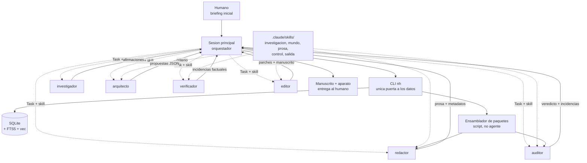
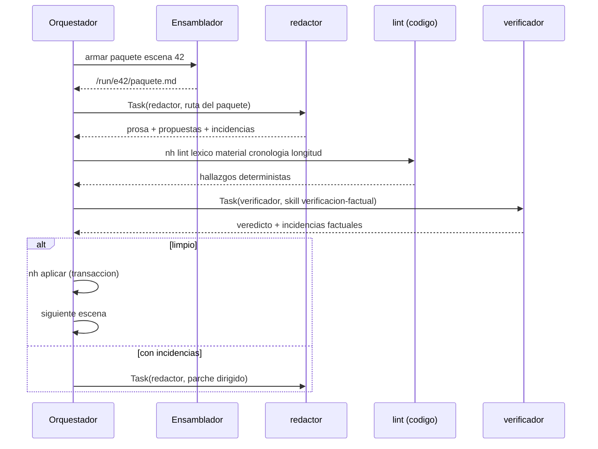
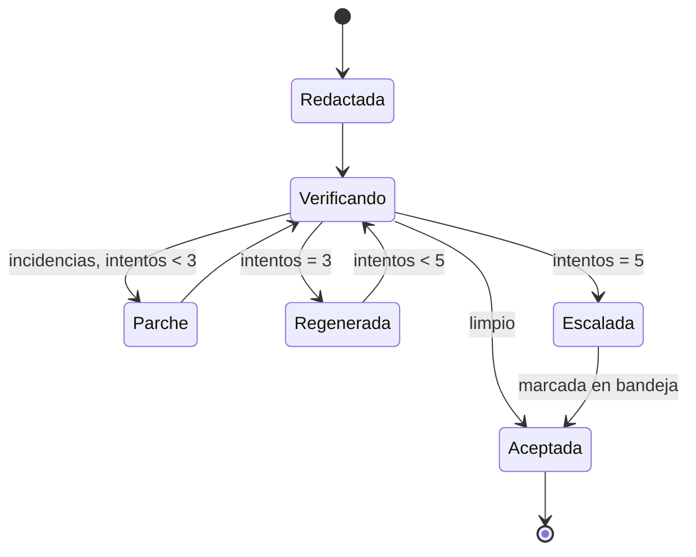
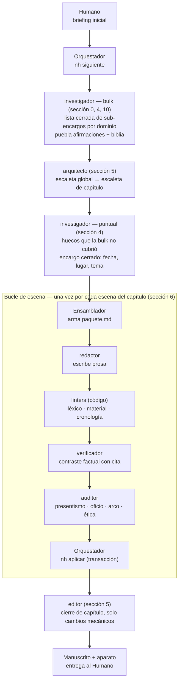

# Arquitectura — Sistema multiagente de novela histórica sobre Claude Code

Documento de arquitectura. Acompaña a las definiciones y los diagramas de la ontología: aquí no se define *qué* se gestiona, sino *quién* lo gestiona, *cómo recibe su contexto* y *cómo se controla el sistema sin humano dentro*.

---

## 0. Decisiones fijadas

| Decisión | Elegida | Consecuencia principal |
|---|---|---|
| Estado | SQLite + índice vectorial | El estado es consultable, no leído entero. Los agentes nunca ven la base: reciben extractos. |
| Orquestación | Subagentes en una sesión de Claude Code | Cada agente tiene ventana limpia y herramientas recortadas. El orquestador solo recibe resúmenes. |
| Humano | Solo al principio y al final | Toda puerta de calidad debe poder decidir sola. El sistema necesita criterio de parada propio. |
| Presupuesto de contexto | 100k tokens concurrentes como techo | La suma de lo que ocupan todos los agentes abiertos a la vez no puede superar 100k. No se puede superar: condiciona cuántos agentes pueden estar abiertos simultáneamente, hoy y sobre todo cuando haya paralelismo real (agent teams, sección 8). |
| Organización del código | Backend: carpeta por feature + `commons`. Frontend: Feature-Sliced Design (FSD) v2.1 | Ambos organizan por feature, pero ya no con la misma convención: el frontend usa FSD guiado por la skill oficial `feature-sliced-design`, que absorbe la ceremonia de capas que antes se rechazaba por costosa de mantener a mano. Detalle en sección 11. |
| Embeddings | FastEmbed (local, ONNX) | Genera los embeddings en local, sin llamada de red ni credenciales por petición — no hay rate limit que gestionar ni catálogo externo que confirmar, a cambio de cómputo (CPU) en la propia máquina en vez de en un proveedor. El modelo ONNX concreto se fija al implementar según el idioma del corpus. Detalle en sección 3. |
| Investigación | Bulk inicial (lista cerrada de sub-encargos) + huecos puntuales por escena | Antes de diseñar ninguna escaleta, el investigador recibe una lista cerrada de sub-encargos acotados por dominio (léxico, material, trato, calendario...), cada uno con su límite de turnos, y puebla de entrada el libro de hechos y la biblia. El arquitecto solo dispara investigación puntual después, para lo que esa lista no cubrió. Sustituye la carga manual de dosier que tenía la fase 1 de construcción (sección 10). Detalle en sección 4. |
| Modelo de los agentes | Haiku para los seis | Antes se diferenciaban también por modelo (Sonnet para `investigador`/`verificador`/`editor`, Opus para `arquitecto`/`redactor`/`auditor`); unificar en Haiku baja coste y latencia por invocación, pero también capacidad de razonamiento — las rúbricas de las puertas de criterio (sección 7) y los umbrales calibrados en la fase 4 de construcción (sección 10) parten de esa capacidad menor, no se heredan sin más de cuando había modelos distintos por agente. Detalle en sección 5. |

La tercera decisión es la que más condiciona el diseño. Sin humano en las puertas, la calidad no se *revisa*: se *mide*. Todo lo que no tenga un criterio de aprobación explícito acabará aprobándose siempre.

### Cómo se garantiza el techo de 100k, no solo se espera

Hoy el presupuesto se cumple porque en la práctica nunca hay nada cerca de 100k — no porque algo lo mida y lo impida. Eso basta mientras la ejecución sea secuencial, pero es una expectativa, no una garantía: nada impide en principio que un paquete, una respuesta del CLI o una generación se disparen. Garantizarlo de verdad exige poner un techo numérico explícito en cada capa, de forma que el peor caso se pueda sumar en papel en vez de solo observarse en producción:

1. **Cada verbo del CLI trunca su propia respuesta.** El truncado por prioridad ya descrito para `nh paquete escena` y `nh paquete arco` (sección 4) se extiende a cualquier verbo que un agente pueda llamar directamente — `nh hechos buscar --k`, `nh columna ventana`, etc.: el CLI recorta su salida a un máximo fijo de tokens, en vez de confiar en que el `--k` de turno se quede corto por casualidad.
2. **Cada turno de generación lleva `max_tokens` explícito en la llamada al modelo.** El campo "extensión" del bloque Encargo (sección 4) es una instrucción para el redactor, no un límite — solo el parámetro `max_tokens` de la propia llamada API impide, pase lo que pase, que una generación se dispare.
3. **`maxTurns` × techo-por-turno da un peor caso calculable por agente.** Con (1) y (2) acotados, el `maxTurns` que ya llevan `auditor`, `arquitecto` y `verificador` (sección 5) deja de ser solo "que no se quede pensando para siempre": si ningún turno supera X tokens y hay como mucho N turnos, el techo de esa invocación es N×X, un número, no una esperanza.
4. **100k se compara contra la suma de esos techos, no contra lo observado.** El techo del orquestador más el techo del agente abierto en ese instante —y, cuando haya paralelismo real (sección 8), más los demás agentes abiertos a la vez— tiene que quedar por debajo de 100k por diseño. Ese es también el punto donde encajaría el gestor de presupuesto que hoy no existe (sección 8): sin él, este cálculo se hace una vez al diseñar los límites; con paralelismo real, hace falta que alguien lo sume en vivo y bloquee antes de abrir un agente que lo superaría.

Hasta que (1)-(3) estén implementados, el techo de 100k es una decisión de diseño respetada por el tamaño típico de las cosas, no una garantía exigible.

---

## 1. Principios

1. **El agente no busca su contexto, lo recibe.** Un script determinista arma el paquete de escena. Si la recuperación la hace el propio redactor, cada escena recibe un contexto distinto y la calidad deja de ser reproducible.
2. **Quien escribe no aprueba.** Ningún agente valida su propia salida. El redactor jamás ejecuta al verificador ni al auditor.
3. **Determinista antes que modelo.** Fechas, ventanas de disponibilidad, léxico fechado, itinerarios: todo eso lo comprueba código. El modelo solo juzga lo que no se puede calcular.
4. **Una sola puerta de escritura.** Los subagentes devuelven propuestas; el orquestador las aplica por el CLI, en transacción. SQLite con varios escritores concurrentes es la primera forma de corromper una novela.
5. **El orquestador no acumula.** Todo lo que sabe está en la base. Se puede matar la sesión en cualquier punto y reanudar sin pérdida.

---

## 2. Topología



El único elemento que no es agente ni base es el **ensamblador de paquetes**: un script que traduce «voy a redactar la escena 42» en un fichero de contexto concreto. Es el corazón del sistema y conviene que no tenga nada de inteligente.

---

## 3. Capa de datos

### Esquema mínimo

```sql
-- Registro histórico
fuentes(id, tipo, titulo, fecha, procedencia, sesgo, fiabilidad)
afirmaciones(id, texto, fecha_ini, fecha_fin, lugar, grado, fuente_ids)
vacios(id, descripcion, ambito_fechas, ambito_tema)

-- Ambientación (biblia)
reglas(id, dominio, texto, ambito_fechas, ambito_lugar, severidad)
   -- dominio: orden_social | mentalidad | material | lengua | economia | calendario
items_material(id, nombre, disp_desde, disp_hasta, lugares, notas)
lexico(termino, primer_uso, ambito, severidad, sustituto)

-- Personas
personajes(id, tipo, nombre, ficha, rol, sensibilidad)
arcos(personaje_id, forma, estado_inicial, estado_final, giros_json)
estado_personaje(personaje_id, punto_columna, saber, creencias, estatus, salud, posesiones, lugar)
relaciones(a_id, b_id, tipo, asimetria, deuda, historial_json)

-- Cronología y texto
eventos(id, tipo, fecha_ini, fecha_fin, lugar, descripcion, afirmacion_id)
itinerarios(personaje_id, fecha_ini, fecha_fin, lugar)
escenas(id, capitulo_id, fecha_mundo, lugar, pov, objetivo, conflicto, giro, gancho, extension_palabras, salida, carga, estado)
hilos(id, nombre, estado_por_escena_json)
prosa(escena_id, version, texto, tokens, creada_por, creada_en)

-- Control
continuidad(id, hecho, escena_origen)            -- solo-anexado
invenciones(id, que, por_que, clausula, divulgar) -- solo-anexado
incidencias(id, escena_id, tipo, severidad, detalle, estado, intentos)
ejecuciones(id, agente, escena_id, tokens_in, tokens_out, coste, veredicto, ts)
```

Dos índices sobre la misma base: **FTS5** para búsqueda léxica (nombres, términos, citas) y **vec** (`sqlite-vec`) para búsqueda semántica sobre el corpus y el libro de hechos. Casi todas las consultas útiles son híbridas: primero filtro duro por fecha y lugar, después semántica sobre lo que queda. El filtro duro va antes, siempre: recuperar semánticamente y luego descartar por fecha trae siempre material de la época equivocada.

Los embeddings que alimentan `vec` se generan en local con **FastEmbed** (decisión fijada en sección 0) — sin API externa, sin credenciales, sin rate limit que gestionar. El pipeline de indexación (trocear, generar, insertar) vive en el CLI `nh` (`nh embeddings indexar`), nunca en el frontend ni directamente contra la base.

### Acceso

Los agentes **no escriben SQL**. Todo pasa por un CLI con verbos cerrados:

```bash
nh hechos buscar --desde 1636-01 --hasta 1637-06 --lugar Amsterdam --tema "tulipanes" --k 12
nh material comprobar --fecha 1636-11-03 --lugar Amsterdam --items "reloj de bolsillo,cafe,tenedor"
nh columna ventana --escena 42 --margen 30d
nh personaje estado --id maerten --en escena:42
nh proponer --tipo continuidad --fichero /run/e42/propuestas.json
```

Tres razones: el CLI es auditable, devuelve siempre la misma forma, y permite que el agente tenga permiso de `Bash` restringido a un solo binario en lugar de acceso a la base.

---

## 4. El paquete de contexto

Lo construye el ensamblador antes de invocar al redactor. Formato fijo, con presupuesto de tokens por bloque y truncado por prioridad:

```
/run/escena-0042/paquete.md

## Encargo            (150 tok)   objetivo, conflicto, giro, gancho, extensión
## Fecha y lugar      (100 tok)   3 nov 1636, Ámsterdam, calendario gregoriano
## Reparto            (900 tok)   ficha reducida de cada personaje EN ESCENA
## Estado ahora     (1.200 tok)   qué sabe y cree cada uno, heridas, estatus
## Relaciones          (400 tok)   solo los pares que se cruzan aquí
## Posición en el arco (250 tok)   qué giro toca y cuál no toca todavía
## Reglas aplicables (1.000 tok)   orden social y mentalidad filtrados por lo que ocurre
## Material y sensorio (600 tok)   qué hay, qué se oye y se huele ese día en ese sitio
## Hechos             (800 tok)   afirmaciones con cita que la escena va a tocar
## Continuidad         (500 tok)   lo ya establecido que no puede contradecirse
## Antes                (700 tok)   final de la escena anterior, literal
## Capítulos antes     (400 tok)   sinopsis comprimida de los últimos 2-3 capítulos cerrados
## Registro            (300 tok)   presupuesto de arcaísmo, tratamiento, tics prohibidos
```

Unos 7.300 tokens. Cabe holgadamente, y lo importante es lo que **no** lleva: la biblia entera, el corpus, las escenas anteriores completas, la sinopsis de la novela entera. Si el redactor necesita algo que no está en el paquete, no lo busca: devuelve `falta_contexto` con la petición concreta, el ensamblador la resuelve y se reintenta. Esa señal es además el mejor diagnóstico de qué le falta al ensamblador.

**"Antes" vs "Capítulos antes".** No es el mismo bloque con dos nombres. "Antes" es el final literal de la escena inmediatamente anterior — continuidad de frase a frase. "Capítulos antes" es la sinopsis ya comprimida de lo que pasó en los capítulos previos — memoria a medio plazo, no el texto en sí. Ninguno de los dos es la novela entera: eso es justo lo que la ventana evita.

**Otros paquetes.** El de escena no es el único, y no todos los agentes reciben un paquete con el mismo formato de bloques y presupuesto:

- `nh paquete arco --personaje X` reúne el arco de un personaje con su ficha (forma, estado inicial/final, giros) y el **registro estructurado** de cada escena donde aparece — qué giro tocó, qué cambió en `estado_personaje` —, nunca la prosa completa de esas escenas. Es la misma regla que ya rige la memoria a largo plazo (más abajo, "Memoria a corto y largo plazo"): tablas estructuradas filtradas por relevancia, sin ventana temporal. Windowear este paquete como el de escena rompería lo que el control de arco necesita verificar — si un giro plantado en la escena 3 se paga en la escena 250, hace falta poder ver las dos, no una ventana reciente —, así que en vez de acotar por tamaño se acota por densidad: un personaje con arco en 150 escenas genera 150 entradas breves, no 150 prosas completas. `nh paquete etica --escena N` reúne la escena con los motivos documentados de las figuras reales que aparecen. Los arma el mismo script, y son los que permiten que el auditor trabaje sin acceso a la base. El control de presentismo del auditor no necesita paquete propio: trabaja directo sobre la prosa de la escena.
- El **investigador** no recibe un paquete ensamblado: recibe encargos cerrados, nunca decide por su cuenta qué investigar — coherente con el principio 1 aplicado al revés. Corre en dos momentos distintos:
  - **Bulk, al principio.** Antes de diseñar ninguna escaleta, no recibe un encargo abierto tipo "investiga la ambientación", sino una **lista cerrada de sub-encargos** — léxico cotidiano, objetos materiales, normas de trato, calendario y monedas, y los demás dominios de `reglas` (sección 3) — que fija el arquitecto (o el humano en el briefing) a partir del periodo, lugar(es) y clase(s) social(es) de la novela. Cada sub-encargo tiene su propio límite de turnos, igual que el resto de agentes (sección 5): el investigador nunca decide cuándo "ya investigó bastante", se le acaba la lista. El resultado puebla de entrada el libro de hechos (`afirmaciones`); ese corpus es también el material con el que se cura la biblia (`reglas`, `items_material`, `lexico`). Es el primer agente que corre en todo el sistema (sección 10, fase 2), y sustituye la carga manual de dosier que tenía antes esa fase.
  - **Puntual, durante la escaleta.** El arquitecto detecta lo que la bulk no cubrió y el orquestador le pasa ese hueco tal cual al investigador (ventana de fechas, lugar, tema) — el mecanismo que ya existía, ahora como excepción y no como única vía.
- El **verificador** tampoco recibe paquete: recibe la prosa ya escrita de la escena y `Bash(nh)` para consultar activamente el libro de hechos ya ingerido. Es el único agente que busca en vez de recibir — por eso no tiene sentido pre-armarle nada.
- El **editor** trabaja a nivel de capítulo, no de escena, y solo cuando todas las escenas de ese capítulo están `Aceptada`: recibe la prosa final de las escenas de ese capítulo (para ensamblarlas), más el estado ya comprimido/estructurado (sinopsis rodante, libro de continuidad, estado de personaje, canon) para su pasada de consistencia — nunca relee la prosa cruda de capítulos anteriores ya cerrados. Ver sección 5 para el alcance exacto de lo que puede y no puede cambiar.

**Regla de filtrado por reglas aplicables.** No se mandan las 200 reglas del orden social, sino las que tocan lo que pasa en la escena: si hay una transacción, las de comercio y moneda; si hay un encuentro entre clases, las de tratamiento y etiqueta. Se etiquetan las reglas por disparador en el momento de escribirlas en la biblia.

**Memoria a corto y largo plazo.** Son dos mecanismos distintos, no dos tamaños del mismo mecanismo:

- **Corto plazo — el estado narrativo rodante.** Es prosa comprimida, no hechos estructurados, y vive en la base (principio 5: el orquestador no acumula, todo lo que sabe está en la base). Se comprime al cerrar cada capítulo, mediante una skill de resumen (una llamada a modelo, no un paso determinista: capturar matices de tono y ritmo no es extracción de campos). Al paquete de una escena solo entra una **ventana** de los últimos 2-3 capítulos comprimidos, nunca la sinopsis acumulada completa — así el bloque no crece sin límite en una novela de cientos de escenas. Lo que queda fuera de la ventana sigue en la base, pero no se recupera activamente salvo que haga falta un detalle concreto, y ese detalle se pide al libro de continuidad, no a la sinopsis.
- **Largo plazo — las tablas estructuradas.** Estado de personaje, relaciones, continuidad, arcos, invenciones. No están sujetas a ventana temporal: se filtran por **relevancia** (el reparto presente en la escena, los pares que se cruzan), no por antigüedad. Una escena del capítulo 20 puede recuperar un rasgo fijado en el capítulo 1 sin pasar por la sinopsis, porque ese rasgo vive en `estado_personaje`, no en prosa.

La diferencia importa porque cada una falla de un modo distinto: si la ventana de corto plazo es demasiado corta, el redactor pierde el tono reciente pero no los hechos (siguen en las tablas); si el libro de continuidad está incompleto, se pierde algo que ninguna ventana habría salvado.

---

## 5. Agentes y skills

Seis agentes. Algo merece ser agente solo si necesita ventana limpia, herramientas recortadas, independencia de juicio u otro modelo. Todo lo demás —criterio, método, vocabulario, umbrales— es **skill**.

| Agente | Modelo | Herramientas | Existe porque |
|---|---|---|---|
| `investigador` | Haiku | WebSearch, WebFetch, Read, Bash(nh) | único con acceso a la web |
| `arquitecto` | Haiku | Read, Bash(nh) | sus cuatro tareas comparten contexto de verdad |
| `redactor` | Haiku | Read | la restricción le impide saltarse el paquete |
| `verificador` | Haiku | Read, Bash(nh) | contrastar no es juzgar, y corre en todas las escenas |
| `auditor` | Haiku | Read | juzga lo que hay en la página, no lo que podría justificarlo |
| `editor` | Haiku | Read, Write, Bash(nh) | único con escritura en disco |

Los seis usan el mismo modelo — decisión fijada en sección 0 — así que ninguno se justifica ya por "otro modelo" del criterio de arriba: los seis se diferencian entre sí solo por herramientas y por lo que reciben (paquete, encargo cerrado, o búsqueda propia).

**Límite de turnos para quien busca en vez de recibir.** `arquitecto` y `verificador` no reciben un paquete acotado: consultan el CLI por su cuenta (`Bash(nh)`), así que nada les impone un techo a cuánto contexto acumulan dentro de una misma invocación si una escaleta se complica o una escena tiene muchas afirmaciones que contrastar. Llevan `maxTurns` en su definición, igual que ya lleva `auditor` en el ejemplo de más abajo — mismo mecanismo, aplicado también a los dos agentes que buscan en vez de recibir, no solo al que juzga.

Las skills se agrupan en cinco familias: `investigacion/`, `mundo/`, `prosa/`, `control/` y `salida/`. El detalle está en `AGENTS.md`.

### Las cuatro tareas del arquitecto

Comparten contexto de verdad porque las cuatro parten de la misma escaleta:

1. **Escaleta global** — la estructura de la novela completa, hilos y giros mayores.
2. **Escaleta de capítulo** — la traducción de esa estructura a escenas concretas.
3. **Plan de investigación** — al diseñar la escaleta, detecta qué hecho histórico concreto necesita y la investigación bulk inicial no cubrió; ese hueco puntual es el encargo cerrado que el orquestador le pasa al investigador (sección 4, "Otros paquetes").
4. **Auditoría de arco** — comparte la skill `auditoria-arco` con el auditor (mismo vocabulario de formas de arco, un solo sitio donde vive la definición).

### El orquestador: no es uno de los seis

El orquestador también es una sesión de Claude Code — no hay otra forma de que tome decisiones —, pero no aparece en la tabla anterior porque no cumple el criterio que abre esta sección: no tiene ventana limpia (mantiene la conversación completa de principio a fin), no tiene herramientas recortadas frente a sí mismo, y sobre todo no aporta independencia de juicio. Es la sesión que invoca a los demás con `Task`, no una que otro invoque — el criterio de la tabla es para quien es invocado, no para quien invoca.

Esto es diseño, no una omisión. La sección 8 lo llama por su nombre: el orquestador se mantiene **deliberadamente tonto**. Su trabajo es mecánico — seguir la máquina de estados de convergencia (sección 7: contar parches, contar regeneraciones, aplicar el umbral de escalada), invocar al agente que toca según ese protocolo y aplicar lo que devuelve vía `nh aplicar`. No pondera con criterio propio si una escena es buena: eso es justo lo que delega en `verificador` y `auditor` (principio 5, "el orquestador no acumula"). Por eso no tiene skill de criterio propia y no está en ninguna de las cinco familias. Sí aparece como nodo en el diagrama de topología (sección 2) — ahí es un actor del sistema, solo que uno sin juicio propio.

### El editor: pasada final, no parte del bucle de escena

El editor no aparece en el bucle de escena (sección 6) ni en el diagrama de convergencia (sección 7) porque no participa en ellos: los parches durante el bucle los hace el propio redactor. El editor corre **una vez por capítulo**, después de que todas sus escenas están `Aceptada`, nunca antes y nunca a nivel de escena suelta.

Su autoridad es deliberadamente estrecha: **solo cambios mecánicos** — sustituciones de `registro-de-epoca`, formato, cosido entre escenas. Nunca reescribe contenido ni introduce una afirmación nueva. Es lo que permite que sea el último paso antes de entregar al humano (sección 2) sin que haga falta una puerta de verificación después de él: no puede producir el tipo de error — factual, anacrónico — que las puertas anteriores existen para atrapar, porque no toca el contenido que esas puertas ya aprobaron.

### Por qué los controles se reparten así

`verificador` y `auditor` no se separan por tarea. Antes tampoco se separaban solo por herramientas — `verificador` iba en Sonnet y `auditor` en Opus, porque contrastar es más barato que juzgar—; con los seis agentes en Haiku (sección 0) esa diferencia de coste desaparece, y lo que queda es la de herramientas.

**`verificador` necesita búsqueda abierta.** Comprobar si una concreción histórica está respaldada es extracción y contraste, no criterio, pero es el único control que necesita salir a buscar: para saber si una afirmación existe hay que ir a por ella, y eso no se puede pre-armar. Por eso lleva `Bash(nh)` y corre en todas las escenas — sigue siendo el gasto recurrente del sistema, ahora ya no por el modelo sino por el volumen (una vez por escena, frente a una vez por control de criterio).

**`auditor` se separa por herramientas.** Lleva las tres skills de criterio —presentismo, arco y ética— y no tiene acceso a la base, deliberadamente. El caso que lo explica es el presentismo: si puede consultar, ante un pasaje dudoso se irá a buscar si alguien en 1636 escribió algo parecido, y siempre encuentra algo. La pregunta no es si *era posible* que alguien pensara así, sino si *este personaje, con este rol y esta mentalidad, en esta escena* suena a su siglo. Quitarle la base es lo que le obliga a responder a la pregunta que se le hace.

Las otras dos skills de criterio parecían necesitar consulta y no la necesitan: la auditoría de arco necesita todas las escenas de un personaje, y la revisión ética necesita los motivos documentados de una figura real. En ambos casos es material que el ensamblador puede armar por adelantado (`nh paquete arco`, `nh paquete etica`). Es el principio 1 aplicado también a quien juzga: el agente no busca su contexto, lo recibe.

**El aislamiento es por invocación, no por agente.** `auditor` se llama una vez por control, con una sola skill. La auditoría de arco lee todas las escenas de un personaje y no puede compartir ventana con la lectura de presentismo.

**Quien investiga no se gradúa a sí mismo.** El grado de evidencia lo calcula `nh graduar` por tipo y número de fuentes; el agente solo puede corregirlo justificándolo.

Consolidar no ahorra tokens: cada invocación sigue siendo una ventana propia. Lo que gana es **criterio compartido**. `registro-de-epoca` la usan redactor y editor, así que los dos aplican la misma definición de presupuesto de arcaísmo; `auditoria-arco` la usan arquitecto y auditor, así que el vocabulario de formas de arco vive en un solo sitio.

Los barridos léxico, material y cronológico no son agentes ni skills: son comandos (`nh lint …`) que corren en segundos y no alucinan.

Ejemplo de definición:

```markdown
---
name: auditor
description: Aplica un control de criterio sobre prosa ya escrita. Una skill por invocación.
tools: Read
model: haiku
maxTurns: 8
---
Aplicas un solo control, el que te indique el encargo, sobre el material que
se te entrega.

No tienes base de datos ni búsqueda. Si un pasaje te parece dudoso, no vas a
comprobar si algo así fue posible alguna vez: decides si encaja con la
mentalidad y el rol que tienes delante.

No juzgas nada que no puedas citar. Devuelve una incidencia por hallazgo, con
su fragmento, su motivo y una sugerencia de reformulación.
```

Las herramientas recortadas hacen aquí un trabajo real: `redactor` con `tools: Read` no puede saltarse su paquete, y `auditor` con `tools: Read` no puede irse a buscar coartadas. La restricción es lo que garantiza el principio 1.

## 6. Bucle de escena



El orden importa: primero lo barato y determinista, después el juicio del modelo. No tiene sentido gastar un verificador sobre una escena que el linter léxico ya rechaza.

---

## 7. Puertas sin humano

Cada puerta es un trío: **medida, umbral, salida**. Si a una puerta le falta el umbral, no es una puerta.

| Puerta | Cómo decide | Umbral |
|---|---|---|
| Cronología | código | cero colisiones |
| Léxico y material | código | cero de severidad alta |
| Longitud | código, cuenta palabras de `prosa.texto` contra `escenas.extension_palabras` | dentro de un margen (p. ej. ±20%) del objetivo fijado por el arquitecto |
| Factual | `verificador` con cita obligatoria | cero contradicciones con grado alto |
| Presentismo | `auditor`, dos pasadas con semilla distinta | acuerdo y puntuación ≥ 4/5 |
| Oficio | `auditor` con rúbrica sobre muestra | ≥ 3,5/5 y sin tic repetido |
| Arco | `auditor`, un personaje por invocación | cada cambio tiene escena que lo produce |
| Ética | `auditor` sobre escenas marcadas | veredicto binario |

Dos salvaguardas contra la aprobación automática: quien juzga **cita el fragmento** que justifica cada puntuación, y en las puertas de criterio se lanza dos veces con semilla distinta; si discrepan, pasa por defecto a incidencia y no a aprobado.

### Convergencia



Tres parches, dos regeneraciones, y después se acepta **marcada**. Un sistema autónomo que no acepta nada nunca termina; uno que no marca nada entrega basura sin avisar. La bandeja de excepciones se entrega junto al manuscrito: es la parte del informe final que el humano lee primero.

Criterios de parada dura, que sí abortan la ejecución: más del 15 % de escenas en bandeja, coste por encima del presupuesto, o contradicción detectada en la biblia (si el orden social se contradice, todo lo redactado después es sospechoso).

---

## 8. Escrituras, concurrencia y reanudación

- **Un solo escritor.** Los subagentes devuelven JSON; el orquestador ejecuta `nh aplicar`. SQLite en modo WAL, escrituras en transacción por escena.
- **Solo-anexado de verdad.** Continuidad, invenciones e incidencias no se actualizan ni se borran: se anexan con marca temporal. Es lo que permite reconstruir por qué el sistema hizo algo.
- **Idempotencia.** Cada aplicación lleva la clave `escena:42:v3`. Reintentar no duplica.
- **Reanudación.** El orquestador arranca siempre con `nh siguiente`, que devuelve el trabajo pendiente. Da igual si la sesión se cortó a mitad: no hay estado en la conversación.

Esta última es la mitigación del riesgo grande de la opción elegida. Una novela son cientos de escenas y la sesión no aguanta todo el recorrido con contexto útil. Solución: el orquestador se mantiene deliberadamente tonto y cada capítulo puede correrse en una sesión nueva, en modo no interactivo, con un script que llame a `claude -p` en bucle. Si más adelante necesitas agentes en paralelo de verdad, ahí es donde entran los *agent teams*, que coordinan sesiones separadas; con subagentes el paralelismo real es limitado y, para escenas de un mismo capítulo, tampoco es deseable: comparten estado de personaje.

El presupuesto de contexto (sección 0) pone además un techo duro a ese paralelismo: la suma de tokens de todos los agentes abiertos a la vez —orquestador incluido— no puede superar 100k en ningún momento. Diseñar *agent teams* sin contarlo produce sesiones que se disparan de golpe por encima del presupuesto en cuanto corren dos o tres agentes a la vez.

---

## 9. Observabilidad

La tabla `ejecuciones` registra agente, escena, tokens, coste y veredicto. Con eso salen las tres métricas que gobiernan el sistema:

- **Tasa de primera pasada** por agente: qué porcentaje de escenas pasa las puertas sin parche. Si baja, el problema casi siempre está en el paquete, no en el redactor.
- **Incidencias por tipo**: si dominan las factuales, falta investigación; si dominan las de presentismo, la mentalidad está poco especificada.
- **Coste por escena aceptada**, no por llamada. Es la única cifra que dice si el sistema es viable.

Añade una sonda barata y muy reveladora: cuenta cuántas veces el redactor devuelve `falta_contexto` y sobre qué. Es el ensamblador diciéndote qué le falta.

---

## 10. Fases de construcción

1. **Base y CLI**, sin agentes. Comprobar que las consultas híbridas devuelven lo que deben, con una carga mínima de prueba.
2. **Investigación bulk**. Primer agente que corre en todo el sistema: al investigador se le da una lista cerrada de sub-encargos por dominio (léxico, material, trato, calendario...), cada uno con su límite de turnos, para poblar `afirmaciones` y curar la biblia (`reglas`, `items_material`, `lexico`) antes de diseñar ninguna escena.
3. **Linters deterministas**. Fechas, léxico, material, longitud. Son baratos, no fallan y ya atrapan la mitad de los errores del género.
4. **Ensamblador + redactor**, una escena escrita a mano de principio a fin. Aquí se decide la calidad del sistema entero.
5. **Puertas de criterio** con sus rúbricas, calibradas contra escenas que sabes buenas y malas.
6. **Orquestador y bucle completo** sobre un capítulo.
7. **Novela entera**, con bandeja de excepciones y presupuesto.

Lo que fallará primero, por orden de probabilidad: el paquete traerá reglas de más y detalle sensorial de menos; el verificador aprobará concreciones inventadas porque nadie le obligó a citar; y el arco de los personajes secundarios se quedará plano porque ninguna puerta lo mira hasta el final.

---

## 11. Organización del código

Esto es sobre las carpetas de `backend/` y `frontend/`, no sobre el modelo de agentes de las secciones anteriores.

**Backend.** Una carpeta por feature, más `commons/` para lo transversal:

```text
backend/
    <feature>/      -- p. ej. proyectos/, ejecuciones/, bandeja/
        router.py
        modelos.py
        ...
    commons/         -- solo infraestructura técnica, nunca lógica de negocio
        cliente_nh.py   -- invocación del CLI nh (ver skill fastapi)
        errores.py
        config.py
```

`commons/` es solo infraestructura técnica compartida: el cliente que invoca `nh`, manejo de errores, config, tipos base. Nada de lógica de negocio de ninguna feature concreta — si algo empieza a acumular reglas de una feature específica, no es `commons`, es que esa feature necesita su propia carpeta.

**Frontend.** Feature-Sliced Design (FSD) v2.1, aplicado por la skill `feature-sliced-design` (`.claude/skills/feature-sliced-design/`, copia sin modificar de la skill oficial de [fsd.how](https://feature-sliced.design), traída del repositorio `feature-sliced/skills`). FSD organiza por capas (`app/pages/widgets/features/entities/shared`) con reglas estrictas de qué capa importa a cuál — pensadas para aplicaciones grandes con muchos equipos, y ese era el motivo por el que antes se descartaba para una interfaz de un solo Autor.

Lo que cambió no fue el juicio sobre la ceremonia, sino quién la paga: la skill aplica y mantiene las capas, así que el coste que motivó el rechazo original —sostenerlas a mano— deja de recaer en quien escribe código aquí. La propia skill, además, empuja hacia el extremo simple de FSD: "empieza en `pages/`, extrae solo cuando haga falta", desaconseja la capa `widgets/`, y un proyecto mínimo válido es solo `app/ + pages/ + shared/` — no exige adoptar las seis capas de golpe.

Es una dependencia externa que se instaló tal cual, sin adaptar: se actualiza siguiendo el repositorio oficial, no como convención propia escrita para StoryMaker (a diferencia de `fastapi`, `sqlite`, `threejs` o `react`, que sí lo son).

Ni `backend/` ni `frontend/` tienen código todavía — esto fija el principio para cuando empiece la implementación, no una lista cerrada de features ni de slices.

---

## 12. Happy path de principio a fin

Resumen visual del recorrido completo sin incidencias — ninguna escena entra en `Parche`, `Regenerada` ni `Escalada` (esas rutas están en la sección 7). Sirve para explicar el sistema de un vistazo; el detalle de cada paso está en las secciones citadas entre paréntesis.



El avance va siempre en un solo sentido, sin flechas de vuelta: el diagrama dibuja un recorrido — un capítulo, una escena — no las repeticiones. Lo que se repite queda dicho en texto, no en el dibujo: los pasos de `arquitecto` a `editor` se repiten una vez por cada capítulo de la escaleta global, y dentro de `BUCLE` esos seis pasos se repiten una vez por cada escena de ese capítulo (el detalle de ambos ciclos, con sus salidas por incidencias, está en las secciones 6 y 7).

**Lectura rápida:** todo lo que no es un agente en este diagrama es determinista — el orquestador, el ensamblador y los linters no tienen criterio propio, solo aplican reglas y protocolo (sección 5, "El orquestador: no es uno de los seis"). De los seis agentes, solo tres tienen juicio sobre la prosa en sí (redactor, verificador, auditor); investigador y arquitecto trabajan antes de que exista ninguna escena escrita, y el editor solo después de que todas están `Aceptada`.
