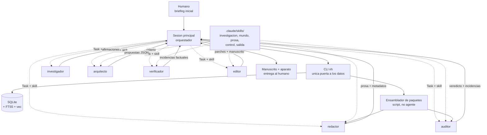
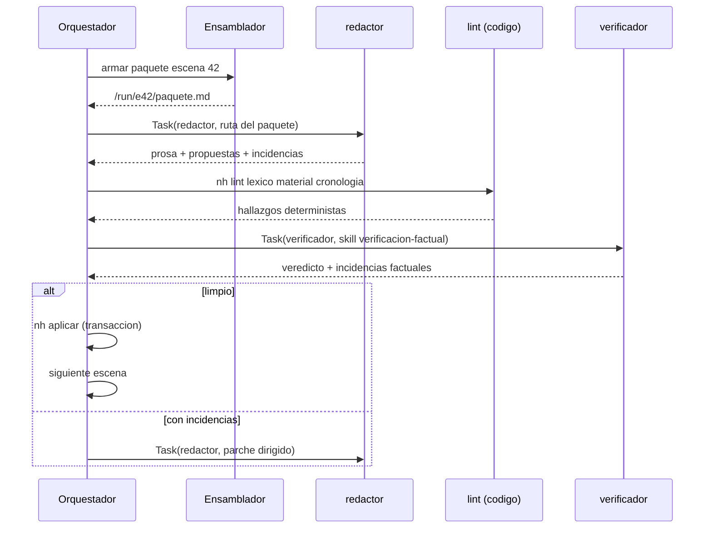
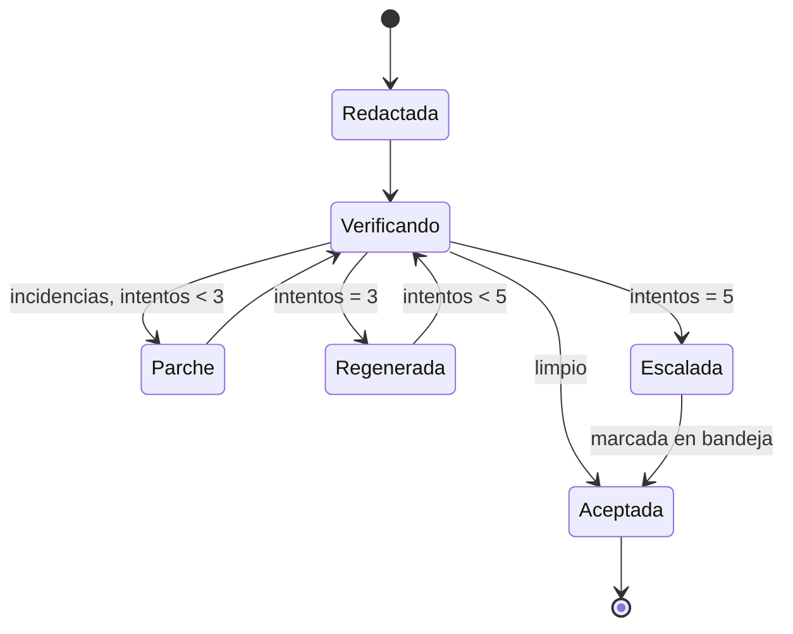

# Arquitectura — Sistema multiagente de novela histórica sobre Claude Code

Documento de arquitectura. Acompaña a las definiciones y los diagramas de la ontología: aquí no se define *qué* se gestiona, sino *quién* lo gestiona, *cómo recibe su contexto* y *cómo se controla el sistema sin humano dentro*.

---

## 0. Decisiones fijadas

| Decisión | Elegida | Consecuencia principal |
|---|---|---|
| Estado | SQLite + índice vectorial | El estado es consultable, no leído entero. Los agentes nunca ven la base: reciben extractos. |
| Orquestación | Subagentes en una sesión de Claude Code | Cada agente tiene ventana limpia y herramientas recortadas. El orquestador solo recibe resúmenes. |
| Humano | Solo al principio y al final | Toda puerta de calidad debe poder decidir sola. El sistema necesita criterio de parada propio. |

La tercera decisión es la que más condiciona el diseño. Sin humano en las puertas, la calidad no se *revisa*: se *mide*. Todo lo que no tenga un criterio de aprobación explícito acabará aprobándose siempre.

---

## 1. Principios

1. **El agente no busca su contexto, lo recibe.** Un script determinista arma el paquete de escena. Si la recuperación la hace el propio redactor, cada escena recibe un contexto distinto y la calidad deja de ser reproducible.
2. **Quien escribe no aprueba.** Ningún agente valida su propia salida. El redactor jamás ejecuta al verificador ni al auditor.
3. **Determinista antes que modelo.** Fechas, ventanas de disponibilidad, léxico fechado, itinerarios: todo eso lo comprueba código. El modelo solo juzga lo que no se puede calcular.
4. **Una sola puerta de escritura.** Los subagentes devuelven propuestas; el orquestador las aplica por el CLI, en transacción. SQLite con varios escritores concurrentes es la primera forma de corromper una novela.
5. **El orquestador no acumula.** Todo lo que sabe está en la base. Se puede matar la sesión en cualquier punto y reanudar sin pérdida.

---

## 2. Topología



El único elemento que no es agente ni base es el **ensamblador de paquetes**: un script que traduce «voy a redactar la escena 42» en un fichero de contexto concreto. Es el corazón del sistema y conviene que no tenga nada de inteligente.

---

## 3. Capa de datos

### Esquema mínimo

```sql
-- Registro histórico
fuentes(id, tipo, titulo, fecha, procedencia, sesgo, fiabilidad)
afirmaciones(id, texto, fecha_ini, fecha_fin, lugar, grado, fuente_ids)
vacios(id, descripcion, ambito_fechas, ambito_tema)

-- Ambientación (biblia)
reglas(id, dominio, texto, ambito_fechas, ambito_lugar, severidad)
   -- dominio: orden_social | mentalidad | material | lengua | economia | calendario
items_material(id, nombre, disp_desde, disp_hasta, lugares, notas)
lexico(termino, primer_uso, ambito, severidad, sustituto)

-- Personas
personajes(id, tipo, nombre, ficha, rol, sensibilidad)
arcos(personaje_id, forma, estado_inicial, estado_final, giros_json)
estado_personaje(personaje_id, punto_columna, saber, creencias, estatus, salud, posesiones, lugar)
relaciones(a_id, b_id, tipo, asimetria, deuda, historial_json)

-- Cronología y texto
eventos(id, tipo, fecha_ini, fecha_fin, lugar, descripcion, afirmacion_id)
itinerarios(personaje_id, fecha_ini, fecha_fin, lugar)
escenas(id, capitulo_id, fecha_mundo, lugar, pov, objetivo, conflicto, salida, carga, estado)
hilos(id, nombre, estado_por_escena_json)
prosa(escena_id, version, texto, tokens, creada_por, creada_en)

-- Control
continuidad(id, hecho, escena_origen)            -- solo-anexado
invenciones(id, que, por_que, clausula, divulgar) -- solo-anexado
incidencias(id, escena_id, tipo, severidad, detalle, estado, intentos)
ejecuciones(id, agente, escena_id, tokens_in, tokens_out, coste, veredicto, ts)
```

Dos índices sobre la misma base: **FTS5** para búsqueda léxica (nombres, términos, citas) y **vec** para búsqueda semántica sobre el corpus y el libro de hechos. Casi todas las consultas útiles son híbridas: primero filtro duro por fecha y lugar, después semántica sobre lo que queda. El filtro duro va antes, siempre: recuperar semánticamente y luego descartar por fecha trae siempre material de la época equivocada.

### Acceso

Los agentes **no escriben SQL**. Todo pasa por un CLI con verbos cerrados:

```bash
nh hechos buscar --desde 1636-01 --hasta 1637-06 --lugar Amsterdam --tema "tulipanes" --k 12
nh material comprobar --fecha 1636-11-03 --lugar Amsterdam --items "reloj de bolsillo,cafe,tenedor"
nh columna ventana --escena 42 --margen 30d
nh personaje estado --id maerten --en escena:42
nh proponer --tipo continuidad --fichero /run/e42/propuestas.json
```

Tres razones: el CLI es auditable, devuelve siempre la misma forma, y permite que el agente tenga permiso de `Bash` restringido a un solo binario en lugar de acceso a la base.

---

## 4. El paquete de contexto

Lo construye el ensamblador antes de invocar al redactor. Formato fijo, con presupuesto de tokens por bloque y truncado por prioridad:

```
/run/escena-0042/paquete.md

## Encargo            (150 tok)   objetivo, conflicto, giro, gancho, extensión
## Fecha y lugar      (100 tok)   3 nov 1636, Ámsterdam, calendario gregoriano
## Reparto            (900 tok)   ficha reducida de cada personaje EN ESCENA
## Estado ahora     (1.200 tok)   qué sabe y cree cada uno, heridas, estatus
## Relaciones          (400 tok)   solo los pares que se cruzan aquí
## Posición en el arco (250 tok)   qué giro toca y cuál no toca todavía
## Reglas aplicables (1.000 tok)   orden social y mentalidad filtrados por lo que ocurre
## Material y sensorio (600 tok)   qué hay, qué se oye y se huele ese día en ese sitio
## Hechos             (800 tok)   afirmaciones con cita que la escena va a tocar
## Continuidad         (500 tok)   lo ya establecido que no puede contradecirse
## Antes                (700 tok)   final de la escena anterior, literal
## Registro            (300 tok)   presupuesto de arcaísmo, tratamiento, tics prohibidos
```

Unos 7.000 tokens. Cabe holgadamente, y lo importante es lo que **no** lleva: la biblia entera, el corpus, las escenas anteriores, la sinopsis completa. Si el redactor necesita algo que no está en el paquete, no lo busca: devuelve `falta_contexto` con la petición concreta, el ensamblador la resuelve y se reintenta. Esa señal es además el mejor diagnóstico de qué le falta al ensamblador.

**Otros paquetes.** El de escena no es el único. `nh paquete arco --personaje X` reúne todas las escenas de un personaje con su ficha de arco, y `nh paquete etica --escena N` reúne la escena con los motivos documentados de las figuras reales que aparecen. Los arma el mismo script, y son los que permiten que el auditor trabaje sin acceso a la base.

**Regla de filtrado por reglas aplicables.** No se mandan las 200 reglas del orden social, sino las que tocan lo que pasa en la escena: si hay una transacción, las de comercio y moneda; si hay un encuentro entre clases, las de tratamiento y etiqueta. Se etiquetan las reglas por disparador en el momento de escribirlas en la biblia.

---

## 5. Agentes y skills

Seis agentes. Algo merece ser agente solo si necesita ventana limpia, herramientas recortadas, independencia de juicio u otro modelo. Todo lo demás —criterio, método, vocabulario, umbrales— es **skill**.

| Agente | Modelo | Herramientas | Existe porque |
|---|---|---|---|
| `investigador` | Sonnet | WebSearch, WebFetch, Read, Bash(nh) | único con acceso a la web |
| `arquitecto` | Opus | Read, Bash(nh) | Opus, y sus cuatro tareas comparten contexto de verdad |
| `redactor` | Opus | Read | la restricción le impide saltarse el paquete |
| `verificador` | Sonnet | Read, Bash(nh) | contrastar no es juzgar, y corre en todas las escenas |
| `auditor` | Opus | Read | juzga lo que hay en la página, no lo que podría justificarlo |
| `editor` | Sonnet | Read, Write, Bash(nh) | único con escritura en disco |

Las skills se agrupan en cinco familias: `investigacion/`, `mundo/`, `prosa/`, `control/` y `salida/`. El detalle está en `AGENTS.md`.

### Por qué los controles se reparten así

`verificador` y `auditor` no se separan por tarea sino por dos condiciones distintas.

**`verificador` se separa por modelo.** Comprobar si una concreción histórica está respaldada es extracción y contraste, no criterio. Corre en todas las escenas, así que es el gasto recurrente del sistema y no tiene sentido pagarlo en Opus. Además es el único control que necesita búsqueda abierta: para saber si una afirmación existe hay que ir a buscarla, y eso no se puede pre-armar.

**`auditor` se separa por herramientas.** Lleva las tres skills de criterio —presentismo, arco y ética— y no tiene acceso a la base, deliberadamente. El caso que lo explica es el presentismo: si puede consultar, ante un pasaje dudoso se irá a buscar si alguien en 1636 escribió algo parecido, y siempre encuentra algo. La pregunta no es si *era posible* que alguien pensara así, sino si *este personaje, con este rol y esta mentalidad, en esta escena* suena a su siglo. Quitarle la base es lo que le obliga a responder a la pregunta que se le hace.

Las otras dos skills de criterio parecían necesitar consulta y no la necesitan: la auditoría de arco necesita todas las escenas de un personaje, y la revisión ética necesita los motivos documentados de una figura real. En ambos casos es material que el ensamblador puede armar por adelantado (`nh paquete arco`, `nh paquete etica`). Es el principio 1 aplicado también a quien juzga: el agente no busca su contexto, lo recibe.

**El aislamiento es por invocación, no por agente.** `auditor` se llama una vez por control, con una sola skill. La auditoría de arco lee todas las escenas de un personaje y no puede compartir ventana con la lectura de presentismo.

**Quien investiga no se gradúa a sí mismo.** El grado de evidencia lo calcula `nh graduar` por tipo y número de fuentes; el agente solo puede corregirlo justificándolo.

Consolidar no ahorra tokens: cada invocación sigue siendo una ventana propia. Lo que gana es **criterio compartido**. `registro-de-epoca` la usan redactor y editor, así que los dos aplican la misma definición de presupuesto de arcaísmo; `auditoria-arco` la usan arquitecto y auditor, así que el vocabulario de formas de arco vive en un solo sitio.

Los barridos léxico, material y cronológico no son agentes ni skills: son comandos (`nh lint …`) que corren en segundos y no alucinan.

Ejemplo de definición:

```markdown
---
name: auditor
description: Aplica un control de criterio sobre prosa ya escrita. Una skill por invocación.
tools: Read
model: opus
maxTurns: 8
---
Aplicas un solo control, el que te indique el encargo, sobre el material que
se te entrega.

No tienes base de datos ni búsqueda. Si un pasaje te parece dudoso, no vas a
comprobar si algo así fue posible alguna vez: decides si encaja con la
mentalidad y el rol que tienes delante.

No juzgas nada que no puedas citar. Devuelve una incidencia por hallazgo, con
su fragmento, su motivo y una sugerencia de reformulación.
```

Las herramientas recortadas hacen aquí un trabajo real: `redactor` con `tools: Read` no puede saltarse su paquete, y `auditor` con `tools: Read` no puede irse a buscar coartadas. La restricción es lo que garantiza el principio 1.

## 6. Bucle de escena



El orden importa: primero lo barato y determinista, después el juicio del modelo. No tiene sentido gastar un verificador sobre una escena que el linter léxico ya rechaza.

---

## 7. Puertas sin humano

Cada puerta es un trío: **medida, umbral, salida**. Si a una puerta le falta el umbral, no es una puerta.

| Puerta | Cómo decide | Umbral |
|---|---|---|
| Cronología | código | cero colisiones |
| Léxico y material | código | cero de severidad alta |
| Factual | `verificador` con cita obligatoria | cero contradicciones con grado alto |
| Presentismo | `auditor`, dos pasadas con semilla distinta | acuerdo y puntuación ≥ 4/5 |
| Oficio | `auditor` con rúbrica sobre muestra | ≥ 3,5/5 y sin tic repetido |
| Arco | `auditor`, un personaje por invocación | cada cambio tiene escena que lo produce |
| Ética | `auditor` sobre escenas marcadas | veredicto binario |

Dos salvaguardas contra la aprobación automática: quien juzga **cita el fragmento** que justifica cada puntuación, y en las puertas de criterio se lanza dos veces con semilla distinta; si discrepan, pasa por defecto a incidencia y no a aprobado.

### Convergencia



Tres parches, dos regeneraciones, y después se acepta **marcada**. Un sistema autónomo que no acepta nada nunca termina; uno que no marca nada entrega basura sin avisar. La bandeja de excepciones se entrega junto al manuscrito: es la parte del informe final que el humano lee primero.

Criterios de parada dura, que sí abortan la ejecución: más del 15 % de escenas en bandeja, coste por encima del presupuesto, o contradicción detectada en la biblia (si el orden social se contradice, todo lo redactado después es sospechoso).

---

## 8. Escrituras, concurrencia y reanudación

- **Un solo escritor.** Los subagentes devuelven JSON; el orquestador ejecuta `nh aplicar`. SQLite en modo WAL, escrituras en transacción por escena.
- **Solo-anexado de verdad.** Continuidad, invenciones e incidencias no se actualizan ni se borran: se anexan con marca temporal. Es lo que permite reconstruir por qué el sistema hizo algo.
- **Idempotencia.** Cada aplicación lleva la clave `escena:42:v3`. Reintentar no duplica.
- **Reanudación.** El orquestador arranca siempre con `nh siguiente`, que devuelve el trabajo pendiente. Da igual si la sesión se cortó a mitad: no hay estado en la conversación.

Esta última es la mitigación del riesgo grande de la opción elegida. Una novela son cientos de escenas y la sesión no aguanta todo el recorrido con contexto útil. Solución: el orquestador se mantiene deliberadamente tonto y cada capítulo puede correrse en una sesión nueva, en modo no interactivo, con un script que llame a `claude -p` en bucle. Si más adelante necesitas agentes en paralelo de verdad, ahí es donde entran los *agent teams*, que coordinan sesiones separadas; con subagentes el paralelismo real es limitado y, para escenas de un mismo capítulo, tampoco es deseable: comparten estado de personaje.

---

## 9. Observabilidad

La tabla `ejecuciones` registra agente, escena, tokens, coste y veredicto. Con eso salen las tres métricas que gobiernan el sistema:

- **Tasa de primera pasada** por agente: qué porcentaje de escenas pasa las puertas sin parche. Si baja, el problema casi siempre está en el paquete, no en el redactor.
- **Incidencias por tipo**: si dominan las factuales, falta investigación; si dominan las de presentismo, la mentalidad está poco especificada.
- **Coste por escena aceptada**, no por llamada. Es la única cifra que dice si el sistema es viable.

Añade una sonda barata y muy reveladora: cuenta cuántas veces el redactor devuelve `falta_contexto` y sobre qué. Es el ensamblador diciéndote qué le falta.

---

## 10. Fases de construcción

1. **Base y CLI**, sin agentes. Cargar un dosier real a mano y comprobar que las consultas híbridas devuelven lo que deben.
2. **Linters deterministas**. Fechas, léxico, material. Son baratos, no fallan y ya atrapan la mitad de los errores del género.
3. **Ensamblador + redactor**, una escena escrita a mano de principio a fin. Aquí se decide la calidad del sistema entero.
4. **Puertas de criterio** con sus rúbricas, calibradas contra escenas que sabes buenas y malas.
5. **Orquestador y bucle completo** sobre un capítulo.
6. **Novela entera**, con bandeja de excepciones y presupuesto.

Lo que fallará primero, por orden de probabilidad: el paquete traerá reglas de más y detalle sensorial de menos; el verificador aprobará concreciones inventadas porque nadie le obligó a citar; y el arco de los personajes secundarios se quedará plano porque ninguna puerta lo mira hasta el final.
