# Diagramas

Los cuatro diagramas del sistema, reunidos aquí para poder mirarlos juntos. Tres viven en su documento y se enlazan; el esquema de datos vivía solo en prosa y DDL suelto, y se dibuja aquí.

| Diagrama | Dónde | Qué responde |
|---|---|---|
| Arquitectura | [`architecture.md` §3](architecture.md#3-topología) | Quién habla con quién |
| Máquina de estados | [`architecture.md` §9](architecture.md#9-máquina-de-estados) | Por dónde puede avanzar una ejecución |
| Esquema SQLite | Aquí abajo | Dónde vive cada cosa y qué cuelga de qué |
| Tabla de validadores | [`architecture.md` §11a](architecture.md#a-programáticos-deterministas) | Qué se comprueba y en qué punto |

La máquina de estados tiene además su forma verificable en [`formal/tla/harness.tla`](../formal/tla/harness.tla), donde las transiciones se declaran en la definición `Aristas`. El diagrama de §9 y esa definición dicen lo mismo; la que gobierna es la definición, porque es la que TLC explora y la que la prueba de identidad compara contra el `StateGraph`.

---

## Esquema SQLite

Un **único fichero por novela**, con siete familias de tablas más las propias de LangGraph. Que sea uno solo no es comodidad: el checkpoint del grafo y el capítulo recién aprobado se escriben en la misma transacción, y con ficheros separados existiría un instante en que el grafo cree que el capítulo 6 está hecho y la biblia no lo tenga.

Las familias se leen de arriba abajo como el flujo de una novela: lo que encarga el comprador (`intake_*`), el mundo que se investiga (`mundo_*`), la biblia que se decide (`canon_*`), la escaleta (`plan_*`), el texto (`texto_*`), la cronología que Lean verifica (`cronologia_*`) y el estado del propio arnés (`arnes_*`).

```mermaid
erDiagram
    intake_brief ||--o{ intake_dato : "elementos del encargo"
    intake_texto_crudo ||--o{ intake_dato : "extraídos de la cuarentena"
    intake_dato ||--o{ intake_uso_dato : "apareció en"

    mundo_fuente ||--o{ mundo_hecho_fuente : respalda
    mundo_hecho ||--o{ mundo_hecho_fuente : "citado por"
    mundo_hecho ||--o{ plan_anclaje : "anclado en"
    mundo_hecho ||--o{ uso_hecho : "usado en"
    mundo_entidad ||--o{ canon_escenario : "es lugar de"
    mundo_entidad ||--o{ cronologia_evento : "ocurre en"
    mundo_sello ||--|| mundo_hecho : "congela el corpus"

    canon_obra ||--|| canon_personaje : homenajeado
    canon_personaje ||--o{ canon_arco : tiene
    canon_personaje ||--o{ canon_relacion : con
    canon_personaje ||--o{ plan_escena_personaje : "aparece en"
    canon_personaje ||--o{ cronologia_participante : participa
    canon_arco ||--o{ canon_arco_hito : "se ejecuta en hitos"
    canon_arco_hito ||--o{ uso_hito : "ejecutado en"
    canon_licencia }o--|| mundo_hecho : altera

    plan_capitulo ||--o{ plan_escena : contiene
    plan_escena ||--o{ plan_beat : contiene
    plan_escena ||--o{ plan_anclaje : ancla
    plan_escena ||--o{ canon_arco_hito : "aloja hito"
    plan_capitulo ||--o{ capitulo_version : "se escribe como"

    capitulo_version ||--o{ uso_hecho : declara
    capitulo_version ||--o{ uso_hito : declara
    capitulo_version ||--o{ intake_uso_dato : declara
    capitulo_version ||--o{ continuidad : "deja estado"
    capitulo_version ||--o{ incidencia : "acumula"
    capitulo_version ||--o{ version_capitulo : "entra en"
    version_novela ||--o{ version_capitulo : "manifiesto"
    version_novela ||--|| manifiesto : "sella reproducibilidad"

    cronologia_evento ||--o{ cronologia_participante : "quién estuvo"

    fase_run ||--o{ mundo_hecho : escribió
    fase_run ||--o{ capitulo_version : escribió
    fase_run ||--o{ gate : "se detuvo en"
    fase_run ||--o{ edicion_humana : registra
    gate ||--|| version_novela : "aprueba"
```

### Lo que el diagrama no puede enseñar, y hay que saber

**Nunca se hace `UPDATE` sobre un capítulo.** Una versión de la novela *es* el manifiesto `version_capitulo`: la lista ordenada de qué `capitulo_version_id` la componen. De ahí salen gratis tres cosas que de otro modo serían disciplina: la versión anterior se conserva por construcción, el «qué cambió» es comparar dos manifiestos en vez de diffear texto, y un capítulo no regenerado se comparte entre versiones sin duplicarse.

**`mundo_*` es append-only hasta el sello, y de solo lectura después.** `mundo_sello` guarda el hash del contenido ordenado de esas tablas en el momento de aprobar la escaleta. La relación que el diagrama dibuja como «congela el corpus» no es una clave ajena: es una frontera temporal. A partir de ella, durante Writing nadie añade hechos históricos — solo se ancla a los existentes o se declara una Licencia.

**Los datos del comprador y el corpus histórico no se mezclan.** `intake_*` y `mundo_*` son familias separadas a propósito, y por eso `plan_anclaje` lleva tres columnas de destino anulables —`hecho_id`, `entidad_id`, `dato_id`—: una escena puede anclarse a un hecho del corpus, a una entidad o a un elemento de personalización, y los tres caminos quedan registrados igual.

**La verdad son las filas de `intake_dato`, no el JSON de `intake_brief`.** El brief serializado es la fotografía que permite enseñar meses después qué se encargó exactamente, y **no se consulta para decidir nada**. Lo vivo son las filas: se editan, se cuentan, se anclan, y si se borran disparan la invalidación.

**`cronologia_evento` mezcla a propósito lo histórico y lo narrativo.** Su columna `origen` los distingue, pero viven en la misma tabla porque es justo en esa mezcla donde aparecen las incoherencias que ningún validador semántico detecta y que Lean sí: un personaje que asiste a un evento antes de nacer, o dos escenas que lo sitúan en dos lugares a la misma hora.

**`uso_hecho` y `uso_hito` son el índice de la regeneración.** Registran a granularidad de escena, y la consulta de regeneración los agrega a capítulo, que es la unidad de reescritura. Sin ellos, cambiar un hecho obligaría a reescribir la novela entera en lugar de los capítulos que lo usaron.
