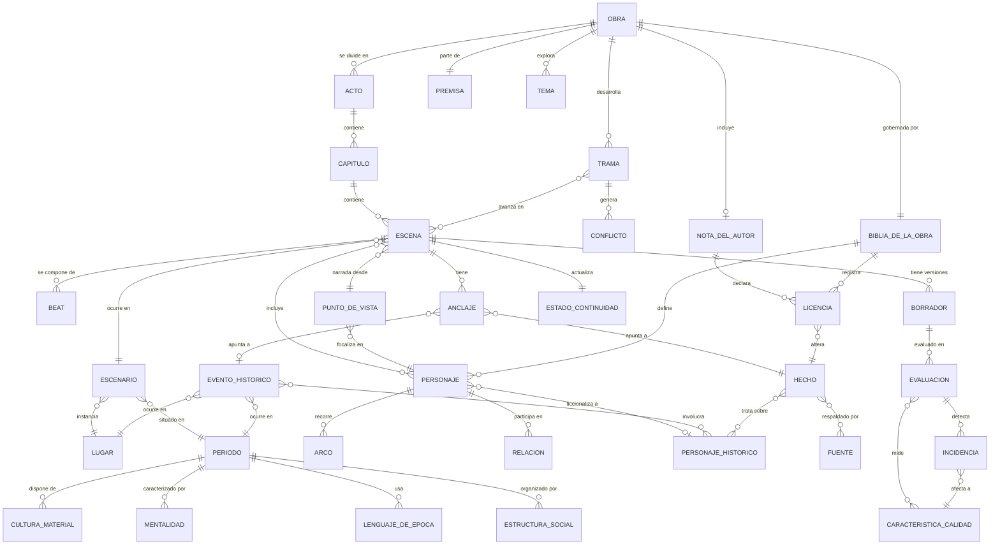
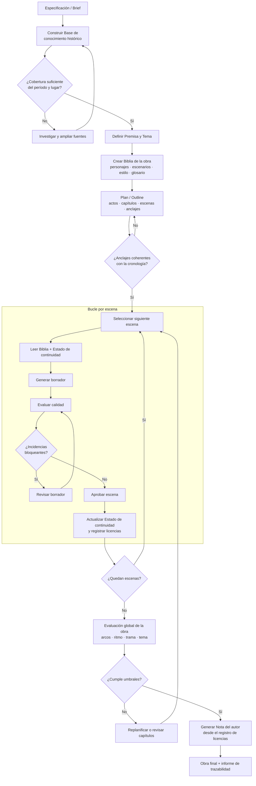

# Conocimiento del dominio — Generación de novelas históricas

Este documento explica cómo se organiza y se comporta el dominio mediante diagramas Mermaid. Las definiciones de cada concepto están en `definitions.md`.

Los diagramas responden a cuatro preguntas:

| Diagrama | Pregunta que responde |
|---|---|
| **1. Árbol taxonómico** | ¿Qué conceptos existen y cómo se clasifican? |
| **2. Modelo de entidades** | ¿Cómo se relacionan los conceptos entre sí? |
| **3. Flujo de generación** | ¿En qué orden se produce la novela? |
| **4. Ciclo de vida del borrador** | ¿Por qué estados pasa cada unidad de texto hasta darse por buena? |

---

## 1. Árbol taxonómico

El árbol muestra la **jerarquía de clasificación**, es decir, la relación "es un tipo de" o "es parte de". Sus cinco ramas corresponden a los cinco módulos de la ontología.

- **Mundo histórico** (ocre) contiene la realidad documentada. Destaca el concepto **Hecho**, que se clasifica por su estado epistémico. Esa clasificación decide cuánta libertad tiene la ficción: un hecho verificado no debe contradecirse, mientras que un hecho desconocido es terreno libre.
- **Anatomía narrativa** (azul) descompone la obra en cinco bloques: concepto (Obra, Premisa, Tema), trama, estructura (de Acto a Beat), personajes y discurso (cómo se cuenta).
- **Frontera historia–ficción** (salmón) es el módulo específico de la novela histórica. Aquí se gestiona la tensión entre lo documentado y lo inventado.
- **Calidad** (verde) agrupa las características en cuatro familias. No todas pesan igual según el subgénero: una novela biográfica prioriza la fidelidad histórica y una de aventuras, la calidad narrativa.
- **Proceso de generación** (violeta) contiene los artefactos que la solución produce y consume.

```mermaid
flowchart LR
    ROOT(("Novela histórica<br/>generada"))

    ROOT --> M["1. Mundo histórico"]
    ROOT --> N["2. Anatomía narrativa"]
    ROOT --> F["3. Frontera historia–ficción"]
    ROOT --> Q["4. Calidad"]
    ROOT --> P["5. Proceso de generación"]

    %% Mundo histórico
    M --> M1[Período]
    M --> M2[Lugar]
    M --> M3[Evento histórico]
    M --> M4[Personaje histórico]
    M --> M5[Estructura social]
    M --> M6[Cultura material]
    M --> M7[Mentalidad]
    M --> M8[Lenguaje de época]
    M --> M9[Fuente]
    M9 --> M91[Primaria]
    M9 --> M92[Secundaria]
    M --> M10[Hecho]
    M10 --> M101[Verificado]
    M10 --> M102[Debatido]
    M10 --> M103[Inferido]
    M10 --> M104[Desconocido]

    %% Anatomía narrativa
    N --> N1[Obra]
    N1 --> N11[Premisa]
    N1 --> N12[Tema]
    N1 --> N13[Género / Subgénero]
    N --> N2[Trama]
    N2 --> N21[Principal]
    N2 --> N22[Subtramas]
    N2 --> N23[Conflicto]
    N23 --> N231[Interno]
    N23 --> N232[Interpersonal]
    N23 --> N233[Social-histórico]
    N --> N3[Estructura]
    N3 --> N31[Acto]
    N31 --> N32[Capítulo]
    N32 --> N33[Escena]
    N33 --> N34[Beat]
    N --> N4[Personaje]
    N4 --> N41[Ficticio]
    N4 --> N42[Histórico ficcionalizado]
    N4 --> N43[Histórico de fondo]
    N4 --> N44[Arco]
    N4 --> N45[Relación]
    N --> N5[Discurso]
    N5 --> N51[Narrador / Punto de vista]
    N5 --> N52[Tiempo narrativo]
    N5 --> N53[Escenario]
    N5 --> N54[Diálogo]
    N5 --> N55[Voz y estilo]
    N5 --> N56[Motivo / Símbolo]

    %% Frontera
    F --> F1[Anclaje histórico]
    F --> F2[Licencia histórica]
    F --> F3[Anacronismo]
    F3 --> F31[Involuntario]
    F3 --> F32[Deliberado]
    F3 --> F33["Material · Léxico ·<br/>Conceptual · Mentalidad"]
    F --> F4[Plausibilidad]
    F --> F5[Nota del autor]

    %% Calidad
    Q --> Q1[Fidelidad histórica]
    Q1 --> Q11[Rigor histórico]
    Q1 --> Q12[Coherencia temporal]
    Q1 --> Q13[Autenticidad de mentalidad]
    Q1 --> Q14[Autenticidad lingüística]
    Q --> Q2[Calidad narrativa]
    Q2 --> Q21[Calidad de trama]
    Q2 --> Q22[Calidad de personaje]
    Q2 --> Q23[Ritmo]
    Q2 --> Q24[Inmersión]
    Q --> Q3[Calidad textual]
    Q3 --> Q31[Calidad de prosa]
    Q3 --> Q32[Coherencia interna]
    Q3 --> Q33[Originalidad]
    Q --> Q4[Responsabilidad]
    Q4 --> Q41[Sensibilidad y ética]
    Q4 --> Q42[Transparencia]

    %% Proceso
    P --> P1[Especificación]
    P --> P2[Base de conocimiento histórico]
    P --> P3[Biblia de la obra]
    P --> P4[Plan / Outline]
    P --> P5[Estado de continuidad]
    P --> P6[Borrador]
    P --> P7[Evaluación]
    P7 --> P71[Incidencia]
    P --> P8[Revisión]
    P --> P9[Trazabilidad]

    classDef raiz fill:#3b3b58,color:#fff,stroke:#222
    classDef mundo fill:#e8d9b5,stroke:#8a6d3b
    classDef narr fill:#cfe3f5,stroke:#2f6690
    classDef front fill:#f5d0c5,stroke:#a4442a
    classDef cal fill:#d4edda,stroke:#2d6a4f
    classDef proc fill:#e2d9f3,stroke:#5a3d8a

    class ROOT raiz
    class M,M1,M2,M3,M4,M5,M6,M7,M8,M9,M91,M92,M10,M101,M102,M103,M104 mundo
    class N,N1,N11,N12,N13,N2,N21,N22,N23,N231,N232,N233,N3,N31,N32,N33,N34,N4,N41,N42,N43,N44,N45,N5,N51,N52,N53,N54,N55,N56 narr
    class F,F1,F2,F3,F31,F32,F33,F4,F5 front
    class Q,Q1,Q11,Q12,Q13,Q14,Q2,Q21,Q22,Q23,Q24,Q3,Q31,Q32,Q33,Q4,Q41,Q42 cal
    class P,P1,P2,P3,P4,P5,P6,P7,P71,P8,P9 proc
```

---

## 2. Modelo de entidades y relaciones

El árbol clasifica, pero no muestra cómo se conectan los módulos. Este diagrama lo hace, y es la base natural para un modelo de datos o un grafo de conocimiento.

La **Escena** es el centro del modelo. De ella dependen cuatro cosas:

- **Anatomía:** pertenece a un Capítulo, que pertenece a un Acto y este a la Obra.
- **Mundo:** ocurre en un Escenario, que instancia un Lugar en un Período.
- **Personajes:** incluye Personajes y se narra desde un Punto de vista.
- **Frontera:** contiene Anclajes que la conectan con Hechos o Eventos.

La cadena **Anclaje → Hecho → Fuente** es lo que hace verificable la novela. Si un anclaje apunta a un hecho que se ha alterado, debe existir una **Licencia** que lo registre, y esa licencia se declara en la **Nota del autor**. Esto es lo que después permite la **Trazabilidad**.

El **Personaje histórico ficcionalizado** separa la persona real (en el módulo Mundo) de su versión narrativa (en el módulo Anatomía). Así se puede validar que la ficción no contradice la biografía documentada sin mezclar ambos niveles.

### Lectura de cardinalidades

| Notación | Significado |
|---|---|
| `\|\|--o{` | uno a muchos (cero o más) |
| `}o--\|\|` | muchos a uno (obligatorio) |
| `}o--o{` | muchos a muchos |
| `}o--o\|` | muchos a cero o uno (opcional) |

---

## 3. Flujo de generación

Este diagrama muestra el **orden de producción**. Tiene tres fases:

1. **Preparación del mundo.** A partir de la Especificación se construye o selecciona la Base de conocimiento histórico. Antes de escribir una línea hay que saber qué es verificable y dónde están las lagunas, porque las lagunas indican dónde es más segura la invención.
2. **Diseño de la obra.** Se definen Premisa y Tema, se crea la Biblia de la obra y se elabora el Plan con los anclajes previstos. El diseño debe planificar los anclajes: decidir qué escenas tocan qué eventos evita que la historia real aparezca como decorado.
3. **Escritura iterativa por escena.** Cada escena se genera leyendo la Biblia y el Estado de continuidad. Después se evalúa, se revisa si hay incidencias y, cuando se aprueba, actualiza el Estado de continuidad para la siguiente escena.

Al final se hace una evaluación global, porque características como el arco de personaje, el ritmo o la calidad de trama solo se pueden juzgar sobre la obra completa. Después se genera la Nota del autor a partir del registro de licencias.

---

## 4. Ciclo de vida del borrador

Cada unidad de texto, sea escena o capítulo, pasa por estados bien definidos. Modelarlos explícitamente permite saber qué partes de la novela son estables y cuáles pueden cambiar, y evita un problema habitual: aprobar una escena que después queda invalidada porque se revisó otra anterior.

El estado **Invalidado** es clave para la continuidad. Si se revisa la escena 12 y cambia algo que afecta a la escena 30 (un personaje ya no conoce un secreto, un objeto ya no existe), la escena 30 debe volver a evaluarse aunque estuviera aprobada.

```mermaid
stateDiagram-v2
    [*] --> Planificado
    Planificado --> Generado : generar
    Generado --> EnEvaluacion : evaluar
    EnEvaluacion --> ConIncidencias : incidencias detectadas
    EnEvaluacion --> Aprobado : sin incidencias bloqueantes
    ConIncidencias --> EnRevision : revisar
    EnRevision --> EnEvaluacion : reevaluar
    Aprobado --> Invalidado : cambio en escena previa<br/>o en la Biblia
    Invalidado --> EnEvaluacion : reevaluar continuidad
    Aprobado --> Final : evaluación global superada
    Final --> [*]
```

---

## 5. Consideraciones de diseño

**Separar la verdad histórica de la verdad narrativa.** La Base de conocimiento histórico y la Biblia de la obra son dos cánones distintos. La primera dice qué ocurrió; la segunda dice qué ocurre en esta novela. Las Licencias son el puente explícito entre ambas y nunca deberían existir alteraciones sin registrar.

**Usar la Escena como unidad de trabajo.** Es lo bastante pequeña para generarse y evaluarse con precisión, y lo bastante completa para tener lugar, tiempo, personajes, conflicto y resultado propios.

**Tratar el Estado de continuidad como estructura de datos, no como texto.** Registrar dónde está cada personaje, qué sabe, qué posee y en qué fecha narrativa se encuentra permite detectar incoherencias automáticamente. Un resumen en prosa no lo permite.

**Evaluar la calidad en dos niveles.** Algunas características se evalúan por escena (coherencia temporal, anacronismos, prosa, continuidad) y otras solo por obra (arco, ritmo global, tema). Mezclarlas lleva a optimizar lo local a costa de lo global.

**Ponderar las características según el subgénero.** La importancia relativa de cada característica depende del tipo de novela. Conviene que la Especificación incluya esos pesos.
