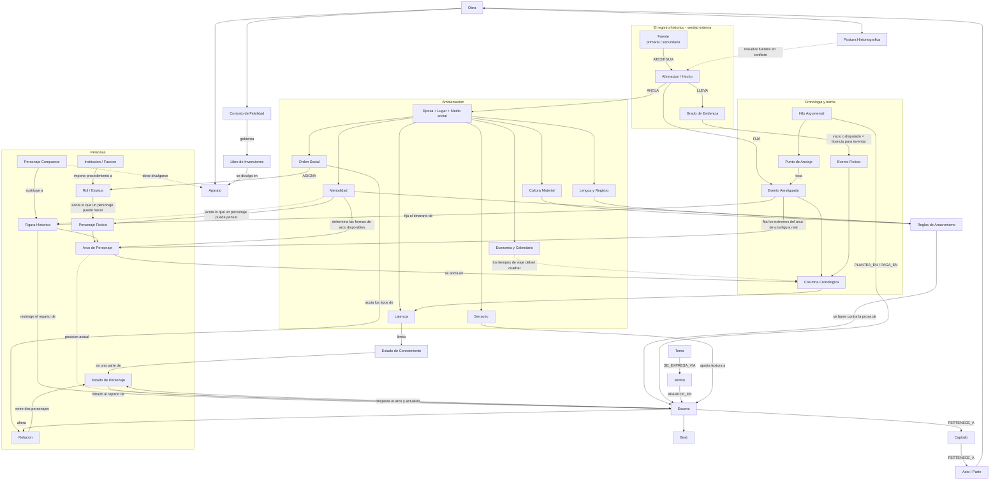
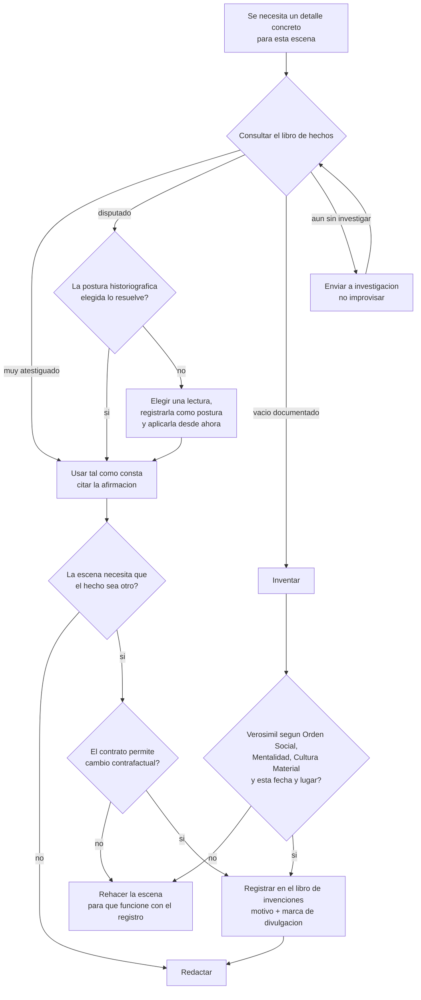
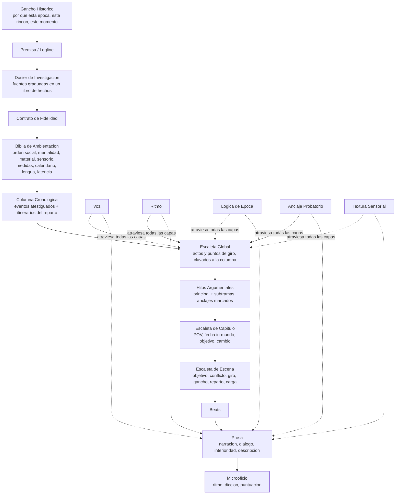
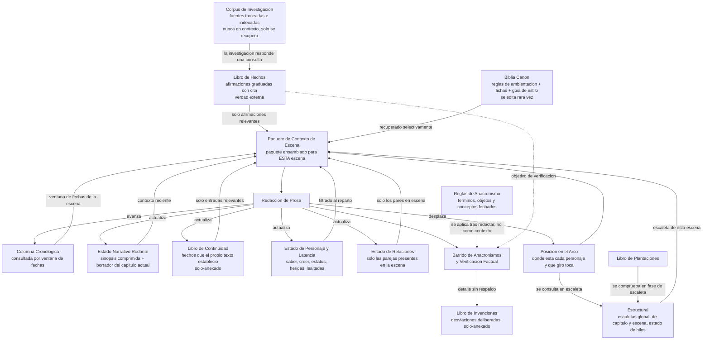

# Conocimiento del dominio — Novela histórica generada

Seis vistas del dominio, cada una con lo que hay que entender para leerla. Los términos que aparecen en los diagramas están definidos en el documento de definiciones; aquí se explica **qué decisión encierra cada vista** y qué pasa cuando esa decisión no se toma.

Orden de lectura recomendado: 1 para saber qué existe, 2 para saber cómo se decide, 5 para ver cómo corre. Las otras tres son detalle de las anteriores.

---

## 1. Entidades centrales

El grafo completo, agrupado en cuatro bloques: el registro histórico, la ambientación, las personas y la cronología con la trama.

Lo que hay que leer en él es la **dirección de las flechas**. Casi todas van del pasado hacia el texto: la fuente atestigua una afirmación, la afirmación fija un evento, el evento fija el itinerario de una figura real, y el itinerario restringe quién puede aparecer en una escena. Cuando esa cadena existe, un error factual se detecta en el eslabón donde se rompe. Cuando no existe —cuando la escena se escribe sin que nada la ate al registro— el error solo aparece al leerla, si aparece.

Tres nodos concentran casi todas las aristas y merecen atención desproporcionada:

- **Orden social** y **mentalidad** son las que acotan a los personajes. Si están poco especificadas, el hueco lo rellena la norma moderna, en silencio y sin aviso.
- **Columna cronológica** es donde confluyen eventos, itinerarios y tiempos de viaje. Es el único sitio donde un error de fecha se hace visible antes de estar escrito.
- **Escena** es el sumidero: lee estado y reglas, y al cerrar escribe continuidad, estado de personaje, relaciones y posición en el arco.

Lo que el diagrama deliberadamente no muestra: el tiempo. Todas estas relaciones están indexadas a un punto de la columna, y esa dimensión no cabe en un grafo plano.

---

## 2. La decisión de inventar

El diagrama más operativo del conjunto: convierte el contrato de fidelidad en una comprobación que cualquier agente puede ejecutar antes de escribir una línea.

La entrada es siempre la misma pregunta —hace falta un detalle concreto— y la primera consulta no es a la memoria del modelo, sino al libro de hechos. Lo que devuelve esa consulta decide la rama:

- **Muy atestiguado**: se usa tal cual, citado.
- **Disputado**: lo resuelve la postura historiográfica; si la postura no dice nada, se elige una lectura, se registra como postura y se aplica a partir de ahí. Nunca se decide dos veces distinto.
- **Vacío documentado**: se inventa, pero pasando por la prueba de verosimilitud contra orden social, mentalidad, cultura material, fecha y lugar. Y se registra.
- **Sin investigar todavía**: se envía a investigación. Esta rama es la que evita el fallo más caro del género, que es improvisar con seguridad.

La rama de la derecha es la que da sentido al contrato: cuando la escena necesita que un hecho sea distinto de como fue, el sistema no negocia con la historia, comprueba el nivel de licencia. Si el contrato es documental, se rehace la escena. Si es contrafactual, se registra la desviación.

Nada de esto funciona sin la última caja: **todo lo inventado se anota**. Es lo que después permite generar la nota del autor sin inventarse también la nota del autor.

---

## 3. Árbol de capas

La anatomía del artefacto, de lo general a lo fino. Se lee de arriba abajo, pero lo importante es dónde está el corte.

Las seis primeras capas son **cimentación** y se construyen una sola vez, antes de esbozar nada: gancho, premisa, dosier, contrato, biblia y columna. Las siete siguientes son el zoom narrativo propiamente dicho. El corte entre ambas es una decisión de proceso: una regla de época fijada tarde invalida todo lo redactado antes, así que el coste de retroceder crece con cada capa.

Las cinco líneas punteadas son capas transversales. No pertenecen a ningún nivel y por eso no tienen sitio en la cadena: voz, ritmo, lógica de época, anclaje probatorio y textura sensorial se comprueban en todas partes o no se comprueban. El anclaje probatorio es el que más se olvida, porque en la escaleta parece innecesario y en la prosa ya es tarde.

Un matiz que el árbol no dice: la escaleta global no es libre. Está clavada a la columna, y el final lo acota lo que la historia permite. En este género se esboza entre puntos fijos.

---

## 4. Niveles de contexto

Qué se guarda dónde y, sobre todo, qué entra realmente en la ventana cuando llega el momento de redactar.

Todo converge en el **paquete de contexto de escena**, y la palabra que aparece en casi todas las flechas de entrada es la misma: *filtrado*. Nada se vuelca entero. El libro de hechos entrega solo las afirmaciones que la escena va a tocar, la columna solo su ventana de fechas, el estado de personaje solo el del reparto presente, las relaciones solo los pares que se cruzan. El corpus de investigación no entra nunca: solo se consulta.

Dos detalles que el diagrama coloca a propósito fuera de la cadena de entrada:

- **Las reglas de anacronismo** no son contexto, son barrido. Se aplican después de redactar, no antes. Mandarle al redactor una lista de palabras prohibidas produce prosa tiesa; comprobarlas al terminar produce prosa normal y una lista de correcciones.
- **El libro de plantaciones** entra en escaleta, no en redacción. Lo sembrado se paga en el diseño de la escena, no en la frase.

Las flechas de salida son la mitad que más se olvida al construir el sistema: redactar no es solo consumir contexto, es **escribirlo**. Al cerrar una escena se actualizan el estado narrativo, la continuidad, el estado de personaje, las relaciones y la posición en el arco, y avanza la columna. Si ese retorno no existe, la escena siguiente se escribe sobre un mundo que se quedó congelado en el capítulo uno.

---

## 5. Pipeline con puertas de calidad

El recorrido completo, de concepto a manuscrito. Lo que define el diseño no son las etapas sino las puertas, y hay un patrón en su orden: **primero lo barato y determinista, después el juicio**.

El barrido de anacronismos y la verificación factual van antes que la revisión ética y la lectura experta porque cuestan segundos y descartan lo obvio. No tiene sentido someter a juicio una escena que un linter léxico ya rechaza.

Hay una sola puerta con bucle de vuelta: la de exactitud. Es deliberado. Los problemas factuales y de anacronismo se arreglan con reescritura dirigida sobre la misma escena, y por eso vuelven al barrido. Los problemas de estructura, en cambio, no se arreglan aquí: se arreglan en la escaleta, que es la puerta uno, y si llegan hasta la prosa ya salen caros.

La puerta cero es la que más gente se salta y la que más tiempo ahorra: preguntar, antes de escribir nada, si el registro da para esta historia y si los vacíos están donde la trama los necesita. Una novela ambientada en un año exhaustivamente documentado deja poco sitio para inventar; una ambientada donde no hay nada apenas puede anclarse. El género vive en el equilibrio entre ambas.

```mermaid
graph LR
    A["Concepto<br/>epoca + gancho"] --> B["Acotacion<br/>epoca, lugar, medio social"]
    B --> C["Reunion y graduacion<br/>de fuentes"]
    C --> D["Construccion del libro de hechos"]
    D --> QG0{"El registro es lo bastante rico<br/>y los vacios estan donde<br/>la historia los necesita?"}
    QG0 --> E["Contrato de fidelidad<br/>declarado"]
    E --> F["Biblia de ambientacion<br/>orden social, mentalidad, material, lengua"]
    F --> G["Columna cronologica"]
    G --> H["Reparto<br/>figuras reales + inventados + compuestos"]
    H --> I["Escaleta global<br/>clavada a la columna"]
    I --> QG1{"Puerta de desarrollo y cronologia:<br/>el arco resuelve, fechas e<br/>itinerarios cuadran"}
    QG1 --> J["Escaleta de capitulo y escena<br/>+ carga de investigacion + anclajes"]
    J --> QG2{"Cada escena se gana su sitio<br/>y su investigacion esta<br/>recuperada de antemano?"}
    QG2 --> K["Ensamblaje del paquete<br/>de contexto de escena"]
    K --> L["Redaccion de prosa"]
    L --> QG3{"Puerta de oficio:<br/>voz, ritmo, dialogo,<br/>sin voz de enciclopedia"}
    QG3 --> M["Barrido de anacronismos<br/>lexico / material / conceptual"]
    M --> N["Verificacion contra el libro<br/>de hechos, con citas"]
    N --> QG4{"Puerta de exactitud:<br/>contradicciones, concreciones<br/>sin fuente, presentismo"}
    QG4 -- "marcado" --> O["Reescritura dirigida,<br/>registro como invencion<br/>o regeneracion completa"]
    O --> M
    QG4 -- "limpio" --> P["Pasada de continuidad"]
    P --> PA["Auditoria de arco<br/>todas las escenas de un personaje seguidas"]
    PA --> QG6{"El arco se mueve, cada cambio<br/>tiene escena que lo produce y<br/>su forma es de la epoca?"}
    QG6 -- "plano o anacronico" --> O
    QG6 -- "limpio" --> Q["Revision etica y de sensibilidad<br/>personas reales, violencia, representacion"]
    Q --> R["Compilacion + generacion del aparato<br/>desde los libros de registro"]
    R --> QG5{"Lectura experta + pasada de<br/>experiencia de lectura<br/>normalmente humana"}
    QG5 --> S["Manuscrito"]
```

---

## 6. Árbol de calidad

Tres ramas que se puntúan por separado, porque una novela puede ser impecable como narración y falsa como historia, y al revés.

La rama **narrativa** es la que comparte con cualquier ficción. La **histórica** es la propia del género, y dentro de ella el anacronismo se abre en tres: material, lingüístico y conceptual. Esa apertura no es taxonomía por gusto, es que cada uno necesita un detector distinto. El material se comprueba contra ventanas de disponibilidad, el lingüístico contra fechas de primer uso, y el conceptual no se puede comprobar con una lista: hace falta leer y juzgar. Por eso es el que más sobrevive a los controles automáticos.

La rama **ética y legal** no es un apéndice de cumplimiento. Atribuirle a una persona real actos o motivos que no están documentados es una decisión editorial que el lector va a leer como afirmación, y la transparencia de la nota del autor es lo único que la hace legítima.

Dos dimensiones que conviene mirar juntas aunque el árbol las separe: *integridad del arco* en la rama narrativa y *forma del arco* en la histórica. La primera pregunta si el personaje cambia y si cada cambio tiene una escena que lo produzca. La segunda pregunta si **esa manera de cambiar** existía en su época. Un arco puede ser perfecto en la primera y anacrónico en la segunda: es el caso del protagonista de 1640 que atraviesa un proceso de autodescubrimiento terapéutico.

```mermaid
graph TD
    Q["Calidad"]

    Q --> NARR["Calidad narrativa"]
    Q --> HIST["Calidad historica"]
    Q --> ETH["Etica y legal"]

    NARR --> N1["Continuidad"]
    NARR --> N2["Consistencia de personaje"]
    NARR --> N9["Integridad del arco<br/>ningun cambio sin escena que lo produzca"]
    NARR --> N3["Logica de trama<br/>incl. finales fijados por la historia<br/>que deben sentirse ganados"]
    NARR --> N4["Ritmo<br/>la investigacion no debe frenar la novela"]
    NARR --> N5["Oficio de prosa"]
    NARR --> N6["Dialogo"]
    NARR --> N7["Funcion estructural"]
    NARR --> N8["Experiencia de lectura"]

    HIST --> H1["Exactitud factual"]
    HIST --> H2["Anclaje probatorio<br/>frente a fabulacion confiada"]
    HIST --> H3["Integridad cronologica<br/>fechas, calendarios, viajes, latencia"]
    HIST --> H4["Anacronismo"]
    HIST --> H5["Verosimilitud social<br/>rol, estatus, consecuencia"]
    HIST --> H8["Plausibilidad de la forma del arco<br/>la manera de cambiar pertenece a la epoca"]
    HIST --> H6["Autenticidad sensorial<br/>frente a teleserie de epoca"]
    HIST --> H7["Fidelidad al contrato"]

    H4 --> A1["Material<br/>objetos, comida, tecnologia"]
    H4 --> A2["Linguistico<br/>palabras, modismos, nombres, registro"]
    H4 --> A3["Conceptual / presentismo<br/>mentes modernas con ropa de epoca"]

    ETH --> E1["Tratamiento de personas reales"]
    ETH --> E2["Representacion de voces<br/>marginadas de la epoca"]
    ETH --> E3["Transparencia<br/>la nota del autor coincide con la practica"]
    ETH --> E4["Difamacion e intimidad<br/>historia reciente"]
```

