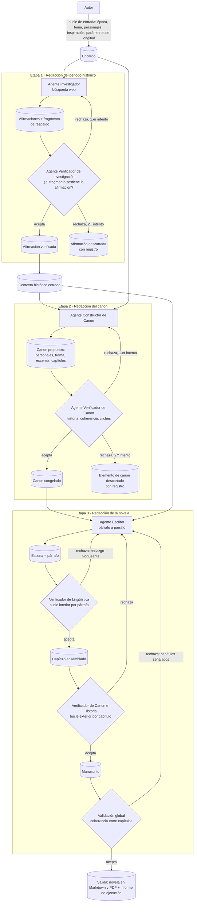
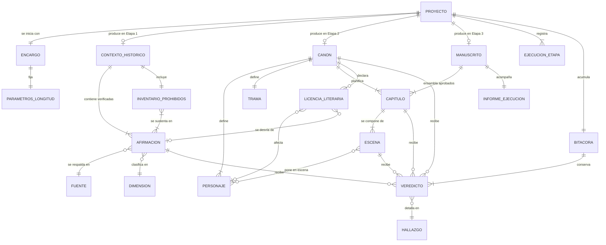

# Especificación Funcional — StoryMaker
### Arnés generador de novelas históricas
**Versión:** v1.3 · **Estado:** Línea base aprobada · **Fecha:** 18 de septiembre de 2026 · **Idioma:** español
**Entradas consumidas:** `StoryMaker.drawio` (diagrama) y la especificación en prosa del autor, con sus respuestas de arbitraje, descompuestas en las afirmaciones E1 a E79 de §1.3. Las afirmaciones E75 a E79 se incorporan a partir de decisiones del autor durante la implementación.
**Preguntas abiertas:** ninguna. Las veintiocho planteadas están resueltas (§15.1).
**Control de versiones y procedimiento de cambio:** §18. El histórico de la elaboración previa a v1 está en §18.4; todo cambio posterior se registra en §18.5.

---

## 0. Resumen ejecutivo

StoryMaker es un arnés (*harness*) de tres etapas que convierte un encargo —época, tema, personajes, inspiración y longitud— en una novela histórica en español. El encargo llega por diálogo o por fichero.

**Etapa 1, periodo histórico:** un agente investiga en la web y produce afirmaciones atómicas con su fragmento de respaldo; un verificador comprueba que este las sostiene. **Etapa 2, canon:** un constructor deriva personajes, trama y escenas; un verificador comprueba historia, coherencia y clichés. **Etapa 3, novela:** se escribe párrafo a párrafo (escena = párrafo), con un bucle léxico que juzga también el encaje con lo anterior, otro por capítulo que ve los capítulos previos, y una pasada final.

Lo ejecutan ocho agentes en Claude Code, de corrido y sobre Haiku: orquestación pura de agentes, código solo en herramientas de conversión. Todo rechazo cita el criterio incumplido, el fragmento exacto y qué cambiar. Solo los hallazgos bloqueantes fuerzan reescritura y, agotados los intentos, el autor decide si continuar. La prioridad es la ampliabilidad: añadir un verificador no debe obligar a tocar los otros.

**Aviso.** Los recuentos dependen del juicio de un agente: longitud y anacronismos son controles declarados, no garantías (§10.1). Interfaz y Langfuse quedan fuera de la primera implementación.

---

## 1. Estado del análisis de entradas

Ambas entradas se recibieron. El diagrama contiene 13 nodos y 21 aristas, de las cuales 13 carecen de extremo declarado (`source` y/o `target` ausentes) y se han inferido por proximidad geométrica. El autor ha declarado explícitamente que **el diagrama está desactualizado** y que prevalecen las etapas descritas en palabras; se inventaría íntegro de todas formas, porque contiene elementos (bucle de entrada, artefactos intermedios, retroalimentaciones) que el texto no enuncia y que no contradicen.

### 1.1 Inventario del diagrama

| ID | Lectura literal | Interpretación propuesta | Tipo | Confianza |
|---|---|---|---|---|
| N1 | «Investigación en webs» (elipse) | Técnica de obtención de información para la etapa de contexto histórico | Componente / técnica | Alta |
| N2 | «Investigación con RAG» (elipse) | Técnica alternativa de recuperación documental | Componente / técnica | Alta (lectura) / descartada (vigencia) |
| N3 | «**Investigación histórica**» (caja) | Etapa 1 del pipeline | Etapa de proceso | Alta |
| N4 | «**Análisis de período**» (caja) | Etapa 2; por sus descendientes (N10, N11) equivale a la creación del canon | Etapa de proceso | Media — el nombre sugiere análisis del periodo, pero de él cuelgan trama y personajes |
| N5 | «**Redacción**» (caja) | Etapa 3; escritura del manuscrito | Etapa de proceso | Alta |
| N6 | «**Refinamiento**» (caja) | Etapa de pulido posterior a la redacción | Etapa de proceso | Baja — sin respaldo en el texto |
| N7 | «**Validación**» (caja) | Etapa de validación global final | Etapa de proceso | Media — el texto sitúa la validación dentro de cada etapa |
| N8 | «Salida» (elipse) | Artefacto final entregado | Artefacto | Alta |
| N9 | «**Entrada**» (elipse) | Recogida del encargo del autor | Artefacto / punto de interacción | Alta |
| N10 | «Creación de personajes» (elipse) | Subetapa de la creación del canon | Etapa de proceso (subetapa) | Alta |
| N11 | «Creación de trama» (elipse) | Subetapa de la creación del canon | Etapa de proceso (subetapa) | Alta |
| N12 | «Historia que se va escrbiendo» *(sic)* (elipse) | Manuscrito en curso, estado acumulado durante la redacción | Artefacto | Alta |
| N13 | «Contexto histórico» (elipse) | Artefacto producido por N3 y consumido por N4 | Artefacto | Alta |
| A1 | Flecha suelta (240,385) → N3 | N9 → N3: el encargo alimenta la investigación | Flujo | Media — origen inferido por coordenada |
| A2 | Flecha suelta (489,384) → (588,384) | N3 → N4 | Flujo | Alta |
| A3 | Flecha suelta (740,384) → (839,384) | N4 → N5 | Flujo | Alta |
| A4 | Flecha suelta (990,384) → (1089,384) | N5 → N6 | Flujo | Alta |
| A5 | Flecha suelta (1241,384) → (1340,384) | N6 → N7 | Flujo | Alta |
| A6 | Flecha suelta (1490,384) → (1589,384) | N7 → N8 | Flujo | Alta |
| A7 | N4 → N11 | El análisis de periodo desencadena la creación de trama | Flujo | Alta |
| A8 | N4 → N10 | El análisis de periodo desencadena la creación de personajes | Flujo | Alta |
| A9 | N5 → N12 | La redacción produce el manuscrito en curso | Flujo | Alta |
| A10 | N12 → N6 | El manuscrito alimenta el refinamiento | Flujo | Alta |
| A11 | Flecha suelta (330,270) → N3 | N1 → N3: la investigación web nutre la etapa | Flujo | Alta |
| A12 | Flecha suelta (470,260) → N3 | N2 → N3: el RAG nutre la etapa | Flujo | Alta (lectura) / descartada |
| A13 | N3 → N13 | La investigación produce el contexto histórico | Flujo | Alta |
| A14 | Flecha suelta (396,530) → N4 | N13 → N4: el contexto alimenta el canon | Flujo | Media |
| A15 | Flecha suelta (760,520) → N5 | N10 → N5: los personajes alimentan la redacción | Flujo | Media |
| A16 | Flecha suelta (800,558) → N7 | N10 o N11 → N7: el canon alimenta la validación | Flujo | Baja — origen ambiguo entre dos nodos contiguos |
| A17 | N9 → N9, etiqueta «Bucle de entrada. Pregunta por: - Tema - Personaje - Inspiración» | Diálogo iterativo de captura del encargo | Flujo de control | Alta |
| A18 | N11 → N7 | La trama alimenta la validación final | Flujo | Alta |
| A19 | Flecha suelta (980,170) → (1377,340) | N12 → N7: el manuscrito se valida | Flujo | Media |
| A20 | N6 → punto libre (930,430) | **Arista huérfana sin destino**; por su trazado, retroalimentación N6 → N5 | Flujo | Baja |
| A21 | N7 → N5 | Retroalimentación: la validación devuelve trabajo a la redacción | Flujo | Alta |

**Hallazgos estructurales del diagrama (no corregidos en silencio):**

- **H1 — Mezcla de niveles de abstracción.** N1 y N2 son técnicas de implementación situadas al mismo nivel que etapas de proceso (N3–N7) y que artefactos (N12, N13).
- **H2 — Arista huérfana.** A20 sale de N6 y no llega a ningún nodo.
- **H3 — Nodos sin salida.** N13 y N10/N11 solo se conectan mediante aristas de extremo inferido; su papel depende de esa inferencia.
- **H4 — Ciclo no acotado.** A21 (N7 → N5) cierra un ciclo Redacción → Refinamiento → Validación → Redacción sin condición de terminación declarada.
- **H5 — Errata.** N12 dice «escrbiendo».
- **H6 — Doble entrada a la validación.** N7 recibe simultáneamente el manuscrito (A19) y elementos de canon (A16, A18), sin distinguir qué valida de cada uno.

### 1.2 Diagrama normalizado

Representación canónica a partir de este punto. Refleja las **tres etapas declaradas en palabras**, no las cinco del diagrama original.



**Desviaciones respecto al original y su motivo:**

| # | Desviación | Motivo |
|---|---|---|
| D-N1 | Se elimina N2 «Investigación con RAG» y su arista A12 | El texto lo niega explícitamente (E10). Regla dura: el texto prevalece |
| D-N2 | Se colapsan N3+N1 en la Etapa 1 | N1 es técnica, no etapa (H1) |
| D-N3 | N4 «Análisis de período» se renombra «Redacción del canon» | El autor fija las tres etapas en palabras (E28); N10 y N11 cuelgan de N4, lo que confirma la equivalencia |
| D-N4 | Se elimina N6 «Refinamiento» | Sin respaldo en el texto. Su función queda absorbida por el bucle léxico por escena. Registrado en §4 como aplazado |
| D-N5 | N7 «Validación» deja de ser etapa única y se distribuye en tres validadores | E2 del autor: validador de contexto, validador de canon, validadores léxico y de canon/contexto |
| D-N6 | Se añaden bucles interior (escena) y exterior (capítulo) | Declarados explícitamente por el autor (E30, E31); ausentes del diagrama |
| D-N7 | Se añaden ramas de descarte tras segundo rechazo | Declaradas por el autor para las etapas 1 y 2 (E33, E34) |
| D-N8 | Se elimina la arista huérfana A20 | H2: sin destino, no interpretable |
| D-N9 | El manuscrito (N12) sí es entrada de una validación global, como sugería N7 | Confirmado por el autor al arbitrar PA-012 (E56). En v1.1 estaba fuera de alcance; en v1.2 es requisito RF-055 |

### 1.3 Afirmaciones extraídas del texto

| ID | Afirmación | Clasificación |
|---|---|---|
| E1 | Todo el sistema se ejecuta en Claude Code | Restricción |
| E2 | El modelo de lenguaje empleado es Haiku | Restricción |
| E3 | El sistema genera novelas históricas | Objetivo de negocio |
| E4 | El alcance es académico; no debe complicarse a nivel profesional | Objetivo de negocio / Restricción |
| E5 | Debe poder entenderse todo mientras se hace | Requisito no funcional |
| E6 | Se prevén sesiones distintas para cada parte | Restricción operativa |
| E7 | La primera fase es la creación del contexto histórico | Requisito funcional |
| E8 | El autor define la época sobre la que trata la novela | Requisito funcional |
| E9 | Un agente busca información sobre la época en internet | Requisito funcional |
| E10 | No se usa RAG | Restricción |
| E11 | El fin de la investigación es evitar anacronismos al escribir | Objetivo de negocio |
| E12 | Se extrae información de vestimenta, actividades, sociedad, preocupaciones, materiales, y qué existía y qué no | Requisito funcional |
| E13 | Cada información va acompañada de su fuente | Requisito funcional |
| E14 | Otro agente verifica que la afirmación y la fuente coinciden | Requisito funcional |
| E15 | La segunda fase es la creación del canon de la historia | Requisito funcional |
| E16 | El canon se crea a partir de lo que pide el autor y del contexto histórico | Requisito funcional |
| E17 | El canon contiene personajes, escenas y trama | Requisito funcional |
| E18 | Un agente redactor del canon lo escribe | Requisito funcional |
| E19 | Otro agente verifica que el canon es correcto a nivel histórico | Requisito funcional |
| E20 | El validador impide plot twists muy raros | Requisito funcional — vago, a operacionalizar |
| E21 | El validador detecta incongruencias, por ejemplo un personaje que no estaba en ese sitio | Requisito funcional |
| E22 | El validador evita clichés | Requisito funcional — vago, a operacionalizar |
| E23 | La tercera fase es la redacción | Requisito funcional |
| E24 | Un redactor escribe la novela | Requisito funcional |
| E25 | Un validador comprueba que lo escrito es correcto a nivel léxico, es decir, en forma | Requisito funcional |
| E26 | Otro validador comprueba que se sigue cumpliendo el contexto histórico y el canon | Requisito funcional |
| E27 | El sistema admite parámetros de longitud de la novela | Requisito funcional |
| E28 | Las etapas son: redacción del periodo histórico → redacción del canon → redacción de la novela | Requisito funcional |
| E29 | El diagrama está desactualizado; prevalecen las etapas del texto | Restricción de interpretación |
| E30 | Existe un bucle por escena para la revisión léxica | Requisito funcional |
| E31 | Existe un bucle exterior por capítulo para revisar que no se sale del canon ni del contexto histórico | Requisito funcional |
| E32 | El verificador juzga sobre la afirmación y el bloque de texto que la asegura, por sencillez | Requisito funcional / Restricción de diseño funcional |
| E33 | En contexto histórico se reintenta; si el validador vuelve a rechazar, eso se rechaza | Requisito funcional |
| E34 | En canon se aplica la misma política | Requisito funcional |
| E35 | En redacción todo se rehace hasta tener la novela completa | Requisito funcional — vago, a operacionalizar |
| E36 | Los parámetros son: número de capítulos, párrafos por capítulo, líneas por capítulo y palabras por línea | Requisito funcional |
| E37 | Se admite cualquier época | Requisito funcional |
| E38 | Se admiten figuras históricas y figuras reales como personajes | Requisito funcional |
| E39 | Las figuras reales pueden tener licencias literarias, como Da Vinci amigo de los asesinos en Assassin's Creed | Requisito funcional / Preferencia estética |
| E40 | Los contextos se acotan | Requisito funcional |
| E41 | El éxito exige las cuatro condiciones: novela completa autónoma, detección demostrable de fallos, trazabilidad y comprensibilidad | Objetivo de negocio |
| E42 | El sistema tendrá interfaz gráfica (GUI) | Restricción / Requisito funcional |
| E43 | El sistema necesitará gestión de contexto | Restricción / Requisito no funcional |
| E44 | El sistema será necesariamente compatible con Langfuse | Restricción |
| E45 | El límite efectivo de longitud es el número total de palabras del párrafo; las líneas son un medio de cálculo, con margen | Requisito funcional |
| E46 | Una escena equivale a un párrafo | Requisito funcional |
| E47 | Los hallazgos deben tener severidad, de modo que algunos puedan saltarse directamente | Requisito funcional |
| E48 | Tras cierto número de repeticiones la ejecución se bloquea y el autor puede darle a continuar | Requisito funcional |
| E49 | No hay presupuesto máximo por ejecución | Restricción |
| E50 | No hay umbral de duración exigido | Restricción |
| E51 | El idioma es español y la entrega se hace en Markdown y PDF | Requisito funcional |
| E52 | El RAG queda descartado definitivamente | Restricción |
| E53 | La lista de clichés la genera un agente al inicio del proyecto | Requisito funcional |
| E54 | Las afirmaciones descartadas no se pueden rescatar | Restricción |
| E55 | La investigación del contexto histórico debe estar limitada en volumen | Requisito no funcional |
| E56 | Debe existir una validación global del manuscrito completo | Requisito funcional |
| E57 | Todo debe ser puro con agentes de Claude: nada de Python ni de otro código | Restricción |
| E58 | La prioridad es que sea ampliable a futuro, más que que produzca novelas geniales | Objetivo de negocio |
| E60 | El verificador de lingüística debe recibir los párrafos anteriores y comprobar que el párrafo encaja con ellos | Requisito funcional |
| E61 | El verificador de historia y canon debe recibir también los capítulos anteriores para ver que se ajustan | Requisito funcional |
| E62 | Debe hacerse además una pasada final | Requisito funcional |
| E63 | Quizá no haya que trocear la ejecución en tres sesiones, sino hacerla de corrido | Restricción operativa |
| E64 | Cada verificador debe decir exactamente en qué se ha equivocado lo que pide rehacer | Requisito funcional |
| E59 | La arquitectura consta de ocho agentes: orquestador, investigador, verificador de investigación, constructor de canon, verificador de canon, escritor, verificador de lingüística de escenas y verificador de canon e historia | Requisito funcional |
| E75 | Las dimensiones de investigación son diecisiete: Tiempo, Espacio, Demografía, Economía, Estructura social, Poder político, Derecho y justicia, Religión, Mentalidad y cultura simbólica, Ciencia y técnica, Cultura material, Vida cotidiana y privada, Comunicación y saber, Arte y estética, Relaciones exteriores, Conflicto y disidencia, y Ausencias y anacronismos | Requisito funcional |
| E76 | La investigación debe acotarse para que no se alargue en el tiempo | Restricción operativa |
| E77 | El verificador de lingüística comprueba que no se cometan faltas de ortografía ni malas formas lingüísticas; el verificador de canon e historia es el que comprueba que no se cometan anacronismos | Requisito funcional |
| E78 | La investigación la realiza **una** llamada al agente investigador, que la hace entera, y no una llamada por cada línea del plan | Restricción operativa |
| E79 | Las instrucciones de los agentes no se versionan: se editan en su sitio, «si lo cambiamos, lo hemos cambiado» | Restricción operativa |

**Afirmaciones vagas marcadas para operacionalización en las fases 5 y 6:** E5, E20, E22, E25 («correcto a nivel léxico»), E35, E39 («licencias»), E42 («tendrá GUI», sin alcance funcional declarado), E43 («gestión de contexto etc.», sin definición).

**Nota sobre E42–E44.** Son restricciones de compatibilidad futura aportadas por el autor con la indicación expresa de que no se definan aquí sus especificaciones técnicas. Se registran como restricciones y se derivan de ellas únicamente los requisitos observables desde fuera: qué puede hacer el autor en la interfaz, qué información viaja en cada invocación y qué debe ser observable. La elección de tecnología, la maquetación de la interfaz y el modo de integración con Langfuse quedan fuera del alcance de este documento.

### 1.4 Discrepancias detectadas

| Tipo | Descripción | Lecturas posibles | Resolución propuesta |
|---|---|---|---|
| Contradicción | N2/A12 introducen RAG; E10 lo niega | (a) El RAG fue una alternativa evaluada y descartada. (b) El RAG es una fase futura | Prevalece el texto: fuera de alcance. Elevado como PA-008 (baja criticidad) |
| Contradicción | El diagrama tiene 5 etapas; el texto declara 3 | (a) El diagrama está obsoleto. (b) Las 5 son un desglose fino de las 3 | Resuelto por el autor: el diagrama está obsoleto (E29). Se adoptan 3 etapas |
| Laguna | N6 «Refinamiento» no aparece en el texto | (a) Se descarta. (b) Es el bucle léxico. (c) Es un pase de estilo posterior a la validación | Fuera de alcance en v1; propuesto en §17 como pase de pulido opcional |
| Desalineación de granularidad | N7 es una validación global final; el texto distribuye la validación por etapa | (a) Solo validadores por etapa. (b) Ambas cosas | Resuelto por el autor: validadores por etapa. La validación global se propone en §17 |
| Desalineación de granularidad | E17 y E30 hablan de «escena», pero E36 parametriza capítulos, párrafos, líneas y palabras, sin escenas | (a) La escena es una agrupación de párrafos decidida por el canon. (b) Escena ≡ párrafo. (c) Escena ≡ capítulo | Se adopta (a) provisionalmente. **PA-002** |
| Contradicción interna | E36 sobredetermina la longitud: párrafos/capítulo y líneas/capítulo fijan líneas/párrafo, y «línea» no es unidad estable en prosa | (a) «Línea» = renglón lógico ≈ oración. (b) «Línea» = renglón de renderizado a X columnas. (c) `líneas por capítulo` es en realidad `líneas por párrafo` | Se adopta (a) y se trata `líneas por capítulo` como total del capítulo, del que se deriva `líneas por párrafo`. **PA-001** |
| Laguna | A17 describe un bucle de entrada que pregunta por tema, personaje e inspiración; el texto solo menciona la época | El diagrama amplía sin contradecir | Se incorpora: el encargo incluye época, tema, personajes e inspiración. Origen A17 |
| Laguna | E35 «todo se rehace hasta tener la novela completa» no define terminación | (a) Bucle sin límite hasta aprobación. (b) Límite de iteraciones con escalado al autor | Se adopta (b) con límites explícitos, por RNF-014. **PA-003** |
| Laguna | Ni el diagrama ni el texto fijan el formato de entrega ni el idioma de la novela | — | [SUPUESTO] SUP-002, SUP-003 |
| Redundancia | N1 «Investigación en webs» y N3 «Investigación histórica» describen lo mismo a distinto nivel | — | Colapsados en la Etapa 1 |
| Contradicción | E74 (artefactos intocables) frente a E72 (edición por eliminación o rehecho) | (a) Prevalece E74: inmutabilidad estricta y la única vía de cambio es repetir la etapa. (b) Prevalece E72 | **(a)**, por ser la entrada posterior del autor. E72 queda revocada y con ella RF-064, RF-065 y RNF-031, que pasan a obsoletos conservando su identificador |
| Contradicción | E63 (ejecución de corrido) frente a E6 y RES-7 (sesiones distintas por etapa) | (a) La ejecución continua sustituye al troceado. (b) Continua por defecto, con la invocación por etapa conservada como capacidad. (c) Se mantiene el troceado | **(b)**. Como entrada posterior, E63 prevalece sobre E6, pero retirar la invocación por etapa costaría la reanudación (RF-035), la reejecución aislada (RNF-008) y la posibilidad de probar una etapa sin pagar las anteriores. Correr de corrido es no detenerse entre etapas, no perder la capacidad de detenerse |
| Tensión | E61 (el verificador recibe los capítulos anteriores) frente a la ventana de contexto con Haiku | (a) Se aportan todos los capítulos anteriores íntegros. (b) Se aportan íntegros los tres inmediatamente anteriores, más el resumen acumulado y las fichas de continuidad para el resto. (c) Solo el resumen acumulado | **(b)**. Con (a) la etapa revienta a partir del capítulo décimo o antes; con (c) se pierde justo el detalle literal que permite ver el desajuste. **PA-025** |
| Contradicción | E57 (sin código) frente a RF-053 (entrega en PDF, E51) | (a) La entrega es solo Markdown y el PDF se produce fuera del arnés. (b) La generación del PDF es una excepción admitida a la regla de «sin código». (c) El agente produce un fichero imprimible sin conversión | **(a)**: el arnés entrega Markdown y el PDF queda como paso externo del autor. Un agente no genera un PDF sin alguna herramienta que lo convierta. **PA-021** |
| Contradicción | E57 (sin código) frente a RES-8 (interfaz gráfica) y RES-10 (compatibilidad con Langfuse) | (a) RES-11 rige solo el arnés —la lógica del pipeline— y no la envoltura futura, que sí llevará código. (b) RES-11 rige todo y hay que retirar la interfaz y Langfuse. (c) La interfaz de v1 es la propia sesión de Claude Code | **(a)**, que es además lo coherente con que el autor haya planteado interfaz y Langfuse como compatibilidad futura y no como construcción inmediata. **PA-022** |
| Contradicción | E57 (sin código) frente a las comprobaciones descritas como automáticas en §10 y §11 | (a) Pasan a ser juicios de agente, aproximados, y se declara la pérdida de precisión. (b) Se retiran los requisitos que exigen recuento exacto | **(a)**, con §10.1 declarando qué métricas dejan de ser deterministas. Retirarlas dejaría la longitud y los anacronismos sin ningún control |
| Laguna | E59 enumera ocho agentes, pero RF-055 (validación global) y RF-056 (lista de clichés) no tienen agente asignado en esa lista | (a) La validación global la realiza el Agente Verificador de Canon e Historia sobre el manuscrito completo, y la lista de clichés la genera el Agente Constructor de Canon. (b) Se añaden agentes nuevos | **(a)**: reutilizar agentes en vez de añadirlos mantiene la lista del autor intacta. **PA-023** |
| Tensión | E58 (ampliabilidad por encima de calidad) frente a OBJ-1 y a las rúbricas de §11 | (a) Las rúbricas se conservan como criterio de aceptación, pero ante conflicto de esfuerzo prevalece la ampliabilidad. (b) Se rebajan las rúbricas | **(a)**: la jerarquía se declara en §2 y no exige tocar requisitos |
| Tensión | E42 (GUI) frente a RES-1 (ejecución en Claude Code) y E6 (sesiones distintas por parte) | (a) La GUI es una capa sobre el mismo arnés, que sigue ejecutándose en Claude Code. (b) La GUI sustituye a Claude Code como entorno de ejecución. (c) La GUI llega en una fase posterior y v1 es solo de línea de comandos | Se adopta (a): los requisitos se escriben sobre la interacción, no sobre el entorno, de modo que valen para ambos. **PA-013** |
| Tensión | E42 y E44 frente a RES-6 (no complicar, alcance académico) | (a) Son exigencias reales de v1. (b) Son exigencias de compatibilidad futura que no deben condicionar v1 más allá de no cerrarles la puerta | Se adopta (b), que es lo que el autor enunció literalmente: «para que en un futuro no haya incompatibilidades». Los requisitos derivados son de compatibilidad, no de construcción inmediata |
| Laguna | E43 «gestión de contexto etc.» no precisa qué debe gestionarse | (a) Ensamblado explícito del contexto de cada invocación. (b) Solo la ventana de contexto del modelo. (c) Memoria de largo alcance, ya cubierta por RF-027 | Se adopta (a) como lectura amplia que engloba (b) y (c). **PA-014** |
| Tensión | E6 (sesiones distintas por parte) frente a E41a (novela completa sin intervención manual) | (a) Autonomía dentro de cada etapa, invocación manual entre etapas. (b) Una única ejecución continua | Se adopta (a): cada etapa es autónoma internamente; el autor la lanza y puede revisar el artefacto entre etapas |

---

## 2. Visión, objetivos y criterios de éxito

**Visión.** Un arnés reproducible y auditable que demuestre, en contexto académico, que una cadena de agentes redactor–validador puede producir una novela histórica larga sin anacronismos ni incoherencias, y que permita ver *por qué* cada decisión se tomó.

| ID | Objetivo | Criterio de éxito verificable | Origen |
|---|---|---|---|
| OBJ-1 | Producir una novela histórica completa | Una ejecución de las tres etapas, partiendo de un encargo válido, entrega un manuscrito con el número de capítulos solicitado y sin intervención manual dentro de cada etapa | E3, E41a |
| OBJ-2 | Evitar anacronismos | El manuscrito final no contiene ningún término, material, tecnología o institución del inventario de prohibidos generado en la Etapa 1 | E11, E12 |
| OBJ-3 | Demostrar que los validadores funcionan | El informe de ejecución registra al menos un rechazo con motivo en cada una de las tres etapas; el histórico conserva la versión rechazada y la corregida | E41b |
| OBJ-4 | Trazabilidad completa | Toda afirmación del contexto apunta a su fuente y fragmento; todo capítulo apunta a los elementos de canon y afirmaciones que lo respaldan | E13, E41c |
| OBJ-5 | Comprensibilidad del proceso | Un tercero que no ha visto el código reconstruye el flujo completo leyendo únicamente los artefactos y la bitácora en texto plano | E4, E5, E41d |
| OBJ-6 | Coste contenido | La ejecución completa se realiza con un único modelo (Haiku) y sin infraestructura de recuperación documental | E1, E2, E10 |
| OBJ-7 | Ser ampliable | Añadir un agente verificador nuevo, una dimensión de investigación o una etapa exige modificar el número de artefactos declarado en RNF-026 y ninguno más | E58 |

**Jerarquía de objetivos.** El autor ha declarado que la ampliabilidad futura prevalece sobre la calidad literaria del resultado (E58). Cuando OBJ-7 entre en conflicto con OBJ-1 u OBJ-2 —por ejemplo, si un control de calidad adicional mejorase la novela a costa de acoplar dos agentes entre sí—, prevalece OBJ-7. Los criterios de éxito de §11.4 se mantienen: la jerarquía ordena el esfuerzo, no rebaja el listón de aceptación.

**Restricciones impuestas** (no son diseño; son condiciones dadas):

| ID | Restricción | Justificación | Origen |
|---|---|---|---|
| RES-1 | La ejecución se realiza en Claude Code | Impuesta por el autor | E1 |
| RES-2 | El modelo de lenguaje es Haiku | Impuesta por el autor | E2 |
| RES-3 | No se emplea RAG ni base vectorial | Impuesta por el autor | E10 |
| RES-4 | La obtención de información histórica se hace por búsqueda web | Impuesta por el autor | E9 |
| RES-5 | El verificador de contexto no reabre la fuente: juzga sobre el fragmento aportado | Impuesta por el autor por simplicidad | E32 |
| RES-6 | La solución debe permanecer simple y explicable; se prefiere lo comprensible a lo óptimo | Impuesta por el autor | E4, E5 |
| RES-7 | La ejecución es continua de principio a fin; el troceado en sesiones deja de ser obligatorio, pero cada etapa sigue siendo invocable por separado sobre artefactos persistidos | Reescrita en v1.4. El autor sustituyó las tres sesiones por la ejecución de corrido (E63); la invocación por etapa se conserva porque de ella dependen la reanudación y la reejecución aislada | E63, sustituye a E6 |
| RES-8 | El sistema dispondrá de interfaz gráfica de usuario, **no en la primera implementación**. Condiciona qué interacciones deben existir, no cómo se presentan. En la primera implementación el canal de interacción es la propia sesión de Claude Code | Aplazada en v1.6 (E67) | E42, E67 |
| RES-9 | El sistema gestiona explícitamente el contexto que recibe cada invocación de un agente | Impuesta por el autor | E43 |
| RES-12 | El Encargo puede aportarse como fichero JSON, además de por diálogo | Impuesta por el autor. Fija el formato del canal de entrada, no la representación interna de los artefactos, que sigue siendo conceptual en §9 | E65 |
| RES-11 | La orquestación del arnés y la lógica de todos sus agentes son puras de Claude Code: definiciones de agente, instrucciones y artefactos de texto. Se admite código únicamente en herramientas de hoja invocadas desde un paso concreto, como la conversión a PDF, que no deciden nada del flujo | Relajada en v1.6 a petición del autor (E66). El límite es funcional y no de volumen: una herramienta de hoja transforma o convierte, nunca decide si algo se acepta, se reintenta o se descarta | E57, E66 |
| RES-10 | El sistema será compatible con Langfuse y hará uso completo de la plataforma —observabilidad, versionado de instrucciones, conjuntos de datos, evaluadores y sus propios agentes para detectar mejoras—, **no en la primera implementación**. La arquitectura no debe cerrarle la puerta: de ahí que la bitácora registre ya, por cada invocación, lo que después se emitirá como traza | Aplazada y ampliada en v1.6 (E67, E68) | E44, E68 |

---

## 3. Glosario de lenguaje ubicuo

| Término | Definición | Sinónimos descartados |
|---|---|---|
| **Arnés** (*harness*) | Conjunto de agentes, artefactos y reglas de orquestación que ejecuta las tres etapas del sistema | «Pipeline», «orquestador» — se conserva el término del autor |
| **Encargo** | Conjunto de datos que el autor aporta al inicio: época, tema, personajes de partida, inspiración y parámetros de longitud | «Entrada», «brief» — «Entrada» (N9) es demasiado genérico y se reserva para el flujo |
| **Época** | Ámbito temporal y geográfico acotado sobre el que trata la novela | «Periodo histórico» — se usa como sinónimo admitido |
| **Etapa** | Cada uno de los tres bloques secuenciales del arnés, invocables por separado, que produce un artefacto cerrado | «Fase» — el autor usa ambos; se fija «Etapa» para el arnés y «Fase» queda libre |
| **Afirmación** | Enunciado atómico y comprobable sobre la época, extraído de la investigación | «Hecho», «dato» — «hecho» presupone veracidad, que es justo lo que el verificador decide |
| **Fragmento de respaldo** | Bloque de texto, copiado literalmente de la fuente, que se aporta junto a la afirmación como única evidencia que el verificador examinará | «Cita», «evidencia», «snippet» |
| **Fuente** | Referencia identificable (URL y título) de donde procede el fragmento de respaldo | — |
| **Afirmación verificada** | Afirmación cuyo verificador ha dictaminado que el fragmento de respaldo la sostiene | — |
| **Afirmación descartada** | Afirmación rechazada dos veces por el verificador; se conserva en la bitácora pero no entra en el Contexto Histórico | «Afirmación rechazada» — se reserva «rechazada» para el veredicto, «descartada» para el estado final |
| **Contexto Histórico** | Artefacto cerrado de la Etapa 1: el conjunto de afirmaciones verificadas, organizado por dimensiones, más el inventario de prohibidos | «Marco histórico», «investigación» |
| **Dimensión** | Eje temático de la investigación. Las diecisiete declaradas están en §8, RF-005 | «Categoría», «área» |
| **Inventario de prohibidos** | Subconjunto del Contexto Histórico que enumera lo que no existía en la época, y que sirve de lista de comprobación para detectar anacronismos | «Lista negra», «anti-canon» |
| **Canon** | Artefacto cerrado de la Etapa 2: personajes, trama, capítulos y escenas de la novela, y las licencias literarias declaradas | «Biblia», «bible» — el autor usa «canon», se respeta |
| **Personaje** | Entidad del canon que actúa en la novela; puede ser Ficticio o Real | — |
| **Figura Real** | Personaje que corresponde a una persona histórica documentada | «Figura histórica» — admitido como sinónimo |
| **Licencia literaria** | Desviación deliberada y declarada respecto a lo documentado sobre una Figura Real o sobre un hecho, registrada con su justificación | «Ficción», «libertad creativa» |
| **Trama** | Secuencia de acontecimientos y arco dramático de la novela, definida en el Canon | «Argumento», «plot» |
| **Escena** | Unidad mínima de redacción y de validación léxica, **equivalente a un párrafo** del manuscrito. El Canon planifica una escena por cada párrafo previsto en el capítulo (E46) | «Secuencia», «beat», «párrafo» — «párrafo» se usa al hablar del texto resultante y «escena» al hablar de su planificación en el Canon; designan la misma unidad |
| **Palabras por párrafo objetivo** | Extensión efectiva que debe alcanzar cada párrafo, calculada como `(líneas por capítulo ÷ párrafos por capítulo) × palabras por línea`. Es la única magnitud de longitud que se comprueba sobre el texto (E45) | «Longitud de escena» |
| **Severidad** | Gravedad de un Hallazgo: Bloqueante, Mayor o Menor. Determina si fuerza reescritura, si puede saltarse al agotar los intentos y si impide la entrega (E47) | «Criticidad», «gravedad» |
| **Aceptado con observaciones** | Estado de una escena o un capítulo que se da por bueno conservando hallazgos no bloqueantes sin corregir, por decisión del autor o por agotamiento de intentos | «Aprobado con salvedades» |
| **Capítulo** | Agrupación ordenada de escenas; unidad de validación del bucle exterior | — |
| **Línea** | Unidad de cálculo, no de texto. Sirve únicamente para derivar las palabras por párrafo objetivo a partir de los parámetros del Encargo; **nunca se cuenta sobre el manuscrito** (E45) | «Renglón», «oración» |
| **Manuscrito** | Artefacto de la Etapa 3: el conjunto de capítulos aprobados, en orden | «Novela», «historia que se va escribiendo» (N12) |
| **Redactor** | Papel genérico: agente que produce un artefacto o parte de él. Lo desempeñan el Agente Investigador, el Agente Constructor de Canon y el Agente Escritor | «Generador» |
| **Verificador** | Papel genérico: agente que examina un artefacto producido por un Redactor y emite un Veredicto. Lo desempeñan los cuatro agentes verificadores de §5. Se adopta el término del autor y se retira «Validador», usado en v1.0–v1.2 | «Validador», «revisor», «crítico», «juez» |
| **Veredicto** | Resultado de una validación: Aceptado o Rechazado, con motivo obligatorio en caso de rechazo | «Dictamen», «resultado» |
| **Intento** | Cada producción de un artefacto por un redactor para un mismo objetivo. El primer intento no es un reintento | «Iteración» — se reserva «iteración» para las vueltas de un bucle de reescritura |
| **Bucle interior** | Ciclo redactar–validar léxicamente que se ejecuta por cada escena | — |
| **Bucle exterior** | Ciclo redactar–validar contra canon y contexto que se ejecuta por cada capítulo | — |
| **Bitácora** | Registro cronológico y persistente de intentos, veredictos, motivos y descartes de toda la ejecución | «Log», «traza», «historial» |
| **Ejecución de etapa** | Invocación concreta de una etapa sobre un Proyecto, con su fecha, su configuración y su resultado | «Run» |
| **Proyecto** | Contenedor de todos los artefactos de una novela concreta: encargo, contexto, canon, manuscrito y bitácora | «Novela» — se reserva «novela» para el producto literario |

---

## 4. Alcance

### 4.1 Dentro del alcance

| Elemento | Justificación |
|---|---|
| Captura interactiva del encargo con bucle de preguntas | A17, E8 |
| Etapa 1 completa: investigación web, extracción de afirmaciones con fragmento, verificación, descarte | E7–E14, E32, E33 |
| Inventario de lo que no existía en la época | E12 |
| Etapa 2 completa: redacción del canon y validación histórica, de coherencia y de clichés | E15–E22, E34 |
| Figuras Reales como personajes, con licencias literarias declaradas | E38, E39 |
| Etapa 3 completa: redacción por escenas, bucle léxico interior, bucle de canon y contexto exterior | E23–E26, E30, E31, E35 |
| Parámetros de longitud (capítulos, párrafos, líneas, palabras) | E27, E36 |
| Persistencia de artefactos entre sesiones e invocación independiente por etapa | E6 |
| Bitácora y trazabilidad de veredictos y orígenes | E41b, E41c |
| Informe de ejecución | E41b, E41d |
| Interacción del autor con el sistema a través de una interfaz gráfica: crear proyecto, lanzar etapas, atender puntos de control, consultar artefactos | E42 |
| Ensamblado explícito y registrado del contexto de cada invocación | E43 |
| Emisión de trazas, puntuaciones y versiones de instrucción en un formato consumible por Langfuse | E44 |
| Clasificación de los hallazgos por severidad y política de salto según severidad | E47 |
| Reanudación de una ejecución bloqueada por decisión del autor | E48 |
| Validación global de coherencia sobre el manuscrito completo | E56 |
| Entrega del manuscrito en Markdown y en PDF | E51 |
| Topes de volumen de la investigación histórica | E55 |
| Definición de los ocho agentes, sus instrucciones y el registro que los declara | E59 |
| Entrada del Encargo por fichero JSON, con las mismas validaciones que el diálogo | E65 |
| Contrato uniforme de veredicto, que permite añadir verificadores sin tocar los existentes | E58 |

### 4.2 Fuera del alcance

| Elemento | Justificación de la exclusión |
|---|---|
| Recuperación documental sobre corpus propio (RAG) | Excluido de forma definitiva por el autor (E10, E52), pese a aparecer en el diagrama (N2). No se aplaza |
| Etapa de «Refinamiento» como pase independiente (N6) | Sin respaldo en el texto; el autor fijó tres etapas (E28) |
| Multiusuario, permisos, colaboración | Ninguna entrada lo menciona; el usuario es el propio autor |
| Maquetación editorial, portada, EPUB, ISBN | Ninguna entrada lo menciona |
| Traducción o generación en idiomas distintos del español | Confirmado por el autor: español (E51) |
| Ilustraciones o material gráfico | Ninguna entrada lo menciona |
| Selección o comparación de modelos de lenguaje | RES-2 lo fija: Haiku |
| Diseño visual, maquetación y experiencia de usuario de la interfaz | El autor pidió expresamente no definir especificaciones técnicas; solo se especifica qué debe poder hacerse, no cómo se ve |
| Elección de tecnología de interfaz, despliegue, alojamiento y configuración de Langfuse | Decisiones de implementación (RES-10 es una restricción, no un diseño) |
| Panel de métricas propio del sistema | La observabilidad se delega en Langfuse (RES-10); duplicarla contradiría RES-6 |
| Cualquier script, programa o utilidad de código dentro del arnés | Excluido por RES-11: el arnés son agentes y artefactos de texto |
| Generación del PDF de entrega | Sujeto a PA-021: sin código, el arnés entrega Markdown y la conversión queda fuera |
| Reproducibilidad determinista (misma entrada → misma salida exacta) | Inalcanzable con generación por LLM sin control de muestreo; se sustituye por trazabilidad (RNF-007). [SUPUESTO] SUP-004 |

### 4.3 Aplazado

| Elemento | Justificación del aplazamiento |
|---|---|
| Pase de pulido estilístico sobre el manuscrito aprobado | Recoge la intención de N6 sin respaldo textual; útil, pero añadiría una cuarta etapa que el autor no pidió |
| Reapertura de la fuente por parte del verificador | El autor eligió la lectura simple (RES-5); la verificación con reapertura mejoraría el rigor y es sustituible más adelante sin cambiar contratos |
| Rescate de afirmaciones descartadas | Descartado por el autor (E54): el descarte es definitivo |
| Interfaz gráfica de usuario (capacidad C13) | El autor la excluye de la primera implementación (E67). Los requisitos se conservan íntegros porque describen interacciones, no pantallas, y en v1 se satisfacen en la sesión de Claude Code |
| Integración con Langfuse (capacidad C15) | El autor la excluye de la primera implementación (E67) y amplía su alcance futuro al uso completo de la plataforma, incluidos sus agentes para detectar mejoras (E68). En v1 la bitácora registra ya la información que después se emitirá como traza |
| Guía de estilo explícita (registro, persona, tiempo verbal) como parámetro del encargo | El texto menciona validación léxica pero no una guía declarada; ver §17 |
| Detección de repetición y variación de longitud de frase entre capítulos | No pedida; ver §17 |

---

## 5. Actores y objetivos

### 5.1 Actores humanos

| Actor | Objetivo | Pericia | Origen |
|---|---|---|---|
| **Autor** | Obtener una novela histórica completa a partir de una idea y unos parámetros; entender el proceso mientras ocurre | Alta en el dominio narrativo, media-baja en el técnico. Es el único usuario del sistema | E8, E16, E4, A17 |
| **Evaluador académico** | Juzgar si el arnés funciona y por qué; no interactúa con el sistema, solo con sus artefactos, su bitácora y sus trazas | Alta técnica, sin conocimiento previo del proyecto | E4, E41 |

### 5.2 Los ocho agentes

La arquitectura consta exactamente de los ocho agentes que el autor ha enumerado (E59). Los nombres son los suyos y son los canónicos a partir de la v1.3.

| Agente | Responsabilidad | Entradas principales | Salida | Origen |
|---|---|---|---|---|
| **Agente Orquestador** | Ejecutar las etapas en orden, invocar a los demás agentes, aplicar las políticas de reintento, descarte y bloqueo, ensamblar los contextos de cada invocación, persistir los artefactos y escribir la bitácora | Estado del Proyecto, veredictos | Transiciones de estado, bitácora, informe | E59, E6, E33, E34, E35, E48 |
| **Agente Investigador** | Planificar la investigación por dimensiones, buscar en la web y producir afirmaciones atómicas con su fragmento de respaldo y su fuente | Encargo | Afirmaciones propuestas | E59, E9, E12, E13 |
| **Agente Verificador de Investigación** | Dictaminar, solo sobre el fragmento aportado, si sostiene la afirmación | Afirmación + fragmento | Veredicto | E59, E14, E32 |
| **Agente Constructor de Canon** | Generar la lista de clichés del Proyecto y construir el canon: personajes, trama, capítulos y escenas, con sus licencias literarias | Encargo + Contexto Histórico | Lista de clichés, Canon propuesto | E59, E16, E17, E18, E53 |
| **Agente Verificador de Canon** | Dictaminar si el canon es históricamente correcto, internamente coherente, verosímil y no tópico | Canon + Contexto Histórico + lista de clichés | Veredicto | E59, E19, E20, E21, E22 |
| **Agente Escritor** | Escribir cada escena, materializada en un párrafo, conforme al canon, al contexto y a la longitud objetivo | Escena del canon + escenas aprobadas del capítulo + Contexto + resumen acumulado | Texto de la escena | E59, E24, E46 |
| **Agente Verificador de Lingüística de Escenas** | Dictaminar la corrección formal de cada escena: léxico de época, registro, gramática, repetición, longitud y párrafo único | Escena + Inventario de Prohibidos | Veredicto con hallazgos y severidades | E59, E25, E30, E47 |
| **Agente Verificador de Canon e Historia** | Dictaminar la adherencia al canon y al contexto, en dos modos: por capítulo en el bucle exterior y sobre el manuscrito completo en la validación global | Capítulo o manuscrito + Canon + Contexto | Veredicto con hallazgos localizados | E59, E26, E31, E56 |

Los tres primeros papeles de redacción —investigar, construir canon, escribir— y los cuatro de verificación comparten, cada grupo, la misma anatomía de entrada y salida (RF-058). Esa uniformidad es la que permite añadir agentes sin tocar los existentes y es el mecanismo que sostiene OBJ-7.

## 6. Modelo del dominio

### 6.1 Entidades

| Entidad | Atributos conceptuales | Invariantes | Ciclo de vida | Origen |
|---|---|---|---|---|
| **Proyecto** | Identificador, título provisional, fecha de creación, estado de cada etapa | Un Proyecto tiene exactamente un Encargo, como máximo un Contexto Histórico cerrado, como máximo un Canon congelado y como máximo un Manuscrito | Creado → Etapa 1 cerrada → Etapa 2 cerrada → Etapa 3 cerrada → Entregado | E6 |
| **Encargo** | Época (ámbito temporal y geográfico), tema, personajes de partida, inspiración, parámetros de longitud | La época debe estar acotada en tiempo y lugar. Los cuatro parámetros de longitud son obligatorios y enteros positivos | Incompleto → Completo → Congelado al iniciar la Etapa 1 | E8, E27, E36, E37, E40, A17 |
| **Parámetros de longitud** | Número de capítulos, párrafos por capítulo, líneas por capítulo, palabras por línea, y el derivado palabras por párrafo objetivo | Todos ≥ 1. `líneas por capítulo` ≥ `párrafos por capítulo`. `palabras por párrafo objetivo = (líneas por capítulo ÷ párrafos por capítulo) × palabras por línea`, redondeado | Inmutable una vez congelado el Encargo | E36, E45 |
| **Dimensión** | Nombre, descripción, cobertura mínima exigida | Las diecisiete dimensiones declaradas en RF-005 son obligatorias; puede haber más | Fija | E12, E75 |
| **Afirmación** | Enunciado, dimensión, fragmento de respaldo, fuente, número de intento, estado | Toda Afirmación tiene exactamente un fragmento de respaldo y exactamente una fuente. Ninguna Afirmación en estado Verificada carece de veredicto de aceptación | Propuesta → (Rechazada → Reintentada) → Verificada \| Descartada | E13, E14, E32, E33 |
| **Fuente** | Identificador, URL, título, fecha de consulta | Una Fuente puede respaldar varias Afirmaciones; una Afirmación tiene una sola Fuente | Registrada | E13 |
| **Contexto Histórico** | Conjunto de Afirmaciones verificadas agrupadas por Dimensión, Inventario de Prohibidos, fecha de cierre | Cerrado ⇒ inmutable para todos, agentes y autor. No contiene Afirmaciones en estado distinto de Verificada | Abierto → Cerrado | E7, E12, E74 |
| **Inventario de Prohibidos** | Lista de elementos (léxicos, materiales, tecnológicos, institucionales, de mentalidad) que no existían en la época, cada uno con la Afirmación que lo sustenta | Todo elemento remite a una Afirmación verificada | Se cierra con el Contexto Histórico | E12, E11 |
| **Canon** | Personajes, Trama, Capítulos, Escenas, Licencias literarias, fecha de congelación | Congelado ⇒ inmutable para todos, agentes y autor. El número de Capítulos coincide con el parámetro de longitud. Cada Escena pertenece a exactamente un Capítulo | Propuesto → (Rechazado → Reintentado) → Congelado | E15–E18, E36 |
| **Personaje** | Nombre, naturaleza (Ficticio \| Real), rasgos, motivación, presencia (dónde y cuándo está) | Un Personaje Real requiere al menos una Afirmación verificada que lo sitúe en la época. Un Personaje no puede figurar en dos Escenas simultáneas en lugares distintos | Propuesto → Aceptado \| Descartado | E17, E21, E38 |
| **Licencia literaria** | Elemento afectado, desviación respecto a lo documentado, justificación narrativa | Toda desviación conocida respecto a una Afirmación verificada sobre una Figura Real debe estar cubierta por una Licencia declarada | Declarada en el Canon; inmutable tras la congelación | E39 |
| **Trama** | Arco, acontecimientos ordenados, conflicto, resolución | Todo acontecimiento se asigna a al menos una Escena | Propuesta → Aceptada | E17 |
| **Capítulo** | Orden, título, Escenas, estado | El orden es único y contiguo desde 1 | Planificado → En redacción → Validado → Aprobado | E31, E36 |
| **Escena** (≡ párrafo) | Orden dentro del Capítulo, sinopsis según el Canon, personajes presentes, lugar, texto redactado, estado | Toda Escena redactada corresponde a una Escena del Canon congelado y se materializa en **exactamente un párrafo**. El número de Escenas de un Capítulo es igual al parámetro `párrafos por capítulo` | Planificada → Redactada → (Rechazada → Reescrita) → Aprobada \| Aceptada con observaciones | E17, E30, E46 |
| **Manuscrito** | Capítulos aprobados en orden, recuento de palabras | Solo contiene Capítulos en estado Aprobado o Aceptado con observaciones. El número de Capítulos coincide con el parámetro | En construcción → Completo → Validado globalmente | E24, E35, E56 |
| **Veredicto** | Verificador emisor, artefacto evaluado, resultado (Aceptado \| Rechazado), motivo, hallazgos, marca temporal | Todo Veredicto Rechazado tiene motivo no vacío y al menos un hallazgo | Emitido; inmutable | E14, E19, E25, E26 |
| **Hallazgo** | Tipo (anacronismo, incoherencia, cliché, inverosimilitud, defecto léxico, desvío de canon, longitud fuera de objetivo), **severidad (Bloqueante \| Mayor \| Menor)**, localización, descripción | Todo Hallazgo pertenece a un Veredicto y tiene severidad asignada | Inmutable | E20–E22, E25, E26, E47 |
| **Ejecución de Etapa** | Etapa, fecha de inicio y fin, resultado, número de intentos, número de descartes | Una Ejecución no puede iniciarse si la Etapa anterior no está cerrada | Iniciada → Completada \| Interrumpida | E6 |
| **Bitácora** | Secuencia cronológica de entradas: intentos, veredictos, descartes, cierres | Ninguna entrada se borra ni se sobrescribe | Solo añadido | E41b, E41c |
| **Informe de ejecución** | Métricas de la ejecución: intentos, rechazos, descartes por etapa, longitud alcanzada frente a la solicitada | Se genera solo con el Manuscrito completo | Generado | E41b, E41d |

**Entidades del catálogo sugerido que se excluyen por falta de respaldo:** Facción, Lugar como entidad de primer nivel, Línea temporal explícita, Evento histórico y Evento ficticio como entidades separadas, Guía de estilo, Informe de continuidad como artefacto autónomo, Restricción de época como entidad (queda absorbida por el Inventario de Prohibidos), Punto de control humano como entidad (se modela en §12 como modo de operación).

### 6.2 Diagrama de entidades



---

## 7. Arquitectura funcional del arnés

Tres etapas secuenciales. Cada una se invoca por separado (RES-7), consume artefactos cerrados de las anteriores y produce un artefacto cerrado propio. Dentro de una etapa no hay intervención humana obligatoria.

### 7.0 Etapa 0 — Captura del Encargo

| Campo | Contenido |
|---|---|
| **Propósito** | Recoger del autor, mediante diálogo iterativo, los datos mínimos para arrancar: época, tema, personajes de partida, inspiración y los cuatro parámetros de longitud |
| **Entradas** | Respuestas del autor |
| **Salidas** | Encargo completo y congelado |
| **Invariantes** | No se congela el Encargo mientras falte un campo obligatorio o la época no esté acotada en tiempo y lugar |
| **Condición de avance** | Los cinco bloques de datos están presentes y los cuatro parámetros son enteros ≥ 1 |
| **Modos de fallo** | El autor aporta una época no acotada («la antigüedad»); aporta parámetros incoherentes (`líneas por capítulo` < `párrafos por capítulo`) |
| **Reintento / degradación** | El sistema repregunta indefinidamente sobre el campo que falta o es inválido; no degrada ni rellena por su cuenta |
| **Punto de control humano** | Sí, por naturaleza: la etapa **es** el diálogo con el autor |
| **Origen** | A17, E8, E27, E36, E40 |

### 7.1 Etapa 1 — Redacción del periodo histórico

| Campo | Contenido |
|---|---|
| **Propósito** | Construir un Contexto Histórico verificado que permita escribir sin anacronismos |
| **Entradas** | Encargo congelado |
| **Salidas** | Contexto Histórico cerrado (afirmaciones verificadas por dimensión + Inventario de Prohibidos) y las afirmaciones descartadas en la Bitácora |
| **Invariantes** | Ninguna afirmación entra en el Contexto sin veredicto de aceptación. Toda afirmación conserva su fuente y su fragmento de respaldo. Las diecisiete dimensiones obligatorias tienen cobertura mínima |
| **Condición de avance** | Todas las afirmaciones propuestas han recibido veredicto definitivo (verificada o descartada) **y** cada dimensión obligatoria alcanza la cobertura mínima |
| **Modos de fallo** | La búsqueda web no devuelve resultados para una dimensión; una dimensión queda por debajo de la cobertura mínima tras agotar la investigación; dos afirmaciones verificadas se contradicen entre sí |
| **Reintento / degradación** | Por afirmación: un reintento. Segundo rechazo ⇒ descarte con registro (E33). Por dimensión: si no se alcanza la cobertura mínima, la etapa se cierra **marcada como incompleta** y escala al autor, que decide continuar o repetir |
| **Punto de control humano** | Opcional. El autor puede revisar el Contexto Histórico cerrado antes de lanzar la Etapa 2. Obligatorio solo si la etapa se cierra incompleta |
| **Origen** | E7–E14, E32, E33 |

### 7.2 Etapa 2 — Redacción del canon

| Campo | Contenido |
|---|---|
| **Propósito** | Derivar del Encargo y del Contexto Histórico el canon completo de la novela: personajes, trama, capítulos y escenas |
| **Entradas** | Encargo congelado + Contexto Histórico cerrado |
| **Salidas** | Canon congelado, con las licencias literarias declaradas; elementos descartados en la Bitácora |
| **Invariantes** | El número de capítulos del canon coincide con el parámetro. Ninguna Figura Real aparece sin al menos una afirmación verificada que la sitúe en la época, o sin una licencia declarada. Ningún personaje está en dos lugares a la vez en el mismo momento narrativo |
| **Condición de avance** | El Verificador de Canon emite veredicto de aceptación sobre el canon completo |
| **Modos de fallo** | Contradicción entre una exigencia del autor y el contexto verificado; el validador rechaza el mismo elemento dos veces; el canon no cubre el número de capítulos exigido |
| **Reintento / degradación** | Por elemento de canon: un reintento con el motivo de rechazo como entrada. Segundo rechazo ⇒ el elemento se descarta y el redactor debe sustituirlo (E34). Si el descarte deja el canon incompleto respecto a los parámetros, escala al autor |
| **Punto de control humano** | Opcional. El autor puede revisar el Canon congelado antes de lanzar la Etapa 3. Obligatorio si hay descartes que dejan huecos estructurales |
| **Origen** | E15–E22, E34, E38, E39 |

### 7.3 Etapa 3 — Redacción de la novela

| Campo | Contenido |
|---|---|
| **Propósito** | Escribir el manuscrito completo, escena a escena, respetando canon, contexto y parámetros de longitud |
| **Entradas** | Canon congelado + Contexto Histórico cerrado + Encargo |
| **Salidas** | Manuscrito completo, validado globalmente, en Markdown y PDF + Informe de ejecución |
| **Invariantes** | Toda escena aprobada ha pasado el bucle interior. Todo capítulo aprobado ha pasado el bucle exterior. El manuscrito no contiene ningún elemento del Inventario de Prohibidos. Los capítulos se aprueban en orden |
| **Condición de avance** | Todos los capítulos planificados están Aprobados o Aceptados con observaciones, **y** la validación global (RF-055) no deja hallazgos Bloqueantes abiertos |
| **Bucle interior (por escena ≡ párrafo)** | El Agente Escritor escribe el párrafo → Verificador de Lingüística emite veredicto → si hay algún hallazgo Bloqueante o Mayor, el Agente Escritor reescribe con los hallazgos como entrada → se repite hasta que no queden hallazgos de esas severidades o hasta agotar el límite. Los hallazgos Menores se registran y no fuerzan reescritura |
| **Bucle exterior (por capítulo)** | Ensamblado el capítulo con todas sus escenas aprobadas, el Verificador de Canon e Historia emite veredicto sobre el capítulo → si rechaza, las escenas señaladas vuelven al bucle interior con los hallazgos → se repite hasta aceptación o hasta agotar el límite |
| **Modos de fallo** | Una escena no supera la validación léxica tras el límite de iteraciones; un capítulo no supera la validación de canon tras el límite; el capítulo redactado se desvía de los parámetros de longitud más allá de la tolerancia |
| **Reintento / degradación** | «Todo se rehace hasta tener la novela completa» (E35): a diferencia de las etapas 1 y 2, **aquí no hay descarte**, porque no se puede entregar una novela con un capítulo ausente. Se reescribe hasta aprobación, con los límites de §7.4. Al agotarlos la ejecución **se bloquea** y espera decisión del autor, que puede continuar aceptando con observaciones (RF-052). Los hallazgos Menores nunca bloquean (E47, E48) |
| **Punto de control humano** | No obligatorio en marcha normal. Obligatorio al agotarse un límite de iteraciones |
| **Origen** | E23–E26, E30, E31, E35, E36 |

### 7.4 Límites de iteración propuestos

El autor pidió una propuesta (respuesta b3). Se proponen estos valores, etiquetados como supuesto y elevados como PA-004 para su confirmación:

| Bucle | Intentos totales | Al agotarse | Origen |
|---|---|---|---|
| Verificación de afirmación (Etapa 1) | 2 (1 inicial + 1 reintento) | Descarte con registro | E33 |
| Validación de elemento de canon (Etapa 2) | 2 (1 inicial + 1 reintento) | Descarte y sustitución obligatoria | E34 |
| Bucle interior léxico (Etapa 3) | 3 por escena ≡ párrafo | Bloqueo y espera de decisión del autor (RF-052) | E48, SUP-005 |
| Bucle exterior de canon y contexto (Etapa 3) | 2 por capítulo | Bloqueo y espera de decisión del autor (RF-052) | E48, SUP-005 |
| Validación global del manuscrito (Etapa 3) | 1 vuelta de corrección | Bloqueo y espera de decisión del autor (RF-052) | E56, SUP-022 |

Justificación: dos intentos bastan para el trabajo analítico de las etapas 1 y 2, donde el descarte es aceptable porque el artefacto sobrevive sin el elemento. En la Etapa 3 el descarte no es aceptable, así que se concede una iteración más en el bucle más barato (el párrafo) y se limita el más caro (el capítulo completo) a dos vueltas. El producto de ambos límites acota el peor caso por capítulo a `2 × 3 = 6` redacciones de cada párrafo, lo que garantiza terminación (RNF-014). Confirmado por el autor como configuración de la primera ejecución de prueba.

**Coste implicado por escena ≡ párrafo.** Con 10 capítulos y 8 párrafos por capítulo: 80 párrafos. El caso típico (aceptación al primer intento) son unas 170 invocaciones; el peor caso teórico, con ambos bucles agotados en todos los párrafos, ronda las 1.000. El autor ha declarado que no hay presupuesto máximo (E49), de modo que esta cota es informativa y no aborta la ejecución, pero se muestra al cumplimentar el Encargo (RF-002) y se registra en el informe.

### 7.5 Cierre de la Etapa 3 — Validación global

| Campo | Contenido |
|---|---|
| **Propósito** | Detectar las contradicciones entre capítulos distantes que el bucle exterior, que solo mira un capítulo cada vez, no puede ver |
| **Entradas** | Manuscrito con todos los capítulos aprobados + Canon + Contexto Histórico |
| **Salidas** | Veredicto global con hallazgos localizados por capítulo |
| **Invariantes** | No se entrega manuscrito con hallazgos globales Bloqueantes abiertos sin decisión expresa del autor |
| **Condición de avance** | Veredicto global sin hallazgos Bloqueantes, o aceptación con observaciones por el autor |
| **Modos de fallo** | El manuscrito completo no cabe en una sola revisión; la corrección de un capítulo introduce una contradicción nueva en otro |
| **Reintento / degradación** | Una sola vuelta de corrección: los capítulos señalados vuelven al bucle exterior; tras ella, si persisten hallazgos, la ejecución se bloquea y espera decisión del autor |
| **Punto de control humano** | PCH-10, condicional |
| **Origen** | E56, N7, A19 |

---

### 7.6 Mapa de agentes por paso

| Paso | Agente que lo ejecuta | Agente que lo verifica |
|---|---|---|
| Captura del Encargo | Agente Orquestador | — (validación de campos, no de contenido) |
| Generación de la lista de clichés | Agente Constructor de Canon | — |
| Plan de investigación y búsqueda | Agente Investigador | — |
| Afirmación individual | Agente Investigador | Agente Verificador de Investigación |
| Cierre del Contexto Histórico | Agente Orquestador | — |
| Canon completo | Agente Constructor de Canon | Agente Verificador de Canon |
| Escena (≡ párrafo) | Agente Escritor | Agente Verificador de Lingüística de Escenas |
| Capítulo | Agente Orquestador (ensamblado) | Agente Verificador de Canon e Historia |
| Manuscrito completo | Agente Orquestador (ensamblado) | Agente Verificador de Canon e Historia, en modo global |
| Bitácora e informe | Agente Orquestador | — |

Ningún paso queda sin agente responsable y ningún agente de E59 queda sin cometido. El autor ha confirmado que el verificador final de capítulos realiza también la revisión global (E69), y la lista de clichés se asigna al Constructor de Canon, de modo que no se añaden agentes a los ocho enumerados.

---

## 8. Requisitos funcionales

Identificadores estables. Un identificador eliminado no se reutiliza: se marca como obsoleto.

### Capacidad C1 — Captura del encargo

#### RF-001 · Diálogo de captura del encargo
- **Enunciado:** Cuando el Encargo no se aporta como fichero, el sistema pregunta al autor, uno a uno, por la época, el tema, los personajes de partida y la inspiración, y repite la pregunta mientras la respuesta esté vacía.
- **Justificación:** El diagrama declara un bucle de entrada explícito con esos tres últimos campos; la época la exige el texto.
- **Historia de usuario:** Como autor, quiero que el sistema me guíe con preguntas, para no tener que conocer de antemano qué datos necesita.
- **Precondiciones:** Existe un Proyecto en estado Creado.
- **Postcondiciones:** El Encargo contiene los cuatro bloques cumplimentados.
- **Criterios de aceptación:**
```gherkin
Escenario: Captura completa
  Dado un Proyecto recién creado
  Cuando el autor responde a las preguntas de época, tema, personajes e inspiración
  Entonces el Encargo queda con los cuatro bloques cumplimentados
  Y el sistema pasa a solicitar los parámetros de longitud

Escenario: Respuesta vacía
  Dado que el sistema pregunta por el tema
  Cuando el autor responde con una cadena vacía
  Entonces el sistema vuelve a preguntar por el tema
  Y no avanza al siguiente campo
```
- **Casos límite:** el autor responde «lo que sea» o «me da igual» — se trata como respuesta válida y se registra literalmente, sin que el sistema invente contenido; el autor abandona a mitad — el Encargo queda Incompleto y el Proyecto no avanza.
- **Prioridad:** Must
- **Origen:** A17, E8, E65

#### RF-002 · Captura y validación de los parámetros de longitud
- **Enunciado:** El sistema solicita el número de capítulos, los párrafos por capítulo, las líneas por capítulo y las palabras por línea, y rechaza los valores que no sean enteros mayores o iguales que 1 o que incumplan `líneas por capítulo ≥ párrafos por capítulo`.
- **Justificación:** Son los cuatro parámetros que el autor declaró (E36); la restricción cruzada evita capítulos con párrafos de cero líneas.
- **Historia de usuario:** Como autor, quiero fijar la extensión con parámetros concretos, para controlar el tamaño de la novela.
- **Precondiciones:** Los cuatro bloques de RF-001 están cumplimentados.
- **Postcondiciones:** El Encargo contiene los cuatro parámetros, validados.
- **Criterios de aceptación:**
```gherkin
Escenario: Parámetros válidos
  Dado que el sistema solicita los parámetros de longitud
  Cuando el autor indica 10 capítulos, 8 párrafos por capítulo, 40 líneas por capítulo y 12 palabras por línea
  Entonces el Encargo registra los cuatro valores
  Y el sistema calcula y muestra las palabras por párrafo objetivo, la extensión total resultante y la cota informativa de invocaciones

Escenario: Parámetros incoherentes
  Dado que el sistema solicita los parámetros de longitud
  Cuando el autor indica 8 párrafos por capítulo y 5 líneas por capítulo
  Entonces el sistema rechaza el valor
  Y explica que no puede haber menos líneas que párrafos en un capítulo
  Y vuelve a solicitar las líneas por capítulo
```
- **Casos límite:** valores absurdamente grandes (1.000 capítulos) — se aceptan pero el sistema muestra la extensión resultante y pide confirmación; valor no numérico — se rechaza y se repregunta.
- **Prioridad:** Must
- **Origen:** E27, E36

#### RF-003 · Acotación explícita de la época
- **Enunciado:** El sistema exige que la época del Encargo incluya un intervalo temporal y un ámbito geográfico, y repregunta si falta alguno de los dos.
- **Justificación:** «Se acotan los contextos» (E40); sin acotación, la investigación de la Etapa 1 no tiene criterio de pertinencia y el Inventario de Prohibidos es indefinible.
- **Historia de usuario:** Como autor, quiero que el sistema me obligue a concretar dónde y cuándo, para que la investigación sea útil.
- **Precondiciones:** El autor ha respondido a la pregunta de época.
- **Postcondiciones:** La época registra intervalo temporal y ámbito geográfico.
- **Criterios de aceptación:**
```gherkin
Escenario: Época acotada
  Cuando el autor indica "Florencia, 1490-1500"
  Entonces el sistema registra el intervalo temporal y el ámbito geográfico
  Y da por válida la época

Escenario: Época sin acotar
  Cuando el autor indica "la Edad Media"
  Entonces el sistema pide un intervalo de años y un lugar concretos
  Y no da por válida la época hasta obtenerlos
```
- **Casos límite:** época que abarca siglos («Roma, 200 a.C. – 400 d.C.») — se acepta y se registra la amplitud como riesgo en el informe de ejecución; ámbito geográfico difuso («Europa») — se acepta, pues el autor es soberano sobre el alcance.
- **Prioridad:** Must
- **Origen:** E37, E40

#### RF-004 · Congelación del encargo
- **Enunciado:** El sistema congela el Encargo al iniciarse la Etapa 1 e impide su modificación posterior dentro del mismo Proyecto.
- **Justificación:** El Contexto y el Canon se derivan del Encargo; si cambia a mitad, la trazabilidad (OBJ-4) deja de ser cierta.
- **Historia de usuario:** Como evaluador académico, quiero que el encargo sea inmutable, para poder atribuir cada artefacto a una entrada conocida.
- **Precondiciones:** El Encargo está completo.
- **Postcondiciones:** El Encargo pasa a estado Congelado.
- **Criterios de aceptación:**
```gherkin
Escenario: Congelación al arrancar
  Dado un Encargo completo
  Cuando se inicia la Etapa 1
  Entonces el Encargo pasa a Congelado
  Y la bitácora registra su contenido íntegro con marca temporal

Escenario: Intento de modificación
  Dado un Encargo congelado
  Cuando el autor intenta cambiar el número de capítulos
  Entonces el sistema rechaza el cambio
  Y ofrece crear un Proyecto nuevo a partir del encargo existente
```
- **Casos límite:** el autor detecta una errata en el tema tras congelar — la única vía es un Proyecto nuevo, lo que se declara explícitamente al congelar.
- **Prioridad:** Should
- **Origen:** [SUPUESTO] SUP-006, derivado de E41c

#### RF-063 · Entrada del encargo por fichero
- **Enunciado:** El sistema admite el Encargo como fichero JSON aportado por el autor, le aplica exactamente las mismas validaciones que al diálogo y, si algún campo falta o es inválido, enumera cuáles y pregunta solo por ellos.
- **Justificación:** El autor lo pidió como canal alternativo (E65). Tiene además un efecto que conviene aprovechar: con el encargo en fichero y la ejecución de corrido, una novela completa puede producirse sin intervención humana al inicio, que es lo que permite repetir ejecuciones comparables y montar el banco de pruebas de la propuesta P-08.
- **Historia de usuario:** Como autor, quiero pasar el encargo en un fichero, para repetir una ejecución sin volver a teclear todo y para lanzar pruebas iguales entre sí.
- **Precondiciones:** Existe un Proyecto en estado Creado.
- **Postcondiciones:** El Encargo queda completo y validado, o el sistema ha enumerado los campos que fallan.
- **Criterios de aceptación:**
```gherkin
Escenario: Fichero completo y válido
  Dado un fichero con época acotada, tema, personajes, inspiración y los cuatro parámetros
  Cuando el autor lo aporta al crear el Proyecto
  Entonces el Encargo queda completo sin ninguna pregunta
  Y el sistema muestra las palabras por párrafo objetivo y la cota de invocaciones antes de arrancar

Escenario: Fichero incompleto o inválido
  Dado un fichero sin ámbito geográfico en la época y con las líneas por capítulo a cero
  Cuando el autor lo aporta
  Entonces el sistema enumera los dos campos que fallan y el motivo de cada uno
  Y pregunta solo por ellos
  Y no rellena ninguno por su cuenta

Escenario: Campos desconocidos
  Dado un fichero que incluye campos no previstos en el contrato del Encargo
  Cuando el autor lo aporta
  Entonces el sistema los ignora
  Y los enumera en la bitácora para que el autor sepa que no se han usado

Escenario: Intento de configurar el arnés desde el fichero
  Dado un fichero que incluye límites de iteración o umbrales de severidad
  Cuando el autor lo aporta
  Entonces esos campos se ignoran como desconocidos
  Y la configuración del arnés sigue viviendo en las instrucciones de los agentes
```
- **Casos límite:** el fichero está mal formado y no puede leerse — el sistema lo dice y ofrece el diálogo, en lugar de interpretar a medias; el fichero contradice un dato ya aportado en diálogo en el mismo Proyecto — prevalece lo último que el autor haya indicado, y el cambio queda en la bitácora.
- **Prioridad:** Must
- **Origen:** E65, E70

---

### Capacidad C2 — Investigación histórica

#### RF-005 · Plan de investigación por dimensiones
- **Enunciado:** El Agente Investigador genera, antes de buscar, un plan que cubre como mínimo las diecisiete dimensiones declaradas: Tiempo, Espacio, Demografía, Economía, Estructura social, Poder político, Derecho y justicia, Religión, Mentalidad y cultura simbólica, Ciencia y técnica, Cultura material, Vida cotidiana y privada, Comunicación y saber, Arte y estética, Relaciones exteriores, Conflicto y disidencia, y Ausencias y anacronismos.
- **Justificación:** El autor enumeró esas dimensiones; un plan previo hace el proceso inspeccionable (OBJ-5) y evita una investigación sin criterio de cobertura.
- **Historia de usuario:** Como autor, quiero ver qué va a investigar el agente antes de que lo haga, para entender el proceso.
- **Precondiciones:** Encargo congelado.
- **Postcondiciones:** Existe un plan persistido con al menos una consulta por dimensión.
- **Criterios de aceptación:**
```gherkin
Escenario: Plan completo
  Dado un Encargo con época "Florencia, 1490-1500"
  Cuando el Agente Investigador genera el plan
  Entonces el plan contiene al menos una línea de investigación por cada una de las diecisiete dimensiones
  Y el plan queda persistido como artefacto legible

Escenario: Dimensión no aplicable
  Dado que una dimensión no admite investigación útil para la época indicada
  Cuando el Agente Investigador genera el plan
  Entonces el plan incluye la dimensión con la justificación de por qué se investigará con menor profundidad
  Y no la omite en silencio
```
- **Casos límite:** el autor aporta en la inspiración un aspecto no cubierto por las dimensiones declaradas (p. ej. gastronomía) — el plan añade la dimensión adicional, que no cuenta para la cobertura mínima. Con diecisiete dimensiones, el caso de la dimensión que rinde poco para una época concreta deja de ser excepcional: se declara con profundidad reducida y su justificación, nunca se omite.
- **Prioridad:** Must
- **Origen:** E12, E5

#### RF-006 · Búsqueda web y extracción de afirmaciones atómicas
- **Enunciado:** El Agente Investigador busca en la web según el plan y convierte lo hallado en afirmaciones atómicas, cada una comprobable de forma independiente.
- **Justificación:** El autor fija la búsqueda web como única vía de obtención (E9, E10). La atomicidad es condición para que el verificador pueda emitir un veredicto por afirmación (E14).
- **Historia de usuario:** Como autor, quiero que la investigación se descomponga en afirmaciones sueltas, para que cada una pueda aceptarse o rechazarse por separado.
- **Precondiciones:** Existe un plan de investigación.
- **Postcondiciones:** Existe un conjunto de afirmaciones en estado Propuesta.
- **Criterios de aceptación:**
```gherkin
Escenario: Extracción atómica
  Dado un resultado de búsqueda sobre indumentaria florentina
  Cuando el Agente Investigador lo procesa
  Entonces produce afirmaciones que contienen un solo enunciado comprobable cada una
  Y cada afirmación queda asignada a una dimensión

Escenario: Búsqueda sin resultados
  Dado que una consulta del plan no devuelve resultados utilizables
  Cuando el Agente Investigador la ejecuta
  Entonces registra la consulta fallida en la bitácora
  Y no genera ninguna afirmación para esa consulta
```
- **Casos límite:** una fuente afirma dos cosas en la misma frase — se producen dos afirmaciones que comparten el mismo fragmento de respaldo; la búsqueda no está disponible — la etapa falla de forma explícita y no genera contexto vacío.
- **Prioridad:** Must
- **Origen:** E9, E12

#### RF-007 · Fragmento de respaldo y fuente por afirmación
- **Enunciado:** El Agente Investigador adjunta a cada afirmación la fuente (URL y título) y el fragmento de texto, copiado literalmente de ella, que la sostiene.
- **Justificación:** El autor exige que la información vaya con su fuente (E13) y que el verificador juzgue sobre el bloque de texto aportado (E32). Sin fragmento, la verificación es imposible.
- **Historia de usuario:** Como evaluador académico, quiero ver de dónde sale cada afirmación, para poder comprobarla yo mismo.
- **Precondiciones:** Existe una afirmación propuesta.
- **Postcondiciones:** La afirmación tiene exactamente una fuente y un fragmento de respaldo no vacío.
- **Criterios de aceptación:**
```gherkin
Escenario: Afirmación con respaldo
  Cuando el Agente Investigador propone una afirmación
  Entonces la afirmación incluye la URL, el título de la fuente y el fragmento literal que la sostiene

Escenario: Afirmación sin respaldo
  Cuando el Agente Investigador no puede aportar un fragmento literal para una afirmación
  Entonces la afirmación no se propone
  Y se registra en la bitácora como descartada en origen por falta de respaldo
```
- **Casos límite:** el fragmento es más largo que un párrafo — se acota a lo estrictamente pertinente; la fuente es inaccesible tras la consulta — el fragmento ya capturado sigue siendo válido porque RES-5 impide la reapertura.
- **Prioridad:** Must
- **Origen:** E13, E32

#### RF-008 · Inventario de lo que no existía
- **Enunciado:** El Agente Investigador produce, como parte del Contexto Histórico, un inventario enumerado de elementos léxicos, materiales, tecnológicos, institucionales y de mentalidad que no existían en la época acotada.
- **Justificación:** El autor pidió explícitamente registrar «qué existía y qué no» (E12) con el fin de evitar anacronismos (E11). Una lista negativa enumerada es lo que permite comprobar automáticamente el manuscrito (OBJ-2).
- **Historia de usuario:** Como autor, quiero una lista de lo que no puede aparecer, para que los validadores tengan un criterio objetivo de anacronismo.
- **Precondiciones:** Hay afirmaciones verificadas.
- **Postcondiciones:** El Inventario de Prohibidos contiene al menos un elemento por cada una de las cinco categorías, cada uno remitido a una afirmación verificada.
- **Criterios de aceptación:**
```gherkin
Escenario: Inventario poblado
  Dado un Contexto Histórico con afirmaciones verificadas sobre Florencia en 1490
  Cuando se genera el Inventario de Prohibidos
  Entonces contiene entradas como "imprenta de tipos móviles en castellano", "patata", "reloj de pulsera"
  Y cada entrada remite a la afirmación verificada que la sustenta

Escenario: Entrada sin sustento
  Cuando se propone una entrada del inventario que no remite a ninguna afirmación verificada
  Entonces la entrada no se incorpora al inventario
  Y el intento se registra en la bitácora
```
- **Casos límite:** un elemento existía en otra región pero no en la acotada — se incluye con la precisión geográfica; un elemento es discutido entre fuentes — se incluye marcado como disputado y no bloquea, solo advierte.
- **Prioridad:** Must
- **Origen:** E11, E12

---

### Capacidad C3 — Verificación de afirmaciones

#### RF-009 · Veredicto por afirmación sobre el fragmento aportado
- **Enunciado:** El Agente Verificador de Investigación emite, por cada afirmación, un veredicto de Aceptado o Rechazado juzgando exclusivamente si el fragmento de respaldo sostiene el enunciado, sin consultar la fuente original ni su propio conocimiento.
- **Justificación:** El autor eligió esta lectura por sencillez (E32, RES-5). Restringir el juicio al fragmento hace el veredicto reproducible y explicable (OBJ-5).
- **Historia de usuario:** Como autor, quiero un verificador simple y predecible, para poder entender por qué acepta o rechaza cada cosa.
- **Precondiciones:** La afirmación tiene fragmento de respaldo.
- **Postcondiciones:** La afirmación tiene un veredicto con motivo si es de rechazo.
- **Criterios de aceptación:**
```gherkin
Escenario: El fragmento sostiene la afirmación
  Dada la afirmación "en Florencia de 1490 se usaba la calza dividida en dos piezas"
  Y un fragmento que describe la calza dividida en Florencia a finales del siglo XV
  Cuando el Verificador emite veredicto
  Entonces el veredicto es Aceptado
  Y la afirmación pasa a estado Verificada

Escenario: El fragmento no sostiene la afirmación
  Dada la afirmación "en Florencia de 1490 se usaban botones de nácar"
  Y un fragmento que solo menciona botones sin precisar material ni época
  Cuando el Verificador emite veredicto
  Entonces el veredicto es Rechazado
  Y el motivo indica que el fragmento no cubre el material ni la datación
```
- **Casos límite:** el fragmento sostiene parcialmente la afirmación — se rechaza con motivo «cobertura parcial», y el reintento debe reformular la afirmación para ajustarla al fragmento; el fragmento está en otro idioma — se acepta el juicio sobre él, y la afirmación se registra en español.
- **Prioridad:** Must
- **Origen:** E14, E32

#### RF-010 · Reintento único con el motivo de rechazo
- **Enunciado:** Ante un veredicto de Rechazado, el Agente Investigador produce un segundo intento de la afirmación tomando el motivo del rechazo como entrada, bien reformulando el enunciado, bien aportando otro fragmento o fuente.
- **Justificación:** El autor describió el reintento como paso previo obligatorio al descarte (E33).
- **Historia de usuario:** Como autor, quiero que el sistema intente arreglar lo rechazado antes de tirarlo, para no perder información recuperable.
- **Precondiciones:** Existe un veredicto Rechazado en el primer intento.
- **Postcondiciones:** Existe un segundo intento de la afirmación con su propio veredicto.
- **Criterios de aceptación:**
```gherkin
Escenario: Reintento aceptado
  Dada una afirmación rechazada por cobertura parcial
  Cuando el Agente Investigador la reformula ajustándola al fragmento
  Y el Verificador emite veredicto sobre el segundo intento
  Entonces el veredicto es Aceptado
  Y la afirmación pasa a Verificada
  Y la bitácora conserva el primer intento y su motivo de rechazo

Escenario: Reintento idéntico
  Dada una afirmación rechazada
  Cuando el segundo intento es idéntico al primero
  Entonces el sistema lo registra como reintento no efectivo
  Y lo somete igualmente a veredicto
```
- **Casos límite:** el reintento cambia tanto la afirmación que ya no responde a la misma línea del plan — se acepta y se reasigna a la dimensión que corresponda.
- **Prioridad:** Must
- **Origen:** E33

#### RF-011 · Descarte tras el segundo rechazo
- **Enunciado:** El sistema descarta la afirmación rechazada por segunda vez, la excluye del Contexto Histórico y conserva en la bitácora sus dos intentos y sus dos motivos de rechazo.
- **Justificación:** Es la política literal del autor: «si no le vuelve a aceptar el validador de contexto histórico se rechaza eso» (E33). La conservación en bitácora es lo que hace demostrable el funcionamiento del validador (OBJ-3).
- **Historia de usuario:** Como evaluador académico, quiero ver lo que el sistema descartó y por qué, para comprobar que el control de calidad actúa de verdad.
- **Precondiciones:** Segundo veredicto Rechazado.
- **Postcondiciones:** La afirmación queda en estado Descartada y fuera del Contexto Histórico.
- **Criterios de aceptación:**
```gherkin
Escenario: Descarte registrado
  Dada una afirmación con dos veredictos de Rechazado
  Cuando concluye la verificación
  Entonces la afirmación queda en estado Descartada
  Y no aparece en el Contexto Histórico
  Y la bitácora contiene sus dos intentos con sus motivos

Escenario: Descarte que vacía una dimensión
  Dado que todas las afirmaciones de la dimensión "materiales" resultan descartadas
  Cuando concluye la verificación
  Entonces el sistema marca la dimensión como sin cobertura
  Y la Etapa 1 no puede cerrarse como completa
```
- **Casos límite:** se descartan más afirmaciones de las que se verifican — el informe lo refleja como métrica de calidad de la investigación, no como fallo.
- **Prioridad:** Must
- **Origen:** E33, E41b

#### RF-012 · Impermeabilidad del Contexto Histórico
- **Enunciado:** El sistema impide que una afirmación no verificada se incorpore al Contexto Histórico o sea consultada por las etapas 2 y 3.
- **Justificación:** Es la invariante que da sentido a toda la Etapa 1; sin ella, la verificación es decorativa.
- **Historia de usuario:** Como autor, quiero la certeza de que la novela solo se apoya en lo verificado, para que el arnés cumpla su propósito.
- **Precondiciones:** Contexto Histórico en construcción.
- **Postcondiciones:** El Contexto Histórico contiene únicamente afirmaciones en estado Verificada.
- **Criterios de aceptación:**
```gherkin
Escenario: Solo lo verificado
  Cuando se cierra el Contexto Histórico
  Entonces todas sus afirmaciones están en estado Verificada
  Y ninguna afirmación Descartada o Propuesta figura en él

Escenario: Consulta desde una etapa posterior
  Dado un Canon en redacción
  Cuando el Constructor de Canon consulta el Contexto Histórico
  Entonces solo obtiene afirmaciones verificadas
  Y no tiene acceso a las descartadas
```
- **Casos límite:** el autor quiere rescatar manualmente una afirmación descartada — no es posible en v1; se registra como propuesta en §17.
- **Prioridad:** Must
- **Origen:** E14, E33

---

### Capacidad C4 — Cierre del contexto histórico

#### RF-013 · Cierre del Contexto Histórico como artefacto inmutable
- **Enunciado:** El sistema cierra el Contexto Histórico cuando todas las afirmaciones propuestas tienen veredicto definitivo, lo marca como inmutable y registra la fecha de cierre.
- **Justificación:** La Etapa 2 necesita una entrada estable (RES-7, E6); un contexto que siga mutando rompe la trazabilidad del canon.
- **Historia de usuario:** Como autor, quiero que el contexto quede fijado, para poder revisarlo antes de pasar al canon.
- **Precondiciones:** Ninguna afirmación en estado Propuesta.
- **Postcondiciones:** Contexto Histórico en estado Cerrado e inmutable.
- **Criterios de aceptación:**
```gherkin
Escenario: Cierre normal
  Dado que todas las afirmaciones tienen veredicto definitivo
  Y todas las dimensiones obligatorias alcanzan la cobertura mínima
  Cuando finaliza la Etapa 1
  Entonces el Contexto Histórico pasa a Cerrado
  Y queda persistido en formato legible

Escenario: Intento de cierre prematuro
  Dado que quedan afirmaciones en estado Propuesta
  Cuando se solicita cerrar el Contexto Histórico
  Entonces el sistema rechaza el cierre
  Y enumera las afirmaciones pendientes de veredicto
```
- **Casos límite:** cero afirmaciones verificadas — no se cierra; la etapa termina en fallo explícito.
- **Prioridad:** Must
- **Origen:** E6, E7

#### RF-014 · Cobertura mínima por dimensión
- **Enunciado:** El sistema exige un mínimo de dos afirmaciones verificadas en cada una de las diecisiete dimensiones obligatorias para cerrar la Etapa 1 como completa, no admite más de cuatro por dimensión, y marca la etapa como incompleta si alguna no alcanza el mínimo.
- **Justificación:** «Cobertura suficiente» es un adjetivo evaluativo si no se cuantifica. El mínimo garantiza que la dimensión sirva de algo; el máximo responde a la exigencia del autor de que la investigación sea limitada (E55) y evita contextos que no caben después en las invocaciones de redacción.
- **Historia de usuario:** Como autor, quiero saber si la investigación se quedó corta en algún aspecto, para decidir si sigo o repito.
- **Precondiciones:** Verificación concluida.
- **Postcondiciones:** La Etapa 1 queda marcada como Completa o Incompleta, con la lista de dimensiones deficitarias.
- **Criterios de aceptación:**
```gherkin
Escenario: Cobertura alcanzada
  Dado que cada dimensión obligatoria tiene al menos tres afirmaciones verificadas
  Cuando se evalúa la cobertura
  Entonces la Etapa 1 se marca como Completa

Escenario: Cobertura deficitaria
  Dado que la dimensión "preocupaciones" tiene una sola afirmación verificada
  Cuando se evalúa la cobertura
  Entonces la Etapa 1 se marca como Incompleta
  Y el sistema informa al autor de la dimensión deficitaria
  Y solicita decisión: continuar igualmente o repetir la investigación de esa dimensión
```
- **Casos límite:** el umbral se alcanza con afirmaciones triviales o redundantes — se registra como riesgo R-05; la métrica cuenta afirmaciones, no calidad.
- **Prioridad:** Should
- **Origen:** E12, E55; umbrales [SUPUESTO] SUP-007

#### RF-015 · Detección de contradicciones internas del contexto
- **Enunciado:** El sistema señala los pares de afirmaciones verificadas que se contradicen entre sí y los presenta al autor antes de cerrar la Etapa 1.
- **Justificación:** El verificador juzga afirmación contra fragmento, no afirmación contra afirmación (RES-5); sin esta comprobación, dos verdades incompatibles pueden entrar juntas en el contexto y envenenar las etapas siguientes.
- **Historia de usuario:** Como autor, quiero saber si mi contexto se contradice, para arbitrar antes de escribir.
- **Precondiciones:** Contexto Histórico con afirmaciones verificadas.
- **Postcondiciones:** Existe una lista de contradicciones detectadas, vacía o no.
- **Criterios de aceptación:**
```gherkin
Escenario: Contradicción detectada
  Dadas dos afirmaciones verificadas que afirman lo contrario sobre el mismo objeto y periodo
  Cuando se evalúa la coherencia del contexto
  Entonces el sistema las presenta emparejadas al autor
  Y el autor elige cuál conservar antes de que el contexto se cierre

Escenario: Sin contradicciones
  Cuando no se detecta ningún par incompatible
  Entonces el contexto se cierra sin intervención del autor
```
- **Casos límite:** dos afirmaciones que solo se contradicen en apariencia por diferencia geográfica o de década — el autor puede marcar el par como no contradictorio y la decisión queda en bitácora.
- **Prioridad:** Should
- **Origen:** [SUPUESTO] SUP-008, derivado de E11

---

### Capacidad C5 — Redacción del canon

#### RF-016 · Redacción del canon a partir del encargo y del contexto
- **Enunciado:** El Agente Constructor de Canon produce el canon completo —personajes, trama, capítulos y escenas— tomando como únicas entradas el Encargo congelado y el Contexto Histórico cerrado.
- **Justificación:** El autor lo enuncia literalmente (E16, E17, E18).
- **Historia de usuario:** Como autor, quiero que el canon se derive de lo que pedí y de lo verificado, para que la novela no salga de la nada.
- **Precondiciones:** Encargo congelado y Contexto Histórico cerrado.
- **Postcondiciones:** Existe un Canon en estado Propuesto con los cuatro componentes.
- **Criterios de aceptación:**
```gherkin
Escenario: Canon completo
  Dado un Encargo con 10 capítulos y un Contexto Histórico cerrado
  Cuando el Constructor de Canon produce el canon
  Entonces el canon contiene personajes, trama, 10 capítulos y las escenas de cada capítulo

Escenario: Exigencia del autor incompatible con el contexto
  Dado que el Encargo pide un personaje que usa un objeto listado en el Inventario de Prohibidos
  Cuando el Constructor de Canon produce el canon
  Entonces el conflicto se declara explícitamente en el canon
  Y se resuelve declarando una Licencia literaria o eliminando el elemento
  Y no se resuelve en silencio
```
- **Casos límite:** el contexto cerrado es muy pobre — el canon se produce igualmente, y la escasez de apoyo se refleja en la trazabilidad del capítulo.
- **Prioridad:** Must
- **Origen:** E15, E16, E17, E18

#### RF-017 · Definición de personajes con presencia situada
- **Enunciado:** El canon define cada personaje con su nombre, naturaleza (Ficticio o Real), rasgos, motivación y presencia, entendida como el conjunto de escenas en que aparece, con lugar y momento narrativo.
- **Justificación:** La presencia situada es lo que hace comprobable la incongruencia que el autor citó: «un personaje no estaba en ese sitio» (E21).
- **Historia de usuario:** Como autor, quiero saber dónde está cada personaje en cada momento, para que nadie aparezca donde no puede estar.
- **Precondiciones:** Canon en redacción.
- **Postcondiciones:** Todo personaje del canon tiene presencia declarada.
- **Criterios de aceptación:**
```gherkin
Escenario: Personaje con presencia completa
  Cuando el Constructor de Canon define un personaje
  Entonces el personaje declara en qué escenas aparece, en qué lugar y en qué momento narrativo

Escenario: Personaje sin escenas
  Cuando un personaje definido no aparece en ninguna escena
  Entonces el sistema lo marca como personaje huérfano
  Y el Verificador de Canon lo rechaza salvo justificación explícita en el canon
```
- **Casos límite:** personaje mencionado pero nunca presente (un rey lejano) — se admite con naturaleza Real o Ficticio y presencia vacía justificada como «solo referido».
- **Prioridad:** Must
- **Origen:** E17, E21

#### RF-018 · Estructura del canon alineada con los parámetros de longitud
- **Enunciado:** El canon planifica exactamente el número de capítulos indicado en el Encargo y, dentro de cada capítulo, exactamente tantas escenas como párrafos por capítulo se hayan solicitado, dado que escena y párrafo son la misma unidad.
- **Justificación:** Los parámetros de longitud solo son útiles si condicionan la planificación; en otro caso, la Etapa 3 tendría que estirar o recortar texto artificialmente.
- **Historia de usuario:** Como autor, quiero que la estructura respete la extensión que pedí, para obtener el tamaño de novela que busco.
- **Precondiciones:** Encargo congelado con parámetros.
- **Postcondiciones:** El canon contiene el número exacto de capítulos y una asignación de escenas por capítulo.
- **Criterios de aceptación:**
```gherkin
Escenario: Estructura conforme
  Dado un Encargo con 10 capítulos y 8 párrafos por capítulo
  Cuando el Constructor de Canon estructura la novela
  Entonces el canon contiene 10 capítulos
  Y cada capítulo contiene exactamente 8 escenas
  Y cada escena tiene sinopsis suficiente para redactar un párrafo de la extensión objetivo

Escenario: Trama que no cabe
  Dado que la trama propuesta requiere más capítulos de los solicitados
  Cuando el Constructor de Canon estructura la novela
  Entonces condensa la trama al número de capítulos solicitado
  Y registra en el canon qué se condensó
```
- **Casos límite:** un solo capítulo solicitado — la trama completa se planifica en un capítulo; el canon lo advierte.
- **Prioridad:** Must
- **Origen:** E36, E17, E46

#### RF-019 · Figuras Reales y licencias literarias declaradas
- **Enunciado:** El canon admite Figuras Reales como personajes y exige que toda desviación respecto a lo documentado sobre ellas se registre como Licencia literaria, con el elemento afectado, la desviación y su justificación narrativa.
- **Justificación:** El autor admite figuras reales con licencia, con el ejemplo de Da Vinci en Assassin's Creed (E38, E39). Declarar la licencia es lo que distingue la ficción deliberada del error histórico, y es condición para que el Verificador de Canon no la confunda con un fallo.
- **Historia de usuario:** Como autor, quiero poder inventar sobre personajes reales sin que el validador me lo tumbe, siempre que lo declare.
- **Precondiciones:** Canon en redacción con al menos una Figura Real.
- **Postcondiciones:** Toda desviación conocida está cubierta por una Licencia declarada.
- **Criterios de aceptación:**
```gherkin
Escenario: Licencia declarada
  Dado un personaje Real del que el Contexto afirma que residía en Milán en 1495
  Cuando el canon lo sitúa en Florencia ese año por necesidad de la trama
  Entonces el canon declara una Licencia literaria con el elemento, la desviación y su justificación
  Y el Verificador de Canon no lo trata como error histórico

Escenario: Desviación no declarada
  Dado un personaje Real situado en contra de una afirmación verificada
  Cuando no existe Licencia que lo cubra
  Entonces el Verificador de Canon emite veredicto de Rechazado
  Y el hallazgo es de tipo incoherencia histórica
```
- **Casos límite:** la Figura Real no aparece en ninguna afirmación verificada — no hay desviación comprobable; se admite con advertencia de que el contexto no la respalda; licencia que altera un hecho históricamente traumático — se somete a RNF-012.
- **Prioridad:** Must
- **Origen:** E38, E39

---

### Capacidad C6 — Validación del canon

#### RF-020 · Validación histórica del canon
- **Enunciado:** El Agente Verificador de Canon contrasta cada elemento del canon con el Contexto Histórico cerrado y emite veredicto de Rechazado ante todo elemento que contradiga una afirmación verificada sin Licencia que lo cubra.
- **Justificación:** El autor exige que el validador compruebe la corrección histórica del canon (E19).
- **Historia de usuario:** Como autor, quiero que alguien compare el canon con lo investigado, para no descubrir el anacronismo cuando ya esté escrita la novela.
- **Precondiciones:** Canon propuesto y Contexto Histórico cerrado.
- **Postcondiciones:** Existe un veredicto con sus hallazgos.
- **Criterios de aceptación:**
```gherkin
Escenario: Canon históricamente conforme
  Cuando el Verificador de Canon contrasta el canon con el contexto
  Y ningún elemento contradice una afirmación verificada
  Entonces el veredicto es Aceptado

Escenario: Objeto anacrónico en el canon
  Dado que el canon incluye un objeto presente en el Inventario de Prohibidos
  Cuando el Verificador de Canon contrasta el canon con el contexto
  Entonces el veredicto es Rechazado
  Y el hallazgo es de tipo anacronismo, con la localización del elemento en el canon
```
- **Casos límite:** el canon usa un elemento sobre el que el contexto no dice nada — no es motivo de rechazo; se registra como no respaldado.
- **Prioridad:** Must
- **Origen:** E19

#### RF-021 · Validación de coherencia interna del canon
- **Enunciado:** El Agente Verificador de Canon detecta las incongruencias internas del canon, incluidas como mínimo la presencia simultánea de un personaje en lugares distintos, las referencias a personajes o escenas inexistentes y las rupturas del orden cronológico de la trama.
- **Justificación:** El autor citó el caso concreto del personaje que no estaba en ese sitio (E21) y pidió detectar incongruencias en general.
- **Historia de usuario:** Como autor, quiero que el canon sea internamente consistente antes de escribir, para no arrastrar el error a todos los capítulos.
- **Precondiciones:** Canon propuesto.
- **Postcondiciones:** Los hallazgos de incoherencia están enumerados con su localización.
- **Criterios de aceptación:**
```gherkin
Escenario: Ubicuidad detectada
  Dado un personaje declarado en dos escenas del mismo momento narrativo en ciudades distintas
  Cuando el Verificador de Canon revisa la coherencia interna
  Entonces el veredicto es Rechazado
  Y el hallazgo identifica al personaje y las dos escenas

Escenario: Referencia rota
  Dado que la trama alude a una escena que no existe en ningún capítulo
  Cuando el Verificador de Canon revisa la coherencia interna
  Entonces el veredicto es Rechazado
  Y el hallazgo identifica la referencia y el punto de la trama que la contiene
```
- **Casos límite:** narración no lineal deliberada — se admite si el canon declara el salto temporal; en otro caso se rechaza.
- **Prioridad:** Must
- **Origen:** E21

#### RF-022 · Rechazo de giros inverosímiles y de clichés
- **Enunciado:** El Agente Verificador de Canon rechaza los giros de trama que no estén preparados por al menos un elemento anterior del canon, y los elementos que coincidan con la lista de clichés declarada, exigiendo en ambos casos una justificación explícita o una reescritura.
- **Justificación:** El autor pidió evitar «plot twists muy raros» y clichés (E20, E22). Ambos son adjetivos evaluativos, y aquí se operacionalizan: «raro» pasa a ser «no preparado por el canon precedente»; «cliché» pasa a ser «coincidente con una lista enumerada y versionada».
- **Historia de usuario:** Como autor, quiero que el validador frene los giros gratuitos y los tópicos, con un criterio que yo pueda discutir.
- **Precondiciones:** Canon propuesto con trama definida. Existe la lista fija de clichés de §11.5 (RF-056).
- **Postcondiciones:** Todo giro no preparado o cliché detectado figura como hallazgo.
- **Criterios de aceptación:**
```gherkin
Escenario: Giro no preparado
  Dado un giro en el capítulo 8 que revela un poder sobrenatural del protagonista
  Y ningún elemento anterior del canon que lo anticipe
  Cuando el Verificador de Canon revisa la verosimilitud
  Entonces el veredicto es Rechazado
  Y el hallazgo es de tipo inverosimilitud, con la indicación de que falta preparación

Escenario: Cliché catalogado
  Dado que el canon incluye "todo era un sueño" como resolución
  Y ese elemento figura en la lista de clichés como CL-01
  Cuando el Verificador de Canon revisa el canon
  Entonces el veredicto es Rechazado
  Y el hallazgo cita la entrada concreta de la lista de clichés
```
- **Casos límite:** cliché usado deliberadamente como homenaje — el canon puede declararlo y el validador lo admite; la lista de clichés queda corta — se amplía entre ejecuciones y la versión usada se registra en la bitácora.
- **Prioridad:** Must
- **Origen:** E20, E22 (operacionalizados: [SUPUESTO] SUP-009)

#### RF-023 · Reintento y descarte de elementos de canon
- **Enunciado:** Ante un rechazo, el Agente Constructor de Canon rehace el elemento señalado con los hallazgos como entrada; si el segundo intento también se rechaza, el elemento se descarta y el redactor debe sustituirlo por otro que mantenga la estructura exigida.
- **Justificación:** El autor aplicó al canon la misma política que al contexto (E34). La sustitución obligatoria se añade porque un canon no puede quedar con un hueco estructural, a diferencia del contexto, que sí sobrevive con una afirmación menos.
- **Historia de usuario:** Como autor, quiero que lo rechazado se sustituya, no que desaparezca dejando un agujero en la trama.
- **Precondiciones:** Veredicto de Rechazado sobre un elemento del canon.
- **Postcondiciones:** El elemento está aceptado, o descartado y sustituido.
- **Criterios de aceptación:**
```gherkin
Escenario: Reintento aceptado
  Dado un giro rechazado por falta de preparación
  Cuando el Constructor de Canon lo rehace añadiendo la preparación en capítulos previos
  Entonces el Verificador de Canon emite veredicto Aceptado
  Y la bitácora conserva la versión rechazada y sus hallazgos

Escenario: Segundo rechazo con sustitución
  Dado un elemento de canon rechazado por segunda vez
  Cuando concluye la validación
  Entonces el elemento se marca como Descartado
  Y el Constructor de Canon propone un elemento sustitutivo
  Y el sustitutivo entra en el ciclo de validación como primer intento
```
- **Casos límite:** el sustitutivo también se descarta — se escala al autor tras dos ciclos de sustitución para evitar un bucle indefinido.
- **Prioridad:** Must
- **Origen:** E34, [SUPUESTO] SUP-005

#### RF-024 · Congelación del canon
- **Enunciado:** El sistema congela el Canon cuando el Verificador de Canon acepta el canon completo, lo marca como inmutable y lo publica como entrada de la Etapa 3.
- **Justificación:** La Etapa 3 valida cada capítulo contra el canon (E26, E31); si el canon puede cambiar durante la redacción, esa validación carece de referencia estable.
- **Historia de usuario:** Como autor, quiero fijar el canon antes de escribir, para que la validación de los capítulos tenga contra qué medir.
- **Precondiciones:** Veredicto Aceptado sobre el canon completo.
- **Postcondiciones:** Canon en estado Congelado.
- **Criterios de aceptación:**
```gherkin
Escenario: Congelación
  Cuando el Verificador de Canon acepta el canon completo
  Entonces el canon pasa a estado Congelado
  Y queda persistido en formato legible con su fecha de congelación

Escenario: Modificación durante la redacción
  Dado un Canon congelado y una Etapa 3 en curso
  Cuando el Escritor o el autor intentan alterar un elemento del canon
  Entonces el sistema rechaza la alteración
  Y el redactor debe ajustar la escena al canon, no al revés
  Y la única vía de cambiar el canon es repetir la Etapa 2 (RF-066)
```
- **Casos límite:** durante la Etapa 3 se descubre un error de canon insalvable — la única salida es repetir la Etapa 2, lo que descarta el manuscrito en curso (RF-066); no se permite el parcheo, ni por un agente ni por el autor.
- **Prioridad:** Must
- **Origen:** E26, E31, E61; corte de tres capítulos [SUPUESTO] SUP-028

---

### Capacidad C7 — Redacción de la novela

#### RF-025 · Redacción escena a escena
- **Enunciado:** El Agente Escritor escribe una escena por invocación, materializada en un solo párrafo, tomando como entrada la sinopsis de esa escena en el canon, los personajes presentes, el Contexto Histórico, el texto de las escenas ya aprobadas del mismo capítulo y el resumen acumulado de los capítulos anteriores.
- **Justificación:** El autor fija la escena como unidad del bucle interior (E30) y la equipara al párrafo (E46). Escribir un párrafo aislado sin ver los párrafos anteriores del capítulo produciría texto inconexo, de ahí que el contexto incluya las escenas ya aprobadas del capítulo en curso y no solo el resumen.
- **Historia de usuario:** Como autor, quiero que la novela se escriba en unidades pequeñas encadenadas, para que cada una pueda revisarse por separado sin que el capítulo pierda continuidad.
- **Precondiciones:** Canon congelado, Contexto Histórico cerrado, escena en estado Planificada.
- **Postcondiciones:** La escena pasa a estado Redactada y contiene exactamente un párrafo.
- **Criterios de aceptación:**
```gherkin
Escenario: Escena redactada
  Dada la escena 3 de un capítulo, con dos personajes y un lugar en el canon
  Cuando el Escritor la escribe
  Entonces produce un único párrafo
  Y recibe como contexto las escenas 1 y 2 ya aprobadas del mismo capítulo
  Y solo intervienen los personajes que el canon sitúa en ella

Escenario: Texto con varios párrafos
  Cuando el texto producido para una escena contiene más de un párrafo
  Entonces el Verificador de Lingüística emite un hallazgo de severidad Bloqueante
  Y la escena vuelve a redacción
```
- **Casos límite:** escena que el canon describe en una línea — se redacta igualmente hasta la extensión objetivo; diálogo que naturalmente pediría varios párrafos — el canon debe haberlo previsto como varias escenas, y si no lo hizo, el párrafo único es la restricción que prevalece.
- **Prioridad:** Must
- **Origen:** E24, E30, E46

#### RF-026 · Ajuste a la longitud objetivo
- **Enunciado:** El sistema comprueba la longitud en palabras: cada párrafo debe alcanzar las palabras por párrafo objetivo con una tolerancia del 20 %, y cada capítulo el total resultante con una tolerancia del 10 %; no se cuentan líneas sobre el texto en ningún momento.
- **Justificación:** El autor fijó que el límite efectivo es el número total de palabras del párrafo, con margen (E45). La línea es inestable en prosa —depende del ancho de presentación— y por eso queda reducida a unidad de cálculo. La tolerancia por párrafo es más holgada que la del capítulo porque las desviaciones individuales se compensan entre sí y perseguir la cifra exacta en cada párrafo degrada la prosa.
- **Historia de usuario:** Como autor, quiero que la novela tenga la extensión que pedí sin que el sistema fuerce el texto para cuadrar cifras.
- **Precondiciones:** Escena redactada o capítulo ensamblado.
- **Postcondiciones:** La longitud está comprobada y, si se desvía, hay un hallazgo registrado.
- **Criterios de aceptación:**
```gherkin
Escenario: Párrafo dentro de tolerancia
  Dados 5 líneas por párrafo y 12 palabras por línea, es decir 60 palabras objetivo
  Cuando el párrafo redactado tiene 66 palabras
  Entonces cumple la longitud objetivo

Escenario: Capítulo fuera de tolerancia
  Dado un capítulo con 480 palabras objetivo
  Cuando el capítulo ensamblado tiene 390 palabras
  Entonces se emite un hallazgo de longitud de severidad Menor
  Y el hallazgo se registra sin bloquear la aprobación del capítulo
```
- **Casos límite:** el número de párrafos por capítulo no admite tolerancia, porque es una cuenta discreta y pequeña fijada por el canon: debe ser exacto; `líneas por capítulo` no divisible por `párrafos por capítulo` — se redondea el objetivo por párrafo y el resto se absorbe en la tolerancia del capítulo.
- **Prioridad:** Should — rebajada en v1.3: sin código, el recuento de palabras es una estimación del agente y no puede sostener un requisito Must (§10.1)
- **Origen:** E27, E36, E45; tolerancias [SUPUESTO] SUP-010

#### RF-027 · Resumen acumulado del manuscrito
- **Enunciado:** El sistema mantiene y actualiza, tras la aprobación de cada capítulo, un resumen acumulado de lo ocurrido en la novela hasta ese punto, que se aporta como entrada a la redacción de las escenas siguientes.
- **Justificación:** Sin memoria de largo alcance, un redactor por escenas repite, se contradice y pierde el hilo. El resumen es la vía compatible con RES-2 y RES-3 para sostener la continuidad.
- **Historia de usuario:** Como autor, quiero que el redactor recuerde lo que ya pasó, para que la novela sea continua y no una colección de escenas sueltas.
- **Precondiciones:** Al menos un capítulo aprobado.
- **Postcondiciones:** El resumen acumulado refleja todos los capítulos aprobados.
- **Criterios de aceptación:**
```gherkin
Escenario: Resumen actualizado
  Cuando se aprueba el capítulo 3
  Entonces el resumen acumulado incorpora los acontecimientos del capítulo 3
  Y está disponible como entrada para la redacción del capítulo 4

Escenario: Redacción sin resumen disponible
  Dado que se redacta la primera escena del capítulo 1
  Cuando no existe resumen acumulado
  Entonces el redactor trabaja solo con el canon y el contexto
  Y no se considera fallo
```
- **Casos límite:** el resumen crece más allá de lo manejable en novelas largas — se resume el resumen por capítulos, conservando los hechos con consecuencias posteriores.
- **Prioridad:** Must
- **Origen:** [SUPUESTO] SUP-011, derivado de E26 y E31

---

### Capacidad C8 — Validación léxica (bucle interior)

#### RF-028 · Validación léxica y formal de la escena
- **Enunciado:** El Agente Verificador de Lingüística de Escenas examina cada escena redactada junto con los párrafos ya aprobados del mismo capítulo y emite un hallazgo, con su severidad según RF-051, por cada expresión ajena al registro de la época, error gramatical u ortográfico, repetición de una misma palabra no funcional más de tres veces, desviación de la longitud objetivo, presencia de más de un párrafo o falta de encaje con el párrafo inmediatamente anterior.
- **Justificación:** El autor pidió una validación «a nivel léxico, es decir, en forma» (E25), que los hallazgos tengan severidad (E47) y que este verificador reciba los párrafos anteriores para comprobar el encaje (E60). El encaje es el punto ciego que dejaba la equivalencia escena = párrafo: dos párrafos correctos por separado pueden no seguirse el uno al otro, y ningún otro verificador lo mira. Se operacionaliza en **seis** criterios enumerados para que el veredicto sea verificable por un tercero. En v1.1 el autor precisó la frontera (E77): **este verificador juzga cómo está escrito el párrafo, no qué dice**. El Inventario de Prohibidos deja de ser suyo y pasa a RF-030, de modo que todo juicio sobre el contenido —anacronismos, contradicciones con el contexto, desvíos de canon— queda concentrado en el bucle exterior, que además es el único que tiene delante el Canon y el Contexto completos.
- **Historia de usuario:** Como autor, quiero que cada párrafo esté limpio de anacronismos verbales y de errores de forma, distinguiendo lo grave de lo cosmético.
- **Precondiciones:** Escena en estado Redactada.
- **Postcondiciones:** Existe un veredicto sobre la escena con sus hallazgos y severidades.
- **Criterios de aceptación:**
```gherkin
Escenario: Escena sin hallazgos bloqueantes ni mayores
  Cuando el Verificador de Lingüística examina la escena junto con los párrafos anteriores del capítulo
  Y solo encuentra una desviación de longitud del 12 %
  Entonces emite un hallazgo de severidad Menor
  Y la escena pasa a Aprobada sin reescritura

Escenario: Párrafo que no encaja con el anterior
  Dado un párrafo anterior que termina con los personajes saliendo de la iglesia
  Cuando el párrafo redactado los sitúa dentro de la iglesia sin transición
  Entonces se emite un hallazgo de falta de encaje con severidad Mayor
  Y el hallazgo cita el final del párrafo anterior y el comienzo del nuevo

Escenario: Registro ajeno a la época
  Dada una escena ambientada en 1490 en la que un personaje dice "no me compensa"
  Cuando el Verificador de Lingüística la examina
  Entonces emite un hallazgo de registro con severidad Mayor
  Y cita la expresión y el registro que corresponde a la época

Escenario: Anacronismo de contenido, que NO es suyo
  Dada una escena ambientada en 1490 que menciona un objeto del Inventario de Prohibidos
  Cuando el Verificador de Lingüística la examina
  Entonces NO emite ningún hallazgo por ese motivo
  Y el anacronismo lo detecta el Verificador de Canon e Historia en el bucle exterior (RF-030)
```
- **Casos límite:** el narrador es moderno y el diálogo es de época — la comprobación de registro se aplica al diálogo y, con criterio más laxo, a la narración; una expresión que suena moderna pero no nombra nada prohibido es suya, y un objeto fuera de época que se nombra en castellano impecable no lo es.
- **Prioridad:** Must
- **Origen:** E25, E30, E47, E60, E77; operacionalización [SUPUESTO] SUP-012

#### RF-029 · Reescritura de la escena hasta su aprobación
- **Enunciado:** El Agente Escritor reescribe la escena cuando su veredicto contiene hallazgos de severidad Bloqueante o Mayor, tomando los hallazgos como entrada; el ciclo se repite hasta que no queden hallazgos de esas severidades o hasta agotar tres intentos, momento en el que la ejecución se bloquea y espera decisión del autor.
- **Justificación:** El autor estableció que en la redacción no hay descarte, sino rehacer hasta completar (E35), que la severidad decide qué se puede saltar (E47) y que el bloqueo se resuelve con una decisión suya de continuar (E48).
- **Historia de usuario:** Como autor, quiero que solo se reescriba lo que importa y que, si no hay manera, el sistema me deje decidir en vez de pararse sin salida.
- **Precondiciones:** Veredicto con hallazgos Bloqueantes o Mayores sobre una escena.
- **Postcondiciones:** La escena está Aprobada, Aceptada con observaciones o bloqueada a la espera del autor.
- **Criterios de aceptación:**
```gherkin
Escenario: Corrección en segundo intento
  Dada una escena rechazada por un anacronismo léxico Bloqueante
  Cuando el Redactor la reescribe eliminando el término
  Y el Verificador de Lingüística la examina de nuevo
  Entonces no quedan hallazgos Bloqueantes ni Mayores
  Y la bitácora conserva la versión rechazada, los hallazgos y la versión aceptada

Escenario: Límite de intentos agotado
  Dada una escena con hallazgos Bloqueantes en tres intentos consecutivos
  Cuando concluye el tercer veredicto
  Entonces la ejecución se bloquea en el punto de control PCH-7
  Y el sistema presenta al autor la última versión y los tres conjuntos de hallazgos
```
- **Casos límite:** la reescritura corrige el hallazgo señalado e introduce otro nuevo — cuenta como intento consumido; el hallazgo no puede corregirse sin romper el canon — se bloquea sin agotar los tres intentos; solo quedan hallazgos Menores — la escena se aprueba y los hallazgos quedan registrados.
- **Prioridad:** Must
- **Origen:** E35, E47, E48

---

### Capacidad C9 — Validación de canon y contexto (bucle exterior)

#### RF-030 · Validación del capítulo contra canon y contexto
- **Enunciado:** El Agente Verificador de Canon e Historia examina cada capítulo ensamblado junto con el **Inventario de Prohibidos** y con los capítulos anteriores —íntegros los tres inmediatamente previos, y el resumen acumulado para los demás— y emite veredicto de Rechazado ante todo elemento del Inventario y ante toda desviación respecto al canon congelado, al Contexto Histórico cerrado o a lo ya narrado.
- **Justificación:** El autor pidió un verificador de que «se sigue cumpliendo el contexto histórico y el canon» (E26), situó su bucle en el capítulo (E31) y añadió que debe recibir los capítulos anteriores para comprobar que el nuevo se ajusta a ellos (E61). En v1.1 precisó además que **es este verificador, y no el de lingüística, quien comprueba los anacronismos** (E77): el Inventario de Prohibidos pasa a ser entrada suya. El reparto queda por competencia y no por artefacto —el bucle interior juzga cómo está escrito, el exterior juzga qué se dice— y concentra todo juicio sobre el contenido en el único agente que tiene delante el Canon y el Contexto completos. El corte en tres capítulos íntegros responde a que el manuscrito completo no cabe en la ventana con el modelo impuesto; lo que queda fuera se cubre con el resumen acumulado y las fichas de continuidad.
- **Historia de usuario:** Como autor, quiero comprobar capítulo a capítulo que la novela no se sale de lo acordado, para no descubrirlo al final.
- **Precondiciones:** Todas las escenas del capítulo están aprobadas por el bucle interior. El Inventario de Prohibidos está disponible como entrada obligatoria.
- **Postcondiciones:** Existe un veredicto sobre el capítulo con sus hallazgos.
- **Criterios de aceptación:**
```gherkin
Escenario: Capítulo conforme
  Cuando el Verificador de Canon e Historia examina el capítulo frente al Inventario, al canon, al contexto y a los capítulos anteriores
  Y no encuentra desviaciones
  Entonces el veredicto es Aceptado
  Y el capítulo pasa a Aprobado

Escenario: Anacronismo del Inventario de Prohibidos
  Dado un capítulo ambientado en 1490 que usa la palabra "estrés"
  Y que el Inventario de Prohibidos incluye el concepto
  Cuando el Verificador de Canon e Historia lo examina
  Entonces emite un hallazgo de severidad Bloqueante
  Y el hallazgo indica el término, la escena concreta y la entrada del inventario que lo prohíbe
  Y solo esa escena vuelve al bucle interior

Escenario: Desajuste con lo ya narrado
  Dado que en el capítulo anterior un personaje quedó herido
  Cuando el capítulo en curso lo muestra combatiendo sin mención de la herida
  Entonces el veredicto es Rechazado
  Y el hallazgo cita el pasaje del capítulo anterior y el del capítulo en curso

Escenario: Desvío de canon
  Dado un capítulo en el que un personaje actúa en contra de la motivación que el canon le asigna
  Cuando el Verificador de Canon e Historia lo examina
  Entonces el veredicto es Rechazado
  Y el hallazgo identifica la escena, el personaje y el elemento de canon incumplido
```
- **Casos límite:** desviación que en realidad mejora la novela — el validador la rechaza igualmente; la única vía de admitirla es que el autor intervenga, porque el canon está congelado (RF-024); contradicción entre un hallazgo de canon y uno de contexto — prevalece el contexto, y la contradicción se registra.
- **Prioridad:** Must
- **Origen:** E26, E31

#### RF-031 · Reescritura dirigida de las escenas señaladas
- **Enunciado:** Ante el rechazo de un capítulo, el sistema devuelve al bucle interior únicamente las escenas identificadas en los hallazgos, no el capítulo entero.
- **Justificación:** Rehacer un capítulo completo por un fallo localizado multiplica el coste sin motivo y destruye texto ya aprobado. Es la lectura eficiente de E35 compatible con RES-6.
- **Historia de usuario:** Como autor, quiero que solo se rehaga lo que está mal, para no perder lo que ya estaba bien.
- **Precondiciones:** Veredicto de Rechazado sobre un capítulo con hallazgos localizados.
- **Postcondiciones:** Las escenas señaladas vuelven a estado Redactada; las demás conservan su aprobación.
- **Criterios de aceptación:**
```gherkin
Escenario: Reescritura parcial
  Dado un capítulo de cinco escenas rechazado por hallazgos en las escenas 2 y 4
  Cuando se activa la reescritura
  Entonces solo las escenas 2 y 4 vuelven al bucle interior
  Y las escenas 1, 3 y 5 mantienen su aprobación

Escenario: Hallazgo sin localización
  Dado un hallazgo que afecta al capítulo en conjunto y no a una escena concreta
  Cuando se activa la reescritura
  Entonces el sistema devuelve al bucle interior todas las escenas del capítulo
  Y registra el motivo de la reescritura total
```
- **Casos límite:** la reescritura de una escena rompe la continuidad con la siguiente — el bucle exterior lo detectará en la vuelta siguiente y consumirá una iteración.
- **Prioridad:** Should
- **Origen:** E31, E35

#### RF-032 · Límite del bucle exterior y bloqueo
- **Enunciado:** El sistema limita a dos las iteraciones del bucle exterior por capítulo y, al agotarlas, bloquea la ejecución y presenta al autor el capítulo con todos los hallazgos acumulados y sus severidades.
- **Justificación:** El diagrama contiene un ciclo sin condición de terminación (hallazgo H4). Un arnés que no termina no es un arnés. El autor fijó que el bloqueo es la salida correcta y que él decide si se continúa (E48).
- **Historia de usuario:** Como autor, quiero que el sistema se pare y me avise en vez de dar vueltas indefinidamente.
- **Precondiciones:** Capítulo con hallazgos Bloqueantes o Mayores tras el bucle exterior.
- **Postcondiciones:** El capítulo está aprobado, aceptado con observaciones o bloqueado.
- **Criterios de aceptación:**
```gherkin
Escenario: Aprobación en segunda vuelta
  Dado un capítulo rechazado una vez
  Cuando las escenas señaladas se reescriben y el Verificador de Canon vuelve a examinarlo
  Y no quedan hallazgos Bloqueantes ni Mayores
  Entonces el capítulo pasa a Aprobado
  Y la ejecución continúa con el capítulo siguiente

Escenario: Bloqueo por límite
  Dado un capítulo con hallazgos Bloqueantes en dos vueltas del bucle exterior
  Cuando concluye el segundo veredicto
  Entonces la Etapa 3 se bloquea en el punto de control PCH-8
  Y el sistema presenta al autor el capítulo, los hallazgos de ambas vueltas y las opciones disponibles
```
- **Casos límite:** el capítulo 1 se atasca y bloquea toda la ejecución — es el comportamiento buscado; no se permite saltar capítulos, porque el resumen acumulado dejaría de ser cierto.
- **Prioridad:** Must
- **Origen:** H4, E35, E48

---

### Capacidad C10 — Orquestación y estado

#### RF-033 · Invocación independiente de cada etapa
- **Enunciado:** El sistema ejecuta las tres etapas de forma continua sin requerir intervención entre ellas, y permite además invocar cada etapa por separado sobre un mismo Proyecto, leyendo los artefactos cerrados de las etapas anteriores desde almacenamiento persistente.
- **Justificación:** El autor sustituyó las tres sesiones por la ejecución de corrido (E63). La invocación por etapa se conserva porque de ella dependen la reanudación tras fallo (RF-035), la reejecución aislada (RNF-008) y la posibilidad de probar una etapa sin pagar las anteriores.
- **Historia de usuario:** Como autor, quiero lanzar cada etapa cuando me convenga, para revisar entre medias y no depender de una sesión larga.
- **Precondiciones:** Existe un Proyecto persistido.
- **Postcondiciones:** La etapa invocada se ejecuta sobre el estado almacenado.
- **Criterios de aceptación:**
```gherkin
Escenario: Ejecución continua
  Dado un Encargo completo
  Cuando el autor lanza la ejecución
  Entonces las tres etapas se ejecutan seguidas sin pedirle nada entre ellas
  Y solo se detiene en los puntos de control condicionales

Escenario: Invocación de la Etapa 2 por separado
  Dado un Proyecto con la Etapa 1 cerrada
  Cuando el autor invoca solo la Etapa 2
  Entonces el sistema carga el Encargo y el Contexto Histórico desde el almacenamiento
  Y ejecuta la etapa sin pedir de nuevo los datos del encargo

Escenario: Invocación fuera de orden
  Dado un Proyecto con la Etapa 1 sin cerrar
  Cuando el autor invoca la Etapa 3
  Entonces el sistema rechaza la invocación
  Y le indica qué etapa debe completarse antes
```
- **Casos límite:** dos invocaciones simultáneas de la misma etapa sobre el mismo Proyecto — la segunda se rechaza mientras la primera esté en curso.
- **Prioridad:** Must
- **Origen:** E63, E6

#### RF-034 · Precondición de etapa cerrada
- **Enunciado:** El sistema impide iniciar una etapa si el artefacto de la etapa anterior no está en estado Cerrado o Congelado.
- **Justificación:** Es la invariante que sostiene toda la cadena de trazabilidad (OBJ-4) y la comparabilidad de los veredictos.
- **Historia de usuario:** Como evaluador académico, quiero la certeza de que cada etapa partió de un artefacto estable, para poder atribuir resultados.
- **Precondiciones:** Solicitud de inicio de etapa.
- **Postcondiciones:** La etapa se inicia o se rechaza con motivo.
- **Criterios de aceptación:**
```gherkin
Escenario: Precondición satisfecha
  Dado un Contexto Histórico Cerrado
  Cuando se inicia la Etapa 2
  Entonces la etapa arranca y se registra una Ejecución de Etapa

Escenario: Precondición incumplida
  Dado un Canon en estado Propuesto
  Cuando se inicia la Etapa 3
  Entonces el sistema rechaza el inicio
  Y explica que el canon no está congelado
```
- **Casos límite:** Etapa 1 cerrada como Incompleta (RF-014) — se permite continuar solo con confirmación explícita del autor, que queda en bitácora.
- **Prioridad:** Must
- **Origen:** E6, E16

#### RF-035 · Reanudación tras interrupción
- **Enunciado:** El sistema reanuda una etapa interrumpida desde el último elemento con veredicto definitivo, sin repetir el trabajo ya aprobado.
- **Justificación:** Con novelas largas y un modelo pequeño, la interrupción es probable; rehacer lo aprobado dispara el coste y contradice RES-6.
- **Historia de usuario:** Como autor, quiero que, si se corta, continúe donde iba, para no pagar dos veces lo mismo.
- **Precondiciones:** Existe una Ejecución de Etapa en estado Interrumpida.
- **Postcondiciones:** La etapa continúa desde el punto de corte.
- **Criterios de aceptación:**
```gherkin
Escenario: Reanudación de la Etapa 3
  Dado que la Etapa 3 se interrumpió con los capítulos 1 a 4 aprobados
  Cuando el autor la reanuda
  Entonces la redacción comienza por el capítulo 5
  Y los capítulos 1 a 4 conservan su estado Aprobado

Escenario: Elemento a medio validar
  Dado que la interrupción ocurrió con una escena redactada y sin veredicto
  Cuando el autor reanuda la etapa
  Entonces esa escena se somete a validación
  Y no se vuelve a redactar desde cero
```
- **Casos límite:** los artefactos quedaron corruptos por el corte — el sistema lo detecta al cargar y lo comunica, en vez de continuar sobre un estado inconsistente.
- **Prioridad:** Should
- **Origen:** E6, [SUPUESTO] SUP-013

---

### Capacidad C11 — Trazabilidad y observabilidad

#### RF-036 · Bitácora de intentos y veredictos
- **Enunciado:** El sistema registra en la Bitácora, por cada intento de cualquier redactor y cada veredicto de cualquier validador, el artefacto afectado, el número de intento, el resultado, el motivo y los hallazgos, sin sobrescribir ni borrar entradas anteriores.
- **Justificación:** Es la evidencia que exige el criterio de éxito «los validadores detectan de forma demostrable» (E41b) y la base de la comprensibilidad (E5).
- **Historia de usuario:** Como evaluador académico, quiero leer la historia completa de lo que se intentó y se rechazó, para juzgar si el arnés funciona.
- **Precondiciones:** Ejecución de etapa en curso.
- **Postcondiciones:** La Bitácora contiene una entrada por intento y una por veredicto.
- **Criterios de aceptación:**
```gherkin
Escenario: Registro completo
  Dada una ejecución con 40 afirmaciones propuestas y 7 rechazos
  Cuando concluye la Etapa 1
  Entonces la bitácora contiene 40 entradas de intento inicial, 7 de rechazo y las de los reintentos correspondientes

Escenario: Intento de sobrescritura
  Cuando se produce un nuevo veredicto sobre un artefacto ya juzgado
  Entonces se añade una entrada nueva
  Y la entrada anterior permanece intacta
```
- **Casos límite:** bitácora muy voluminosa en novelas largas — se segmenta por etapa y capítulo, sin perder el orden cronológico global.
- **Prioridad:** Must
- **Origen:** E41b, E41d

#### RF-037 · Trazabilidad de capítulo a canon y contexto
- **Enunciado:** El sistema asocia a cada capítulo aprobado la lista de elementos de canon que desarrolla y de afirmaciones verificadas en que se apoya.
- **Justificación:** El criterio de éxito exige que todo pasaje sea trazable hasta su origen (E41c).
- **Historia de usuario:** Como evaluador académico, quiero saber de dónde sale cada capítulo, sin haber hablado con el autor.
- **Precondiciones:** Capítulo aprobado.
- **Postcondiciones:** El capítulo tiene su lista de orígenes.
- **Criterios de aceptación:**
```gherkin
Escenario: Capítulo trazado
  Cuando se aprueba un capítulo
  Entonces queda registrada la lista de escenas del canon que desarrolla
  Y la lista de afirmaciones verificadas que sustentan sus detalles de época

Escenario: Capítulo sin apoyo documental
  Cuando un capítulo no se apoya en ninguna afirmación verificada
  Entonces se registra la ausencia explícitamente
  Y el informe de ejecución lo señala como capítulo sin respaldo histórico
```
- **Casos límite:** un detalle de época procede del conocimiento del modelo y no del contexto — no puede trazarse; el validador léxico debería haberlo rechazado, y si no lo hizo, el capítulo figura sin respaldo, lo que es en sí un hallazgo de calidad.
- **Prioridad:** Must
- **Origen:** E41c

---

### Capacidad C12 — Entrega

#### RF-038 · Ensamblado del manuscrito
- **Enunciado:** El sistema ensambla el manuscrito con todos los capítulos aprobados o aceptados con observaciones, en orden, como documento único.
- **Justificación:** Es la salida del arnés (N8) y el primer criterio de éxito (E41a).
- **Historia de usuario:** Como autor, quiero la novela completa en un solo documento, para poder leerla y entregarla.
- **Precondiciones:** Todos los capítulos planificados están Aprobados.
- **Postcondiciones:** Existe el Manuscrito en estado Completo.
- **Criterios de aceptación:**
```gherkin
Escenario: Manuscrito completo
  Dado un canon de 10 capítulos y 10 capítulos aprobados
  Cuando se ensambla el manuscrito
  Entonces el documento contiene los 10 capítulos en orden
  Y su recuento total de palabras se registra

Escenario: Ensamblado prematuro
  Dado que el capítulo 7 está bloqueado y sin aprobar
  Cuando se solicita el ensamblado
  Entonces el sistema lo rechaza
  Y enumera los capítulos pendientes
```
- **Casos límite:** el autor quiere el manuscrito parcial para revisarlo — se le entrega marcado explícitamente como parcial y no como Manuscrito Completo.
- **Prioridad:** Must
- **Origen:** N8, E41a

#### RF-039 · Informe de ejecución
- **Enunciado:** El sistema emite, junto al manuscrito, un informe con el número de intentos, rechazos y descartes por etapa, el desglose de hallazgos por severidad, los hallazgos aceptados con observaciones y sin corregir, las decisiones de continuación tomadas por el autor, las dimensiones con cobertura deficitaria, las licencias literarias declaradas, los capítulos sin respaldo histórico, los hallazgos de la validación global y la desviación entre la extensión obtenida y la solicitada.
- **Justificación:** Los criterios de éxito b, c y d (E41) no son observables sin un informe que los resuma; el manuscrito solo demuestra el criterio a.
- **Historia de usuario:** Como evaluador académico, quiero un resumen cuantitativo de la ejecución, para juzgar el arnés y no solo la novela.
- **Precondiciones:** Manuscrito completo.
- **Postcondiciones:** Existe el Informe de ejecución.
- **Criterios de aceptación:**
```gherkin
Escenario: Informe emitido
  Cuando se completa el manuscrito
  Entonces el informe recoge intentos, rechazos y descartes por etapa
  Y recoge la desviación de extensión frente a los parámetros solicitados

Escenario: Ejecución sin ningún rechazo
  Dado que ningún validador rechazó nada en toda la ejecución
  Cuando se emite el informe
  Entonces el informe lo destaca como anomalía a revisar
  Y advierte de que un control de calidad que nunca rechaza no está demostrado
```
- **Casos límite:** ejecución reanudada varias veces — el informe agrega las métricas de todas las Ejecuciones de Etapa del Proyecto.
- **Prioridad:** Must
- **Origen:** E41b, E41c, E41d

---

### Capacidad C18 — Arquitectura de agentes y ampliabilidad

#### RF-057 · Registro declarado de agentes
- **Enunciado:** El Agente Orquestador conoce a los demás agentes a través de un registro declarado que enumera, por cada uno, su nombre, su cometido, el paso en que interviene y los artefactos que consume y produce; añadir un agente consiste en añadir su definición y su entrada en el registro.
- **Justificación:** El autor ha situado la ampliabilidad por encima de la calidad del resultado (E58). Si el orquestador supiera de los agentes por instrucciones dispersas, añadir un verificador obligaría a editar a los demás y OBJ-7 sería inalcanzable.
- **Historia de usuario:** Como autor, quiero poder añadir un verificador nuevo sin tocar los que ya funcionan, para que el arnés crezca sin romperse.
- **Precondiciones:** Existe el registro de agentes.
- **Postcondiciones:** El orquestador invoca únicamente a los agentes del registro.
- **Criterios de aceptación:**
```gherkin
Escenario: Alta de un verificador nuevo
  Dado un arnés con los ocho agentes iniciales
  Cuando se añade la definición de un verificador de ritmo narrativo y su entrada en el registro
  Entonces el orquestador lo invoca en el paso declarado
  Y ninguna definición de los ocho agentes anteriores ha sido modificada

Escenario: Agente no registrado
  Cuando el orquestador necesita un paso para el que no hay agente en el registro
  Entonces se detiene y lo comunica al autor
  Y no improvisa el paso por su cuenta
```
- **Casos límite:** dos agentes declarados para el mismo paso — se invocan ambos y sus veredictos se combinan según RF-058; agente registrado sin definición — el orquestador se detiene al llegar a su paso.
- **Prioridad:** Must
- **Origen:** E58, E59

#### RF-058 · Contrato uniforme de veredicto
- **Enunciado:** Cada agente verificador declara sus criterios como lista numerada y emite su veredicto con la misma anatomía —resultado, motivo y lista de hallazgos, cada uno con su número de criterio incumplido, tipo, severidad y localización—, y el orquestador aplica la misma política de reintento, salto y bloqueo con independencia de qué verificador lo haya emitido.
- **Justificación:** Es el mecanismo concreto que hace cierta la ampliabilidad de OBJ-7: si cada verificador devolviera un formato propio, el orquestador tendría una rama por verificador y añadir uno exigiría modificarlo. La numeración de criterios añade una segunda ventaja: permite saber cuál de los criterios de un verificador multicriterio ha fallado, y separar ese criterio en un verificador propio más adelante se convierte en una operación mecánica.
- **Historia de usuario:** Como autor, quiero que todos los verificadores hablen igual, para que el orquestador no tenga que conocer a ninguno en particular.
- **Precondiciones:** Un verificador concluye su examen.
- **Postcondiciones:** Existe un veredicto conforme a la anatomía común.
- **Criterios de aceptación:**
```gherkin
Escenario: Veredictos intercambiables
  Cuando el Agente Verificador de Investigación y el Agente Verificador de Lingüística de Escenas emiten sendos veredictos
  Entonces ambos tienen resultado, motivo y hallazgos con tipo, severidad y localización
  Y el orquestador aplica a ambos la misma política de reintento

Escenario: Veredicto malformado
  Cuando un verificador emite un veredicto sin severidad en un hallazgo
  Entonces el orquestador lo trata como severidad Mayor por defecto
  Y registra la anomalía en la bitácora
```
- **Casos límite:** un verificador nuevo introduce un tipo de hallazgo no previsto en la tabla de RF-051 — se aplica la severidad Mayor por defecto y se registra.
- **Prioridad:** Must
- **Origen:** E58

#### RF-059 · Arnés sin código
- **Enunciado:** La orquestación del arnés y la lógica de todos sus agentes se componen exclusivamente de definiciones de agente, instrucciones y artefactos de texto; el código se admite únicamente en herramientas de hoja que transforman o convierten un artefacto sin decidir nada del flujo.
- **Justificación:** Restricción del autor, relajada en v1.6 (E57, E66, RES-11). El límite está en la decisión, no en el volumen de código: una herramienta que convierte Markdown a PDF no decide nada; una que decidiera si un párrafo se acepta o se reescribe sacaría el criterio fuera de los agentes y vaciaría de sentido el arnés. Sigue condicionando qué comprobaciones son posibles y con qué precisión (§10.1).
- **Historia de usuario:** Como autor, quiero entender el arnés entero leyendo instrucciones en lenguaje natural, sin tener que leer código.
- **Precondiciones:** Ninguna.
- **Postcondiciones:** El Proyecto no contiene artefactos ejecutables.
- **Criterios de aceptación:**
```gherkin
Escenario: Orquestación pura
  Cuando se inspecciona la orquestación y la lógica de los agentes
  Entonces todo son definiciones de agente, instrucciones o artefactos de texto
  Y ninguna decisión de aceptar, reintentar, descartar o bloquear la toma un programa

Escenario: Herramienta de hoja admitida
  Dada una herramienta que convierte el manuscrito de Markdown a PDF
  Cuando se invoca desde el paso de entrega
  Entonces se admite aunque sea código
  Y no participa en ninguna decisión del flujo

Escenario: Comprobación que exigiría cálculo exacto
  Dado un recuento de palabras que un agente no puede garantizar con exactitud
  Cuando se realiza la comprobación
  Entonces el resultado se registra como estimación
  Y el requisito afectado declara su verificación como aproximada
```
- **Casos límite:** una herramienta de hoja que empezara a filtrar o priorizar contenido dejaría de serlo y volvería a estar prohibida; la interfaz gráfica y la instrumentación quedan fuera del arnés y además fuera de la primera implementación (E67).
- **Prioridad:** Must
- **Origen:** E57, E66

#### RF-060 · Declaración de las dimensiones y de las etapas
- **Enunciado:** Las dimensiones de investigación y las etapas del pipeline están declaradas como listas editables, de modo que añadir una dimensión o una etapa no exige modificar los agentes existentes.
- **Justificación:** Son los otros dos ejes de crecimiento previsibles además de los agentes: más aspectos de época que investigar y más fases en el proceso. Ambos se citan en la métrica de RNF-026.
- **Historia de usuario:** Como autor, quiero añadir una dimensión de investigación como «gastronomía» sin reescribir al investigador.
- **Precondiciones:** Existen las listas declaradas.
- **Postcondiciones:** El plan de investigación y el orden de etapas se derivan de ellas.
- **Criterios de aceptación:**
```gherkin
Escenario: Dimensión nueva
  Cuando se añade "gastronomía" a la lista de dimensiones
  Entonces el plan de investigación incluye al menos una línea para esa dimensión
  Y la cobertura mínima y el tope por dimensión le son aplicables

Escenario: Etapa nueva
  Cuando se añade una etapa de pulido al final de la lista de etapas
  Entonces el orquestador la ejecuta tras la Etapa 3
  Y las precondiciones de etapa cerrada se le aplican igual que a las demás
```
- **Casos límite:** se elimina una de las dimensiones obligatorias — la cobertura mínima deja de exigirla, y la eliminación queda registrada en el Proyecto.
- **Prioridad:** Should
- **Origen:** E58

#### RF-061 · Hallazgo accionable
- **Enunciado:** Todo hallazgo que motive una reescritura identifica el número del criterio incumplido, cita literalmente el fragmento problemático y enuncia qué debe cambiar, sin reescribirlo por su cuenta.
- **Justificación:** El autor lo pidió expresamente: cada verificador debe decir exactamente en qué se ha equivocado lo que manda rehacer (E64). Un hallazgo del tipo «no encaja con la época» no permite al redactor corregir nada, consume un intento y acerca el bloqueo sin acercar la solución.
- **Historia de usuario:** Como autor, quiero que el rechazo diga qué palabra, qué frase y qué criterio, para poder juzgar si el verificador tiene razón y para que el redactor sepa qué tocar.
- **Precondiciones:** Existe un hallazgo de severidad Bloqueante o Mayor.
- **Postcondiciones:** El hallazgo contiene criterio, cita literal y corrección esperada.
- **Criterios de aceptación:**
```gherkin
Escenario: Hallazgo completo
  Cuando el Verificador de Lingüística detecta un anacronismo léxico
  Entonces el hallazgo indica el número de criterio incumplido
  Y cita literalmente la frase que contiene el término
  Y enuncia qué debe cambiar, por ejemplo sustituir el término por uno documentado en el contexto

Escenario: Hallazgo genérico
  Cuando un verificador emite un hallazgo sin cita literal ni criterio
  Entonces el orquestador lo devuelve al verificador
  Y no consume un intento del redactor
```
- **Casos límite:** el hallazgo afecta a una ausencia y no a un texto presente —falta una transición, falta la mención de una herida— y no hay fragmento que citar: se cita el punto exacto donde debería estar y el pasaje anterior que lo motiva; un verificador reescribe el pasaje en vez de describir el problema: el orquestador conserva la descripción y descarta la reescritura, porque escribir es competencia del redactor.
- **Prioridad:** Must
- **Origen:** E64

#### RF-062 · Estado persistido del orquestador
- **Enunciado:** El Agente Orquestador mantiene el estado de la ejecución en un artefacto persistido que lee al iniciar cada paso y actualiza al concluirlo, y del que constan la etapa en curso, el elemento en curso, el número de intento de cada bucle, los elementos ya aprobados y los puntos de control pendientes.
- **Justificación:** Sin código y con una ejecución larga, el orquestador no tiene memoria fiable entre pasos: la ventana de contexto se agota mucho antes que la novela, aunque se ejecute de corrido (E63). Si el estado vive solo en la conversación, la reanudación (RF-035) y la observabilidad del avance (RF-042) dejan de ser posibles.
- **Historia de usuario:** Como autor, quiero que el sistema sepa siempre dónde está aunque la sesión se corte o se alargue, para no perder el trabajo hecho.
- **Precondiciones:** Ejecución iniciada.
- **Postcondiciones:** El artefacto de estado refleja el último paso concluido.
- **Criterios de aceptación:**
```gherkin
Escenario: Estado actualizado por paso
  Cuando concluye la validación de una escena
  Entonces el artefacto de estado registra el resultado, el intento consumido y el siguiente elemento pendiente
  Y lo hace antes de iniciar el paso siguiente

Escenario: Reanudación desde el estado
  Dada una ejecución interrumpida
  Cuando el orquestador se reanuda
  Entonces determina el punto de continuación leyendo únicamente el artefacto de estado y la bitácora
  Y no necesita recordar nada de la sesión anterior
```
- **Casos límite:** el artefacto de estado y la bitácora se contradicen — prevalece la bitácora, que es de solo añadido, y el estado se reconstruye a partir de ella.
- **Prioridad:** Must
- **Origen:** E63, RF-035; mecanismo [SUPUESTO] SUP-029

---

### Capacidad C19 — Repetición de etapa

#### RF-064 · ~~Edición restringida del contexto y del canon~~ — OBSOLETO
Introducido en v1.7 a partir de E72 y **retirado en v1.8** por revocación del autor (E74). El identificador se conserva y no se reutiliza. El Contexto Histórico cerrado y el Canon congelado son inmutables; la única vía de cambio es RF-066.

#### RF-065 · ~~Revalidación de lo derivado tras una intervención~~ — OBSOLETO
Introducido en v1.7 y **retirado en v1.8** por la misma razón. Sin ediciones parciales no hay versiones contra las que revalidar. El identificador se conserva y no se reutiliza.

#### RF-066 · Repetición de etapa como única vía de cambio
- **Enunciado:** El sistema permite repetir una etapa ya cerrada, lo que produce un artefacto nuevo desde cero y descarta el anterior junto con todos los artefactos derivados de él, y advierte al autor de lo que se perderá antes de ejecutarla.
- **Justificación:** El autor ha establecido que ni el Contexto Histórico ni el Canon se pueden tocar una vez sellados (E74). Sin ninguna vía de cambio, un canon defectuoso descubierto en la Etapa 3 dejaría el Proyecto en punto muerto; con edición parcial, la trazabilidad dejaría de ser cierta. Repetir la etapa entera conserva ambas propiedades: todo artefacto sigue siendo íntegramente producto de una ejecución verificada, y nada queda validado contra algo que ya no existe.
- **Historia de usuario:** Como autor, quiero poder rehacer una etapa cuando su resultado no sirve, sabiendo de antemano qué trabajo posterior pierdo.
- **Precondiciones:** Existe una etapa cerrada o congelada.
- **Postcondiciones:** La etapa repetida produce un artefacto nuevo; los derivados quedan descartados y registrados como tales.
- **Criterios de aceptación:**
```gherkin
Escenario: Repetición de la Etapa 2
  Dado un Canon congelado y cuatro capítulos ya aprobados
  Cuando el autor pide repetir la Etapa 2
  Entonces el sistema le advierte de que se descartarán el canon y los cuatro capítulos
  Y solo tras su confirmación produce un canon nuevo
  Y la bitácora conserva el canon anterior y los capítulos descartados

Escenario: Repetición de la Etapa 1
  Dado un Contexto Histórico cerrado, un Canon congelado y un manuscrito en curso
  Cuando el autor pide repetir la Etapa 1
  Entonces el sistema le advierte de que se descartarán también el canon y el manuscrito
  Y el Encargo se conserva, por ser anterior a la etapa repetida

Escenario: Intento de edición parcial
  Cuando el autor intenta eliminar o modificar un elemento de un artefacto sellado
  Entonces el sistema no lo permite
  Y le ofrece como única alternativa repetir la etapa que lo produjo
```
- **Casos límite:** el autor repite la Etapa 3 sin tocar canon ni contexto — es legítimo y solo descarta el manuscrito; lo descartado no se borra nunca de la bitácora, de modo que la ejecución anterior sigue siendo auditable.
- **Prioridad:** Must
- **Origen:** E74, RF-033

---

### Capacidad C16 — Severidad y desbloqueo

#### RF-051 · Clasificación de los hallazgos por severidad
- **Enunciado:** Todo validador asigna a cada hallazgo una de tres severidades: Bloqueante, Mayor o Menor, conforme a una tabla de correspondencia entre tipo de hallazgo y severidad declarada y versionada con el Proyecto.
- **Justificación:** El autor pidió severidad para que algunos hallazgos puedan saltarse directamente (E47). Sin una tabla declarada, la severidad la decidiría el criterio variable del agente en cada invocación y dejaría de ser un control.
- **Historia de usuario:** Como autor, quiero que el sistema distinga lo que invalida un pasaje de lo que solo lo afea, para no rehacer texto por menudencias.
- **Precondiciones:** Existe un hallazgo.
- **Postcondiciones:** El hallazgo tiene severidad asignada y justificada por la tabla.
- **Correspondencia por defecto:**

| Tipo de hallazgo | Severidad |
|---|---|
| Anacronismo del Inventario de Prohibidos | Bloqueante |
| Contradicción con una afirmación verificada, sin licencia | Bloqueante |
| Desvío de canon: personaje, lugar o acontecimiento no previsto | Bloqueante |
| Contradicción con un capítulo anterior | Bloqueante |
| Más de un párrafo en una escena | Bloqueante |
| Error gramatical u ortográfico | Mayor |
| Registro lingüístico ajeno a la época sin término prohibido concreto | Mayor |
| Cliché catalogado | Mayor |
| Repetición léxica por encima del umbral | Menor |
| Longitud fuera de la tolerancia | Menor |
| El fragmento aportado no sostiene el enunciado de la afirmación | Bloqueante |
| Afirmación fuera de la época o del ámbito del Encargo | Bloqueante |
| Par de afirmaciones verificadas que se contradicen | Bloqueante |
| Afirmación no atómica | Mayor |
| Giro de trama no preparado por el canon precedente | Mayor |
| Reproducción literal de un fragmento de fuente | Mayor |
| Afirmación clasificada en una dimensión que no le corresponde | Menor |

- **Criterios de aceptación:**
```gherkin
Escenario: Severidad asignada por tabla
  Cuando un validador detecta un término del Inventario de Prohibidos
  Entonces el hallazgo se emite con severidad Bloqueante
  Y la severidad coincide con la que fija la tabla del Proyecto

Escenario: Tipo de hallazgo no previsto en la tabla
  Cuando un validador detecta un problema que no corresponde a ningún tipo de la tabla
  Entonces el hallazgo se emite con severidad Mayor por defecto
  Y se registra que el tipo no estaba previsto
```
- **Casos límite:** un hallazgo Menor que se repite en todos los párrafos del capítulo — el bucle exterior puede elevarlo a Mayor de forma agregada, y la elevación queda registrada; **un tipo de hallazgo sin fila en la tabla** — la regla por defecto lo eleva a Mayor, que fuerza reescritura, de modo que en un bucle con límite de intentos **una fila que falta puede descartar trabajo que nadie consideró grave**. Por eso la tabla debe cubrir toda clave que un verificador pueda emitir, y cada criterio de verificador declara la suya (RF-058).
- **Prioridad:** Must
- **Origen:** E47

#### RF-052 · Continuación de una ejecución bloqueada
- **Enunciado:** Ante una ejecución bloqueada por agotamiento de intentos, el sistema ofrece al autor continuar aceptando el artefacto con sus hallazgos, conceder un número adicional de intentos, aportar él mismo el texto o abortar, y registra la decisión.
- **Justificación:** El autor pidió expresamente poder darle a continuar (E48). Sin esa vía, un solo párrafo irreductible impide entregar la novela y hace inalcanzable el criterio de éxito a.
- **Historia de usuario:** Como autor, quiero desbloquear la ejecución yo mismo cuando el sistema no sale solo, para no perder toda la novela por un párrafo.
- **Precondiciones:** Existe un punto de control por bloqueo (PCH-7, PCH-8 o PCH-10).
- **Postcondiciones:** La ejecución continúa o se aborta, y la decisión está en la bitácora.
- **Criterios de aceptación:**
```gherkin
Escenario: Continuar aceptando con observaciones
  Dada una escena bloqueada tras tres intentos con un hallazgo Bloqueante
  Cuando el autor elige continuar
  Entonces la escena pasa a Aceptada con observaciones
  Y sus hallazgos quedan abiertos y registrados
  Y aparecen en el informe de ejecución

Escenario: Conceder intentos adicionales
  Dado un capítulo bloqueado tras dos vueltas
  Cuando el autor concede dos intentos más
  Entonces el bucle exterior se reanuda con el nuevo límite
  Y la concesión queda registrada en la bitácora
```
- **Casos límite:** el autor continúa aceptando hallazgos Bloqueantes en muchos capítulos — el manuscrito se entrega, pero el informe lo refleja y RNF-004 falla, que es la señal correcta; el autor aporta texto propio — el pasaje queda marcado como de autoría humana y no se le aplica el bucle interior.
- **Prioridad:** Must
- **Origen:** E48

---

### Capacidad C17 — Cierre y entrega ampliada

#### RF-053 · Entrega en Markdown y PDF
- **Enunciado:** El sistema entrega el manuscrito completo en Markdown y en PDF, con el mismo contenido en ambos.
- **Justificación:** Formatos fijados por el autor (E51). Markdown mantiene el manuscrito en texto legible, coherente con RNF-001; el PDF es el formato de lectura y entrega. La conversión es el caso que el autor citó expresamente al relajar la regla de «sin código» (E66): una herramienta de hoja que convierte sin decidir nada.
- **Historia de usuario:** Como autor, quiero la novela en un formato que pueda seguir editando y en otro que pueda leer o entregar tal cual.
- **Precondiciones:** Manuscrito completo y validado globalmente.
- **Postcondiciones:** Existen ambos ficheros de entrega.
- **Criterios de aceptación:**
```gherkin
Escenario: Doble entrega
  Cuando se completa la validación global
  Entonces el sistema entrega el manuscrito en Markdown y en PDF
  Y el texto de ambos es idéntico capítulo a capítulo

Escenario: Entrega con observaciones abiertas
  Dado un manuscrito con hallazgos aceptados con observaciones
  Cuando se entrega
  Entonces ambos formatos contienen el texto definitivo
  Y el informe de ejecución acompaña la entrega enumerando las observaciones abiertas
```
- **Casos límite:** el informe de ejecución y la bitácora no se entregan en PDF, solo en Markdown, por ser material de auditoría y no de lectura; si la herramienta de conversión falla, la entrega en Markdown se considera completa y el fallo se registra, porque el manuscrito ya está terminado.
- **Prioridad:** Must
- **Origen:** E51, E66

#### RF-054 · Tope de volumen de la investigación
- **Enunciado:** El sistema detiene la investigación histórica al alcanzar cincuenta y dos afirmaciones verificadas en total, cuatro por dimensión o dos búsquedas por dimensión, lo que ocurra primero, y cierra la etapa con lo obtenido si se cumple el mínimo de cobertura.
- **Justificación:** El autor pidió que la investigación sea limitada (E55) y, en v1.1, que además no se alargue en el tiempo (E76). Un tope explícito acota el tamaño del Contexto Histórico, que viaja como contexto en todas las invocaciones de las etapas 2 y 3 (RF-045) y condiciona su viabilidad con un modelo pequeño. El tope de **búsquedas** se añade porque el número de consultas web, y no el de afirmaciones, es lo que gobierna cuánto dura la Etapa 1.
- **Historia de usuario:** Como autor, quiero que el sistema investigue lo justo para no cometer anacronismos y pare, en vez de acumular datos sin fin.
- **Precondiciones:** Etapa 1 en ejecución.
- **Postcondiciones:** La investigación se detiene al alcanzar el tope.
- **Criterios de aceptación:**
```gherkin
Escenario: Tope global alcanzado
  Dado que se han verificado 52 afirmaciones
  Cuando el Agente Investigador intenta proponer más
  Entonces el sistema detiene la investigación
  Y cierra la Etapa 1 si todas las dimensiones alcanzan el mínimo de dos

Escenario: Tope por dimensión alcanzado con otra dimensión deficitaria
  Dado que la dimensión "cultura_material" tiene 4 afirmaciones verificadas y "demografia" tiene 1
  Cuando se evalúa el estado de la investigación
  Entonces no se investiga más en "cultura_material"
  Y la investigación continúa solo en las dimensiones por debajo del mínimo
```
- **Casos límite:** el tope global se alcanza antes de cubrir el mínimo de todas las dimensiones — la etapa se marca Incompleta y escala al autor (PCH-3), en lugar de superar el tope. El reparto de la holgura, una vez cubierto el mínimo de todas, prioriza la dimensión «Ausencias y anacronismos», porque de ella sale el Inventario de Prohibidos y con él toda la detección de anacronismos (RF-008, RF-030).
- **Prioridad:** Must
- **Origen:** E55, E76; valores [SUPUESTO] SUP-007

#### RF-055 · Validación global del manuscrito
- **Enunciado:** Concluida la aprobación de todos los capítulos, el sistema somete el manuscrito completo a una validación de coherencia entre capítulos, que emite hallazgos localizados por capítulo con su severidad.
- **Justificación:** El autor confirmó que debe existir (E56) y la ratificó como pasada final al ampliar el alcance del verificador de capítulo (E62). El nodo N7 del diagrama ya la sugería. El bucle exterior valida cada capítulo contra el canon, pero nunca compara el capítulo 3 con el 17: es el punto ciego estructural del resto del diseño.
- **Historia de usuario:** Como autor, quiero una revisión final de que la novela no se contradice a lo largo de todo su recorrido, para no descubrirlo leyendo.
- **Precondiciones:** Todos los capítulos Aprobados o Aceptados con observaciones.
- **Postcondiciones:** Existe un veredicto global con sus hallazgos.
- **Criterios de aceptación:**
```gherkin
Escenario: Contradicción entre capítulos distantes
  Dado que en el capítulo 3 un personaje pierde un objeto
  Y en el capítulo 14 lo usa sin haberlo recuperado
  Cuando se ejecuta la validación global
  Entonces se emite un hallazgo Bloqueante que identifica ambos capítulos
  Y los capítulos señalados vuelven al bucle exterior

Escenario: Manuscrito globalmente coherente
  Cuando la validación global no encuentra hallazgos Bloqueantes
  Entonces el manuscrito pasa a Validado globalmente
  Y se procede a la entrega
```
- **Casos límite:** el manuscrito no cabe en una sola revisión — la estrategia es la resuelta en PA-018: se comprueban primero los elementos rastreables a lo largo de toda la novela (personajes, objetos, fechas y lugares) y después se contrastan los capítulos por pares consecutivos y contra el resumen acumulado; la estrategia empleada se registra. La corrección introduce una contradicción nueva — se dispone de una sola vuelta y, si persiste, se bloquea en PCH-10.
- **Prioridad:** Must
- **Origen:** E56, E62, E69, N7, A19

#### RF-056 · Lista fija de clichés
- **Enunciado:** El arnés incorpora una lista fija y numerada de clichés, declarada en §11.5, idéntica para todos los Proyectos; el Verificador de Canon comprueba únicamente contra esa lista y cita el número de la entrada infringida.
- **Justificación:** El autor fijó en v1.7 que la lista es un artefacto dado y que esos son los clichés que se verifican, sin más (E71, E73), sustituyendo a la generación por agente de E53. Una lista fija hace el veredicto comparable entre proyectos y entre ejecuciones, permite discutirla en la memoria académica y elimina la variabilidad que una lista regenerada introducía en RF-022.
- **Historia de usuario:** Como autor, quiero que el criterio de cliché sea el mismo durante todo el proyecto, para poder discutirlo y no encontrarme con que cambia solo.
- **Precondiciones:** Encargo congelado.
- **Postcondiciones:** Existe la lista de clichés del Proyecto, congelada y consultable.
- **Criterios de aceptación:**
```gherkin
Escenario: Verificación contra la lista
  Dado un canon cuya resolución consiste en que todo era un sueño
  Cuando el Verificador de Canon lo examina
  Entonces emite un hallazgo que cita la entrada CL-01
  Y no invoca ningún cliché ausente de la lista

Escenario: Estabilidad entre proyectos
  Dadas dos validaciones de canon de proyectos distintos
  Cuando ambas evalúan el mismo elemento frente a los clichés
  Entonces ambas usan la misma lista y la misma numeración
  Y el criterio aplicado es idéntico
```
- **Casos límite:** un elemento tópico que no figura en la lista no es motivo de rechazo por cliché: la lista es cerrada, y ampliarla es una modificación del arnés, no una decisión de ejecución; el canon declara un cliché como homenaje deliberado — se admite, y la declaración queda en el canon.
- **Prioridad:** Must
- **Origen:** E71, E73; sustituye la generación por agente de E53

---

### Capacidad C13 — Interfaz de usuario

**Prioridad de la capacidad: Won't-now.** El autor ha excluido la interfaz gráfica de la primera implementación (E67). Los requisitos se conservan íntegros y siguen siendo exigibles, porque describen qué debe poder hacer el autor y no cómo se presenta: en la primera implementación se satisfacen en la propia sesión de Claude Code, y cuando llegue la interfaz gráfica se satisfarán allí sin cambiar su enunciado. Las prioridades MoSCoW de cada requisito se refieren a su canal, no a la interfaz.

#### RF-040 · Gestión de proyectos desde la interfaz
- **Enunciado:** La interfaz permite al autor crear un Proyecto, abrir uno existente y ver el estado de sus tres etapas.
- **Justificación:** El sistema opera en sesiones distintas por etapa (E6); sin una vista del estado, el autor no sabe en qué punto está ni qué puede lanzar.
- **Historia de usuario:** Como autor, quiero ver mis proyectos y en qué etapa va cada uno, para retomar el trabajo donde lo dejé.
- **Precondiciones:** Ninguna.
- **Postcondiciones:** El autor tiene seleccionado un Proyecto y conoce el estado de sus etapas.
- **Criterios de aceptación:**
```gherkin
Escenario: Reanudar un proyecto
  Dado un Proyecto con la Etapa 1 cerrada y la Etapa 2 sin iniciar
  Cuando el autor abre el Proyecto
  Entonces la interfaz muestra la Etapa 1 como cerrada y la Etapa 2 como disponible
  Y la Etapa 3 como no disponible

Escenario: Proyecto sin encargo completo
  Dado un Proyecto cuyo Encargo está incompleto
  Cuando el autor lo abre
  Entonces la interfaz muestra los campos que faltan
  Y no ofrece lanzar ninguna etapa
```
- **Casos límite:** ningún proyecto existente — la interfaz ofrece crear el primero; proyecto con artefactos corruptos (RF-035) — se muestra el estado de error en lugar del estado de etapa.
- **Prioridad:** Must
- **Origen:** E42, E6

#### RF-041 · Cumplimentación del encargo desde la interfaz
- **Enunciado:** La interfaz recoge los datos del Encargo definidos en RF-001 y RF-002 y aplica las mismas validaciones, incluidas la acotación de la época (RF-003) y la coherencia de los parámetros de longitud.
- **Justificación:** El bucle de entrada del diagrama (A17) y las validaciones asociadas son requisitos del sistema, no de un canal concreto; deben cumplirse cualquiera que sea la interfaz.
- **Historia de usuario:** Como autor, quiero rellenar el encargo en la interfaz con las mismas garantías que en el diálogo, para no poder arrancar con datos inválidos.
- **Precondiciones:** Proyecto creado.
- **Postcondiciones:** Encargo completo y validado.
- **Criterios de aceptación:**
```gherkin
Escenario: Encargo válido desde la interfaz
  Cuando el autor cumplimenta época, tema, personajes, inspiración y los cuatro parámetros
  Entonces la interfaz muestra la extensión objetivo resultante
  Y habilita el lanzamiento de la Etapa 1

Escenario: Parámetros incoherentes desde la interfaz
  Cuando el autor introduce menos líneas por capítulo que párrafos por capítulo
  Entonces la interfaz señala el campo inválido con su motivo
  Y no habilita el lanzamiento de la Etapa 1
```
- **Casos límite:** el autor cumplimenta a medias y cierra — el Encargo queda Incompleto y recuperable; el Encargo ya está congelado (RF-004) — los campos se muestran en solo lectura.
- **Prioridad:** Must
- **Origen:** E42, A17, E27, E36

#### RF-042 · Lanzamiento y seguimiento de etapas
- **Enunciado:** La interfaz permite lanzar cada etapa por separado, impide lanzar una etapa cuya precondición no se cumple (RF-034) y muestra el avance mientras la etapa se ejecuta.
- **Justificación:** El modo de operación es de autonomía por etapa con invocación manual entre etapas (§12.1); la interfaz es el lugar donde esa decisión se toma y donde se observa el avance (E5).
- **Historia de usuario:** Como autor, quiero lanzar una etapa y ver cómo progresa, para entender qué está haciendo el sistema mientras lo hace.
- **Precondiciones:** Proyecto con la etapa anterior cerrada.
- **Postcondiciones:** La etapa se ejecuta y su avance es visible.
- **Criterios de aceptación:**
```gherkin
Escenario: Avance visible
  Dado que la Etapa 3 está en ejecución
  Cuando el autor consulta la interfaz
  Entonces ve qué capítulo y qué escena se están redactando
  Y el número de intento en curso de cada bucle

Escenario: Lanzamiento bloqueado
  Dado un Canon en estado Propuesto
  Cuando el autor intenta lanzar la Etapa 3
  Entonces la interfaz lo impide
  Y explica que el canon no está congelado
```
- **Casos límite:** el autor cierra la interfaz con una etapa en marcha — la ejecución no depende de que la interfaz esté abierta; al volver, el estado se recupera de la bitácora.
- **Prioridad:** Must
- **Origen:** E42, E5, E6

#### RF-043 · Atención de los puntos de control
- **Enunciado:** La interfaz presenta al autor cada punto de control activo (§12.2) con la información necesaria para decidir y recoge su decisión, que queda registrada en la bitácora.
- **Justificación:** Los nueve puntos de control existen ya con independencia de la interfaz; sin un lugar donde atenderlos, los escalados detienen la ejecución sin vía de resolución.
- **Historia de usuario:** Como autor, quiero que el sistema me pregunte donde tiene que preguntarme, con lo que necesito para responder, para desbloquear la ejecución con criterio.
- **Precondiciones:** Existe un punto de control activo.
- **Postcondiciones:** La decisión del autor está registrada y la ejecución continúa o se detiene según ella.
- **Criterios de aceptación:**
```gherkin
Escenario: Escalado por límite del bucle exterior
  Dado un capítulo rechazado en dos vueltas del bucle exterior
  Cuando la interfaz presenta el punto de control PCH-8
  Entonces muestra el capítulo, los hallazgos de ambas vueltas y las opciones disponibles
  Y registra en la bitácora la opción que el autor elige

Escenario: Punto de control sin atender
  Dado un punto de control activo sin decisión del autor
  Cuando transcurre el tiempo sin respuesta
  Entonces la ejecución permanece detenida
  Y el sistema no decide por su cuenta
```
- **Casos límite:** varios puntos de control activos a la vez — se presentan en el orden en que se generaron; el autor elige abortar — el Proyecto conserva todo lo aprobado hasta ese momento.
- **Prioridad:** Must
- **Origen:** E42, §12.2

#### RF-044 · Consulta de artefactos y bitácora
- **Enunciado:** La interfaz da acceso de lectura al Encargo, al Contexto Histórico, al Canon, al manuscrito en curso, a la bitácora y al informe de ejecución, sin permitir su modificación.
- **Justificación:** La comprensibilidad del proceso (E5, E41d) exige que los artefactos sean consultables; la inmutabilidad de lo cerrado y congelado (RF-004, RF-013, RF-024) exige que no se editen desde la interfaz.
- **Historia de usuario:** Como autor, quiero leer lo que el sistema ha producido en cada etapa, para revisarlo antes de seguir.
- **Precondiciones:** Existe al menos un artefacto.
- **Postcondiciones:** Ninguna: la consulta no altera el estado.
- **Criterios de aceptación:**
```gherkin
Escenario: Revisión del contexto antes de la Etapa 2
  Dado un Contexto Histórico cerrado
  Cuando el autor lo consulta en la interfaz
  Entonces ve las afirmaciones verificadas agrupadas por dimensión, con su fuente y su fragmento de respaldo
  Y ve las afirmaciones descartadas con su motivo

Escenario: Intento de edición
  Dado un Canon congelado
  Cuando el autor intenta modificar un personaje desde la interfaz
  Entonces la interfaz no lo permite
  Y le indica que el canon está congelado
```
- **Casos límite:** artefacto muy voluminoso — se presenta segmentado por etapa y capítulo (RF-036); manuscrito incompleto — se muestra marcado como parcial (RF-038).
- **Prioridad:** Should
- **Origen:** E42, E5, E41d

---

### Capacidad C14 — Gestión de contexto

#### RF-045 · Ensamblado explícito del contexto de cada invocación
- **Enunciado:** El sistema construye el contexto de cada invocación de un agente a partir de un conjunto declarado de fuentes —los contratos de datos de §9— y no incluye ninguna información que no figure en ese conjunto.
- **Justificación:** El autor exige gestión de contexto (E43). Un contexto declarado es además la condición para que la trazabilidad de RF-037 sea cierta: si el agente recibe información no registrada, no se puede saber de dónde salió un pasaje.
- **Historia de usuario:** Como evaluador académico, quiero saber exactamente qué información tenía el agente al producir cada salida, para poder juzgar el resultado.
- **Precondiciones:** Invocación de un agente.
- **Postcondiciones:** El contexto entregado coincide con el contrato declarado para esa invocación.
- **Criterios de aceptación:**
```gherkin
Escenario: Contexto conforme al contrato
  Cuando se invoca al Escritor para una escena
  Entonces recibe la sinopsis de la escena, los personajes presentes, el Contexto Histórico, el resumen acumulado y los hallazgos del intento anterior si los hay
  Y no recibe el texto íntegro de los capítulos anteriores

Escenario: Fuente no declarada
  Cuando el ensamblado del contexto incluiría una fuente no prevista en el contrato de esa invocación
  Entonces la fuente se excluye
  Y la exclusión se registra en la bitácora
```
- **Casos límite:** un agente rinde mejor con más contexto del contratado — el cambio exige modificar el contrato de §9, no ampliar el contexto en tiempo de ejecución.
- **Prioridad:** Must
- **Origen:** E43

#### RF-046 · Registro del contexto entregado
- **Enunciado:** El sistema registra, por cada invocación, qué artefactos y qué fragmentos se incluyeron en el contexto y su tamaño.
- **Justificación:** Es lo que convierte la gestión de contexto en algo observable (E43, E5) y lo que permite diagnosticar un mal resultado sin repetir la ejecución.
- **Historia de usuario:** Como autor, quiero poder ver con qué información trabajó el agente cuando produjo algo malo, para entender por qué falló.
- **Precondiciones:** Invocación realizada.
- **Postcondiciones:** Existe el registro del contexto de esa invocación.
- **Criterios de aceptación:**
```gherkin
Escenario: Contexto registrado
  Cuando concluye una invocación
  Entonces la bitácora registra los artefactos incluidos, su identificación y el tamaño total del contexto

Escenario: Diagnóstico posterior
  Dada una escena rechazada tres veces
  Cuando el autor consulta la bitácora
  Entonces puede ver, para cada uno de los tres intentos, qué contexto recibió el redactor
```
- **Casos límite:** contexto muy grande — se registra la identificación de los artefactos y su tamaño, no su contenido íntegro, que ya está persistido aparte.
- **Prioridad:** Must
- **Origen:** E43, E5

#### RF-047 · Reducción declarada del contexto
- **Enunciado:** Cuando el contexto ensamblado excede el límite admisible de una invocación, el sistema lo reduce aplicando una política de prioridad declarada y registra qué se omitió, en lugar de recortar silenciosamente.
- **Justificación:** Con novelas largas y un modelo pequeño (RES-2), el desbordamiento es inevitable. Un recorte silencioso produce salidas degradadas sin explicación y rompe RF-046.
- **Historia de usuario:** Como autor, quiero saber cuándo el sistema ha tenido que dejar información fuera, para no atribuir a mal criterio lo que es falta de contexto.
- **Precondiciones:** Contexto ensamblado por encima del límite.
- **Postcondiciones:** El contexto cabe y la omisión está registrada.
- **Criterios de aceptación:**
```gherkin
Escenario: Reducción registrada
  Dado un contexto que excede el límite admisible
  Cuando el sistema lo reduce
  Entonces aplica la política de prioridad declarada
  Y registra en la bitácora qué elementos se omitieron

Escenario: Reducción imposible
  Dado que ni siquiera el contexto mínimo obligatorio del contrato cabe en el límite
  Cuando se intenta la invocación
  Entonces el sistema no la realiza
  Y escala al autor indicando qué parte del contrato no cabe
```
- **Casos límite:** la reducción omite justamente la afirmación que evitaba un anacronismo — el validador lo detectará, y el registro de la omisión permite explicar el fallo.
- **Prioridad:** Should
- **Origen:** E43, RES-2

---

### Capacidad C15 — Observabilidad instrumentada y evaluación

**Prioridad de la capacidad: Won't-now.** El autor ha excluido Langfuse de la primera implementación y ha ampliado su alcance futuro al uso completo de la plataforma, incluidos sus propios agentes para detectar mejoras (E67, E68). Los requisitos se conservan porque determinan qué debe registrar la bitácora **desde la primera implementación** para que la integración posterior sea posible sin reconstruir nada: si en v1 no se anota el agente, el intento y la versión de instrucción de cada invocación, esa información no existirá después. Se enuncian con el vocabulario de la plataforma —traza, puntuación, versión de instrucción— por ser el impuesto por el autor. Cómo se emite es implementación y queda fuera de este documento.

#### RF-048 · Emisión de trazas por invocación
- **Enunciado:** El sistema emite, por cada invocación a un modelo, una traza que identifica el Proyecto, la etapa, el agente, el artefacto afectado, el número de intento y el resultado.
- **Justificación:** Es la unidad mínima que hace observable la ejecución (RES-10) y el sustrato sobre el que se apoyan las puntuaciones de RF-049. Sin identificación de etapa, agente y artefacto, las trazas no son atribuibles y la observabilidad es nominal.
- **Historia de usuario:** Como evaluador académico, quiero inspeccionar cada llamada al modelo con su contexto de ejecución, para auditar el arnés sin leer el código.
- **Precondiciones:** Invocación a un modelo.
- **Postcondiciones:** Existe una traza asociada a esa invocación.
- **Criterios de aceptación:**
```gherkin
Escenario: Traza completa
  Cuando el Verificador de Lingüística examina la escena 2 del capítulo 4 en su segundo intento
  Entonces se emite una traza que identifica el Proyecto, la Etapa 3, el agente, la escena, el intento 2 y el veredicto

Escenario: Invocación fallida
  Cuando una invocación al modelo falla por error técnico
  Entonces se emite igualmente una traza con el fallo
  Y la bitácora refleja el reintento correspondiente
```
- **Casos límite:** ejecución con la plataforma de observabilidad no disponible — la ejecución continúa y la bitácora local sigue siendo la fuente de verdad; la indisponibilidad se registra.
- **Prioridad:** Must
- **Origen:** E44, E41c

#### RF-049 · Emisión de los veredictos como puntuaciones
- **Enunciado:** El sistema emite cada veredicto de validación como una puntuación asociada a la traza correspondiente, con el tipo de validador, el resultado y los hallazgos.
- **Justificación:** El criterio de éxito b exige que la detección sea demostrable (E41b) y RES-10 impone la plataforma donde esa evidencia debe poder consultarse y agregarse.
- **Historia de usuario:** Como evaluador académico, quiero medir cuántos rechazos hubo, de qué tipo y en qué etapa, sin reconstruirlo a mano desde la bitácora.
- **Precondiciones:** Existe un veredicto.
- **Postcondiciones:** Existe la puntuación asociada.
- **Criterios de aceptación:**
```gherkin
Escenario: Veredicto de rechazo
  Cuando el Verificador de Canon rechaza un giro por falta de preparación
  Entonces se emite una puntuación negativa asociada a la traza, con el tipo de hallazgo

Escenario: Agregación por etapa
  Cuando concluye una ejecución completa
  Entonces las puntuaciones permiten obtener el número de rechazos por etapa y por tipo de hallazgo
  Y esos valores coinciden con los del informe de ejecución
```
- **Casos límite:** discrepancia entre las métricas agregadas y el informe de RF-039 — es un fallo de instrumentación; el informe, derivado de la bitácora, prevalece.
- **Prioridad:** Must
- **Origen:** E44, E41b

#### RF-050 · Versionado de las instrucciones de los agentes
- **Enunciado:** El sistema identifica con una versión **el conjunto de las instrucciones de los agentes** —la versión del arnés— y la registra en cada traza.
- **Justificación:** Sin una versión registrada, dos ejecuciones distintas no son comparables y RNF-007 —trazabilidad en lugar de determinismo— queda vacío. En v1.2 el autor decidió que las instrucciones **no lleven versión propia** y se editen en su sitio (E79): el histórico lo guarda el control de versiones del repositorio, y la unidad de comparación pasa a ser el arnés entero, que queda anclado al Proyecto al crearlo. Se pierde poder distinguir qué agente concreto cambió entre dos ejecuciones; se conserva poder afirmar que corrieron con arneses distintos y cuáles.
- **Historia de usuario:** Como evaluador académico, quiero saber con qué versión de las instrucciones se produjo cada resultado, para comparar ejecuciones y atribuir las mejoras.
- **Precondiciones:** Invocación a un agente.
- **Postcondiciones:** La traza registra la versión de instrucción.
- **Criterios de aceptación:**
```gherkin
Escenario: Versión registrada
  Cuando se invoca a cualquier agente
  Entonces la traza registra el identificador de versión de su instrucción

Escenario: Comparación entre ejecuciones
  Dadas dos ejecuciones del mismo Encargo con versiones distintas del Verificador de Lingüística
  Cuando se comparan sus puntuaciones
  Entonces la diferencia puede atribuirse a la versión empleada
  Y ambas versiones son identificables
```
- **Casos límite:** instrucción modificada a mitad de una ejecución — cada traza conserva la versión con la que se invocó, y el informe señala que la ejecución usó versiones mezcladas.
- **Prioridad:** Must
- **Origen:** E44, RNF-007

---

## 9. Contratos de datos conceptuales entre etapas

Qué información viaja de una etapa a la siguiente, y qué debe ser cierto de ella. Contratos conceptuales: sin formatos, esquemas ni tipos de implementación.

### 9.1 Etapa 0 → Etapa 1 · Encargo

Este contrato es independiente del canal: rige igual si el Encargo llega por diálogo (RF-001) o por fichero (RF-063), y el artefacto resultante es el mismo en ambos casos.

| Información | Obligatoriedad | Debe ser cierto que… |
|---|---|---|
| Época (intervalo temporal + ámbito geográfico) | Obligatoria | Ambos componentes están presentes y no vacíos |
| Tema | Obligatoria | No vacío |
| Personajes de partida | Obligatoria, admite «ninguno» | Si hay personajes, cada uno tiene al menos un nombre o una descripción |
| Inspiración | Obligatoria, admite «ninguna» | — |
| Parámetros de longitud (4 valores) | Obligatoria | Enteros ≥ 1; `líneas por capítulo ≥ párrafos por capítulo` |
| Estado | Obligatoria | Es Congelado |

### 9.2 Etapa 1 → Etapa 2 · Contexto Histórico

| Información | Obligatoriedad | Debe ser cierto que… |
|---|---|---|
| Afirmaciones verificadas | Obligatoria | Todas en estado Verificada; ninguna descartada |
| Fuente y fragmento de respaldo por afirmación | Obligatoria | Uno y solo uno de cada por afirmación; fragmento no vacío |
| Dimensión por afirmación | Obligatoria | Pertenece al conjunto de dimensiones del plan |
| Inventario de Prohibidos | Obligatoria | Cada entrada remite a una afirmación verificada |
| Contradicciones arbitradas | Opcional | Si existieron, consta la decisión del autor |
| Marca de cobertura por dimensión | Obligatoria | Indica Completa o Incompleta con las dimensiones deficitarias |
| Estado | Obligatoria | Es Cerrado, con fecha |

### 9.3 Etapa 2 → Etapa 3 · Canon

| Información | Obligatoriedad | Debe ser cierto que… |
|---|---|---|
| Personajes con presencia situada | Obligatoria | Cada uno declara naturaleza (Ficticio o Real) y escenas en que aparece |
| Trama | Obligatoria | Todo acontecimiento se asigna a al menos una escena |
| Capítulos | Obligatoria | Su número coincide exactamente con el parámetro; orden contiguo desde 1 |
| Escenas por capítulo | Obligatoria | Cada escena tiene sinopsis, lugar, momento narrativo y personajes presentes |
| Licencias literarias | Opcional | Cada una identifica el elemento afectado, la desviación y su justificación |
| Elementos descartados y sustituidos | Opcional | Si los hubo, consta en bitácora el descarte y el sustituto |
| Estado | Obligatoria | Es Congelado, con fecha |

### 9.4 Dentro de la Etapa 3 · Escena → Bucle interior

| Información | Obligatoriedad | Debe ser cierto que… |
|---|---|---|
| Texto de la escena | Obligatoria | No vacío y contenido en un solo párrafo |
| Escena del canon a la que corresponde | Obligatoria | Existe en el canon congelado |
| Escenas ya aprobadas del mismo capítulo | Obligatoria salvo en la escena 1 | Se aportan íntegras y en orden, tanto al Escritor como al Verificador de Lingüística |
| Palabras por párrafo objetivo | Obligatoria | Coincide con el valor derivado del Encargo |
| Número de intento | Obligatoria | ≥ 1 y ≤ 3, salvo ampliación concedida por el autor (RF-052) |
| Hallazgos del intento anterior | Obligatoria a partir del intento 2 | Cada hallazgo tiene número de criterio, tipo, severidad, localización, cita literal y corrección esperada (RF-061) |

### 9.5 Dentro de la Etapa 3 · Capítulo → Bucle exterior

| Información | Obligatoriedad | Debe ser cierto que… |
|---|---|---|
| Capítulo ensamblado | Obligatoria | Todas sus escenas están Aprobadas por el bucle interior |
| Resumen acumulado hasta el capítulo anterior | Obligatoria salvo en el capítulo 1 | Refleja todos los capítulos aprobados anteriores |
| Texto íntegro de los tres capítulos inmediatamente anteriores | Obligatoria salvo en los tres primeros capítulos | Se aportan al Verificador de Canon e Historia, en orden |
| Recuento de párrafos y de palabras | Obligatoria | El número de párrafos es exacto; las palabras están dentro de la tolerancia del 10 % |
| Número de vuelta del bucle exterior | Obligatoria | ≥ 1 y ≤ 2 |

### 9.6 Etapa 3 → Salida

| Información | Obligatoriedad | Debe ser cierto que… |
|---|---|---|
| Manuscrito | Obligatoria | Contiene todos los capítulos planificados, Aprobados o Aceptados con observaciones, en orden, y validado globalmente |
| Trazas capítulo → canon y contexto | Obligatoria | Una por capítulo, eventualmente vacía y declarada como tal |
| Informe de ejecución | Obligatoria | Contiene las métricas de RF-039, incluidos los hallazgos abiertos por severidad |
| Ficheros de entrega | Obligatoria | Markdown y PDF con contenido idéntico |
| Bitácora | Obligatoria | Completa, sin entradas borradas |

### 9.7 Contrato de contexto por invocación

Transversal a las tres etapas. Define qué recibe un agente cada vez que se le invoca (RF-045).

| Información | Obligatoriedad | Debe ser cierto que… |
|---|---|---|
| Identificación de la invocación (proyecto, etapa, agente, artefacto, intento) | Obligatoria | Permite localizar la invocación en la bitácora y en la traza |
| Instrucción del agente y su versión | Obligatoria | La versión es identificable y queda registrada |
| Artefactos de entrada según el contrato de la etapa (§9.1 a §9.6) | Obligatoria | Ninguno fuera del contrato declarado |
| Hallazgos del intento anterior | Obligatoria a partir del intento 2 | Cada hallazgo tiene tipo y localización |
| Registro de las omisiones por reducción de contexto | Obligatoria si hubo reducción | Enumera qué se omitió y por qué política |

---

## 10. Requisitos no funcionales

| ID | Requisito | Métrica | Umbral | Verificación | Origen |
|---|---|---|---|---|---|
| RNF-001 | El proceso debe ser reconstruible por un tercero sin leer el código | Número de artefactos intermedios persistidos en texto legible por etapa | ≥ 1 por etapa (plan, contexto, canon, bitácora, informe) y 0 artefactos en formato no legible sin herramienta | Un lector ajeno reconstruye las tres etapas y sus decisiones leyendo solo los ficheros de un Proyecto terminado | E4, E5, E41d |
| RNF-002 | Toda afirmación del contexto debe ser trazable a su fuente | Porcentaje de afirmaciones verificadas con fuente y fragmento | 100 % | Recuento automático sobre el Contexto Histórico cerrado | E13, E41c |
| RNF-003 | Todo capítulo debe ser trazable a canon y contexto | Porcentaje de capítulos aprobados con lista de orígenes registrada | 100 %, admitiendo listas vacías declaradas | Recuento sobre el manuscrito | E41c |
| RNF-004 | El manuscrito no debe contener anacronismos catalogados | Número de coincidencias entre el texto final y el Inventario de Prohibidos | 0 | Búsqueda automática de cada entrada del inventario sobre el manuscrito completo, tras el ensamblado | E11, E12, OBJ-2 |
| RNF-005 | La novela debe mantener continuidad de largo alcance | Número de contradicciones entre capítulos detectadas en una revisión de contradicciones sobre el manuscrito completo | ≤ 1 cada 10 capítulos | Revisión de contradicciones sobre el manuscrito: hechos, nombres, estados de personaje y cronología | E26, E31 |
| RNF-006 | La extensión debe ajustarse a los parámetros solicitados | Desviación relativa en palabras por párrafo y en palabras por capítulo; desviación absoluta en número de capítulos y de párrafos por capítulo | ≤ 20 % por párrafo y ≤ 10 % por capítulo; 0 en capítulos y párrafos | Recuento de palabras sobre el manuscrito frente al objetivo derivado del Encargo. No se cuentan líneas | E27, E36, E45 |
| RNF-007 | La ejecución debe ser trazable, no determinista | Porcentaje de decisiones (veredictos, descartes, escalados) con entrada registrada y versión del arnés registrada | 100 % | Inspección de la bitácora: toda entrada identifica el agente, la versión del arnés y los artefactos de entrada | E41c, E79, SUP-004 |
| RNF-008 | Una etapa debe poder reejecutarse de forma aislada | Número de etapas reejecutables sin rehacer las anteriores | 3 de 3 | Se reejecuta la Etapa 2 sobre un Contexto cerrado y produce un Canon nuevo sin tocar la Etapa 1 | E6 |
| RNF-009 | El coste debe ser conocido de antemano, aunque no esté acotado | Cota teórica de invocaciones calculada a partir de los parámetros y los límites de iteración, mostrada antes de ejecutar y comparada con el consumo real | Se muestra al cumplimentar el Encargo y se registra en el informe. Sin umbral de aborto: el autor declaró que no hay presupuesto máximo | Comparación entre la cota mostrada y el recuento de la bitácora | RES-2, E49 |
| RNF-010 | La ejecución de una etapa debe poder observarse mientras ocurre | Latencia entre un veredicto y su aparición en la bitácora | La entrada se escribe antes de iniciar el paso siguiente | Se interrumpe una etapa a mitad y la bitácora refleja todo lo ocurrido hasta el corte | E5, E41d |
| RNF-011 | Una ejecución interrumpida debe reanudarse sin perder trabajo aprobado | Porcentaje de artefactos aprobados conservados tras la reanudación | 100 % | Se interrumpe la Etapa 3 con N capítulos aprobados, se reanuda y se comprueba que se continúa en N+1 | E6 |
| RNF-012 | El tratamiento de Figuras Reales y de hechos sensibles debe ser explícito | Porcentaje de desviaciones respecto a afirmaciones verificadas sobre Figuras Reales cubiertas por una Licencia declarada | 100 % | Contraste automático entre las apariciones de Figuras Reales en el canon y las Licencias declaradas | E38, E39 |
| RNF-013 | El manuscrito no debe reproducir texto de las fuentes consultadas | Longitud de la coincidencia literal más larga entre el manuscrito y cualquier fragmento de respaldo | < 15 palabras consecutivas | Comparación automática entre el manuscrito y el conjunto de fragmentos de respaldo | [SUPUESTO] SUP-014 |
| RNF-014 | Toda ejecución debe terminar | Existencia de límite de iteraciones declarado en cada bucle del sistema | 4 de 4 bucles con límite | Inspección: verificación, canon, bucle interior y bucle exterior tienen límite y comportamiento definido al agotarlo | H4, E33, E34, E35 |
| RNF-015 | La novela se genera en español | Idioma del manuscrito | 100 % del texto en español | Inspección del manuscrito | [SUPUESTO] SUP-002 |
| RNF-016 | El sistema opera con un único modelo | Número de modelos distintos invocados | 1 (Haiku) | Inspección de la configuración y de la bitácora | RES-2 |
| RNF-017 | El sistema no utiliza recuperación documental sobre corpus propio | Existencia de índice vectorial o corpus indexado | 0 | Inspección de la arquitectura entregada | RES-3, E10 |
| RNF-018 | El autor debe poder completar el ciclo entero desde la interfaz | Número de operaciones del ciclo (crear proyecto, cumplimentar encargo, lanzar las tres etapas, atender puntos de control, consultar artefactos, obtener el manuscrito) disponibles en la interfaz | 7 de 7 | Un autor recorre el ciclo completo sin recurrir a otra vía | RES-8, E42 |
| RNF-019 | El contexto de cada invocación debe ser conocido | Porcentaje de invocaciones con su contexto registrado; número de reducciones de contexto no registradas | 100 % y 0 | Inspección de la bitácora frente al número de invocaciones de la traza | RES-9, E43 |
| RNF-020 | La ejecución debe ser observable desde la plataforma de observabilidad | Porcentaje de invocaciones con traza emitida y de veredictos con puntuación asociada | 100 % de ambos | Recuento en la plataforma frente al recuento de la bitácora local | RES-10, E44 |
| RNF-021 | El conjunto de instrucciones debe estar versionado | Porcentaje de trazas que registran la versión del arnés empleada | 100 % | Inspección de las trazas de una ejecución completa | RES-10, RNF-007, E79 |
| RNF-022 | La indisponibilidad de la plataforma de observabilidad no debe detener la ejecución | Número de ejecuciones abortadas por fallo de instrumentación | 0 | Se ejecuta una etapa con la plataforma inaccesible y la etapa concluye, con la incidencia registrada | RES-6, RES-10 |
| RNF-023 | El manuscrito no debe contener contradicciones entre capítulos | Número de hallazgos Bloqueantes abiertos tras la validación global | 0, salvo aceptación expresa del autor registrada | Veredicto de RF-055 sobre el manuscrito completo | E56 |
| RNF-024 | La entrega debe producirse en los dos formatos exigidos | Número de formatos entregados con contenido idéntico | 2 de 2 (Markdown y PDF) | Comparación del texto de ambos ficheros capítulo a capítulo | E51 |
| RNF-025 | El volumen de la investigación debe estar acotado | Número de afirmaciones verificadas por dimensión y en total; número de búsquedas por dimensión | 2 ≤ n ≤ 4 por dimensión; ≤ 52 en total; ≤ 2 búsquedas por dimensión | Recuento sobre el Contexto Histórico cerrado | E55, E76 |
| RNF-026 | El arnés debe ser ampliable sin modificar lo existente | Número de artefactos que hay que crear o modificar para añadir un elemento | Un verificador nuevo: su definición + su entrada en el registro, y 0 modificaciones de agentes existentes. Una dimensión: 1 modificación de la lista. Una etapa: su definición + 1 modificación de la lista de etapas | Se añade un verificador de prueba y se comprueba que ninguna definición anterior cambia | E58, OBJ-7 |
| RNF-027 | La orquestación no contiene código | Número de decisiones del flujo —aceptar, reintentar, descartar, bloquear, avanzar de etapa— tomadas por un programa en lugar de por un agente | 0 | Inspección de la orquestación y del registro de agentes. Las herramientas de hoja se enumeran aparte y se comprueba que ninguna decide | E57, E66, RES-11 |
| RNF-028 | Las instrucciones de los agentes deben ser legibles por el autor | Número de definiciones de agente redactadas en lenguaje natural frente al total | 8 de 8 | Lectura por un tercero sin conocimiento del proyecto | E4, E5, E57 |
| RNF-031 | ~~Revalidación tras intervención~~ — **OBSOLETO desde v1.8** (E74). El identificador se conserva y no se reutiliza | — | — | — | — |
| RNF-030 | Los dos canales de entrada deben producir el mismo Encargo | Diferencias entre el Encargo congelado obtenido por diálogo y el obtenido por fichero con los mismos datos | 0 | Se cumplimenta el mismo encargo por ambos canales y se comparan los artefactos resultantes | E65, RES-12 |
| RNF-029 | Todo rechazo debe ser accionable | Porcentaje de hallazgos Bloqueantes y Mayores que incluyen número de criterio, cita literal y corrección esperada | 100 % | Inspección de la bitácora sobre una ejecución completa | E64, RF-061 |

### 10.1 Precisión de la verificación bajo la restricción de «sin código»

RES-11 elimina la posibilidad de comprobaciones deterministas. Las métricas de esta sección se mantienen porque sin ellas los requisitos serían deseos, pero su verificación pasa a depender del juicio de un agente y deja de ser exacta. Esto se declara aquí en lugar de disimularse en los umbrales:

| Requisito | Verificación antes de v1.3 | Verificación bajo RES-11 | Pérdida |
|---|---|---|---|
| RNF-004 (anacronismos) | Búsqueda literal de cada entrada del inventario sobre el manuscrito | Lectura del manuscrito por el Agente Verificador de Canon e Historia con el inventario delante | Puede pasarse por alto una coincidencia; no hay garantía de cero |
| RNF-006 (longitud) | Recuento exacto de palabras | Estimación del agente | Las tolerancias del 20 % y el 10 % son orientativas; el hallazgo es Menor y no bloquea (RF-051) |
| RNF-013 (no reproducir fuentes) | Comparación literal de 15 palabras consecutivas | Juicio del agente sobre si un pasaje reproduce un fragmento de respaldo | Deja de ser una garantía; pasa a ser una advertencia |
| RNF-002, RNF-003 (trazabilidad) | Recuento de campos presentes | Comprobación por el orquestador al cerrar cada artefacto | Pérdida menor: es presencia de campo, no cálculo |
| RNF-009 (cota de invocaciones) | Cálculo | Cálculo aritmético simple realizado por el orquestador y registrado | Pérdida menor |

**Consecuencia declarada:** bajo RES-11, ninguna de las métricas de recuento constituye una garantía dura. El arnés no puede prometer cero anacronismos, sino que un verificador los ha buscado con el inventario delante y ha registrado lo que encontró. Esa distinción debe figurar también en la memoria académica, porque es la diferencia entre un control demostrable y un control declarado.

**Sobre rendimiento.** El autor ha declarado que no se exige umbral de duración (E50). La duración de cada etapa y de la ejecución completa se registra en el informe para poder fijar un umbral más adelante con datos reales, pero no condiciona la aceptación.

**Sobre presupuesto económico.** El autor ha declarado que no hay presupuesto máximo por ejecución (E49). RNF-009 conserva el cálculo de la cota de invocaciones por su valor informativo —permite ver antes de lanzar si una configuración es desproporcionada—, pero ninguna ejecución se aborta por superarla.

---

## 11. Marco de evaluación y criterios de calidad de salida

Un arnés sin criterio de aceptación de su propia salida es un generador de ruido. Esta sección define qué significa «buena salida» en cada etapa.

### 11.1 Rúbrica de la Etapa 1 — Contexto Histórico

| Dimensión de calidad | Comprobación | Criterio de aceptación | Criterio de rechazo |
|---|---|---|---|
| Atomicidad | Automática: la afirmación contiene un solo enunciado comprobable | Una afirmación, un hecho | La afirmación encadena varios hechos con conjunciones |
| Respaldo | Automática: existe fragmento no vacío y fuente | Ambos presentes | Falta cualquiera de los dos |
| Correspondencia afirmación–fragmento | Por agente verificador (RF-009) | El fragmento sostiene el enunciado completo | El fragmento no lo cubre o lo cubre parcialmente |
| Pertinencia a la época | Automática sobre metadatos: la afirmación menciona periodo o lugar compatibles con el Encargo | Compatible | Datación o geografía fuera de lo acotado |
| Cobertura | Automática: número de afirmaciones verificadas por dimensión | ≥ 3 y ≤ 8 por dimensión obligatoria; ≤ 50 en total | Cualquier dimensión por debajo del mínimo |
| Coherencia del conjunto | Por agente (RF-015) | Sin pares contradictorios sin arbitrar | Existe un par contradictorio no arbitrado |

**Salida aceptable de la Etapa 1:** contexto cerrado con las diecisiete dimensiones cubiertas, 100 % de afirmaciones con respaldo, inventario de prohibidos con al menos una entrada por categoría y cero contradicciones sin arbitrar.

### 11.2 Rúbrica de la Etapa 2 — Canon

| Dimensión de calidad | Comprobación | Criterio de aceptación | Criterio de rechazo |
|---|---|---|---|
| Conformidad estructural | Automática: número de capítulos y reparto de escenas | Coincide con los parámetros | Difiere en el número de capítulos |
| Conformidad histórica | Por agente (RF-020) | Ningún elemento contradice una afirmación verificada sin licencia | Contradicción no cubierta por licencia |
| Coherencia interna | Por agente (RF-021) | Sin ubicuidades, referencias rotas ni rupturas cronológicas no declaradas | Cualquiera de las tres |
| Preparación de los giros | Por agente (RF-022) | Todo giro tiene al menos un elemento anterior que lo anticipa | Giro sin preparación |
| Originalidad | Automática sobre la lista de clichés + juicio del agente | Ninguna coincidencia con la lista, o coincidencia declarada como deliberada | Coincidencia no declarada |
| Completitud de personajes | Automática: presencia situada declarada | Todos los personajes tienen presencia o justificación de ausencia | Personaje huérfano sin justificar |
| Declaración de licencias | Automática: desviaciones sobre Figuras Reales frente a licencias | 100 % cubiertas | Alguna desviación sin declarar |

**Salida aceptable de la Etapa 2:** canon congelado, conforme a los parámetros, sin hallazgos abiertos de ninguna de las siete filas.

### 11.3 Rúbrica de la Etapa 3 — Manuscrito

| Dimensión de calidad | Comprobación | Criterio de aceptación | Criterio de rechazo |
|---|---|---|---|
| Léxico de época | Automática: búsqueda de entradas del Inventario de Prohibidos + juicio del agente sobre el registro | Cero coincidencias con el inventario | Cualquier coincidencia |
| Corrección gramatical y ortográfica | Por agente (RF-028) | Sin errores detectados | Cualquier error detectado |
| Repetición léxica | Automática: recuento de palabras no funcionales por párrafo | ≤ 3 apariciones de la misma palabra por párrafo | Por encima del umbral |
| Adherencia al canon | Por agente (RF-030) | El capítulo desarrolla las escenas previstas con los personajes previstos | Personaje, lugar o acontecimiento no previsto, o previsto y ausente |
| Adherencia al contexto | Por agente (RF-030) | Ningún detalle de época contradice una afirmación verificada | Contradicción sin licencia |
| Continuidad con lo anterior | Por agente contra el resumen acumulado | Sin contradicciones con capítulos previos | Contradicción de hecho, nombre, estado o cronología |
| Longitud | Automática (RF-026), en palabras | Dentro de la tolerancia de RNF-006 | Fuera de la tolerancia — hallazgo de severidad Menor, que no impide la aprobación |
| Coherencia global entre capítulos | Por agente (RF-055), sobre el manuscrito completo | Sin hallazgos Bloqueantes | Contradicción entre capítulos distantes |

**Salida aceptable de la Etapa 3:** manuscrito completo, cero coincidencias con el inventario de prohibidos, cero hallazgos Bloqueantes abiertos de canon, contexto o coherencia global, y longitud dentro de tolerancia. Los hallazgos Menores abiertos no impiden la entrega, pero constan en el informe.

**Nota sobre las columnas «Automática» de las rúbricas anteriores.** Bajo RES-11 no hay comprobaciones automáticas en sentido estricto: lo que en §11.1, §11.2 y §11.3 aparece como automático se realiza mediante un agente que aplica un criterio enumerado y registra el resultado. Se conserva la palabra por brevedad, con el alcance que fija §10.1.

**Regla general de severidad.** Un hallazgo Bloqueante impide aprobar; uno Mayor obliga a reescribir mientras queden intentos y puede saltarse al agotarlos por decisión del autor; uno Menor nunca fuerza reescritura y solo se registra.

### 11.4 Criterio de aceptación del arnés en su conjunto

El arnés se considera funcionando cuando, en una ejecución completa sobre un encargo de prueba, se cumplen simultáneamente las cuatro condiciones que el autor fijó:

| Criterio | Evidencia exigida |
|---|---|
| a) Novela completa sin intervención manual | Manuscrito con el número de capítulos solicitado, sin escalados al autor en toda la ejecución |
| b) Detección demostrable | Bitácora con al menos un rechazo con motivo y su corrección posterior en cada una de las tres etapas |
| c) Trazabilidad | RNF-002 y RNF-003 al 100 % |
| d) Comprensibilidad | RNF-001 satisfecho: un tercero reconstruye el proceso solo con los artefactos, y RNF-019 y RNF-020 al 100 % |

Los criterios a y b están en tensión deliberada: una ejecución sin ningún rechazo satisface a y falla b. Esto no es un defecto de la especificación, sino la exigencia del autor de que el control de calidad no sea decorativo. RF-039 obliga al informe a señalar como anomalía la ejecución sin rechazos.

### 11.5 Lista fija de clichés

Artefacto cerrado del arnés (RF-056). El Verificador de Canon comprueba contra estas entradas y cita el número; un elemento tópico que no figure aquí no es motivo de rechazo por cliché. Un cliché declarado en el canon como uso deliberado se admite.

| ID | Cliché | Qué se considera infracción |
|---|---|---|
| CL-01 | Todo era un sueño | La resolución anula lo narrado: sueño, visión, delirio o alucinación que cancela los hechos del manuscrito |
| CL-02 | Deus ex machina | El conflicto se resuelve por un agente, hallazgo o casualidad que no aparece antes en el canon |
| CL-03 | La profecía que determina al protagonista | El personaje actúa porque estaba escrito, en lugar de por su motivación declarada |
| CL-04 | El villano que explica su plan | Un antagonista expone sus intenciones completas a quien puede impedirlas, sin motivo dentro de la escena |
| CL-05 | La muerte falsa sin coste | Un personaje dado por muerto reaparece sin que su ausencia haya tenido consecuencias |
| CL-06 | El secreto de filiación | El protagonista resulta ser hijo o heredero de la figura de poder de la trama |
| CL-07 | La amnesia como ocultación | Se usa la pérdida de memoria para esconder información al lector, no al personaje |
| CL-08 | La traición sin indicios | Un aliado traiciona en el desenlace sin ningún elemento previo que lo prepare |
| CL-09 | El duelo que resuelve la política | Un enfrentamiento personal decide un conflicto colectivo que el canon planteó como estructural |
| CL-10 | El triángulo amoroso como único motor | La subtrama sentimental se sostiene solo sobre la elección entre dos pretendientes |
| CL-11 | El protagonista de mentalidad moderna | El personaje juzga su época con valores contemporáneos sin que el canon lo justifique |
| CL-12 | La guerrera sin más rasgos | Un personaje femenino definido únicamente por su capacidad de combate |
| CL-13 | El mentor que muere para impulsar | La muerte de la figura tutelar existe solo para motivar al protagonista |
| CL-14 | El villano sin motivación | El antagonista actúa por maldad, sin objetivo comprensible declarado en el canon |
| CL-15 | El erudito universal | Un personaje domina todas las disciplinas del saber de su época |
| CL-16 | El plebeyo con destrezas de élite | Un personaje de origen humilde posee formación militar, cortesana o letrada sin explicación en el canon |
| CL-17 | El clérigo corrupto como única religión | La institución religiosa aparece representada solo por su cara venal |
| CL-18 | La época uniformemente sucia | El periodo se retrata como indistintamente miserable, oscuro y sin higiene, contra lo verificado en el contexto |
| CL-19 | El pueblo analfabeto y el protagonista lector | La alfabetización se usa como único rasgo distintivo del protagonista frente a su entorno |
| CL-20 | La taberna como único espacio social | La vida colectiva transcurre exclusivamente en un local de bebida |
| CL-21 | La catástrofe decorativa | Peste, hambruna o guerra aparecen como telón de fondo sin efecto sobre personajes ni trama |
| CL-22 | El cameo del personaje real | Una Figura Real aparece solo para ser reconocida, sin función en la trama |
| CL-23 | La ciudad reducida a sus monumentos | El escenario urbano se limita a dos o tres edificios célebres |
| CL-24 | El arcaísmo decorativo | Fórmulas de época salpicadas sin sistema, en un registro por lo demás contemporáneo |
| CL-25 | La explicación entre iniciados | Dos personajes se cuentan algo que ambos saben, para informar al lector |
| CL-26 | El anuncio de desgracia | Cierre de capítulo que adelanta la tragedia: no sabía que sería la última vez |
| CL-27 | El sueño premonitorio | La apertura anticipa el desenlace mediante una visión onírica |

---

## 12. Puntos de control humano y modos de operación

### 12.1 Modo de operación

El arnés opera en **ejecución continua con puntos de control condicionales**: las tres etapas se encadenan sin intervención humana, y el sistema solo se detiene cuando se cumple la condición de un punto de control —un bloqueo por agotamiento de intentos, una contradicción que arbitrar o una cobertura deficitaria—. El autor sustituyó en v1.4 el troceado en tres sesiones por la ejecución de corrido (E63), y la invocación por etapa se conserva como capacidad para reanudar, reejecutar o probar una etapa aislada (RF-033). Los puntos de control opcionales PCH-4, PCH-6 y PCH-9 dejan de interrumpir la marcha por defecto y pasan a estar disponibles a petición del autor.

### 12.2 Puntos de control

| ID | Punto de control | Carácter | Qué decide el autor | Origen |
|---|---|---|---|---|
| PCH-1 | Diálogo de captura del Encargo | Condicional desde v1.5: solo si el Encargo no llega completo por fichero | Los campos que falten o sean inválidos | A17, E8, E65 |
| PCH-2 | Arbitraje de contradicciones del contexto | Condicional: solo si RF-015 detecta pares contradictorios | Cuál de las dos afirmaciones conservar | SUP-008 |
| PCH-3 | Cierre de la Etapa 1 con cobertura deficitaria | Condicional: solo si alguna dimensión queda por debajo del umbral | Continuar igualmente o repetir la investigación | RF-014 |
| PCH-4 | Revisión del Contexto Histórico cerrado | Opcional | Lanzar la Etapa 2 o repetir la Etapa 1 | E6 |
| PCH-5 | Descarte de canon que deja hueco estructural | Condicional: tras dos ciclos de sustitución fallidos | Aceptar el hueco, aportar el elemento o repetir la etapa | RF-023 |
| PCH-6 | Revisión del Canon congelado | Opcional | Lanzar la Etapa 3 o repetir la Etapa 2 | E6 |
| PCH-7 | Escalado por límite del bucle interior | Condicional: tras 3 intentos fallidos sobre una escena | Aceptar la escena con hallazgos, reescribirla a mano o abortar | RF-029 |
| PCH-8 | Escalado por límite del bucle exterior | Condicional: tras 2 vueltas fallidas sobre un capítulo | Aceptar el capítulo con hallazgos, intervenir o abortar | RF-032 |
| PCH-9 | Entrega | Opcional | Aceptar el manuscrito o repetir la Etapa 3 | E41a |
| PCH-10 | Hallazgos globales persistentes tras la vuelta de corrección | Condicional | Continuar aceptando con observaciones, conceder otra vuelta o abortar | RF-055, E48 |

Todos los puntos de control se presentan y se resuelven a través del canal de interacción vigente —en la primera implementación, la propia sesión de Claude Code; cuando llegue, la interfaz gráfica (RF-043)—, y la decisión del autor queda siempre en la bitácora. En los puntos de bloqueo por agotamiento de intentos —PCH-7, PCH-8 y PCH-10— las opciones son siempre las cuatro de RF-052: continuar aceptando con observaciones, conceder intentos adicionales, aportar el texto o abortar. En marcha normal solo actúan PCH-1, PCH-4, PCH-6 y PCH-9. Los puntos condicionales son, por definición, indicadores de que algo no salió bien, y su frecuencia es una métrica del informe de ejecución.

---

## 13. Matriz de trazabilidad

### 13.1 De origen a requisito

| Origen | Lectura | Requisito(s) | Criterio de aceptación representativo |
|---|---|---|---|
| E1 | Ejecución en Claude Code | RES-1 | Restricción; sin criterio propio |
| E2 | Modelo Haiku | RES-2, RNF-016 | Número de modelos distintos invocados = 1 |
| E3 | Generar novelas históricas | OBJ-1, RF-038 | «Manuscrito completo» |
| E4 | Alcance académico, no complicar | RES-6, RNF-001 | Un tercero reconstruye el proceso sin leer código |
| E5 | Entenderlo todo mientras se hace | RNF-001, RNF-010, RF-005 | «Plan completo» |
| E6 | Sesiones distintas por parte | RF-033, RF-034, RF-035, RNF-008, RNF-011 | «Invocación de la Etapa 2 en sesión nueva» |
| E7 | Primera fase: contexto histórico | §7.1, RF-013 | «Cierre normal» |
| E8 | El autor define la época | RF-001, RF-003 | «Época acotada» |
| E9 | Un agente busca en internet | RF-006 | «Extracción atómica» |
| E10 | No hay RAG | RES-3, RNF-017, §4.2 | Índice vectorial o corpus indexado = 0 |
| E11 | Evitar anacronismos | OBJ-2, RF-008, RNF-004 | «Inventario poblado» |
| E12 | Dimensiones de la investigación | RF-005, RF-006, RF-008, RF-014 | «Plan completo», «Cobertura alcanzada» |
| E13 | Información con su fuente | RF-007, RNF-002 | «Afirmación con respaldo» |
| E14 | Un agente verifica afirmación y fuente | RF-009, RF-012 | «El fragmento no sostiene la afirmación» |
| E15 | Segunda fase: canon | §7.2, RF-016 | «Canon completo» |
| E16 | Canon desde encargo y contexto | RF-016, RF-034 | «Precondición incumplida» |
| E17 | Canon con personajes, escenas, trama | RF-016, RF-017, RF-018 | «Personaje con presencia completa» |
| E18 | Existe un redactor de canon | RF-016 | «Canon completo» |
| E19 | Verificación histórica del canon | RF-020 | «Objeto anacrónico en el canon» |
| E20 | Sin plot twists muy raros | RF-022 | «Giro no preparado» |
| E21 | Incongruencias, p. ej. personaje fuera de sitio | RF-017, RF-021 | «Ubicuidad detectada» |
| E22 | Evitar clichés | RF-022 | «Cliché catalogado» |
| E23 | Tercera fase: redacción | §7.3 | Condición de avance de la Etapa 3 |
| E24 | Un redactor escribe la novela | RF-025, RF-038 | «Escena redactada» |
| E25 | Validación léxica, en forma | RF-028 | «Anacronismo léxico» |
| E26 | Validación de contexto y canon | RF-024, RF-030, RNF-005 | «Desvío de canon» |
| E27 | Parámetros de longitud | RF-002, RF-026 | «Parámetros válidos» |
| E28 | Tres etapas en ese orden | §7 completo | Precondiciones de cada etapa |
| E29 | El diagrama está desactualizado | §1.2 | Tabla de desviaciones D-N1 a D-N9 |
| E30 | Bucle por escena para revisión léxica | RF-025, RF-028, RF-029 | «Corrección en segundo intento» |
| E31 | Bucle por capítulo para canon y contexto | RF-030, RF-031, RF-032 | «Aprobación en segunda vuelta» |
| E32 | Juzgar sobre afirmación y bloque de texto | RES-5, RF-007, RF-009 | «El fragmento sostiene la afirmación» |
| E33 | Reintento y rechazo en contexto | RF-010, RF-011 | «Descarte registrado» |
| E34 | Misma política en canon | RF-023 | «Segundo rechazo con sustitución» |
| E35 | Rehacer hasta tener la novela completa | RF-029, RF-031, RF-032, RNF-014 | «Límite de intentos agotado» |
| E36 | Capítulos, párrafos, líneas, palabras | RF-002, RF-018, RF-026, RNF-006 | «Capítulo dentro de tolerancia» |
| E37 | Cualquier época | RF-003 | «Época acotada» |
| E38 | Se admiten figuras reales | RF-019, RNF-012 | «Licencia declarada» |
| E39 | Licencias sobre figuras reales | RF-019, RNF-012 | «Desviación no declarada» |
| E40 | Los contextos se acotan | RF-003 | «Época sin acotar» |
| E41 | Cuatro criterios de éxito | OBJ-1 a OBJ-5, RF-036, RF-037, RF-039, §11.4 | «Ejecución sin ningún rechazo» |
| E42 | Tendrá GUI | RES-8, RF-040 a RF-044, RNF-018 | «Reanudar un proyecto» |
| E43 | Necesitará gestión de contexto | RES-9, RF-045, RF-046, RF-047, RNF-019, §9.7 | «Contexto conforme al contrato» |
| E44 | Compatible con Langfuse | RES-10, RF-048, RF-049, RF-050, RNF-020, RNF-021, RNF-022 | «Traza completa» |
| E45 | La longitud efectiva son palabras por párrafo, con margen | RF-002, RF-026, RNF-006 | «Párrafo dentro de tolerancia» |
| E46 | Escena = párrafo | RF-018, RF-025, §3, §6 | «Texto con varios párrafos» |
| E47 | Severidad de los hallazgos | RF-051, RF-028, RF-029 | «Severidad asignada por tabla» |
| E48 | El autor puede continuar tras el bloqueo | RF-052, RF-029, RF-032, PCH-7, PCH-8, PCH-10 | «Continuar aceptando con observaciones» |
| E49 | Sin presupuesto máximo | RNF-009 | Cota informativa mostrada y registrada |
| E50 | Sin umbral de duración | §10, nota sobre rendimiento | Duración registrada en el informe |
| E51 | Español, entrega en Markdown y PDF | RF-053, RNF-015, RNF-024 | «Doble entrega» |
| E52 | RAG descartado definitivamente | §4.2 | — |
| E53 | La lista de clichés la genera un agente | RF-056, RF-022 | «Estabilidad del veredicto» |
| E54 | No se rescatan afirmaciones descartadas | §4.3, RF-012 | «Solo lo verificado» |
| E55 | Investigación limitada en volumen | RF-014, RF-054, RNF-025 | «Tope global alcanzado» |
| E56 | Validación global del manuscrito | RF-055, RNF-023, PCH-10 | «Contradicción entre capítulos distantes» |
| E65 | El sistema tiene que permitir entrada por JSON también | Requisito funcional |
| E66 | Se puede usar código para alguna herramienta, como la de convertir a PDF, pero es fundamental que toda la orquestación del arnés sea pura de Claude Code | Restricción |
| E67 | Ni la interfaz gráfica ni Langfuse son para la primera implementación | Restricción |
| E68 | Se podrá usar todo en Langfuse, incluidos sus agentes, para detectar mejoras | Objetivo de negocio |
| E69 | El verificador final de capítulos hace también la revisión global | Requisito funcional |
| E70 | El fichero de entrada contiene el encargo | Requisito funcional |
| E71 | Hay una lista de clichés que no se deben dar, y nada más | Requisito funcional |
| E72 | Se podrá editar el canon y el contexto eliminando cosas o pidiendo que se rehagan | Requisito funcional |
| E73 | La lista de clichés es una lista fija aportada con el arnés, y esos son los que se verifican y punto | Requisito funcional / Restricción |
| E74 | Una vez sale el contexto histórico no se puede tocar, e igual el canon | Restricción — revoca E72 |
| E65 | Entrada del encargo por JSON | RES-12, RF-063, RNF-030, PCH-1 | «Fichero incompleto o inválido» |
| E66 | Código admitido en herramientas de hoja, orquestación pura | RES-11, RF-059, RNF-027, RF-053 | «Herramienta de hoja admitida» |
| E67 | Ni interfaz ni Langfuse en la primera implementación | RES-8, RES-10, §4.3, C13, C15 | Prioridad Won't-now de ambas capacidades |
| E68 | Uso completo de Langfuse para detectar mejoras | RES-10, C15 | «Comparación entre ejecuciones» |
| E69 | El verificador final de capítulos hace la revisión global | §7.6, RF-055 | «Contradicción entre capítulos distantes» |
| E70 | El fichero de entrada contiene el encargo | RF-063, SUP-030 | «Intento de configurar el arnés desde el fichero» |
| E71 | Lista de clichés simple, sin más | RF-056 | «Verificación contra la lista» |
| E72 | ~~Edición del canon y el contexto~~ **Revocada por E74** | RF-064 y RF-065 obsoletos | — |
| E73 | La lista de clichés es fija y es la única que se verifica | RF-056, §11.5 | «Estabilidad entre proyectos» |
| E74 | Contexto y canon intocables una vez sellados | RF-066, RF-013, RF-024; revoca E72 | «Intento de edición parcial» |
| E60 | El verificador de lingüística recibe los párrafos anteriores y juzga el encaje | RF-028, §9.4 | «Párrafo que no encaja con el anterior» |
| E61 | El verificador de canon e historia recibe los capítulos anteriores | RF-030, §9.5 | «Desajuste con lo ya narrado» |
| E62 | Pasada final sobre el manuscrito | RF-055, RNF-023 | «Contradicción entre capítulos distantes» |
| E63 | Ejecución de corrido | RES-7, RF-033, RF-062, §12.1 | «Ejecución continua» |
| E64 | El verificador dice exactamente en qué se ha equivocado | RF-061, RF-058, RNF-029 | «Hallazgo genérico» |
| E57 | Puro con agentes de Claude, sin código | RES-11, RF-059, RNF-027, RNF-028, §10.1 | «Arnés puro» |
| E58 | Prioridad a la ampliabilidad sobre la calidad | OBJ-7, RF-057, RF-058, RF-060, RNF-026 | «Alta de un verificador nuevo» |
| E59 | Los ocho agentes de la arquitectura | §5.2, §7.6, RF-057 | «Agente no registrado» |
| N1 | Investigación en webs | RF-006 | «Extracción atómica» |
| N2 | Investigación con RAG | **Descartado** — §4.2, PA-008 | — |
| N3 | Investigación histórica | §7.1 | — |
| N4 | Análisis de período | §7.2 (reinterpretado como canon) | — |
| N5 | Redacción | §7.3 | — |
| N6 | Refinamiento | **Aplazado** — §4.3, propuesta P-01 | — |
| N7 | Validación | Distribuido: RF-009, RF-020, RF-028, RF-030, y validación global en RF-055 | «Contradicción entre capítulos distantes» |
| N8 | Salida | RF-038, RF-039 | «Manuscrito completo» |
| N9 | Entrada | RF-001 | «Captura completa» |
| N10 | Creación de personajes | RF-017 | «Personaje con presencia completa» |
| N11 | Creación de trama | RF-016, RF-018 | «Trama que no cabe» |
| N12 | Historia que se va escribiendo | RF-027, RF-038 | «Resumen actualizado» |
| N13 | Contexto histórico | RF-013 | «Cierre normal» |
| A1, A11 | Encargo y búsqueda web alimentan la Etapa 1 | RF-005, RF-006 | «Plan completo» |
| A2, A14 | Contexto alimenta el canon | RF-016, RF-034 | «Precondición satisfecha» |
| A3, A15 | Canon alimenta la redacción | RF-025 | «Escena redactada» |
| A4, A5, A10, A20 | Flujos hacia y desde Refinamiento | **Descartados** — §4.3 y hallazgo H2 | — |
| A6 | Validación produce salida | RF-038 | «Manuscrito completo» |
| A7 | Análisis de período → trama | RF-016 | «Canon completo» |
| A8 | Análisis de período → personajes | RF-017 | «Personaje con presencia completa» |
| A9 | Redacción → manuscrito en curso | RF-025, RF-027 | «Resumen actualizado» |
| A12 | RAG → investigación | **Descartado** — §4.2 | — |
| A13 | Investigación → contexto histórico | RF-013 | «Cierre normal» |
| A16, A18, A19 | Canon y manuscrito → validación | RF-030 | «Desvío de canon» |
| A17 | Bucle de entrada: tema, personaje, inspiración | RF-001 | «Respuesta vacía» |
| A21 | Validación devuelve trabajo a redacción | RF-029, RF-031 | «Reescritura parcial» |

### 13.2 Cobertura inversa: requisitos y su origen

| Requisito | Origen | ¿Respaldado por una entrada? |
|---|---|---|
| RF-001, RF-002, RF-003 | A17, E8, E27, E36, E37, E40 | Sí |
| RF-004 | SUP-006 | No — supuesto declarado |
| RF-005 a RF-008 | E5, E9, E11, E12, E13 | Sí |
| RF-009 a RF-012 | E14, E32, E33 | Sí |
| RF-013 | E6, E7 | Sí |
| RF-014 | SUP-007 (umbral) sobre E12 | Parcial — el umbral es supuesto |
| RF-015 | SUP-008 | No — supuesto declarado |
| RF-016 a RF-019 | E15 a E18, E21, E36, E38, E39 | Sí |
| RF-020, RF-021 | E19, E21 | Sí |
| RF-022 | E20, E22; operacionalización SUP-009 | Parcial — el criterio es supuesto |
| RF-023, RF-024 | E34, E26, E31 | Sí |
| RF-025 | E24, E30 | Sí |
| RF-026 | E27, E36; tolerancia SUP-010 | Parcial — la tolerancia es supuesta |
| RF-027 | SUP-011 sobre E26, E31 | No — supuesto declarado |
| RF-028 | E25, E30; operacionalización SUP-012 | Parcial — el criterio es supuesto |
| RF-029 a RF-032 | E31, E35, H4; límites SUP-005 | Parcial — los límites son supuestos |
| RF-033, RF-034 | E6, E16 | Sí |
| RF-035 | E6; mecánica SUP-013 | Parcial |
| RF-036, RF-037 | E41b, E41c | Sí |
| RF-038, RF-039 | N8, E41 | Sí |
| RF-040 a RF-044 | E42 (RES-8); alcance funcional SUP-018 | Parcial — la entrada exige interfaz pero no dice qué debe permitir |
| RF-045 a RF-047 | E43 (RES-9); lectura SUP-019 | Parcial — la entrada no precisa qué gestionar |
| RF-048 a RF-050 | E44 (RES-10) | Sí, como restricción; el detalle de qué se emite es SUP-020 |
| RF-051, RF-052 | E47, E48; tabla de severidades SUP-023 | Parcial — la política es del autor, la asignación concreta es supuesta |
| RF-053 | E51 | Sí |
| RF-054 | E55; valores SUP-007 | Parcial — el tope es del autor, las cifras son supuestas |
| RF-055 | E56, N7 | Sí |
| RF-056 | E53 | Sí |
| RF-057, RF-058, RF-060 | E58, E59; mecanismo concreto SUP-025 | Parcial — la exigencia de ampliabilidad es del autor, el mecanismo es propuesto |
| RF-059 | E57 | Sí |
| RF-061 | E64 | Sí |
| RF-063 | E65, E70 | Sí |
| RF-064, RF-065 | E72, revocado por E74 | Obsoletos |
| RF-066 | E74 | Sí |
| RF-062 | E63, RF-035; mecanismo SUP-029 | Parcial — la necesidad se deriva de la ejecución continua, el mecanismo es propuesto |
| RNF-013 | SUP-014 | No — supuesto declarado |
| RNF-015 | SUP-002 | No — supuesto declarado |

**Entradas no recogidas:** ninguna. Todo elemento del diagrama y toda afirmación del texto figura en §13.1, recogida o declarada descartada con su justificación.
**Requisitos sin origen rastreable:** ninguno. Los cinco requisitos sin respaldo directo (RF-004, RF-015, RF-027, RNF-013, RNF-015) llevan supuesto declarado y pueden suprimirse sin romper el resto. Las capacidades C13, C14 y C15 derivan de restricciones enunciadas por el autor sin detalle funcional (E42, E43, E44); su contenido concreto es supuesto declarado (SUP-018 a SUP-020) y está sujeto a PA-013 a PA-016.

---

## 14. Supuestos

| ID | Supuesto | Impacto si es falso |
|---|---|---|
| SUP-001 | ~~La Escena es una agrupación de uno o más párrafos~~ **Resuelto en v1.2: escena ≡ párrafo (E46).** Deja de ser supuesto | — |
| SUP-002 | ~~Español~~ **Confirmado por el autor (E51).** Deja de ser supuesto | — |
| SUP-003 | ~~Entrega en Markdown~~ **Confirmado y ampliado por el autor: Markdown y PDF (E51).** Deja de ser supuesto | — |
| SUP-004 | La reproducibilidad exigida es de trazabilidad, no de determinismo | Si se exige que la misma entrada produzca la misma salida exacta, RNF-007 cambia por completo y entra en conflicto con la naturaleza del modelo |
| SUP-005 | Los límites de iteración son 2, 2, 3 y 2 (§7.4), confirmados por el autor para la primera ejecución de prueba | Límites menores producen más bloqueos y menos autonomía (criterio de éxito a); límites mayores disparan coste y tiempo sin garantía de convergencia. Con escena ≡ párrafo el efecto es mayor que en v1.1, porque el bucle interior se ejecuta una vez por párrafo |
| SUP-006 | El Encargo es inmutable tras congelarse | Si se permite modificarlo, la trazabilidad deja de ser cierta y hay que versionar el encargo, lo que no está especificado |
| SUP-007 | La investigación se acota con un mínimo de 2 y un máximo de 4 afirmaciones verificadas por dimensión, un tope global de 52 y un máximo de 2 búsquedas por dimensión | **Revisado en v1.1** al pasar de siete a diecisiete dimensiones: los valores anteriores (3/8/50) eran aritméticamente imposibles, porque 17 × 3 = 51 supera el tope global y toda ejecución habría cerrado incompleta. Un mínimo más bajo permite cerrar contextos pobres; un máximo más bajo deja fuera detalles de época y aumenta el riesgo de anacronismo; uno más alto engorda el contexto que viaja en todas las invocaciones posteriores y puede desbordarlo (RF-047). El tope de búsquedas es el que gobierna la duración real de la Etapa 1 |
| SUP-008 | Es necesario detectar contradicciones entre afirmaciones verificadas | Si se prescinde, RF-015 y PCH-2 desaparecen; el contexto puede contener verdades incompatibles que el canon heredará |
| SUP-009 | «Giro raro» = giro no preparado por el canon precedente; «cliché» = coincidencia con lista enumerada | Si el autor tiene otro criterio, RF-022 valida lo que no debe y rechaza lo que no toca; es el requisito más expuesto a desacuerdo estético |
| SUP-010 | La tolerancia de longitud es del 20 % por párrafo y del 10 % por capítulo, en palabras, y 0 en número de capítulos y de párrafos | Con tolerancia menor, el sistema perseguirá la cifra y producirá párrafos forzados; con tolerancia mayor, el parámetro de longitud deja de controlar la extensión real de la novela |
| SUP-011 | La continuidad de largo alcance se sostiene con un resumen acumulado por capítulo | Si resulta insuficiente, la novela se contradice a partir de cierto número de capítulos y RNF-005 falla sin que ningún validador lo impida |
| SUP-012 | «Correcto a nivel léxico» = sin términos prohibidos, sin errores gramaticales, con registro de época y sin repetición excesiva | Si el autor esperaba también valoración estética de la prosa, RF-028 se queda corto y la novela pasará validaciones siendo mala |
| SUP-013 | La reanudación parte del último elemento con veredicto definitivo | Si el estado no se persiste con esa granularidad, la reanudación rehace trabajo y RNF-011 no se cumple |
| SUP-014 | El manuscrito no debe reproducir más de 15 palabras consecutivas de una fuente | Si no se controla, el manuscrito puede incorporar texto ajeno literal, con el problema legal y académico consiguiente |
| SUP-015 | «Línea» equivale a un renglón lógico de prosa de `palabras por línea` palabras | Si «línea» es el renglón renderizado, el recuento depende del ancho de presentación y RNF-006 es inverificable |
| SUP-016 | El autor es el único usuario; no hay multiusuario ni permisos | Si hay varios usuarios, aparecen requisitos de identidad y concurrencia no especificados |
| SUP-017 | Cada etapa se ejecuta como una sesión independiente de Claude Code, con los artefactos persistidos como ficheros del proyecto | Si la persistencia fuera otra, RF-033 y RF-035 requerirían mecanismos distintos, aunque los requisitos conceptuales no cambiarían |
| SUP-018 | La interfaz debe cubrir cinco funciones: gestión de proyectos, cumplimentación del encargo, lanzamiento y seguimiento de etapas, atención de puntos de control y consulta de artefactos | Si el autor esperaba una interfaz de edición del manuscrito o del canon, faltan requisitos de edición y hay que revisar las invariantes de inmutabilidad (RF-004, RF-013, RF-024) |
| SUP-019 | «Gestión de contexto» significa ensamblado explícito, registrado y reducible del contexto de cada invocación | Si se refería solo a la ventana del modelo, RF-045 y RF-046 son excesivos; si se refería a memoria persistente entre proyectos, falta una entidad de memoria no especificada |
| SUP-020 | La compatibilidad con Langfuse se satisface emitiendo trazas por invocación, puntuaciones por veredicto y versiones de instrucción | Si se espera además gestión de las instrucciones desde la plataforma, conjuntos de datos de evaluación o evaluadores automáticos alojados allí, faltan requisitos y §11 debería apoyarse en ellos |
| SUP-021 | La bitácora local sigue siendo la fuente de verdad; la plataforma de observabilidad es un consumidor | Si la plataforma fuera la fuente de verdad, RF-036 y RNF-022 cambian y el sistema pasa a depender de su disponibilidad |
| SUP-022 | La validación global dispone de una sola vuelta de corrección | Con más vueltas, el coste de la fase final crece sin cota clara; con ninguna, la validación global solo informaría y no corregiría nada |
| SUP-023 | La tabla de correspondencia entre tipo de hallazgo y severidad de RF-051 refleja el criterio del autor | Si el autor considera Bloqueante lo que aquí es Mayor —por ejemplo los errores gramaticales—, el número de reescrituras y de bloqueos cambia sustancialmente |
| SUP-031 | ~~Alcance de la revalidación~~ **Obsoleto desde v1.8** (E74): sin edición parcial no hay revalidación | — |
| SUP-030 | ~~El fichero contiene solo el Encargo~~ **Confirmado por el autor (E70).** Consecuencia asumida: ajustar límites, topes, tolerancias o severidades para comparar ejecuciones exige editar las instrucciones de los agentes, no basta con cambiar el fichero | Consecuencia registrada, no supuesto |
| SUP-028 | El Verificador de Canon e Historia recibe íntegros los tres capítulos inmediatamente anteriores, y el resto mediante el resumen acumulado | Con menos, se pierde el detalle literal que permite detectar el desajuste; con más, la ventana se agota en novelas de más de diez capítulos y RF-047 empieza a recortar sin criterio |
| SUP-029 | El estado del orquestador vive en un artefacto persistido que se lee y escribe en cada paso | Si el estado se confía a la conversación, la ejecución continua funciona hasta que la ventana se agota y a partir de ahí el orquestador pierde el hilo sin avisar |
| SUP-025 | La ampliabilidad se consigue con un registro declarado de agentes y un contrato uniforme de veredicto | Si el autor esperaba otra forma de crecer —por ejemplo agentes que se llamen entre sí—, RF-057 y RF-058 sobran y el mecanismo real queda sin especificar |
| SUP-026 | ~~RES-11 rige el arnés y no la envoltura~~ **Resuelto en v1.6 (PA-022): RES-11 no cubre interfaz ni Langfuse, y además queda relajada.** Deja de ser supuesto | — |
| SUP-027 | ~~Asignación de la validación global y la lista de clichés a agentes existentes~~ **Confirmado por el autor (E69).** Deja de ser supuesto | — |
| SUP-024 | El Escritor necesita el texto íntegro de las escenas ya aprobadas del capítulo en curso | Si no se le aportan, los párrafos resultan inconexos; si se le aportan además los capítulos anteriores completos, el contexto desborda con novelas largas |

---

## 15. Preguntas abiertas

### 15.1 Resueltas

Los identificadores se conservan y no se reutilizan.

| ID | Resolución del autor | Efecto en la especificación |
|---|---|---|
| PA-001 | La línea es unidad de cálculo. El límite efectivo son las palabras totales del párrafo, con margen | RF-026 en palabras; glosario; RNF-006 |
| PA-002 | Escena ≡ párrafo | RF-018, RF-025, entidad Escena, §9.4 |
| PA-003 | Hay límite; al agotarlo la ejecución se bloquea y el autor decide | RF-029, RF-032, RF-052, PCH-7, PCH-8, PCH-10 |
| PA-004 | Límites 2, 2, 3 y 2 aceptados para la primera prueba | §7.4 |
| PA-005 | No hay presupuesto máximo | RNF-009 pasa a cota informativa |
| PA-006 | No hay umbral de duración | §10, nota sobre rendimiento |
| PA-007 | Español; entrega en Markdown y PDF | RF-053, RNF-015, RNF-024 |
| PA-008 | RAG descartado definitivamente | §4.2 |
| PA-009 | La lista de clichés la genera un agente al inicio del proyecto | RF-056 |
| PA-010 | No se rescatan afirmaciones descartadas | §4.3 |
| PA-011 | La investigación debe ser limitada | RF-054, RNF-025 |
| PA-012 | Sí debe haber validación global | RF-055, RNF-023, PCH-10 |
| PA-013 | La interfaz es una capa sobre el arnés, que sigue ejecutándose en Claude Code | RES-8, C13 |
| PA-015 | Se usará Langfuse por completo, incluidos sus agentes para detectar mejoras, pero no en la primera implementación | RES-10 ampliada y aplazada; C15 a Won't-now; §4.3 |
| PA-017 | La tabla de severidades es correcta tal cual | RF-051 sin cambios |
| PA-018 | Validación global por elementos rastreables, combinada con el contraste por pares de capítulos | RF-055, casos límite |
| PA-019 | No hay flujo de edición: es una lista de clichés que no se deben dar y nada más | RF-056, casos límite |
| PA-020 | Tolerancias del 20 % por párrafo y 10 % por capítulo aceptadas | RNF-006 sin cambios |
| PA-021 | Se admite código en herramientas concretas como la conversión a PDF; la orquestación sigue siendo pura | RES-11 relajada, RF-059 y RNF-027 reescritos, RF-053 viable |
| PA-022 | RES-11 no cubre la interfaz ni Langfuse, y además la regla queda relajada | RES-8, RES-10, RES-11 |
| PA-023 | El verificador final de capítulos hace también la revisión global | §7.6, RF-055 |
| PA-024 | Las rúbricas no se rebajan | §11 sin cambios |
| PA-025 | Tres capítulos anteriores íntegros, más resumen acumulado | RF-030, SUP-028 |
| PA-026 | El fichero de entrada contiene solo el Encargo | RF-063, SUP-030 confirmado |
| PA-014 | La gestión de contexto es la ya especificada: qué recibe cada agente, registrado, con regla de omisión al desbordar | RF-045 a RF-047, §9.7 confirmados |
| PA-016 | **Revisada en v1.8:** ni el contexto ni el canon se pueden tocar una vez sellados. La única vía de cambio es repetir la etapa | RF-066; RF-064, RF-065 y RNF-031 obsoletos; invariantes de RF-013 y RF-024 restablecidas |
| PA-028 | Sin objeto: al no existir edición parcial, no hay intervención cuyo alcance advertir. La advertencia se traslada a la repetición de etapa | RF-066 |
| PA-027 | La lista de clichés es fija y aportada con el arnés; esos son los que se verifican | RF-056 reescrito, §11.5 |

### 15.2 Abiertas

Ninguna. Las veintiocho preguntas planteadas están resueltas en §15.1. Los supuestos que siguen vivos, y que son lo que queda por confirmar con datos de la primera ejecución, están en §14.

---

## 16. Riesgos

| ID | Riesgo | Probabilidad | Impacto | Mitigación propuesta |
|---|---|---|---|---|
| R-01 | El modelo Haiku no sostiene la coherencia de largo alcance en novelas de muchos capítulos | Alta | Alto: la novela se contradice y RNF-005 falla | RF-027 (resumen acumulado) y RF-030 (validación por capítulo); probar primero con 3 o 4 capítulos antes de escalar |
| R-02 | El verificador que juzga solo sobre el fragmento (RES-5) acepta afirmaciones falsas cuya fuente es poco fiable | Alta | Medio: el contexto contiene errores que la novela heredará como verdad | Registrar la fuente y su dominio en el informe; declarar la limitación explícitamente en el trabajo académico; considerar el aplazado de §4.3 |
| R-03 | Los bucles no convergen y todos los capítulos acaban escalados al autor | Media | Alto: se incumple el criterio de éxito a | Límites de §7.4, y aceptación por el autor del capítulo con hallazgos como salida de emergencia (PCH-8) |
| R-04 | El coste en invocaciones crece más de lo previsto por efecto multiplicativo de los dos bucles | Media | Medio: la ejecución completa se vuelve impracticable | RNF-009 calcula la cota antes de empezar y la muestra al autor junto con los parámetros (RF-002) |
| R-05 | La cobertura mínima se alcanza con afirmaciones triviales o redundantes | Media | Medio: contexto formalmente completo y materialmente inútil | Comprobar en la rúbrica de §11.1 la pertinencia además del recuento; revisión humana opcional en PCH-4 |
| R-06 | El validador de clichés y verosimilitud (RF-022) rechaza por criterio estético discutible y bloquea el canon | Media | Medio: fricción y descartes injustificados | PA-009: lista de clichés explícita y versionada; el motivo del rechazo debe citar la entrada concreta |
| R-07 | Los parámetros de longitud producen una estructura narrativa forzada (capítulos de tamaño idéntico) | Alta | Bajo: la novela resulta mecánica | Tolerancia del 15 % en RNF-006; propuesta P-04 de variación entre capítulos |
| R-08 | Una licencia literaria sobre una Figura Real afecta a un hecho sensible o traumático | Baja | Alto: problema ético y académico | RNF-012 obliga a declarar la licencia; PCH-6 da al autor la oportunidad de revisarlas antes de escribir |
| R-09 | La búsqueda web devuelve fuentes de baja calidad o contenido generado automáticamente | Alta | Medio: verificación formalmente correcta sobre material poco fiable | Registrar dominio y fecha; incluir la calidad de fuentes como limitación declarada del trabajo |
| R-10 | La bitácora crece hasta ser inmanejable y deja de cumplir su función de comprensibilidad | Media | Bajo | Segmentación por etapa y capítulo (RF-036); el informe de ejecución actúa como resumen navegable |
| R-11 | La ejecución en tres sesiones distintas pierde estado por un fallo de persistencia | Baja | Alto: se pierde el trabajo de una etapa entera | RF-035 y RNF-011; escribir en bitácora antes de avanzar al paso siguiente (RNF-010) |
| R-12 | La interfaz y la instrumentación absorben el esfuerzo que debía ir al arnés | Alta | Alto en contexto académico: se entrega una envoltura sobre un arnés a medias | Tratar E42 y E44 como exigencias de compatibilidad futura, no de construcción inmediata (§1.4); construir y validar las tres etapas antes que la interfaz |
| R-13 | La instrumentación y la bitácora local divergen y dan cifras distintas | Media | Medio: el informe y la plataforma se contradicen ante el evaluador | RF-049 exige coincidencia con el informe; la bitácora local es la fuente de verdad (SUP-021) y RNF-022 impide que el fallo de instrumentación detenga nada |
| R-14 | Con escena ≡ párrafo, la prosa resulta entrecortada: párrafos correctos por separado que no encadenan | Alta | Alto: la novela es formalmente válida y literariamente mala, y ningún validador lo impide | RF-025 aporta al redactor las escenas ya aprobadas del capítulo; el bucle exterior juzga el capítulo como unidad; la propuesta P-01 (pase de pulido) atacaría exactamente esto |
| R-15 | Con escena ≡ párrafo, el número de invocaciones se multiplica por el número de párrafos y la ejecución se hace muy larga | Alta | Medio: sin presupuesto máximo (E49) no aborta, pero puede volverse impracticable | Cota informativa mostrada antes de ejecutar (RNF-009); propuesta P-07 de ejecución de prueba reducida antes de la completa |
| R-16 | El autor abusa de «continuar» y el manuscrito acumula hallazgos Bloqueantes sin corregir | Media | Alto: se entrega una novela con anacronismos y el criterio de éxito b queda desmentido | RF-039 enumera en el informe todos los hallazgos abiertos y todas las decisiones de continuación; RNF-004 falla de forma visible |
| R-24 | Un defecto del canon descubierto en la Etapa 3 obliga a repetir la Etapa 2 y se pierde todo el manuscrito escrito hasta ese punto | Media | Alto: es el mayor coste aislado del arnés, y crece con cada capítulo aprobado | El canon se valida entero antes de congelarse (RF-020 a RF-023) y el autor puede revisarlo en PCH-6, que es el momento barato de detectar el defecto; la propuesta P-07, ejecución de prueba reducida, sirve precisamente para que el canon se estrene con dos capítulos y no con cuarenta |
| R-23 | Con la configuración fuera del fichero de entrada (E70), afinar los números que hoy son supuestos exige editar agentes entre ejecuciones, y las comparaciones dejan de ser limpias | Media | Medio: los límites, topes y tolerancias se quedan en los valores iniciales por inercia | Registrar en el informe de ejecución los valores de configuración vigentes, de modo que dos informes sean comparables aunque la configuración viva en las instrucciones |
| R-22 | Un fichero de entrada aparentemente válido pasa las validaciones con valores absurdos y la ejecución entera se desperdicia | Media | Medio: se gasta una ejecución larga por una errata en un número | RF-002 y RF-063 muestran las palabras por párrafo objetivo y la cota de invocaciones antes de arrancar, precisamente para que una cifra disparatada se vea antes y no después |
| R-21 | La ejecución continua agota la ventana de contexto a mitad de la Etapa 3 y el orquestador pierde el hilo sin avisar | Alta | Alto: la ejecución se degrada en silencio, que es peor que fallar | RF-062 obliga a persistir el estado en cada paso y RF-036 a escribir la bitácora antes de avanzar; la reanudación (RF-035) se apoya solo en esos dos artefactos, nunca en la memoria de la sesión |
| R-18 | Sin código, los recuentos y las búsquedas literales dejan de ser fiables y el arnés no puede garantizar cero anacronismos ni la extensión pedida | Alta | Alto: dos de los criterios de calidad más visibles pasan de garantía a declaración | §10.1 lo declara abiertamente; RF-026 baja a Should; la severidad Menor evita que la longitud consuma intentos. Conviene que la memoria académica lo recoja como limitación asumida, no como fallo |
| R-19 | La compatibilidad con Langfuse resulta incompatible con «sin código» y se queda sin construir | Media | Medio: se incumple una restricción declarada innegociable | PA-022 lo resuelve delimitando el alcance de RES-11 al arnés; si la respuesta fuera que rige todo, hay que retirar RES-10 explícitamente y no dejarlo en el aire |
| R-20 | La ampliabilidad se persigue de forma abstracta y el arnés no llega a producir una novela completa | Media | Alto: se incumple OBJ-1 por perseguir OBJ-7 | La jerarquía de §2 ordena el esfuerzo, no exime del resultado; la propuesta P-07 (ejecución de prueba reducida) fuerza a tener una novela pequeña funcionando antes de generalizar |
| R-17 | La lista de clichés generada por un agente resulta genérica o desacertada y el validador rechaza por criterio pobre | Media | Medio: fricción en la Etapa 2 | RF-056 la congela para que al menos sea estable y discutible; PA-019 propone que el autor la revise antes de congelarla |

---

## 17. Fuera de alcance y propuestas propias

### 17.1 Fuera de alcance (recapitulación)

Recogido en §4.2 y §4.3. En síntesis: RAG (descartado de forma definitiva), etapa de refinamiento independiente, rescate de afirmaciones descartadas, multiusuario, maquetación editorial, otros idiomas, ilustraciones, comparación de modelos, diseño visual de la interfaz y reproducibilidad determinista. La validación global del manuscrito, que en v1.1 estaba aquí, ha pasado a ser el requisito RF-055.

### 17.2 Propuestas propias

**Nada de lo que sigue ha sido pedido.** No forma parte de los requisitos y no debe implementarse sin decisión expresa del autor.

| ID | Propuesta | Motivación | Coste estimado de añadirla |
|---|---|---|---|
| **P-01** | Pase de pulido estilístico sobre el manuscrito aprobado, capítulo a capítulo, sin poder alterar hechos ni canon | Recupera la intención del nodo N6 «Refinamiento». La validación léxica rechaza defectos, pero nadie mejora la prosa que simplemente es correcta y sosa | Una etapa más y una invocación por capítulo |
| ~~**P-02**~~ | **Retirada en v1.2: adoptada como requisito RF-055** tras el arbitraje de PA-012 | — | — |
| **P-03** | Guía de estilo explícita como parte del Encargo: persona narrativa, tiempo verbal, registro, longitud media de frase | Hoy la voz de la novela es un residuo de lo que produzca el modelo. Con guía declarada, la adherencia de estilo pasa a ser verificable como el resto | Cuatro preguntas más en RF-001 y una comprobación más en RF-028 |
| **P-04** | Variación deliberada de la extensión entre capítulos, dentro de un presupuesto total de palabras | Los parámetros actuales producen capítulos de tamaño idéntico, que es un artefacto reconocible de generación automática (riesgo R-07) | Cambiar RF-026 de tolerancia por capítulo a presupuesto global con reparto variable |
| **P-05** | Ficha de continuidad por personaje, ahora la propuesta más rentable de la lista: con escena ≡ párrafo, el redactor trabaja con una ventana más estrecha y la validación global (RF-055) necesita elementos rastreables contra los que comparar (PA-018), actualizada tras cada capítulo: dónde está, qué sabe, qué posee, cómo ha cambiado | Refuerza la memoria de largo alcance (R-01) con un estado explícito y barato de consultar, en lugar de confiar solo en el resumen narrativo | Una actualización estructurada por capítulo |
| **P-06** | Semáforo de fiabilidad por fuente, según dominio y tipo de publicación, registrado junto a cada afirmación | Mitiga R-02 y R-09 sin violar RES-5: el verificador sigue juzgando solo el fragmento, pero el informe permite ver sobre qué material se construyó la novela | Un campo más por fuente y una sección más en el informe |
| **P-07** | Ejecución de prueba reducida obligatoria antes de la completa: mismo encargo con 2 capítulos | Permite detectar el fallo de configuración antes de gastar la ejecución larga, y produce las métricas con que ajustar los límites de PA-004 | Ninguno estructural: es la misma ejecución con parámetros menores |
| **P-08** | Conjunto de encargos de prueba con anacronismos deliberados sembrados | Es la forma limpia de demostrar el criterio de éxito b: si el sistema detecta lo que se sembró, los validadores funcionan; si no, no | Preparar los encargos y la lista de siembras esperadas |

---

## 18. Control de versiones y procedimiento de cambio

### 18.1 Identificación de esta versión

| Campo | Valor |
|---|---|
| Versión | v1 |
| Estado | Línea base aprobada, apta para consumo por un agente de codificación |
| Fecha | 18 de septiembre de 2026 |
| Alcance | Primera implementación: las tres etapas del arnés, sin interfaz gráfica y sin integración con Langfuse (§4.3) |
| Requisitos vigentes | RF-001 a RF-063 y RF-066; RNF-001 a RNF-030 |
| Requisitos obsoletos | RF-064, RF-065, RNF-031 |
| Preguntas abiertas | Ninguna |
| Supuestos vivos | SUP-004 a SUP-030, excepto los marcados como resueltos u obsoletos en §14 |

### 18.2 Reglas de versionado

Estas reglas rigen todas las versiones posteriores a v1 y no se alteran sin acuerdo expreso del responsable del producto.

1. **Los identificadores son permanentes.** RF, RNF, SUP, PA, R, OBJ, RES, PCH, P, E, N, A, CL y las capacidades C conservan su número para siempre. Nunca se renumeran, nunca se reordenan, nunca se reutilizan.
2. **Nada se borra.** Un requisito que deja de aplicarse se marca como OBSOLETO, conserva su identificador y declara la versión y el motivo de su retirada. RF-064, RF-065 y RNF-031 son el precedente.
3. **Todo cambio entra como afirmación.** Una petición nueva del responsable del producto se registra primero como afirmación E-nnn en §1.3, con su clasificación, y solo después se deriva en requisitos. Un requisito sin afirmación de origen o sin etiqueta de supuesto no es admisible.
4. **La entrada posterior prevalece.** Si una afirmación nueva contradice a otra anterior, prevalece la nueva, la anterior se marca como revocada y la contradicción se registra en §1.4. E74 revocando a E72 es el precedente.
5. **Numeración de versiones.** Sube la parte mayor (v2, v3) cuando cambia el alcance, el pipeline o el conjunto de agentes; sube la menor (v1.1, v1.2) cuando se añaden, modifican o retiran requisitos sin alterar la arquitectura; sube la de parche (v1.0.1) cuando solo se corrigen erratas, redacción o referencias cruzadas.
6. **El documento es la fuente de verdad.** Ninguna decisión vive solo en una conversación. Si algo se acordó y no está aquí, no está acordado.

### 18.3 Procedimiento de cambio

Cada modificación recorre estos seis pasos en orden. El paso 4 es el que impide que la especificación se degrade con el uso.

1. **Registrar la afirmación.** La petición se anota como E-nnn en §1.3 con su clasificación (requisito funcional, no funcional, restricción, objetivo, preferencia, ejemplo o ruido).
2. **Detectar conflictos.** Se contrasta con las afirmaciones vigentes. Toda contradicción se registra en §1.4 con sus lecturas posibles y su resolución, aplicando la regla 4 de §18.2.
3. **Derivar requisitos.** Se crean los RF y RNF nuevos con identificador siguiente al último emitido, y se modifican o marcan como obsoletos los afectados. Cada requisito nuevo lleva su ficha completa: enunciado, justificación, historia de usuario, precondiciones, postcondiciones, criterios de aceptación en Gherkin, casos límite, prioridad y origen.
4. **Propagar.** Se revisan y actualizan, en este orden: glosario (§3), alcance (§4), modelo del dominio (§6), pipeline (§7), contratos de datos (§9), rúbricas (§11), puntos de control (§12), matriz de trazabilidad (§13), supuestos (§14), preguntas abiertas (§15) y riesgos (§16). Un cambio que no se propaga deja el documento internamente incoherente, que es peor que no haberlo hecho.
5. **Auditar.** Se comprueba que ninguna entrada queda sin recoger ni declarada descartada, que ningún requisito carece de origen o de etiqueta de supuesto, que no hay adjetivos evaluativos sin métrica y que no se ha colado una decisión de implementación.
6. **Publicar.** Se incrementa la versión según §18.2.5 y se añade la fila correspondiente en §18.5.

### 18.4 Histórico de elaboración hasta v1

Trabajo previo a la línea base. Se conserva porque explica por qué la especificación dice lo que dice, que es lo que necesita un revisor que se incorpore sin haber participado.

| Hito | Entradas incorporadas | Cambios de fondo |
|---|---|---|
| Triaje | Diagrama y prosa inicial | Siete bloqueos duros identificados; el diagrama se declara desactualizado frente al texto |
| Primer borrador | E1 a E41 | Tres etapas, 39 requisitos funcionales, 17 no funcionales, matriz de trazabilidad y doce preguntas abiertas |
| Compatibilidad futura | E42 a E44 | Interfaz gráfica, gestión de contexto y compatibilidad con Langfuse como restricciones; capacidades C13, C14 y C15 |
| Arbitraje mayor | E45 a E56 | Escena ≡ párrafo; longitud en palabras por párrafo; severidad de hallazgos; límites de iteración; validación global; topes de investigación; entrega en Markdown y PDF |
| Arquitectura de agentes | E57 a E59 | Orquestación pura de agentes; ampliabilidad como objetivo con métrica; los ocho agentes nombrados por el autor pasan a ser los canónicos y se retira el término «Validador»; §10.1 declara la pérdida de precisión de las comprobaciones |
| Continuidad y accionabilidad | E60 a E64 | Encaje entre párrafos; capítulos anteriores en la validación por capítulo; ejecución continua; estado persistido del orquestador; hallazgos con criterio, cita y corrección esperada |
| Canal de entrada | E65 | Encargo por fichero JSON con validaciones idénticas al diálogo |
| Ajuste de restricciones | E66 a E71 | Código admitido en herramientas de hoja; interfaz y Langfuse fuera de la primera implementación; lista de clichés simple |
| Edición y revocación | E72 a E74 | Se introduce y se revoca la edición de artefactos sellados; inmutabilidad estricta restablecida y repetición de etapa como única vía de cambio |

### 18.5 Registro de cambios posteriores a v1

Tabla de altas. Se rellena hacia abajo, una fila por versión publicada, sin reescribir las anteriores.

| Versión | Fecha | Afirmaciones nuevas | Requisitos añadidos | Requisitos modificados | Requisitos obsoletos | Motivo |
|---|---|---|---|---|---|---|
| v1 | 18-09-2026 | E1 a E74 | RF-001 a RF-066, RNF-001 a RNF-031 | — | RF-064, RF-065, RNF-031 | Línea base |
| v1.1 | 18-09-2026 | E75, E76, E77, E78 | — | RF-005, RF-014, RF-028, RF-030, RF-054, RNF-025, SUP-007, §3, §6.1, §7.1, §11.1 | — | Propagación de cuatro decisiones del autor tomadas durante la implementación. Ver detalle abajo |
| v1.3 | 18-09-2026 | — | — | RF-051 | — | Siete tipos de hallazgo que los verificadores emiten y la tabla no recogía. Corrección de un defecto detectado en la primera ejecución. Ver detalle abajo |
| v1.2 | 18-09-2026 | E79 | — | RF-050, RNF-007, RNF-021 | — | Las instrucciones de los agentes dejan de versionarse: se editan en su sitio y la unidad de comparación pasa a ser la versión del arnés. Ver detalle abajo |
|  |  |  |  |  |  |  |

**Detalle de v1.3.** La tabla de correspondencia de RF-051 recogía diez tipos de hallazgo, pero los verificadores emiten más: los cuatro criterios del Verificador de Investigación en modo respaldo, el de contradicciones, el giro no preparado del Verificador de Canon y la reproducción de fuente de la validación global **no tenían fila**. La regla por defecto los resolvía como Mayor.

**El daño fue real y medido.** En la primera ejecución (PRY-20260918-el-asedio-de-zamora) se registraron 21 anomalías de tipo no previsto, y dos afirmaciones —AF-0002 y AF-0029— que el propio verificador había calificado de **Menores** fueron elevadas a Mayor por la tabla y **descartadas** al agotar sus intentos. Dos afirmaciones correctas no llegaron al Contexto Histórico porque faltaba una fila.

**La lección de diseño**, que se incorpora al caso límite del requisito: una regla por defecto que **endurece** parece prudente, pero en un bucle con límite de intentos no se limita a ser estricta — **descarta trabajo**. La severidad de cada fila nueva se elige por esa lógica: `dimension_incorrecta` es Menor porque la afirmación es cierta y solo está mal clasificada; `reproduccion_fuente` es Mayor y **no** Bloqueante porque bajo RES-11 el arnés no puede medir ese umbral (A-02), y hacerlo bloqueante daría una falsa confianza además de impedir la entrega por un control que no se verifica.

**Detalle de v1.2.** El autor retiró el versionado por instrucción: «quiero no tener versionados los agentes, si lo cambiamos, lo hemos cambiado» (E79). Desaparecen los ficheros con la versión en el nombre (`investigador.md@2`) y queda uno por agente. **Qué se conserva:** cada traza sigue registrando una versión —la del arnés—, de modo que RF-050, RNF-007 y RNF-021 siguen siendo medibles y dos ejecuciones siguen siendo comparables. **Qué se pierde:** la granularidad. Ya no se puede afirmar que dos ejecuciones difieren «solo en el Verificador de Lingüística», sino que corrieron con arneses distintos; para saber qué cambió dentro hay que ir al repositorio. **Consecuencia sobre la idempotencia:** la clave deja de incluir la versión de instrucción, luego mejorar un agente ya no fuerza a rehacer los pasos que ya resolvió en un Proyecto en curso.

**Detalle de v1.1.** Cuatro decisiones, tomadas al construir el arnés y ejercitarlo por primera vez:

| # | Decisión | Origen | Qué cambia | Por qué |
|---|---|---|---|---|
| **1** | **Las dimensiones pasan de siete a diecisiete**, con un esquema historiográfico en lugar del de vida cotidiana | E75 | RF-005, §3, §6.1, §7.1, §11.1 | Las siete originales describían cómo se vivía y dejaban fuera el acontecer del periodo —quién gobernaba, qué guerra había, qué pasó ese año—, sin lo cual el canon carece de anclaje histórico y RF-020 no puede detectar el error más típico: situar a un personaje en un acontecimiento que no le corresponde. La decimoséptima, «Ausencias y anacronismos», sustituye a la antigua «inexistente» y conserva su papel de alimentar el Inventario de Prohibidos (RF-008) |
| **2** | **Los topes de investigación se revisan** a 2/4/52 y se añade un tope de 2 búsquedas por dimensión | E76, consecuencia de E75 | RF-014, RF-054, RNF-025, SUP-007 | Los valores anteriores (3/8/50) eran **aritméticamente imposibles** con diecisiete dimensiones: 17 × 3 = 51 supera el tope global, de modo que toda ejecución habría cerrado incompleta y bloqueado en PCH-3. Los nuevos conservan las dos propiedades del diseño: el mínimo cabe (17 × 2 = 34 ≤ 52) y el tope global sigue siendo la condición de parada que ata (17 × 4 = 68 > 52). El tope de búsquedas se añade porque es el número de consultas web, y no el de afirmaciones, lo que gobierna la duración real de la Etapa 1 |
| **3** | **El Inventario de Prohibidos pasa del Verificador de Lingüística al Verificador de Canon e Historia** | E77 | RF-028, RF-030 | El reparto queda por competencia y no por artefacto: **el bucle interior juzga cómo está escrito el párrafo; el bucle exterior juzga qué dice**. RF-028 baja de siete criterios a seis y pierde su escenario de anacronismo léxico; RF-030 gana el Inventario como entrada obligatoria y el escenario correspondiente. Concentra todo juicio sobre el contenido en el único agente que tiene delante el Canon y el Contexto completos, que antes juzgaba anacronismos con solo el Inventario. **Coste asumido:** la detección se retrasa del párrafo al capítulo, de modo que un anacronismo obliga a una vuelta del bucle exterior además de la reescritura. Se mitiga con la localización obligatoria del hallazgo por escena (RF-031), que evita devolver el capítulo entero |
| **4** | **La investigación la realiza una sola invocación al Agente Investigador** | E78 | Ninguno: es materia del CÓMO | Ninguna RF fijaba la cardinalidad de la invocación, luego el cambio no altera este documento. Queda registrado aquí porque explica la revisión de las cotas de invocación de la Etapa 1, y se especifica en la Técnica |

---

*Fin del documento. Los identificadores RF-001 a RF-066, RNF-001 a RNF-031, SUP-001 a SUP-031, PA-001 a PA-028, R-01 a R-24, OBJ-1 a OBJ-7, RES-1 a RES-12, PCH-1 a PCH-10, CL-01 a CL-27, P-01 a P-08 y E1 a E79 son estables y no se renumerarán. SUP-001, SUP-002, SUP-003 y SUP-031 quedan obsoletos por resolución del autor; RF-064, RF-065 y RNF-031 quedan obsoletos por revocación de E72; P-02 queda retirada por haberse convertido en RF-055. Ninguno de esos identificadores se reutiliza. El procedimiento para toda modificación posterior está en §18.3.*
