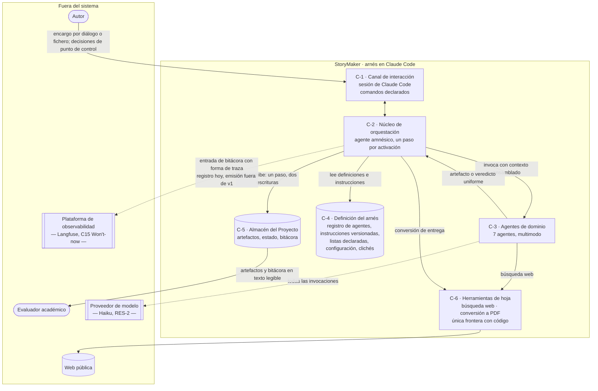
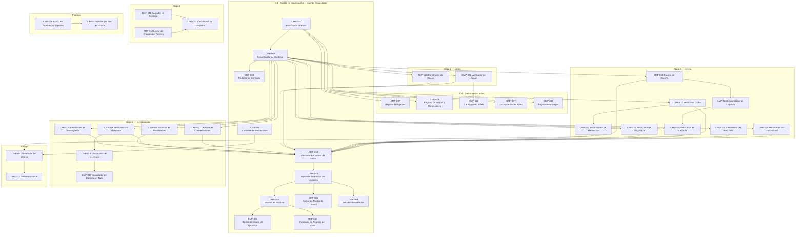
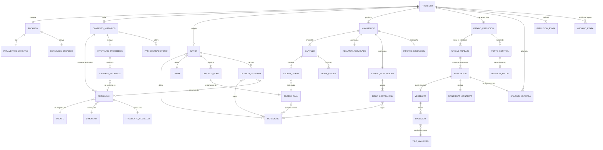
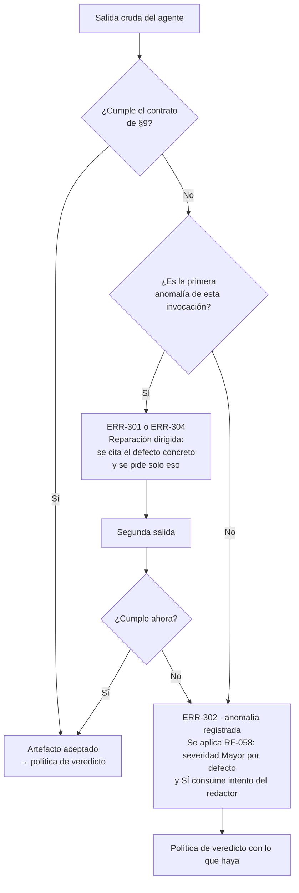
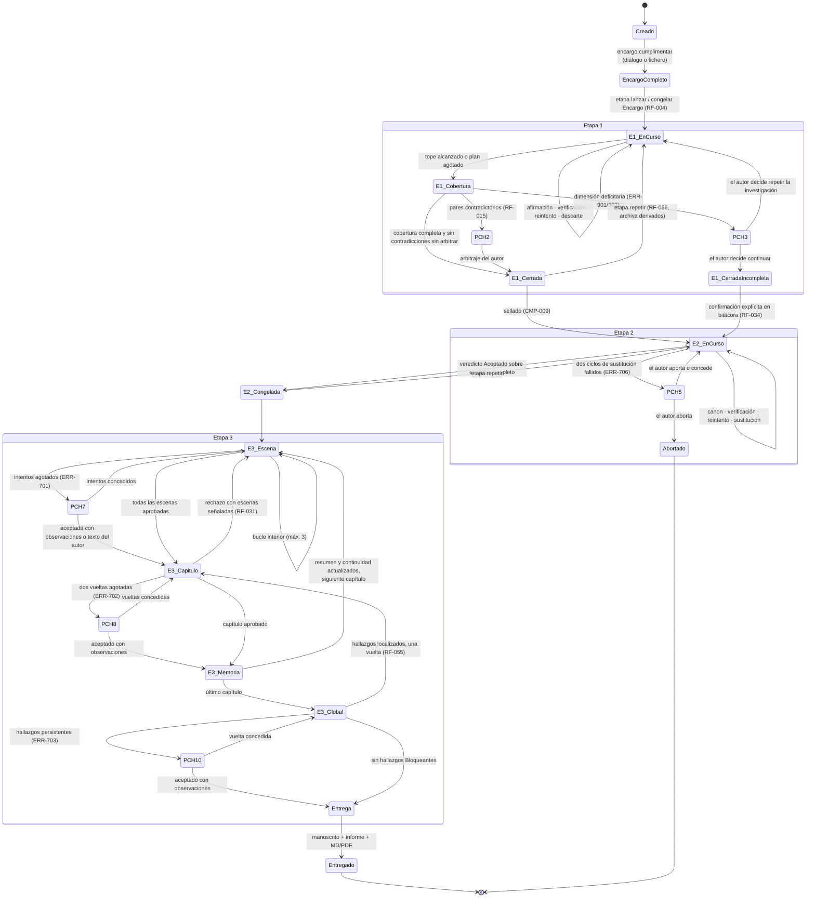

# Especificación Técnica — StoryMaker
### Arnés (*harness*) generador de novelas históricas · Diseño del CÓMO

**Versión:** v2.2 · **Estado:** Línea base aprobada, apta para consumo por un agente de codificación · **Fecha:** 18 de septiembre de 2026 · **Idioma:** español
**Especificación Funcional de referencia:** StoryMaker **v2.2** (18-09-2026), línea base aprobada. Es el contrato: única fuente de verdad sobre el QUÉ. Esta Especificación Técnica está acoplada a esa versión exacta (Anexo A.4).
**Qué es esta versión.** v2 es una **línea base reescrita**, no una revisión incremental. Incorpora como texto de base las decisiones tomadas al construir el arnés y ejercitarlo por primera vez, y las lecciones medidas de esa ejecución. El cuerpo se lee de corrido; el histórico vive en el Anexo A.5 y A.6. Ningún identificador `CMP`, `ADR`, `CTR`, `ERR`, `PRB`, `SPK`, `INC` ni `RT` se ha renumerado ni retirado.
**Arbitrajes del responsable técnico incorporados:** A-01 a A-07 (§1.4).
**Decisiones pendientes de arbitraje:** ninguna. Las tres elevadas durante la elaboración —ARB-01, ARB-02 y ARB-03— están resueltas como A-05, A-06 y A-07.
**Trabajo abierto:** doce propagaciones sobre la Especificación Funcional (§1.5, PF-01 a PF-12) y diez spikes (§19), de los cuales SPK-002, SPK-007 y SPK-010 son bloqueantes.
**Control de versiones y procedimiento de cambio:** Anexo A. El histórico de la elaboración previa a v1 está en A.5; todo cambio posterior se registra en A.6.
**Regla de alcance:** este documento no introduce funcionalidad nueva. Todo lo que el diseño reclamó y el funcional no pide está segregado en §22.

---

## 0. Resumen ejecutivo de la arquitectura

StoryMaker se implementa como una **máquina de estados dirigida por artefactos** (*artifact-driven state machine*) cuyo orquestador es deliberadamente **amnésico**: en cada invocación lee el estado persistido y la bitácora, calcula **una sola** unidad de trabajo, invoca al agente que el registro declara para ese paso, escribe el resultado y el nuevo estado, y termina. El bucle no vive en la conversación: vive en el sistema de ficheros. Esta decisión (ADR-001) es la respuesta a la fuerza que domina el problema —cientos de invocaciones encadenadas contra una ventana de contexto pequeña (RES-2)— y es lo que hace ciertas la reanudación (RF-035), la observabilidad del avance (RF-042) y la ejecución de corrido sin degradación silenciosa (R-21).

Todo estado narrativo se representa en tres niveles complementarios: artefactos sellados e inmutables (Contexto Histórico, Canon), memoria escalonada (resumen acumulado por capítulo) y **estado de continuidad estructurado** por personaje y objeto, que es lo que da a la validación global los elementos rastreables que PA-018 exige. El contexto de cada invocación se ensambla contra un contrato declarado y un **orden de prelación explícito** (§11.2): lo que no cabe se descarta desde la prioridad más baja y la omisión se registra; lo obligatorio nunca se descarta, y si no cabe, la invocación no se realiza y escala.

La ampliabilidad (OBJ-7), que el autor sitúa por encima de la calidad literaria, se sostiene sobre dos mecanismos y no sobre buenas intenciones: un **registro declarado de agentes** y un **contrato uniforme de veredicto** con criterios numerados, de modo que el orquestador no conoce a ningún verificador en particular.

Bajo RES-11 el arnés no puede prometer garantías numéricas: los umbrales de anacronismo, longitud y no reproducción de fuentes son **controles declarados y auditables a posteriori**, no verificados (arbitraje A-02, §10.1 del funcional). Este documento distingue en cada punto lo que se garantiza, lo que se verifica y lo que solo se audita.

---

## 1. Auditoría de la especificación funcional

### 1.1 Estado formal del documento recibido

| Comprobación | Resultado | Detalle |
|---|---|---|
| Identificadores presentes y únicos | **Conforme, con reservas editoriales** | RF-001 a RF-063 y RF-066 vigentes; RF-064, RF-065 y RNF-031 obsoletos con identificador conservado. RNF-001 a RNF-030 vigentes. Sin duplicados de identificador |
| Criterios de aceptación existentes | **Conforme** | Los 64 RF vigentes llevan bloque Gherkin con al menos dos escenarios |
| Criterios de aceptación verificables | **Parcialmente conforme** | Cuatro RNF con umbral numérico carecen de mecanismo de medición bajo RES-11 (§1.3, H-T04) |
| Matriz de trazabilidad cerrada | **Conforme** | §13.1 recoge las 74 afirmaciones, los 13 nodos y las 21 aristas; §13.2 da origen a todo requisito. Sin huérfanos |
| Preguntas abiertas | **Ninguna** | Las 28 PA están resueltas en §15.1 |
| Supuestos vivos | **26** | SUP-004 a SUP-030 salvo los marcados resueltos u obsoletos. Todos condicionan parámetros, ninguno condiciona la forma del sistema |

### 1.2 Preguntas abiertas: clasificación

No queda ninguna `PA-XXX` pendiente. La clasificación exigida por la Fase 0 se aplica por tanto a los **supuestos vivos**, que son lo que queda por confirmar:

| Supuesto | Clase | Tratamiento en este diseño |
|---|---|---|
| SUP-005 (límites 2/2/3/2), SUP-007 (3-8-50), SUP-010 (tolerancias 20 %/10 %), SUP-023 (tabla de severidades) | **Diferible** — parámetro | Externalizados a un artefacto de configuración declarativa del arnés, leído por el orquestador; cambiar un valor no toca ningún agente (ADR-023). Opción más reversible |
| SUP-011 (resumen acumulado), SUP-024 (escenas aprobadas al Escritor), SUP-028 (tres capítulos íntegros) | **Bloqueante de arquitectura** | Determinan la estrategia de memoria y el presupuesto de contexto. Resueltos en §11.3 y §11.2; su fragilidad se eleva a SPK-001 |
| SUP-029 (estado persistido del orquestador) | **Bloqueante de arquitectura** | Es la premisa de ADR-001. Sin él no hay diseño viable |
| SUP-013 (granularidad de reanudación) | **Bloqueante de arquitectura** | Fija la unidad de trabajo y el punto de control (§12.2) |
| SUP-017 (persistencia en ficheros del proyecto) | **Bloqueante de arquitectura** | Adoptado; ADR-003 |
| SUP-004, SUP-006, SUP-008, SUP-009, SUP-012, SUP-014, SUP-015, SUP-016, SUP-018 a SUP-022, SUP-025, SUP-030 | **Diferible** | Afectan a criterios o a alcance futuro, no a la forma del sistema |

Al no haber bloqueantes sin resolver en el funcional, la Fase 0 no ha requerido devolver preguntas sobre el QUÉ. Las cuatro cuestiones elevadas (§1.4) son de **frontera de diseño**, no de alcance.

### 1.3 Hallazgos: defectos, contradicciones y requisitos no implementables tal como están redactados

Numerados `H-Tnn`. Ninguno se ha reinterpretado en silencio.

| ID | Tipo | Hallazgo | Impacto en el diseño | Tratamiento adoptado |
|---|---|---|---|---|
| **H-T01** | Requisito no implementable | **§11.4, criterio a)** exige «manuscrito […] **sin escalados al autor en toda la ejecución**», pero PCH-1 (diálogo de captura) es un escalado obligatorio cuando el Encargo no llega por fichero, y PCH-2, PCH-3, PCH-5, PCH-7, PCH-8 y PCH-10 son condicionales | El criterio de aceptación del arnés es inalcanzable por el canal de diálogo | **Arbitraje A-05**: se lee como «sin escalados **dentro de las tres etapas**», coherente con §7.0 («la etapa *es* el diálogo»). PCH-1 no cuenta como escalado; PCH-2 a PCH-10 sí. La ejecución de aceptación puede realizarse por cualquiera de los dos canales |
| **H-T02** | Contradicción residual | **§5.2 y §7.6** asignan al Agente Constructor de Canon el paso «Generación de la lista de clichés», y §15.1 conserva PA-009 («la lista la genera un agente»). **RF-056, E71, E73 y PA-027** establecen que la lista es fija y aportada con el arnés | Un paso del mapa de agentes no tiene contenido: no hay nada que generar | Prevalece la entrada posterior (regla 4 de §18.2): el paso se **suprime del flujo** y la lista de §11.5 se modela como artefacto fijo del arnés (CMP-022). §5.2 y §7.6 quedan señalados como pendientes de propagación |
| **H-T03** | Incoherencia numérica | **R-07** propone como mitigación «tolerancia del 15 % en RNF-006»; **RNF-006, SUP-010 y PA-020** fijan 20 % por párrafo y 10 % por capítulo | Ninguno: es una errata | Rigen 20 %/10 %. Señalado para corrección editorial |
| **H-T04** | Umbral sin mecanismo | **RNF-004** (0 anacronismos), **RNF-013** (< 15 palabras consecutivas) y la parte de palabras de **RNF-006** exigen recuentos y comparaciones literales que RES-11 prohíbe implementar | Cuatro RNF con umbral numérico sin mecanismo que lo garantice ni prueba que lo mida, contra la regla dura 5 | **Arbitraje A-02**: se mantienen como **control declarado**, no como garantía. §13.4 declara, por cada uno, qué se garantiza, qué se verifica y qué solo se audita. Las pruebas asociadas miden **ejecución del control**, no cumplimiento del umbral |
| **H-T05** | Bucle sin límite | **RF-061, escenario «Hallazgo genérico»**: un hallazgo sin cita ni criterio «se devuelve al verificador y **no consume un intento**». No hay límite declarado para esa devolución | Quinto bucle del sistema sin condición de terminación, contra RNF-014, que solo contabiliza cuatro | **Arbitraje A-06**: se acota a **una sola devolución** por veredicto; si el segundo veredicto vuelve malformado, se aplica RF-058 (severidad Mayor por defecto), se registra la anomalía y **sí** consume intento. ADR-012. Es una desviación declarada del enunciado literal de RF-061, aprobada por el responsable |
| **H-T06** | Bucle sin límite | **RF-023, casos límite**: «el sustitutivo también se descarta — se escala al autor tras **dos ciclos de sustitución**». RNF-014 no lo cuenta entre los cuatro bucles con límite | Sexto bucle; el límite existe pero no figura en la métrica de RNF-014 | **Arbitraje A-07**: se implementa con límite 2 y se cuenta como bucle del sistema. **RNF-014 pasa de «4 de 4» a «6 de 6»** y PRB-014 comprueba los seis. Exige propagación sobre la funcional (§1.5) |
| **H-T07** | Tensión entre umbrales | **RNF-005** admite «≤ 1 contradicción cada 10 capítulos»; **RNF-023** exige «0 hallazgos Bloqueantes tras la validación global», y una contradicción entre capítulos es Bloqueante por la tabla de RF-051 | Dos umbrales incompatibles sobre el mismo fenómeno | Se resuelven por momento de medición: RNF-005 mide **antes** de la validación global (calidad del proceso de redacción); RNF-023 mide **después** (calidad de la entrega). Declarado en §13.3 |
| **H-T08** | Responsabilidad sin agente | **RF-027** (resumen acumulado), **RF-015** (contradicciones del contexto) y **RNF-013** (no reproducir fuentes) no tienen agente asignado ni en E59 ni en §7.6 | Tres pasos sin dueño; el orquestador «improvisaría», que RF-057 prohíbe | **Arbitraje A-04**: se reutilizan los ocho agentes (precedente PA-023). Resumen acumulado y continuidad → Agente Orquestador; contradicciones del contexto → Agente Verificador de Investigación en segundo modo; RNF-013 → Agente Verificador de Canon e Historia en modo global. ADR-020 |
| **H-T09** | Laguna de diseño delegada | **RF-047** exige reducir el contexto «aplicando una política de prioridad **declarada**», pero el funcional no la declara | Sin orden de prelación, dos implementadores descartan cosas distintas | Es legítimamente materia del CÓMO. Se declara en §11.2 y se eleva como decisión con ADR-007 |
| **H-T10** | Laguna de diseño delegada | **RF-014 y RF-054** fijan mínimo 3 y máximo 8 por dimensión sobre **siete** dimensiones obligatorias, con tope global de 50. 7 × 8 = 56 > 50 | El tope global es el que ata; el máximo por dimensión solo actúa si la investigación se desequilibra | Se implementa el tope global como condición de parada prioritaria y el de dimensión como redistribuidor (CMP-019). Sin conflicto real; se documenta para que no se «corrija» |
| **H-T11** | Fichas de continuidad sin requisito | **§1.4 (tensión E61)** y la justificación de **RF-030** apoyan la memoria en «el resumen acumulado **y las fichas de continuidad**», pero ninguna RF las crea, §6.1 excluye el «Informe de continuidad como artefacto autónomo» y P-05 las propone como no pedidas | Contradicción interna del funcional sobre un elemento que condiciona RNF-005 y RF-055 | **Arbitraje A-01**: se tratan como parte integrante de RF-030 y RF-055, no como propuesta. Se diseñan como **estado derivado** del manuscrito aprobado, no como artefacto de canon: no altera ninguna invariante de inmutabilidad. CMP-029, ADR-008, ADR-018 |
| **H-T12** | Requisito condicionado por alcance | **RNF-020** exige «100 % de invocaciones con traza emitida» en la plataforma de observabilidad, pero la capacidad C15 es Won't-now (E67) | Un RNF vigente exige lo que el alcance de v1 excluye | Se separa **registro** de **emisión**: desde v1 la bitácora escribe, por invocación, el registro con forma de traza completo (RF-048, RF-049, RF-050); la emisión queda fuera de v1. RNF-020 se mide en v1 sobre el registro local y se declara así. ADR-024 |
| **H-T13** | Requisito condicionado por alcance | **RNF-018** exige 7 de 7 operaciones disponibles en la interfaz, y C13 es Won't-now | Igual que H-T12 | El canal vigente es la sesión de Claude Code (§12.2 del funcional). Las siete operaciones se implementan como **comandos declarados** del arnés, de modo que la futura interfaz sea una fachada y no una reimplementación (§9.2) |
| **H-T14** | Defecto editorial | **§1.3** del funcional termina en E59; las afirmaciones **E60 a E74** no figuran en esa tabla y aparecen intercaladas, con su clasificación, dentro de §13.1. **E67 no aparece clasificada** en ninguna de las dos | Ninguno sobre el diseño: el contenido está y es inequívoco | Señalado para corrección editorial. Este documento referencia E60–E74 por su contenido en §13.1 |
| **H-T15** | Defecto editorial | El campo **Origen de RF-024** cita «corte de tres capítulos [SUPUESTO] SUP-028», que pertenece a RF-030 | Ninguno | Señalado |
| **H-T16** | Ambigüedad operativa | **RF-031, escenario 2**: un hallazgo sin localización devuelve al bucle interior **todas** las escenas del capítulo, y cada una consume intentos del bucle interior (límite 3). Con el límite del bucle exterior en 2, el peor caso por capítulo se multiplica | Coste real superior al declarado en §7.4 si los hallazgos globales de capítulo son frecuentes | Se implementa literalmente y se refleja en la cota de RNF-009 con los dos casos separados (§12.6). No se altera el requisito |

**Conclusión de la auditoría.** La especificación funcional es suficiente para cerrar el diseño. Los dieciséis hallazgos se reparten en: dos requisitos no implementables tal como están redactados (H-T01, H-T04), dos contradicciones residuales por propagación incompleta (H-T02, H-T11), dos bucles sin límite declarado (H-T05, H-T06), dos requisitos que exigen lo que el alcance excluye (H-T12, H-T13), dos lagunas que son legítimamente materia del CÓMO (H-T09, H-T10), y ocho defectos editoriales o tensiones menores. **Ninguno impide diseñar; cuatro exigían una desviación declarada del enunciado literal** (H-T01, H-T04, H-T05, H-T11) **y los siete arbitrajes de §1.4 las resuelven todas.**

### 1.4 Arbitrajes del responsable técnico incorporados

| ID | Cuestión elevada | Decisión | Consecuencia asumida |
|---|---|---|---|
| **A-01** | Fichas de continuidad: ¿alcance derivado o propuesta? (H-T11) | **Requisito implícito de RF-030 y RF-055** | Una invocación adicional por capítulo (CMP-029). Refuerza RNF-005 y da sustrato a PA-018 |
| **A-02** | Umbrales numéricos sin mecanismo bajo RES-11 (H-T04) | **Control declarado, no garantía** | RNF-004, RNF-006 (palabras) y RNF-013 dejan de ser verificables y pasan a auditables. Se declara en §13.4 y debe figurar en la memoria académica |
| **A-03** | ¿RES-11 alcanza a la infraestructura de pruebas? | **Sí: las pruebas también se ejecutan con agentes** | Las pruebas heredan el no determinismo de lo que prueban. Mitigado con dobles por eco de *fixture*, comprobaciones de presencia en lugar de juicio, y repetición con informe de varianza (§15) |
| **A-04** | Responsabilidades sin agente (H-T08) | **Reutilizar los ocho agentes de E59** | El Orquestador, el Verificador de Investigación y el Verificador de Canon e Historia pasan a ser multimodo. Se conserva intacta la lista canónica del autor |
| **A-05** | Lectura de §11.4 criterio a) (H-T01) — antes ARB-01 | **«Sin escalados» significa «sin escalados dentro de las tres etapas»** | PCH-1 queda fuera del cómputo. La ejecución de aceptación es válida por ambos canales, luego RF-063 deja de ser condición para alcanzar el criterio a). Los escalados condicionales PCH-2 a PCH-10 siguen contando, que es donde el criterio conserva su exigencia |
| **A-06** | Límite de la devolución de RF-061 (H-T05) — antes ARB-02 | **Una sola devolución por veredicto** | El bucle termina. Un verificador sistemáticamente malformado acaba consumiendo intentos del redactor por culpa ajena; el informe lo hace visible como anomalía ERR-302, que es la señal correcta |
| **A-07** | Umbral de RNF-014 (H-T05, H-T06) — antes ARB-03 | **De «4 de 4 bucles con límite» a «6 de 6»** | La métrica pasa a describir el sistema real. Exige modificar un RNF vigente por el procedimiento de §18.3 del funcional; la propagación queda listada en §1.5. §7.4 del funcional conserva sus cuatro filas: los dos límites añadidos viven en `configuracion.json` (CMP-037), no en esa tabla |

### 1.5 Propagación pendiente sobre la Especificación Funcional

**No queda ninguna decisión pendiente de arbitraje.** Lo que sigue son las modificaciones que los arbitrajes y los hallazgos exigen sobre el documento funcional, para que se tramiten por el procedimiento de §18.3 y no queden como acuerdos que viven solo en una conversación (regla 6 de §18.2).

| # | Cambio en la funcional | Origen | Tipo |
|---|---|---|---|
| **PF-01** | **RNF-014**: umbral de «4 de 4 bucles con límite» a «6 de 6», enumerando los seis | A-07, H-T06 | Modificación de RNF vigente |
| **PF-02** | **RF-061**: acotar la devolución del hallazgo genérico a una sola vez, con el comportamiento al agotarla | A-06, H-T05 | Modificación de RF vigente |
| **PF-03** | **§11.4 criterio a)**: precisar «sin escalados dentro de las tres etapas» | A-05, H-T01 | Precisión de criterio de éxito |
| **PF-04** | **RF-030 y §6.1**: dar entidad a las fichas de continuidad como estado derivado, o retirar sus dos menciones | A-01, H-T11 | Alta de requisito o corrección |
| **PF-05** | **§5.2 y §7.6**: suprimir el paso «Generación de la lista de clichés», sin contenido desde RF-056 | H-T02 | Corrección por propagación |
| **PF-06** | **§15.1, PA-009**: marcar como sustituida por PA-027 | H-T02 | Corrección editorial |
| **PF-07** | **§1.3**: incorporar E60 a E74, hoy intercaladas en §13.1, y clasificar E67 | H-T14 | Corrección editorial |
| **PF-08** | **R-07**: la tolerancia citada es 20 %/10 %, no 15 % | H-T03 | Errata |
| **PF-09** | **RF-024, campo Origen**: SUP-028 pertenece a RF-030 | H-T15 | Errata |
| **PF-10** | **§1.4**, fila E6 × E41a: superada por RES-7 y E63 (ejecución de corrido) | H-T10 (nota), E63 | Corrección por propagación |
| **PF-11** | **RNF-020 y RNF-018**: declarar que en v1 se miden sobre el canal y el registro locales, por ser C13 y C15 Won't-now | H-T12, H-T13 | Precisión de alcance |
| **PF-12** | **SUP-017**: la ejecución ya no es «una sesión independiente por etapa» desde E63; la parte viva del supuesto es solo la persistencia en ficheros | E63, RES-7 | Corrección editorial |

Ninguna de las doce altera la arquitectura: PF-01 a PF-03 ratifican decisiones ya tomadas, PF-04 depende de A-01 y las ocho restantes son correcciones. Mientras no se tramiten, **prevalece lo que dice este documento técnico**, que las declara todas.

---

## 2. Drivers arquitectónicos y conflictos resueltos

### 2.1 Drivers, ordenados por poder de restricción

Poder de restricción = cuánta forma del sistema queda determinada por el driver. Los tres primeros no admiten negociación: eliminan familias enteras de arquitectura.

| ID | Driver | Origen | Qué elimina del espacio de soluciones |
|---|---|---|---|
| **DRV-01** | **La ventana de contexto se agota mucho antes que la novela.** Cientos de invocaciones encadenadas con un modelo pequeño, en ejecución de corrido | RES-2, E63, R-21, RF-062, SUP-029 | Elimina toda arquitectura en que el bucle, el estado o la memoria vivan en la conversación. Obliga a estado externo y a orquestador amnésico |
| **DRV-02** | **La orquestación no puede contener código:** ninguna decisión del flujo la toma un programa | RES-11, RF-059, RNF-027, RNF-028 | Elimina motores de flujo, validadores de esquema ejecutables, recuentos exactos y comparaciones literales. Obliga a que todo control sea un juicio de agente contra criterios enumerados |
| **DRV-03** | **Ampliabilidad por encima de calidad literaria:** añadir un verificador no debe tocar los existentes | E58, OBJ-7, RNF-026, RF-057, RF-058 | Elimina el orquestador con una rama por verificador, los agentes que se invocan entre sí y los contratos específicos por agente |
| **DRV-04** | **Toda ejecución debe terminar:** todo bucle con límite y comportamiento definido al agotarlo | RNF-014, H4, E35, E48 | Elimina los ciclos de reescritura abiertos y las políticas «hasta que salga bien» |
| **DRV-05** | **Trazabilidad total y bitácora de solo añadido:** todo intento, veredicto, contexto y decisión queda registrado y nada se sobrescribe | E41b/c, RF-036, RF-046, RNF-001, RNF-007, RNF-019, RNF-029 | Elimina la escritura destructiva, los artefactos sin versión de instrucción y el contexto ensamblado de forma implícita |
| **DRV-06** | **Inmutabilidad estricta de artefactos sellados:** contexto y canon no se tocan; la única vía de cambio es repetir la etapa | E74, RF-013, RF-024, RF-066 | Elimina la edición parcial, el parcheo y las migraciones en caliente sobre un proyecto en curso |
| **DRV-07** | **Contexto acotado y declarado por invocación**, con reducción registrada al desbordar | RES-9, RF-045 a RF-047, RNF-019 | Elimina el «pásale todo lo que tengas». Obliga a presupuesto y a orden de prelación |
| **DRV-08** | **Coherencia de largo alcance** entre capítulos distantes | RNF-005, RNF-023, RF-030, RF-055, R-01 | Elimina el redactor sin memoria. Obliga a memoria escalonada y a elementos rastreables |
| **DRV-09** | **Reanudación sin pérdida de trabajo aprobado** | RF-035, RNF-011, R-11 | Obliga a granularidad de punto de control por unidad de trabajo y a idempotencia |
| **DRV-10** | **Comprensibilidad por un tercero sin leer código** | E4, E5, RNF-001, RNF-028, RES-6 | Elimina formatos binarios, índices opacos y artefactos que exijan herramienta para leerse |
| **DRV-11** | **Sin recuperación documental sobre corpus propio;** la única obtención es búsqueda web | RES-3, RES-4, RNF-017 | Elimina índices vectoriales, *chunking* y embebidos. La «recuperación» se reduce a selección declarada sobre un contexto de ≤ 50 afirmaciones |
| **DRV-12** | **Costura de observabilidad sin construirla:** registrar hoy lo que se emitirá mañana | RES-10, E67, E68, RNF-020, RNF-021 | Obliga a que la entrada de bitácora tenga ya forma de traza, aunque nada la consuma |
| **DRV-13** | **Simplicidad explicable por encima de lo óptimo;** alcance académico | RES-6, E4 | Elimina la sofisticación que no pueda explicarse en un párrafo a un tercero |
| **DRV-14** | **Sin presupuesto ni umbral de duración**, pero con cota conocida de antemano | E49, E50, RNF-009 | Elimina el aborto por presupuesto. Obliga a contabilidad informativa |

### 2.2 Conflictos entre drivers y qué se sacrifica

Un diseño que afirma satisfacerlo todo no ha decidido nada. Aquí está lo que se sacrifica.

| ID | Conflicto | Resolución | **Qué se sacrifica** |
|---|---|---|---|
| **CNF-01** | **DRV-02 (sin código) × DRV-05 (trazabilidad medible)** — las métricas de recuento exigen cálculo exacto | Prevalece DRV-02: los controles se ejecutan por agente contra criterios enumerados y registran lo que encontraron | **La garantía dura.** RNF-004, RNF-013 y la parte de palabras de RNF-006 dejan de ser verificables. El arnés promete que un verificador buscó con el inventario delante, no que no haya anacronismos. Arbitraje A-02 |
| **CNF-02** | **DRV-08 (coherencia de largo alcance) × DRV-01/DRV-07 (ventana y contexto acotado)** — la coherencia querría todo el manuscrito delante | Prevalece el presupuesto: tres capítulos íntegros (SUP-028) + resumen escalonado + estado de continuidad | **La detección de contradicciones literales a distancia media.** Entre el capítulo n−4 y el n solo se compara lo que el resumen y las fichas hayan conservado. RNF-005 admite ≤ 1 contradicción cada 10 capítulos precisamente por esto |
| **CNF-03** | **DRV-03 (ampliabilidad) × DRV-13 (simplicidad)** — un registro de agentes y un contrato uniforme son maquinaria que un pipeline fijo no necesitaría | Prevalece DRV-03 por mandato explícito del autor (E58, jerarquía de §2 del funcional), **acotado**: el mecanismo es un registro declarativo y un esquema de veredicto, no un sistema de extensiones | **Ligereza en la primera implementación.** Dos artefactos y un esquema que un pipeline de tres etapas fijas no necesitaría. A cambio, RNF-026 es alcanzable |
| **CNF-04** | **DRV-04 (terminación) × OBJ-1 (novela completa sin intervención)** — un límite duro convierte el no-convergente en bloqueo | Prevalece DRV-04: límites de §7.4 y bloqueo con las cuatro opciones de RF-052 | **La autonomía plena.** Un solo párrafo irreductible detiene la ejecución. §11.4 criterio a) puede fallar por diseño, y esa es la señal correcta |
| **CNF-05** | **DRV-05 (nada se sobrescribe) × DRV-13 (bitácora legible)** — el registro exhaustivo crece hasta ser inmanejable (R-10) | Segmentación por etapa y capítulo, referencia en lugar de copia: la bitácora registra **identificadores y tamaños** de lo incluido en el contexto, no su contenido (RF-046, caso límite) | **La autocontención de la bitácora.** Reconstruir una invocación exige resolver referencias contra los artefactos. Es el precio de que la bitácora siga siendo legible |
| **CNF-06** | **DRV-06 (inmutabilidad) × coste de corregir (R-24)** — un defecto de canon en el capítulo 12 cuesta todo el manuscrito | Prevalece DRV-06 por mandato explícito (E74). Mitigación barata: el canon se valida entero antes de congelarse y PCH-6 existe | **El coste de la corrección tardía.** Es el mayor coste aislado del arnés y crece con cada capítulo aprobado. No se mitiga estructuralmente: se declara |
| **CNF-07** | **DRV-09 (reanudación por unidad de trabajo) × coste de orquestación** — persistir estado en cada paso multiplica las escrituras | Prevalece DRV-09: escritura de bitácora y estado **antes** de iniciar el paso siguiente (RNF-010) | **Rendimiento de la orquestación.** Dos escrituras por unidad de trabajo. Sin umbral de duración (E50), el coste es asumible |
| **CNF-08** | **A-03 (pruebas con agentes) × fiabilidad de las pruebas** | Prevalece A-03 por arbitraje del responsable | **El fallo fiable.** Una prueba que juzga con un modelo puede pasar un caso roto o suspender uno correcto. Mitigado, no eliminado (§15.1) |
| **CNF-09** | **DRV-11 (sin RAG) × calidad del Contexto Histórico** — la verificación juzga solo el fragmento (RES-5) | Prevalece DRV-11 | **El rigor de la fuente.** Una fuente mala con un fragmento coherente produce una afirmación verificada falsa (R-02, R-09). Se registra el dominio para que el informe lo muestre; no se filtra |
| **CNF-10** | **DRV-12 (costura de observabilidad) × R-12 (la envoltura absorbe el esfuerzo)** | Se registra con forma de traza desde v1; **no se construye ninguna integración** | **Ninguno relevante:** el coste es un esquema de entrada de bitácora más rico. La emisión queda fuera |

---

## 3. Restricciones impuestas frente a decisiones libres

### 3.1 Restricciones impuestas por el responsable del producto

La tabla de restricciones técnicas del encargo llegó **íntegramente vacía**. Conforme a lo declarado en el prompt maestro, lo no rellenado es decisión libre del arquitecto y queda como ADR. Ahora bien, la Especificación Funcional **ya impone** la mayor parte de esa tabla, y esas imposiciones son innegociables:

| Fila de la tabla del encargo | Valor impuesto | De dónde viene |
|---|---|---|
| Lenguaje y ecosistema | **Claude Code.** Definiciones de agente, instrucciones y artefactos de texto. Sin lenguaje de programación en el arnés | RES-1, RES-11, RF-059 |
| Modo de ejecución | **Local, en la sesión de Claude Code del autor**, sobre el sistema de ficheros del proyecto | RES-1, SUP-017 |
| Proveedor de modelo | **Uno solo: Haiku.** Sin selección ni comparación de modelos | RES-2, RNF-016, §4.2 |
| Persistencia | **Ficheros del proyecto.** Prohibida la base vectorial y el corpus indexado | SUP-017, RES-3, RNF-017 |
| Interfaz de usuario | **Ninguna en esta fase:** la sesión de Claude Code es el canal. GUI aplazada | RES-8, E67 |
| Orquestación | **Motor propio, y necesariamente sin código:** el orquestador es un agente | RES-11, RNF-027 |
| Presupuesto por ejecución | **Sin máximo.** Cota informativa obligatoria | E49, RNF-009 |
| Latencia aceptable | **Sin umbral.** Duración registrada, no exigida | E50 |
| Equipo implementador | **Un agente de codificación** consumiendo este documento, con el autor como responsable técnico | Audiencia declarada del encargo |
| Horizonte y madurez | **Prototipo académico mantenible y ampliable**, no producción | E4, RES-6, E58 |
| Operación sin conexión | **No:** la Etapa 1 exige búsqueda web | RES-4, E9 |
| Licenciamiento y dependencias vetadas | **Vetado todo código en el arnés**; admitido en herramientas de hoja | RES-11, E66 |
| Estándares internos | **Ninguno declarado.** Rigen los del propio funcional: identificadores estables, nada se borra, la entrada posterior prevalece | §18.2 del funcional |

### 3.2 Decisiones libres que corresponden al arquitecto

Cada una lleva su ADR. Ninguna amplía el alcance.

| Decisión libre | ADR | Por qué es libre |
|---|---|---|
| Forma de la orquestación: máquina de estados dirigida por artefactos con orquestador amnésico | ADR-001 | El funcional exige estado persistido (RF-062) pero no su forma |
| Unidad de trabajo y clave de idempotencia | ADR-002 | No especificado |
| Disposición de directorios y formatos de fichero | ADR-003, ADR-004, ADR-022 | SUP-017 fija «ficheros»; nada más |
| Bitácora en líneas JSON de solo añadido, segmentada, con índice | ADR-005 | RF-036 fija el contenido, no el soporte |
| Inmutabilidad por escritura única y nombres que incluyen el intento | ADR-006 | Mecanismo no especificado |
| Orden de prelación del contexto | ADR-007 | RF-047 lo exige «declarado» y no lo declara (H-T09) |
| Memoria: resumen escalonado + estado de continuidad estructurado | ADR-008, ADR-018 | Arbitraje A-01 sobre H-T11 |
| Selección de afirmaciones por defecto: todas | ADR-009 | No especificado; DRV-11 lo hace viable |
| Arquitectura de prompts en cinco capas y registro versionado | ADR-010 | RF-050 exige versión, no estructura |
| Declaración única del modelo como abstracción de proveedor | ADR-011 | RES-2 fija el modelo, no cómo se declara |
| Validación y reparación de salidas estructuradas | ADR-012 | No especificado; H-T05 lo exige |
| Concurrencia: secuencial, con excepción acotada | ADR-013 | No especificado |
| Mecánica de los puntos de control | ADR-014 | §12.2 fija cuáles, no cómo se materializan |
| Versionado de esquema sin migración en caliente | ADR-015 | No especificado |
| Frontera de las herramientas de hoja | ADR-016 | RES-11 la enuncia; aquí se hace operativa |
| Pruebas ejecutadas por agentes con dobles por eco | ADR-017 | Arbitraje A-03 |
| Configuración del arnés en artefacto declarativo | ADR-023 | SUP-030 la deja en «las instrucciones»; se precisa dónde |
| Registro con forma de traza desde v1 | ADR-024 | H-T12 |
| Repetición de etapa por archivado, no por borrado | ADR-021 | RF-066 exige conservar en bitácora, no dice cómo |
---

## 4. Arquitecturas candidatas y comparativa

Tres candidatas genuinamente distintas. Se diferencian en **dónde vive el bucle** y **quién recuerda**, que es la única pregunta que importa bajo DRV-01.

### ARQ-A · Orquestador conversacional único

Una sola sesión de Claude Code ejecuta el arnés completo. El agente principal mantiene el bucle en su propia conversación, invoca subagentes para cada paso y conserva el estado en el hilo. Los artefactos se escriben al final de cada etapa.

**Cómo termina:** el agente cuenta los intentos de memoria.
**Cómo reanuda:** no reanuda; se relanza desde el último artefacto cerrado.

### ARQ-B · Máquina de estados dirigida por artefactos, con orquestador amnésico

El orquestador es una **instrucción, no una conversación**. En cada activación: lee el artefacto de estado y la bitácora → calcula exactamente **una** unidad de trabajo → ensambla su contexto contra el contrato declarado → invoca al agente que el registro declara → valida la salida contra su esquema → escribe bitácora y estado → termina. El bucle es la reactivación repetida, no un ciclo dentro de una conversación. Ningún agente recuerda nada entre invocaciones; toda la memoria es fichero.

**Cómo termina:** los contadores de intento viven en el estado persistido, no en la cabeza de nadie.
**Cómo reanuda:** leyendo dos ficheros. La reanudación y la ejecución normal son el mismo mecanismo.

### ARQ-C · Coreografía de agentes de etapa

Tres agentes de etapa autónomos y de larga vida. Cada uno posee su bucle completo, produce su artefacto sellado e invoca al siguiente. No hay orquestador central: hay traspaso.

**Cómo termina:** cada agente de etapa aplica sus propios límites.
**Cómo reanuda:** reejecutando la etapa entera.

### 4.1 Comparativa contra los drivers

Escala: **++** satisface con holgura · **+** satisface · **−** satisface con coste · **−−** no satisface.

| Driver | ARQ-A | ARQ-B | ARQ-C | Comentario decisivo |
|---|:--:|:--:|:--:|---|
| DRV-01 Ventana agotada antes que la novela | **−−** | **++** | **−−** | Es el driver que decide. En A y C el estado vive en una conversación que se agota a mitad de la Etapa 3 y degrada en silencio (R-21). En B no hay conversación que agotar |
| DRV-02 Sin código en la orquestación | **+** | **+** | **+** | Las tres son puras de agentes. Empate real |
| DRV-03 Ampliabilidad sin tocar lo existente | **−** | **++** | **−−** | En C cada agente de etapa conoce al siguiente: añadir un verificador obliga a editarlo. En A el bucle está escrito en la instrucción del orquestador, con una rama por verificador. En B el registro declara y el orquestador no conoce a nadie |
| DRV-04 Terminación garantizada | **−** | **++** | **+** | Contar intentos de memoria (A) es exactamente lo que falla cuando la ventana se llena |
| DRV-05 Trazabilidad total, solo añadido | **−** | **++** | **−** | En A y C el registro es un efecto secundario que el agente puede olvidar; en B escribir la bitácora **es** el paso |
| DRV-06 Inmutabilidad de lo sellado | **+** | **++** | **+** | En B el sellado es una transición de estado con invariantes comprobadas (CMP-009) |
| DRV-07 Contexto declarado y acotado | **−−** | **++** | **−** | En A el contexto es «lo que lleva el hilo»: imposible declarar qué recibió el agente, luego RNF-019 es inalcanzable |
| DRV-08 Coherencia de largo alcance | **+** | **+** | **+** | Depende de la estrategia de memoria, no de la forma de orquestación. Empate |
| DRV-09 Reanudación sin pérdida | **−−** | **++** | **−** | En C se pierde la etapa entera; en A, todo lo no escrito |
| DRV-10 Comprensible sin leer código | **++** | **+** | **++** | **Única ventaja real de A y C:** el flujo se lee de corrido. En B hay que reconstruirlo leyendo el registro y el estado, que es un salto de abstracción |
| DRV-11 Sin RAG | **+** | **+** | **+** | Empate |
| DRV-12 Costura de observabilidad | **−** | **++** | **−** | La traza por invocación exige que exista el concepto de invocación como unidad, que solo B tiene |
| DRV-13 Simplicidad | **++** | **−** | **+** | **Coste real de B:** maquinaria de estado, registro y contratos que A no necesita |
| DRV-14 Cota conocida | **−** | **++** | **−** | Contabilizar invocaciones exige unidad de invocación |
| **Balance** | 2 fuertes, 6 débiles | **11 fuertes, 1 débil** | 2 fuertes, 5 débiles | |

### 4.2 Por qué no se elige la más simple

ARQ-A es más legible y más barata de construir, y **eso importa** bajo RES-6. Se descarta por una sola razón, no por el recuento: con 10 capítulos y 8 párrafos, el peor caso son ~1.000 invocaciones encadenadas (§7.4 del funcional). Ninguna conversación sostiene eso. ARQ-A no falla: **se degrada en silencio**, que es el modo de fallo que R-21 califica de peor que fallar. Un arnés cuyo criterio de éxito es la comprensibilidad no puede permitirse un fallo que no se ve.

ARQ-C se descarta porque el traspaso entre agentes de etapa crea acoplamiento direccional —cada etapa conoce a la siguiente— y OBJ-7 es el objetivo que el autor puso por encima de todos.

---

## 5. Arquitectura seleccionada

**ARQ-B · Máquina de estados dirigida por artefactos con orquestador amnésico.** ADR maestro: **ADR-001** (§17).

### 5.1 Vista de contenedores



**Límites del sistema.** Dentro: el núcleo de orquestación, los agentes, la definición del arnés, el almacén del Proyecto y las dos herramientas de hoja. Fuera: el autor, el evaluador, la web, el proveedor de modelo y la plataforma de observabilidad. La GUI (C13) y la integración con Langfuse (C15) están **fuera del alcance de v1** y aparecen en el diagrama solo para fijar dónde se enchufarán.

### 5.2 Vista de componentes



### 5.3 Frontera de acoplamiento: qué puede hablar con qué

| Frontera | Dirección | Sincronía | Invariante que protege |
|---|---|---|---|
| Orquestador → Agente de dominio | Unidireccional | Síncrona, bloqueante | Ningún agente invoca a otro. Es lo que hace cierta RNF-026: un agente nuevo no aparece en la instrucción de ninguno de los existentes |
| Agente → Orquestador | Solo artefacto o veredicto conforme a esquema | — | El agente no decide la transición; solo dictamina. RF-058, RNF-027 |
| Orquestador → Almacén del Proyecto | Lectura libre; **escritura solo por el orquestador** | Síncrona | Escritor único. Elimina la carrera sobre el estado y hace determinista el orden de la bitácora |
| Agente → Almacén del Proyecto | **Prohibida.** El agente recibe contexto y devuelve contenido; no lee ni escribe ficheros | — | RF-045: el agente no puede haber visto nada fuera del contrato. Sin esta frontera, RNF-019 es indemostrable |
| Orquestador → Definición del arnés | Solo lectura | Síncrona | La configuración no se modifica durante una ejecución; una ejecución declara la versión con que corrió |
| Agente → Herramienta de hoja | Solo el Agente Investigador → búsqueda web | Síncrona | Ninguna otra invocación sale a la red |
| Orquestador → Herramienta de hoja | Solo conversión de entrega | Síncrona | La herramienta transforma; **no decide**. RNF-027 |
| Artefacto sellado → cualquiera | Solo lectura, para siempre | — | DRV-06. La escritura sobre un artefacto sellado es un error de sistema (ERR-501), no una operación denegada |
| Bitácora → cualquiera | Solo añadido | — | DRV-05. No existe operación de modificación ni de borrado |

---

## 6. Catálogo de componentes

Ficha por componente. «No le corresponde» delimita la responsabilidad tanto como el enunciado: es donde se ve si un componente está escondiendo una dificultad.

### 6.1 Núcleo de orquestación (C-2) — agente: **Agente Orquestador**

| ID | Responsabilidad (una frase) | No le corresponde | Entradas | Salidas | Estado que posee | Satisface |
|---|---|---|---|---|---|---|
| **CMP-001** | Determinar cuál es la única unidad de trabajo siguiente a partir del estado persistido y de las listas declaradas | Ejecutarla, juzgarla ni decidir si su resultado vale | CMP-005, CMP-007, CMP-008, CMP-037 | Unidad de trabajo con su clave de idempotencia | Ninguno (función pura sobre el estado) | RF-033, RF-034, RF-035, RF-060, RF-062, RNF-008, RNF-011, RNF-014 |
| **CMP-002** | Construir el contexto de una invocación a partir exclusivamente de las fuentes que su contrato declara | Decidir qué se descarta al desbordar (es de CMP-033) ni interpretar el contenido | CMP-001, almacén del Proyecto, CMP-038 | Contexto ensamblado + manifiesto de lo incluido | Ninguno | RF-045, RF-046, RNF-019, RES-9 |
| **CMP-033** | Aplicar el orden de prelación declarado cuando el contexto ensamblado no cabe, y registrar qué omitió | Ampliar el contexto, reordenar prioridades en tiempo de ejecución ni recortar en silencio | CMP-002 | Contexto reducido + registro de omisiones | Ninguno | RF-047, RNF-019 |
| **CMP-034** | Comprobar que la salida de un agente cumple su esquema declarado y, si no, pedir una única reparación | Corregir el contenido por su cuenta ni juzgar su calidad | Salida cruda del agente | Artefacto conforme, o error ERR-3xx | Contador de reparaciones de la unidad en curso | RF-058, RF-061, RNF-029 |
| **CMP-003** | Traducir un veredicto uniforme en la transición que corresponda: aceptar, reintentar, descartar, bloquear o elevar a punto de control | Emitir juicios propios sobre el artefacto ni alterar severidades salvo la agregación declarada de RF-051 | CMP-034, CMP-037 | Transición + eventos | Contadores de intento por unidad | RF-010, RF-011, RF-023, RF-029, RF-031, RF-032, RF-051, RF-058, RNF-014 |
| **CMP-004** | Añadir a la bitácora la entrada inmutable de un intento, un veredicto, una omisión o una decisión, antes de iniciar el paso siguiente | Borrar, reordenar o resumir entradas | Todo el núcleo | Línea añadida a la bitácora | La bitácora | RF-036, RF-046, RNF-001, RNF-007, RNF-010, RNF-029 |
| **CMP-005** | Leer y escribir el artefacto de estado de la ejecución de forma que un paso quede registrado antes de que empiece el siguiente | Contener nada que no sea reconstruible desde la bitácora | CMP-003, CMP-006 | Estado actualizado | **El estado de ejecución** | RF-062, RF-035, RNF-010, RNF-011 |
| **CMP-006** | Suspender la ejecución en un punto de control, presentar lo necesario para decidir y reincorporar la decisión al flujo | Decidir por el autor ni continuar sin decisión | CMP-003 | Solicitud de decisión; decisión registrada | Cola de puntos de control pendientes | RF-014, RF-015, RF-029, RF-032, RF-043, RF-052, RF-055, PCH-1 a PCH-10 |
| **CMP-009** | Sellar un artefacto comprobando sus invariantes de cierre y marcarlo inmutable con su fecha | Producir el contenido del artefacto ni reabrirlo jamás | CMP-003 | Artefacto sellado | Marca de sellado | RF-004, RF-013, RF-024, RF-038, RF-066, RNF-002, RNF-003 |
| **CMP-010** | Calcular la cota de invocaciones antes de ejecutar y llevar la cuenta real durante la ejecución | Abortar por coste: no hay presupuesto máximo (E49) | CMP-013, CMP-004 | Cota y consumo | Contadores acumulados | RF-002, RF-063, RNF-009 |
| **CMP-035** | Dar a cada entrada de bitácora la forma completa de traza y puntuación que la plataforma futura consumirá | Emitir nada a ninguna plataforma en v1 | CMP-004 | Entrada enriquecida | Ninguno | RF-048, RF-049, RF-050, RNF-020, RNF-021, RNF-022 |

### 6.2 Definición del arnés (C-4) — artefactos, no agentes

| ID | Responsabilidad | No le corresponde | Entradas | Salidas | Estado | Satisface |
|---|---|---|---|---|---|---|
| **CMP-007** | Enumerar, por cada agente, su nombre, cometido, paso en que interviene, contratos que consume y produce, y versión de instrucción | Contener lógica: es una lista | — | Consultado por CMP-001, CMP-002 | El registro | RF-057, RF-058, RNF-026, RNF-028 |
| **CMP-008** | Declarar como listas editables el orden de etapas y el conjunto de dimensiones de investigación | Imponer un orden distinto del declarado | — | Consultado por CMP-001, CMP-014 | Las listas | RF-060, RF-005, RNF-026 |
| **CMP-022** | Contener la lista fija y numerada de clichés CL-01 a CL-27, idéntica para todos los Proyectos | Crecer, regenerarse ni variar entre ejecuciones | — | Consultado por CMP-021 | El catálogo | RF-056, RF-022 |
| **CMP-037** | Declarar en un único artefacto los parámetros del arnés: límites de iteración, topes de investigación, tolerancias y tabla de severidades | Recibir valores desde el fichero de Encargo (E70 lo prohíbe) | — | Consultado por CMP-001, CMP-003, CMP-019 | La configuración | RF-051, RF-054, RF-014, RF-026, §7.4, SUP-005, SUP-007, SUP-010, SUP-023 |
| **CMP-038** | Contener las instrucciones de los agentes por capas, cada una con su identificador de versión | Contener contexto de ejecución: las plantillas son parametrizadas y vacías de datos | — | Consultado por CMP-002 | El registro de prompts | RF-050, RNF-021, RNF-028 |

### 6.3 Etapa 0 — captura del Encargo

| ID | Responsabilidad | No le corresponde | Entradas | Salidas | Estado | Satisface |
|---|---|---|---|---|---|---|
| **CMP-011** | Preguntar al autor, campo a campo, hasta que el Encargo esté completo y la época acotada en tiempo y lugar | Rellenar, inventar ni interpretar una respuesta vacía como válida | Autor | Encargo completo | — | RF-001, RF-003, RF-041, PCH-1 |
| **CMP-012** | Leer un Encargo en fichero JSON, aplicarle las mismas validaciones que al diálogo y enumerar solo lo que falle | Aceptar del fichero nada que no sea el Encargo (E70) | Fichero del autor | Encargo completo, o lista de campos inválidos | — | RF-063, RNF-030, PCH-1 |
| **CMP-013** | Derivar de los parámetros las palabras por párrafo objetivo y la extensión total, y mostrarlas antes de arrancar | Ajustar los parámetros ni negarse por considerarlos desproporcionados | CMP-011 o CMP-012 | Derivados del Encargo | — | RF-002, RF-026, RNF-006, R-22 |

### 6.4 Etapa 1 — redacción del periodo histórico

| ID | Agente anfitrión | Responsabilidad | No le corresponde | Entradas | Salidas | Satisface |
|---|---|---|---|---|---|---|
| **CMP-014** | Investigador (modo plan) | Producir un plan con al menos una línea de investigación por dimensión declarada, antes de buscar nada | Buscar, ni omitir en silencio una dimensión no aplicable | Encargo, CMP-008 | Plan persistido | RF-005, RF-060 |
| **CMP-015** | Investigador (modo extracción) | Entregar, **una invocación por ronda**, las cinco afirmaciones atómicas del Contexto —una por dimensión— con su fuente y su fragmento literal, y sustituir en las rondas siguientes las que el Verificador rechace | Proponer una afirmación sin fragmento literal; juzgar si el fragmento la sostiene; superar los topes de búsqueda | Plan, herramienta de búsqueda, topes de CMP-037 | Afirmaciones Propuestas, todas juntas | RF-006, RF-007, RF-054, RNF-002, RNF-025, E78 |
| **CMP-016** | Verificador de Investigación (modo A) | Dictaminar, **solo sobre el fragmento aportado**, si sostiene el enunciado. Se invoca **una vez por dimensión** y emite **un veredicto por afirmación** | Reabrir la fuente, consultar su propio conocimiento, reformular la afirmación ni juzgar las afirmaciones en bloque | Afirmaciones de una dimensión, con sus fragmentos | Array de veredictos uniformes, uno por afirmación | RF-009, RF-010, RF-011, RES-5 |
| **CMP-017** | Verificador de Investigación (modo B) | Señalar los pares de afirmaciones verificadas que se contradicen entre sí | Elegir cuál conservar: eso lo decide el autor en PCH-2 | Conjunto de afirmaciones verificadas | Lista de pares | RF-015, PCH-2 |
| **CMP-018** | Investigador (modo inventario) | Enumerar lo que no existía en la época, remitiendo cada entrada a una afirmación verificada | Incluir entradas sin sustento ni juzgar el manuscrito | Afirmaciones verificadas | Inventario de Prohibidos | RF-008, OBJ-2 |
| **CMP-019** | Orquestador | Llevar la cuenta de las rondas, detener la investigación al reunir las cinco o al agotar la tercera, y declarar la etapa Completa o Incompleta | Investigar por su cuenta, conceder una cuarta ronda ni escalar al autor: al agotarse **no bloquea** | Afirmaciones verificadas, CMP-037 | Marca de cobertura y advertencia | RF-014, RF-054, RNF-025, E82 |

### 6.5 Etapa 2 — redacción del canon

| ID | Agente anfitrión | Responsabilidad | No le corresponde | Entradas | Salidas | Satisface |
|---|---|---|---|---|---|---|
| **CMP-020** | Constructor de Canon | Derivar del Encargo y del Contexto Histórico el canon completo, con la estructura exacta que fijan los parámetros y las licencias declaradas | Consultar nada fuera de esas dos entradas; resolver en silencio un conflicto entre encargo y contexto | Encargo, Contexto | Canon Propuesto; elementos sustitutivos | RF-016, RF-017, RF-018, RF-019, RF-023 |
| **CMP-021** | Verificador de Canon | Dictaminar el canon contra cuatro criterios numerados: conformidad histórica, coherencia interna, preparación de los giros y coincidencia con el catálogo de clichés | Reescribir el canon ni inventar clichés fuera del catálogo | Canon, Contexto, CMP-022 | Veredicto uniforme | RF-020, RF-021, RF-022, RF-056, RNF-012 |

### 6.6 Etapa 3 — redacción de la novela

| ID | Agente anfitrión | Responsabilidad | No le corresponde | Entradas | Salidas | Satisface |
|---|---|---|---|---|---|---|
| **CMP-023** | Escritor | Escribir **un** párrafo que materialice una escena del canon con la extensión objetivo | Alterar el canon, escribir más de un párrafo ni corregir hallazgos que no se le hayan entregado | Escena del canon, escenas aprobadas del capítulo, Contexto, resumen, continuidad, hallazgos previos | Texto de la escena | RF-025, RF-026, RF-029 |
| **CMP-024** | Verificador de Lingüística | Dictaminar la escena contra **seis** criterios numerados de forma, incluido el encaje con el párrafo anterior | Juzgar el **contenido**: anacronismos del Inventario, adherencia al canon o a la trama. Todo eso es del bucle exterior | Escena, párrafos anteriores del capítulo | Veredicto uniforme | RF-028, RF-051, RF-061, RNF-029, E77 |
| **CMP-025** | Orquestador | Ensamblar en un capítulo las escenas aprobadas, en orden | Redactar, retocar ni reordenar | Escenas Aprobadas | Capítulo ensamblado | RF-030, §9.5 |
| **CMP-026** | Verificador de Canon e Historia (modo capítulo) | Dictaminar el capítulo contra el **Inventario de Prohibidos**, el canon, el contexto y lo ya narrado, con los tres capítulos anteriores íntegros delante. Es el **único** componente que detecta anacronismos | Corregir el texto, juzgar la forma del párrafo, ni mirar más allá de la ventana declarada | Capítulo, **Inventario**, Canon, Contexto, 3 capítulos, resumen, continuidad | Veredicto con hallazgos localizados | RF-030, RF-031, RF-008, RNF-005, SUP-028, E77 |
| **CMP-027** | Verificador de Canon e Historia (modo global) | Dictaminar el manuscrito completo buscando contradicciones entre capítulos distantes y reproducción literal de fragmentos de respaldo | Reescribir; ni sustituir al bucle exterior | Manuscrito, Canon, Contexto, continuidad, fragmentos | Veredicto global localizado por capítulo | RF-055, RNF-013, RNF-023, PA-018 |
| **CMP-028** | Orquestador | Actualizar, tras aprobar cada capítulo, el resumen acumulado de lo ocurrido | Resumir lo no aprobado ni perder los hechos con consecuencias posteriores | Capítulo aprobado, resumen anterior | Resumen acumulado | RF-027, RNF-005, SUP-011 |
| **CMP-029** | Orquestador | Actualizar, tras aprobar cada capítulo, el estado de continuidad por personaje y objeto: dónde está, qué sabe, qué posee, cómo ha cambiado | Inventar estado que el texto aprobado no sostenga; modificar el canon | Capítulo aprobado, continuidad anterior | Estado de continuidad | RF-030, RF-055, RNF-005, arbitraje A-01 |
| **CMP-030** | Orquestador | Ensamblar el manuscrito con los capítulos aprobados o aceptados con observaciones, en orden | Ensamblar con capítulos pendientes | Capítulos | Manuscrito | RF-038 |

### 6.7 Entrega, transversales y pruebas

| ID | Anfitrión | Responsabilidad | No le corresponde | Entradas | Salidas | Satisface |
|---|---|---|---|---|---|---|
| **CMP-031** | Orquestador | Emitir el informe de ejecución con las métricas, los hallazgos abiertos y las decisiones del autor | Ocultar una ejecución sin rechazos: debe señalarla como anomalía | Bitácora, CMP-010, CMP-037 | Informe | RF-039, RNF-009, R-16, R-23 |
| **CMP-032** | Herramienta de hoja | Convertir el manuscrito de Markdown a PDF sin alterar su contenido | **Decidir cualquier cosa**: filtrar, priorizar, reordenar o rechazar | Manuscrito Markdown | PDF | RF-053, RNF-024, RNF-027, RES-11 |
| **CMP-036** | Agente de Pruebas | Ejecutar el banco de pruebas sobre proyectos de prueba y comparar los artefactos obtenidos con los esperados | Modificar el arnés ni los artefactos que examina | Proyectos de prueba | Informe de pruebas | §15, RNF-026, RNF-011 |
| **CMP-039** | Agente de Doble | Devolver literalmente el contenido de un fichero de *fixture* en lugar de generar | Generar nada propio ni interpretar el contexto recibido | Fixture | Salida fija | §15.2, ADR-017 |

### 6.8 Agentes frente a componentes: el mapa que impide duplicar agentes

E59 fija ocho agentes y no admite más. Varios de ellos alojan más de un componente, con **modos declarados en el registro** (CMP-007). El Agente de Pruebas y el Agente de Doble (CMP-036, CMP-039) **no forman parte del arnés**: viven en la infraestructura de pruebas y no intervienen en ninguna ejecución de producción, por lo que no violan E59.

| Agente de E59 | Componentes que aloja | Modos |
|---|---|---|
| Agente Orquestador | CMP-001 a CMP-006, CMP-009, CMP-010, CMP-013, CMP-019, CMP-025, CMP-028 a CMP-031, CMP-033 a CMP-035 | Planificar · Ensamblar · Aplicar política · Registrar · Sellar · Escalar · Resumir · Continuidad · Ensamblar · Informar |
| Agente Investigador | CMP-014, CMP-015, CMP-018 | Plan · Extracción · Inventario |
| Agente Verificador de Investigación | CMP-016, CMP-017 | Respaldo (A) · Contradicciones (B) |
| Agente Constructor de Canon | CMP-020 | Construcción · Sustitución |
| Agente Verificador de Canon | CMP-021 | Único, con 4 criterios numerados |
| Agente Escritor | CMP-023 | Redacción · Reescritura dirigida |
| Agente Verificador de Lingüística de Escenas | CMP-024 | Único, con 7 criterios numerados |
| Agente Verificador de Canon e Historia | CMP-026, CMP-027 | Capítulo · Global |

**Consecuencia asumida.** Alojar catorce componentes en el Orquestador lo convierte en el agente más cargado del arnés y en el candidato natural a dividirse. Se acepta porque E59 fija la lista y porque los catorce son coordinación, no juicio: **ninguno emite un veredicto**. La frontera está en que el Orquestador aplica políticas declaradas y los demás dictaminan. El día que un componente del Orquestador necesite juzgar, deja de caber ahí y exige un agente nuevo (procedimiento de §18.3 del funcional).
---

## 7. Modelo lógico de datos

Traducción del modelo de dominio de §6 del funcional, más las entidades que el CÓMO obliga a introducir: unidad de trabajo, invocación, entrada de bitácora, estado de ejecución y estado de continuidad. Ninguna de ellas amplía el alcance: todas son el soporte de requisitos existentes (RF-062, RF-036, RF-046, RF-030).

### 7.1 Diagrama entidad-relación



### 7.2 Entidades y atributos

Tipos lógicos: `texto`, `entero`, `decimal`, `booleano`, `fechahora` (ISO-8601 con zona), `enum`, `ref(X)`, `lista<X>`. `PK` clave primaria, `NN` obligatorio, `U` único.

#### PROYECTO

| Atributo | Tipo | Card. | Notas |
|---|---|---|---|
| `id` | texto | PK, NN, U | `PRY-<aaaammdd>-<slug>`; estable, nunca se reutiliza |
| `titulo_provisional` | texto | NN | Del Encargo |
| `creado_en` | fechahora | NN | |
| `version_arnes` | texto | NN | Versión de la definición del arnés con que corre; fija para toda la vida del Proyecto (ADR-015) |
| `version_esquema` | texto | NN | Versión del esquema de artefactos |
| `estado_etapa` | lista\<enum\> | NN | Por etapa: `No_iniciada \| En_curso \| Cerrada \| Cerrada_incompleta \| Congelada \| Bloqueada \| Abortada` |
| `estado_proyecto` | enum | NN | `Creado \| En_ejecucion \| Bloqueado \| Entregado \| Abortado` |

**Invariante.** Un Proyecto tiene exactamente un Encargo, como máximo un Contexto Histórico sellado, un Canon congelado y un Manuscrito **vigentes**; los sustituidos por una repetición de etapa pasan a `ARCHIVO_ETAPA` y dejan de ser vigentes (RF-066).

#### ENCARGO · PARAMETROS_LONGITUD · DERIVADOS_ENCARGO

| Entidad | Atributo | Tipo | Card. | Restricción |
|---|---|---|---|---|
| ENCARGO | `epoca_intervalo` | texto | NN | Presente y no vacío (RF-003) |
| | `epoca_ambito` | texto | NN | Presente y no vacío |
| | `tema` | texto | NN | No vacío |
| | `personajes_partida` | lista\<texto\> | NN | Admite la lista vacía declarada como «ninguno» |
| | `inspiracion` | texto | NN | Admite «ninguna» |
| | `canal` | enum | NN | `dialogo \| fichero` — origen, para RNF-030 |
| | `estado` | enum | NN | `Incompleto \| Completo \| Congelado` |
| | `congelado_en` | fechahora | — | Obligatorio si `estado = Congelado` |
| PARAMETROS | `capitulos` | entero | NN | ≥ 1 |
| | `parrafos_por_capitulo` | entero | NN | ≥ 1 |
| | `lineas_por_parrafo` | entero | NN | ≥ 1. Líneas por **párrafo**, no por capítulo (E81) |
| | `palabras_por_linea` | entero | NN | ≥ 1 |
| DERIVADOS | `palabras_por_parrafo_objetivo` | entero | NN | `lineas_por_parrafo × palabras_por_linea`. Sin división y sin redondeo (E81) |
| | `palabras_por_capitulo_objetivo` | entero | NN | `palabras_por_parrafo_objetivo × parrafos_por_capitulo` |
| | `escenas_totales` | entero | NN | `capitulos × parrafos_por_capitulo` |
| | `cota_invocaciones_tipica` | entero | NN | §12.6 |
| | `cota_invocaciones_peor_caso` | entero | NN | §12.6 |

#### AFIRMACION · FUENTE · FRAGMENTO_RESPALDO · DIMENSION

| Entidad | Atributo | Tipo | Card. | Restricción |
|---|---|---|---|---|
| AFIRMACION | `id` | texto | PK | `AF-nnnn` |
| | `enunciado` | texto | NN | Un solo hecho comprobable (rúbrica §11.1 del funcional) |
| | `dimension` | ref(DIMENSION) | NN | Pertenece a la lista declarada (CMP-008) |
| | `fragmento` | ref(FRAGMENTO) | NN | **Exactamente uno** |
| | `fuente` | ref(FUENTE) | NN | **Exactamente una** |
| | `intento` | entero | NN | 1 o 2 (RF-010) |
| | `estado` | enum | NN | `Propuesta \| Rechazada \| Verificada \| Descartada` |
| | `veredictos` | lista\<ref(VEREDICTO)\> | NN | ≥ 1 si el estado no es `Propuesta` |
| FUENTE | `id`, `url`, `titulo`, `dominio`, `consultada_en` | texto/fechahora | NN | `dominio` se registra para el informe (R-02, R-09); **no se usa para filtrar** |
| FRAGMENTO | `id`, `texto_literal` | texto | NN | Copiado literalmente; no vacío. Acotado a lo pertinente (RF-007) |
| DIMENSION | `nombre`, `descripcion`, `obligatoria` | texto/booleano | NN | Las siete de E12 son obligatorias; la lista es editable (RF-060) |

**Índice lógico necesario.** `AFIRMACION` por `dimension` y `estado`: lo justifica la consulta de CMP-019 «cuántas verificadas hay por dimensión», que se ejecuta tras **cada** veredicto de la Etapa 1. Sobre ficheros, este índice se materializa como el contador que vive en el estado de ejecución (§8.2), no como una estructura aparte: recorrer decenas de ficheros en cada paso sería el único punto del diseño con coste cuadrático.

#### CANON y sus partes

| Entidad | Atributo | Tipo | Restricción |
|---|---|---|---|
| CANON | `estado`, `congelado_en` | enum/fechahora | `Propuesto \| Congelado`. Congelado ⇒ inmutable |
| PERSONAJE | `id`, `nombre`, `naturaleza`, `rasgos`, `motivacion` | texto/enum | `naturaleza ∈ {Ficticio, Real}` |
| | `presencia` | lista\<{escena, lugar, momento}\> | Puede ser vacía si se declara «solo referido» (RF-017, caso límite) |
| | `afirmaciones_situantes` | lista\<ref(AFIRMACION)\> | Obligatoria y no vacía si `naturaleza = Real`, salvo advertencia declarada |
| TRAMA | `arco`, `acontecimientos`, `conflicto`, `resolucion` | texto/lista | Todo acontecimiento se asigna a ≥ 1 escena |
| CAPITULO_PLAN | `orden`, `titulo`, `escenas` | entero/texto/lista | Orden contiguo desde 1; nº de capítulos = parámetro |
| ESCENA_PLAN | `orden`, `sinopsis`, `lugar`, `momento_narrativo`, `personajes` | entero/texto/lista | Nº de escenas por capítulo = `parrafos_por_capitulo` |
| LICENCIA_LITERARIA | `elemento_afectado`, `desviacion`, `justificacion` | texto | Los tres obligatorios (RF-019, RNF-012) |

#### MANUSCRITO, CAPITULO, ESCENA_TEXTO

| Entidad | Atributo | Tipo | Restricción |
|---|---|---|---|
| ESCENA_TEXTO | `id` | texto | `CAP-nn/ESC-nn` |
| | `escena_plan` | ref(ESCENA_PLAN) | Existe en el canon congelado |
| | `texto` | texto | **Un solo párrafo**; no vacío |
| | `intento` | entero | 1..3, o superior si el autor concedió intentos (RF-052) |
| | `estado` | enum | `Planificada \| Redactada \| Rechazada \| Aprobada \| Aceptada_con_observaciones \| Aportada_por_autor` |
| | `palabras_estimadas` | entero | **Estimación de agente**, no recuento (§13.4) |
| | `autoria` | enum | `agente \| autor` — RF-052, caso límite: el texto del autor no pasa por el bucle interior |
| CAPITULO | `orden`, `escenas`, `estado`, `vueltas_bucle_exterior` | entero/lista/enum/entero | Estado `Planificado \| En_redaccion \| Validado \| Aprobado \| Aceptado_con_observaciones \| Bloqueado` |
| TRAZA_ORIGEN | `capitulo`, `elementos_canon`, `afirmaciones` | ref/lista | Lista vacía admitida **si se declara** (RNF-003, RF-037) |
| MANUSCRITO | `capitulos`, `estado`, `palabras_estimadas` | lista/enum/entero | `En_construccion \| Completo \| Validado_globalmente` |

#### Entidades introducidas por el CÓMO

| Entidad | Atributo | Tipo | Para qué existe |
|---|---|---|---|
| UNIDAD_TRABAJO | `id`, `tipo`, `objeto`, `intento`, `estado`, `clave_idempotencia` | texto/enum/entero | Unidad de checkpoint, de idempotencia y de contabilidad (§12.2) |
| | `tipo` | enum | `plan_investigacion \| afirmacion \| verificacion_afirmacion \| contradicciones \| inventario \| cobertura \| canon \| verificacion_canon \| escena \| verificacion_escena \| capitulo \| verificacion_capitulo \| resumen \| continuidad \| validacion_global \| ensamblado \| informe \| conversion` |
| INVOCACION | `id`, `unidad`, `agente`, `version_instruccion`, `modo`, `iniciada_en`, `concluida_en`, `resultado`, `error` | — | Unidad de traza (RF-048) y de contabilidad (RNF-009) |
| MANIFIESTO_CONTEXTO | `invocacion`, `bloques[]{fuente, id_artefacto, tamano_aprox, prioridad}`, `omitidos[]{id, prioridad, motivo}`, `tamano_total_aprox` | — | Hace observable RF-045, RF-046, RF-047, RNF-019 |
| BITACORA_ENTRADA | `secuencia`, `marca_temporal`, `proyecto`, `etapa`, `tipo_evento`, `unidad`, `invocacion`, `agente`, `version_instruccion`, `resultado`, `motivo`, `hallazgos`, `manifiesto`, `decision_autor` | — | RF-036 + forma de traza de CMP-035 |
| ESTADO_EJECUCION | §8.2 | — | RF-062 |
| ESTADO_CONTINUIDAD / FICHA_CONTINUIDAD | `personaje_u_objeto`, `ubicacion`, `sabe`, `posee`, `cambios`, `ultimo_capitulo` | — | Arbitraje A-01; sustrato de RF-055 y PA-018 |
| PUNTO_CONTROL / DECISION_AUTOR | `id_pch`, `abierto_en`, `contexto_presentado`, `opciones`, `opcion_elegida`, `motivo`, `resuelto_en` | — | RF-043, RF-052, §12.5 |
| ARCHIVO_ETAPA | `etapa_repetida`, `artefactos_archivados`, `motivo`, `archivado_en` | — | RF-066 sin borrar nada |

### 7.3 Consultas que justifican cada índice

Un índice sin consulta que lo justifique es peso muerto. Estas son las únicas consultas calientes del sistema:

| Consulta | Frecuencia | Quién la hace | Cómo se sirve |
|---|---|---|---|
| «¿Cuál es la unidad de trabajo siguiente?» | Una vez por paso; miles por ejecución | CMP-001 | **Lectura de un único fichero**: el estado de ejecución lleva precalculado el cursor. Es la decisión de diseño que evita recorrer el Proyecto en cada paso |
| «¿Cuántas afirmaciones verificadas hay en la dimensión D?» | Tras cada veredicto de Etapa 1 | CMP-019 | Contadores por dimensión en el estado de ejecución |
| «¿Cuántos intentos lleva esta unidad?» | Tras cada veredicto | CMP-003 | Contador en la entrada de la unidad dentro del estado |
| «¿Qué escenas del capítulo están aprobadas?» | Antes de cada escena y de cada ensamblado | CMP-002, CMP-025 | Índice del capítulo en el estado; el texto se lee por ruta directa |
| «¿Existe ya resultado para esta clave de idempotencia?» | Antes de cada invocación | CMP-001 | Índice de claves resueltas en el estado (§12.3) |
| «¿Qué ocurrió en el intento anterior de esta unidad?» | En todo intento ≥ 2 | CMP-002 | Última entrada de bitácora de la unidad, por su segmento |
| «Dame todas las métricas de la ejecución» | Una vez, al final | CMP-031 | Recorrido completo de la bitácora. Es la única consulta que paga un recorrido total, y solo se paga una vez |

---

## 8. Diseño de persistencia

### 8.1 Disposición del almacén

Ficheros del proyecto (SUP-017, ADR-003). Texto legible sin herramienta, que es lo que exige RNF-001. **JSON** para lo que tiene contrato y se comprueba campo a campo; **Markdown** para la prosa que un humano va a leer (ADR-004).

```
storymaker/
├── arnes/                                   ← C-4, versionado aparte del Proyecto
│   ├── registro-agentes.json                ← CMP-007
│   ├── etapas.json  ·  dimensiones.json     ← CMP-008
│   ├── configuracion.json                   ← CMP-037
│   ├── cliches.json                         ← CMP-022 (CL-01..CL-27, fijo)
│   ├── severidades.json                     ← tabla de RF-051
│   ├── esquemas/*.schema.json               ← §9
│   └── agentes/
│       ├── orquestador.md@7                 ← CMP-038, versión en el nombre
│       ├── investigador.md@3
│       └── …
└── proyectos/<PRY-id>/
    ├── proyecto.json                        ← cabecera e inmutables
    ├── encargo.json                         ← sellado al congelar
    ├── estado/
    │   ├── estado-ejecucion.json            ← CMP-005, único fichero mutable de alta frecuencia
    │   └── estado-ejecucion.anterior.json   ← copia previa a cada escritura (§8.6)
    ├── bitacora/
    │   ├── indice.json
    │   ├── e0.jsonl  ·  e1.jsonl  ·  e2.jsonl
    │   └── e3-cap-01.jsonl … e3-cap-nn.jsonl  ← segmentación de RF-036 / R-10
    ├── etapa-1/
    │   ├── plan-investigacion.json
    │   ├── afirmaciones/AF-0001.i1.json · AF-0001.i2.json   ← un fichero por intento
    │   ├── contradicciones.json
    │   ├── contexto-historico.json          ← SELLADO
    │   └── inventario-prohibidos.json       ← SELLADO
    ├── etapa-2/
    │   ├── canon.i1.json · canon.i2.json
    │   └── canon.json                       ← CONGELADO
    ├── etapa-3/
    │   ├── capitulos/cap-01/esc-01.i1.md · esc-01.i1.json …
    │   ├── capitulos/cap-01/capitulo.md     ← ensamblado, regenerable
    │   ├── resumen-acumulado.md
    │   ├── continuidad.json
    │   └── manuscrito.md
    ├── puntos-control/PCH-8-cap-04.solicitud.json / .decision.json
    ├── archivo/<etapa>-<fecha>/…            ← RF-066: se archiva, no se borra
    └── entrega/
        ├── manuscrito.md · manuscrito.pdf
        └── informe-ejecucion.md
```

**Por qué un fichero por intento.** `esc-01.i1.md`, `esc-01.i2.md`: la inmutabilidad se consigue por **escritura única con nombre que incluye el intento** (ADR-006), no por permisos ni por convención. Nada se sobrescribe jamás, la capacidad de *diff* entre intentos es la resta de dos ficheros, y la bitácora puede referenciar la versión exacta que un veredicto juzgó. Es lo que hace demostrable OBJ-3 («el histórico conserva la versión rechazada y la corregida»).

### 8.2 Estado de ejecución

Único fichero de escritura frecuente. Contiene **solo lo reconstruible desde la bitácora**: es un caché de posición, no una fuente de verdad. Ante discrepancia, prevalece la bitácora (RF-062, caso límite).

```json
{
  "esquema": "estado-ejecucion@1",
  "proyecto": "PRY-20260918-florencia",
  "version_arnes": "1.0.0",
  "actualizado_en": "2026-09-18T10:22:31+02:00",
  "secuencia_bitacora": 1487,
  "etapa_en_curso": "etapa-3",
  "cursor": {
    "tipo_unidad": "verificacion_escena",
    "objeto": "CAP-04/ESC-02",
    "intento": 2,
    "clave_idempotencia": "PRY-20260918-florencia:e3:verificacion_escena:CAP-04/ESC-02:2:AG-VER-LING@3"
  },
  "contadores": {
    "invocaciones": 612,
    "por_etapa": { "e1": 148, "e2": 31, "e3": 433 },
    "rechazos_por_etapa": { "e1": 22, "e2": 4, "e3": 57 },
    "afirmaciones_verificadas_por_dimension": {
      "vestimenta": 6, "actividades": 5, "sociedad": 7,
      "preocupaciones": 3, "materiales": 8, "existente": 6, "inexistente": 8
    },
    "afirmaciones_verificadas_total": 43
  },
  "unidades": {
    "CAP-04/ESC-02": { "estado": "Rechazada", "intentos_consumidos": 2, "ultimo_veredicto": "VD-0913" },
    "CAP-04": { "estado": "En_redaccion", "vueltas_exterior": 1 }
  },
  "claves_resueltas": ["…:CAP-04/ESC-01:1:AG-ESCRITOR@5", "…"],
  "puntos_control_pendientes": [],
  "bloqueado": false
}
```

**Reconstrucción.** Si el fichero se pierde o se contradice con la bitácora, CMP-005 lo regenera recorriendo la bitácora completa y aplicando sus eventos en orden. La reconstrucción es cara —un recorrido total— pero existe, y es lo que convierte la bitácora en la fuente de verdad de verdad y no de boquilla.

### 8.3 Almacenamiento del canon narrativo

El Canon y el Contexto Histórico se leen **en casi todas las invocaciones** de las etapas 2 y 3 y se actualizan **solo hasta su sellado**. Esa asimetría dicta la estrategia:

| Aspecto | Decisión | Justificación |
|---|---|---|
| **Lectura** | Un único fichero por artefacto, leído entero y proyectado por CMP-002 según el contrato de la invocación | Con el tope de 50 afirmaciones (RF-054), el Contexto Histórico completo son unos pocos miles de palabras: cabe. La proyección solo actúa al desbordar (ADR-009) |
| **Escritura antes del sellado** | Incremental por elementos: un fichero por afirmación y por intento; el artefacto agregado se **compone al sellar**, no antes | Permite reanudar en mitad de la Etapa 1 sin reescribir el conjunto, y hace que el sellado sea un acto único y comprobable |
| **Escritura después del sellado** | **No existe.** Ninguna. La única vía de cambio es RF-066 | DRV-06. Un intento de escritura es ERR-501, error de sistema, no operación denegada |
| **Resolución de conflictos** | **No se resuelven: se previenen.** Escritor único (el Orquestador) y escritura única por nombre de intento | Sin dos escritores no hay conflicto que resolver. Es la simplificación que permite RES-6 |
| **Contradicciones de contenido** | Las de afirmación contra afirmación las señala CMP-017 y las arbitra el autor en PCH-2, **antes** del sellado | RF-015. Después del sellado, una contradicción descubierta solo se corrige repitiendo la Etapa 1 |

La **lista de clichés** (CMP-022) y la **configuración** (CMP-037) viven en el arnés, no en el Proyecto: son idénticas para todos los Proyectos (RF-056) y su versión queda anotada en `proyecto.json` para que dos informes sean comparables (R-23).

### 8.4 Almacenamiento del manuscrito y sus versiones

| Pregunta | Respuesta |
|---|---|
| **Unidad de versionado** | La **escena ≡ párrafo** en el bucle interior; el **capítulo** en el bucle exterior. Coincide exactamente con la unidad de validación, que es lo que permite que un veredicto apunte a una versión concreta |
| **¿Los pasajes generados son mutables?** | **No.** Cada intento es un fichero nuevo (`esc-02.i1.md`, `esc-02.i2.md`). El «texto vigente» de una escena es el intento aprobado, señalado desde el estado |
| **Diff** | Resta entre dos ficheros de intento. Como son texto plano y párrafo único, el diff es legible sin herramienta (RNF-001) |
| **Ramificación cuando el autor rechaza** | RF-066 archiva la etapa y produce un artefacto nuevo desde cero: es una **rama por repetición de etapa**, no un árbol de versiones. El archivo `archivo/<etapa>-<fecha>/` conserva la rama anterior íntegra y la bitácora nunca pierde su historia |
| **Ensamblado** | `capitulo.md` y `manuscrito.md` son **derivados regenerables**: se recomponen desde las escenas aprobadas. Si se pierden, no se pierde nada |
| **Texto aportado por el autor** | Se escribe como un intento más, con `autoria: "autor"`, y queda fuera del bucle interior (RF-052, caso límite). Su distinción es visible en el informe |

### 8.5 Registro de ejecución (*run ledger*)

Una línea JSON por evento, en el segmento que le corresponde. **Añadido puro.** Lo que se persiste de cada paso, y por qué:

| Campo | Contenido | Sostiene |
|---|---|---|
| `secuencia` | Entero monótono global del Proyecto | Orden cronológico global pese a la segmentación (R-10) |
| `marca_temporal` | ISO-8601 con zona | RNF-010, duración en el informe |
| `proyecto`, `etapa`, `unidad`, `intento` | Identificación completa | RF-048, RNF-007 |
| `tipo_evento` | `invocacion_iniciada \| artefacto_producido \| veredicto \| transicion \| omision_contexto \| punto_control_abierto \| decision_autor \| sellado \| descarte \| anomalia \| error \| archivado` | Taxonomía cerrada; añadir un tipo es una modificación del arnés |
| `agente`, `modo`, `version_instruccion` | Quién y con qué versión | RF-050, RNF-021, RNF-007 |
| `parametros_muestreo` | Lo que el arnés declara por etapa (§11.5) | Comparabilidad entre ejecuciones |
| `semilla` | **`null` siempre**, con motivo declarado | §11.6: no se puede prometer lo que no se controla |
| `contexto` | Manifiesto: bloques incluidos por **identificador y tamaño**, y omisiones con su prioridad | RF-046, RF-047, RNF-019. **Por referencia, no por valor** (CNF-05) |
| `ref_entrada`, `ref_salida` | Rutas de los ficheros de intento | Reproducción exacta de qué se juzgó |
| `salida_cruda` | Ruta al fichero de salida sin normalizar, cuando hubo reparación | Diagnóstico de ERR-3xx |
| `resultado`, `motivo`, `hallazgos[]` | Veredicto completo con severidades | RF-036, RF-058, RF-061, RNF-029 |
| `coste` | Invocaciones consumidas por la unidad | RNF-009. **No hay coste económico**: el arnés no lo conoce |
| `latencia_ms` | Duración de la invocación | E50: se registra, no se exige |
| `decision_autor` | Opción elegida y motivo, en los eventos de punto de control | RF-052, RF-043 |
| `traza` | Bloque con forma de traza y puntuación de la plataforma futura | RF-048, RF-049, ADR-024 |

**Lo que no se persiste, y por qué:** el contenido íntegro del contexto ensamblado. Se persiste su manifiesto. Duplicar en la bitácora artefactos que ya están en el Proyecto la haría ilegible y multiplicaría su tamaño por el número de invocaciones. La contrapartida está declarada en CNF-05.

### 8.6 Atomicidad y consistencia sin transacciones

No hay motor de base de datos, luego no hay transacción. El orden de escritura es la única garantía, y es suficiente porque el sistema es de escritor único:

1. Escribir el artefacto de salida (fichero nuevo, nombre con intento). **Idempotente**: si ya existe con la misma clave, no se reescribe.
2. Añadir la entrada de bitácora del artefacto y del veredicto.
3. Copiar el estado a `estado-ejecucion.anterior.json`.
4. Escribir el estado nuevo.

Si el corte ocurre entre 1 y 2, la reanudación encuentra un artefacto sin registro: lo detecta por la clave de idempotencia y **reutiliza el artefacto** sin reinvocar (§12.3). Si ocurre entre 2 y 4, el estado va atrasado: se reconstruye desde la bitácora. **En ningún orden de corte se pierde trabajo aprobado** (RNF-011), y en ninguno se paga dos veces una invocación ya realizada.

### 8.7 Versionado de esquema y migraciones

| Regla | Contenido |
|---|---|
| **Identificación** | Todo artefacto lleva `esquema: "<nombre>@<n>"`. Todo Proyecto lleva `version_arnes` y `version_esquema` |
| **Compatibilidad** | Solo se admiten cambios **aditivos** dentro de una versión mayor: campos opcionales nuevos. Añadir un campo obligatorio, cambiar un tipo o retirar un campo sube la versión mayor |
| **Campos desconocidos** | Se **conservan** al leer y se **ignoran** al interpretar, y su presencia se registra como anomalía. Nunca se borran: DRV-05 |
| **Qué ocurre si el esquema cambia a mitad de un Proyecto de novela** | **Nada: no ocurre.** Un Proyecto queda anclado a la `version_arnes` y `version_esquema` con que se creó. Si la definición del arnés avanza, los Proyectos abiertos siguen corriendo con la anterior |
| **Migración** | **No hay migración en caliente** (ADR-015). Un Proyecto cuyo esquema es anterior a la versión mayor vigente pasa a **solo lectura**: sus artefactos, su bitácora y su informe siguen siendo legibles y auditables para siempre, pero no admite pasos nuevos |
| **Por qué no se migra** | Migrar un Proyecto en curso reescribiría artefactos sellados, que DRV-06 prohíbe sin excepción, y rompería la trazabilidad que OBJ-4 exige. La alternativa —migrar solo lo no sellado— produce un Proyecto con dos esquemas dentro, que es peor que no migrar |
| **Continuidad de trabajo** | Si el autor quiere seguir con el arnés nuevo, crea un Proyecto nuevo a partir del mismo Encargo. Es la misma salida que RF-004 ofrece ante un Encargo congelado, y el precedente existe |
---

## 9. Contratos e interfaces

Los contratos de §9 del funcional están en nivel conceptual. Aquí se formalizan como JSON Schema (borrador 2020-12). Identificador de contrato: `CTR-nnn`.

**Política común a todos los contratos**, declarada una vez y aplicable a todos:

| Regla | Valor | Motivo |
|---|---|---|
| Campos desconocidos | `additionalProperties: false` en los contratos de **entrada al arnés** (Encargo); `true` con conservación y registro en los **artefactos internos** | RF-063 exige ignorar y enumerar lo desconocido del fichero; DRV-05 exige no perder nada de lo interno |
| Valores por defecto | **Ninguno implícito.** Todo campo obligatorio se aporta; lo que falta, falta | Un valor por defecto silencioso es una decisión sin bitácora |
| Evolución | Solo aditiva dentro de una versión mayor (§8.7) | |
| Nulos | Prohibido `null` como ausencia; se omite el campo o se usa el valor declarado (`"ninguno"`, `[]`) | Evita la ambigüedad entre «no hay» y «no se sabe» |
| Verificación | Bajo RES-11 la comprobación del esquema la realiza **CMP-034 como juicio de agente sobre una lista enumerada de campos**, no un validador ejecutable. Su precisión se declara en §13.4 | RNF-027 |

### 9.1 CTR-001 · Encargo (Etapa 0 → Etapa 1)

Formaliza §9.1 del funcional. Es también el formato del fichero de entrada de RF-063.

```json
{
  "$id": "storymaker/encargo@1",
  "type": "object",
  "additionalProperties": false,
  "required": ["esquema","epoca","tema","personajes_partida","inspiracion","parametros"],
  "properties": {
    "esquema": { "const": "encargo@1" },
    "epoca": {
      "type": "object", "additionalProperties": false,
      "required": ["intervalo_temporal","ambito_geografico"],
      "properties": {
        "intervalo_temporal": { "type": "string", "minLength": 1 },
        "ambito_geografico": { "type": "string", "minLength": 1 }
      }
    },
    "tema": { "type": "string", "minLength": 1 },
    "personajes_partida": {
      "type": "array",
      "items": { "type": "object", "required": ["nombre_o_descripcion"],
                 "properties": { "nombre_o_descripcion": {"type":"string","minLength":1},
                                 "naturaleza": {"enum":["Ficticio","Real","Sin_declarar"]} } }
    },
    "inspiracion": { "type": "string" },
    "parametros": {
      "type": "object", "additionalProperties": false,
      "required": ["capitulos","parrafos_por_capitulo","lineas_por_parrafo","palabras_por_linea"],
      "properties": {
        "capitulos": { "type": "integer", "minimum": 1 },
        "parrafos_por_capitulo": { "type": "integer", "minimum": 1 },
        "lineas_por_parrafo": { "type": "integer", "minimum": 1 },
        "palabras_por_linea": { "type": "integer", "minimum": 1 }
      }
    }
  }
}
```

**Sin restricciones cruzadas.** Desde E81 los cuatro parámetros son independientes y se multiplican en cadena: cualquier combinación de enteros ≥ 1 describe una novela posible. La formulación anterior dividía las líneas del capítulo entre sus párrafos, lo que obligaba a `lineas_por_parrafo ≥ parrafos_por_capitulo`, introducía un redondeo y **encogía los párrafos en silencio**: 12 líneas y 4 párrafos daban párrafos de 3 líneas, no de 12. `ERR-101` conserva su cometido para campos ausentes, vacíos o menores que 1.
**Campos que el fichero puede traer y el arnés ignora enumerándolos:** cualquiera fuera de los declarados, en particular límites de iteración, topes, tolerancias y severidades (E70, RF-063, escenario 4). Se registran como anomalía `campo_ignorado`.
**Lista vacía admitida:** `personajes_partida: []` equivale a «ninguno»; `inspiracion: "ninguna"` es un valor válido.

### 9.2 CTR-002 · Veredicto uniforme — el contrato que sostiene OBJ-7

Es el contrato más importante del sistema: mientras todo verificador emita esto, el orquestador no conoce a ninguno en particular (RF-058).

```json
{
  "$id": "storymaker/veredicto@1",
  "type": "object",
  "required": ["esquema","verificador","version_instruccion","artefacto","intento",
               "resultado","criterios_evaluados","hallazgos","marca_temporal"],
  "properties": {
    "esquema": { "const": "veredicto@1" },
    "verificador": { "type": "string", "description": "Identificador del registro de agentes" },
    "modo": { "type": "string" },
    "version_instruccion": { "type": "string", "pattern": "^[A-Z0-9-]+@[0-9]+$" },
    "artefacto": {
      "type": "object", "required": ["tipo","id","ref"],
      "properties": {
        "tipo": { "enum": ["afirmacion","par_afirmaciones","canon","elemento_canon",
                           "escena","capitulo","manuscrito"] },
        "id": { "type": "string" },
        "ref": { "type": "string", "description": "Ruta del fichero de intento juzgado" }
      }
    },
    "intento": { "type": "integer", "minimum": 1 },
    "resultado": { "enum": ["Aceptado","Rechazado"] },
    "motivo": { "type": "string" },
    "criterios_evaluados": {
      "type": "array", "minItems": 1,
      "items": { "type": "object", "required": ["numero","enunciado","cumple"],
                 "properties": { "numero": {"type":"integer","minimum":1},
                                 "enunciado": {"type":"string"},
                                 "cumple": {"type":"boolean"} } }
    },
    "hallazgos": { "type": "array", "items": { "$ref": "storymaker/hallazgo@1" } },
    "marca_temporal": { "type": "string", "format": "date-time" }
  },
  "allOf": [
    { "if": { "properties": { "resultado": { "const": "Rechazado" } } },
      "then": { "required": ["motivo"],
                "properties": { "motivo": { "minLength": 1 },
                                "hallazgos": { "minItems": 1 } } } }
  ]
}
```

`criterios_evaluados` no está en el funcional como campo, pero **es RF-058 al pie de la letra**: «cada agente verificador declara sus criterios como lista numerada» y el hallazgo cita «su número de criterio incumplido». Sin la lista en el veredicto, el número del hallazgo no es resoluble. Es también lo que permite separar un criterio en un verificador propio como operación mecánica (justificación de RF-058).

### 9.3 CTR-003 · Hallazgo

```json
{
  "$id": "storymaker/hallazgo@1",
  "type": "object",
  "required": ["id","criterio","tipo","severidad","localizacion"],
  "properties": {
    "id": { "type": "string" },
    "criterio": { "type": "integer", "minimum": 1 },
    "tipo": { "enum": ["anacronismo","incoherencia","cliche","inverosimilitud",
                       "defecto_lexico","desvio_canon","longitud","falta_encaje",
                       "parrafo_multiple","contradiccion_capitulo","reproduccion_fuente",
                       "no_previsto"] },
    "severidad": { "enum": ["Bloqueante","Mayor","Menor"] },
    "localizacion": {
      "type": "object", "required": ["unidad","id"],
      "properties": { "unidad": {"enum":["afirmacion","canon","escena","capitulo","manuscrito"]},
                      "id": {"type":"string"},
                      "referencia_textual": {"type":"string",
                        "description":"Frase u orden aproximado; no desplazamiento exacto de carácter (§13.4)"} }
    },
    "cita_literal": { "type": "string" },
    "punto_de_ausencia": { "type": "string",
      "description": "Sustituye a cita_literal cuando el hallazgo es una ausencia (RF-061, caso límite)" },
    "correccion_esperada": { "type": "string" },
    "entrada_inventario": { "type": "string" },
    "entrada_cliche": { "type": "string", "pattern": "^CL-[0-9]{2}$" },
    "severidad_elevada_desde": { "enum": ["Menor","Mayor"],
      "description": "Solo cuando el bucle exterior agrega hallazgos repetidos (RF-051, caso límite)" }
  },
  "allOf": [
    { "if": { "properties": { "severidad": { "enum": ["Bloqueante","Mayor"] } } },
      "then": { "required": ["correccion_esperada"],
                "anyOf": [ {"required":["cita_literal"]}, {"required":["punto_de_ausencia"]} ] } }
  ]
}
```

La condición final **es RNF-029 hecha esquema**: un hallazgo que fuerza reescritura sin criterio, sin cita y sin corrección esperada es malformado, y CMP-034 lo devuelve (RF-061, una sola vez — H-T05).

### 9.4 CTR-004 · Contexto Histórico sellado (Etapa 1 → Etapa 2)

```json
{
  "$id": "storymaker/contexto-historico@1",
  "type": "object",
  "required": ["esquema","proyecto","estado","sellado_en","dimensiones",
               "afirmaciones","inventario_prohibidos","cobertura"],
  "properties": {
    "esquema": { "const": "contexto-historico@1" },
    "estado": { "const": "Cerrado" },
    "sellado_en": { "type": "string", "format": "date-time" },
    "afirmaciones": {
      "type": "array", "minItems": 1,
      "items": {
        "type": "object",
        "required": ["id","enunciado","dimension","estado","fuente","fragmento","veredicto_ref"],
        "properties": {
          "id": { "type":"string", "pattern":"^AF-[0-9]{4}$" },
          "enunciado": { "type":"string", "minLength":1 },
          "dimension": { "type":"string" },
          "estado": { "const": "Verificada" },
          "fuente": { "type":"object", "required":["url","titulo","dominio","consultada_en"] },
          "fragmento": { "type":"string", "minLength":1 },
          "veredicto_ref": { "type":"string" }
        }
      }
    },
    "inventario_prohibidos": {
      "type": "array",
      "items": { "type":"object", "required":["id","elemento","categoria","afirmacion_ref"],
                 "properties": {
                   "categoria": {"enum":["lexico","material","tecnologico","institucional","mentalidad"]},
                   "disputado": {"type":"boolean"},
                   "precision_geografica": {"type":"string"} } }
    },
    "contradicciones_arbitradas": {
      "type":"array",
      "items": {"type":"object","required":["par","decision_autor","motivo","decidido_en"]}
    },
    "cobertura": {
      "type":"object", "required":["estado","por_dimension"],
      "properties": {
        "estado": { "enum": ["Completa","Incompleta"] },
        "por_dimension": { "type":"object", "additionalProperties": {"type":"integer"} },
        "dimensiones_deficitarias": { "type":"array", "items": {"type":"string"} },
        "confirmacion_autor": { "type":"object",
          "description":"Obligatorio si estado = Incompleta (RF-034, caso límite)" }
      }
    }
  }
}
```

**Invariantes que el esquema no expresa** y comprueba CMP-009 al sellar: ninguna afirmación en estado distinto de `Verificada`; toda entrada del inventario remite a una afirmación presente; **la cobertura por dimensión y el total respetan los topes declarados en `configuracion.json`** (RF-014, RF-054, RNF-025); ninguna contradicción sin arbitrar.

**Por qué los topes se referencian y no se escriben aquí.** Los valores viven en un único sitio, `configuracion.json` (CMP-037, ADR-023), precisamente para que cambiar uno no obligue a tocar nada más. Escribirlos también en este contrato los duplica, y un duplicado se desincroniza: ocurrió en la primera ejecución, con el esquema exigiendo `3 ≤ n ≤ 8` y total `≤ 50` —valores pensados para siete dimensiones— mientras la configuración declaraba `2 ≤ n ≤ 4` y total `≤ 52` para diecisiete. Ningún reparto satisfacía ambos y el sellado quedó suspendido hasta que el autor decidió en PCH-3. **Un invariante que repite un valor configurable no es un invariante: es una copia esperando a envejecer.**

### 9.5 CTR-005 · Canon congelado (Etapa 2 → Etapa 3)

```json
{
  "$id": "storymaker/canon@1",
  "type": "object",
  "required": ["esquema","estado","congelado_en","personajes","trama","capitulos"],
  "properties": {
    "esquema": { "const": "canon@1" },
    "estado": { "const": "Congelado" },
    "personajes": { "type":"array","minItems":1,"items":{
      "type":"object",
      "required":["id","nombre","naturaleza","rasgos","motivacion","presencia"],
      "properties":{
        "naturaleza": {"enum":["Ficticio","Real"]},
        "presencia": {"type":"array","items":{"type":"object",
          "required":["escena","lugar","momento_narrativo"]}},
        "solo_referido": {"type":"boolean"},
        "afirmaciones_situantes": {"type":"array","items":{"type":"string"}},
        "sin_respaldo_declarado": {"type":"boolean"} } } },
    "trama": { "type":"object","required":["arco","acontecimientos","conflicto","resolucion"],
      "properties": { "acontecimientos": {"type":"array","items":{"type":"object",
        "required":["id","descripcion","escenas"]}},
        "condensaciones": {"type":"array","items":{"type":"string"},
          "description":"Qué se condensó al no caber (RF-018, escenario 2)"},
        "saltos_temporales_declarados": {"type":"array","items":{"type":"string"}} } },
    "capitulos": { "type":"array","minItems":1,"items":{
      "type":"object","required":["orden","titulo","escenas"],
      "properties":{ "escenas": {"type":"array","minItems":1,"items":{
        "type":"object","required":["orden","sinopsis","lugar","momento_narrativo","personajes"]}} } } },
    "licencias_literarias": { "type":"array","items":{
      "type":"object","required":["id","elemento_afectado","desviacion","justificacion"],
      "properties":{"personaje_ref":{"type":"string"},"afirmacion_ref":{"type":"string"}} } },
    "cliches_deliberados": { "type":"array","items":{
      "type":"object","required":["entrada_cliche","justificacion"]} },
    "conflictos_encargo_contexto": { "type":"array","items":{
      "type":"object","required":["descripcion","resolucion"],
      "description":"RF-016, escenario 2: el conflicto se declara, no se resuelve en silencio"} }
  }
}
```

**Invariantes comprobadas al congelar (CMP-009):** `|capitulos| = parametros.capitulos`; orden contiguo desde 1; `|escenas|` de cada capítulo `= parametros.parrafos_por_capitulo`; todo acontecimiento asignado a ≥ 1 escena; toda desviación conocida sobre Figura Real cubierta por licencia (RNF-012); ningún personaje en dos escenas del mismo momento narrativo en lugares distintos; ninguna referencia rota.

### 9.6 CTR-006 · Paquete de invocación del bucle interior (escena)

Formaliza §9.4 del funcional. Es lo que CMP-002 entrega al Escritor y al Verificador de Lingüística.

```json
{
  "$id": "storymaker/paquete-escena@1",
  "type": "object",
  "required": ["esquema","invocacion","escena_plan","palabras_objetivo","intento","manifiesto"],
  "properties": {
    "esquema": { "const": "paquete-escena@1" },
    "invocacion": { "type":"object","required":["proyecto","etapa","agente","modo","unidad","intento",
                                                "version_instruccion","clave_idempotencia"] },
    "escena_plan": { "type":"object","required":["id","sinopsis","lugar","momento_narrativo","personajes"] },
    "escenas_aprobadas_del_capitulo": { "type":"array","items":{
      "type":"object","required":["orden","texto"]},
      "description":"Íntegras y en orden. Obligatorio salvo en la escena 1 (§9.4)" },
    "contexto_historico": { "type":"object","description":"Proyección según §11.2" },
    "inventario_prohibidos": { "type":"array","items":{"type":"object"} },
    "resumen_acumulado": { "type":"string" },
    "continuidad_personajes_presentes": { "type":"array","items":{"type":"object"} },
    "palabras_objetivo": { "type":"integer","minimum":1 },
    "intento": { "type":"integer","minimum":1 },
    "hallazgos_intento_anterior": { "type":"array","items":{"$ref":"storymaker/hallazgo@1"} },
    "manifiesto": { "$ref":"storymaker/manifiesto-contexto@1" }
  },
  "allOf": [
    { "if": { "properties": { "intento": { "minimum": 2 } } },
      "then": { "required": ["hallazgos_intento_anterior"],
                "properties": { "hallazgos_intento_anterior": { "minItems": 1 } } } }
  ]
}
```

**Lo que este paquete deliberadamente no contiene:** el texto íntegro de los capítulos anteriores (RF-045, escenario 1). Su ausencia es un requisito, no una omisión.

**Sobre `inventario_prohibidos`.** Viaja en el paquete, pero su destinatario es el **Escritor**, para que no cometa el anacronismo de entrada, que es más barato que corregirlo. El Verificador de Lingüística **no** lo juzga: esa competencia es del bucle exterior (ADR-026, E77).

### 9.7 CTR-007 · Paquete de invocación del bucle exterior (capítulo)

Formaliza §9.5. Diferencias con CTR-006: sustituye la escena por el capítulo ensamblado y **añade los tres capítulos anteriores íntegros** (SUP-028).

```json
{
  "$id": "storymaker/paquete-capitulo@1",
  "type": "object",
  "required": ["esquema","invocacion","capitulo","canon","contexto_historico",
               "recuento","vuelta","manifiesto"],
  "properties": {
    "esquema": { "const": "paquete-capitulo@1" },
    "capitulo": { "type":"object","required":["orden","escenas"],
      "description":"Todas sus escenas en estado Aprobada (§9.5)" },
    "capitulos_anteriores_integros": { "type":"array","maxItems":3,
      "description":"Los tres inmediatamente previos, en orden. Obligatorio salvo en los tres primeros" },
    "resumen_acumulado": { "type":"string",
      "description":"Obligatorio salvo en el capítulo 1" },
    "continuidad": { "type":"object" },
    "recuento": { "type":"object","required":["parrafos","palabras_estimadas"],
      "properties": { "parrafos": {"type":"integer","description":"Exacto: es el nº de escenas aprobadas"},
                      "palabras_estimadas": {"type":"integer","description":"Estimación (§13.4)"} } },
    "vuelta": { "type":"integer","minimum":1,"maximum":2 },
    "manifiesto": { "$ref":"storymaker/manifiesto-contexto@1" }
  }
}
```

`parrafos` es **exacto** porque es el número de ficheros de escena aprobados, que el Orquestador cuenta sin juicio: es la única magnitud de longitud que sobrevive a RES-11 como garantía dura (§13.4).

**`inventario_prohibidos` es obligatorio** y es dependencia dura (P3), nunca descartable: sin él, el criterio 1 de CMP-026 no tiene contra qué contrastar y la detección de anacronismos del arnés desaparece por completo (ADR-026, E77).

### 9.8 CTR-008 · Manifiesto de contexto

```json
{
  "$id": "storymaker/manifiesto-contexto@1",
  "type": "object",
  "required": ["invocacion","bloques","tamano_total_aprox","politica_prelacion"],
  "properties": {
    "politica_prelacion": { "type":"string","description":"Versión de la política de §11.2" },
    "bloques": { "type":"array","items":{
      "type":"object","required":["prioridad","fuente","id_artefacto","tamano_aprox"],
      "properties": { "prioridad": {"enum":["P0","P1","P2","P3","P4","P5","P6","P7","P8"]} } } },
    "omitidos": { "type":"array","items":{
      "type":"object","required":["prioridad","id_artefacto","motivo"],
      "properties": { "motivo": {"enum":["desbordamiento","fuera_de_contrato"]} } } },
    "tamano_total_aprox": { "type":"integer" }
  }
}
```

El motivo `fuera_de_contrato` cubre el escenario 2 de RF-045: una fuente que el ensamblado habría incluido pero el contrato no declara **se excluye y se registra**.

### 9.9 CTR-009 · Registro de agentes

```json
{
  "$id": "storymaker/registro-agentes@1",
  "type": "object",
  "required": ["esquema","version","agentes"],
  "properties": {
    "agentes": { "type":"array","minItems":1,"items":{
      "type":"object",
      "required":["id","nombre","papel","cometido","instruccion_ref","version_instruccion","modos"],
      "properties": {
        "papel": { "enum": ["orquestador","redactor","verificador"] },
        "modos": { "type":"array","minItems":1,"items":{
          "type":"object","required":["id","paso","contrato_entrada","contrato_salida"],
          "properties": {
            "paso": {"type":"string","description":"Tipo de unidad de trabajo que atiende"},
            "criterios": {"type":"array","items":{"type":"object","required":["numero","enunciado"]},
              "description":"Obligatorio si papel = verificador (RF-058)"},
            "parametros_muestreo": {"type":"object"} } } } } } }
  }
}
```

**Alta de un verificador nuevo = un fichero de instrucción + una entrada en este array.** Cero modificaciones de agentes existentes. Eso es RNF-026, y la prueba PRB-026 lo comprueba literalmente.
**Dos agentes declarados para el mismo paso:** admitido (RF-057, caso límite). CMP-001 los invoca a ambos y CMP-003 combina los veredictos por la regla de severidad más alta.
**Agente registrado sin fichero de instrucción:** el Orquestador se detiene al llegar a su paso con `ERR-202`; no improvisa (RF-057, escenario 2).

### 9.10 CTR-010 · Ficha de continuidad

Sustrato del arbitraje A-01. **Derivado**, no canon: se recalcula desde los capítulos aprobados y nunca contradice al Canon congelado.

```json
{
  "$id": "storymaker/continuidad@1",
  "type": "object",
  "required": ["esquema","hasta_capitulo","fichas"],
  "properties": {
    "hasta_capitulo": { "type":"integer","minimum":1 },
    "fichas": { "type":"array","items":{
      "type":"object","required":["id","clase","nombre","ultimo_capitulo_visto"],
      "properties": {
        "clase": { "enum":["personaje","objeto","lugar","hecho"] },
        "ubicacion": { "type":"string" },
        "estado_fisico": { "type":"string","description":"P. ej. «herido en el hombro desde cap. 3»" },
        "sabe": { "type":"array","items":{"type":"string"} },
        "posee": { "type":"array","items":{"type":"string"} },
        "cambios": { "type":"array","items":{
          "type":"object","required":["capitulo","cambio"]} },
        "personaje_ref": { "type":"string" } } } }
  }
}
```

### 9.11 CTR-011 · Entrada de bitácora (con forma de traza)

```json
{
  "$id": "storymaker/bitacora-entrada@1",
  "type": "object",
  "required": ["esquema","secuencia","marca_temporal","proyecto","etapa","tipo_evento"],
  "properties": {
    "secuencia": { "type":"integer","minimum":1 },
    "tipo_evento": { "enum":["invocacion_iniciada","artefacto_producido","veredicto","transicion",
                             "omision_contexto","punto_control_abierto","decision_autor","sellado",
                             "descarte","anomalia","error","archivado","campo_ignorado"] },
    "unidad": { "type":"string" }, "intento": { "type":"integer" },
    "agente": { "type":"string" }, "modo": { "type":"string" },
    "version_instruccion": { "type":"string" },
    "parametros_muestreo": { "type":"object" },
    "semilla": { "type":"null", "description":"Siempre null. Motivo declarado en §11.6" },
    "ref_entrada": { "type":"string" }, "ref_salida": { "type":"string" },
    "salida_cruda_ref": { "type":"string" },
    "resultado": { "type":"string" }, "motivo": { "type":"string" },
    "hallazgos": { "type":"array","items":{"$ref":"storymaker/hallazgo@1"} },
    "manifiesto": { "$ref":"storymaker/manifiesto-contexto@1" },
    "coste": { "type":"object","properties":{"invocaciones":{"type":"integer"}} },
    "latencia_ms": { "type":"integer" },
    "decision_autor": { "type":"object" },
    "error": { "type":"object","required":["codigo","categoria","mensaje"] },
    "traza": {
      "type": "object",
      "description": "Bloque con forma de traza y puntuación de la plataforma futura (ADR-024). En v1 se escribe, no se emite.",
      "properties": {
        "traza_id": {"type":"string"}, "traza_padre": {"type":"string"},
        "nombre": {"type":"string"}, "etiquetas": {"type":"array","items":{"type":"string"}},
        "puntuacion": { "type":"object",
          "properties": { "nombre": {"type":"string"},
                          "valor": {"type":"number","minimum":0,"maximum":1},
                          "comentario": {"type":"string"} } } }
    }
  }
}
```

### 9.12 Interfaz pública del arnés

No hay API ni CLI: el canal es la sesión de Claude Code (RES-8, E67). La interfaz se define como **operaciones declaradas** con nombre estable, de modo que la futura GUI sea una fachada sobre ellas y no una reimplementación (H-T13). Las siete operaciones son exactamente las que RNF-018 exige.

| Operación | Parámetros | Respuesta | Errores posibles | Satisface |
|---|---|---|---|---|
| `proyecto.crear` | `titulo?`, `encargo_fichero?` | `proyecto_id`, estado de las tres etapas | `ERR-101`, `ERR-102`, `ERR-103` | RF-040, RF-063 |
| `proyecto.abrir` | `proyecto_id` | Estado de etapas, puntos de control pendientes, derivados del Encargo | `ERR-501`, `ERR-502` | RF-040, RF-042 |
| `encargo.cumplimentar` | Campo a campo, o fichero | Encargo completo, o lista de campos inválidos con motivo | `ERR-101`, `ERR-102` | RF-001, RF-002, RF-003, RF-041, RF-063 |
| `etapa.lanzar` | `proyecto_id`, `etapa?` (ausente ⇒ de corrido desde donde toque) | Avance paso a paso; identificador de la unidad y del intento en curso | `ERR-201`, `ERR-202`, `ERR-30x`, `ERR-4xx` | RF-033, RF-034, RF-042, RES-7 |
| `etapa.repetir` | `proyecto_id`, `etapa`, `confirmacion` | Lista de lo que se archivará; tras confirmar, artefacto nuevo | `ERR-203`, `ERR-501` | RF-066 |
| `control.atender` | `punto_control_id`, `opcion`, `motivo?`, `texto_aportado?` | Decisión registrada; ejecución reanudada o detenida | `ERR-204` | RF-043, RF-052 |
| `artefacto.consultar` | `proyecto_id`, `artefacto`, `segmento?` | Contenido en solo lectura | `ERR-502` | RF-044 |
| `entrega.obtener` | `proyecto_id` | Rutas de `manuscrito.md`, `manuscrito.pdf` e informe | `ERR-601`, `ERR-602` | RF-038, RF-039, RF-053 |

`etapa.lanzar` sin `etapa` es la ejecución continua de RES-7; con `etapa` es la invocación aislada de RF-033. **Es la misma operación**, y por eso no hay dos caminos que mantener.

**Invocación fuera de orden** (RF-033, escenario 3): `ERR-201` con indicación de qué etapa debe completarse antes.
**Dos invocaciones simultáneas sobre el mismo Proyecto** (RF-033, caso límite): la segunda recibe `ERR-503`. Se detecta por una marca de ejecución viva en el estado, con marca temporal; una marca huérfana de una sesión caída se considera caducada y se registra como anomalía.

---

## 10. Taxonomía de errores

Categorías, reintentabilidad y acción. «Reintentable» significa que el **orquestador** lo reintenta por su cuenta, sin consumir intento del redactor; es distinto del reintento de RF-010, que sí consume intento y es una política de dominio, no un error.

| Código | Categoría | Situación | Reintentable | Acción |
|---|---|---|---|---|
| **ERR-101** | Entrada inválida | Campo del Encargo ausente, vacío o que no es entero ≥ 1 | No | Repreguntar solo por el campo que falla; no rellenar (RF-001, RF-002, RF-063) |
| **ERR-102** | Entrada inválida | Época sin intervalo temporal o sin ámbito geográfico | No | Repreguntar hasta obtener ambos (RF-003) |
| **ERR-103** | Entrada inválida | Fichero de Encargo mal formado e ilegible | No | Declararlo y ofrecer el diálogo; **no interpretar a medias** (RF-063, caso límite) |
| **ERR-104** | Entrada inválida | Campo desconocido en el fichero de Encargo | — | Ignorar, enumerar en bitácora como `campo_ignorado`, continuar (RF-063, escenarios 3 y 4) |
| **ERR-201** | Precondición | Se invoca una etapa cuya anterior no está sellada o congelada | No | Rechazar indicando qué falta (RF-034) |
| **ERR-202** | Precondición | El registro declara un agente para el paso y no existe su instrucción; o no hay agente para el paso | No | **Detenerse y comunicarlo. No improvisar el paso** (RF-057) |
| **ERR-203** | Precondición | Repetición de etapa sin confirmación del autor | No | Presentar lo que se perderá y esperar (RF-066) |
| **ERR-204** | Precondición | Decisión de punto de control fuera de las opciones ofrecidas | No | Rechazar y volver a presentar las opciones |
| **ERR-301** | Contrato de salida | La salida del agente no cumple su esquema | **Sí, una vez** | Reparación dirigida con el defecto citado (ADR-012); no consume intento del redactor |
| **ERR-302** | Contrato de salida | La salida sigue sin cumplir tras la reparación | No | Registrar anomalía; tratar como veredicto con severidad Mayor por defecto (RF-058) **y consumir intento** (H-T05) |
| **ERR-303** | Contrato de salida | Veredicto con hallazgo sin severidad | — | Severidad Mayor por defecto + anomalía registrada (RF-058, escenario 2) |
| **ERR-304** | Contrato de salida | Hallazgo Bloqueante o Mayor sin criterio, sin cita ni corrección esperada | **Sí, una vez** | Devolver al verificador sin consumir intento (RF-061); a la segunda, ERR-302 |
| **ERR-305** | Contrato de salida | El verificador ha reescrito el pasaje en vez de describir el problema | — | Conservar la descripción, **descartar la reescritura** (RF-061, caso límite) |
| **ERR-306** | Contrato de salida | Tipo de hallazgo no previsto en la tabla de severidades | — | Severidad Mayor por defecto; registrar que el tipo no estaba previsto (RF-051) |
| **ERR-401** | Fallo de proveedor | La invocación al modelo falla o no responde | **Sí, hasta 3 veces con espera creciente** | Emitir traza del fallo (RF-048, escenario 2); agotados los reintentos, ERR-402 |
| **ERR-402** | Fallo de proveedor | Proveedor indisponible tras los reintentos | No | Suspender la ejecución conservando todo lo aprobado; reanudable sin coste (RF-035) |
| **ERR-403** | Timeout | La invocación excede el tiempo máximo declarado | **Sí, una vez** | Registrar latencia; a la segunda, ERR-402. Sin umbral de duración de ejecución (E50), este límite es solo de invocación |
| **ERR-404** | Herramienta de hoja | La búsqueda web no está disponible | No | La Etapa 1 **falla de forma explícita**; no se genera contexto vacío (RF-006, caso límite) |
| **ERR-405** | Herramienta de hoja | La conversión a PDF falla | No | La entrega en Markdown **se considera completa**; el fallo se registra (RF-053, caso límite) |
| **ERR-501** | Estado inconsistente | Escritura sobre un artefacto sellado o congelado | No | Error de sistema: abortar el paso y registrar. La única vía es RF-066 |
| **ERR-502** | Estado inconsistente | Artefacto ausente o corrupto al cargar | No | Comunicarlo en lugar de continuar sobre estado inconsistente (RF-035, caso límite) |
| **ERR-503** | Estado inconsistente | Segunda invocación concurrente sobre el mismo Proyecto | No | Rechazar mientras la primera esté viva (RF-033, caso límite) |
| **ERR-504** | Estado inconsistente | El estado de ejecución contradice a la bitácora | **Sí, automático** | Reconstruir el estado desde la bitácora, que prevalece (RF-062, caso límite) |
| **ERR-601** | Contexto | El contexto ensamblado desborda el límite | **Sí, automático** | Reducir por prelación y registrar omisiones (RF-047, §11.2) |
| **ERR-602** | Contexto | Ni el contexto mínimo obligatorio del contrato cabe | No | **No se invoca.** Escalar al autor indicando qué parte del contrato no cabe (RF-047, escenario 2) |
| **ERR-701** | Evaluación rechazada | Agotados los intentos del bucle interior | No | Bloquear en PCH-7 con las cuatro opciones de RF-052 |
| **ERR-702** | Evaluación rechazada | Agotadas las vueltas del bucle exterior | No | Bloquear en PCH-8 |
| **ERR-703** | Evaluación rechazada | Hallazgos globales persistentes tras la vuelta de corrección | No | Bloquear en PCH-10 |
| **ERR-704** | Evaluación rechazada | Segundo rechazo de una afirmación | — | **No es error: es la política.** Descarte con registro (RF-011) |
| **ERR-705** | Evaluación rechazada | Segundo rechazo de un elemento de canon | — | Descarte y sustitución obligatoria (RF-023) |
| **ERR-706** | Evaluación rechazada | El sustitutivo se descarta dos veces | No | Bloquear en PCH-5 (RF-023, caso límite; H-T06) |
| **ERR-801** | Contradicción de canon | El Encargo exige algo que contradice el Contexto sellado | No | Declararlo en el canon y resolverlo con licencia o eliminación; **nunca en silencio** (RF-016) |
| **ERR-802** | Contradicción de canon | Un hallazgo de canon y uno de contexto se contradicen | — | **Prevalece el contexto**; la contradicción se registra (RF-030, caso límite) |
| **ERR-803** | Contradicción de canon | El Escritor o el autor intentan alterar el canon congelado | No | Rechazar; ajustar la escena al canon, no al revés (RF-024) |
| **ERR-901** | Cobertura | Una dimensión no alcanza el mínimo tras agotar la investigación | No | Cerrar la Etapa 1 como **Incompleta** y escalar a PCH-3 (RF-014) |
| **ERR-902** | Cobertura | El tope global se alcanza antes de cubrir el mínimo de todas las dimensiones | No | Etapa Incompleta; **no superar el tope** (RF-054, caso límite) |
| **ERR-903** | Cobertura | Cero afirmaciones verificadas | No | La etapa termina en **fallo explícito**; no se sella (RF-013, caso límite) |
| **ERR-904** | Cobertura | Todas las afirmaciones de una dimensión se descartan | No | Marcar la dimensión sin cobertura; la etapa no puede cerrarse como completa (RF-011) |

**Clasificación transversal**

| Clase | Códigos | Regla |
|---|---|---|
| Reintentables por el orquestador | ERR-301, ERR-304, ERR-401, ERR-403, ERR-504, ERR-601 | No consumen intento del redactor |
| Exigen intervención humana | ERR-101 a ERR-104, ERR-203, ERR-701 a ERR-703, ERR-706, ERR-901, ERR-902 | Abren o exigen un punto de control |
| Abortan la ejecución en curso, conservando lo aprobado | ERR-402, ERR-404, ERR-903 | Reanudables (RF-035) salvo ERR-903, que exige repetir la etapa |
| Errores de sistema: indican defecto del arnés | ERR-501, ERR-502, ERR-503, ERR-202 | Se registran como anomalía y se investigan; no deben ocurrir |
| No son errores: son política de dominio | ERR-704, ERR-705, ERR-104, ERR-303, ERR-305, ERR-306, ERR-802 | Se codifican para que la bitácora los cuente, no para señalar fallo |
---

## 11. Capa generativa

### 11.1 Arquitectura de prompts

Cinco capas, ensambladas siempre en el mismo orden. Cada capa tiene un dueño distinto y cambia a un ritmo distinto: esa es la razón de separarlas.

| Capa | Contenido | Dueño | Ritmo de cambio | Versionado |
|---|---|---|---|---|
| **L1 · Sistema del arnés** | Invariantes comunes a todos los agentes: español, no inventar lo que el contexto no sostiene, no decidir fuera del contrato, no reescribir lo que corresponde a otro papel, formato de salida obligatorio | Arnés | Muy lento | `L1@n` |
| **L2 · Papel del agente** | Cometido, qué **no** le corresponde, y —si es verificador— sus criterios como lista numerada (RF-058) | Arnés | Lento | `AG-<id>@n` |
| **L3 · Contrato de salida** | Esquema de §9 que la salida debe cumplir, con los campos enumerados | Arnés | Con el esquema | `<contrato>@n` |
| **L4 · Contexto ensamblado** | Bloques etiquetados con su procedencia y su prioridad, por CMP-002 | Ejecución | Cada invocación | No se versiona: se registra su manifiesto |
| **L5 · Unidad de trabajo** | Qué se pide **ahora**: objeto, intento, hallazgos del intento anterior, longitud objetivo | Ejecución | Cada invocación | — |

**Plantillas parametrizadas.** L1 a L3 son ficheros del arnés con marcadores de sustitución; **no contienen datos del Proyecto**. Esta separación es lo que permite afirmar que dos ejecuciones usaron «la misma instrucción»: si un dato del Proyecto viviera en la plantilla, la versión de instrucción no identificaría nada.

**Registro de prompts como artefacto de primera clase** (CMP-038). Cada instrucción es un fichero cuyo nombre lleva la versión (`investigador.md@3`). Reglas:

- Una instrucción **nunca se edita en su sitio**: se crea la versión siguiente. El fichero anterior permanece, como todo en este sistema.
- Cada invocación registra en la bitácora la cadena completa: `L1@2 + AG-VER-LING@3 + veredicto@1`. Eso es RF-050 y RNF-021.
- Una ejecución que atraviese un cambio de instrucción **queda con versiones mezcladas**: cada traza conserva la suya y el informe lo señala (RF-050, caso límite). No se prohíbe; se hace visible.
- **Cómo se asocia una salida a la versión exacta que la produjo:** por la entrada de bitácora de su invocación, que referencia el fichero de salida (`ref_salida`) y la cadena de versiones. La asociación es por registro, no por contenido: una salida aislada no lleva su versión dentro.

**Etiquetado del contexto en L4.** Cada bloque va delimitado y rotulado con `[[bloque: <fuente> | id: <artefacto> | prioridad: Pn]]`. El rótulo cumple dos funciones: el agente sabe qué está mirando y **el manifiesto puede comprobarse contra el prompt**, que es lo que hace auditable RNF-019.

### 11.2 Política de ensamblado de contexto y orden de prelación

Responde a H-T09: RF-047 exige una política declarada y el funcional no la declara. **Esta es.** ADR-007.

**Presupuesto.** `presupuesto_entrada = ventana_del_modelo − reserva_de_salida − margen`. La reserva de salida se dimensiona por tipo de unidad (una escena necesita reserva pequeña; un veredicto global, grande). Los tres valores viven en `configuracion.json` (CMP-037) y **se declaran, no se calculan**: bajo RES-11 no hay recuento de tokens, solo estimación por longitud de texto. Es una aproximación declarada, no una medida (§13.4).

**Orden de prelación.** P0 es lo que nunca se descarta; P8 es lo primero que cae.

| Prioridad | Contenido | ¿Descartable? |
|---|---|---|
| **P0** | L1 + L2 + L3: instrucción del agente y contrato de salida | **Nunca.** Si no cabe, ERR-602 |
| **P1** | Identificación de la invocación y **hallazgos del intento anterior** (RF-061) | **Nunca.** Sin ellos el reintento es ciego y consume intento sin acercar la solución |
| **P2** | El artefacto objeto directo: la afirmación, la escena, el capítulo, el manuscrito | **Nunca** |
| **P3** | Dependencias duras del contrato: sinopsis de la escena, personajes presentes, licencias aplicables, Inventario de Prohibidos | **Nunca** |
| **P4** | Escenas ya aprobadas del capítulo en curso, íntegras | Sí, **de la más antigua a la más reciente**: el encaje inmediato (RF-028) lo da la última |
| **P5** | Fichas de continuidad de los personajes y objetos presentes en la escena o el capítulo | Sí, empezando por las clases `lugar` y `hecho`; las de `personaje` presentes caen las últimas |
| **P6** | Resumen acumulado | Sí, **del capítulo más antiguo al más reciente** |
| **P7** | Texto íntegro de los tres capítulos anteriores (solo bucle exterior) | Sí, **del más antiguo al más reciente**: el n−1 es el que más contradicciones revela |
| **P8** | Afirmaciones verificadas no directamente pertinentes a la unidad | Sí, **las primeras en caer** |

**Algoritmo de reducción** (pseudocódigo; no es implementación):

```
ensamblar(unidad):
    bloques ← fuentes declaradas por el contrato de la unidad, etiquetadas con su prioridad
    si tamaño(P0..P3) > presupuesto:            → ERR-602, no se invoca, escala al autor
    mientras tamaño(bloques) > presupuesto:
        b ← elemento de la prioridad más alta numéricamente que aún tenga elementos
             (P8 antes que P7, …, hasta P4)
        retirar de b su elemento según el orden interno declarado arriba
        anotar en manifiesto.omitidos {id, prioridad, motivo: "desbordamiento"}
    devolver bloques, manifiesto
```

**Por qué este orden y no otro.** La secuencia expresa una jerarquía de daño: se sacrifica primero lo que otro control puede recuperar. Perder una afirmación no pertinente (P8) casi nunca produce un fallo; perder el resumen antiguo (P6) degrada la coherencia lejana, que RNF-005 ya admite degradada; perder el capítulo n−1 (P7) ciega justo lo que el bucle exterior existe para ver, y por eso cae al final. Los hallazgos del intento anterior (P1) son indescartables aunque sean voluminosos: sin ellos el reintento es una tirada de dados que consume intento y acerca el bloqueo, que es exactamente lo que RF-061 quiere evitar.

**Caso declarado en el funcional** (RF-047, caso límite): si la reducción omite precisamente la afirmación que evitaba un anacronismo, el verificador lo detectará y el registro de la omisión permite explicar el fallo en lugar de atribuirlo a mal criterio. El diseño no lo previene: lo hace diagnosticable.

### 11.3 Estrategia de memoria de largo alcance

Tres niveles, de menor a mayor compresión. Cada uno existe porque el anterior no llega.

| Nivel | Qué es | Quién lo mantiene | Cuándo se usa | Por qué no basta el anterior |
|---|---|---|---|---|
| **N1 · Literal reciente** | Escenas aprobadas del capítulo en curso (bucle interior) y tres capítulos íntegros (bucle exterior) | Almacén, sin proceso | Encaje entre párrafos (RF-028, E60); desajuste con lo narrado (RF-030, E61) | — |
| **N2 · Resumen escalonado** | Resumen acumulado, actualizado tras aprobar cada capítulo. Cuando crece más de lo manejable, **se resume el resumen por capítulos conservando los hechos con consecuencias posteriores** (RF-027, caso límite) | CMP-028 | Toda invocación de redacción y de validación de capítulo | El literal no cabe más allá de tres capítulos (CNF-02) |
| **N3 · Estado estructurado** | Fichas de continuidad por personaje, objeto, lugar y hecho: dónde está, qué sabe, qué posee, cómo ha cambiado | CMP-029 | Validación de capítulo y **validación global** | El resumen es prosa: para saber si un personaje sigue teniendo el anillo hay que leerlo entero, y al comprimirse pierde justo los detalles de estado que las contradicciones a distancia explotan |

**Memoria estructurada frente a texto libre: por qué ambas.** El resumen narrativo conserva el sentido —por qué pasó lo que pasó— y se degrada con gracia al comprimirse. El estado estructurado conserva los hechos rastreables —quién, dónde, qué— y no se degrada, pero no dice nada del significado. RNF-005 exige lo primero y PA-018 exige lo segundo: «se comprueban primero los elementos rastreables a lo largo de toda la novela (personajes, objetos, fechas y lugares)». Un solo mecanismo no cubre ambos, y esa es la justificación del arbitraje A-01.

**Recuperación selectiva.** Sin RAG (DRV-11) y con el Contexto Histórico acotado a 50 afirmaciones (RF-054), la recuperación se reduce a una **proyección declarada**: por defecto entra el Contexto Histórico completo (ADR-009). La selección solo actúa al desbordar, y entonces es la prelación de §11.2, no una búsqueda. Esta es la simplificación más grande del diseño y la permite directamente el tope que el autor impuso en E55.

**Qué preserva y qué no.** Esta combinación preserva: continuidad inmediata entre párrafos (N1), continuidad de sentido dentro del acto (N2) y continuidad de hechos a lo largo de toda la novela (N3). **No preserva** la literalidad a distancia media: cómo se dijo algo en el capítulo 4 no está disponible en el 12, solo qué se dijo. RNF-005 admite ≤ 1 contradicción cada 10 capítulos precisamente por ese hueco, y SPK-001 existe para medirlo.

### 11.4 Obtención de fuentes documentales

El alcance funcional incluye búsqueda web (RES-4) y **excluye taxativamente la recuperación sobre corpus propio** (RES-3, RNF-017). Esto no es «RAG ligero»: no hay indexación, ni fragmentación, ni embebidos, ni índice que mantener.

| Aspecto | Diseño | Origen |
|---|---|---|
| **Indexación** | **Ninguna.** Prohibida | RES-3, RNF-017 |
| **Unidad de captura** | El **fragmento de respaldo**: bloque copiado literalmente de la fuente, acotado a lo estrictamente pertinente | RF-007, glosario |
| **Criterio de relevancia** | La línea del plan de investigación que motivó la consulta (CMP-014). No hay puntuación de similitud | RF-005 |
| **Número de fragmentos** | Uno por afirmación, exactamente. Dos afirmaciones pueden compartir fragmento si la fuente afirma dos cosas en la misma frase | RF-007, RF-006 caso límite |
| **Atribución en la salida** | Toda afirmación arrastra URL, título, dominio y fecha de consulta hasta el Contexto sellado; todo capítulo arrastra las afirmaciones en que se apoya | RF-007, RF-037, RNF-002, RNF-003 |
| **Volumen** | Se detiene en 8 verificadas por dimensión o 50 totales, lo que ocurra antes | RF-054, RNF-025 |
| **Reapertura de la fuente** | **Prohibida.** El verificador juzga solo el fragmento aportado. Si la fuente deja de ser accesible, el fragmento capturado sigue siendo válido | RES-5, RF-007 caso límite |
| **Qué ocurre si no hay fuente para un hecho** | La afirmación **no se propone**; se registra en bitácora como descartada en origen por falta de respaldo. Nunca se propone una afirmación sin fragmento literal | RF-007, escenario 2 |
| **Consulta sin resultados** | Se registra la consulta fallida y no se genera afirmación. Si la dimensión queda por debajo del mínimo, ERR-901 → PCH-3 | RF-006 escenario 2, RF-014 |
| **Búsqueda no disponible** | `ERR-404`: la etapa **falla explícitamente**. No se genera contexto vacío | RF-006, caso límite |
| **Calidad de la fuente** | **No se filtra.** El dominio se registra y aparece en el informe. Filtrar exigiría un criterio que el funcional no da y contradiría RES-5 | R-02, R-09, CNF-09 |

### 11.5 Enrutamiento de modelos y abstracción de proveedor

RES-2 impone un único modelo (Haiku) y RNF-016 lo mide: «número de modelos distintos invocados = 1». No hay enrutamiento que diseñar; hay **abstracción que preservar**.

| Decisión | Contenido |
|---|---|
| **Dónde se declara el modelo** | Una sola vez, en `registro-agentes.json`, como propiedad del arnés. **Ninguna instrucción de agente nombra el modelo.** Cambiar de proveedor es editar un campo |
| **Enrutamiento por etapa** | Ninguno. Todos los pasos usan la misma clase de modelo (RNF-016). El registro admite `modelo` por agente para el futuro, pero en v1 **todos los agentes declaran el mismo valor**, y esa uniformidad es lo que la prueba PRB-016 comprueba |
| **Parámetros de muestreo por etapa** | Se declaran en el registro por agente y modo, y se registran en cada traza. Valores propuestos: **redactores** (Investigador, Constructor de Canon, Escritor) con muestreo más libre, porque su trabajo es generar; **verificadores** con muestreo lo más contenido que el entorno permita, porque su trabajo es dictaminar y la varianza de un juez es ruido. `[SUPUESTO TÉCNICO]` — el grado de control real sobre el muestreo de un subagente en Claude Code es incierto y se eleva a **SPK-009** |
| **Fallo o indisponibilidad del proveedor** | ERR-401 (3 reintentos con espera creciente) → ERR-402 (suspender conservando lo aprobado). **No hay modelo de reserva**: RNF-016 lo prohíbe, y degradar a otro modelo sin declararlo invalidaría la comparabilidad entre ejecuciones |
| **Qué protege la abstracción** | Que ninguna instrucción, ningún contrato y ningún artefacto mencionen al proveedor. Si mañana RES-2 cambia, cambia un campo del registro y nada más |

### 11.6 Determinismo y reproducibilidad: qué se garantiza, qué se verifica, qué solo se audita

§4.2 del funcional declara la reproducibilidad determinista **fuera de alcance** (SUP-004) y RNF-007 la sustituye por trazabilidad. Este apartado cumple la regla dura 4: no prometer lo que un sistema estocástico no puede dar.

| Mecanismo | Estado real | Qué se puede afirmar |
|---|---|---|
| **Semillas** | **No disponibles.** El entorno no expone control de semilla. El campo `semilla` de la bitácora es siempre `null`, con el motivo declarado | Nada. Se registra la ausencia para que nadie suponga lo contrario |
| **Fijación de versiones** | Disponible y obligatoria: L1, instrucción de agente, contrato, configuración del arnés y esquema quedan anotados en cada traza | **Garantía dura**: dos ejecuciones son comparables porque se sabe exactamente en qué difieren |
| **Instantánea de entradas** | Disponible: el Encargo se congela, el Contexto se sella, el Canon se congela, y cada intento es un fichero propio | **Garantía dura**: se puede reconstruir exactamente qué vio un agente, salvo por el contenido de contexto que solo se referencia (CNF-05) |
| **Caché por hash de entrada** | Disponible: la clave de idempotencia (§12.3) cumple ese papel. Una unidad ya resuelta no se reinvoca | **Garantía dura** dentro de una ejecución y sus reanudaciones: el mismo paso no se paga dos veces y devuelve exactamente el mismo resultado |
| **Misma entrada → misma salida** | **Imposible.** El modelo es estocástico y no hay semilla | Solo se audita a posteriori: la bitácora permite ver qué salió, no predecir qué saldrá |
| **Estabilidad del veredicto** | **Desconocida.** Un mismo artefacto juzgado dos veces puede recibir veredictos distintos | Se **mide**, no se promete: SPK-005 cuantifica la varianza y el resultado condiciona la credibilidad de todo el marco de evaluación |

**Consecuencia para el trabajo académico.** El arnés es **auditable y comparable**, no reproducible. Puede afirmarse que dos ejecuciones difieren únicamente en la versión de instrucción X; no puede afirmarse que repetir una ejecución dé el mismo manuscrito. Esta distinción debe figurar en la memoria, junto a la de §10.1 del funcional, porque son las dos limitaciones estructurales del diseño.

### 11.7 Validación y reparación de salidas estructuradas

Qué ocurre cuando un agente devuelve algo que no cumple el esquema. ADR-012; resuelve H-T05.



| Regla | Valor | Motivo |
|---|---|---|
| Intentos de reparación | **Exactamente uno** por invocación | H-T05: sin límite, RF-061 abre un bucle que RNF-014 no contempla |
| ¿Consume intento del redactor? | La primera reparación **no**; la segunda anomalía **sí** | RF-061 exige que un hallazgo genérico no gaste intento del redactor; el límite evita que gastar intentos del verificador sea gratis para siempre |
| Escalado | Tras ERR-302 no hay escalado propio: la unidad sigue su política normal (reintento, descarte o bloqueo) con el veredicto degradado | Evita un tercer camino que el funcional no prevé |
| Reparación dirigida | Se cita **el campo que falta o el valor inválido**, no se pide «hazlo bien» | Simetría con RF-061: lo que el arnés exige a sus verificadores se lo exige también a sí mismo |
| Reescritura indebida | Si el verificador reescribe el pasaje, se conserva la descripción y se descarta la reescritura (ERR-305) | RF-061, caso límite: escribir es competencia del redactor |

---

## 12. Orquestación y ciclo de vida de la ejecución

### 12.1 Motor de orquestación

**Representación:** máquina de estados de dos niveles sobre un grafo de dependencias implícito.

- **Nivel Proyecto:** estados de las tres etapas, con las precondiciones de RF-034 como guardas de transición.
- **Nivel unidad de trabajo:** ciclo redactar–verificar–decidir, idéntico para las seis clases de unidad verificable. **Esta uniformidad es OBJ-7 en funcionamiento**: el orquestador no tiene una máquina por etapa, tiene una y la aplica a lo que el registro le diga.

El grafo de dependencias no se materializa como estructura: se deriva de las listas declaradas (orden de etapas, orden de capítulos, orden de escenas) y de las guardas. Materializarlo añadiría un artefacto que mantener sin ganar nada, contra RES-6.



**Condiciones de avance.** Toda transición entre etapas está guardada por RF-034: el artefacto anterior debe estar `Cerrado` o `Congelado`. La única excepción declarada es `E1_CerradaIncompleta`, que exige confirmación explícita del autor registrada en bitácora.

### 12.2 Unidad de trabajo, checkpointing y reanudación

| Aspecto | Decisión | Justificación |
|---|---|---|
| **Unidad de trabajo** | Una invocación a un agente con un objeto y un intento concretos. Los 18 tipos están enumerados en §7.2 | Coincide con la unidad de traza (RF-048) y con la unidad de coste (RNF-009): un solo concepto sirve para las tres cosas |
| **Granularidad del punto de control** | **La unidad de trabajo.** Se persiste tras cada una, antes de iniciar la siguiente | SUP-013, RNF-010. Más fina no existe; más gruesa pierde trabajo pagado |
| **Qué se considera trabajo válido tras un fallo** | Todo artefacto escrito con su clave de idempotencia registrada, **aunque su entrada de bitácora no se completara** (§8.6) | RNF-011 exige conservar el 100 % de lo aprobado; y el artefacto ya se pagó |
| **Cómo se reanuda** | CMP-001 lee el estado (o lo reconstruye desde la bitácora si discrepa), toma el cursor y continúa. **La reanudación no es un modo especial: es lo que hace siempre** | RF-062, escenario 2. Un camino de reanudación distinto del normal es un camino que nunca se prueba |
| **Elemento a medio validar** | Una escena redactada sin veredicto **se somete a validación, no se reescribe** | RF-035, escenario 2 |
| **Artefactos corruptos** | ERR-502 al cargar: se comunica en lugar de continuar sobre estado inconsistente | RF-035, caso límite |
| **Coste ya pagado** | Nunca se repite: la clave de idempotencia lo impide (§12.3) | RF-035, RES-6 |

### 12.3 Idempotencia

```
clave = <proyecto> : <etapa> : <tipo_unidad> : <id_objeto> : <intento> : <agente>
```

Ejemplo: `PRY-20260918-florencia:e3:verificacion_escena:CAP-04/ESC-02:2:AG-VER-LING`

| Regla | Comportamiento |
|---|---|
| Antes de invocar | CMP-001 comprueba si la clave está en `claves_resueltas` o si existe el fichero de salida correspondiente |
| Si ya está resuelta | **No se invoca.** Se reutiliza el artefacto persistido y se registra el evento como reutilización, no como invocación nueva (no suma al contador de coste) |
| Si el fichero existe y la clave no está registrada | Corte entre los pasos 1 y 2 de §8.6: se adopta el artefacto, se completa su entrada de bitácora y se continúa |
| La versión de instrucción **no** forma parte de la clave | Las instrucciones no se versionan (E79). Consecuencia asumida: mejorar un agente **no** fuerza a rehacer los pasos que ya resolvió en un Proyecto en curso, y esa mejora queda enmascarada por el caché hasta el Proyecto siguiente. Quien quiera aplicarla a un Proyecto vivo usa `etapa.repetir` |
| Reejecución de una unidad ya aprobada | No ocurre por el flujo normal. Forzarla exige `etapa.repetir` (RF-066), que archiva y empieza de cero |
| Alcance del caché | **Dentro de un Proyecto.** No hay caché entre Proyectos: dos Proyectos con el mismo Encargo son ejecuciones independientes, que es lo que permite compararlos |

### 12.4 Concurrencia

| Fase | ¿Paralelizable? | Por qué |
|---|---|---|
| Verificación de afirmaciones (Etapa 1) | **Sí en teoría; secuencial en v1** | Las afirmaciones son independientes entre sí. Pero cada veredicto actualiza contadores de cobertura en el estado, y el escritor único es la propiedad que elimina todas las carreras del diseño. Se declara la oportunidad y se renuncia a ella (ADR-013); SPK-008 la evalúa |
| Escenas dentro de un capítulo | **No. Estrictamente secuencial** | Cada escena recibe las escenas aprobadas anteriores (§9.4, SUP-024) y el verificador juzga el encaje con el párrafo inmediatamente anterior (E60). La escena n+1 no existe hasta que la n está aprobada |
| Capítulos | **No. Estrictamente secuencial** | El capítulo n necesita el resumen acumulado y la continuidad hasta n−1, y los tres capítulos íntegros anteriores. Además, saltar capítulos haría falso el resumen (RF-032, caso límite) |
| Etapas | **No** | RF-034 |
| Validación global | **No**: una sola pasada, una sola vuelta | RF-055, SUP-022 |

**Control de acceso concurrente al canon.** No existe concurrencia sobre el canon: durante la Etapa 2 hay un único escritor y una única unidad viva; tras la congelación el canon es de solo lectura para todos. **La resolución de conflictos no se diseña porque los conflictos no se producen**, y esa es la ventaja principal del escritor único. Lo que sí se protege es la ejecución concurrente del mismo Proyecto desde dos sesiones: marca de ejecución viva en el estado y `ERR-503` (RF-033, caso límite).

### 12.5 Puntos de control humano

Mecánica común a los diez puntos de control de §12.2 del funcional. ADR-014.

| Fase | Qué ocurre |
|---|---|
| **Suspensión** | CMP-003 detecta la condición → CMP-006 escribe `puntos-control/<PCH>-<objeto>.solicitud.json`, marca `bloqueado: true` en el estado y añade el evento `punto_control_abierto` a la bitácora. **La ejecución termina**; no queda nada esperando |
| **Qué se presenta** | El artefacto en su estado actual, **todos** los conjuntos de hallazgos acumulados (no solo el último), el número de intentos consumidos, las opciones disponibles y sus consecuencias |
| **Opciones** | En PCH-7, PCH-8 y PCH-10, siempre las cuatro de RF-052: continuar aceptando con observaciones · conceder intentos adicionales · aportar el texto · abortar. En los demás, las declaradas en §12.2 del funcional |
| **Sin respuesta** | La ejecución **permanece detenida indefinidamente**. El sistema no decide por su cuenta (RF-043, escenario 2). No hay tiempo de espera |
| **Reincorporación** | El autor responde con `control.atender` → se escribe `.decision.json`, se añade el evento `decision_autor` con la opción y su motivo, se levanta el bloqueo y CMP-001 recalcula el cursor. La decisión es un dato de entrada más del paso siguiente |
| **Varios puntos activos** | Se presentan en el orden en que se generaron (RF-043, caso límite) |
| **Texto aportado por el autor** | Se escribe como intento con `autoria: "autor"` y **no pasa por el bucle interior** (RF-052, caso límite). Sí entra en el bucle exterior y en la validación global: el autor decide sobre la forma, no sobre la coherencia |
| **Abortar** | El Proyecto conserva todo lo aprobado hasta ese momento y pasa a `Abortado`; nada se borra |

### 12.6 Aplicación del presupuesto

**No hay presupuesto que aplicar** (E49): ninguna ejecución se aborta por coste. Lo que hay es contabilidad obligatoria (RNF-009), y su valor es que una configuración desproporcionada se vea **antes** de lanzarla (R-22).

**Cota de invocaciones.** Aritmética simple que realiza el Orquestador y registra (§10.1 del funcional la admite como pérdida menor). Con `C` capítulos y `P` párrafos por capítulo, y los límites de §7.4 (bucle interior 3, exterior 2):

| Magnitud | Fórmula | Ejemplo C=10, P=8 |
|---|---|---|
| Etapa 1, caso típico | `plan(1) + investigación(1) + verificación(1 por dimensión) + reintento(≤1) + contradicciones(1) + inventario(1)` | ≈ **22** |
| Etapa 2, caso típico | `canon + verificación` con alguna sustitución | ≈ 5 |
| Etapa 3, caso típico (aprobación al primer intento) | `C×P×2 + C×1 + C×2 + 1` (escena + verificación, verificación de capítulo, resumen y continuidad, global) | 191 |
| **Total típico** | | **≈ 215** |
| Etapa 3, peor caso **sin reescritura total de capítulo** | `C×P×(3×2) + C×2 + C×2 + 2` | 522 |
| Etapa 3, peor caso **con reescritura total de capítulo** (RF-031, escenario 2; H-T16) | `C × 2 × (P×3×2) + C×2 + C×2 + 2` | 1.002 |
| **Total peor caso** | | **≈ 1.030** |

Ambas cotas se muestran al cumplimentar el Encargo (RF-002, RF-063) y se comparan con el consumo real en el informe (RNF-009). La distinción entre los dos peores casos es H-T16 hecha número: si los hallazgos de capítulo sin localización son frecuentes, la ejecución cuesta el doble.

**Umbrales.** Ninguno de parada. El informe señala como anomalía el consumo que supere la cota típica en más de un factor declarado en la configuración, para que el autor lo vea; **no detiene nada**.
---

## 13. Evaluación y puertas de calidad

### 13.1 Implementación del marco de evaluación

El funcional define en §11 tres rúbricas y marca algunas comprobaciones como «automáticas», aclarando después que bajo RES-11 no lo son (§11.1 nota). Aquí se traduce cada fila a **cómo se ejecuta realmente**.

| Clase de comprobación | Cómo se implementa | Precisión | Ejemplos |
|---|---|---|---|
| **Estructural por conteo de artefactos** | El Orquestador cuenta ficheros y entradas de lista. **Es exacto**: no hay juicio | **Garantía dura** | Nº de capítulos = parámetro · nº de escenas por capítulo · nº de párrafos de un capítulo · nº de afirmaciones verificadas por dimensión · presencia de fuente y fragmento |
| **Estructural por presencia de campo** | El Orquestador comprueba, sobre una lista enumerada, que el campo existe y no está vacío | **Verificable**, con la reserva de que la comprobación la hace un agente contra una lista cerrada | Toda afirmación con fuente y fragmento (RNF-002) · todo capítulo con lista de orígenes (RNF-003) · toda licencia con sus tres campos (RNF-012) |
| **Referencial** | Comprobar que un identificador citado existe en el artefacto que debe contenerlo | **Verificable** | Entrada del inventario → afirmación · hallazgo → criterio del verificador · escena redactada → escena del canon |
| **Por rúbrica de agente** | Un verificador aplica sus criterios numerados y emite veredicto uniforme | **Solo auditable**: depende del juicio del modelo | Correspondencia afirmación–fragmento · coherencia del canon · encaje entre párrafos · adherencia al canon · coherencia global |
| **Por estimación de agente** | Un agente estima una magnitud que no puede calcular | **Solo auditable, y además aproximada** | Recuento de palabras (RNF-006) · coincidencia con el inventario (RNF-004) · reproducción literal de fuentes (RNF-013) · repetición léxica |

**Umbrales, reintentos y escalado**, tal como los fija el funcional y los aplica CMP-003:

| Bucle | Umbral de aprobación | Intentos | Al agotarlos |
|---|---|---|---|
| Verificación de afirmación | Veredicto Aceptado | 2 (1 + 1 reintento) | Descarte con registro — ERR-704 |
| Verificación de elemento de canon | Veredicto Aceptado sobre el canon completo | 2 | Descarte y sustitución obligatoria — ERR-705; dos ciclos fallidos → PCH-5 |
| Bucle interior (escena) | Sin hallazgos Bloqueantes **ni Mayores** | 3 por escena | PCH-7 — ERR-701 |
| Bucle exterior (capítulo) | Sin hallazgos Bloqueantes ni Mayores | 2 vueltas | PCH-8 — ERR-702 |
| Validación global | Sin hallazgos Bloqueantes | 1 vuelta de corrección | PCH-10 — ERR-703 |
| Reparación de contrato | Salida conforme al esquema | 1 | ERR-302, severidad Mayor por defecto |

Los hallazgos **Menores nunca fuerzan reescritura**; se registran y aparecen en el informe (RF-051, §11.3 del funcional). La única elevación admitida es la agregación: un hallazgo Menor que se repite en todos los párrafos de un capítulo puede elevarse a Mayor en el bucle exterior, y la elevación queda registrada en `severidad_elevada_desde` (RF-051, caso límite).

### 13.2 Puertas de calidad entre etapas

Una puerta es una condición que **impide avanzar**. Cada una tiene un guardián, una severidad y una salida.

| Puerta | Impide | Condición para abrir | Guardián | Si no se cumple |
|---|---|---|---|---|
| **G-01** Encargo completo | Iniciar la Etapa 1 | Cinco bloques presentes, época acotada, cuatro parámetros válidos con la restricción cruzada | CMP-011 / CMP-012 | Repreguntar indefinidamente; no degradar ni rellenar |
| **G-02** Veredicto definitivo universal | Sellar el Contexto | Ninguna afirmación en estado `Propuesta` | CMP-009 | Enumerar las pendientes y no sellar (RF-013) |
| **G-03** Cobertura mínima | Sellar el Contexto **como Completo** | ≥ 3 verificadas por dimensión obligatoria | CMP-019 | Sellar como Incompleto y escalar a PCH-3. **Puerta franqueable con decisión registrada** |
| **G-04** Contradicciones arbitradas | Sellar el Contexto | Cero pares contradictorios sin arbitrar | CMP-017 + PCH-2 | Presentar los pares al autor |
| **G-05** Sustento del inventario | Sellar el Contexto | Toda entrada remite a una afirmación verificada | CMP-018 | La entrada no se incorpora; el intento se registra |
| **G-06** Etapa anterior sellada | Iniciar Etapa 2 o 3 | Artefacto anterior `Cerrado` o `Congelado` | CMP-001 | ERR-201. Excepción: Etapa 1 Incompleta con confirmación explícita |
| **G-07** Conformidad estructural del canon | Congelar el Canon | Nº de capítulos y de escenas exactos; orden contiguo; sin referencias rotas; toda licencia completa | CMP-009 | El canon no se congela; vuelve a CMP-020 |
| **G-08** Veredicto de canon | Congelar el Canon | Veredicto Aceptado sobre el canon **completo** | CMP-021 | Reintento, sustitución o PCH-5 |
| **G-09** Escena aprobada | Ensamblar el capítulo | Todas las escenas `Aprobada` o `Aceptada con observaciones` | CMP-025 | La escena vuelve al bucle interior |
| **G-10** Párrafo único | Aprobar una escena | Exactamente un párrafo | CMP-024 | Hallazgo **Bloqueante**; vuelve a redacción (RF-025) |
| **G-11** Capítulo aprobado | Avanzar al capítulo siguiente | Sin hallazgos Bloqueantes ni Mayores abiertos | CMP-026 | Reescritura dirigida o PCH-8. **No se permite saltar capítulos** |
| **G-12** Memoria actualizada | Iniciar el capítulo siguiente | Resumen acumulado y continuidad reflejan el capítulo recién aprobado | CMP-028, CMP-029 | El paso se repite; sin memoria actualizada el capítulo siguiente parte de un estado falso |
| **G-13** Manuscrito completo | Ejecutar la validación global | Todos los capítulos planificados aprobados o aceptados con observaciones | CMP-030 | Enumerar los pendientes (RF-038) |
| **G-14** Coherencia global | Entregar | Sin hallazgos globales Bloqueantes abiertos | CMP-027 | Una vuelta de corrección; después, PCH-10. **Franqueable con decisión expresa del autor** |
| **G-15** Doble entrega | Cerrar el Proyecto | Markdown y PDF con contenido idéntico | CMP-032 | Si falla la conversión, **la entrega en Markdown se considera completa** y el fallo se registra (ERR-405) |

**Puertas franqueables por decisión del autor:** G-03, G-11 (vía PCH-8) y G-14. Las demás son duras. Toda franquicia queda en la bitácora y en el informe, y es lo que permite que R-16 —el autor abusando de «continuar»— sea visible en lugar de invisible.

### 13.3 Dónde se mide cada RNF con umbral

Resuelve H-T07 y fija el momento de medición de cada umbral, que es lo que evita que dos RNF se contradigan.

| RNF | Umbral | **Momento de medición** | Instrumento |
|---|---|---|---|
| RNF-004 | 0 coincidencias con el inventario | Tras el ensamblado del manuscrito, en la validación global | CMP-027 (auditable, §13.4) |
| RNF-005 | ≤ 1 contradicción cada 10 capítulos | **Antes** de la validación global, sobre el manuscrito recién ensamblado. Mide la calidad del proceso de redacción | CMP-027, primera pasada |
| RNF-023 | 0 hallazgos Bloqueantes abiertos | **Después** de la vuelta de corrección. Mide la calidad de la entrega | CMP-027, veredicto final |
| RNF-006 | ≤ 20 % párrafo, ≤ 10 % capítulo; **0 en nº de capítulos y de párrafos** | Al ensamblar cada capítulo y el manuscrito | Conteo de artefactos (exacto) para capítulos y párrafos; estimación para palabras |
| RNF-025 | 3 ≤ n ≤ 8 por dimensión; ≤ 50 total | Al sellar el Contexto | Contadores del estado (exacto) |
| RNF-002, RNF-003, RNF-012, RNF-019, RNF-021, RNF-029, RNF-030 | 100 % | Al sellar cada artefacto y al emitir el informe | Presencia de campo sobre lista enumerada |
| RNF-013 | < 15 palabras consecutivas | En la validación global | CMP-027 (auditable, §13.4) |
| RNF-014 | Todo bucle con límite | Inspección del arnés, no de una ejecución | PRB-014 |
| RNF-026 | 1 definición + 1 entrada, 0 modificaciones | Inspección tras añadir un verificador de prueba | PRB-026 |

### 13.4 Qué se garantiza, qué se verifica y qué solo se audita

Cumplimiento de la regla dura 4 y del arbitraje A-02. Esta tabla es la que debe recogerse en la memoria académica.

| Afirmación | Nivel | Mecanismo | Límite declarado |
|---|---|---|---|
| El manuscrito tiene exactamente los capítulos y párrafos pedidos | **Garantizado** | Conteo de artefactos por el Orquestador; G-07, G-09, G-13 | Ninguno |
| Ninguna afirmación sin fuente y fragmento entra en el Contexto | **Garantizado** | Invariante de sellado G-02/G-05; el artefacto no se sella si falla | Depende de que la comprobación de presencia se haga sobre la lista completa |
| Ningún artefacto sellado se modifica | **Garantizado** | Escritura única con nombre por intento; ERR-501 | Ninguno |
| Ninguna ejecución entra en bucle infinito | **Garantizado** | Límite declarado en los **seis** bucles (§13.1), conforme a A-06 y A-07 | Ninguno. RNF-014 mide 6 de 6; la propagación sobre la funcional es PF-01 |
| Ningún paso se paga dos veces | **Garantizado** | Clave de idempotencia | Dentro de un Proyecto |
| Toda invocación registra agente, versión de instrucción y manifiesto de contexto | **Garantizado** | Escritura de bitácora antes del paso siguiente | Si la sesión muere entre la escritura del artefacto y la de la bitácora, se completa al reanudar (§8.6) |
| Cada capítulo cita los elementos de canon y las afirmaciones en que se apoya | **Verificado** | Presencia de campo; lista vacía admitida **si se declara** | Que la lista sea *correcta* no se verifica: solo que existe |
| El canon no contradice el Contexto sellado | **Verificado por rúbrica** | CMP-021, criterios 1 y 2 | Es juicio de modelo: puede pasar por alto una contradicción |
| Cada escena encaja con la anterior | **Verificado por rúbrica** | CMP-024, criterio de encaje | Íd. |
| **El manuscrito no contiene anacronismos del inventario (RNF-004)** | **Solo auditable** | CMP-027 lee el manuscrito con el inventario delante y registra lo que encuentra | **No hay búsqueda literal.** Puede pasarse por alto una coincidencia. El arnés no promete cero anacronismos: promete que se buscaron y que consta el resultado |
| **El manuscrito respeta la longitud en palabras (RNF-006, parte de palabras)** | **Solo auditable** | Estimación del agente | Las tolerancias 20 %/10 % son orientativas. El hallazgo es Menor y no bloquea |
| **El manuscrito no reproduce > 15 palabras de una fuente (RNF-013)** | **Solo auditable** | Juicio del agente en la validación global | Deja de ser garantía y pasa a advertencia. **Con implicación legal y académica: debe declararse en la memoria** |
| Misma entrada → misma salida | **Imposible** | — | §11.6 |
| El veredicto de un verificador es estable entre invocaciones | **Desconocido** | — | Se mide en SPK-005; el resultado condiciona la credibilidad de todo §13 |

---

## 14. Observabilidad

### 14.1 Qué es observable y por qué medio

En v1 **la bitácora es el único instrumento** (SUP-021): la integración con la plataforma está fuera de alcance (E67) y la bitácora local es la fuente de verdad incluso cuando llegue (H-T12).

| Nivel | Qué se observa | Dónde |
|---|---|---|
| **Traza** | Una por invocación: proyecto, etapa, agente, modo, versión de instrucción, unidad, intento, resultado, latencia | Entrada de bitácora con bloque `traza` (CTR-011) |
| **Evento** | 13 tipos enumerados (§8.5), taxonomía cerrada | Bitácora |
| **Puntuación** | Una por veredicto: tipo de verificador, resultado, hallazgos y severidades | Bloque `traza.puntuacion` |
| **Métrica derivada** | Coste (invocaciones por etapa y por unidad), latencia, tasa de rechazo por etapa y por tipo de hallazgo, reintentos por bucle, descartes, franquicias del autor, omisiones de contexto | Calculadas por CMP-031 al emitir el informe |
| **Estado en curso** | Etapa, capítulo, escena e intento vigentes | `estado-ejecucion.json`, legible en cualquier momento (RF-042) |

### 14.2 Cómo se inspecciona una ejecución

| Situación | Cómo |
|---|---|
| **En curso** | Leer `estado-ejecucion.json` (dónde va) y la cola del segmento de bitácora del capítulo en curso (qué acaba de pasar). Ambos son texto plano: no hace falta herramienta (RNF-001) |
| **Terminada** | El informe de ejecución es el resumen navegable; la bitácora, el detalle. El informe cita la secuencia de bitácora de cada métrica para que se pueda bajar al detalle |
| **Diagnóstico de una salida mala** | Buscar la unidad en la bitácora → leer el `manifiesto` de sus invocaciones → ver qué contexto recibió en cada intento y qué se omitió (RF-046, escenario 2). Es la razón de que el manifiesto exista |
| **Comparación entre ejecuciones** | Por versión de instrucción y versión de configuración, ambas anotadas en cada traza y en la cabecera del informe (R-23) |

### 14.3 Contenido obligatorio del informe de ejecución

CMP-031, RF-039. Trece bloques; la ausencia de cualquiera es un defecto:

1. Cabecera: Proyecto, Encargo congelado íntegro, versión del arnés, versión de configuración, versiones de instrucción empleadas (señalando si hubo mezcla).
2. Intentos, rechazos y descartes **por etapa**.
3. Desglose de hallazgos **por severidad y por tipo**.
4. Hallazgos aceptados con observaciones y **sin corregir**, uno a uno.
5. Decisiones de continuación del autor, con opción, motivo y momento.
6. Dimensiones con cobertura deficitaria.
7. Licencias literarias declaradas.
8. Capítulos sin respaldo histórico.
9. Hallazgos de la validación global.
10. Desviación entre la extensión obtenida y la solicitada, **marcada como estimación**.
11. Cota de invocaciones mostrada frente a consumo real; duración por etapa.
12. Omisiones de contexto por desbordamiento, agrupadas por prioridad.
13. **Anomalías**: ejecución sin ningún rechazo (RF-039, escenario 2), veredictos malformados, tipos de hallazgo no previstos, campos ignorados del fichero de Encargo, discrepancias estado/bitácora.

El bloque 13 es el que impide que el informe sea autocomplaciente: una ejecución en la que nada se rechazó **se destaca como anomalía a revisar**, porque un control de calidad que nunca rechaza no está demostrado.

---

## 15. Estrategia de pruebas

Bajo el arbitraje **A-03**, las pruebas también se ejecutan con agentes. Este apartado empieza declarando lo que eso cuesta, porque disimularlo sería esconder una dificultad detrás de una caja con nombre bonito.

### 15.1 La limitación, primero

Una prueba ejecutada por un agente **hereda el no determinismo de lo que prueba**: puede dar por bueno un caso roto y por malo un caso correcto. No es una prueba en el sentido de la ingeniería de software: es una **inspección repetible con criterio declarado**. Tres mitigaciones, ninguna de las cuales elimina el problema:

| Mitigación | Qué consigue | Qué no consigue |
|---|---|---|
| **Comprobaciones de presencia, no de juicio** | Que la mayoría de las pruebas se reduzcan a «¿existe este campo?», «¿coincide este número?», donde el margen de interpretación es mínimo | Nada sobre las pruebas de calidad de salida, que son juicio por naturaleza |
| **Dobles por eco de *fixture*** (CMP-039) | Que el flujo, la política y la reanudación se prueben con salidas **fijas**: el agente doble devuelve literalmente un fichero. Las pruebas de flujo dejan de depender de la generación | No cubre a los agentes reales |
| **Repetición con informe de varianza** | Cada prueba de juicio se ejecuta 3 veces; el resultado es «3/3», «2/3»… La varianza es el dato, no el ruido | Triplica el coste de la suite de juicio |

### 15.2 Catálogo de pruebas

Suites, con el tipo de comprobación de §13.1 entre paréntesis.

| ID | Suite | Qué comprueba | Tipo | Doble |
|---|---|---|---|---|
| **PRB-001** | Contratos | Todo Encargo aceptado cumple CTR-001; todo Encargo inválido se rechaza enumerando **solo** los campos que fallan | Presencia | — |
| **PRB-002** | Contratos | Todo veredicto emitido por cualquier verificador cumple CTR-002, incluida la lista de criterios evaluados | Presencia | Sí |
| **PRB-003** | Contratos | Todo hallazgo Bloqueante o Mayor lleva criterio, cita o punto de ausencia, y corrección esperada | Presencia | Sí |
| **PRB-004** | Contratos | El Contexto sellado cumple CTR-004 y sus invariantes no expresables | Presencia + conteo | — |
| **PRB-005** | Contratos | El Canon congelado cumple CTR-005 y sus invariantes | Presencia + conteo | — |
| **PRB-006** | Contratos | Los paquetes CTR-006 y CTR-007 contienen exactamente lo declarado, **y nada más** | Presencia | Sí |
| **PRB-007** | Contratos | Toda entrada de bitácora cumple CTR-011 y lleva bloque de traza | Presencia | Sí |
| **PRB-008** | Invariantes | Un intento de escritura sobre artefacto sellado produce ERR-501 y no modifica nada | Referencial | Sí |
| **PRB-009** | Invariantes | La bitácora de un Proyecto terminado no tiene huecos de secuencia ni entradas modificadas | Conteo | — |
| **PRB-010** | Invariantes | Toda entrada del inventario remite a una afirmación presente en el Contexto | Referencial | — |
| **PRB-011** | Invariantes | Toda escena redactada corresponde a una escena del canon congelado | Referencial | — |
| **PRB-012** | Invariantes | Ninguna afirmación descartada aparece en el Contexto ni es accesible desde las etapas 2 y 3 | Referencial | — |
| **PRB-013** | Flujo | La política de reintento y descarte se aplica igual a veredictos de verificadores distintos | Flujo | **Sí** |
| **PRB-014** | Flujo | Los **seis** bucles tienen límite declarado y comportamiento definido al agotarlo: verificación de afirmación, canon, sustitución de canon, bucle interior, bucle exterior y devolución de hallazgo (RNF-014 = 6 de 6, por A-07) | Inspección | — |
| **PRB-015** | Flujo | Agotar el bucle interior abre PCH-7 con las cuatro opciones y detiene la ejecución | Flujo | Sí |
| **PRB-016** | Flujo | Agotar el bucle exterior abre PCH-8 y devuelve al bucle interior **solo** las escenas señaladas | Flujo | Sí |
| **PRB-017** | Flujo | Un hallazgo de capítulo sin localización devuelve todas las escenas y registra el motivo | Flujo | Sí |
| **PRB-018** | Flujo | Invocar una etapa con la anterior sin sellar produce ERR-201 indicando qué falta | Flujo | — |
| **PRB-019** | Flujo | Repetir una etapa archiva los derivados, advierte antes y conserva el Encargo | Flujo | — |
| **PRB-020** | Flujo | Un veredicto sin severidad se trata como Mayor y se registra la anomalía | Flujo | **Sí** |
| **PRB-021** | Flujo | Un hallazgo genérico se devuelve **una vez** sin consumir intento; a la segunda, consume | Flujo | **Sí** |
| **PRB-022** | Reanudación | Interrupción inyectada tras N capítulos: al reanudar se continúa en N+1 y los N conservan su estado | Flujo | Sí |
| **PRB-023** | Reanudación | Interrupción entre artefacto y bitácora: el artefacto se adopta y **no se reinvoca** | Flujo | Sí |
| **PRB-024** | Reanudación | Estado borrado: se reconstruye desde la bitácora y el cursor coincide con el previo | Conteo | Sí |
| **PRB-025** | Reanudación | Una escena redactada sin veredicto se somete a validación, no se reescribe | Flujo | Sí |
| **PRB-026** | Ampliabilidad | Alta de un verificador de prueba: se invoca en su paso y **ninguna definición anterior cambia** (comparación fichero a fichero) | Conteo | Sí |
| **PRB-027** | Ampliabilidad | Alta de una dimensión: el plan la incluye y le aplican mínimo y tope | Conteo | — |
| **PRB-028** | Ampliabilidad | Alta de una etapa al final de la lista: se ejecuta tras la Etapa 3 con las mismas precondiciones | Flujo | Sí |
| **PRB-029** | Ampliabilidad | Dos verificadores para el mismo paso: ambos se invocan y sus veredictos se combinan por severidad máxima | Flujo | Sí |
| **PRB-030** | Contexto | El manifiesto de cada invocación coincide con los bloques realmente incluidos en el prompt | Presencia | Sí |
| **PRB-031** | Contexto | Un contexto que desborda se reduce por prelación y las omisiones quedan registradas con su prioridad | Flujo | Sí |
| **PRB-032** | Contexto | Un contexto cuyo mínimo obligatorio no cabe **no se invoca**: ERR-602 y escalado | Flujo | Sí |
| **PRB-033** | Contexto | El Escritor no recibe el texto íntegro de los capítulos anteriores | Presencia | Sí |
| **PRB-034** | Contexto | Una fuente fuera del contrato se excluye y la exclusión se registra | Presencia | Sí |
| **PRB-035** | Idempotencia | Reejecutar un paso ya resuelto no invoca al modelo y no incrementa el contador de coste | Conteo | Sí |
| **PRB-036** | Idempotencia | Cambiar la versión de instrucción invalida la clave y el paso se rehace | Conteo | Sí |
| **PRB-037** | Entrada | El mismo Encargo por diálogo y por fichero produce artefactos idénticos | Conteo | — |
| **PRB-038** | Entrada | Campos desconocidos del fichero se ignoran y se enumeran; los de configuración también | Presencia | — |
| **PRB-039** | Entrega | Manuscrito en Markdown y PDF con el mismo texto capítulo a capítulo | Conteo | — |
| **PRB-040** | Entrega | Fallo de la conversión: la entrega en Markdown se considera completa y el fallo se registra | Flujo | Sí |
| **PRB-041** | Entrega | El informe contiene los trece bloques de §14.3 | Presencia | — |
| **PRB-042** | Entrega | Una ejecución sin ningún rechazo se señala como anomalía en el informe | Presencia | Sí |
| **PRB-043** | Calidad | Ejecución de aceptación de §11.4 sobre un encargo de prueba: los cuatro criterios a la vez | Juicio ×3 | — |
| **PRB-044** | Calidad | Un tercero reconstruye las tres etapas leyendo solo los artefactos y la bitácora | Juicio ×1 | — |
| **PRB-045** | Calidad | Las ocho definiciones de agente son legibles por un tercero sin conocimiento del proyecto | Juicio ×1 | — |
| **PRB-046** | Modelo | Toda la ejecución usa un único modelo y no existe índice vectorial ni corpus indexado | Inspección | — |
| **PRB-047** | Pureza | Ninguna decisión del flujo la toma un programa; las herramientas de hoja se enumeran y ninguna decide | Inspección | — |

### 15.3 Fixtures y salidas de referencia

| Artefacto de prueba | Contenido |
|---|---|
| **Proyecto mínimo** | Encargo de 2 capítulos × 3 párrafos. Base de las suites de flujo y reanudación. Coste ~40 invocaciones con dobles |
| **Contexto de referencia** | Contexto Histórico sellado, fijo, con las diecisiete dimensiones cubiertas al mínimo y un inventario de diez entradas. Permite probar las etapas 2 y 3 **sin pagar la Etapa 1** |
| **Canon de referencia** | Canon congelado conforme, con una Figura Real y una licencia declarada. Permite probar la Etapa 3 aislada |
| **Fixtures de veredicto** | Conjunto de veredictos fijos: aceptado, rechazado Bloqueante, rechazado Mayor, malformado sin severidad, genérico sin cita, con reescritura indebida. Alimentan a CMP-039 y cubren PRB-013, PRB-020, PRB-021 |
| **Salidas de referencia** | Para cada fixture de entrada, el artefacto esperado y el estado esperado tras el paso. La prueba compara, no juzga |

### 15.4 Qué queda sin prueba fiable, y por qué

Honestidad obligatoria: estas afirmaciones **no** tienen prueba que pueda fallar de forma fiable.

| Afirmación | Prueba disponible | Por qué no es fiable |
|---|---|---|
| RNF-004: cero anacronismos | PRB-043 dentro de la ejecución de aceptación | El control es una lectura de agente; una prueba que pregunta a otro agente si el primero acertó tiene el mismo error, y correlacionado |
| RNF-013: no reproducir fuentes | Íd. | Íd. |
| RNF-006 en palabras | PRB-043 | La prueba estimaría lo mismo que estima el control |
| RNF-005: continuidad de largo alcance | PRB-043 | Requiere leer la novela entera y juzgar |
| Calidad literaria | **Ninguna, y no se pide** | E58 sitúa la ampliabilidad por encima; §11 del funcional no define calidad estética |

La mitigación honesta es **SPK-003 y SPK-004**: medir experimentalmente el error de la estimación y la tasa de detección, para poder decir en la memoria *cuánto* se equivocan estos controles en lugar de decir que funcionan.

---

## 16. Transversales

### 16.1 Configuración y gestión de secretos

| Aspecto | Diseño |
|---|---|
| **Dónde vive la configuración** | `arnes/configuracion.json` (CMP-037): límites de iteración, topes de investigación, tolerancias, tabla de severidades, presupuesto de contexto y reservas de salida. **Un solo lugar** |
| **Qué no puede configurarse desde el Encargo** | Nada de lo anterior. El fichero de Encargo contiene **solo el Encargo** (E70); cualquier otro campo se ignora y se enumera (ERR-104). Consecuencia asumida en SUP-030: afinar un límite exige editar el arnés, no el fichero |
| **Trazabilidad de la configuración** | La versión de configuración se anota en `proyecto.json` y en la cabecera del informe, para que dos informes sean comparables (R-23) |
| **Secretos** | El arnés **no gestiona ninguno**. La credencial del proveedor de modelo la administra el entorno de Claude Code, fuera del Proyecto |
| **Regla dura** | Ningún artefacto del Proyecto, ninguna instrucción de agente y ninguna entrada de bitácora contienen credenciales, claves ni identificadores reales. Donde una plantilla necesite referenciar una, se escribe el marcador `TU_CLAVE_AQUI` |
| **Verificación** | La bitácora registra el manifiesto de contexto por identificador y tamaño, nunca contenido de configuración sensible |

### 16.2 Seguridad y cumplimiento

| Asunto | Diseño | Origen |
|---|---|---|
| **Figuras Reales** | Toda desviación respecto a una afirmación verificada sobre una Figura Real exige Licencia declarada con elemento, desviación y justificación. Sin licencia, es hallazgo de incoherencia histórica | RF-019, RNF-012 |
| **Hechos sensibles o traumáticos** | Una licencia que altera un hecho traumático **no se prohíbe ni se detecta automáticamente**: queda declarada en el canon y visible en PCH-6, que es el momento en que el autor puede revisarlas todas antes de escribir. El riesgo R-08 se mitiga por visibilidad, no por control | R-08, RNF-012 |
| **Atribución de fuentes** | URL, título, dominio y fecha de consulta viajan con cada afirmación hasta el Contexto sellado y aparecen en el informe. El evaluador puede comprobar cada afirmación por su cuenta | RF-007, OBJ-4 |
| **Reproducción de texto ajeno** | RNF-013 se persigue en la validación global como control declarado. **Su incumplimiento tiene consecuencias legales y académicas y el arnés no puede garantizarlo**: debe constar así en la memoria | RNF-013, §13.4 |
| **Calidad de las fuentes** | Se registra el dominio; **no se filtra**. La limitación se declara en el informe y en la memoria | R-02, R-09, CNF-09 |
| **Retención de datos de ejecución** | Todo se conserva indefinidamente dentro del Proyecto: la bitácora es de solo añadido y lo descartado se archiva, nunca se borra. No hay política de purga, porque la auditabilidad (OBJ-4) la haría imposible | RF-036, RF-066 |
| **Datos personales** | El sistema no trata datos personales del autor más allá de su propio encargo, ni hay multiusuario, permisos ni identidades (SUP-016). Los personajes reales son figuras históricas documentadas, tratadas como material público | §4.2, SUP-016 |
| **Salida a la red** | Únicamente la búsqueda web del Agente Investigador. Ninguna otra invocación sale a internet; la emisión a plataforma de observabilidad está fuera de v1 | RES-4, E67 |

### 16.3 Empaquetado, entornos y despliegue

| Aspecto | Diseño |
|---|---|
| **Unidad de despliegue** | Un directorio. `arnes/` (definiciones, instrucciones, esquemas, configuración) y `proyectos/`. No hay build, ni dependencias, ni instalación |
| **Entorno** | Claude Code sobre el sistema de ficheros del autor (RES-1, SUP-017). Requiere acceso a la herramienta de búsqueda web y, para la entrega, a la herramienta de conversión |
| **Entornos separados** | Dos directorios de Proyectos: `proyectos/` y `proyectos-prueba/`. El banco de pruebas (CMP-036) nunca escribe en el primero |
| **Versionado del arnés** | Control de versiones sobre `arnes/`. Las instrucciones llevan la versión en el nombre del fichero y **nunca se editan en su sitio** (§11.1) |
| **Versionado de los Proyectos** | Un Proyecto es un directorio autocontenido y portátil: copiarlo lo lleva entero, con su bitácora y su auditoría |
| **Herramientas de hoja** | Dos, y solo dos: búsqueda web (existente en el entorno) y conversión Markdown → PDF, esta **aportada con el arnés** en `arnes/herramientas/md-a-pdf.py` (Python con `fpdf2`, sin dependencias de sistema). **Se enumeran explícitamente** en `arnes/herramientas.json` para que PRB-047 pueda comprobar que ninguna otra existe y que ninguna decide |
| **Qué no se despliega** | Interfaz gráfica (C13) e integración con Langfuse (C15): fuera de la primera implementación (E67) |

### 16.4 Exportación del manuscrito

| Aspecto | Diseño |
|---|---|
| **Formatos exigidos** | Markdown y PDF, con contenido idéntico (RF-053, RNF-024) |
| **Fuente única** | `manuscrito.md`, ensamblado por CMP-030 desde las escenas aprobadas. El PDF **siempre** se genera a partir de él: nunca hay dos fuentes |
| **Estructura del Markdown** | Título, y por capítulo un encabezado de nivel 2 con su orden y título; cada escena, un párrafo. Sin metadatos incrustados: los pasajes aportados por el autor y los hallazgos abiertos constan en el informe, no en el manuscrito |
| **Conversión** | CMP-032, herramienta de hoja. Transforma; **no decide**. Si empezara a filtrar, priorizar o reordenar, dejaría de ser de hoja y volvería a estar prohibida (RF-059, caso límite) |
| **Fallo de conversión** | ERR-405: la entrega en Markdown se considera completa y el fallo se registra, porque el manuscrito ya está terminado (RF-053, caso límite) |
| **Qué no se exporta a PDF** | El informe de ejecución y la bitácora, por ser material de auditoría y no de lectura (RF-053, caso límite). Se entregan en Markdown |
| **Manuscrito parcial** | Se entrega si el autor lo pide, **marcado explícitamente como parcial** y sin estado de Manuscrito Completo (RF-038, caso límite) |
---

## 17. Registro de decisiones

Anatomía constante: contexto · opciones · criterios · decisión · consecuencias positivas · consecuencias negativas asumidas · cuándo habría que revisarla.

### ADR-001 · Máquina de estados dirigida por artefactos con orquestador amnésico — **ADR maestro**

- **Contexto.** Una ejecución completa encadena entre 300 y 1.100 invocaciones (§12.6) con un modelo pequeño (RES-2), de corrido (E63) y sin código (RES-11). R-21 identifica el modo de fallo temido: la ventana se agota a mitad de la Etapa 3 y el orquestador pierde el hilo **sin avisar**.
- **Opciones.** (a) ARQ-A, orquestador conversacional único. (b) ARQ-B, orquestador amnésico dirigido por artefactos. (c) ARQ-C, coreografía de agentes de etapa.
- **Criterios.** Supervivencia al agotamiento de ventana (DRV-01) · ampliabilidad (DRV-03) · terminación (DRV-04) · trazabilidad (DRV-05) · reanudación (DRV-09) · simplicidad (DRV-13).
- **Decisión.** (b). El orquestador no conserva estado entre pasos: lee, decide **una** unidad, invoca, escribe y termina. El bucle es la reactivación.
- **Consecuencias positivas.** El fallo por ventana desaparece por construcción. Reanudación y ejecución normal son el mismo mecanismo, luego la reanudación se prueba en cada paso. La contabilidad, la traza y el punto de control coinciden en una sola unidad. El orquestador no conoce a ningún verificador.
- **Consecuencias negativas asumidas.** Dos escrituras por invocación. El flujo deja de leerse de corrido: hay que reconstruirlo desde el registro y el estado, lo que **empeora DRV-10**, que es un criterio de éxito del proyecto. Se compensa con el informe y con la bitácora legible, pero el coste es real.
- **Revisar si.** El coste de orquestación resulta dominante frente al de generación, o si SPK-002 muestra que un orquestador sin arrastre de contexto no logra ejecutar un paso con fiabilidad.

### ADR-002 · Unidad de trabajo única para checkpoint, traza, coste e idempotencia

- **Contexto.** Hacen falta granularidades para reanudar (SUP-013), trazar (RF-048), contar (RNF-009) y no pagar dos veces (RF-035).
- **Opciones.** (a) Una granularidad por propósito. (b) Una sola, compartida. (c) Checkpoint por capítulo y traza por invocación.
- **Criterios.** Simplicidad · pérdida máxima ante corte · ausencia de conceptos redundantes.
- **Decisión.** (b): la invocación a un agente sobre un objeto y un intento.
- **Consecuencias positivas.** Un solo concepto que explicar. La pérdida máxima ante corte es una invocación. La clave de idempotencia sirve también de identificador de traza.
- **Consecuencias negativas asumidas.** Granularidad muy fina: el estado se reescribe cientos de veces por ejecución y el fichero de estado es el punto más caliente del sistema.
- **Revisar si.** El fichero de estado se convierte en cuello de botella o en fuente de corrupción frecuente.

### ADR-003 · Persistencia en ficheros del proyecto

- **Contexto.** SUP-017 lo supone; RNF-001 exige texto legible sin herramienta; RES-3 prohíbe bases vectoriales pero no bases relacionales.
- **Opciones.** (a) Ficheros de texto. (b) SQLite. (c) Un único fichero de estado grande.
- **Criterios.** Legibilidad por un tercero (RNF-001) · ausencia de código (RES-11) · diff y auditoría.
- **Decisión.** (a).
- **Consecuencias positivas.** Todo se lee con un editor. El diff entre intentos es trivial. Un Proyecto es portátil copiando un directorio. Nada que instalar.
- **Consecuencias negativas asumidas.** Sin consultas: toda agregación exige recorrer. Sin transacciones: la consistencia depende del orden de escritura (§8.6). Muchos ficheros pequeños en novelas largas.
- **Revisar si.** El número de ficheros hace impracticable la inspección, o si aparecen consultas calientes que el estado no pueda precalcular.

### ADR-004 · JSON para contratos, Markdown para prosa

- **Contexto.** Coexisten artefactos con contrato comprobable y artefactos que un humano va a leer entero.
- **Opciones.** (a) Todo JSON. (b) Todo Markdown. (c) Mixto por naturaleza del contenido.
- **Criterios.** Comprobabilidad campo a campo · legibilidad de la prosa · RNF-001.
- **Decisión.** (c). JSON: Encargo, Contexto, Canon, veredictos, estado, bitácora, continuidad. Markdown: escenas, capítulos, manuscrito, resumen acumulado, informe.
- **Consecuencias positivas.** La prosa se lee como prosa; los contratos se comprueban como contratos.
- **Consecuencias negativas asumidas.** Dos formatos que mantener; una escena tiene fichero de texto y fichero de metadatos, es decir, dos ficheros por intento.
- **Revisar si.** La separación produce desincronización frecuente entre el `.md` y el `.json` de una escena.

### ADR-005 · Bitácora en líneas JSON, de solo añadido y segmentada

- **Contexto.** RF-036 exige registro sin sobrescritura; R-10 advierte de que crecerá hasta ser inmanejable.
- **Opciones.** (a) Un fichero único. (b) Segmentada por etapa y capítulo con índice y secuencia global. (c) Una entrada por fichero.
- **Criterios.** Coste de añadir · legibilidad · orden cronológico global · coste de recorrer.
- **Decisión.** (b). Segmentos `e0`, `e1`, `e2`, `e3-cap-nn`; `secuencia` monótona global; `indice.json` con el rango de cada segmento.
- **Consecuencias positivas.** Añadir es barato. Consultar el capítulo en curso no obliga a abrir toda la historia. El orden global se conserva.
- **Consecuencias negativas asumidas.** El informe exige recorrer todos los segmentos. El índice puede quedar atrasado tras un corte y hay que reconstruirlo.
- **Revisar si.** El recorrido para el informe resulta impracticable.

### ADR-006 · Inmutabilidad por escritura única con nombre por intento

- **Contexto.** DRV-06 y DRV-05 exigen que nada se sobrescriba, y OBJ-3 exige conservar la versión rechazada junto a la corregida.
- **Opciones.** (a) Permisos de solo lectura. (b) Nombre de fichero con el intento y escritura única. (c) Un fichero por artefacto con historial dentro.
- **Criterios.** Imposibilidad de perder una versión · facilidad de diff · comprensibilidad.
- **Decisión.** (b).
- **Consecuencias positivas.** La inmutabilidad es una propiedad del nombre, no una promesa. Un veredicto apunta a la versión exacta que juzgó. El diff es la resta de dos ficheros.
- **Consecuencias negativas asumidas.** Proliferación de ficheros: hasta tres por escena y dos ficheros por intento (§ADR-004).
- **Revisar si.** El volumen de ficheros por capítulo impide navegar el Proyecto.

### ADR-007 · Orden de prelación del contexto

- **Contexto.** RF-047 exige una política declarada y el funcional no la declara (H-T09).
- **Opciones.** (a) Truncar por el final. (b) Prelación en nueve niveles con orden interno declarado (§11.2). (c) Resumir lo que no cabe con una invocación adicional.
- **Criterios.** Daño causado por la omisión · coste · previsibilidad · registrabilidad.
- **Decisión.** (b).
- **Consecuencias positivas.** Dos implementadores descartan lo mismo. La omisión es registrable con su prioridad, luego diagnosticable. El mínimo obligatorio nunca se descarta: se escala (ERR-602).
- **Consecuencias negativas asumidas.** Un orden fijo no se adapta a la unidad concreta: a veces caerá algo que sí importaba (RF-047, caso límite). (c) habría resumido en lugar de descartar, a costa de una invocación más y de una compresión no auditada.
- **Revisar si.** Las omisiones de P4–P6 se correlacionan con hallazgos de continuidad en el informe.

### ADR-008 · Memoria de tres niveles: literal reciente, resumen escalonado y estado estructurado

- **Contexto.** DRV-08 frente a DRV-01/DRV-07 (CNF-02). El funcional prescribe N1 (SUP-024, SUP-028) y N2 (RF-027), y menciona N3 sin requisito (H-T11).
- **Opciones.** (a) Solo resumen acumulado. (b) Resumen + estado estructurado. (c) Ventana deslizante de capítulos íntegros, sin resumen.
- **Criterios.** Coherencia de hechos rastreables (PA-018) · coherencia de sentido (RNF-005) · presupuesto de contexto · coste.
- **Decisión.** (b), por arbitraje A-01.
- **Consecuencias positivas.** Los hechos rastreables (quién, dónde, qué posee) sobreviven a la compresión. La validación global tiene contra qué comparar. La ficha de un personaje ocupa poco y se consulta selectivamente.
- **Consecuencias negativas asumidas.** Una invocación más por capítulo. Dos memorias que pueden divergir entre sí; se mitiga porque ambas se derivan del **mismo** capítulo aprobado y en el mismo paso.
- **Revisar si.** SPK-001 muestra que el paquete del bucle exterior no cabe, o si la continuidad y el resumen se contradicen.

### ADR-009 · El Contexto Histórico entra completo por defecto

- **Contexto.** Sin RAG (DRV-11) y con tope de 50 afirmaciones (RF-054), el contexto cabe casi siempre.
- **Opciones.** (a) Selección por dimensión pertinente. (b) Completo por defecto, selección solo al desbordar. (c) Resumen del contexto.
- **Criterios.** Riesgo de omitir la afirmación que evitaba un anacronismo · simplicidad · presupuesto.
- **Decisión.** (b).
- **Consecuencias positivas.** Ningún criterio de pertinencia que discutir ni que equivocar. El tope del autor (E55) se convierte en la palanca que hace viable todo el diseño de contexto.
- **Consecuencias negativas asumidas.** El contexto ocupa espacio incluso cuando la escena no lo necesita, lo que adelanta el desbordamiento en el bucle exterior, donde ya viajan tres capítulos.
- **Revisar si.** El tope de 50 sube, o si P8 empieza a caer sistemáticamente.

### ADR-010 · Prompts en cinco capas, con la versión en el arnés y no en cada instrucción

- **Contexto.** RF-050 y RNF-021 exigen versión de instrucción por traza; RNF-028 exige legibilidad por el autor.
- **Opciones.** (a) Una instrucción monolítica por agente. (b) Cinco capas con dueños y ritmos distintos. (c) Plantillas compuestas en tiempo de ejecución desde fragmentos.
- **Criterios.** Atribución de una salida a una versión · duplicación entre agentes · legibilidad.
- **Decisión.** (b), con la regla de que una instrucción nunca se edita: se crea la versión siguiente.
- **Consecuencias positivas.** L1 se escribe una vez para los ocho agentes. La cadena de versiones registrada identifica exactamente qué produjo cada salida. Comparar dos ejecuciones es comparar cadenas.
- **Consecuencias negativas asumidas.** Cinco ficheros que componer en cada invocación y la disciplina de no editar nunca, que es fácil de romper a mano.
- **Revisar si.** La composición por capas introduce errores de ensamblado más a menudo que los que evita.

### ADR-011 · El modelo se declara una sola vez, en el registro de agentes

- **Contexto.** RES-2 impone Haiku y RNF-016 lo mide; el encargo pide abstracción de proveedor.
- **Opciones.** (a) Modelo nombrado en cada instrucción. (b) Declarado una vez en el registro. (c) Capa de abstracción con adaptadores por proveedor.
- **Criterios.** Coste de cambiar de proveedor · verificabilidad de RNF-016 · ausencia de código (RES-11).
- **Decisión.** (b). (c) exigiría código y está prohibida.
- **Consecuencias positivas.** Ninguna instrucción, contrato ni artefacto menciona al proveedor. Cambiarlo es editar un campo. RNF-016 se comprueba leyendo un fichero.
- **Consecuencias negativas asumidas.** La abstracción es nominal: si un proveedor futuro exigiera otro formato de invocación, el registro no bastaría.
- **Revisar si.** RES-2 cambia, o si aparece necesidad real de enrutar por etapa.

### ADR-012 · Una sola reparación de contrato y una sola devolución de hallazgo genérico

- **Contexto.** RF-061 ordena devolver el hallazgo genérico sin consumir intento, y no pone límite (H-T05). RNF-014 exige que todo bucle termine.
- **Opciones.** (a) Literal: devolver siempre, sin límite. (b) Una reparación y una devolución; después, degradar y consumir intento. (c) No devolver nunca: aceptar el hallazgo tal cual.
- **Criterios.** Terminación (DRV-04) · fidelidad al enunciado · coste.
- **Decisión.** (b). Es una **desviación declarada** del enunciado literal de RF-061, **aprobada por el responsable en A-06**. La propagación sobre la funcional es PF-02.
- **Consecuencias positivas.** El bucle termina. Se conserva el espíritu de RF-061: un verificador flojo no gasta el intento del redactor, pero tampoco puede gastar invocaciones para siempre.
- **Consecuencias negativas asumidas.** Un verificador sistemáticamente malformado degrada a Mayor y consume intentos del redactor por culpa ajena. El informe lo hace visible como anomalía, que es la señal correcta.
- **Revisar si.** Las anomalías ERR-302 resultan frecuentes en el informe, lo que indicaría que el problema está en el verificador y no en el límite.

### ADR-013 · Ejecución estrictamente secuencial, con la oportunidad de paralelismo declarada y no tomada

- **Contexto.** Las afirmaciones de la Etapa 1 son independientes; todo lo demás es secuencial por dependencia real.
- **Opciones.** (a) Todo secuencial. (b) Paralelizar la verificación de afirmaciones. (c) Paralelizar también la redacción de escenas.
- **Criterios.** Escritor único como propiedad que elimina carreras · duración (sin umbral, E50) · complejidad.
- **Decisión.** (a). (c) es imposible: la escena n+1 necesita la n aprobada (§9.4, E60).
- **Consecuencias positivas.** Ninguna carrera que resolver. El orden de la bitácora es determinista y la reanudación, trivial. RES-6 satisfecho.
- **Consecuencias negativas asumidas.** La Etapa 1 tarda más de lo necesario: ~100 invocaciones que podrían solaparse no se solapan.
- **Revisar si.** La duración de la Etapa 1 molesta y SPK-008 demuestra que la escritura concurrente de contadores es manejable.

### ADR-014 · Puntos de control como par solicitud/decisión en ficheros

- **Contexto.** Diez puntos de control (§12.2 del funcional) y un orquestador que **termina** en cada paso: no puede quedarse esperando.
- **Opciones.** (a) Espera bloqueante en la sesión. (b) Fichero de solicitud + fichero de decisión + marca de bloqueo en el estado. (c) Continuar con un valor por defecto tras un plazo.
- **Criterios.** Compatibilidad con el orquestador amnésico · «el sistema no decide por su cuenta» (RF-043) · futura GUI.
- **Decisión.** (b). (c) está explícitamente prohibida.
- **Consecuencias positivas.** La espera no consume nada. La decisión queda como artefacto auditable. La futura GUI solo tiene que leer solicitudes y escribir decisiones.
- **Consecuencias negativas asumidas.** El autor debe volver y mirar: no hay notificación, porque no hay a dónde notificar en v1.
- **Revisar si.** Llega la GUI (C13).

### ADR-015 · Versionado de esquema sin migración en caliente

- **Contexto.** El esquema del arnés evolucionará mientras haya Proyectos abiertos. DRV-06 prohíbe tocar artefactos sellados.
- **Opciones.** (a) Migrar los Proyectos al nuevo esquema. (b) Anclar cada Proyecto a su versión; los antiguos, solo lectura. (c) Migrar solo lo no sellado.
- **Criterios.** Inmutabilidad (DRV-06) · trazabilidad (OBJ-4) · coste.
- **Decisión.** (b).
- **Consecuencias positivas.** Ningún artefacto sellado se reescribe jamás. Los Proyectos antiguos siguen siendo legibles y auditables para siempre. Cero código de migración, que además estaría prohibido.
- **Consecuencias negativas asumidas.** Un Proyecto a medias puede quedar **congelado en el tiempo**: si el esquema sube de versión mayor, ese Proyecto ya no avanza y hay que empezar uno nuevo. Es un coste real para el autor.
- **Revisar si.** La frecuencia de cambios mayores hace que ocurra a menudo.

### ADR-016 · Frontera operativa de las herramientas de hoja

- **Contexto.** RES-11 admite código en herramientas que «no deciden nada del flujo» (E66). La frontera es funcional, no de volumen, y hay que hacerla comprobable.
- **Opciones.** (a) Prohibir todo código, entregando solo Markdown. (b) Enumerar las herramientas en un artefacto y definir la frontera como «no lee el estado, no escribe la bitácora, no emite veredicto, no altera contenido». (c) Admitir código donde convenga.
- **Criterios.** RNF-027 = 0 decisiones por programa · verificabilidad · entrega en PDF (RF-053).
- **Decisión.** (b). Dos herramientas: búsqueda web y conversión a PDF, enumeradas en `arnes/herramientas.json`.
- **Consecuencias positivas.** RNF-027 se comprueba leyendo un fichero (PRB-047). La entrega en PDF es viable sin abrir la puerta al código.
- **Consecuencias negativas asumidas.** El recuento exacto de palabras y la búsqueda literal del inventario **quedan fuera**, con la pérdida de garantía de §13.4. Una herramienta que contase habría devuelto esa garantía, y se renuncia a ella por fidelidad a RES-11 (arbitraje A-02).
- **Revisar si.** El responsable revisa A-02.

### ADR-017 · Pruebas ejecutadas por agentes, con dobles por eco de fixture

- **Contexto.** Arbitraje A-03: RES-11 alcanza también a la infraestructura de pruebas.
- **Opciones.** (a) Pruebas con código fuera del arnés. (b) Pruebas por agentes con dobles por eco. (c) Sin pruebas automatizadas.
- **Criterios.** Coherencia con RES-11 · capacidad de fallar de forma fiable · cobertura de la matriz.
- **Decisión.** (b), por arbitraje.
- **Consecuencias positivas.** Todo el sistema, pruebas incluidas, se lee sin saber programar (RNF-028). El doble por eco recupera determinismo en las pruebas de flujo, política y reanudación, que son la mayoría.
- **Consecuencias negativas asumidas.** Las pruebas de juicio **no pueden fallar de forma fiable**: un agente que juzga a otro agente comparte su sesgo. §15.4 declara qué queda sin prueba fiable.
- **Revisar si.** Una prueba de juicio da un falso positivo que llega a la entrega.

### ADR-018 · Las fichas de continuidad son estado derivado, no canon

- **Contexto.** Arbitraje A-01 las incorpora. El riesgo es que se conviertan en un canon paralelo y erosionen DRV-06.
- **Opciones.** (a) Artefacto de canon, editable en la Etapa 2. (b) Estado derivado, recalculable desde los capítulos aprobados. (c) Sección dentro del resumen acumulado.
- **Criterios.** Inmutabilidad del canon · reconstruibilidad · consultabilidad selectiva.
- **Decisión.** (b). Se derivan del texto aprobado, nunca contradicen al canon y, si se pierden, se recalculan.
- **Consecuencias positivas.** No añaden ninguna invariante de inmutabilidad. No amplían el canon. Se consultan por personaje presente, que es lo que permite meterlas en P5 sin reventar el presupuesto.
- **Consecuencias negativas asumidas.** Pueden desviarse del texto real, porque las produce un agente: una ficha equivocada engaña a la validación global con apariencia de dato duro. **Es el riesgo RT-05.**
- **Revisar si.** Aparecen hallazgos globales falsos atribuibles a fichas erróneas.

### ADR-019 · Los umbrales numéricos sin mecanismo se declaran como control, no como garantía

- **Contexto.** H-T04 y la regla dura 5. RES-11 impide medir lo que RNF-004, RNF-006 y RNF-013 exigen.
- **Opciones.** (a) Mantener los umbrales como control declarado. (b) Admitir una herramienta de hoja que cuente y busque. (c) Retirar los umbrales.
- **Criterios.** Fidelidad a RES-11 · honestidad de lo prometido · valor académico de la métrica.
- **Decisión.** (a), por arbitraje A-02.
- **Consecuencias positivas.** El arnés es literalmente puro. Lo que se promete es exactamente lo que se cumple, y §13.4 lo dice con todas las letras.
- **Consecuencias negativas asumidas.** Las dos métricas más visibles del trabajo —cero anacronismos y extensión pedida— dejan de ser demostrables. La memoria académica tendrá que presentarlas como limitación asumida (R-18).
- **Revisar si.** SPK-003 o SPK-004 muestran un error tan alto que el control pierda todo valor informativo.

### ADR-020 · Las responsabilidades huérfanas se reparten entre los ocho agentes

- **Contexto.** H-T08: tres responsabilidades sin agente. E59 fija ocho y PA-023 sentó el precedente de reutilizar en lugar de añadir.
- **Opciones.** (a) Reutilizar los ocho con modos nuevos. (b) Añadir agentes con responsabilidad única. (c) Dejar las tres responsabilidades en el Orquestador sin declararlas.
- **Criterios.** Respeto a E59 · responsabilidad única · trazabilidad del paso.
- **Decisión.** (a), por arbitraje A-04.
- **Consecuencias positivas.** La lista canónica del autor queda intacta. Cada paso tiene dueño declarado en el registro, luego el Orquestador nunca improvisa (RF-057).
- **Consecuencias negativas asumidas.** El Orquestador aloja catorce componentes y es el candidato natural a dividirse; el Verificador de Investigación pasa a tener dos modos con criterios muy distintos. **La responsabilidad única se cumple a nivel de componente, no de agente**, y eso hay que decirlo.
- **Revisar si.** Un componente del Orquestador necesita emitir un veredicto: entonces deja de caber ahí.

### ADR-021 · Repetir una etapa archiva, no borra

- **Contexto.** RF-066 descarta el artefacto anterior y todos sus derivados, y exige que la bitácora los conserve.
- **Opciones.** (a) Borrar y confiar en la bitácora. (b) Mover a `archivo/<etapa>-<fecha>/` y marcar como no vigentes. (c) Versionar el Proyecto entero.
- **Criterios.** «Nada se borra» (§18.2 del funcional) · auditabilidad de la ejecución anterior · claridad sobre qué es vigente.
- **Decisión.** (b).
- **Consecuencias positivas.** La ejecución anterior sigue siendo auditable con sus artefactos, no solo con su rastro. La vigencia es inequívoca: lo que está en `archivo/` no lo es.
- **Consecuencias negativas asumidas.** El Proyecto crece con cada repetición y puede contener varios canon archivados.
- **Revisar si.** El tamaño del Proyecto se vuelve inmanejable tras varias repeticiones.

### ADR-022 · Identificación de Proyecto y disposición de directorios

- **Contexto.** Hace falta un identificador estable y una disposición que un tercero recorra sin guía.
- **Opciones.** (a) Identificador opaco. (b) `PRY-<aaaammdd>-<slug>` y directorios por etapa. (c) Un directorio plano.
- **Criterios.** RNF-001 · ordenación natural · ausencia de colisiones.
- **Decisión.** (b).
- **Consecuencias positivas.** La disposición **es** la explicación del pipeline: quien abre el directorio ve las tres etapas. Los Proyectos se ordenan solos por fecha.
- **Consecuencias negativas asumidas.** Dos Proyectos del mismo día con el mismo tema necesitan desambiguar el *slug*.
- **Revisar si.** Aparece multiusuario, que SUP-016 descarta.

### ADR-023 · Configuración del arnés en un artefacto declarativo único

- **Contexto.** SUP-005, SUP-007, SUP-010 y SUP-023 son supuestos vivos que habrá que afinar; E70 prohíbe configurarlos desde el fichero de Encargo, y R-23 advierte de que quedarán en sus valores iniciales por inercia.
- **Opciones.** (a) Valores dentro de cada instrucción de agente. (b) Un `configuracion.json` que el Orquestador lee y pasa como contexto. (c) Parámetros por Proyecto.
- **Criterios.** Reversibilidad · comparabilidad entre ejecuciones · cumplimiento de E70.
- **Decisión.** (b), con la versión de configuración anotada en el Proyecto y en el informe.
- **Consecuencias positivas.** Cambiar un límite es editar un valor, no ocho instrucciones. Dos informes son comparables aunque la configuración haya cambiado, porque cada uno declara la suya (mitiga R-23).
- **Consecuencias negativas asumidas.** Sigue siendo edición del arnés, no del Encargo: dos ejecuciones con configuración distinta no son comparables sin más. E70 no deja otra salida.
- **Revisar si.** El autor revoca E70.

### ADR-024 · Registro con forma de traza desde v1, sin emisión

- **Contexto.** C15 es Won't-now (E67), pero RES-10 exige que la arquitectura no le cierre la puerta y RNF-020 pide 100 % de invocaciones con traza (H-T12).
- **Opciones.** (a) No registrar nada hasta que llegue la plataforma. (b) Registrar el bloque de traza y puntuación completo en la bitácora, sin emitir. (c) Construir la emisión ya.
- **Criterios.** Coste hoy · imposibilidad de recuperar después lo no anotado · R-12.
- **Decisión.** (b). RNF-020 se mide en v1 sobre el registro local.
- **Consecuencias positivas.** El día que llegue la plataforma, la integración es un volcado: la información ya existe. Coste hoy: un bloque más en la entrada de bitácora.
- **Consecuencias negativas asumidas.** Se escribe estructura que **nada consume**, lo que engorda la bitácora y puede resultar prematuro si el alcance de la plataforma cambia (E68 lo amplía, y podría exigir campos distintos).
- **Revisar si.** Se concreta el alcance de la integracion y los campos no encajan.

### ADR-025 - La Etapa 1 se invoca por lotes: una llamada de investigacion, una verificacion por dimension

- **Contexto.** En la primera implementacion, CMP-015 se invocaba una vez por linea de plan y CMP-016 una vez por afirmacion. Con diecisiete dimensiones y medio centenar de afirmaciones, eso son mas de cien invocaciones encadenadas y una Etapa 1 que tarda mas que las otras dos juntas. El autor lo fijo explicitamente en E78: la investigacion la hace **una** llamada al Investigador, entera.
- **Opciones.** (a) Mantener la invocacion fina, una por linea y una por afirmacion. (b) Una invocacion para toda la investigacion y una verificacion por dimension. (c) Una invocacion para todo, incluida la verificacion en la misma llamada.
- **Criterios.** Duracion de la Etapa 1 - conservacion de la politica de dominio por afirmacion (RF-010, RF-011) - separacion entre redactor y verificador (DRV-03).
- **Decision.** (b). CMP-015 devuelve un array de `afirmacion@1`; CMP-016 recibe las afirmaciones de **una dimension** y devuelve un array de `veredicto@1`, **uno por afirmacion**. El reintento del Investigador se invoca solo con las afirmaciones rechazadas.
- **Consecuencias positivas.** La Etapa 1 baja de unas 105 invocaciones a unas 22. Cada veredicto sigue siendo individual y conforme a CTR-002, de modo que el reintento por afirmacion (RF-010) y el descarte al segundo rechazo (RF-011) se conservan intactos: **lo que se agrupa es la invocacion, no el juicio**.
- **Consecuencias negativas asumidas.** Una invocacion que agrupa mucho trabajo es una unidad de reanudacion mas gruesa: si se corta a mitad de la investigacion, se repite entera y se paga dos veces. Con la Etapa 1 acotada a 34 busquedas el riesgo es asumible; en la Etapa 3 seria inaceptable, y por eso alli no se aplica. Ademas, un verificador que recibe varias afirmaciones a la vez puede juzgarlas en bloque en lugar de una a una; la instruccion se lo prohibe expresamente, pero es un control declarado, no una garantia.
- **Se descarta (c)** porque meteria al redactor y al verificador en la misma invocacion, y con ellos el juicio dentro del acto de generar, que es exactamente lo que DRV-03 y la frontera de 5.3 impiden.
- **Revisar si.** La varianza de los veredictos por lote resulta peor que la individual (medible con SPK-005), o la Etapa 1 empieza a cortarse a mitad con frecuencia.

### ADR-026 - El Inventario de Prohibidos se juzga en el bucle exterior, no en el interior

- **Contexto.** RF-028 asignaba al Verificador de Linguistica la deteccion de anacronismos lexicos contra el Inventario de Prohibidos. El autor lo reviso en E77: ese verificador comprueba ortografia y formas linguisticas, y es el Verificador de Canon e Historia quien comprueba los anacronismos.
- **Opciones.** (a) Mantener el Inventario en el bucle interior. (b) Moverlo al bucle exterior. (c) Duplicarlo en ambos.
- **Criterios.** Coherencia del reparto de competencias - calidad de la deteccion - coste de la correccion tardia - E77.
- **Decision.** (b). CMP-024 baja a seis criterios y pierde el Inventario; CMP-026 sube a cinco y lo recibe como dependencia dura (P3) de CTR-007. El reparto queda **por competencia y no por artefacto: el bucle interior juzga como esta escrito el parrafo; el exterior juzga que dice**.
- **Consecuencias positivas.** Todo juicio sobre el contenido queda en un solo agente, y ademas en el unico que tiene delante el Canon y el Contexto completos: CMP-024 juzgaba anacronismos con solo el Inventario, lo que hacia su comprobacion estructuralmente mas superficial. La frontera pasa a ser explicable en una frase, que es lo que DRV-13 pide.
- **Consecuencias negativas asumidas.** **La deteccion se retrasa del parrafo al capitulo.** Un anacronismo en la escena 2 ya no se caza al escribirla, sino cuando el capitulo entero esta redactado; entonces esa escena vuelve al bucle interior y consume intentos, de modo que el hallazgo cuesta una vuelta del bucle exterior ademas de la reescritura. Se mitiga con la localizacion obligatoria por escena, que devuelve solo la senalada y no el capitulo entero (RF-031, H-T16); si el verificador deja de localizar, el coste se dispara. El Escritor sigue recibiendo el Inventario en CTR-006 para no cometer el anacronismo de entrada, que es mas barato que corregirlo.
- **Revisar si.** El coste de las vueltas de capitulo por anacronismo resulta mayor que el ahorro, o los hallazgos llegan sistematicamente sin localizar.

### ADR-027 · La regla por defecto de severidad ablanda, no endurece

- **Contexto.** La tabla de severidades resuelve el tipo de hallazgo que un verificador emite. Cuando una clave no figura en la tabla, hace falta una regla por defecto. La primera implementación eligió **Mayor**, por la intuición de que ante la duda conviene ser estricto. La primera ejecución midió lo que eso cuesta: 21 anomalías de tipo no previsto y **dos afirmaciones descartadas** —AF-0002 y AF-0029— que el propio verificador había calificado de Menores y que la regla elevó a Mayor hasta agotar sus intentos.
- **Opciones.** (a) Mantener Mayor por defecto. (b) Menor por defecto, con la anomalía registrada. (c) Detener la ejecución ante una clave desconocida y exigir que se declare.
- **Criterios.** Reversibilidad del error · visibilidad del error · terminación (DRV-04) · lo que el arnés promete cuando no puede garantizar.
- **Decisión.** (b). Un tipo de hallazgo sin fila se resuelve como **Menor**, se registra como anomalía `ERR-306` y **no fuerza reescritura**. Aparece en el bloque 13 del informe.
- **Consecuencias positivas.** El fallo pasa de destructivo a visible. Endurecer por defecto, en un bucle con límite de intentos, **no se limita a ser severo: descarta trabajo**, y el trabajo descartado no vuelve. Ablandar deja el artefacto en su sitio y la anomalía en el informe, de modo que un tercero puede revisarla después y decidir. Entre un fallo que se ve y uno que destruye, el arnés elige el que se ve.
- **Consecuencias negativas asumidas.** Un hallazgo que de verdad era grave puede colarse por no tener fila, y la severidad correcta solo se recupera añadiendo la fila y repitiendo la etapa. Se acepta porque el riesgo es **simétrico en probabilidad pero no en daño**: dejar pasar algo revisable cuesta menos que destruir algo correcto.
- **Se descarta (c)** porque convertiría cada clave nueva en un bloqueo duro, contra el principio de que el arnés corra de corrido (E63) y sin ganar nada que la anomalía registrada no dé ya.
- **Mitigación estructural.** Todo criterio de verificador declara su `clave_severidad` en el registro de agentes (CMP-007), de modo que la regla por defecto sea un seguro y no el camino habitual. Que el modo `respaldo` de AG-VER-INV fuese el único sin declararlas es exactamente lo que produjo los 21 casos.
- **Revisar si.** Aparecen hallazgos graves sistemáticamente sin fila, lo que indicaría que el problema está en el registro y no en la regla.
---

## 18. Matriz de trazabilidad técnica

Toda fila completa. Un requisito sin prueba asociada es un requisito no cubierto; cuando la prueba no puede fallar de forma fiable, se dice (§15.4) en lugar de fingir cobertura.

### 18.1 Requisitos funcionales

| RF | Componente(s) | Contrato / interfaz | Prueba |
|---|---|---|---|
| RF-001 | CMP-011 | CTR-001 · `encargo.cumplimentar` | PRB-001 |
| RF-002 | CMP-011, CMP-013, CMP-010 | CTR-001 · `encargo.cumplimentar` | PRB-001 |
| RF-003 | CMP-011, CMP-012 | CTR-001 (`epoca`) · ERR-102 | PRB-001 |
| RF-004 | CMP-009 | CTR-001 (`estado: Congelado`) · ERR-501 | PRB-008 |
| RF-005 | CMP-014, CMP-008 | Plan de investigación · `etapa.lanzar` | PRB-027 |
| RF-006 | CMP-015 | Afirmación Propuesta · ERR-404 | PRB-004 |
| RF-007 | CMP-015 | CTR-004 (`fuente`, `fragmento`) | PRB-004, PRB-010 |
| RF-008 | CMP-018 | CTR-004 (`inventario_prohibidos`) | PRB-010 |
| RF-009 | CMP-016 | CTR-002 | PRB-002 |
| RF-010 | CMP-003, CMP-015 | CTR-002 (`intento`) | PRB-013 |
| RF-011 | CMP-003 | ERR-704 · bitácora `descarte` | PRB-012, PRB-013 |
| RF-012 | CMP-009, CMP-002 | CTR-004 (`estado: Verificada`) | PRB-012 |
| RF-013 | CMP-009, CMP-019 | CTR-004 · G-02 | PRB-004 |
| RF-014 | CMP-019, CMP-037 | CTR-004 (`cobertura`) · ERR-901 · PCH-3 | PRB-004 |
| RF-015 | CMP-017, CMP-006 | CTR-002 (`par_afirmaciones`) · PCH-2 | PRB-002 |
| RF-016 | CMP-020 | CTR-005 · ERR-801 | PRB-005 |
| RF-017 | CMP-020 | CTR-005 (`personajes.presencia`) | PRB-005 |
| RF-018 | CMP-020, CMP-009 | CTR-005 · G-07 | PRB-005 |
| RF-019 | CMP-020, CMP-021 | CTR-005 (`licencias_literarias`) | PRB-005 |
| RF-020 | CMP-021 | CTR-002 (criterio 1) | PRB-002 |
| RF-021 | CMP-021 | CTR-002 (criterio 2) | PRB-002 |
| RF-022 | CMP-021, CMP-022 | CTR-002 (criterios 3 y 4) · `entrada_cliche` | PRB-002 |
| RF-023 | CMP-003, CMP-020 | ERR-705, ERR-706 · PCH-5 | PRB-013 |
| RF-024 | CMP-009 | CTR-005 (`estado: Congelado`) · ERR-803 | PRB-008 |
| RF-025 | CMP-023 | CTR-006 · G-10 | PRB-006, PRB-011 |
| RF-026 | CMP-013, CMP-024 | CTR-006 (`palabras_objetivo`) · CTR-007 (`recuento`) | PRB-043 · **§15.4: sin prueba fiable en palabras** |
| RF-027 | CMP-028 | CTR-006/007 (`resumen_acumulado`) · G-12 | PRB-006 |
| RF-028 | CMP-024 | CTR-002 (7 criterios) · CTR-003 | PRB-002, PRB-003 |
| RF-029 | CMP-003, CMP-023 | ERR-701 · PCH-7 | PRB-015 |
| RF-030 | CMP-026, CMP-029 | CTR-007 | PRB-006, PRB-016 |
| RF-031 | CMP-003 | CTR-003 (`localizacion`) | PRB-016, PRB-017 |
| RF-032 | CMP-003, CMP-006 | ERR-702 · PCH-8 | PRB-016 |
| RF-033 | CMP-001 | `etapa.lanzar` · ERR-201, ERR-503 | PRB-018 |
| RF-034 | CMP-001 | G-06 · ERR-201 | PRB-018 |
| RF-035 | CMP-001, CMP-005 | Clave de idempotencia · ERR-502 | PRB-022, PRB-023, PRB-025 |
| RF-036 | CMP-004 | CTR-011 | PRB-007, PRB-009 |
| RF-037 | CMP-009, CMP-031 | `TRAZA_ORIGEN` | PRB-041 |
| RF-038 | CMP-030, CMP-009 | G-13 | PRB-039 |
| RF-039 | CMP-031, CMP-010 | §14.3, trece bloques | PRB-041, PRB-042 |
| RF-040 | CMP-005 | `proyecto.crear`, `proyecto.abrir` | PRB-018 |
| RF-041 | CMP-011, CMP-013 | `encargo.cumplimentar` | PRB-001, PRB-037 |
| RF-042 | CMP-005, CMP-001 | `etapa.lanzar`, `proyecto.abrir` | PRB-024 |
| RF-043 | CMP-006 | `control.atender` · ERR-204 | PRB-015 |
| RF-044 | CMP-005 | `artefacto.consultar` (solo lectura) | PRB-008 |
| RF-045 | CMP-002 | CTR-006, CTR-007, CTR-008 | PRB-030, PRB-033, PRB-034 |
| RF-046 | CMP-002, CMP-004 | CTR-008 · CTR-011 (`manifiesto`) | PRB-030 |
| RF-047 | CMP-033 | CTR-008 (`omitidos`) · ERR-601, ERR-602 | PRB-031, PRB-032 |
| RF-048 | CMP-035 | CTR-011 (`traza`) | PRB-007 |
| RF-049 | CMP-035 | CTR-011 (`traza.puntuacion`) | PRB-007 |
| RF-050 | CMP-038, CMP-035 | CTR-009 (`version_instruccion`) | PRB-007, PRB-036 |
| RF-051 | CMP-003, CMP-037 | CTR-003 (`severidad`) · ERR-303, ERR-306 | PRB-020 |
| RF-052 | CMP-006 | `control.atender` · PCH-7/8/10 | PRB-015 |
| RF-053 | CMP-032 | `entrega.obtener` · ERR-405 | PRB-039, PRB-040 |
| RF-054 | CMP-019, CMP-037 | CTR-004 (`cobertura`) · ERR-902 | PRB-004 |
| RF-055 | CMP-027, CMP-029 | CTR-002 (`manuscrito`) · G-14 · PCH-10 | PRB-043 · **§15.4: juicio** |
| RF-056 | CMP-022, CMP-021 | `cliches.json` · CTR-003 (`entrada_cliche`) | PRB-002 |
| RF-057 | CMP-007, CMP-001 | CTR-009 · ERR-202 | PRB-026, PRB-029 |
| RF-058 | CMP-003, CMP-034 | **CTR-002** · ERR-303 | PRB-002, PRB-013, PRB-020 |
| RF-059 | CMP-032, `herramientas.json` | ADR-016 | PRB-047 |
| RF-060 | CMP-008 | `etapas.json`, `dimensiones.json` | PRB-027, PRB-028 |
| RF-061 | CMP-024, CMP-026, CMP-027, CMP-034 | CTR-003 (condición final) · ERR-304, ERR-305 | PRB-003, PRB-021 |
| RF-062 | CMP-005 | `estado-ejecucion@1` · ERR-504 | PRB-024 |
| RF-063 | CMP-012 | CTR-001 · ERR-103, ERR-104 | PRB-001, PRB-037, PRB-038 |
| RF-064 | — | — | **OBSOLETO** (E74). Sin componente por revocación, no por omisión |
| RF-065 | — | — | **OBSOLETO** (E74) |
| RF-066 | CMP-009, `archivo/` | `etapa.repetir` · ERR-203 | PRB-019 |

### 18.2 Requisitos no funcionales

| RNF | Componente(s) | Contrato / mecanismo | Prueba | Nivel (§13.4) |
|---|---|---|---|---|
| RNF-001 | ADR-003, ADR-004, CMP-004 | Ficheros de texto; bitácora segmentada | PRB-044 | Verificado por juicio |
| RNF-002 | CMP-009, CMP-015 | CTR-004 (`fuente`, `fragmento`) | PRB-004 | Verificado |
| RNF-003 | CMP-009, CMP-031 | `TRAZA_ORIGEN`, lista vacía declarada | PRB-041 | Verificado |
| RNF-004 | CMP-027, CMP-018 | Inventario + lectura global | PRB-043 | **Solo auditable** |
| RNF-005 | CMP-026, CMP-028, CMP-029 | CTR-007, CTR-010 · medido antes de la vuelta global (§13.3) | PRB-043 | **Solo auditable** |
| RNF-006 | CMP-013, CMP-025, CMP-030 | Conteo de artefactos (capítulos y párrafos) + estimación (palabras) | PRB-039, PRB-043 | **Mixto**: garantizado en estructura, auditable en palabras |
| RNF-007 | CMP-004, CMP-035, CMP-038 | CTR-011 (`agente`, `version_instruccion`, `manifiesto`) | PRB-007 | Garantizado |
| RNF-008 | CMP-001 | `etapa.lanzar` con etapa explícita | PRB-018 | Garantizado |
| RNF-009 | CMP-010, CMP-031 | Cota de §12.6 frente a contador real | PRB-035, PRB-041 | Verificado |
| RNF-010 | CMP-004, CMP-005 | Orden de escritura de §8.6 | PRB-022, PRB-023 | Garantizado |
| RNF-011 | CMP-001, CMP-005 | Clave de idempotencia · reconstrucción desde bitácora | PRB-022, PRB-023, PRB-024 | Garantizado |
| RNF-012 | CMP-020, CMP-021, CMP-009 | CTR-005 (`licencias_literarias`) · G-07 | PRB-005 | Verificado |
| RNF-013 | CMP-027 | Juicio en validación global | PRB-043 | **Solo auditable** |
| RNF-014 | CMP-003, CMP-034, CMP-037 | Límite en los **seis** bucles (§13.1) · umbral 6 de 6 por A-07 | PRB-014 | Garantizado |
| RNF-015 | Capa L1 del prompt | Invariante común a todos los agentes | PRB-043 | Verificado por juicio |
| RNF-016 | CMP-007 | CTR-009 (`modelo` único) | PRB-046 | Garantizado por inspección |
| RNF-017 | Arquitectura completa | Ausencia de índice: no existe componente que lo cree | PRB-046 | Garantizado por inspección |
| RNF-018 | §9.12, siete operaciones | Operaciones declaradas; en v1 sobre la sesión de Claude Code | PRB-018, PRB-041 | Verificado · **alcance H-T13** |
| RNF-019 | CMP-002, CMP-033, CMP-004 | CTR-008 | PRB-030, PRB-031 | Verificado |
| RNF-020 | CMP-035 | CTR-011 (`traza`) — **registro, no emisión** | PRB-007 | Verificado sobre el registro local · **alcance H-T12** |
| RNF-021 | CMP-038, CMP-035 | Versión en el nombre del fichero; cadena registrada | PRB-007, PRB-036 | Garantizado |
| RNF-022 | CMP-035 | La emisión no existe en v1; la bitácora es la fuente de verdad | PRB-007 | Garantizado por construcción |
| RNF-023 | CMP-027 | G-14 · medido tras la vuelta (§13.3) | PRB-043 | **Solo auditable** |
| RNF-024 | CMP-032 | `entrega.obtener` | PRB-039 | Verificado |
| RNF-025 | CMP-019, CMP-037 | Contadores del estado (exacto) | PRB-004 | Garantizado |
| RNF-026 | CMP-007, CMP-008, CTR-002 | CTR-009 | PRB-026, PRB-027, PRB-028, PRB-029 | Garantizado por inspección |
| RNF-027 | ADR-016, `herramientas.json` | Frontera operativa de las herramientas de hoja | PRB-047 | Garantizado por inspección |
| RNF-028 | CMP-038 | Instrucciones en lenguaje natural, 8 de 8 | PRB-045 | Verificado por juicio |
| RNF-029 | CMP-034, CTR-003 | Condición final de CTR-003 · ERR-304 | PRB-003, PRB-021 | Verificado |
| RNF-030 | CMP-011, CMP-012 | CTR-001 común a ambos canales | PRB-037 | Verificado |
| RNF-031 | — | — | **OBSOLETO** (E74) |

### 18.3 Cobertura bidireccional

**Requisitos funcionales sin componente:** ninguno entre los vigentes. RF-064 y RF-065 carecen de componente por revocación expresa (E74), no por omisión.
**Requisitos no funcionales sin mecanismo:** ninguno. Cuatro tienen mecanismo pero **no prueba fiable** —RNF-004, RNF-005, RNF-013 y la parte de palabras de RNF-006— y así consta en §13.4 y §15.4. Es la consecuencia declarada del arbitraje A-02, no un hueco.

**Componentes sin requisito que los justifique:**

| Componente | ¿Huérfano? | Justificación |
|---|---|---|
| CMP-029 Mantenedor de Continuidad | **Parcialmente** | No lo crea ninguna RF; lo respaldan §1.4 y la justificación de RF-030 del funcional, y lo incorpora el arbitraje **A-01**. Si el responsable lo revoca, se suprime CMP-029 y P5 desaparece de la prelación, sin tocar nada más |
| CMP-037 Configuración del Arnés | No | Es el soporte de los parámetros de RF-014, RF-026, RF-051, RF-054 y §7.4. Sin él, esos valores viven dispersos en ocho instrucciones |
| CMP-038 Registro de Prompts | No | RF-050 y RNF-021 exigen versión de instrucción; algo tiene que contenerla |
| CMP-033 Reductor de Contexto | No | RF-047 al pie de la letra |
| CMP-034 Validador-Reparador | No | RF-058 y RF-061 |
| CMP-035 Formador de Registro de Traza | No | RF-048, RF-049, RF-050 |
| CMP-013 Calculadora de Derivados | No | RF-002, RF-026, RNF-009 |
| **CMP-036 Banco de Pruebas** | **Sí, declarado** | Ninguna RF pide una infraestructura de pruebas. Lo justifican la verificación de RNF-011, RNF-026 y §11.4, y el arbitraje **A-03**. **No forma parte del arnés en ejecución**: vive en `proyectos-prueba/` |
| **CMP-039 Doble por Eco** | **Sí, declarado** | Íd. Existe solo para que las pruebas de flujo sean deterministas (ADR-017) |

**Conclusión.** Dos componentes huérfanos, ambos de infraestructura de pruebas, ambos fuera del arnés en ejecución y ambos derivados de un arbitraje expreso. Un tercero, CMP-029, es huérfano de requisito pero no de texto: el funcional lo nombra dos veces sin llegar a pedirlo, y el responsable lo ha incorporado.

---

## 19. Spikes y pruebas de concepto requeridas

Cada uno enuncia **la pregunta concreta que debe responder** antes de comprometerse.

| ID | Incertidumbre | Pregunta que debe responder | Qué se compromete si falla | Cuándo |
|---|---|---|---|---|
| **SPK-001** | ¿Cabe el paquete del bucle exterior? | Con Haiku y el contrato CTR-007 —capítulo + 3 capítulos íntegros + resumen + continuidad + canon + contexto—, **¿a partir de qué número de capítulo deja de caber, y qué prioridad empieza a caer?** | SUP-028 y toda la estrategia de memoria (ADR-008). Si cae P7 sistemáticamente desde el capítulo 5, RF-030 queda vacío de contenido | Antes de INC-06 |
| **SPK-002** | ¿Funciona el orquestador amnésico? | ¿Puede un agente, leyendo solo el estado y el registro, **determinar y ejecutar exactamente un paso** sin arrastre de contexto y sin improvisar, en 20 pasos consecutivos? | ADR-001 completo. Es el spike que decide si el diseño es viable | **Antes de INC-01**. Bloqueante |
| **SPK-003** | Fidelidad del recuento por agente | ¿Cuál es el error medio y máximo entre las palabras estimadas por el agente y las reales, sobre 30 párrafos de 40 a 120 palabras? | RNF-006 y §13.4. Determina si la estimación informa o engaña | Antes de INC-05 |
| **SPK-004** | Detección de anacronismos por lectura | Con un inventario de 20 entradas y un capítulo que contiene 5 sembradas, **¿cuántas detecta el verificador, en tres repeticiones?** | RNF-004 y el valor del control declarado (A-02, ADR-019) | Antes de INC-05 |
| **SPK-005** | Estabilidad del veredicto | Mismo artefacto, mismo verificador, misma versión, **5 invocaciones: ¿cuántos veredictos coinciden en resultado y en hallazgos?** | Toda §13. Si la varianza es alta, los bucles se disparan por ruido y §11.4 criterio b se vuelve indistinguible del azar | **Antes de INC-05**. Alta prioridad |
| **SPK-006** | Coste y duración reales | En un encargo de 2 capítulos × 3 párrafos, ¿cuántas invocaciones y cuánto tiempo, frente a la cota calculada? | RNF-009 y la viabilidad práctica de una novela de 10 capítulos (R-15) | Tras INC-05 |
| **SPK-007** | Fragmentos literales de la búsqueda web | ¿Devuelve la herramienta de búsqueda disponible **texto literal citable** con su URL, o solo resúmenes? | RF-007 y RES-5 por completo: sin fragmento literal, la verificación de la Etapa 1 no tiene objeto | **Antes de INC-03**. Bloqueante |
| **SPK-008** | Paralelismo en la Etapa 1 | Si se verifican N afirmaciones en paralelo, ¿puede mantenerse el escritor único sin perder actualizaciones de contadores? | Solo ADR-013, que hoy renuncia al paralelismo. Es un spike de mejora, no de viabilidad | Opcional, tras INC-03 |
| **SPK-009** | Control de muestreo por agente | ¿Puede fijarse la temperatura u otro parámetro de muestreo por subagente en Claude Code, y queda registrable? | §11.5 y la comparabilidad entre ejecuciones. Si no, se declara `no_controlable` en la traza y se dice | Antes de INC-02 |
| **SPK-010** | Comprobación de esquema por agente | ¿Con qué fiabilidad detecta un agente que una salida incumple un contrato de §9, sobre 20 salidas de las cuales 10 están deliberadamente mal? | CMP-034 y todas las pruebas de contrato (PRB-001 a PRB-007). Si la fiabilidad es baja, la mitad de la suite de pruebas es decorativa | Antes de INC-01 |

**Los tres bloqueantes son SPK-002, SPK-007 y SPK-010**: uno decide si la arquitectura es posible, otro si la Etapa 1 tiene sentido y el tercero si las pruebas valen algo. Ninguno debería costar más de una jornada.

---

## 20. Hoja de ruta de implementación

Incrementos verticales: cada uno entrega funcionalidad demostrable de extremo a extremo. **No se desglosan en tareas**: eso es el artefacto siguiente.

| ID | Incremento | Qué entrega, demostrable | Depende de | Criterio de «terminado» |
|---|---|---|---|---|
| **INC-01** | **Esqueleto del arnés** | Registro de agentes, estado, bitácora, configuración y un único paso trivial ejecutado de extremo a extremo por el orquestador amnésico | SPK-002, SPK-010 | Se ejecutan 20 pasos encadenados; se corta a mitad, se reanuda y el cursor coincide. PRB-007, PRB-024 |
| **INC-02** | **Etapa 0 por ambos canales** | Encargo por diálogo y por fichero, con validaciones idénticas, derivados y cota mostrados antes de arrancar | INC-01, SPK-009 | Mismo encargo por ambos canales produce artefactos idénticos. PRB-001, PRB-037, PRB-038 |
| **INC-03** | **Etapa 1 completa** | Plan, búsqueda, afirmaciones con fragmento, verificación, reintento, descarte, contradicciones, inventario, cobertura y sellado | INC-02, SPK-007 | Contexto sellado con las 7 dimensiones y un descarte registrado con sus dos motivos. PRB-004, PRB-010, PRB-012, PRB-013 |
| **INC-04** | **Etapa 2 completa** | Canon completo, verificación en 4 criterios contra el catálogo fijo de clichés, sustitución y congelación | INC-03 | Canon congelado conforme a los parámetros, con una licencia declarada y un elemento sustituido tras dos rechazos. PRB-005, PRB-002 |
| **INC-05** | **Bucle interior sobre un capítulo** | Escritura escena a escena, verificación léxica en 7 criterios, reescritura dirigida, severidades y bloqueo en PCH-7 | INC-04, SPK-003, SPK-004, SPK-005 | Un capítulo con todas sus escenas aprobadas, incluido un caso de bloqueo desbloqueado por el autor. PRB-015, PRB-020, PRB-021 |
| **INC-06** | **Bucle exterior y memoria** | Ensamblado de capítulo, verificación contra canon, contexto y capítulos previos; resumen acumulado y fichas de continuidad | INC-05, SPK-001 | Tres capítulos encadenados con una contradicción detectada entre el 2 y el 3 y corregida. PRB-006, PRB-016, PRB-017 |
| **INC-07** | **Cierre y entrega** | Validación global, ensamblado del manuscrito, informe de ejecución y entrega en Markdown y PDF | INC-06 | Novela de 2 capítulos entregada en ambos formatos, con informe de trece bloques. PRB-039, PRB-040, PRB-041, PRB-042 |
| **INC-08** | **Robustez operativa** | Reanudación tras fallo inyectado, repetición de etapa con archivado, los diez puntos de control, reducción de contexto por prelación | INC-07 | Corte inyectado en cinco puntos distintos: en los cinco se reanuda sin perder trabajo aprobado y sin pagar dos veces. PRB-022, PRB-023, PRB-025, PRB-031, PRB-032 |
| **INC-09** | **Banco de pruebas y ejecución de aceptación** | Suite completa con dobles y fixtures; ejecución de aceptación de §11.4 sobre el encargo de prueba | INC-08 | Las 47 pruebas ejecutan y reportan; la ejecución de aceptación cumple los cuatro criterios a la vez. PRB-043 |
| **INC-10** | **Ampliabilidad demostrada** | Alta de un verificador de prueba, de una dimensión y de una etapa, sin tocar nada existente | INC-09 | Comparación fichero a fichero: ninguna definición anterior cambia. PRB-026, PRB-027, PRB-028, PRB-029 |
| **INC-11** | **Novela completa** | Ejecución con los parámetros reales del autor (10 × 8) | INC-10, SPK-006 | Manuscrito completo entregado, con informe y bitácora auditables |

**Orden y por qué.** INC-01 es el que valida la apuesta arquitectónica: si falla, no se ha construido nada que tirar. INC-05 y INC-06 se separan deliberadamente porque el bucle interior funciona sin memoria de largo alcance y el exterior no: separarlos permite descubrir que la memoria falla sin haber construido encima. INC-10 va después de INC-09 porque demostrar la ampliabilidad exige una suite que compruebe que **nada se rompió**, y antes de INC-11 porque OBJ-7 prevalece sobre OBJ-1 (jerarquía de §2 del funcional) — pero INC-11 existe y es el último, porque R-20 advierte precisamente de perseguir la ampliabilidad y no llegar a producir una novela.

---

## 21. Riesgos técnicos

Distintos de los funcionales (R-01 a R-24), a los que no sustituyen. Identificador `RT-nn`.

| ID | Riesgo | Prob. | Impacto | **Señal temprana de alerta** | Mitigación |
|---|---|---|---|---|---|
| **RT-01** | El orquestador amnésico no consigue ejecutar un paso sin arrastre de contexto: olvida leer el estado, improvisa el siguiente paso o encadena dos | Media | **Crítico**: cae ADR-001 y con él todo el diseño | En SPK-002, más de un paso de veinte con desviación del guion | SPK-002 bloqueante antes de INC-01. Instrucción del orquestador reducida a un procedimiento numerado corto; el estado, en un único fichero legible de un vistazo |
| **RT-02** | El fichero de estado se corrompe por un corte durante su escritura y el Proyecto queda ilegible | Media | Alto | Discrepancias estado/bitácora (ERR-504) más de una vez por ejecución | Copia previa `estado-ejecucion.anterior.json`; reconstrucción completa desde la bitácora, que es de solo añadido |
| **RT-03** | La comprobación de esquema por agente (CMP-034) deja pasar salidas malformadas, y el error aparece etapas después | Media | Alto | SPK-010 con menos de 8 de 10 detecciones | Contratos con pocos campos obligatorios y nombres inequívocos; lista enumerada de campos en L3; ERR-302 registrado como anomalía visible en el informe |
| **RT-04** | El paquete del bucle exterior desborda desde el capítulo 4 o 5 y P7 cae siempre: RF-030 se queda sin los capítulos anteriores que E61 exige | **Alta** | Alto | En SPK-001, omisiones de P7 antes del capítulo 6 | Reducir a 2 capítulos íntegros y reforzar continuidad; elevar a arbitraje si SUP-028 deja de ser sostenible |
| **RT-05** | Una ficha de continuidad errónea engaña a la validación global con apariencia de dato duro | Media | Alto | Hallazgos globales que citan un estado que el texto no sostiene | Las fichas son derivadas y se recalculan; ante conflicto entre ficha y texto aprobado, **prevalece el texto**, y el conflicto se registra |
| **RT-06** | Varianza alta del veredicto: los bucles se disparan por ruido y el coste se va al peor caso sin que haya nada mal | **Alta** | Alto | SPK-005 con menos de 4 coincidencias de 5 | Muestreo contenido en verificadores (sujeto a SPK-009); criterios numerados y cerrados en lugar de juicio abierto; el informe muestra reintentos por bucle |
| **RT-07** | La búsqueda web no devuelve fragmentos literales citables y la Etapa 1 se queda sin objeto | Media | **Crítico** para la Etapa 1 | SPK-007 | Bloqueante antes de INC-03. Si falla, hay que elevar al responsable la incompatibilidad entre RES-4 y RES-5 |
| **RT-08** | Proliferación de ficheros: 10 × 8 escenas × hasta 3 intentos × 2 ficheros = hasta 480 ficheros solo de escenas | Alta | Bajo | Navegación del Proyecto incómoda ya en el capítulo 3 | Es coste asumido de ADR-006. Mitiga la disposición por capítulo y el índice de bitácora |
| **RT-09** | La bitácora crece hasta que el informe no puede recorrerla en una sola invocación | Media | Medio | Informe que no cabe en una pasada en INC-07 | Segmentación por capítulo; informe generado **por etapa** y consolidado, en lugar de en una sola lectura |
| **RT-10** | La composición del prompt en cinco capas introduce errores de ensamblado —capa omitida, contexto en la capa equivocada— | Media | Medio | PRB-030: manifiesto que no coincide con el prompt | Etiquetado explícito de cada bloque con su fuente y su prioridad (§11.1) y comprobación del manifiesto contra el prompt |
| **RT-11** | El Agente Orquestador, con catorce componentes, resulta demasiado grande para una instrucción legible y empieza a fallar por confusión de modo | Media | Alto | El orquestador ejecuta el modo equivocado en INC-06 | Un procedimiento por modo, seleccionado por el tipo de unidad; si persiste, elevar la división del Orquestador, que **exige revisar E59** |
| **RT-12** | Las pruebas por agente dan falsos verdes y una regresión llega a la entrega | **Alta** | Medio | Una prueba que pasa sobre un caso que el autor ve roto | §15.1: dobles por eco, comprobaciones de presencia, repetición ×3 con informe de varianza. **No se elimina**: es la consecuencia asumida de A-03 |
| **RT-13** | Un cambio de versión mayor de esquema deja congelado un Proyecto de novela a medias | Baja | Alto | Dos cambios mayores en poco tiempo | ADR-015: estabilizar los esquemas antes de INC-11; los cambios aditivos no suben la versión mayor |
| **RT-14** | El coste real por invocación hace impracticable la novela de 10 × 8 aunque nada falle | Media | Medio | SPK-006 con más del doble de la cota típica | Cota mostrada antes de arrancar (RNF-009); sin presupuesto máximo (E49) no aborta, pero el autor decide con el dato delante |

---

## 22. Propuestas técnicas propias no solicitadas

**Nada de lo que sigue forma parte del diseño derivado.** No está en la matriz de trazabilidad, no tiene componente asignado y no debe implementarse sin decisión expresa del responsable. Se distinguen de las propuestas funcionales P-01 a P-08, a las que no sustituyen.

| ID | Propuesta | Qué problema real ataca | Coste de añadirla | Por qué no está en el diseño |
|---|---|---|---|---|
| **PT-01** | **Herramienta de hoja que solo cuenta y busca literales**, devolviendo números al agente sin decidir nada | Devolvería garantía dura a RNF-004, RNF-006 y RNF-013, que hoy son controles declarados (§13.4) | Una herramienta más en `herramientas.json` y un campo en los paquetes de verificación | Contradice el escenario «cálculo exacto» de RF-059 y el responsable ha arbitrado en A-02 mantener el control declarado |
| **PT-02** | **Ejecución en seco del orquestador**: recorrer el plan de pasos completo sin invocar al modelo, para ver la secuencia y la cota antes de gastar nada | Ataca R-22 y RT-14: una errata en un parámetro se ve en segundos en lugar de tras una ejecución larga | Un modo más del orquestador, reutilizando CMP-039 | No lo pide ningún requisito; RNF-009 se satisface con la cota aritmética |
| **PT-03** | **Índice de continuidad invertido**: por cada objeto y personaje, la lista de capítulos donde aparece, para que la validación global recorra por elemento en vez de por capítulo | Hace escalable la estrategia de PA-018 en novelas largas | Un artefacto derivado más por capítulo | PA-018 ya está resuelta con el método actual; añadirlo sería optimizar antes de medir |
| **PT-04** | **Firma de integridad por artefacto sellado** (huella del contenido anotada al sellar) | Detectaría una edición manual de un artefacto sellado, que hoy solo se previene por convención de nombres | Un campo por artefacto | Exigiría calcular una huella, que sin código no es posible de forma fiable |
| **PT-05** | **Segunda opinión en los veredictos de alto impacto**: invocar dos veces al mismo verificador y exigir coincidencia antes de descartar una afirmación o bloquear un capítulo | Ataca directamente RT-06, la varianza del veredicto | Duplica las invocaciones de verificación en los pasos elegidos | Nadie lo ha pedido, y duplicar el coste para combatir el ruido es una decisión del responsable, no del arquitecto |
| **PT-06** | **Informe de varianza del arnés**: ejecutar tres veces el mismo encargo reducido y publicar en qué difieren los manuscritos | Daría a la memoria académica un dato que hoy no existe: *cuánto* varía el sistema | Tres ejecuciones cortas y una comparación | No es un requisito del arnés, sino material para el trabajo académico |
| **PT-07** | **Presupuesto de contexto medido en lugar de declarado**, calibrando el margen con datos de SPK-001 en vez de fijarlo a ojo | El presupuesto de §11.2 es hoy una estimación por longitud de texto, y de él depende cuándo empieza a caer P7 | Una calibración inicial y un valor en la configuración | Requiere que SPK-001 exista primero |

---

## Anexo A · Control de versiones y procedimiento de cambio

Va como anexo y no como sección 23 porque la estructura numerada 0–22 es la exigida para este artefacto y no se altera. Es el equivalente técnico de §18 de la Especificación Funcional y sigue sus mismas reglas, con las particularidades que impone estar **derivado** de otro documento.

### A.1 Identificación de esta versión

| Campo | Valor |
|---|---|
| Documento | Especificación Técnica — StoryMaker |
| Versión | **v1** |
| Estado | Línea base aprobada, apta para consumo por un agente de codificación |
| Fecha | 18 de septiembre de 2026 |
| Especificación Funcional de referencia | **v1** (18-09-2026), línea base aprobada |
| Alcance | Primera implementación: las tres etapas del arnés, sin interfaz gráfica y sin integración con Langfuse |
| Arquitectura seleccionada | ARQ-B · máquina de estados dirigida por artefactos con orquestador amnésico (ADR-001) |
| Componentes vigentes | CMP-001 a CMP-039 |
| Decisiones vigentes | ADR-001 a ADR-024 |
| Contratos vigentes | CTR-001 a CTR-011 |
| Códigos de error vigentes | ERR-101 a ERR-904 |
| Pruebas vigentes | PRB-001 a PRB-047 |
| Puertas de calidad | G-01 a G-15 |
| Arbitrajes incorporados | A-01 a A-07 |
| Decisiones pendientes de arbitraje | **Ninguna** |
| Propagaciones abiertas sobre la funcional | PF-01 a PF-12 (§1.5) |
| Spikes sin ejecutar | SPK-001 a SPK-010; bloqueantes SPK-002, SPK-007 y SPK-010 |
| Elementos obsoletos | Ninguno |

### A.2 Reglas de versionado

Rigen todas las versiones posteriores a v1 y no se alteran sin acuerdo expreso del responsable técnico.

1. **Los identificadores son permanentes.** CMP, ADR, ERR, CTR, PRB, SPK, INC, RT, DRV, CNF, G, H-T, A, ARB, PF y PT conservan su número para siempre. Nunca se renumeran, nunca se reordenan, nunca se reutilizan.
2. **Nada se borra.** Un componente, una decisión, un contrato o una prueba que deja de aplicarse se marca como OBSOLETO, conserva su identificador y declara la versión y el motivo de su retirada. Es la regla 2 de §18.2 del funcional, aplicada aquí.
3. **Toda decisión lleva ADR.** Modificar una decisión existente se hace con un **ADR nuevo que declare cuál supera**, no editando el anterior: los ADR son historia, no estado. Un cambio de diseño sin alternativas reales consideradas no es admisible.
4. **Nada se decide fuera del documento.** Si algo se acordó y no está aquí, no está acordado. Un arbitraje del responsable entra como `A-nn` en §1.4 **antes** de derivarse en diseño.
5. **El funcional manda.** Ante discrepancia entre este documento y la Especificación Funcional prevalece la funcional, **salvo** en los puntos que §1.4 recoge como arbitraje expreso y §1.5 declara como propagación pendiente. Este documento no crea requisitos: los implementa.
6. **Numeración de versiones.** Sube la parte **mayor** (v2, v3) cuando cambia la arquitectura seleccionada, el conjunto de componentes o la versión mayor de la funcional de referencia; sube la **menor** cuando se añaden, modifican o retiran componentes, decisiones, contratos o pruebas sin cambiar la arquitectura; sube la de **parche** cuando solo se corrigen erratas, redacción o referencias cruzadas.
7. **Ningún umbral sin mecanismo ni prueba.** Todo requisito con umbral numérico que entre o cambie sale de la revisión con su fila completa en §18 y con su nivel declarado en §13.4: garantizado, verificado o solo auditable. Si no se sabe medir, se declara como spike.
8. **Ningún alcance nuevo.** Lo que el diseño reclame y el funcional no pida va a §22, nunca al diseño derivado. Convertir una propuesta `PT-nn` en diseño exige primero una afirmación nueva en el funcional.
9. **Ningún secreto.** Ningún artefacto, instrucción ni ejemplo contiene credenciales, claves ni identificadores reales: solo marcadores del tipo `TU_CLAVE_AQUI`.

### A.3 Procedimiento de cambio

Seis pasos en orden. El paso 4 es el que impide que el documento se degrade con el uso.

1. **Registrar el origen.** Todo cambio nace de una de estas cuatro cosas y se anota como tal: un **cambio en la funcional** (afirmación E-nnn nueva o requisito modificado), un **arbitraje** del responsable (`A-nn` en §1.4), un **hallazgo de auditoría** (`H-Tnn` en §1.3) o el **resultado de un spike** (`SPK-nnn`). Un cambio sin uno de esos cuatro orígenes no es admisible.
2. **Detectar conflictos.** Se contrasta con los drivers de §2.1 y con los conflictos ya resueltos de §2.2. Si el cambio altera un sacrificio declarado, se reescribe la fila `CNF-nn` diciendo **qué se sacrifica ahora**.
3. **Derivar diseño.** Se crean o modifican componentes, contratos, errores y pruebas con identificador siguiente al último emitido; los afectados se marcan como obsoletos. Toda decisión nueva lleva ADR con la anatomía completa: contexto, opciones, criterios, decisión, consecuencias positivas, consecuencias negativas asumidas y condiciones de revisión.
4. **Propagar**, en este orden: drivers y conflictos (§2) → restricciones y decisiones libres (§3) → componentes (§6) → modelo de datos (§7) → persistencia (§8) → contratos (§9) → errores (§10) → capa generativa (§11) → orquestación (§12) → evaluación y puertas (§13) → observabilidad (§14) → pruebas (§15) → transversales (§16) → ADR (§17) → **matriz de trazabilidad (§18)** → spikes (§19) → hoja de ruta (§20) → riesgos (§21). Un cambio que no se propaga deja el documento internamente incoherente, que es peor que no haberlo hecho.
5. **Auditar.** La misma lista de la autoauditoría de cierre: que todo RF y RNF sigue en la matriz; que no se ha colado funcionalidad que nadie pidió; que ninguna decisión relevante quedó sin ADR; que ningún umbral quedó sin mecanismo y sin prueba; que ningún componente necesita más de una frase para describirse; que ninguna dificultad real quedó escondida detrás de una caja con nombre bonito; y que dos implementadores competentes seguirían construyendo sistemas funcionalmente equivalentes.
6. **Publicar.** Se incrementa la versión según A.2.6 y se añade la fila correspondiente en A.6.

### A.4 Acoplamiento con la Especificación Funcional

Este documento es derivado: su ciclo de vida está atado al del funcional, y la regla debe ser explícita para que nadie los desincronice.

| Situación en la funcional | Efecto obligatorio aquí |
|---|---|
| **Errata o corrección editorial** (parche) | Ninguno. Se anota en A.6 solo si cambia una referencia cruzada |
| **Requisito añadido, modificado o retirado** (versión menor) | Sube la versión **menor** de este documento. Obligatorio revisar §6, §9, §13 y §18; la fila del requisito en la matriz no puede quedar incompleta |
| **Cambio de alcance, de pipeline o del conjunto de agentes** (versión mayor) | Sube la versión **mayor**, y **§4 se reabre**: hay que comprobar si la arquitectura seleccionada sigue ganando contra los drivers. Añadir un agente noveno, por ejemplo, obliga a revisar ADR-020 |
| **Una propagación `PF-nn` se tramita** | Se marca como cerrada en §1.5 citando la versión de la funcional que la recoge. Cuando las doce estén cerradas, §1.5 queda vacía |
| **Un arbitraje se revoca** | El `A-nn` se marca como revocado conservando su identificador, se revisan los ADR que lo citan y A.6 declara qué se deshizo |
| **Un spike se ejecuta** | Su resultado entra como origen de cambio (A.3.1). Si invalida un supuesto, el `[SUPUESTO TÉCNICO]` correspondiente se sustituye por el dato medido y el spike se marca como cerrado con su respuesta |
| **Un supuesto vivo del funcional se confirma o se desmiente** | Se revisan los componentes que lo materializan: SUP-005, SUP-007, SUP-010 y SUP-023 viven en `configuracion.json` (CMP-037) y cambian sin tocar diseño; SUP-011, SUP-024, SUP-028 y SUP-029 son estructurales y obligan a revisar ADR-001 o ADR-008 |

**Regla de compatibilidad.** Una Especificación Técnica vN.M **solo es válida** para la Especificación Funcional cuya versión declara A.1. Leerla contra otra versión del funcional es un error de uso, no una incompatibilidad que este documento deba resolver.

### A.5 Histórico de elaboración hasta v1

Trabajo previo a la línea base. Se conserva porque explica por qué el diseño dice lo que dice, que es lo que necesita un ingeniero que se incorpore sin haber participado.

| Hito | Entradas incorporadas | Cambios de fondo |
|---|---|---|
| Auditoría de la funcional | Especificación Funcional v1 completa | Dieciséis hallazgos H-T01 a H-T16: dos requisitos no implementables tal como están redactados, dos contradicciones residuales por propagación incompleta, dos bucles sin límite declarado, dos requisitos que exigen lo que el alcance excluye, dos lagunas propias del CÓMO y ocho defectos menores |
| Primer arbitraje | Cuatro cuestiones de frontera de diseño elevadas al responsable | A-01 fichas de continuidad como requisito implícito de RF-030 · A-02 umbrales como control declarado y no garantía · A-03 pruebas también con agentes · A-04 reutilizar los ocho agentes de E59 |
| Drivers y selección | — | Catorce drivers ordenados por poder de restricción, diez conflictos con su sacrificio declarado, tres arquitecturas candidatas comparadas y ADR-001 como decisión maestra |
| Descomposición y contratos | — | 39 componentes con responsabilidad única, 11 contratos formales, 38 códigos de error, 24 ADR |
| Capa generativa y orquestación | — | Prompts en cinco capas con registro versionado, orden de prelación del contexto en nueve niveles, memoria en tres niveles, clave de idempotencia y máquina de estados de dos niveles |
| Calidad y cierre | — | 15 puertas de calidad, 47 pruebas, matriz de trazabilidad cerrada sobre los 66 RF y los 31 RNF, 10 spikes, 11 incrementos verticales y 14 riesgos técnicos |
| Segundo arbitraje | Respuesta a ARB-01, ARB-02 y ARB-03 | A-05 lectura de §11.4 criterio a) · A-06 una sola devolución en RF-061 · A-07 RNF-014 de «4 de 4» a «6 de 6». Se abre la lista de propagación PF-01 a PF-12 |
| Línea base | — | Publicación como **v1** y apertura de este anexo |

### A.6 Registro de cambios

Tabla de altas. Se rellena hacia abajo, una fila por versión publicada, sin reescribir las anteriores.

| Versión | Fecha | Funcional de ref. | Origen del cambio | Elementos añadidos | Modificados | Obsoletos | Motivo |
|---|---|---|---|---|---|---|---|
| v1 | 18-09-2026 | v1 | — | CMP-001 a CMP-039 · ADR-001 a ADR-024 · CTR-001 a CTR-011 · ERR-101 a ERR-904 · PRB-001 a PRB-047 · SPK-001 a SPK-010 · INC-01 a INC-11 · RT-01 a RT-14 | — | — | Línea base inicial |
| **v2** | 18-09-2026 | v2 | E75 a E80 · primera ejecución completa | ADR-025, ADR-026, ADR-027 · `arnes/herramientas/md-a-pdf.py` | ADR-010 · CMP-015, CMP-016, CMP-024, CMP-026, CMP-037 · CTR-002, CTR-004, CTR-006, CTR-007, CTR-009, CTR-011 · §8.1, §12.3, §12.6, §16.3 | — | **Línea base reescrita.** Detalle abajo |
| v2.1 | 18-09-2026 | v2.1 | E81 | — | CTR-001 · CMP-013 · ERR-101 · §7.2 | — | El tercer parámetro de longitud es *líneas por párrafo*. Se retira la restricción cruzada y el redondeo. Detalle abajo |
| v2.2 | 18-09-2026 | v2.2 | E82 | — | CMP-015, CMP-016, CMP-019, CMP-037 · CTR-004 · §12.6 | — | El Contexto Histórico se relaja a cinco afirmaciones y tres rondas. Detalle abajo |
|  |  |  |  |  |  |  |  |

#### v2.2 · Contexto Histórico de cinco afirmaciones

La unidad de reintento de la Etapa 1 deja de ser la afirmación y pasa a ser la **ronda**: CMP-015 entrega cinco afirmaciones de cinco dimensiones distintas, CMP-016 las dictamina todas en una invocación, y las rechazadas se **sustituyen** en lugar de corregirse. Tres rondas. CMP-019 deja de comprobar cobertura mínima por dimensión y pasa a contar rondas; al agotarlas **no abre punto de control**, que lo convierte en el único límite del arnés que no lleva a una parada.

**Cota de la Etapa 1: de ≈ 22 invocaciones a 5 típicas y 9 en el peor caso.** El total para C=10, P=8 baja a ≈ 198.

**Riesgo técnico que esto introduce.** El Inventario de Prohibidos (CMP-018) se construye desde las afirmaciones verificadas, y con una sola de la dimensión `ausencias` quedará casi vacío. El criterio 1 de CMP-026 —único detector de anacronismos desde ADR-026— seguirá ejecutándose con muy poco contra qué contrastar. **El control se ejecuta; su capacidad de detectar cae mucho.** Es exactamente la clase de distancia entre lo ejecutado y lo prometido que §13.4 existe para declarar, y debe constar en la memoria académica junto a las otras dos limitaciones estructurales.

#### v2.1 · Líneas por párrafo

El parámetro `lineas_por_capitulo` pasa a `lineas_por_parrafo` (E81) y la derivación de CMP-013 deja de dividir: `palabras_por_parrafo_objetivo = lineas_por_parrafo × palabras_por_linea`. Con ello **desaparecen tres cosas a la vez**: la restricción cruzada de CTR-001, el caso de `ERR-101` que la comprobaba y el redondeo, de modo que la extensión objetivo pasa a ser exacta en lugar de aproximada.

La formulación anterior encogía los párrafos sin que el autor lo advirtiera: en la primera ejecución, 12 líneas y 4 párrafos produjeron párrafos de 45 palabras en lugar de 180. Es un recordatorio de que **un parámetro que el autor introduce y que no gobierna directamente lo que cree gobernar es un defecto de diseño**, aunque la aritmética sea correcta.

#### Qué consolida la línea base v2

**Tres decisiones de arquitectura**, cada una con su ADR:

| ADR | Decisión | Qué cuesta |
|---|---|---|
| **ADR-025** | La Etapa 1 se invoca por lotes: una llamada de investigación, una verificación por dimensión | La unidad de reanudación se engorda: si se corta a mitad de la investigación, se repite entera |
| **ADR-026** | El Inventario de Prohibidos se juzga en el bucle exterior, no en el interior | La detección se retrasa del párrafo al capítulo |
| **ADR-027** | La regla por defecto de severidad ablanda en lugar de endurecer | Un hallazgo grave sin fila puede colarse; a cambio, ninguno destruye trabajo |

**Cambios de componente y contrato.** CMP-015 pasa de una invocación por línea de plan a una sola para toda la investigación; CMP-016 de una por afirmación a una por dimensión, emitiendo un veredicto por afirmación. CMP-024 baja de siete criterios a seis y CMP-026 sube de cuatro a cinco, al cambiar de manos el Inventario. CMP-037 recoge diecisiete dimensiones y los topes 2/4/52 más dos búsquedas por dimensión. En los contratos, `version_instruccion` se sustituye por `version_arnes` (CTR-002, CTR-009, CTR-011), la clave de idempotencia de §12.3 pierde el sufijo de versión, y **CTR-004 deja de repetir los topes de cobertura y los referencia**.

**Por qué CTR-004 se corrige.** El contrato escribía `3 ≤ n ≤ 8` y total `≤ 50` mientras la configuración declaraba `2 ≤ n ≤ 4` y total `≤ 52`. Ningún reparto satisfacía ambos y el sellado del Contexto quedó suspendido en la primera ejecución hasta que el autor decidió en PCH-3. Un invariante que repite un valor configurable no es un invariante: es una copia esperando a envejecer.

**Se aporta HOJ-002.** El arnés declaraba la conversión Markdown → PDF y daba por supuesto que el entorno la tenía; no la tenía. Ahora se aporta en `arnes/herramientas/md-a-pdf.py`, con `fpdf2` y sin dependencias de sistema. Es código, y cabe porque RES-11 exceptúa expresamente las herramientas de hoja (E66, ADR-016): **transforma y no decide**. Verificado sobre el manuscrito de la primera ejecución, 16 de 16 bloques presentes en el PDF (RNF-024).

#### Lo que la primera ejecución enseñó y no exigió cambiar

Se registra porque es evidencia, y porque explica por qué varias decisiones no se tocan:

- **El orquestador amnésico sobrevivió a morir tres veces.** Cada parada fue en frontera de paso, con bitácora y estado escritos, sin perder trabajo y sin pagar dos veces. ADR-001 se sostiene.
- **El escritor único se validó por contraejemplo.** Una invocación en paralelo contra ADR-013 dejó treinta y un artefactos en disco sin una sola entrada de bitácora, con la procedencia perdida. El ADR ya lo prohibía; ahora hay medida.
- **El modelo de coste acertó.** 73 invocaciones reales contra una cota típica declarada de 77, calculada antes de ejecutar.
- **El presupuesto de contexto sobra con holgura.** La invocación mayor usó 2.200 palabras de 40.000, y ninguna desbordó: la prelación P0–P8 de §11.2 no llegó a actuar. Se conserva porque el coste de tenerla es nulo y la novela de prueba era pequeña.
- **Dos verificadores pueden pedir cosas opuestas sobre el mismo pasaje, y el diseño ya lo resuelve.** No hace falta arbitraje: el bloque P1 es indescartable, de modo que al redactor le llegan ambos conjuntos de hallazgos a la vez y busca una tercera salida que satisfaga a los dos. Ocurrió en CAP-03/ESC-03 y se resolvió en una sola devolución.
- **El punto de fallo dominante es el Encargo, no el arnés.** Una época de un año y una villa no da material para diecisiete dimensiones, y la Etapa 1 cerró incompleta. Ningún ajuste de límites compensa un encargo desproporcionado.

#### Cómo se registran los cambios a partir de v2

Rige el Anexo A.3 sin excepción, y con él el acoplamiento del A.4: esta Técnica está atada a una versión exacta de la Funcional, y un cambio en el QUÉ obliga a revisar el CÓMO antes de publicar. Las filas nuevas se añaden a la tabla de arriba **sin reescribir las anteriores**.

---

### A.7 Ámbito de los identificadores

Qué prefijo pertenece a qué documento. Evita el error más probable al mantener dos especificaciones en paralelo: crear aquí un identificador que debía nacer en la funcional.

| Prefijo | Documento | Significado |
|---|---|---|
| `RF`, `RNF`, `SUP`, `PA`, `R`, `OBJ`, `RES`, `PCH`, `CL`, `P`, `E`, `N`, `A` (aristas) | **Especificación Funcional** | Se referencian aquí **sin alterar**. Crear uno nuevo desde este documento sería ampliar alcance, y está prohibido por A.2.8 |
| `CMP` | Técnica | Componente con responsabilidad única |
| `ADR` | Técnica | Decisión de arquitectura |
| `CTR` | Técnica | Contrato de datos formal |
| `ERR` | Técnica | Código de error |
| `PRB` | Técnica | Prueba |
| `SPK` | Técnica | Spike o prueba de concepto |
| `INC` | Técnica | Incremento de la hoja de ruta |
| `RT` | Técnica | Riesgo técnico, **distinto** de los `R-XX` funcionales |
| `DRV` | Técnica | Driver arquitectónico |
| `CNF` | Técnica | Conflicto entre drivers, con su sacrificio declarado |
| `G` | Técnica | Puerta de calidad |
| `H-T` | Técnica | Hallazgo de la auditoría de la funcional |
| `A` (con guion) | Técnica | Arbitraje resuelto por el responsable. **Colisión declarada:** `A-01` es un arbitraje aquí y `A1` una arista del diagrama en la funcional; se distinguen por el guion y por el contexto |
| `ARB` | Técnica | Cuestión elevada a arbitraje. Al resolverse pasa a `A-nn` y el `ARB` se conserva sin reutilizarse |
| `PF` | Técnica | Propagación pendiente sobre la funcional |
| `PT` | Técnica | Propuesta técnica no solicitada, segregada en §22 |

---

*Fin del documento. Los identificadores CMP-001 a CMP-039, ADR-001 a ADR-024, ERR-101 a ERR-904, CTR-001 a CTR-011, PRB-001 a PRB-047, SPK-001 a SPK-010, INC-01 a INC-11, RT-01 a RT-14, DRV-01 a DRV-14, CNF-01 a CNF-10, G-01 a G-15, H-T01 a H-T16, A-01 a A-07, ARB-01 a ARB-03, PF-01 a PF-12 y PT-01 a PT-07 son estables y no se renumerarán. Los identificadores de la Especificación Funcional v1 se referencian sin alteración; su ámbito está en A.7. **No queda ninguna decisión pendiente de arbitraje:** ARB-01, ARB-02 y ARB-03 se resolvieron como A-05, A-06 y A-07. Lo que queda abierto no son decisiones, sino trabajo: las doce propagaciones PF-01 a PF-12 sobre la funcional (§1.5) y los diez spikes de §19, de los cuales SPK-002, SPK-007 y SPK-010 son bloqueantes. El procedimiento para toda modificación posterior está en A.3.*
