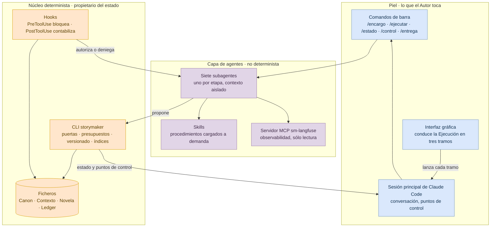
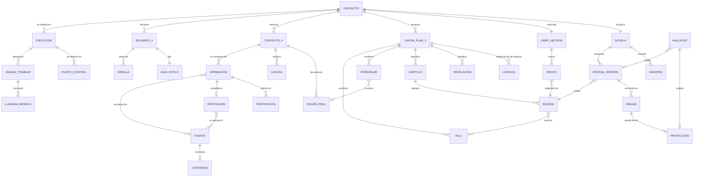
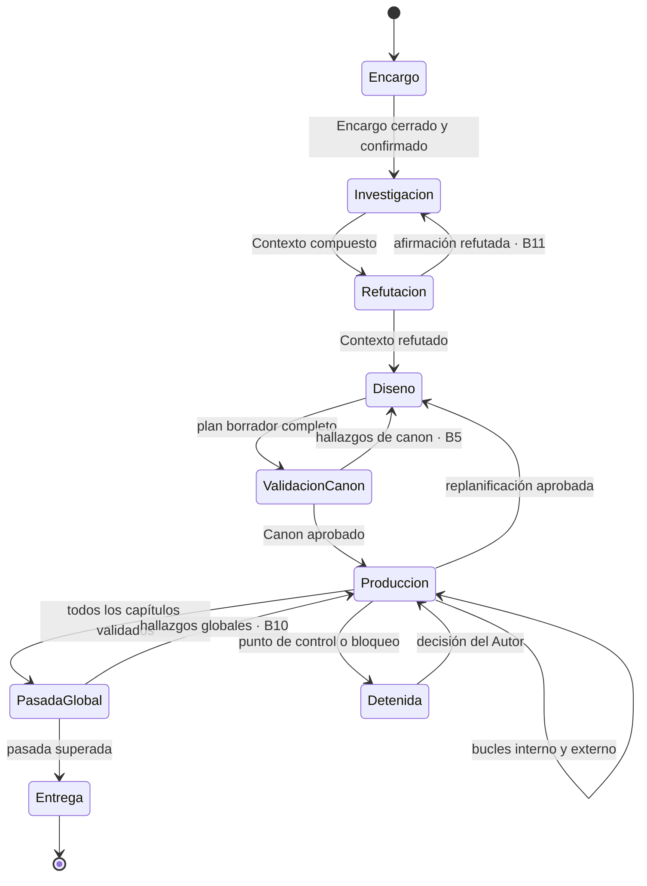

# Especificación Técnica — StoryMaker

### Arnés generador de novelas históricas sobre Claude Code

| Campo | Valor |
|---|---|
| Versión | **2.0** |
| Estado | Documento completo. Reescritura íntegra sobre una arquitectura distinta de la de la versión 1.3 |
| Documento fuente | Especificación Funcional StoryMaker **1.4** (decisiones D1–D29) |
| Alcance | El CÓMO completo: arquitectura, inventario del arnés, gestión de contexto, datos, persistencia, contratos, orquestación, presupuestos, evaluación, errores, observabilidad, pruebas y operación |
| Restricciones impuestas | Tiempo de ejecución sobre **Claude Code** (agentes, subagentes, skills, comandos, hooks, plugins, MCP) · **sin ningún motor de base de datos**: el estado vive en ficheros · ejecución local monousuario · Python para el núcleo determinista |
| Decisión maestra | **ADR-01**: el estado autoritativo lo escribe únicamente el núcleo determinista, invocado como herramienta. Ningún agente escribe estado por su cuenta, y la prohibición se impone con permisos y hooks, no con instrucciones en un prompt |
| Trazabilidad | §13. Cobertura directa e inversa contra la Funcional 1.4 |
| Registro de versiones | §15 |

---

## 0. Por qué esta reescritura

La versión 1.3 de este documento se construyó sobre una lectura de «Claude Code» que el Autor ha corregido: allí era herramienta de construcción y piel conversacional, nunca tiempo de ejecución, y el arnés era un proceso Python que llamaba a los modelos por una API. La corrección es que **el arnés se ejecuta dentro de Claude Code**, y que el inventario de lo que hace falta —agentes, subagentes, skills, plugins— debe figurar explícitamente en la especificación, igual que la política de gestión de contexto.

Eso invalida la decisión maestra anterior y con ella el encuadre de la orquestación, de las fronteras y del ciclo de vida de una Ejecución. No invalida, en cambio, tres cosas que se conservan porque eran correctas y siguen siéndolo: el almacén en ficheros sin motor de base de datos, la partición del Canon en plan versionado y libro de hechos de sólo anexión, y el Run Ledger como única fuente de la trazabilidad y la contabilidad.

Se reescribe entero en lugar de parchearse porque un documento que cambia de premisa arquitectónica y se actualiza a base de remiendos queda correcto y se lee como un registro de cambios. La versión 1.3 queda archivada; este documento la sustituye a todos los efectos.

---

## 1. Arquitectura

### 1.1 El problema que la arquitectura tiene que resolver

La Funcional exige garantías que un modelo de lenguaje no puede dar por sí mismo. Exige que no se redacte una sola escena sobre un Canon no aprobado (INV-1), que ningún hallazgo bloqueante conviva con una unidad cerrada (INV-5), que ninguna Ejecución supere su presupuesto (INV-7), que un capítulo rechazado no pueda aprobarse sin que su texto haya cambiado (RF-067), y que toda modificación del Canon genere versión nueva (INV-6).

Ninguna de esas garantías sobrevive si depende de que un agente recuerde cumplirla. Un modelo que ha consumido ochenta mil palabras de contexto y lleva tres iteraciones discutiendo una escena no es un guardián fiable de una invariante. Y el problema no es la obediencia: es que una garantía cuyo cumplimiento no se puede comprobar desde fuera no es una garantía, es una esperanza.

De ahí la decisión maestra.

### 1.2 ADR-01 — Quién posee el estado

**Contexto.** El tiempo de ejecución es Claude Code. Las etapas del arnés son agentes: no deterministas por construcción. El estado —Encargo, Contexto histórico, Canon, Novela, presupuestos— debe sostener invariantes verificables.

**Opciones.**

| # | Opción | Consecuencia |
|---|---|---|
| a | Los agentes escriben los ficheros de estado directamente, guiados por sus instrucciones | Toda invariante pasa a depender de que el modelo la respete. No hay forma de comprobarlo salvo leyendo el resultado |
| b | Los agentes proponen y un **núcleo determinista** escribe, invocado como herramienta de línea de comandos | Las invariantes se comprueban en código antes de persistir. Los agentes no pueden saltárselas porque no tienen la llave |
| c | Un orquestador externo a Claude Code dirige a los agentes por API | Es la arquitectura de la versión 1.3, descartada por el Autor |

**Decisión. (b).** El núcleo determinista `storymaker` posee el estado, el dinero y las puertas. Los agentes leen lo que necesitan y **proponen** resultados; el núcleo valida, versiona, contabiliza y persiste. La separación no es una convención de estilo: se impone por permisos del sistema de ficheros y por hooks que bloquean la operación antes de que ocurra.

**Consecuencias positivas.** Las invariantes de la Funcional se convierten en comprobaciones de código con un punto único de aplicación. La contabilidad de presupuesto es exacta porque pasa por un solo sitio. Una Ejecución es reanudable porque su estado no está en la cabeza de ningún agente. Y el arnés es auditable: el ledger registra lo que el núcleo hizo, no lo que un agente dijo que había hecho.

**Consecuencias negativas asumidas.** Toda escritura tiene el coste de una llamada a herramienta. El núcleo se convierte en un cuello de botella deliberado y en la pieza que hay que probar con más cuidado. Y obliga a diseñar la superficie del núcleo como un contrato estable, porque los agentes dependen de ella.

**Condiciones de revisión.** Si el coste por llamada a herramienta resulta dominante frente al de generación, o si aparece una primitiva de Claude Code que permita transacciones sobre ficheros con garantías equivalentes.

### 1.3 Las tres capas



**La piel.** La sesión principal de Claude Code es donde el Autor conversa, responde a los puntos de control y lanza el trabajo. No ejecuta etapas: las despacha. Junto a ella hay una **interfaz gráfica** que conduce la Ejecución entera en tres tramos y se detiene dos veces a esperar al Autor; no es una capa nueva, sino otra piel sobre los mismos comandos y el mismo núcleo.

**La capa de agentes.** Cada etapa de la Funcional es un subagente con su propio contexto, sus propias instrucciones y un conjunto de herramientas recortado a lo que su etapa necesita. Es la capa que genera, critica y juzga. No escribe estado.

**El núcleo.** Un ejecutable Python con una superficie de línea de comandos. Es el único que abre los ficheros de estado en modo escritura. Valida contra esquema, comprueba invariantes, versiona, contabiliza consumo, anexa al ledger y devuelve un sobre de respuesta tipado.

### 1.4 ADR-02 — La frontera se impone, no se pide

**Decisión.** Tres mecanismos concéntricos, y ninguno depende de que un agente colabore:

1. **Permisos.** La configuración del proyecto deniega a los agentes toda escritura bajo `proyectos/**`, con la única excepción de `proyectos/<prj>/tmp/`, el borrador de trabajo de una unidad. Escribir el Canon o una escena no es «algo que el agente no debe hacer»: es algo que no puede.
2. **Hooks de tipo PreToolUse.** Antes de que una llamada a herramienta se ejecute, un hook determinista la examina y puede denegarla con un motivo. Es donde viven las puertas que dependen del estado: no se redacta con el Canon en borrador, no se valida un capítulo con escenas abiertas, no se gasta por encima del remanente.
3. **El núcleo como único escritor.** Aun con permisos y hooks, la escritura real la hace `storymaker`, que vuelve a comprobar los invariantes. La redundancia es deliberada: los dos primeros mecanismos protegen de un agente descaminado, el tercero protege de un error en los dos primeros.

**Consecuencia.** Un agente al que se le ocurra escribir directamente una escena recibe una denegación, no un fallo silencioso, y la denegación queda en el ledger. La regla que gobierna el diseño es la que la propia Funcional aplica a los hallazgos: lo que no se puede comprobar desde fuera, no cuenta.

### 1.5 Correspondencia entre etapas y arquitectura

| Etapa de la Funcional | Subagente | Escribe estado mediante | Puerta que lo protege |
|---|---|---|---|
| E1 · Captura del encargo | `sm-entrada` | `storymaker encargo …` | Confirmación explícita del Autor (RF-006, PC-2) |
| E2 · Investigación histórica | `sm-investigacion` | `storymaker contexto afirmar` | Trazabilidad: toda Restricción cuelga de una afirmación vigente (INV-8) |
| E3 · Diseño narrativo | `sm-diseno` | `storymaker canon proponer` | Invariantes de plan completos (RF-020 a RF-029) |
| E4 · Crítica del Canon | `sm-diseno`, en la misma sesión | `storymaker canon aprobar`, que ejecuta el Autor | Aprobación del Autor en PC-3. Ya no hay validador que decida |
| E5 · Redacción | `sm-redactor` | `storymaker escena escribir` | Canon aprobado (INV-1) |
| E6 · Refinamiento | `sm-refinador` | `storymaker escena refinar` | Pasajes protegidos intactos (RF-054) |
| E7 · Validación | `sm-validador` | `storymaker capitulo validar` | Cambio de texto verificado desde el rechazo (RF-067) |
| E8 · Pasada global | `sm-global` | `storymaker novela cerrar` | Las cinco condiciones de terminación (RF-077) |

---

## 2. Inventario del arnés

Todo lo que hay que construir, por tipo de artefacto. Un elemento que no figure aquí no existe en el sistema.

### 2.1 Subagentes

Siete, uno por etapa. Cada uno vive en `.claude/agents/<nombre>.md` con sus instrucciones, su modelo y su lista de herramientas permitidas. La lista recortada no es una optimización: es la primera línea de la frontera de ADR-02.

E4, la crítica del Canon, **no tiene subagente propio**: la escribe `sm-diseno` en la misma sesión en que propone el plan, y quien decide sobre ella es el Autor en PC-3.

| Subagente | Etapa | Herramientas permitidas | Por qué esas y no más |
|---|---|---|---|
| `sm-entrada` | E1 | `Read`, `Glob`, `Grep`, `Bash`, `AskUserQuestion` | Su trabajo es preguntar; `AskUserQuestion` es la única etapa que la tiene |
| `sm-investigacion` | E2 | Las anteriores sin preguntar, más `WebSearch` y `WebFetch` | Es la única que sale al exterior a buscar, y por tanto el único punto por el que entra información no generada |
| `sm-diseno` | E3 | `Read`, `Glob`, `Grep`, `Bash` | No redacta prosa ni recupera fuentes |
| `sm-redactor` | E5 | `Read`, `Glob`, `Grep`, `Bash` | No puede leer la novela entera: recibe lo que §3 le entrega |
| `sm-refinador` | E6 | `Read`, `Glob`, `Grep`, `Bash` | Su alcance es la escena; la estructura la propone, no la aplica (RF-053) |
| `sm-validador` | E7 | `Read`, `Glob`, `Grep`, `Bash` | Valida contra estructuras, no releyendo la novela (§3.4) |
| `sm-global` | E8 | `Read`, `Glob`, `Grep`, `Bash` | Es el único con permiso de lectura total, y sólo se invoca una vez |

`Bash` aparece en las siete porque **es el canal por el que se llama al núcleo**: un subagente propone su artefacto ejecutando `storymaker <grupo> <accion>`, y no tiene ninguna otra forma de escribir estado. Que pueda ejecutar órdenes no debilita la frontera: los hooks deniegan antes de que la llamada exista, y el núcleo vuelve a comprobar sus invariantes.

**Los siete declaran `model: haiku`.** Es una elección de este montaje, no del diseño: el arnés se ejerce con novelas cortas de prueba y lo que se quiere medir es que el flujo entero corra y converja, no la calidad de la prosa. El modelo de cada etapa es un campo de su fichero y se cambia ahí, sin tocar el núcleo.

### 2.2 Skills

Procedimientos que varios agentes comparten o que son demasiado extensos para vivir en las instrucciones de un agente. Se cargan a demanda, que es lo que evita pagar su coste en cada llamada.

Cinco. Viven en `.claude/skills/<nombre>/SKILL.md`.

| Skill | Qué encapsula | Quién la usa |
|---|---|---|
| `derivar-restricciones` | Cómo convertir una afirmación en regla comprobable, sus cinco categorías y el criterio para declararla cualitativa | `sm-investigacion` |
| `evaluar-con-rubrica` | La rúbrica por etapa, su escala y la regla de evaluar sin historial de iteraciones previas (SUP-023) | `sm-refinador`, `sm-validador`, `sm-global` |
| `emitir-hallazgo` | La forma canónica de un hallazgo: severidad, causa raíz, localización, acción exigida y evidencia | Todos los agentes críticos |
| `plantar-y-resolver` | Cómo se declara que una resolución está preparada y qué cuenta como preparación | `sm-diseno` |
| `voz-y-estilo` | Cómo se lee la Guía de estilo efectiva y qué significa un parámetro sin preferencia | `sm-redactor`, `sm-refinador` |

La sexta, `refutar-afirmacion`, se retiró con la pasada de refutación.

### 2.3 Comandos de barra

La superficie del Autor. Cada uno despacha trabajo y presenta resultados; ninguno escribe estado por su cuenta.

| Comando | Qué hace | Requisito |
|---|---|---|
| `/encargo` | Abre la captura conversacional, o ingiere un fichero JSON de Encargo | RF-002, RF-110 |
| `/ejecutar` | Arranca o reanuda una Ejecución | RF-080, RF-084 |
| `/estado` | Etapa, unidad, iteración, hallazgos por severidad, consumo y proyección | RF-086 |
| `/control` | Lista los puntos de control pendientes y recoge la decisión | PC-1 a PC-7 |
| `/traza` | Devuelve el origen de un pasaje o el respaldo de una afirmación | RF-081, RF-082 |
| `/entrega` | Genera la entrega en Markdown y PDF con su paquete de trazabilidad | RF-090 a RF-093 |
| `/calibracion` | Emite el informe de consumo real frente a presupuestado | RF-079 |

### 2.4 Hooks

Donde viven las puertas. Son deterministas, se ejecutan fuera del modelo y pueden denegar.

| Hook | Momento | Qué hace | Requisito |
|---|---|---|---|
| `guard-escritura` | PreToolUse | Deniega cualquier escritura de estado que no venga del núcleo | ADR-02 |
| `guard-canon` | PreToolUse | Deniega redactar si el Canon no está aprobado | INV-1 |
| `guard-presupuesto` | PreToolUse | Admisión previa: deniega la unidad cuya estimación supera el remanente, antes de gastar | RF-072, ERR-404 |
| `guard-proteccion` | PreToolUse | Deniega reescribir un pasaje protegido sin justificación registrada | RF-054 |
| `ledger-llamada` | PostToolUse | Anexa al ledger la llamada con sus tokens, coste, latencia y hashes | RF-083, RNF-013 |
| `cierre-unidad` | SubagentStop | Cierra la unidad de trabajo, registra el modo de terminación y libera el lock | RF-055 |
| `arranque` | SessionStart | Carga el estado del Proyecto, comprueba el esquema y avisa de puntos de control pendientes | RF-084, RF-086 |

### 2.5 Servidores MCP

Uno, y **de sólo lectura**.

| Servidor | Qué expone | Por qué existe |
|---|---|---|
| `sm-langfuse` | `langfuse_resumen`, `langfuse_trazas` y `langfuse_traza`: el panorama de las Ejecuciones trazadas, su coste, sus errores y los pasos más lentos | Permite preguntar «qué hizo la última tirada y en qué se fue el tiempo» sin salir de la conversación, que es donde se decide qué ajustar |

Hay un segundo servidor declarado en `.mcp.json`, `sm-navegador`, que **no forma parte del arnés**: es una herramienta de desarrollo. Abre `gui/index.html` en un Chromium real, recorre sus pestañas y dice cuáles revientan. Existe porque aquí no hay navegador y la página compila React con Babel en el cliente: un error de JavaScript la deja **en negro, sin un solo mensaje**, y eso ocurrió cuatro veces. Ningún subagente lo usa y no interviene en ninguna Ejecución.

Es de sólo lectura por construcción, y la construcción importa: la interfaz tiene botones que invocan al núcleo —aprobar el Canon, firmar el Contexto—, así que el servidor **sólo sabe pulsar pestañas**, buscándolas dentro de `nav`. No hay ninguna herramienta que acepte otro selector. No es una promesa de buen comportamiento: es que la capacidad no existe.

Playwright es una dependencia de **desarrollo**, como `pytest`. El núcleo sigue sin ninguna en tiempo de ejecución.

Es de sólo lectura a propósito: quien **escribe** la traza es `gui/langfuse.py`. Separar las dos direcciones evita que una consulta mal hecha escriba en la observabilidad, que es justo donde uno quiere poder fiarse de lo que lee. Sus credenciales se resuelven del entorno o del `.env` de la raíz y no aparecen en ninguna respuesta, ni recortadas.

Los dos servidores de recuperación, **sm-web** y **sm-rag**, se retiraron: exigían credenciales que no estaban y que no pueden autorizarse desde una sesión headless, y su ausencia mataba la Ejecución sin producir nada. La investigación entra ahora por `WebSearch` y `WebFetch`, con la cobertura declarada como reducida. La consecuencia hay que asumirla: la frontera con el exterior ya no garantiza por construcción que todo resultado traiga localizador y fecha, y eso pasa a depender de que `sm-investigacion` los registre al llamar a `contexto fuente`.

### 2.6 Empaquetado y configuración

| Artefacto | Contenido |
|---|---|
| **Plugin `storymaker`** | Empaqueta los siete subagentes, las cinco skills, los siete comandos y los siete hooks, con versión propia. Es lo que hace el arnés instalable y versionable como una unidad |
| `settings.json` | Permisos: denegación de escritura bajo `proyectos/**` salvo `tmp/`; registro de los hooks; variables de entorno del núcleo |
| `CLAUDE.md` | Las reglas que deben estar siempre en contexto: qué es autoritativo, qué no se escribe nunca a mano, y a quién se pregunta |
| `.mcp.json` | Declaración del servidor `sm-langfuse` |
| CLI `storymaker` | El núcleo determinista. Su superficie está en §6 |
| `gui/` | La interfaz gráfica: servidor HTTP de biblioteca estándar, orquestador en tres tramos, cliente de traza y página única con React por CDN |

---

## 3. Gestión de contexto

### 3.1 El problema

Una novela de cien mil palabras no cabe en ninguna ventana de contexto, y aunque cupiera sería ruinoso pagarla en cada llamada. Pero la Funcional exige coherencia a lo largo de toda esa extensión: que el capítulo 38 no contradiga lo que se estableció en el 4, que nadie revele antes de tiempo, que la voz del principio y la del final sean la misma.

La tentación evidente —dar al agente todo lo escrito hasta ahora— hace crecer el coste con el cuadrado de la extensión y falla justo donde más importa, en el último tercio, que es cuando el contexto acumulado es mayor y el presupuesto menor. Es exactamente el riesgo R-01 de la Funcional.

La arquitectura resuelve esto con una idea y tres capas de memoria.

**La idea: el arnés recuerda en estructuras, no en prosa.** Para saber si un personaje puede saber algo no se relee la novela: se consulta el plan de revelaciones. Para saber de qué color tiene los ojos no se relee: se consulta el libro de hechos. Para saber si un objeto es anacrónico no se relee el dossier de época: se evalúa una Restricción. La prosa se lee cuando hay que juzgar prosa, y nunca para averiguar un dato.

### 3.2 Las tres memorias

| Memoria | Dónde vive | Qué contiene | Cuánto dura |
|---|---|---|---|
| **Larga** | Ficheros del Proyecto | Encargo, Contexto histórico, Canon, libro de hechos, escenas, ledger | Toda la vida del Proyecto. Sobrevive a reinicios, a caídas y a cambios de esquema |
| **De trabajo** | El **manifiesto de contexto** que se inyecta en cada unidad | Lo que esa unidad concreta necesita para hacer su trabajo, y nada más | Una unidad de trabajo |
| **Efímera** | `proyectos/<prj>/tmp/<udt>/` | Borradores, notas del agente, resultados intermedios | Se borra al cerrar la unidad. Nunca es autoritativa |

La memoria larga son ficheros, no una base de datos, y eso es una ventaja y no una carencia: el Autor puede abrir su novela con un editor de texto, el diff es nativo sobre Markdown, y una corrupción queda localizada en un fichero en lugar de llevarse el conjunto.

La memoria efímera existe porque un agente necesita un sitio donde pensar, y ese sitio no puede ser el estado del Proyecto. Es la única ruta bajo `proyectos/` donde los permisos dejan escribir a un agente, y su contenido no se lee jamás fuera de la unidad que lo creó.

### 3.3 Por qué los subagentes resuelven el problema de contexto

Cada unidad de trabajo se ejecuta en un subagente nuevo, con contexto propio y limpio. Esto tiene una consecuencia que conviene enunciar sin rodeos: **la unidad de contexto es la unidad de trabajo, así que el contexto no crece con la novela.** Redactar la escena 3 y redactar la escena 180 cuestan lo mismo en contexto, porque la segunda no arrastra nada de la primera salvo lo que el manifiesto decida darle.

De ahí se siguen tres propiedades útiles. La primera es que el coste por unidad es previsible, lo que hace que el presupuesto de RF-071 pueda estimarse antes de gastar. La segunda es que una unidad es reintentable: si falla, se vuelve a lanzar con el mismo manifiesto y el mismo resultado esperable, porque no depende de una conversación previa. Y la tercera es que la compactación automática del contexto deja de ser un peligro: si una unidad se compacta a mitad, no se pierde estado autoritativo —está en ficheros— y la unidad se rehace.

### 3.4 El manifiesto de contexto

Cada etapa declara qué recibe, en qué orden de prelación y con qué límite. El manifiesto se registra en el ledger junto con la llamada, de modo que siempre se puede reconstruir con qué información se tomó una decisión.

| Etapa | Contexto que recibe | Prelación al recortar |
|---|---|---|
| `sm-entrada` | Semillas y campos ya cubiertos del Encargo | No aplica: cabe entero |
| `sm-investigacion` | Ámbito de investigación derivado del Encargo | No aplica |
| `sm-refutador` | La afirmación, sus fuentes citadas y su contenido conservado. **Nunca el razonamiento con que se compuso** | Fijo por requisito (RF-102) |
| `sm-diseno` | Encargo íntegro, Restricciones vigentes, fichas de figuras reales, resumen temático del Contexto | 1 Encargo · 2 Restricciones · 3 figuras · 4 contexto temático |
| `sm-redactor` | Ficha de la escena, Guía de estilo efectiva, hechos con sujetos presentes en la escena, revelaciones vigentes, escenas anteriores del capítulo en curso, sinopsis de capítulos previos | 1 ficha · 2 estilo · 3 hechos de los sujetos presentes · 4 escenas del capítulo · 5 sinopsis |
| `sm-refinador` | Texto de la escena, Guía de estilo, pasajes protegidos | 1 texto · 2 protegidos · 3 estilo |
| `sm-validador` | Capítulo completo, fichas de las escenas, hechos de los sujetos que aparecen, revelaciones con ventana, Restricciones aplicables | 1 capítulo · 2 fichas · 3 hechos · 4 revelaciones · 5 restricciones |
| `sm-global` | Novela completa, Canon, Guía de estilo, indicadores de estilo por tercio | Sin recorte: es la única etapa cuyo objeto es el conjunto |

Dos cosas merecen subrayarse. El redactor **no recibe la novela previa**, sino tres sustitutos más baratos y más fiables: los hechos que afectan a los personajes presentes, las escenas del capítulo en curso y una sinopsis de lo anterior. Y el validador tampoco la recibe: valida contra el libro de hechos, que es lo que RF-028 existe para alimentar.

### 3.5 La sinopsis acumulada

La Funcional menciona un «resumen de la novela previa» como entrada del redactor sin especificar quién lo produce ni qué contiene. Aquí se define, porque es la única ventana del redactor a su propia novela.

**Qué es.** Un fichero por capítulo, `novela/sinopsis/<cap>.md`, con un límite duro de extensión. Contiene lo que ocurrió, quién estaba, qué cambió de estado y qué quedó pendiente. No contiene prosa ni citas: es un acta, no un resumen literario.

**Quién la escribe y cuándo.** El núcleo la solicita al cerrar cada capítulo, en una llamada propia y contabilizada. Nunca se reescribe: un capítulo cerrado tiene su sinopsis congelada, igual que su texto.

**Cómo se consume.** El redactor recibe las sinopsis de los capítulos anteriores en orden inverso de cercanía, y se recortan por prelación empezando por las más lejanas. La del capítulo inmediatamente anterior no se recorta nunca.

**Por qué no basta con ella.** Una sinopsis pierde precisamente el detalle que causa las contradicciones de continuidad: qué mano, qué color, qué promesa exacta. Ese detalle vive en el libro de hechos, que es consultable por sujeto y no se resume. La sinopsis da el hilo; los hechos dan la letra pequeña.

### 3.6 Política de compactación

Tres reglas que hacen que la compactación sea irrelevante para la corrección:

1. **Ningún estado autoritativo vive en la ventana.** Todo lo que importa está en ficheros antes de que la unidad termine.
2. **Una unidad compactada se rehace, no se continúa.** Si la ventana de un subagente se compacta a mitad de su trabajo, el núcleo descarta el intento y lo relanza con el manifiesto original. Es más barato que razonar sobre un contexto mutilado, y es determinista.
3. **El manifiesto es el techo.** Si el manifiesto de una unidad no cabe en la ventana, no se recorta en caliente: se emite `ERR-206` y se aplica la prelación declarada de §3.4, dejando constancia de qué se dejó fuera. Un recorte silencioso es un error de continuidad esperando a ocurrir.

---

## 4. Modelo lógico de datos

### 4.1 Principios

| # | Principio | Por qué |
|---|---|---|
| MD-1 | **Tres clases de dato y ninguna más**: verdad de sólo anexión, instantánea inmutable versionada, y derivado reconstruible | Sin esta partición no se sabe qué se puede borrar sin perder información |
| MD-2 | Toda entidad lleva identificador estable y legible, `schema_version` y `creado_en`; lo generado lleva además su procedencia | Es la base de RF-081 y de la migración de esquema |
| MD-3 | El Contexto histórico es un **conjunto de afirmaciones atómicas**; la prosa es una proyección | Hace medibles RNF-004, RNF-006, RNF-008, RNF-027 y RNF-028. Sobre prosa no se cuenta nada |
| MD-4 | El Canon se parte en **plan versionado** y **libro de hechos de sólo anexión** | Resuelve la colisión entre RF-028, que anexa hechos en cada escena, e INV-6, que versiona toda modificación del Canon. Sin la partición, mencionar una cicatriz generaría una versión del plan |
| MD-5 | La unidad de versionado de la Novela es la **escena** | Lo exigen RF-056, que conserva la mejor versión, e INV-4 |
| MD-6 | Ningún derivado alimenta una decisión de negocio, sólo una consulta | Un índice puede estar obsoleto; una decisión no puede apoyarse en algo que puede estarlo |
| MD-7 | Toda afirmación lleva **veredicto de fidelidad** y **veredicto de refutación**; ninguna Restricción comprobable deriva de una que no haya superado ambos | RF-100 y RF-102. Una cita que no dice lo que se le atribuye contamina todo lo que se valide contra ella |

### 4.2 Identificadores

Formato `<prefijo>_<sufijo>`, en minúsculas. Los prefijos son parte del contrato y no cambian.

| Prefijo | Entidad | Generación |
|---|---|---|
| `prj`, `eje` | Proyecto, Ejecución | ULID |
| `enc`, `ctx`, `can` | Versiones de Encargo, Contexto y plan de Canon | `<pref>_<prj>_v<n>` |
| `aff`, `fnt`, `rst`, `hec` | Afirmación, Fuente, Restricción, Hecho | Hash de doce caracteres del enunciado o del localizador normalizado |
| `ref` | Veredicto de refutación | `ref_<aff>` |
| `cnt` | Contenido conservado de una Fuente | `cnt_<sha256>` |
| `hil`, `per`, `fac`, `lug`, `evh`, `evf`, `rev`, `fig` | Elementos del plan y fichas de figuras reales | `<pref>_<slug>`, estables entre versiones del plan |
| `cap`, `esc`, `esv`, `pas` | Capítulo, Escena, versión de escena, Pasaje | Posicionales y deterministas |
| `hlz` | Hallazgo | Hash de **(unidad, categoría, elemento señalado normalizado)** |
| `lic`, `deu`, `pct`, `sol`, `udt`, `llm` | Licencia, Deuda, Punto de control, Solicitud, Unidad de trabajo, Llamada a modelo | Secuenciales o deterministas según el caso |

**Sobre el identificador de Hallazgo.** Es la pieza de la que depende RF-075, que cierra un bucle cuando reaparece un hallazgo ya resuelto. Por eso el hash deja fuera dos cosas que parecerían naturales: el enunciado, porque lo redacta un modelo y cambia entre iteraciones, y los desplazamientos de carácter de la localización, porque se mueven en cuanto el redactor corrige el texto. Con cualquiera de los dos dentro, el mismo defecto reaparecido recibiría identidad nueva y el estancamiento no se detectaría jamás: el mecanismo fallaría exactamente en el momento para el que se diseñó.

### 4.3 Entidades



Las entidades con carga de invariante se detallan a continuación; el resto siguen el mismo patrón y se declaran en los esquemas de §5.

#### ENCARGO_V

Instantánea inmutable versionada. Cambia sólo por decisión explícita del Autor, y cada cambio genera versión.

| Atributo | Card. | Nota |
|---|---|---|
| `semillas[]` | 1..n | `texto_literal` **nunca se reescribe** (RF-001) |
| `premisa`, `epoca`, `ambito_geografico` | 1 | `epoca` lleva `{desde, hasta, precision}` |
| `extension_objetivo_palabras`, `tolerancia_extension` | 1 | Tolerancia por defecto 0,10 (RNF-012) |
| `capitulos_objetivo` | 0..1 | Si se fija, RF-023 reparte dentro de él |
| `extension_por_capitulo` | 0..1 | `{valor, unidad: palabras\|lineas, palabras_por_linea, origen}` (D28). **La palabra es la unidad canónica**: si viene en líneas se convierte en la captura con el factor declarado, y el sistema conserva ambos valores |
| `guia_estilo` | 1 | Cada parámetro es `{valor, estado: declarado\|sin_preferencia}`. Nunca hay valor por defecto silencioso (RF-029) |
| `politica_hechos_sensibles`, `politica_figuras_reales` | 1 | Con su origen, autor o defecto (RF-009) |
| `licencias_alcance_preautorizadas[]` | 0..n | Las que el Autor autoriza de antemano (RF-035) |
| `hilos_abiertos_autorizados[]` | 0..n | Única excepción admitida a RNF-002 |
| `origen_captura` | 1 | `conversacion\|fichero` (RF-110) |

#### AFIRMACION

Unidad atómica del Contexto histórico. Es la entidad que hace medible todo lo demás.

| Atributo | Card. | Nota |
|---|---|---|
| `seccion` | 1 | Una de las cinco obligatorias de RF-014 |
| `enunciado` | 1 | **Una sola proposición verificable**. Si lleva dos, son dos afirmaciones |
| `fuentes[]`, `sin_fuente` | 1 | Mutuamente excluyentes por construcción |
| `fidelidad` | 1 | `verificada\|no_sostenida\|no_verificable` (RF-100) |
| `refutacion_id` | 0..1 | Obligatorio si la afirmación está en alcance de RF-102 |
| `estado` | 1 | `vigente\|refutada\|retirada` |
| `disputada`, `versiones_en_conflicto[]` | 1 / 0..n | RF-015 |
| `certeza`, `origen` | 1 | Documentada, inferida o de conocimiento general; inicial o bajo demanda |

#### REFUTACION

| Atributo | Card. | Nota |
|---|---|---|
| `veredicto` | 1 | `confirmada\|matizada\|disputada\|refutada\|no_refutable_documentalmente` |
| `tipo_afirmacion` | 1 | Determina la estrategia de búsqueda inversa: existencial negativa, existencial positiva, datación, atribución, cuantitativa o cualitativa |
| `fuentes_contrarias[]` | 0..n | **Ninguna puede estar en `afirmacion.fuentes[]`** |
| `consultas[]` | 1..n | Consulta, modo, resultados examinados y motivo de descarte. Es lo que impide que «confirmada» signifique «no se buscó» |
| `alcance_matiz` | 0..1 | Obligatorio si el veredicto es `matizada` |

El veredicto `no_refutable_documentalmente` no es una confirmación: una afirmación de mentalidad no se puede desmentir con fuentes, y mezclarla con las que han resistido una búsqueda en contra engañaría a quien lea la entrega. Una afirmación así sólo puede sostener una Restricción cualitativa.

#### CANON_PLAN_V

| Atributo | Card. | Nota |
|---|---|---|
| `estado` | 1 | `borrador\|en_validacion\|aprobado\|superado` |
| `motivo_cambio`, `origen_cambio` | 0..1 | Obligatorios a partir de la versión 2 (RF-026) |
| `arco`, `hilos[]`, `personajes[]`, `capitulos[]`, `revelaciones[]`, `linea_temporal` | 1 | Invariantes en §5.3 |
| `licencias_alcance[]` | 0..n | Aprobadas con el plan (RF-035) |
| `capitulos_invalidados[]` | 0..n | Calculados al versionar (RF-027) |
| `aprobado_por` | 0..1 | `{modo, quien, decidido_en, bloqueantes_asumidos[]}`. **`bloqueantes_asumidos[]` sólo puede ser no vacío si `modo=humano`** (D23): un agente nunca aprueba con bloqueantes abiertos |

El plan **no** guarda el estado de ejecución de los hilos. Ese estado es derivado del libro de hechos y de las escenas validadas, y guardarlo aquí obligaría a versionar el plan en cada capítulo. La contrapartida es que la decisión de RF-077 lo recalcula en el momento de decidir, nunca lo lee de un índice, porque MD-6 no admite decidir sobre un derivado.

#### HECHO

| Atributo | Card. | Nota |
|---|---|---|
| `enunciado`, `sujeto` | 1 | Sujeto tipado: personaje, lugar, objeto, relación o promesa |
| `escena_origen`, `escena_version_origen` | 1 | RF-028 |
| `retractado_por` | 0..1 | Un hecho erróneo se retracta anexando otro. **Nunca se borra** |

#### ESCENA_VERSION

| Atributo | Card. | Nota |
|---|---|---|
| `rama`, `vigente` | 1 | La vigencia vive **sólo** en `ramas.json`; aquí no se duplica, para que no haya dos fuentes de verdad que puedan divergir |
| `texto_ref`, `hash_texto`, `palabras` | 1 | El hash es la base de RF-067 |
| `canon_plan_version`, `guia_estilo_hash`, `udt_origen` | 1 | Trazabilidad de RF-081 |
| `evaluacion` | 0..1 | Puntuación por criterio, versión de rúbrica y marca de evaluación sin historial (SUP-023) |
| `modo_cierre` | 0..1 | `convergencia` (T1), `estancamiento` (T2), `regresion` (T3), `agotamiento` (T4) |
| `protegido_palabras` | 1 | Numerador de RNF-026 |

### 4.4 Índices derivados

Se borran y se reconstruyen por barrido completo. Su pérdida cuesta tiempo, nunca información. Ninguno aparece aquí si no lo justifica una consulta concreta.

| Índice | Consulta que lo justifica | Requisito |
|---|---|---|
| `idx_traza_pasaje` | «Dado un pasaje, todo su origen» | RF-081, RNF-007 |
| `idx_afirmacion_novela` | «Dada una afirmación histórica del texto, su respaldo» | RF-082, RNF-008 |
| `idx_hechos_por_sujeto` | Continuidad sin releer la Novela | RF-062 |
| `idx_hallazgos_abiertos` | Condición de avance de todo bucle | RF-064, RF-077 |
| `idx_consumo` | Admisión de presupuesto y calibración | RF-070 a RF-072, RF-079 |
| `idx_hilos_estado` | Panel y consulta. **No decide RF-077** | RNF-002, RF-086 |
| `idx_restricciones_lexicas` | Barrido de anacronismos por capítulo | RF-063, RNF-005 |
| `idx_refutacion` | «¿Puede esta afirmación sostener una Restricción?» | RF-100, RF-102 |
| `idx_protegido` | Superficie de texto protegido y su umbral | RNF-026 |
| `idx_cache` | Evitar pagar dos veces lo mismo | RNF-015 |

---

## 5. Persistencia

### 5.1 ADR-03 — Disposición del almacén

**Contexto.** Sin motor de base de datos, monousuario, local. Hay que soportar sólo anexión, versionado, diff, reconstrucción de índices y migración de esquema a mitad de una novela que dura semanas.

**Opciones.** (a) Un fichero JSON por Proyecto. (b) Árbol de directorios con JSON por entidad, JSONL para los libros de sólo anexión, Markdown para la prosa y almacén por contenido para los blobs. (c) Un almacén clave-valor embebido. (d) Git como almacén primario.

**Decisión. (b).** La primera reescribe megabytes por cada hecho anexado y una corrupción se lo lleva todo. La tercera es opaca para el Autor y reintroduce por la puerta de atrás el motor que se quería evitar. La cuarta acopla la semántica del dominio a la de una herramienta y convierte cada commit en una decisión de diseño; Git se usa *sobre* el árbol si el Autor quiere, pero el sistema no depende de él.

**Consecuencias positivas.** El Autor abre su novela con un editor de texto. La corrupción queda localizada en un fichero. El diff es nativo sobre Markdown. Cero dependencias de almacenamiento.

**Consecuencias negativas asumidas.** Muchos ficheros pequeños, del orden de diez mil en una novela de cuarenta capítulos. Toda consulta transversal exige un índice o un barrido. Y no hay atomicidad entre ficheros, que es lo que obliga al protocolo de §5.2.

```text
proyectos/<prj_id>/
├── proyecto.json                        # instantánea mutable; su historia está en el ledger
├── encargo/enc_..._v1.json
├── contexto/
│   ├── ctx_..._v1.json                  # cabecera y lagunas
│   ├── afirmaciones.jsonl               # sólo anexión
│   ├── fuentes.jsonl                    # sólo anexión
│   ├── refutaciones.jsonl               # sólo anexión, un veredicto por afirmación
│   ├── restricciones.jsonl              # sólo anexión, con sus revocaciones
│   └── figuras_reales/<fig>.json
├── canon/
│   ├── plan/can_..._v1.json             # instantánea inmutable completa
│   └── hechos.jsonl                     # libro mayor, sólo anexión
├── novela/
│   ├── escenas/<esc>/esv_..._v1.md      # texto, inmutable
│   ├── escenas/<esc>/esv_..._v1.json    # metadatos de la versión
│   ├── sinopsis/<cap>.md                # memoria de trabajo del redactor (§3.5)
│   └── ramas.json                       # única fuente de la versión vigente
├── hallazgos.jsonl
├── licencias.jsonl
├── ejecuciones/<eje_id>/
│   ├── ejecucion.json                   # configuración congelada al arrancar
│   ├── ledger.jsonl                     # sólo anexión
│   ├── unidades.jsonl
│   ├── puntos_control/<pct>.json
│   └── consumo.jsonl
├── fuentes/<sha256[0:2]>/<sha256>       # contenido conservado de cada Fuente (RF-101)
├── blobs/<sha256[0:2]>/<sha256>         # prompts renderizados y salidas crudas
├── tmp/<udt>/                           # memoria efímera; único sitio escribible por agentes
├── indices/                             # derivado, borrable
└── entrega/                             # novela.md, novela.pdf, informes
```

### 5.2 ADR-04 — Escribir sin transacciones

Cuatro reglas, y ninguna es negociable.

1. **Escritor único.** El núcleo toma un cerrojo de Proyecto al arrancar una Ejecución. Un segundo proceso falla con `ERR-501`. Es lo que sustituye al control de concurrencia que no hay.
2. **Escritura atómica por fichero.** Escribir a `<destino>.tmp`, sincronizar, renombrar. El renombrado en el mismo volumen es atómico.
3. **Anexión de línea completa.** Los `.jsonl` se abren en modo anexión, se escribe una línea terminada y se sincroniza. Una línea truncada por un corte se descarta al leer, se registra `ERR-503` y se rehace el trabajo posterior a ella.
4. **Orden canónico de persistencia.** Blob, ledger, artefacto, índice, puntero. **Siempre en ese orden.** Una caída deja como mucho un blob huérfano, que es inocuo, o un artefacto sin puntero, que es invisible y se rehace. Nunca un puntero a algo que no existe.

**Consecuencia asumida.** No hay vuelta atrás, sólo compensación por anexión: un hecho mal anexado se retracta con otro hecho. El libro mayor crece de forma monótona, y esa es la propiedad que lo hace auditable.

### 5.3 El Canon, que es el artefacto más castigado

Lo consultan seis etapas y lo escriben dos. La partición de MD-4 es lo que lo hace viable.

| Aspecto | Plan | Libro de hechos |
|---|---|---|
| Clase | Instantánea inmutable versionada | Verdad de sólo anexión |
| Quién escribe | El núcleo, sólo por replanificación aprobada | El núcleo, al cerrar cada escena |
| Frecuencia | Unidades por novela | Decenas por capítulo |
| Efecto | Versión nueva, capítulos invalidados, escenas en vuelo reencoladas | **Ninguno sobre la línea base** |
| Lectura | Carga completa; cabe holgadamente | Por sujeto; nunca entero en un prompt |
| Conflicto | Imposible: escritor único serializado | Se detecta al anexar |

**Cómo se resuelve un conflicto de hecho.** El núcleo normaliza el enunciado, busca hechos con el mismo sujeto y aplica tres reglas: si coincide exactamente, no anexa y devuelve el identificador existente, que es lo que hace la operación idempotente; si es compatible, anexa; si contradice, **rechaza y emite hallazgo bloqueante** de continuidad con causa raíz en la redacción. La detección de contradicción entre proposiciones en lenguaje natural es el punto blando de todo esto, es comprobación por modelo con rúbrica, y así se declara.

### 5.4 ADR-05 — Versionado de la Novela

**Decisión.** Escenas inmutables con puntero de vigencia por rama. Cada generación produce una versión nueva; nada se sobrescribe. `ramas.json` mapea cada par de escena y rama a su versión vigente, y **es la única fuente de esa verdad**: la versión no lleva un campo `vigente` propio, porque dos sitios que afirman lo mismo acaban divergiendo y aquí no hay transacciones que lo impidan.

Cambiar la versión vigente es escribir un puntero: barato y reversible, que es justo lo que RF-056 necesita para conservar la mejor versión y no la última. El diff entre dos versiones alimenta RF-044, que exige corrección localizada, y la comparación de hashes alimenta RF-067, que prohíbe aprobar un capítulo rechazado cuyo texto no ha cambiado. Al rechazar el Autor una salida se abre una rama alternativa desde la versión vigente; el ensamblado final lee siempre la rama principal, y promover una alternativa es reescribir un puntero.

### 5.5 El Run Ledger

`ledger.jsonl` es la única fuente de la trazabilidad y de la contabilidad. Un evento por línea, tipado, de sólo anexión.

| Evento | Carga | Sostiene |
|---|---|---|
| `ejecucion_iniciada` | Configuración congelada: presupuestos con sus dos tramos de reserva, modo, versiones de los nueve agentes y de las rúbricas, catálogo de modelos, `schema_version` | RF-083, RNF-013 |
| `unidad_iniciada` | Identificador, etapa, unidad, intento, clave de idempotencia, **manifiesto de contexto** | RF-084, RF-085, §3.4 |
| `llamada_modelo` | Prompt renderizado, salida cruda, tokens, coste, latencia, modelo solicitado y servido | RNF-015, RNF-016 |
| `fidelidad_verificada` | Afirmación, resultado, contenido cotejado | RF-100, RNF-027 |
| `refutacion_emitida` | Afirmación, veredicto, fuentes contrarias, consultas | RF-102, RNF-028 |
| `hallazgo_emitido` / `hallazgo_transicionado` | Hallazgo completo o su nuevo estado y motivo | RF-064, RF-075 |
| `evaluacion_registrada` | Puntuación por criterio, versión de rúbrica, marca de sin historial | SUP-023, RF-056 |
| `unidad_cerrada` | Modo de terminación, versión vigente resultante, deuda emitida | RF-055, RF-073 |
| `presupuesto_admitido` / `denegado` | Ámbito, estimación, remanente, tramo de reserva usado | RF-070 a RF-072 |
| `punto_control_abierto` / `resuelto` | Tipo, qué se presentó, decisión, quién y cuándo | PC-1 a PC-7, RNF-020 |
| `canon_versionado` | Versión anterior y nueva, motivo, capítulos invalidados, licencias aprobadas | RF-026, RF-027, RF-035 |
| `ejecucion_finalizada` | Estado, consumo total, informe de calibración | RF-079 |

**Lo que el ledger no es.** No es la verdad del dominio: el Canon y la Novela son autoritativos por sí mismos. El ledger explica *cómo* llegaron a serlo, y de él se reconstruyen los índices. Por eso nunca se migra: se lee siempre con el promotor de su propia versión de esquema, porque migrarlo destruiría la evidencia que justifica que exista.

### 5.6 ADR-06 — Versionado de esquema

Un Proyecto dura semanas y el esquema cambiará a mitad. La decisión es **versión por registro con promoción en lectura**, sin reescritura retroactiva, y con una excepción: el ledger no se migra nunca.

1. Todo registro persistido lleva `schema_version`.
2. Un cambio compatible —campo opcional nuevo, valor de enumerado nuevo no obligatorio— incrementa la versión menor y no exige promotor.
3. Un cambio incompatible incrementa la mayor y **exige promotor registrado**. Sin promotor, el arranque falla con `ERR-505`: se prefiere no arrancar a leer mal.
4. Los artefactos inmutables ya persistidos no se reescriben jamás; se promueven en memoria al leerlos.
5. Al reanudar una Ejecución cuyo esquema es anterior, el núcleo promueve en lectura y anexa un evento que deja constancia de que cruzó una frontera de esquema.
6. Los índices llevan la versión del código que los generó; si no coincide, se descartan y se reconstruyen sin preguntar.

---

## 6. Contratos e interfaces

### 6.1 El sobre común

Todo lo que cruza una frontera —de agente a núcleo, de etapa a etapa— viaja envuelto en una estructura común con `schema_version`, contrato, emisor, momento, proyecto, ejecución y carga. Los esquemas se publican en `contracts/<nombre>/v<mayor>.schema.json` y el patrón de contrato admite desde CT-1 hasta CT-20, con el sufijo `R` de las respuestas de investigación.

**Política de campos desconocidos**, deliberadamente asimétrica:

| Superficie | Política | Motivo |
|---|---|---|
| Salida de un agente | Estricta | Un campo inventado es señal de que el prompt se desvía. Dispara reparación |
| Contrato entre etapas | Estricta, con una única puerta abierta para extensiones declaradas | En una frontera interna la ambigüedad es el enemigo |
| Artefacto persistido al leerlo | Tolerante | Es lo que hace viable la promoción de esquema |
| Configuración del Autor | Estricta, y el error nombra el campo | El Autor no es técnico: fallar claro vale más que ignorar en silencio |

Un campo nunca cambia de tipo ni de significado conservando el nombre. Eso es siempre un cambio mayor.

### 6.2 Mapa de contratos

| CT | De → A | Esquema | Carga obligatoria |
|---|---|---|---|
| CT-1 | E1→E2 | `ambito_investigacion/v1` | Época, ámbito geográfico, premisa, semillas |
| CT-2 | E1→E3 | `encargo/v1` | Encargo cerrado íntegro |
| CT-3 | E2→E3 | `contexto_historico/v1` | Afirmaciones, restricciones, refutaciones, lagunas, disputados, figuras reales |
| CT-4 | E3→E4 | `canon_plan/v1` | Plan borrador completo |
| CT-5 | E4→E3 | `lote_hallazgos/v1` | Hallazgos localizados en el Canon |
| CT-6 | E4→E5 | `canon_aprobado/v1` | Versión del plan, licencias de alcance, guía de estilo efectiva |
| CT-7 | E5→E6 | `escena_version/v1` | Texto, escena, versión de Canon, pasajes protegidos |
| CT-8 | E6→E5 | `lote_hallazgos/v1` + `escena_version/v1` | Crítica y versión refinada |
| CT-9 | E6→E3 | `propuesta_replanificacion/v1` | Motivo, elementos afectados, impacto estimado |
| CT-10 | E5→E7 | `capitulo_para_validar/v1` | Escenas cerradas, extensión real, hechos emergentes |
| CT-11 | E7→E5 | `lote_hallazgos/v1` | Con causa raíz obligatoria |
| CT-12 / CT-13 | E7→E2 / E5→E2 | `solicitud_investigacion/v1` | Tema, período, ámbito |
| CT-12R / CT-13R | E2→E7 / E2→E5 | `respuesta_investigacion/v1` | Solicitud y resultado, o laguna declarada |
| CT-14 | E5→Canon | `lote_hechos/v1` | Hechos con su escena de origen |
| CT-15 | E7→E8 | `capitulo_validado/v1` | Sin bloqueantes abiertos |
| CT-16 | E8→E7 | `lote_hallazgos/v1` | Cada hallazgo con capítulo de destino |
| CT-17 | E8→Salida | `paquete_entrega/v1` | Novela, Encargo, Contexto con fuentes, Canon final, licencias, deuda |
| CT-18 | Etapa→Ejecución | `evento_ledger/v1` | Los tipos de §5.5 |

### 6.3 Invariantes que el esquema no puede expresar

Un esquema JSON comprueba forma, no coherencia. Estas son puertas de código que el núcleo aplica antes de persistir, y su ausencia en la versión anterior de este documento era la razón de que RF-014 no lo comprobara nadie.

**Sobre el Contexto histórico**

| Invariante | Requisito |
|---|---|
| Las cinco secciones obligatorias tienen al menos una afirmación, o figuran como laguna con su impacto | RF-014 |
| Toda afirmación en alcance de refutación tiene veredicto emitido | RF-102, RNF-028 |
| Ninguna Restricción comprobable deriva de afirmación no verificada, refutada, o declarada no refutable | MD-7 |
| Ninguna fuente contraria de una refutación pertenece a las fuentes de la afirmación | RF-102 |
| Toda figura real referenciada por el Canon existe aquí con al menos una fuente | RF-019, RF-022 |

**Sobre el plan de Canon**

| Invariante | Requisito |
|---|---|
| Cierre referencial: todo identificador citado existe | RF-020 |
| La suma de presupuestos de palabra cae dentro de la extensión objetivo y su tolerancia | RF-023, RNF-012 |
| Todo hilo sin autorización expresa de quedar abierto tiene escena de resolución | RF-021 |
| Toda revelación cae en escena posterior a aquellas en que el personaje actúa sin conocerla | RF-025, RF-041 |
| Ningún personaje está en dos lugares incompatibles a la vez | RF-024 |
| Toda escena avanza al menos un hilo o porta al menos una revelación | RF-023 |
| Todo personaje histórico real referencia una figura documentada con fuente | RF-022, RNF-021 |
| Si hay extensión por capítulo declarada, cuadra con la total y con el número de capítulos | D28, RF-007 |

### 6.4 La superficie del núcleo

El núcleo se invoca como herramienta. Todo comando acepta `--json` y devuelve el sobre de respuesta con `ok`, comando, datos o error.

| Comando | Devuelve | Requisitos |
|---|---|---|
| `proyecto crear` | Identificador | — |
| `encargo sesion` / `encargo ingerir` / `encargo confirmar` | Siguiente pregunta, Encargo propuesto, o Encargo cerrado | RF-002, RF-110, RF-006 |
| `contexto afirmar` / `verificar` / `refutar` | Afirmación registrada con su veredicto | RF-013, RF-100, RF-102 |
| `canon proponer` / `aprobar` / `replanificar` | Versión del plan y capítulos invalidados | RF-026, RF-027, RF-030 |
| `escena escribir` / `refinar` / `cerrar` | Versión de escena y modo de cierre | RF-040, RF-050, RF-055 |
| `capitulo validar` / `cerrar` | Veredicto y hallazgos enrutados | RF-060 a RF-067 |
| `novela cerrar` / `ensamblar` | Estado de terminación o condición que falta | RF-077, RF-090 |
| `ejecucion iniciar` / `estado` / `reanudar` / `pausar` | Identificador, estado o punto de reanudación | RF-080, RF-084, RF-086 |
| `etapa reejecutar` | Resultado e inventario de artefactos invalidados | RF-085 |
| `control listar` / `resolver` | Puntos pendientes y estado tras la decisión | PC-1 a PC-7 |
| `traza pasaje` / `afirmacion` | Cadena completa de origen o respaldo | RF-081, RF-082 |
| `entrega generar` | Rutas y estado por formato | RF-090, RF-093 |
| `informe calibracion` | Consumo real frente a presupuestado | RF-079 |
| `indices reconstruir` | Índices reconstruidos y tiempo empleado | — |

`control resolver` admite aprobar, rechazar, editar, regenerar, ramificar, aportar fuente, autorizar licencia, modificar encargo, ampliar presupuesto, ajustar estilo, volver al canon y abandonar. Aprobar con bloqueantes abiertos sólo se admite en PC-3, sólo en modo humano y exigiendo motivo, y deja el Proyecto limitado a *finalizado con reservas*.

---

## 7. Orquestación

### 7.1 La unidad de trabajo

Todo lo que el arnés hace ocurre dentro de una **unidad de trabajo**: un despacho de subagente con su manifiesto de contexto, su presupuesto admitido de antemano y su registro en el ledger. Es la pieza que hace que una Ejecución sea reanudable, contabilizable y reintentable.

Su ciclo es siempre el mismo. El núcleo calcula el manifiesto, estima el coste y pide admisión al presupuesto; si se admite, registra el inicio con una clave de idempotencia y despacha el subagente; el subagente trabaja contra su memoria efímera y propone un resultado; el núcleo valida contra esquema e invariantes, persiste en el orden canónico y registra el cierre con su modo de terminación.

Si algo falla en medio, la unidad se rehace entera desde el manifiesto. No se continúa una unidad a medias, porque una unidad a medias no tiene estado propio que continuar: su estado o está persistido o no existe.

### 7.2 La máquina de estados de una Ejecución



El estado de la Ejecución vive en `ejecucion.json` y en el ledger, nunca en la conversación. Reanudar es leer el último estado consistente y continuar desde la siguiente unidad, conservando el consumo ya gastado.

### 7.3 Los bucles

| Bucle | Unidad | Quién lo dirige | Terminación |
|---|---|---|---|
| B2 interno | Escena | Refinador y redactor | Los cuatro modos T1 a T4 |
| B3 externo | Capítulo | Validador | Ídem, más escalado T5 |
| B10 global | Novela | Pasada global | Presupuesto propio |
| B11 refutación | Afirmación | Refutador | Pasada única, sin bucle |

Los tres primeros iteran; el cuarto no, deliberadamente. Un bucle entre investigador y refutador exigiría un árbitro y una condición de terminación declarada, y eso es precisamente lo que se evitó al elegir una crítica asimétrica y de una sola pasada.

**Cómo termina un bucle.** El núcleo compara el conjunto de hallazgos abiertos ponderado por severidad entre iteraciones consecutivas. Si no quedan bloqueantes ni mayores por encima del umbral, cierra por convergencia. Si el conjunto no mejora, o reaparece un hallazgo ya resuelto —y aquí es donde importa que la identidad del hallazgo sea estable—, cierra por estancamiento. Si la evaluación empeora respecto a la anterior, cierra por regresión y revierte a la mejor versión. Si se agota cualquiera de los presupuestos, cierra por agotamiento. En los tres últimos casos emite Deuda de calidad con lo que queda abierto.

### 7.4 Idempotencia y reintentos

Cada unidad lleva una clave determinista formada por la etapa, la unidad, el intento y el hash de sus entradas. Antes de despachar, el núcleo consulta el ledger: si esa clave ya tiene un cierre registrado, no vuelve a gastar y devuelve el resultado anterior. Es lo que permite reanudar una Ejecución caída sin pagar dos veces, y lo que hace que `etapa reejecutar` sea una operación segura.

Los reintentos por fallo de proveedor no consumen iteración de bucle: un tiempo de espera agotado no es una crítica que el redactor no supo atender. Los reintentos por esquema inválido, en cambio, sí consumen, porque son señal de que el prompt se está desviando.

---

## 8. Presupuestos y contabilidad

Toda llamada pasa por el núcleo, de modo que la contabilidad es exacta por construcción, no por muestreo.

### 8.1 Admisión previa

El control de presupuesto no es un aviso a posteriori: es una **puerta previa**. Antes de despachar una unidad, el núcleo estima su coste a partir del tamaño del manifiesto y del histórico de unidades equivalentes, y lo compara con el remanente. Si no cabe, deniega la unidad y cierra ordenadamente en lugar de descubrir el sobrecoste cuando ya se gastó. Lo aplica el hook `guard-presupuesto`, que puede denegar la llamada antes de que exista.

### 8.2 Los dos tramos de reserva

La reserva común se parte en dos, y el segundo tramo **sólo lo libera el último tercio de la Novela**. Sin esa partición, la reserva se la comen los primeros capítulos —que siempre iteran más, porque la voz aún no está fijada y el libro de hechos está vacío— y el último tercio llega sin crédito, que es exactamente donde el riesgo de degradación es mayor. Una unidad anterior al último tercio que solicite el tramo final recibe una denegación, no un préstamo.

### 8.3 Qué se mide

Por unidad: iteraciones consumidas de su presupuesto propio y del tramo de reserva, tokens de entrada y salida, coste, latencia y modo de terminación. Por Ejecución: consumo acumulado, proyección a terminación emitida al veinticinco por ciento de avance, y factor de arnés, que es el cociente entre el coste total y el de una generación en bruto de la extensión objetivo.

El informe de calibración que se emite al cerrar cada Ejecución compara todo lo anterior con lo presupuestado, y es la única vía por la que los valores por defecto dejarán de ser una suposición. La Funcional obliga a recalibrarlos tras la primera novela completa.

---

## 9. Evaluación y puertas de calidad

### 9.1 Dos clases de juicio

El arnés distingue entre lo que se **comprueba** y lo que se **juzga**, y no las mezcla. Una Restricción léxica se comprueba: o el término aparece o no aparece. La solidez de un arco se juzga: no hay regla que la decida.

Lo comprobable lo ejecuta el núcleo de forma determinista y su resultado es binario. Lo juzgable lo ejecuta un agente con una rúbrica versionada, produce una puntuación por criterio, y **se evalúa sin el historial de iteraciones previas**, para que el evaluador no se ablande por acumulación de contexto a medida que el bucle avanza.

### 9.2 Severidad

| Severidad | Qué la merece | Efecto |
|---|---|---|
| Bloqueante | Anacronismo, contradicción con el Canon o con lo escrito, revelación anticipada, hilo que no avanza cuando debía, afirmación histórica sin respaldo ni licencia | Impide cerrar la unidad. Fuerza iteración mientras haya presupuesto |
| Mayor | Personaje fuera de su voz declarada, función narrativa a medias, desviación de un parámetro declarado de estilo, extensión fuera de tolerancia | Fuerza iteración mientras haya presupuesto; al agotarse, cierra con deuda |
| Menor | Preferencia sobre un parámetro no declarado, adjetivo mejorable, observación sin pasaje identificable | No fuerza iteración. Se acumula, y su acumulación por encima de un umbral eleva un mayor agregado |

### 9.3 Lo que hoy no tiene puerta

Conviene decirlo explícitamente porque es una carencia conocida y no un olvido: **las puntuaciones de rúbrica se calculan, se persisten y sólo se usan para comparar una versión consigo misma.** Sirven para quedarse con la mejor versión y para detectar regresión. Ningún mínimo las convierte en puerta, de modo que un Canon coherente pero mediocre, o una novela correcta y tópica, pasan todos los controles.

La Funcional lo tiene así por diseño —sus objetivos ordenan la coherencia y la verosimilitud por delante de la calidad de la prosa, y subordinan esta última explícitamente—, y convertir la rúbrica en puerta es una decisión funcional pendiente, registrada en §14 como T-02. La maquinaria técnica para hacerlo ya está: falta el umbral y la categoría de hallazgo.

---

## 10. Taxonomía de errores

Ocho familias. *Reintentable* significa que el mismo trabajo puede repetirse sin intervención, no que se repita siempre.

| Código | Familia | Condición | Reintentable | Acción |
|---|---|---|---|---|
| ERR-101 a ERR-105 | Entrada | Semilla vacía, campo obligatorio sin valor ni marca, incompatibilidad interna del Encargo, época no acotable, campo desconocido en fichero o configuración | No | Volver a preguntar, reabrir el bucle de entrada, o abortar nombrando el campo |
| ERR-201 a ERR-208 | Proveedor | Tiempo de espera, límite de tasa, error del servidor, modelo no disponible, credencial inválida, contexto excedido, respuesta truncada, filtro de contenido | Parcialmente | Reintentar con retroceso, degradar a modelo alternativo, o escalar. **Nunca se registra el valor de una credencial** |
| ERR-301 a ERR-304 | Esquema | Salida no parseable, esquema incumplido, reparación agotada, referencia a identificador inexistente | Parcialmente | Reparación en dos niveles; agotada, abortar unidad y contar la iteración |
| ERR-501 a ERR-506 | Estado | Proyecto bloqueado, escritura sobre Canon no aprobado, línea truncada, índice inconsistente, esquema sin promotor, escena vigente inexistente al ensamblar | Parcialmente | Abortar, rechazar, reconstruir índice, o no arrancar |
| ERR-601 a ERR-608 | Contradicción y recuperación | Hecho que contradice, escena irrealizable, replanificación que invalida capítulos, modificación sin versionar, fuente que no sostiene la afirmación, afirmación refutada, contenido no conservable, refutación sin fuente | No | Hallazgo bloqueante, escalado, o rechazo de la operación |
| ERR-701 a ERR-709 | Evaluación | Bloqueantes abiertos, estancamiento, regresión, aprobación sin cambio de texto, bloqueo irresoluble, licencia sin autorizante, superficie protegida por encima del umbral, Canon aprobado con bloqueantes asumidos | Parcialmente | Iterar, cerrar por el modo que corresponda, escalar, o registrar la asunción |
| ERR-801 a ERR-902 | Recuperación y entrega | Corpus inaccesible, web sin resultados, ambos fallan, fuente inaccesible al entregar, PDF fallido, divergencia entre formatos | Parcialmente | Degradar y declararlo, declarar laguna, **abortar sólo si fallan los dos modos**, o entregar sólo Markdown |

**Dos reglas transversales.** Ningún error se traga: todo error anexa un evento al ledger con su código antes de aplicar la acción, porque un error que sólo aparece en pantalla rompe la trazabilidad. Y ninguna credencial aparece jamás en un artefacto persistido: se resuelve del entorno en tiempo de ejecución y se referencia siempre por un marcador.

---

## 11. Observabilidad

Lo que el Autor puede saber en cualquier momento, sin interrumpir nada: etapa activa, unidad en proceso, número de iteración, hallazgos abiertos por severidad, consumo frente a presupuesto, proyección a terminación, y puntos de control pendientes con lo que esperan de él.

Lo que un revisor puede reconstruir meses después, sin preguntar a nadie: de qué escena planificada procede un pasaje, bajo qué versión de Canon se redactó, qué unidad y qué llamada lo produjeron, qué hallazgos lo modificaron, qué afirmación histórica lo respalda y de qué fuente salió esa afirmación, con el contenido de la fuente conservado aunque su localizador haya muerto.

Ambas cosas salen del mismo sitio —el ledger y los índices que de él se reconstruyen—, y ninguna exige instrumentación aparte.

---

## 12. Estrategia de pruebas

| Nivel | Qué cubre | Criterio |
|---|---|---|
| Unitario determinista | Invariantes de §6.3, cálculo de presupuesto, identidad de hallazgo, promotores de esquema, orden canónico de persistencia | Cobertura completa de las invariantes; cada una con su caso que falla |
| Contrato | Todo esquema con casos válidos e inválidos, incluidos los condicionales | Ningún esquema se da por bueno sin un caso que deba rechazar |
| Recuperación | Corte simulado en cada paso del orden canónico | Ninguna unidad cerrada se pierde; ningún puntero apunta al vacío |
| Integración con agentes | Una novela mínima de dos capítulos y cuatro escenas, con presupuestos reducidos | Termina por convergencia y produce entrega completa |
| Regresión de arnés | El conjunto de encargos de referencia, reejecutado tras cada cambio de prompt o de rúbrica | Sin degradación de las métricas frente a la ejecución anterior |

El conjunto de encargos de referencia merece un apunte: es la única forma de saber si un cambio en un prompt mejora o empeora el sistema. Sin él, cada ajuste es una apuesta y la evolución del arnés es a ciegas.

---

## 13. Trazabilidad con la Funcional 1.4

### 13.1 Requisito → dónde se resuelve

| Requisitos | Dónde |
|---|---|
| RF-001 a RF-009, RF-110 (Encargo) | ENCARGO_V §4.3; `sm-entrada` §2.1; comandos de encargo §6.4; ERR-101 a ERR-105 |
| RF-010 a RF-017 (investigación) | AFIRMACION §4.3; `sm-investigacion`; `WebSearch` y `WebFetch`; CT-12R y CT-13R |
| RF-019 (figuras reales) | FIGURA_REAL; invariantes de §6.3 |
| RF-100, RF-101 (fidelidad y conservación) | MD-7; `fidelidad`; almacén `fuentes/` §5.1; ERR-605, ERR-607 |
| RF-102 (refutación) | REFUTACION §4.3; `sm-refutador` y skill `refutar-afirmacion`; B11 §7.3; ERR-606, ERR-608 |
| RF-020 a RF-029, RF-035 (Canon) | CANON_PLAN_V y HECHO §4.3; MD-4; §5.3; invariantes de §6.3 |
| RF-030 a RF-034, D23 (validación de Canon) | Crítica escrita por `sm-diseno`; `aprobado_por`; hook `guard-canon`; ERR-709 |
| RF-050 a RF-056 (refinamiento) | `evaluacion`; ADR-05 §5.4; §9 |
| RF-054, RNF-026 (protecciones) | PROTECCION; `protegido_palabras`; hook `guard-proteccion`; ERR-708 |
| RF-059 a RF-069 (validación) | HALLAZGO; `idx_hechos_por_sujeto`; manifiesto del validador §3.4 |
| RF-070 a RF-079, D24 (presupuestos) | §8 completo; hook `guard-presupuesto`; ERR-401 a ERR-407 |
| RF-077 (terminación) | Recálculo de hilos en el momento de decidir, nunca desde índice (MD-6) |
| RF-080 a RF-086 (trazabilidad) | Run Ledger §5.5; índices §4.4; §11 |
| RF-090 a RF-093 (entrega) | `entrega/`; ERR-901, ERR-902 |
| INV-1 a INV-8 | Hooks §2.4; invariantes §6.3 |
| CT-1 a CT-20 | §6.2 |
| PC-1 a PC-7 | Comando `/control`; eventos de punto de control §5.5 |
| RNF-004, RNF-027, RNF-028 | Indicadores sobre AFIRMACION y REFUTACION |
| D28 (extensión por capítulo) | `extension_por_capitulo` §4.3; invariante de cuadre §6.3 |
| D29 (Encargo en fichero) | `origen_captura`; `encargo ingerir` §6.4 |

### 13.2 Lo que este documento no decide

| Asunto | Por qué |
|---|---|
| Catálogo concreto de modelos y su enrutamiento | Depende de precios y disponibilidad; se declara en configuración, no en la especificación |
| Texto de los prompts y de las rúbricas | Se versionan aparte, y su versión queda registrada en el ledger de cada Ejecución |
| Algoritmos de deriva de voz y de repetición a larga distancia | Exigen calibración empírica sobre el español; la primera novela dará los datos |
| Índice vectorial del corpus sin motor de base de datos | Requiere una prueba de concepto antes de comprometer un diseño |

---

## 14. Riesgos técnicos y asuntos abiertos

| ID | Asunto | Estado |
|---|---|---|
| T-01 | Extensión por capítulo en líneas | **Resuelto por D28**: unidad de entrada admitida, conversión declarada en la captura, palabra como unidad canónica |
| T-02 | Puerta de calidad narrativa sobre el Canon y sobre la Novela | **Requiere decisión funcional.** La maquinaria existe; falta el umbral y la categoría de hallazgo (§9.3) |
| T-03 | Detección de contradicción entre hechos en lenguaje natural | Es comprobación por modelo con rúbrica, no determinista. Es el punto blando de §5.3 y necesita medición |
| T-04 | Estabilidad real de la identidad del hallazgo entre iteraciones | El diseño de §4.2 la protege de las dos causas conocidas de deriva; falta comprobar que basta |
| T-05 | Coste por llamada a herramienta frente al de generación | Si el primero domina, ADR-01 pide revisión |
| T-06 | Tiempo de reconstrucción de índices en una novela completa | Si supera el minuto, conviene revisar la disposición del almacén |
| T-07 | Autorizante de licencia literaria puntual en modo autónomo | Las de alcance ya lo tienen: el mecanismo que aprueba el Canon. Queda abierto para las puntuales emitidas durante la producción |

---

## 15. Registro de versiones

| Versión | Funcional | Resultado |
|---|---|---|
| 1.0 | 1.0 | Primera emisión parcial: modelo de datos, persistencia, contratos y errores, sobre una arquitectura en la que Claude Code no era el tiempo de ejecución |
| 1.3 | 1.3 | Sincronización por parches con la Funcional 1.3. Correcta en contenido y deficiente en redacción; archivada |
| 2.0 | 1.4 | Reescritura completa sobre Claude Code como tiempo de ejecución, con inventario del arnés, gestión de contexto y las secciones que faltaban |
| 2.1 | 1.5 | Modo Revision del Autor: el Autor firma la verificacion y la refutacion, y PC-3 se resuelve siempre en modo humano |
| 2.2 | 1.6 | Observabilidad externa: traza por Ejecucion, tramo por paso y consumo por modelo, enviados por HTTP con biblioteca estandar y con las credenciales resueltas del entorno |
| 2.3 | 1.7 | Simplificacion. Se retira la escena piloto con todo lo suyo; se retiran los servidores de recuperacion sm-web y sm-rag, y la investigacion entra por WebSearch y WebFetch; la verificacion de fidelidad y la refutacion dejan de ser puerta; la validacion del Canon se sustituye por una critica breve que lee el Autor; la observabilidad deja de impedir el arranque; y la conduccion pasa de ocho sesiones encadenadas a **tres tramos** con dos paradas del Autor |
| 2.4 | 1.7 | Conduccion de la Ejecucion sin reloj: se retira el limite de tiempo por etapa, que mataba el tramo de la novela justo en el tope y tiraba lo escrito, y en su lugar la interfaz ensena que subagente esta despachado y desde cuando, y parar mata la etapa en curso. Una Ejecucion cortada se relanza y continua por donde iba, con los tramos ya superados marcados en lugar de recortados |
| 2.5 | 1.8 | Sincronizacion del inventario del arnes con lo que existe: siete subagentes y no nueve, cinco skills, siete comandos, un solo servidor MCP --- `sm-langfuse`, de solo lectura --- y la interfaz grafica como segunda piel. E4 deja de tener subagente propio: la critica del Canon la escribe `sm-diseno` y quien decide es el Autor |
| 2.6 | 1.9 | El cierre de la Novela barre los Hallazgos no bloqueantes que sigan abiertos hacia la Deuda de calidad, en `global_._declarar_deuda_al_cerrar`. Los de la pasada global no tenian ninguna etapa detras que los corrigiera y se quedaban abiertos en un fichero que no miraba nadie |
| 2.7 | 1.9 | Vista del flujo de agentes reconstruida del Run Ledger en `/api/flujo/<prj>`: cada unidad de trabajo con su etapa, duracion, modo de cierre e iteraciones, en disco y no en memoria. Y **GUI-026**, que rechaza arrancar una Ejecucion sobre una Novela ya cerrada antes de pagar la sesion |
| 2.8 | 1.9 | Servidor MCP de desarrollo `sm-navegador`, sobre Playwright: abre la interfaz en un Chromium real y dice que pestana revienta. No es parte del arnes. Cubre el agujero de que aqui no haya navegador y un error de JavaScript deje la pagina en negro sin ningun mensaje |
| 2.9 | 1.9 | La traza se exporta por **OpenTelemetry** (`/api/public/otel/v1/traces`, OTLP sobre JSON) en lugar de por la API de ingestion, que se apaga en noviembre de 2026 y no alimenta la lectura en vivo. Y el coste se lee de `/api/public/v2/metrics`: el listado de observaciones trae los precios siempre nulos, lo que nos hizo creer durante varias tiradas que las Ejecuciones no costaban nada |
| **2.10** | **1.9** | **Vigente.** `cerrar_unidad` deja constancia del cierre en `unidades.jsonl`, que hasta ahora solo se escribia al abrir y dejaba toda unidad en `en_curso` para siempre. Y el tiempo de las paradas del Autor se contabiliza aparte del tiempo de trabajo en la observabilidad: el presupuesto ya no lo contaba, pero los informes si |

**Qué cambia en la 2.0 respecto a la 1.3**

| Cambio | Motivo |
|---|---|
| Arquitectura nueva: Claude Code es el tiempo de ejecución, con subagentes por etapa, skills, comandos, hooks, plugin y MCP | Corrección del Autor. Invalida la decisión maestra anterior |
| Sección de inventario del arnés: subagentes por etapa, skills, comandos, hooks, servidores MCP, plugin y configuración | Petición expresa del Autor |
| Sección de gestión de contexto: tres memorias, manifiesto por etapa, sinopsis acumulada y política de compactación | Petición expresa del Autor. Cierra además el «resumen de la novela previa» que la Funcional dejaba sin definir |
| Secciones nuevas: orquestación, presupuestos, evaluación, observabilidad, pruebas | El documento anterior sólo cubría cuatro secciones de las previstas |
| La vigencia de una escena deja de estar duplicada y vive sólo en `ramas.json` | Dos fuentes de verdad sin transacciones acaban divergiendo |
| La identidad del hallazgo excluye enunciado y desplazamientos de carácter | Con ellos dentro, RF-075 no detectaría jamás una reaparición |
| El estado de los hilos se recalcula al decidir y no se lee del índice | MD-6 prohíbe decidir sobre un derivado |
| Tabla de invariantes no expresables en esquema para el Contexto histórico | Sin ella, las cinco secciones de RF-014 no las comprobaba nadie |
| Se conservan sin cambio: almacén en ficheros, partición del Canon, Run Ledger, versionado de esquema | Eran correctos y lo siguen siendo |
