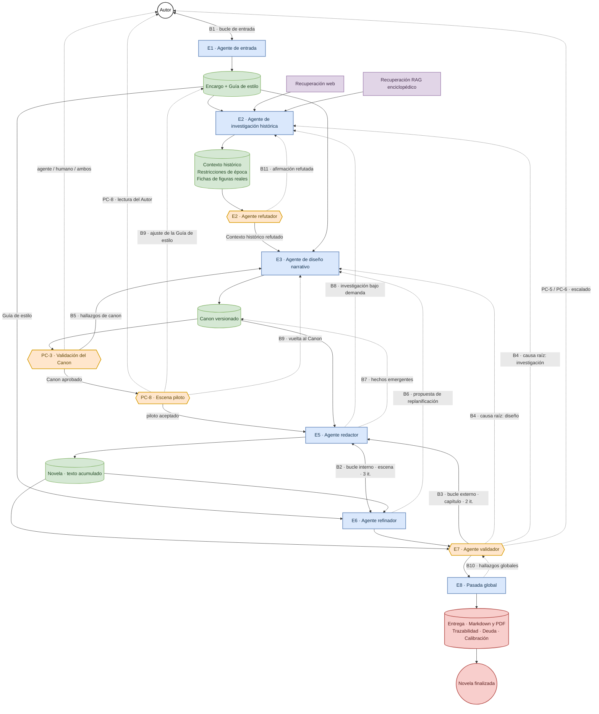
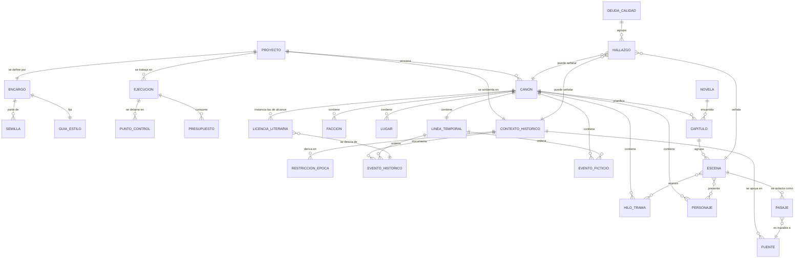

# Especificación Funcional — StoryMaker
### Arnés generador de novelas históricas

| Campo | Valor |
|---|---|
| Versión | **1.4** |
| Estado | Cerrada. Incorpora las decisiones D20 a D29, en respuesta a las preguntas PA-025 a PA-034. Sin preguntas abiertas |
| Entradas consumidas | Diagrama `StoryMaker.drawio` (13 nodos, 21 aristas) + especificación en prosa (2 turnos) + 29 decisiones de arbitraje (D1–D29) |
| Histórico de versiones | Sección 18 |
| Metodología | Specification Driven Development. Este documento es el artefacto fuente. |
| Alcance del documento | QUÉ y POR QUÉ. Ninguna decisión de implementación. |

---

## 0. Resumen ejecutivo

StoryMaker es un arnés que convierte una semilla creativa (un personaje, una época, una idea o una inspiración) en una novela histórica completa, mediante una cadena de agentes especializados: captura conversacional del encargo, investigación histórica documentada, diseño narrativo, redacción, refinamiento y validación. El sistema mantiene dos artefactos de estado —el **Contexto histórico** y el **Canon**— y tres bucles de corrección: entrada (con el usuario), interno (refinador↔redactor) y externo (validador→redactor).

La contribución de esta especificación sobre las entradas recibidas es hacer objetivas las terminaciones. El diseño original terminaba cuando los agentes se declaraban satisfechos; aquí la novela se finaliza solo cuando se cumple una condición verificable por un tercero: capítulos cerrados, hilos de trama resueltos, cero hallazgos bloqueantes y pasada global superada. Se añaden presupuestos duales (iteraciones y coste) y detección de estancamiento y regresión.

**Riesgo de divergencia estructural: resuelto en esta versión.** Las dos preguntas que permitían construir sistemas radicalmente distintos están cerradas. El rigor histórico es **riguroso con fuentes**, con figuras reales permitidas bajo restricciones documentadas (D7): el subsistema de investigación es una máquina de verificación con citas, no un generador de ambientación. El Canon planifica **a nivel de escena, con función narrativa y presupuesto de palabras, sin beats ni diálogo** (D9): el redactor ejecuta un plan cerrado en estructura y abierto en prosa.

**Riesgo residual declarado.** El ámbito histórico queda sin acotar (D8) y el corpus indexado es de naturaleza enciclopédica general. Esto hace que la cobertura documental varíe mucho de un período a otro y que el objetivo del 90 % de RNF-004 no sea alcanzable de forma uniforme. La mitigación no es medir la cobertura —un recuento de afirmaciones con fuente mide lo que el sistema decidió afirmar, no lo que la novela necesita saber— sino someter lo afirmado a contradicción: RF-102 obliga a buscar activamente las fuentes que desmienten cada afirmación de la que dependa una Restricción de época, antes de gastar nada en diseño ni en redacción. El riesgo de acometer un período mal documentado sin aviso previo queda aceptado y registrado en R-18.

**Aportación de la versión 1.1.** Se cierran tres huecos del ciclo anterior. La trazabilidad documental deja de medir que la cita exista y pasa a medir que la fuente sostenga lo que se le atribuye (RF-100, RF-101): hasta ahora una cita inventada cumplía todos los requisitos y contaminaba en silencio las Restricciones de época y, con ellas, la validación de la novela entera. Aparece un punto de lectura humana sobre prosa real antes de producir la novela completa (RF-046, PC-8): los dos puntos de control obligatorios anteriores ocurrían ambos antes de que existiera una sola línea escrita. Y la desviación deliberada de lo documentado puede declararse una vez para todo el Proyecto, instanciada en el Canon, en lugar de autorizarse pasaje a pasaje (RF-035).

---

## 1. Estado del análisis de entradas

Ambas entradas recibidas. El diagrama se trata como evidencia a interpretar, no como fuente de verdad. Donde texto y diagrama discrepan, prevalece el texto y la discrepancia se registra en 1.4.

### 1.1 Inventario del diagrama

**Nodos.** Nomenclatura: rectángulo con etiqueta en negrita = eje principal del dibujo; elipse = satélite. La forma geométrica **no** discrimina naturaleza (`Entrada`, `Salida`, `Contexto histórico` y `Creación de trama` comparten forma y son cosas distintas): es la primera mezcla de niveles de abstracción del diagrama.

| ID | Lectura literal | Interpretación propuesta | Tipo | Confianza | Motivo de incertidumbre |
|---|---|---|---|---|---|
| N1 | «Entrada» (elipse, con salto de línea vacío) | Etapa de captura conversacional del encargo, no un puerto de datos | Etapa de proceso | Alta | Confirmado por E1; la forma de elipse sugería artefacto |
| N2 | «Investigación en webs» | Modo de recuperación sobre la web abierta | Etapa de proceso (subetapa de N4) | Alta | — |
| N3 | «Investigación con RAG» | Modo de recuperación sobre corpus indexado | Etapa de proceso (subetapa de N4) | Alta | El corpus concreto no está definido en el diagrama |
| N4 | **«Investigación histórica»** | Agente que produce el Contexto histórico | Etapa de proceso | Alta | — |
| N5 | **«Análisis de período»** | Agente que produce trama y personajes. El nombre describe su entrada, no su salida | Etapa de proceso | Alta | El propio autor rechaza el nombre (E15) |
| N6 | **«Redacción»** | Agente redactor | Etapa de proceso | Alta | — |
| N7 | **«Refinamiento»** | Agente refinador lingüístico y estructural | Etapa de proceso | Alta | — |
| N8 | **«Validación»** | Agente validador, director del bucle externo | Etapa de proceso | Alta | — |
| N9 | «Salida» | Entrega de la novela finalizada | Artefacto | Alta | Formato y composición sin especificar |
| N10 | «Contexto histórico» | Artefacto producido por N4 | Artefacto | Alta | Contenido mínimo solo en E13 |
| N11 | «Creación de trama» | Subetapa de N5. La etiqueta nombra la acción; la flecha la trata como nodo intermedio | Etapa de proceso / artefacto (mezcla) | Media | Verbo sustantivado: ¿la acción o su resultado? Resuelto por D2 |
| N12 | «Creación de personajes» | Subetapa de N5. Misma ambigüedad que N11 | Etapa de proceso / artefacto (mezcla) | Media | Ídem |
| N13 | «Historia que se va escrbiendo» [sic] | Novela en curso: estado acumulado del texto ya redactado | Artefacto | Media | Errata en la etiqueta. ¿Solo texto, o también estado narrativo? Resuelto por D2 |

**Aristas.** 13 de las 21 tienen al menos un extremo sin anclar a un nodo (coordenadas flotantes). La atribución de origen y destino en esos casos es inferencia por proximidad geométrica, no dato del fichero; se indica la confianza correspondiente.

| ID | Lectura literal | Interpretación propuesta | Tipo | Confianza |
|---|---|---|---|---|
| A1 | Flecha gruesa desde (240,385) a N4 | N1 → N4. El origen coincide con el borde derecho de N1 | Flujo de control | Alta |
| A2 | Flecha gruesa (489,384) → (588,384) | N4 → N5. Ambos extremos sueltos, alineados con los bordes | Flujo de control | Alta |
| A3 | Flecha gruesa (740,384) → (839,384) | N5 → N6. Ambos extremos sueltos | Flujo de control | Alta |
| A4 | Flecha gruesa (990,384) → (1089,384) | N6 → N7. Ambos extremos sueltos | Flujo de control | Alta |
| A5 | Flecha gruesa (1241,384) → (1340,384) | N7 → N8. Ambos extremos sueltos | Flujo de control | Alta |
| A6 | Flecha gruesa (1490,384) → (1589,384) | N8 → N9. Ambos extremos sueltos | Flujo de control | Alta |
| A7 | Flecha desde (330,270) a N4 | N2 → N4. Origen en el borde inferior de N2 | Flujo de datos | Alta |
| A8 | Flecha desde (470,260) a N4 | N3 → N4. Origen en el borde inferior de N3 | Flujo de datos | Alta |
| A9 | N4 → N10 (ambos extremos anclados) | La investigación produce el Contexto histórico | Flujo de datos | Alta |
| A10 | Flecha desde (396,530) a N5 | N10 → N5. El Contexto histórico alimenta el diseño | Flujo de datos | Alta |
| A11 | N5 → N11 (anclada) | El diseño produce la trama | Flujo de datos | Alta |
| A12 | N5 → N12 (anclada) | El diseño produce los personajes | Flujo de datos | Alta |
| A13 | Flecha desde (760,520) a N6 | N12 → N6. Personajes hacia el redactor | Flujo de datos | Alta |
| A14 | Flecha desde (800,558) a N8 | N12 → N8. Los personajes se validan | Flujo de datos | Media — el origen cae en el borde derecho de N12 pero podría ser un haz común con A16 |
| A15 | Bucle sobre N1, etiquetado «Bucle de entrada. Pregunta por: Tema / Personaje / Inspiración» | Interrogatorio iterativo con el usuario | Bucle | Alta |
| A16 | N11 → N8 (anclada) | La trama se valida, saltándose N6 y N7 | Flujo de datos | Alta |
| A17 | Flecha (980,170) → (1377,340) | N13 → N8. La novela en curso alimenta la validación | Flujo de datos | Media — extremos sueltos |
| A18 | N6 → N13 (anclada) | La redacción alimenta la novela en curso | Flujo de datos | Alta |
| A19 | N13 → N7 (anclada) | La novela en curso alimenta el refinamiento | Flujo de datos | Alta |
| A20 | N7 → (940,430), extremo suelto | N7 → N6. **Bucle interno.** El destino coincide con el borde inferior de N6 | Bucle | Media — en ausencia de E28 se habría leído como arista huérfana |
| A21 | N8 → N6 (anclada, curva) | **Bucle externo.** El validador devuelve al redactor | Bucle | Alta |

**Hallazgos sobre el diagrama, sin corregir en silencio:**

1. **No hay nodos huérfanos.** Los 13 nodos participan en al menos una arista.
2. **A14 y A16 son las aristas más informativas del dibujo y el texto las ha perdido.** Llevan trama y personajes directamente a Validación sin pasar por Redacción. El texto de la especificación no menciona ninguna validación previa a la redacción. Se resuelve en D3.
3. **A20 solo es legible a la luz del texto.** En el fichero es una flecha curva que sale de N7 y muere en el vacío. E28 («este itera criticando al redactor») la convierte en el bucle interno.
4. **Ausencias.** El diagrama no contiene ningún elemento para: guía de estilo, canon persistente, detección de anacronismos como paso diferenciado, presupuesto o coste, actor humano fuera de A15, condición de terminación, ni entidad de ejecución. Todo ello aparece en el texto o en las decisiones D1–D6.
5. **Mezcla de niveles.** N2/N3 (modos de recuperación) están al mismo nivel visual que N11/N12 (subetapas de diseño) y que N10/N13 (artefactos).

### 1.2 Diagrama normalizado

Representación canónica a partir de aquí. Sustituye al boceto original a todos los efectos: el inventario de 1.1 conserva el diagrama tal como se recibió, porque es la evidencia de partida, pero ninguna decisión posterior se toma contra él.

El diagrama va embebido en este documento, que es autosuficiente, y el bloque que sigue es su **única fuente de verdad**. El fichero `diagrama.drawio` del repositorio es el boceto original recibido, el que inventaría la sección 1.1, y no la arquitectura vigente: no debe leerse como tal. Si en algún momento se emiten copias editables del diagrama canónico, serán derivadas de este bloque y prevalecerá lo embebido aquí.

**Convenciones.** Azul: agente o etapa de proceso. Verde: artefacto de estado. Naranja: punto de decisión o validación. Morado: fuente de recuperación. Rojo: entrega. Arista continua: pipeline principal y flujos de datos. Arista discontinua: bucle de corrección o punto de control humano.



**Desviaciones respecto al original y su motivo:**

| # | Desviación | Motivo |
|---|---|---|
| 1 | N5 renombrado de «Análisis de período» a «Agente de diseño narrativo» | E15: el autor rechaza el nombre. El nombre original describe la entrada del agente, no su salida, y colisiona con N4 |
| 2 | N11 y N12 desaparecen como nodos y se convierten en contenido del artefacto **Canon** | D2: el autor unifica trama, capítulos y personajes bajo el término Canon |
| 3 | N13 se renombra a **Novela** y se restringe a texto redactado | D2 traslada el estado narrativo al Canon; N13 conserva solo el texto |
| 4 | A14 y A16 se reinterpretan como *puerta de validación del Canon* previa a la redacción, no como flujo hacia el validador de novela | D3: el autor decide que el canon entero se valide antes de redactar |
| 5 | Se añade N30 (validación del Canon) y su punto de control configurable | D3 |
| 6 | Se añade N68 (pasada global sobre la novela completa) | SUP-010. No está en ninguna entrada; su ausencia deja la deriva de voz y los hilos sin cerrar fuera de todo control |
| 7 | Se añaden las aristas B4, B7 y B8 | SUP-004, SUP-007, SUP-008. Ver 1.4 y sección 14 |
| 8 | Se añaden los artefactos Encargo y Guía de estilo | E4, E5, E27 los exigen; el diagrama no los dibuja |
| 9 | Las seis flechas del eje principal se anclan a sus nodos | Sus extremos flotaban; la atribución es la de 1.1 con confianza Alta |
| 10 | N2 y N3 pasan a subetapas dentro de N4 y el corpus se cualifica como enciclopédico general | A7 y A8 ya los subordinaban; el dibujo los ponía al mismo nivel visual que las etapas. La naturaleza del corpus procede de D8 |
| 11 | Se añade el **Agente refutador** dentro de E2, entre el Contexto histórico y el diseño, con el bucle B11 de vuelta a la investigación | D27. La versión 1.1 situaba aquí un dictamen de viabilidad documental (D8, D18), retirado en la 1.3: medía el porcentaje de afirmaciones con fuente, es decir, lo que el propio sistema había decidido afirmar, y no lo que la novela necesita saber. Lo sustituye una pasada adversarial que busca las fuentes que contradicen lo afirmado |
| 12 | Se añade la arista **B6**, propuesta de replanificación del refinador hacia el diseño narrativo | E25 atribuye competencia estructural al refinador y D2 hace del Canon la fuente de verdad: el refinador propone, no aplica |
| 13 | Se añaden los puntos de control PC-5 y PC-6 hacia el Autor, y el nodo de entrega con sus dos formatos | RF-076, RF-074 y D17 |
| 14 | El Contexto histórico incorpora las fichas de figuras históricas reales | D7 y RF-019 |
| 15 | Se añade el nodo de **escena piloto** con su punto de control PC-8, entre la aprobación del Canon y la producción de la novela, y el bucle B9 hacia la Guía de estilo o hacia el Canon | D21. Los dos puntos de control humanos obligatorios anteriores, PC-1 y PC-3, ocurren ambos antes de que exista una línea de prosa |
| 16 | ~~La etiqueta PC-7 del dictamen de viabilidad queda formalizada en la tabla 12.1~~ **Retirada en la 1.3 junto con el dictamen (D27).** El identificador PC-7 queda retirado y no se reutiliza | Corrección de coherencia de la 1.1, sin objeto desde que el dictamen desaparece |

### 1.3 Afirmaciones extraídas del texto

| ID | Afirmación | Clasificación |
|---|---|---|
| E1 | El agente de entrada ayuda a encontrar la idea de la novela en bucle con el usuario | Requisito funcional |
| E2 | Una novela puede empezar a partir de un personaje, una época, una idea o una inspiración | Requisito funcional (tipos de semilla admitidos) |
| E3 | El agente de entrada «debe conseguir sacarlo» | Requisito funcional — **vago, a operacionalizar** |
| E4 | También debe extraer la longitud | Requisito funcional |
| E5 | También debe extraer el estilo (ejemplos: primera persona, inicio *in medias res*) | Requisito funcional |
| E6 | «no sé, lo que se te ocurra» | Delegación explícita al analista → sección 17 |
| E7 | El flujo pasa después a un investigador histórico | Requisito funcional (secuencia) |
| E8 | Busca en webs | Requisito funcional |
| E9 | Busca en RAG | Requisito funcional |
| E10 | «por ejemplo el que creo que existe de Wikipedia» | Ejemplo ilustrativo + supuesto del autor sobre disponibilidad → SUP-002 |
| E11 | Escribe un contexto histórico completo | Requisito funcional — **«completo» vago, a operacionalizar** |
| E12 | El propósito del contexto histórico es evitar anacronismos | Objetivo de negocio |
| E13 | El contexto incluye cómo se vestía, qué existía, el contexto social y las preocupaciones | Requisito funcional (contenido mínimo) |
| E14 | Continúa el agente de «análisis de período» | Requisito funcional (secuencia) |
| E15 | El nombre «análisis de período» no convence al autor | Preferencia → decisión de glosario |
| E16 | Ese agente recibe el contexto histórico | Requisito funcional (contrato de datos) |
| E17 | Crea la trama | Requisito funcional |
| E18 | Crea los personajes | Requisito funcional |
| E19 | «hay que ver con qué detalle» | Duda explícita del autor → **PA-014** |
| E20 | Se pasa al agente redactor | Requisito funcional (secuencia) |
| E21 | Empieza a redactar la novela | Requisito funcional |
| E22 | «no sé cuándo se itera por el bucle» | Duda explícita del autor → resuelta por D1 |
| E23 | Redacta a partir de la trama y los personajes | Requisito funcional (contrato de datos) |
| E24 | El agente de refinamiento refina a nivel lingüístico | Requisito funcional |
| E25 | Refina a nivel de estructura, por ejemplo si hay que cambiar de capítulo | Requisito funcional |
| E26 | Refina adjetivos | Ejemplo ilustrativo de E24 |
| E27 | El refinador debe tener acceso al estilo de escritura, si se ha dado alguno | Requisito funcional |
| E28 | El refinador itera criticando al redactor; a esto se le llama bucle interno | Requisito funcional (bucle B2) |
| E29 | El bucle externo lo dirige el validador | Requisito funcional (bucle B3) |
| E30 | El validador hace que la trama se cumpla | Requisito funcional |
| E31 | El validador impide que se cuenten cosas antes de tiempo | Requisito funcional |
| E32 | El validador exige coherencia con lo decidido en el diseño narrativo | Requisito funcional |
| E33 | El validador valida a nivel histórico | Requisito funcional |
| E34 | El validador valida «a todos los niveles» | Requisito funcional — **vago, a operacionalizar** |
| E35 | Si no está bien, lo devuelve al redactor | Requisito funcional |
| E36 | Cuando el redactor dice que está acabado y refinador y validador se lo aprueban, se finaliza la novela | Requisito funcional — **sustituido por D6** |

**Decisiones de arbitraje del autor (ronda de preguntas abiertas):**

| ID | Decisión | Origen |
|---|---|---|
| D1 | La unidad de iteración de los bucles queda delegada al analista | Respuesta a PA-008 |
| D2 | El estado narrativo se llama **Canon** y contiene trama, capítulos, personajes y demás | Respuesta a PA-009 |
| D3 | El Canon entero debe ser validado; por defecto por un agente, configurable a persona | Respuesta a PA-010 |
| D4 | La política ante agotamiento de presupuesto queda delegada al analista | Respuesta a PA-011 |
| D5 | Existe intervención humana posible tras el diseño narrativo, en los términos de D3 | Respuesta a PA-012 |
| D6 | La novela se declara terminada por condición objetiva: capítulos cerrados, hilos resueltos, cero bloqueantes | Respuesta a PA-013 |

| D7 | Rigor histórico **riguroso con fuentes**; figuras históricas reales **permitidas bajo restricciones documentadas** | Respuesta a PA-006 |
| D8 | Ámbito histórico **sin acotar**: cualquier período. El corpus indexado es de naturaleza **enciclopédica general** | Respuesta a PA-021 |
| D9 | El Canon planifica **a nivel de escena**, con función narrativa y presupuesto de palabras; sin beats ni líneas de diálogo | Respuesta a PA-014 |
| D10 | El criterio de éxito del proyecto es **ahorro medible de trabajo** más **cero hallazgos bloqueantes** | Respuesta a PA-007 |
| D11 | Los hechos históricos sensibles se tratan **con criterios declarados**, salvo indicación distinta en el Encargo | Respuesta a PA-015 |
| D12 | Se exige **trazabilidad y reejecutabilidad**, no determinismo estricto | Respuesta a PA-016 |
| D13 | Presupuestos por defecto según la tabla 10.1, sujetos a recalibración tras las primeras ejecuciones | Respuesta a PA-017 |
| D14 | El usuario final es **el propio Autor**, en uso propio. El rol de Operador lo encarna el Autor | Respuesta a PA-018 |
| D15 | Modo de operación por defecto: **asistido**, con migración a autónomo supervisado una vez calibrados los presupuestos | Respuesta a PA-019 |
| D16 | Idioma de las novelas generadas: **español** | Respuesta a PA-020 |
| D17 | Formatos de entrega: **Markdown y PDF** | Respuesta a PA-022 |
| D18 | ~~Umbral de viabilidad documental: al menos cuatro de las cinco secciones obligatorias con el 70 % o más de afirmaciones con fuente~~ **Sin efecto desde la 1.3: el dictamen que umbralizaba se retira por D27** | Respuesta a PA-023 |
| D19 | Los presupuestos de la tabla 10.1 se aceptan como provisionales, con **calibración obligatoria tras la primera Ejecución completa** | Respuesta a PA-024 |
| D20 | Se exige **comprobar que la Fuente sostiene la afirmación**, no solo que esté asociada, y **conservar el contenido consultado** | Respuesta a PA-025 |
| D21 | Se instituye la **escena piloto** como puerta obligatoria antes de producir la novela completa | Respuesta a PA-026 |
| D22 | Se admiten **Licencias literarias de alcance instanciadas en el Canon**, que puede proponer tanto el Autor como el propio sistema cuando lo considere mejor para la historia | Respuesta a PA-027 |
| D23 | El validador humano **puede aprobar un Canon con bloqueantes abiertos**; cada uno se convierte en Deuda de calidad o en Licencia registrada y el Proyecto solo podrá alcanzar *finalizado con reservas* | Respuesta a PA-028 |
| D24 | La reserva común de presupuesto se **segmenta**, con un tramo que solo se libera en el último tercio de la novela | Respuesta a PA-029 |
| D25 | Se **mide la superficie de texto protegido** y se revisa en la pasada global; RF-054 pasa a Must | Respuesta a PA-030 |
| D26 | El artefacto que acumula el texto redactado se llama **Novela** | Respuesta a PA-031 |
| D28 | La **extensión por capítulo** es dato del Encargo, admitida en palabras o en **líneas**, con factor de conversión declarado y confirmado; la palabra sigue siendo la unidad canónica | Respuesta a PA-033 |
| D29 | El Encargo puede entregarse como **fichero JSON estructurado**, además de por conversación, con las mismas validaciones y la misma confirmación | Respuesta a PA-034 |
| D27 | Se **retira el dictamen de viabilidad documental** y se sustituye por una **pasada de refutación**: un agente distinto busca activamente fuentes que contradigan lo que afirmó la investigación | Respuesta a PA-032 |

Las preguntas PA-001 a PA-013 se cerraron en la versión 0.2, antes de la primera redacción completa; PA-006 y PA-014 a PA-021 en la 0.3; PA-022 a PA-024 en la 0.4. El registro completo de cierre está en la sección 15.1. Los identificadores nunca se reutilizan.

### 1.4 Discrepancias detectadas

| Tipo | Descripción | Lecturas posibles | Resolución propuesta |
|---|---|---|---|
| Laguna | El diagrama valida trama y personajes antes de redactar (A14, A16); el texto no menciona validación previa | (a) El dibujo era un borrador descartado. (b) El autor lo dio por sabido | **(b).** Confirmado por D3: se instituye la validación del Canon como puerta obligatoria. Prevalece el diagrama por confirmación explícita posterior |
| Contradicción | E36 hace terminar la novela cuando «el redactor dice que está acabado»; D6 exige condición objetiva | Autodeclaración vs. condición verificable | **D6 prevalece** por ser posterior y explícita. E36 queda como requisito obsoleto |
| Contradicción | E25 permite al refinador reestructurar capítulos; D2/E32 hacen del Canon la fuente de verdad de la estructura | (a) El refinador modifica el Canon. (b) El refinador propone y otro decide | **(b).** Un agente que altera la estructura sin pasar por el Canon convierte el Canon en documentación obsoleta. Ver RF-053 |
| Contradicción latente | E28 (refinador critica el texto) y E29–E34 (validador critica el texto) pueden exigir cambios opuestos sobre el mismo pasaje | Sin precedencia declarada → oscilación | Precedencia **validador > refinador** y figura de pasaje protegido. Ver RF-054. [SUPUESTO SUP-009] |
| Desalineación de granularidad | El texto habla de «redactar la novela» (E21) y de bucles por iteración, sin decir sobre qué unidad | Escena / capítulo / novela completa | D1 delega. Resuelto en SUP-001: escena para B2, capítulo para B3, novela para la pasada global |
| Laguna | E35 devuelve todo hallazgo al redactor, incluidos los de origen histórico o de diseño | (a) El redactor corrige todo. (b) Cada hallazgo vuelve a su causa raíz | **(b)**, con la ruta al redactor como defecto. Que el redactor corrija un error histórico sin nueva investigación garantiza que lo sustituya por otro inventado. [SUPUESTO SUP-004] |
| Laguna | Nada escribe de vuelta en el Canon los hechos que la redacción crea (una cicatriz, una promesa, la distribución de una casa) | (a) El validador relee toda la novela cada vez. (b) El Canon se actualiza | **(b).** (a) hace crecer el coste con el cuadrado de la extensión. [SUPUESTO SUP-007] |
| Redundancia | N2 «Investigación en webs» y N3 «Investigación con RAG» aparecen como nodos hermanos y como modos del mismo agente | Ramas alternativas vs. modos complementarios | Modos complementarios de N4, activables por configuración. Ver RF-011, RF-012 |
| Laguna | El texto nombra la longitud como dato de entrada (E4) y nadie la vigila después | Sin control de ritmo, el final llega atropellado o la trama se desborda | Vigilancia de consumo de extensión. Ver RF-069. [SUPUESTO SUP-011] |
| Desalineación | «Salida» (N9) no tiene formato, composición ni criterio de completitud | — | Definido en RF-090 a RF-092 sobre supuesto SUP-013 |

---

## 2. Visión, objetivos y criterios de éxito

**Visión.** Un autor aporta una chispa —un personaje, una época, una idea, una imagen— y StoryMaker la convierte en una novela histórica completa, internamente coherente y libre de anacronismos, sin que el autor tenga que sostener en la cabeza la continuidad de cien mil palabras.

**Objetivos, en orden de precedencia.** El orden importa: cuando dos objetivos chocan, gana el de arriba.

| ID | Objetivo | Origen |
|---|---|---|
| OBJ-1 | Que la novela no se contradiga consigo misma ni adelante lo que no debe adelantar | E30, E31, E32 |
| OBJ-2 | Que la novela no contenga anacronismos ni afirmaciones históricas insostenibles | E12, E13, E33 |
| OBJ-3 | Que la novela cumpla el encargo del autor: su semilla, su extensión, su estilo | E1–E5 |
| OBJ-4 | Que el proceso termine, con coste y duración acotados y conocidos | D4, D6 |
| OBJ-5 | Que toda decisión y todo pasaje sean rastreables hasta su origen | Exigencia del contexto del encargo |
| OBJ-6 | Que la prosa sea de calidad publicable | E24, E26 — **objetivo subordinado: nunca a costa de OBJ-1 y OBJ-2** |

**Criterios de éxito del proyecto.** No declarados por el autor. Propuestos sobre supuesto, pendientes de PA-007.

| ID | Criterio | Métrica de aceptación propuesta |
|---|---|---|
| CE-1 | El arnés produce novelas terminadas, no borradores abandonados | ≥ 90 % de las ejecuciones alcanzan terminación por convergencia (T1) sin agotar presupuesto |
| CE-2 | El resultado ahorra trabajo real al autor | Un revisor humano cierra la novela con ≤ 20 % de las palabras reescritas |
| CE-3 | La coherencia se sostiene hasta el final | Cero hallazgos bloqueantes de continuidad en la pasada global, medidos sobre el último tercio de la novela |
| CE-4 | La ambientación resiste a un lector informado | Cero anacronismos bloqueantes confirmados en auditoría por muestreo |

**Precedencia fijada por D10:** CE-2 y CE-3 son los criterios de aceptación del proyecto. CE-1 y CE-4 son indicadores de salud que se vigilan pero no deciden si el arnés funciona. Los umbrales numéricos siguen siendo propuestas mías sin base empírica (SUP-021, SUP-027) y deben recalibrarse tras las primeras ejecuciones reales.

---

## 3. Glosario de lenguaje ubicuo

Se prioriza el vocabulario del autor. Cada término introducido por mí lleva justificación.

| Término | Definición | Sinónimos descartados y razón |
|---|---|---|
| **Arnés** | Sistema orquestado completo que ejecuta la cadena de agentes desde la semilla hasta la novela terminada | *Pipeline* (término del autor en el contexto, pero designa solo la secuencia, no el control de bucles); *orquestador* (designa un componente, no el sistema) |
| **Ejecución** | Recorrido concreto del arnés sobre un Proyecto, con su configuración, sus presupuestos y su registro. Unidad de trazabilidad y de coste | *Run*, *job*: anglicismos sin ganancia |
| **Proyecto de novela** | Contenedor de todo lo relativo a una novela: Encargo, Contexto histórico, Canon, Novela y sus Ejecuciones | *Libro*: designa el resultado, no el expediente |
| **Semilla** | Punto de partida creativo aportado por el usuario. Puede ser un personaje, una época, una idea o una inspiración | *Prompt inicial*: confunde la intención del autor con el mecanismo del modelo. Término introducido por mí para nombrar lo que E2 enumera sin nombrar |
| **Encargo** | Conjunto cerrado y confirmado de lo que el usuario quiere: semilla, premisa, época, extensión objetivo y parámetros de estilo. Producto del Agente de entrada | *Briefing*, *especificación del usuario*. Término introducido por mí: E1–E5 describen su contenido sin darle nombre |
| **Contexto histórico** | Artefacto documental que describe el mundo en el que transcurre la novela: qué existía, cómo se vestía, cómo se vivía, qué preocupaba. Cada afirmación va acompañada de su fuente | Término del autor (E11). *Ambientación*, *worldbuilding* descartados: el primero es vago, el segundo implica invención |
| **Restricción de época** | Regla accionable derivada del Contexto histórico que delimita lo que puede aparecer en el texto: objetos, términos, instituciones, ideas | Término introducido por mí. El Contexto histórico es prosa descriptiva; la validación automática necesita reglas comprobables. Justificación en RF-016 |
| **Canon** | Fuente única de verdad narrativa del Proyecto: arco, hilos de trama, capítulos y escenas planificadas, personajes, facciones, lugares, línea temporal, plan de revelaciones y hechos establecidos. Versionado | Término del autor (D2). *Biblia*, *trama*, *escaleta* descartados: el autor eligió *Canon* y lo definió como continente de todos ellos |
| **Hilo de trama** | Línea de conflicto o pregunta narrativa con un estado explícito: abierto, avanzado o resuelto. Elemento del Canon | Término introducido por mí. Sin él, «que la trama se cumpla» (E30) no es verificable |
| **Plan de revelaciones** | Registro, dentro del Canon, de qué información se hace pública en qué punto del relato y ante quién | Término introducido por mí para operacionalizar E31 («que no se cuenten cosas antes de tiempo») |
| **Guía de estilo** | Parámetros de voz y forma acordados con el usuario: persona, tiempo verbal, registro, recursos de apertura, densidad descriptiva | Término introducido por mí. E5 y E27 hablan de «estilo» sin nombrar el artefacto |
| **Escena** | Unidad mínima de texto redactable: un lugar, un tiempo continuo, una función narrativa declarada. Unidad del bucle interno | Término introducido por mí. Necesario para responder a E22 y D1 |
| **Capítulo** | Agrupación ordenada de escenas. Unidad del bucle externo y unidad de cierre | Término del autor (E25) |
| **Novela** | Conjunto del texto redactado hasta el momento, organizado en capítulos y escenas, con su estado de aprobación. En su estado terminal es la Novela finalizada que se entrega | El diagrama lo llamaba «Historia que se va escribiendo» (N13). *Historia* se descarta por designar el relato y no el texto |
| **Hallazgo** | Defecto detectado por un agente crítico sobre un artefacto, con severidad, causa raíz, localización y acción exigida | *Issue*, *error*, *crítica*. Término introducido por mí: E28 y E35 describen la crítica sin darle forma verificable |
| **Severidad** | Clasificación de un Hallazgo en bloqueante, mayor o menor, que determina si fuerza iteración | Término introducido por mí. Sin él, ningún bucle converge: un crítico automático siempre encuentra algo |
| **Causa raíz** | Etapa responsable del Hallazgo: entrada, investigación, diseño narrativo, redacción o refinamiento | Término introducido por mí. Ver SUP-004 |
| **Anacronismo** | Elemento incompatible con la época: léxico, material, tecnológico, institucional o de mentalidad | Término del autor (E12) |
| **Licencia literaria** | Desviación deliberada de lo documentado, tomada por razones narrativas y registrada como tal | Término introducido por mí. Distingue la desviación consciente del error |
| **Licencia de alcance** | Licencia literaria que autoriza una desviación sostenida a lo largo de todo el Proyecto —de forma característica, la participación de una figura histórica real en una trama no documentada— en lugar de pasaje a pasaje. Se instancia en el Canon y se aprueba con él | Término introducido por mí en respuesta a D22. Sin él, una premisa de esa clase exige tantas autorizaciones como escenas en las que la figura aparezca |
| **Escena piloto** | Primera escena redactada del Proyecto, representativa del Canon aprobado, que se somete al Autor antes de producir el resto de la novela | Término introducido por mí (propuesta PR-02, elevada a requisito por D21) |
| **Bucle de entrada (B1)** | Interrogatorio iterativo entre Agente de entrada y usuario hasta cerrar el Encargo | Término del autor (A15) |
| **Bucle interno (B2)** | Iteración entre Agente refinador y Agente redactor sobre una Escena | Término del autor (E28) |
| **Bucle externo (B3)** | Iteración dirigida por el Agente validador que devuelve un Capítulo al Agente redactor | Término del autor (E29) |
| **Pasaje protegido** | Fragmento de texto que resolvió un Hallazgo bloqueante y que no puede reescribirse sin justificación registrada | Término introducido por mí. Evita la oscilación descrita en 1.4 |
| **Presupuesto** | Límite declarado de iteraciones, coste o tiempo asignado a una unidad de trabajo o a una Ejecución | Término introducido por mí a partir de la intuición del autor sobre límites por longitud |
| **Punto de control** | Momento del flujo en el que la Ejecución se detiene a esperar una aprobación, de un agente validador o de una persona | Término introducido por mí para nombrar lo que D3 y D5 instituyen |
| **Deuda de calidad** | Registro de los Hallazgos no resueltos con los que se cerró una unidad por agotamiento de presupuesto | Término introducido por mí. Hace visible lo que de otro modo se entrega en silencio |

---

## 4. Alcance

### 4.1 Dentro de alcance

| Elemento | Justificación |
|---|---|
| Captura conversacional del Encargo a partir de cualquier tipo de semilla | E1, E2 |
| Extracción de extensión objetivo y parámetros de estilo | E4, E5 |
| Investigación histórica con recuperación web y RAG, y registro de fuentes | E8, E9 |
| Verificación de que la fuente sostiene la afirmación, y conservación del contenido consultado | D20 |
| Extensión por capítulo en palabras o en líneas, convertida en la captura | D28 |
| Entrega del Encargo como fichero JSON estructurado, alternativa al interrogatorio | D29 |
| Refutación adversarial del Contexto histórico por un agente distinto del que lo produjo | D27 |
| Escena piloto sometida al Autor antes de producir la novela completa | D21 |
| Licencias literarias de alcance instanciadas en el Canon | D22 |
| Producción del Contexto histórico con contenido mínimo obligatorio | E11, E13 |
| Diseño narrativo: trama, personajes, capítulos, escenas, línea temporal | E17, E18, D2 |
| Canon versionado como fuente única de verdad narrativa | D2 |
| Validación del Canon completo antes de redactar, por agente o por persona | D3, D5, A14, A16 |
| Redacción escena a escena a partir del Canon | E21, E23 |
| Refinamiento lingüístico y estructural con acceso a la Guía de estilo | E24, E25, E27 |
| Bucle interno refinador↔redactor | E28, A20 |
| Validación de continuidad, cumplimiento de trama, revelaciones y verosimilitud histórica | E30–E34 |
| Bucle externo validador→redactor | E29, E35, A21 |
| Presupuestos de iteración y de coste, con política de agotamiento declarada | D4 |
| Terminación por condición objetiva | D6 |
| Trazabilidad de pasaje a decisión, fuente y ejecución | Exigencia del contexto del encargo |
| Ensamblado y entrega de la novela finalizada | N9, A6 |
| Entrega en Markdown y en PDF | D17 |

### 4.2 Fuera de alcance

| Elemento | Justificación de la exclusión |
|---|---|
| Publicación, maquetación editorial, portada, ISBN, distribución | Ninguna entrada lo menciona. N9 termina en «Salida» |
| Edición manual del texto dentro del sistema por parte del usuario | El único contacto humano declarado es B1 y el punto de control de D3. Un editor de texto integrado es otro producto |
| Generación de ilustraciones o material gráfico | Ninguna entrada lo menciona |
| Series, sagas o continuidad entre novelas distintas | El Canon se define por Proyecto. Ninguna entrada plantea reutilización |
| Traducción de la novela a otros idiomas | Ninguna entrada lo menciona |
| Detección de plagio o de similitud con obras existentes | Ninguna entrada lo menciona. Se registra como riesgo R-09 |
| Personalización del modelo por autor, aprendizaje entre ejecuciones | Ninguna entrada lo menciona |
| Colaboración multiusuario sobre un mismo Proyecto | Ninguna entrada lo menciona |

### 4.3 Aplazado a fase posterior

| Elemento | Justificación del aplazamiento |
|---|---|
| Formatos de entrega distintos de Markdown y PDF (DOCX, EPUB) | D17 fija Markdown y PDF. Los demás son una capa de conversión separable que no afecta a ningún otro requisito; se añaden cuando el Autor los necesite |
| Modo copiloto, en el que el autor escribe y el arnés asiste | Es un producto distinto con los mismos componentes. Ninguna entrada lo pide, pero el Canon y el validador lo harían viable sin rediseño |
| Biblioteca de corpus RAG gestionada por el usuario | E9 y E10 asumen un corpus preexistente. La gestión del corpus es un subsistema propio |
| Auditoría humana por muestreo sobre novelas terminadas | Necesaria para verificar CE-4, pero es un proceso de organización, no una función del arnés |

---

## 5. Actores y objetivos

| Actor | Naturaleza | Objetivo | Pericia asumida | Origen |
|---|---|---|---|---|
| **Autor** | Humano | Obtener una novela histórica que responda a su semilla, sin sostener él la coherencia | Criterio narrativo alto; conocimiento histórico variable; ninguna pericia técnica exigida | E1, E2 |
| **Validador de canon humano** | Humano, opcional | Aprobar o rechazar el Canon completo antes de que se gaste presupuesto en redactar | Criterio narrativo e histórico. Puede ser el propio Autor | D3, D5 |
| **Agente de entrada** | Agente | Cerrar un Encargo completo y sin contradicciones a partir de una semilla incompleta | — | E1, N1 |
| **Agente de investigación histórica** | Agente | Producir un Contexto histórico con fuentes y unas Restricciones de época accionables | — | E7, N4 |
| **Agente refutador** | Agente | Intentar desmentir con fuentes lo que la investigación ha afirmado, y hacer aflorar los hechos disputados que una sola búsqueda no encuentra | — | D27 |
| **Agente de diseño narrativo** | Agente | Producir un Canon coherente con el Contexto histórico y con el Encargo | — | E14, N5 |
| **Agente redactor** | Agente | Convertir escenas planificadas en prosa fiel al Canon y a la Guía de estilo | — | E20, N6 |
| **Agente refinador** | Agente | Elevar la calidad lingüística y señalar problemas estructurales sin decidir sobre ellos | — | E24, N7 |
| **Agente validador** | Agente | Impedir que avance texto que contradiga el Canon, la época o el plan de revelaciones | — | E29, N8 |
| **Agente validador de canon** | Agente | Aprobar el Canon antes de la redacción | — | D3 |
| **Operador** | Humano | Configurar presupuestos y modos, reanudar ejecuciones caídas, inspeccionar el estado | Técnica. [SUPUESTO SUP-014: puede coincidir con el Autor] | SUP-014 |

---

## 6. Modelo del dominio

### 6.1 Entidades

| Entidad | Atributos conceptuales | Invariantes | Ciclo de vida |
|---|---|---|---|
| **Proyecto de novela** | Identificador, título provisional, estado, fecha de creación | Contiene exactamente un Encargo y, como máximo, un Canon vigente | Creado → En encargo → En investigación → En diseño → En producción → Finalizado / Finalizado con reservas / Abandonado |
| **Semilla** | Tipo (personaje, época, idea, inspiración), contenido literal del usuario | Al menos una por Proyecto. Nunca se reescribe: se conserva tal cual la formuló el Autor | Inmutable desde su captura |
| **Encargo** | Semillas, premisa, época y ámbito geográfico, extensión objetivo, Guía de estilo, restricciones del autor | No puede cerrarse con campos obligatorios vacíos ni con contradicciones internas sin resolver. Una vez cerrado, solo cambia por decisión explícita del Autor y con nueva versión | Abierto → Cerrado → Reabierto (versionado) |
| **Guía de estilo** | Persona narrativa, tiempo verbal, registro, densidad descriptiva, recursos de apertura, longitud media de frase objetivo, prohibiciones explícitas | Pertenece a un Encargo. Puede estar parcialmente vacía: el vacío significa «sin preferencia», nunca un valor por defecto silencioso | Nace con el Encargo; se versiona con él |
| **Fuente documental** | Identificador, tipo (web, corpus RAG), localizador, fecha de consulta, fiabilidad declarada, **contenido consultado conservado** | Toda afirmación histórica del Contexto histórico referencia al menos una Fuente, o se marca como sin fuente. Toda Fuente conserva el contenido en el que se apoyó la afirmación, o declara por qué no pudo conservarse | Registrada en el momento de la consulta; inmutable |
| **Contexto histórico** | Secciones temáticas obligatorias, afirmaciones con fuente, lagunas declaradas, hechos disputados | No puede declararse completo con secciones obligatorias vacías. Cada afirmación tiene fuente o marca de carencia | Vacío → En elaboración → Completo → Ampliado (por investigación bajo demanda) |
| **Restricción de época** | Enunciado comprobable, categoría (léxica, material, tecnológica, institucional, de mentalidad), fuente de la que deriva, severidad de su incumplimiento | Deriva siempre de una afirmación del Contexto histórico | Derivada → Vigente → Revocada con justificación |
| **Canon** | Versión, arco narrativo, hilos de trama, personajes, facciones, lugares, línea temporal, capítulos y escenas planificadas, plan de revelaciones, hechos establecidos, **licencias de alcance vigentes**, estado de aprobación | Un Canon aprobado es inmutable: toda modificación genera una versión nueva. No puede aprobarse con hilos sin resolución planificada ni con escenas sin función narrativa | Borrador → En validación → Aprobado (línea base) → Superado por versión posterior |
| **Hilo de trama** | Identificador, pregunta o conflicto, escena de apertura, escenas de avance, escena de resolución, estado | Todo hilo tiene una escena de resolución planificada en el Canon aprobado | Planificado → Abierto → Avanzado → Resuelto |
| **Personaje** | Nombre, tipo (ficticio, histórico real), función narrativa, rasgos, voz, arco, conocimiento inicial, relaciones | Un personaje histórico real está asociado al menos a una Fuente documental | Definido → Vigente → Retirado con justificación |
| **Facción** | Nombre, naturaleza, intereses, relación con personajes y con hechos históricos | Deriva del Contexto histórico o se declara ficticia | Ídem personaje |
| **Lugar** | Nombre, naturaleza (real, ficticio), descripción, restricciones de época aplicables | Un lugar real está asociado al menos a una Fuente documental | Ídem personaje |
| **Línea temporal** | Secuencia ordenada de Eventos con fecha o posición relativa | No admite dos eventos que sitúen al mismo personaje en dos lugares incompatibles | Se versiona con el Canon |
| **Evento histórico** | Descripción, datación, fuentes, grado de certeza | Tiene fuente o está marcado como disputado | Inmutable salvo corrección con nueva fuente |
| **Evento ficticio** | Descripción, posición en la línea temporal, hilos que afecta | No puede contradecir un Evento histórico salvo Licencia literaria registrada | Se versiona con el Canon |
| **Escena** | Identificador, capítulo al que pertenece, orden, función narrativa, personajes presentes, lugar, momento, presupuesto de palabras, revelaciones que contiene, estado | Toda escena declara al menos una función narrativa. Toda escena pertenece a un capítulo | Planificada → En redacción → En refinamiento → Cerrada internamente → Validada → Reabierta |
| **Capítulo** | Identificador, orden, título, escenas, presupuesto de palabras, estado | Contiene al menos una escena. No se cierra con escenas sin cerrar | Planificado → En producción → Cerrado → Reabierto |
| **Novela** | Capítulos redactados, extensión acumulada, versión | Refleja siempre la mejor versión aprobada de cada escena, no la última generada | Vacío → En construcción → Completo → Entregado |
| **Pasaje** | Fragmento de texto de una escena, con su versión y su procedencia | Todo pasaje es trazable a la escena planificada, la versión de Canon y la Ejecución que lo produjo | Generado → Refinado → Validado → Protegido |
| **Hallazgo** | Identificador, artefacto afectado, localización, descripción, severidad, causa raíz, acción exigida, estado, iteración en la que apareció | Todo hallazgo bloqueante impide el avance mientras esté abierto | Abierto → En corrección → Resuelto → Aceptado como deuda → Descartado con justificación |
| **Licencia literaria** | Desviación tomada, hecho documentado que se contradice o que no consta, justificación narrativa, **alcance (puntual o de proyecto)**, **límites declarados**, quién la propuso y quién la autorizó | Registrada antes de entregar. Nunca implícita. Una licencia de alcance pertenece a una versión del Canon y se aprueba con él | Propuesta → Autorizada → Registrada en la entrega |
| **Ejecución del arnés** | Identificador, proyecto, configuración, versiones de prompts, presupuestos, consumo, etapas ejecutadas, estado, hitos | Toda Ejecución declara su configuración completa al inicio y su consumo al final | Iniciada → En curso → Pausada en punto de control → Completada → Fallida → Reanudada |
| **Punto de control** | Etapa en la que aplica, modo (agente, humano, ambos), estado, decisión tomada, quién decidió | Un punto de control en modo humano detiene la Ejecución hasta recibir decisión | Pendiente → Resuelto → Vencido |
| **Presupuesto** | Ámbito (ejecución, capítulo, escena), tipo (iteraciones, coste, tiempo), límite, consumo | El consumo nunca excede el límite: al alcanzarlo se dispara la política de agotamiento | Asignado → Consumido parcialmente → Agotado |
| **Deuda de calidad** | Hallazgos aceptados sin resolver, unidad afectada, motivo del cierre | Se emite siempre que una unidad se cierra con hallazgos mayores o bloqueantes abiertos | Abierta → Notificada en la entrega |

### 6.2 Relaciones



### 6.3 Invariantes transversales

| ID | Invariante | Origen |
|---|---|---|
| INV-1 | Ningún texto se redacta sobre un Canon no aprobado | D3 |
| INV-2 | Ninguna escena revela información antes del punto fijado en el plan de revelaciones | E31 |
| INV-3 | Ninguna afirmación histórica de la Novela carece de respaldo en el Contexto histórico, o de Licencia literaria registrada, puntual o de alcance | E33, OBJ-2, D22 |
| INV-4 | La Novela contiene siempre la mejor versión evaluada de cada escena, nunca la última generada por defecto | SUP-006 |
| INV-5 | Ningún hallazgo bloqueante abierto convive con una unidad declarada cerrada, salvo cierre por agotamiento con Deuda de calidad emitida | D4, D6 |
| INV-6 | Toda modificación del Canon genera versión nueva; las versiones anteriores no se destruyen | D2, OBJ-5 |
| INV-7 | Ninguna Ejecución supera sus presupuestos declarados | D4 |
| INV-8 | Ninguna Restricción de época deriva de una afirmación que no haya sido verificada contra el contenido de su Fuente | D20 |
| INV-9 | Ninguna escena se produce en serie antes de que la escena piloto haya sido aceptada por el Autor | D21 |

---

## 7. Arquitectura funcional del arnés

Ocho etapas. Para cada una: propósito, entradas, salidas, invariantes que preserva, condición de avance, modos de fallo, política de degradación y punto de control.

### E1 — Captura del encargo

| Campo | Contenido |
|---|---|
| **Propósito** | Convertir una semilla incompleta en un Encargo cerrado y sin contradicciones |
| **Entradas** | Semilla del Autor, de cualquiera de los cuatro tipos admitidos |
| **Salidas** | Encargo cerrado; Guía de estilo |
| **Invariantes** | El texto literal de la semilla se conserva sin reescribir. Ningún campo se rellena sin confirmación del Autor |
| **Condición de avance** | Todos los campos obligatorios cubiertos o marcados explícitamente como «sin preferencia», y confirmación explícita del Autor |
| **Modos de fallo** | El Autor abandona la conversación; el Autor pide algo internamente contradictorio (extensión de relato con estructura de saga); la semilla es tan vaga que no permite acotar época |
| **Degradación** | Ante abandono, el Encargo se guarda incompleto y la Ejecución no arranca. Ante contradicción, se expone al Autor y se le pide arbitraje; no se resuelve en silencio |
| **Punto de control humano** | **Sí, intrínseco.** La etapa entera es un diálogo (B1) |

### E2 — Investigación histórica

| Campo | Contenido |
|---|---|
| **Propósito** | Producir el Contexto histórico y las Restricciones de época que impedirán los anacronismos |
| **Entradas** | Encargo (época, ámbito geográfico, premisa) |
| **Salidas** | Contexto histórico con fuentes y con el contenido consultado conservado; Restricciones de época; lista de lagunas y hechos disputados; veredicto de refutación por afirmación en alcance |
| **Invariantes** | Toda afirmación lleva fuente o marca de carencia. Toda afirmación que sostenga una Restricción de época está verificada contra el contenido de su Fuente. Las lagunas se declaran, no se rellenan con verosimilitud |
| **Condición de avance** | Todas las secciones obligatorias cubiertas o declaradas como laguna con impacto evaluado, y pasada de refutación ejecutada sin afirmaciones refutadas pendientes de resolver entre las que sostienen Restricciones de época |
| **Modos de fallo** | Fuentes inaccesibles; corpus RAG no disponible; el período es tan oscuro que la mayoría de las secciones quedan en laguna; fuentes contradictorias entre sí; **la Fuente citada no sostiene la afirmación que se le atribuye** |
| **Degradación** | Si un modo de recuperación falla, se continúa con el otro y se marca la cobertura reducida en el Contexto histórico. Si ambos fallan, la etapa falla y la Ejecución se detiene: redactar sin contexto contradice OBJ-2 |
| **Punto de control humano** | No por defecto. [PROPUESTA en 17.2: revisión opcional del Contexto histórico] |

### E3 — Diseño narrativo

| Campo | Contenido |
|---|---|
| **Propósito** | Construir el Canon: qué se cuenta, quién lo protagoniza, en qué orden y con qué información disponible en cada momento |
| **Entradas** | Encargo, Contexto histórico, Restricciones de época |
| **Salidas** | Canon en estado borrador |
| **Invariantes** | Todo hilo de trama tiene resolución planificada. Toda escena tiene función narrativa. La línea temporal no contradice eventos históricos sin Licencia literaria. La suma de presupuestos de palabras de las escenas se ajusta a la extensión objetivo |
| **Condición de avance** | Canon completo según los mínimos de RF-021 a RF-025 |
| **Modos de fallo** | La premisa del Autor es incompatible con el período (un motivo que exige una institución inexistente); la extensión objetivo no admite la trama planteada; imposible cerrar todos los hilos |
| **Degradación** | Incompatibilidad premisa-período: se eleva al Autor como decisión (cambiar premisa, cambiar época o tomar Licencia literaria). Nunca se resuelve ajustando la historia en silencio |
| **Punto de control humano** | No en la producción; sí en la validación siguiente |

### E4 — Validación del Canon

| Campo | Contenido |
|---|---|
| **Propósito** | Impedir que se gaste presupuesto de redacción sobre un plan defectuoso. Es la puerta más barata del arnés: un error detectado aquí cuesta una reescritura de plan; el mismo error detectado en el capítulo 28 cuesta la novela |
| **Entradas** | Canon borrador, Contexto histórico, Encargo |
| **Salidas** | Canon aprobado como línea base, con sus Licencias de alcance aprobadas, o lista de Hallazgos dirigida a E3 |
| **Invariantes** | Ningún Canon avanza con hallazgos bloqueantes abiertos, salvo aprobación humana explícita conforme a D23, que los convierte en Deuda de calidad o en Licencia registrada |
| **Condición de avance** | Cero hallazgos bloqueantes y decisión de aprobación emitida por el validador configurado |
| **Modos de fallo** | El Canon no converge tras las iteraciones presupuestadas; el validador humano no responde |
| **Degradación** | Agotamiento de iteraciones: la Ejecución se detiene y escala al Autor. No se redacta sobre un canon rechazado |
| **Punto de control humano** | **Sí, configurable.** Modos: agente, humano, o agente seguido de humano (D3, D5) |

### E5 — Redacción

| Campo | Contenido |
|---|---|
| **Propósito** | Convertir cada escena planificada en prosa |
| **Entradas** | Canon aprobado, Guía de estilo, escenas ya validadas del capítulo en curso y resumen de la novela previa, Hallazgos pendientes de corregir |
| **Salidas** | Texto de la escena; solicitudes de investigación bajo demanda; hechos emergentes para el Canon |
| **Invariantes** | No introduce revelaciones fuera de plan. No introduce elementos que violen Restricciones de época. No inventa datos históricos: los solicita |
| **Condición de avance** | Escena redactada dentro de su presupuesto de palabras, con margen de tolerancia |
| **Modos de fallo** | La escena planificada es irrealizable como está; falta información histórica; el texto generado se desvía sistemáticamente del presupuesto de extensión |
| **Degradación** | Escena irrealizable: emite hallazgo contra el Canon en lugar de improvisar. Falta de información: solicita investigación (B8) |
| **Punto de control humano** | **Sí, una sola vez: PC-8 sobre la escena piloto** (RF-046), antes de producir el resto de la novela. La producción en serie no arranca sin la decisión del Autor |

### E6 — Refinamiento (bucle interno B2)

| Campo | Contenido |
|---|---|
| **Propósito** | Elevar la calidad lingüística de la escena y detectar problemas estructurales, sin decidir sobre ellos |
| **Entradas** | Texto de la escena, Guía de estilo, pasajes protegidos |
| **Salidas** | Crítica estructurada dirigida al redactor; propuestas estructurales dirigidas a E3; versión refinada |
| **Invariantes** | No altera la estructura de capítulos por su cuenta. No reescribe pasajes protegidos. No elimina contenido que porte una revelación planificada |
| **Condición de avance** | Convergencia, estancamiento, regresión o agotamiento (los cuatro modos de terminación de RF-055) |
| **Modos de fallo** | Oscilación con el redactor; degradación de la versión respecto a iteraciones previas; crítica infinita sobre cuestiones menores |
| **Degradación** | Al agotarse el presupuesto se conserva la mejor versión evaluada y se emite Deuda de calidad de nivel menor. El capítulo continúa |
| **Punto de control humano** | No |

### E7 — Validación de la novela (bucle externo B3)

| Campo | Contenido |
|---|---|
| **Propósito** | Impedir que avance un capítulo que contradiga el Canon, la época o el plan de revelaciones |
| **Entradas** | Capítulo con todas sus escenas cerradas internamente, Canon, Contexto histórico, Restricciones de época, Novela previa |
| **Salidas** | Capítulo validado, o Hallazgos con severidad y causa raíz, enrutados a su etapa responsable |
| **Invariantes** | Ningún capítulo se valida con hallazgos bloqueantes abiertos. Ningún capítulo se aprueba sin que su texto haya cambiado desde el rechazo anterior |
| **Condición de avance** | Cero bloqueantes y hallazgos mayores por debajo del umbral configurado |
| **Modos de fallo** | El capítulo no converge; el hallazgo es irresoluble sin cambiar el Canon; el hallazgo exige información histórica que no existe |
| **Degradación** | Bloqueante irresoluble: escala (T5). Agotamiento con bloqueantes abiertos: en modo asistido detiene y escala; en modo autónomo cierra el capítulo con reservas y la novela no podrá declararse *finalizada*, sino *finalizada con reservas* |
| **Punto de control humano** | Solo en escalado. [PROPUESTA en 17.2: aprobación humana por capítulo configurable] |

### E8 — Pasada global y entrega

| Campo | Contenido |
|---|---|
| **Propósito** | Detectar lo que es invisible desde dentro de un capítulo: deriva de voz entre el principio y el final, hilos abiertos sin cerrar, personajes indistinguibles, repeticiones a larga distancia, desequilibrio de ritmo |
| **Entradas** | Novela completa con todos los capítulos validados, Canon, Guía de estilo |
| **Salidas** | Novela finalizada, paquete de trazabilidad, registro de Licencias literarias, Deuda de calidad si la hubiera |
| **Invariantes** | Todos los hilos de trama en estado resuelto. Todos los capítulos planificados cerrados |
| **Modos de fallo** | Hilos sin resolver; deriva de estilo por encima del umbral; extensión fuera de tolerancia |
| **Degradación** | Los hallazgos de la pasada global se enrutan a los capítulos concretos y reabren el bucle externo, con su propio presupuesto. Agotado este, se entrega con Deuda de calidad |
| **Punto de control humano** | [SUPUESTO SUP-015: entrega directa al Autor sin aprobación formal previa] |

---

## 8. Requisitos funcionales

Identificadores estables. Los huecos en la numeración son deliberados: reservan espacio dentro de cada capacidad.

### Capacidad C1 — Captura del encargo

#### RF-001 — Aceptar semillas de cualquiera de los cuatro tipos

- **Enunciado:** El Agente de entrada inicia una sesión de captura a partir de una semilla de tipo personaje, época, idea o inspiración, y registra su tipo y su texto literal.
- **Justificación:** E2 establece que la novela puede nacer de cualquiera de esos cuatro puntos de partida; el resto del interrogatorio depende de cuál sea.
- **Historia de usuario:** Como Autor, quiero empezar por lo único que tengo claro, para no verme obligado a traer una premisa completa.
- **Precondiciones:** Existe un Proyecto en estado creado.
- **Postcondiciones:** La Semilla queda registrada con su tipo y su texto literal, sin reformular.
- **Criterios de aceptación:**

```gherkin
Escenario: Semilla de tipo personaje
  Dado un Proyecto recién creado
  Cuando el Autor aporta "un cartógrafo flamenco que miente en sus mapas"
  Entonces el sistema registra una Semilla de tipo personaje
  Y conserva el texto literal sin modificarlo
  Y el interrogatorio siguiente pregunta por época y ámbito geográfico

Escenario: Semilla ambigua entre dos tipos
  Dado un Proyecto recién creado
  Cuando el Autor aporta "la peste negra en Florencia"
  Entonces el sistema propone al Autor la clasificación como época
  Y le pide confirmación antes de registrarla
  Y no clasifica la semilla sin respuesta
```

- **Casos límite:** semilla vacía; semilla de varios tipos simultáneos; semilla que no corresponde a ninguna época identificable; semilla en un idioma distinto al de la conversación.
- **Prioridad:** Must
- **Origen:** E2, N1

#### RF-002 — Interrogar iterativamente hasta cerrar el Encargo

- **Enunciado:** El Agente de entrada formula preguntas al Autor en rondas sucesivas hasta que todos los campos obligatorios del Encargo están cubiertos o marcados como sin preferencia.
- **Justificación:** E1 y la anotación A15 del diagrama describen un bucle de interrogatorio, no un formulario.
- **Historia de usuario:** Como Autor, quiero que el sistema me saque la novela a preguntas, para no tener que saber de antemano todo lo que hace falta decidir.
- **Precondiciones:** Existe al menos una Semilla registrada.
- **Postcondiciones:** Cada campo obligatorio del Encargo tiene valor o marca explícita de sin preferencia.
- **Criterios de aceptación:**

```gherkin
Escenario: Cierre por cobertura completa
  Dado un Encargo abierto con la época y la extensión ya cubiertas
  Y la premisa todavía vacía
  Cuando el Autor responde a la pregunta sobre la premisa
  Y no quedan campos obligatorios sin cubrir
  Entonces el sistema presenta el Encargo completo al Autor para confirmación

Escenario: El Autor no sabe responder
  Dado un Encargo abierto con el campo de estilo vacío
  Cuando el Autor responde que no lo sabe
  Entonces el sistema ofrece opciones concretas conforme a RF-005
  Y si el Autor las rechaza todas, marca el campo como sin preferencia
  Y no vuelve a preguntar por ese campo en la misma sesión
```

- **Casos límite:** el Autor responde con una pregunta; el Autor cambia una respuesta anterior a mitad del bucle; el Autor responde algo que invalida un campo ya cerrado.
- **Prioridad:** Must
- **Origen:** E1, E3, A15

#### RF-003 — Registrar la extensión objetivo

- **Enunciado:** El Agente de entrada obtiene y registra la extensión objetivo de la novela en número de palabras, el número de capítulos, y la extensión por capítulo si el Autor la fija. La extensión por capítulo se admite en palabras o en líneas; cuando se expresa en líneas, el sistema la convierte a palabras con un factor que declara y somete al Autor, y conserva ambos valores. La palabra es la unidad canónica del arnés: la conversión ocurre una vez, en la captura, y nada aguas abajo trabaja en líneas.
- **Justificación:** E4 la enumera como dato a extraer; la extensión gobierna el presupuesto de escenas (RF-023) y el control de ritmo (RF-069). D28 añade la extensión por capítulo porque es la forma en que muchos autores piensan la novela, y admite las líneas como unidad de entrada porque es como se piden. Convertir en la captura y no después evita que una magnitud que depende de la maquetación contamine los presupuestos, las tolerancias y las métricas, todos ellos en palabras.
- **Historia de usuario:** Como Autor, quiero fijar la longitud, para obtener una novela y no un relato largo.
- **Precondiciones:** Encargo abierto.
- **Postcondiciones:** El Encargo contiene una extensión objetivo con su tolerancia y, si procede, la extensión por capítulo con su unidad de origen y el factor de conversión aplicado.
- **Criterios de aceptación:**

```gherkin
Escenario: Extensión expresada en palabras
  Dado un Encargo abierto
  Cuando el Autor indica "unas cien mil palabras"
  Entonces el sistema registra una extensión objetivo de 100.000 palabras
  Y una tolerancia por defecto, y se la muestra al Autor

Escenario: Extensión expresada de forma cualitativa
  Dado un Encargo abierto
  Cuando el Autor indica "una novela normal, ni corta ni larga"
  Entonces el sistema propone un rango numérico concreto
  Y no lo registra hasta que el Autor lo acepta o lo corrige

Escenario: Extensión por capítulo expresada en líneas
  Dado un Encargo abierto con 40 capítulos
  Cuando el Autor indica que quiere unas 900 líneas por capítulo
  Entonces el sistema propone un factor de conversión de líneas a palabras y lo declara
  Y presenta la extensión total que resulta
  Y no registra nada hasta que el Autor acepta el factor o aporta el suyo

Escenario: Extensión total, capítulos y extensión por capítulo en conflicto
  Dado un Encargo con 100.000 palabras, 40 capítulos y 4.000 palabras por capítulo
  Cuando el sistema comprueba la consistencia
  Entonces expone que las tres cifras no encajan dentro de la tolerancia
  Y eleva la incompatibilidad conforme a RF-007
  Y no ajusta ninguna de las tres por su cuenta
```

- **Casos límite:** extensión incompatible con el número de capítulos pedido; extensión por debajo del mínimo que admite la trama diseñada, detectada más tarde en E3; extensión expresada en páginas; capítulos deliberadamente desiguales, que hacen de la extensión por capítulo un promedio y no un objetivo por unidad.
- **Prioridad:** Must
- **Origen:** E4, D28

#### RF-004 — Registrar los parámetros de estilo

- **Enunciado:** El Agente de entrada obtiene y registra los parámetros de estilo que el Autor desee fijar, y construye con ellos la Guía de estilo.
- **Justificación:** E5 los enumera con dos ejemplos (persona narrativa, apertura *in medias res*); E27 exige que el refinador pueda consultarlos.
- **Historia de usuario:** Como Autor, quiero fijar la voz de la novela, para que el resultado suene a lo que tengo en la cabeza.
- **Precondiciones:** Encargo abierto.
- **Postcondiciones:** Existe una Guía de estilo asociada al Encargo, con campos cubiertos o marcados como sin preferencia.
- **Criterios de aceptación:**

```gherkin
Escenario: Estilo parcialmente especificado
  Dado un Encargo abierto
  Cuando el Autor indica primera persona y apertura in medias res
  Y no se pronuncia sobre el registro lingüístico
  Entonces la Guía de estilo registra persona y recurso de apertura
  Y marca el registro como sin preferencia
  Y el refinador no aplica ninguna preferencia de registro por defecto

Escenario: Estilo contradictorio con la extensión
  Dado un Encargo con extensión objetivo de 120.000 palabras
  Cuando el Autor pide una voz telegráfica de frases muy breves
  Entonces el sistema registra ambos valores
  Y eleva la tensión entre ambos como advertencia al Autor
  Y no modifica ninguno de los dos por su cuenta
```

- **Casos límite:** el Autor aporta como estilo un autor de referencia en lugar de parámetros; el Autor pide un estilo incompatible con la época narrada; la Guía de estilo queda enteramente vacía.
- **Prioridad:** Must
- **Origen:** E5, E27

#### RF-005 — Proponer opciones cuando el Autor no sabe decidir

- **Enunciado:** El Agente de entrada, ante una respuesta de desconocimiento o indecisión, ofrece entre dos y cuatro opciones concretas y diferenciadas para el campo en cuestión.
- **Justificación:** E3 exige que el agente «consiga sacarlo» y E6 delega en el analista la forma de conseguirlo. Un interrogatorio que solo pregunta se estanca ante un Autor indeciso.
- **Historia de usuario:** Como Autor, quiero que me propongan alternativas cuando no sé qué quiero, para poder elegir en lugar de inventar.
- **Precondiciones:** Existe un campo obligatorio sin cubrir y el Autor ha manifestado desconocimiento.
- **Postcondiciones:** El campo queda cubierto con una opción elegida, con una variante aportada por el Autor, o marcado como sin preferencia.
- **Criterios de aceptación:**

```gherkin
Escenario: El Autor elige una opción propuesta
  Dado un campo de estructura de apertura sin cubrir
  Cuando el Autor responde que no sabe
  Entonces el sistema propone entre dos y cuatro aperturas concretas y distintas entre sí
  Y registra la que el Autor elija

Escenario: El Autor rechaza todas las opciones
  Dado que el sistema ha propuesto opciones para un campo
  Cuando el Autor las rechaza todas sin aportar alternativa
  Entonces el sistema marca el campo como sin preferencia
  Y registra que el valor no procede de una decisión del Autor
```

- **Casos límite:** el Autor responde «no sé» a todos los campos; las opciones propuestas son incompatibles con la época ya fijada.
- **Prioridad:** Must
- **Origen:** E3, E6

#### RF-006 — Cerrar el Encargo con confirmación explícita

- **Enunciado:** El sistema cierra el Encargo únicamente tras presentar al Autor el conjunto completo de los valores registrados y recibir su confirmación.
- **Justificación:** El Encargo gobierna todo lo demás; un error aquí se propaga a cien mil palabras. OBJ-3.
- **Historia de usuario:** Como Autor, quiero ver de una vez todo lo que el sistema ha entendido, para corregirlo antes de que se gaste presupuesto.
- **Precondiciones:** Todos los campos obligatorios cubiertos o marcados como sin preferencia.
- **Postcondiciones:** Encargo en estado cerrado y versionado; la Ejecución puede avanzar a E2.
- **Criterios de aceptación:**

```gherkin
Escenario: Confirmación del Autor
  Dado un Encargo con todos los campos resueltos
  Cuando el sistema lo presenta íntegro y el Autor confirma
  Entonces el Encargo pasa a estado cerrado
  Y queda registrada la versión y el momento de la confirmación

Escenario: El Autor corrige durante la confirmación
  Dado un Encargo presentado para confirmación
  Cuando el Autor corrige la época
  Entonces el sistema reabre el interrogatorio para los campos que dependan de la época
  Y no cierra el Encargo hasta una nueva confirmación completa
```

- **Casos límite:** el Autor confirma y después pide reabrir; el Autor no responde a la confirmación.
- **Prioridad:** Must
- **Origen:** E1, OBJ-3

#### RF-007 — Detectar y elevar incompatibilidades en el Encargo

- **Enunciado:** El Agente de entrada detecta incompatibilidades entre los valores del Encargo, las expone al Autor con las lecturas posibles y solicita arbitraje, sin resolverlas por su cuenta.
- **Justificación:** Un Encargo internamente contradictorio produce un Canon imposible que solo se descubrirá en E4, habiendo gastado la investigación completa.
- **Historia de usuario:** Como Autor, quiero que me avisen si lo que pido no encaja, para decidir yo qué cede.
- **Precondiciones:** Al menos dos campos del Encargo cubiertos.
- **Postcondiciones:** Toda incompatibilidad detectada está resuelta por decisión del Autor o registrada como tensión aceptada.
- **Criterios de aceptación:**

```gherkin
Escenario: Premisa incompatible con la época
  Dado un Encargo con época fijada en el siglo XIV
  Cuando el Autor aporta una premisa que exige prensa escrita periódica
  Entonces el sistema expone la incompatibilidad y sus lecturas posibles
  Y ofrece al Autor cambiar la época, cambiar la premisa o asumir licencia literaria
  Y no cierra el Encargo hasta que el Autor elija

Escenario: Tensión no bloqueante
  Dado un Encargo con una tensión entre estilo y extensión
  Cuando el Autor decide mantener ambos valores
  Entonces el sistema registra la tensión como aceptada por el Autor
  Y permite cerrar el Encargo
```

- **Casos límite:** incompatibilidad detectable solo con el Contexto histórico, todavía inexistente; cadena de tres o más valores mutuamente incompatibles.
- **Prioridad:** Should
- **Origen:** [SUPUESTO SUP-016]

#### RF-008 — Acotar el bucle de entrada

- **Enunciado:** El sistema limita el bucle de entrada a un número configurable de rondas de preguntas y, al alcanzarlo, presenta al Autor el Encargo en su estado actual para cierre, reanudación posterior o abandono.
- **Justificación:** B1 es un bucle con terminación no declarada en las entradas. Sin límite, un Autor indeciso y un agente insistente no terminan.
- **Historia de usuario:** Como Autor, quiero que el interrogatorio no se eternice, para poder empezar aunque no lo tenga todo decidido.
- **Precondiciones:** Bucle de entrada en curso.
- **Postcondiciones:** El bucle termina en uno de tres estados: Encargo cerrado, Encargo guardado incompleto, Proyecto abandonado.
- **Criterios de aceptación:**

```gherkin
Escenario: Agotamiento de rondas con campos pendientes
  Dado un bucle de entrada que alcanza el límite de rondas configurado
  Y quedan campos obligatorios sin cubrir
  Entonces el sistema marca esos campos como sin preferencia
  Y presenta el Encargo al Autor advirtiendo de qué quedó sin decidir
  Y no formula más preguntas

Escenario: Abandono del Autor
  Dado un bucle de entrada en curso
  Cuando el Autor interrumpe la sesión
  Entonces el sistema guarda el Encargo incompleto con su estado
  Y la Ejecución no avanza a la etapa de investigación
```

- **Casos límite:** el límite se alcanza con la época sin determinar, lo que impide toda investigación posterior; reanudación de un Encargo incompleto días después.
- **Prioridad:** Must
- **Origen:** [SUPUESTO SUP-017]

#### RF-009 — Capturar la política de tratamiento de hechos sensibles y de figuras históricas reales

- **Enunciado:** El Agente de entrada pregunta al Autor por su política sobre hechos históricos traumáticos y sobre la aparición de figuras históricas reales, y la registra en el Encargo; si el Autor no se pronuncia, se aplican los criterios por defecto de RNF-021 y RNF-022 y así se declara en el Encargo. La política puede incluir Licencias de alcance autorizadas de antemano por el Autor, que el diseño narrativo instancia después en el Canon conforme a RF-035.
- **Justificación:** D7 y D11. Sin política declarada, el tratamiento de una violación, una ejecución pública o una figura real documentada depende del azar de la generación y el Autor lo descubre leyendo.
- **Historia de usuario:** Como Autor, quiero decidir de antemano cómo se tratan los hechos duros y las personas que existieron, para no encontrarme con decisiones que no tomé.
- **Precondiciones:** Encargo abierto con época fijada.
- **Postcondiciones:** Política registrada en el Encargo, sea la del Autor o la declarada por defecto.
- **Criterios de aceptación:**

```gherkin
Escenario: Política declarada por el Autor
  Dado un Encargo cuya época contiene un episodio de persecución documentado
  Cuando el Agente de entrada pregunta por el tratamiento de hechos sensibles
  Y el Autor indica que quiere que aparezca sin eufemismos y sin regodeo
  Entonces la política queda registrada en el Encargo
  Y el validador la usa como criterio en RF-059

Escenario: El Autor no se pronuncia
  Dado un Encargo en el que el Autor no responde sobre figuras reales
  Entonces el Encargo registra los criterios por defecto de RNF-021
  Y declara explícitamente que no proceden de una decisión del Autor
```

- **Casos límite:** época sin hechos sensibles evidentes en el momento de la captura, pero con ellos en la trama diseñada después; figura real que aparece por decisión del diseño narrativo y no del Autor.
- **Prioridad:** Must
- **Origen:** D7, D11

### Capacidad C2 — Investigación histórica

#### RF-010 — Derivar el ámbito de investigación del Encargo

- **Enunciado:** El Agente de investigación histórica deriva del Encargo el ámbito temporal, geográfico y temático de la investigación, y lo registra antes de recuperar nada.
- **Justificación:** E16 establece que el diseño narrativo recibe el contexto histórico; el ámbito de ese contexto solo puede venir del Encargo.
- **Historia de usuario:** Como Autor, quiero que se investigue lo que mi novela necesita, para no pagar por erudición irrelevante.
- **Precondiciones:** Encargo cerrado.
- **Postcondiciones:** Ámbito de investigación registrado y trazable al Encargo.
- **Criterios de aceptación:**

```gherkin
Escenario: Ámbito derivable
  Dado un Encargo con época "Flandes, 1560-1570" y premisa de intriga comercial
  Cuando arranca la etapa de investigación
  Entonces el sistema registra un ámbito con rango temporal, ámbito geográfico y ejes temáticos derivados de la premisa

Escenario: Época imprecisa en el Encargo
  Dado un Encargo cuya época es "la Edad Media"
  Cuando arranca la etapa de investigación
  Entonces el sistema propone un rango acotado y lo registra como supuesto de la Ejecución
  Y lo declara explícitamente en el Contexto histórico
```

- **Casos límite:** época que abarca siglos; ámbito geográfico que cruza varias culturas con costumbres distintas; premisa sin anclaje geográfico.
- **Prioridad:** Must
- **Origen:** E7, E16

#### RF-011 — Recuperar de fuentes web

- **Enunciado:** El sistema recupera información histórica de la web abierta dentro del ámbito registrado, y conserva el localizador y la fecha de consulta de cada resultado utilizado.
- **Justificación:** E8 y la arista A7 del diagrama.
- **Historia de usuario:** Como Autor, quiero que la ambientación se apoye en información real, para que la novela resista a un lector informado.
- **Precondiciones:** Ámbito de investigación registrado; modo de recuperación web activo.
- **Postcondiciones:** Cada afirmación derivada de la web referencia su Fuente documental.
- **Criterios de aceptación:**

```gherkin
Escenario: Recuperación con resultados
  Dado un ámbito de investigación registrado
  Cuando el sistema consulta fuentes web
  Entonces cada afirmación incorporada al Contexto histórico queda asociada a su localizador y fecha de consulta

Escenario: Recuperación sin resultados útiles
  Dado un eje temático del ámbito sin resultados aprovechables
  Entonces el sistema registra una laguna declarada para ese eje
  Y no completa el hueco con material de otro período o región
```

- **Casos límite:** fuentes contradictorias entre sí; fuentes de fiabilidad dudosa; contenido inaccesible.
- **Prioridad:** Must
- **Origen:** E8, N2, A7

#### RF-012 — Recuperar de corpus indexado

- **Enunciado:** El sistema recupera información histórica de un corpus documental indexado, dentro del ámbito registrado, conservando la referencia del documento de origen.
- **Justificación:** E9 y la arista A8. E10 menciona un corpus enciclopédico como ejemplo, pero no lo impone.
- **Historia de usuario:** Como Autor, quiero que la investigación se apoye también en un corpus estable, para no depender de lo que la web devuelva ese día.
- **Precondiciones:** Ámbito registrado; corpus disponible; modo de recuperación indexada activo.
- **Postcondiciones:** Cada afirmación derivada del corpus referencia su documento de origen.
- **Criterios de aceptación:**

```gherkin
Escenario: Corpus disponible
  Dado un corpus indexado accesible
  Cuando el sistema recupera sobre el ámbito registrado
  Entonces las afirmaciones incorporadas referencian el documento y el fragmento de origen

Escenario: Corpus no disponible
  Dado un corpus indexado inaccesible
  Cuando arranca la recuperación
  Entonces el sistema continúa con la recuperación web
  Y registra en el Contexto histórico que la cobertura se obtuvo con un solo modo
  Y la Ejecución no falla por este motivo
```

- **Casos límite:** el corpus no cubre el período; el corpus contradice a las fuentes web; el corpus está desactualizado.
- **Prioridad:** Must
- **Origen:** E9, E10, N3, A8

#### RF-013 — Asociar fuente a cada afirmación histórica

- **Enunciado:** El sistema asocia a cada afirmación del Contexto histórico al menos una Fuente documental, o la marca explícitamente como afirmación sin fuente. La asociación no basta: que la Fuente sostenga lo que se le atribuye lo comprueba RF-100.
- **Justificación:** OBJ-5 y la exigencia de trazabilidad. Sin esta asociación, un hallazgo de validación histórica no puede corregirse: no hay contra qué contrastar.
- **Historia de usuario:** Como revisor, quiero saber de dónde salió cada dato de ambientación, para poder comprobarlo.
- **Precondiciones:** Recuperación ejecutada.
- **Postcondiciones:** Cobertura de fuentes del Contexto histórico calculable y registrada.
- **Criterios de aceptación:**

```gherkin
Escenario: Afirmación con fuente
  Dado el Contexto histórico en elaboración
  Cuando se incorpora una afirmación sobre la indumentaria del período
  Entonces queda asociada al menos a una Fuente documental

Escenario: Afirmación sin respaldo documental
  Dado que el sistema necesita una afirmación para completar una sección obligatoria
  Y no ha encontrado fuente para ella
  Entonces la incorpora marcada como sin fuente
  Y la incluye en la lista de lagunas del Contexto histórico
```

- **Casos límite:** afirmación de conocimiento general sin fuente localizable; afirmación derivada por inferencia del sistema a partir de dos fuentes.
- **Prioridad:** Must
- **Origen:** OBJ-5, E33

#### RF-014 — Producir el Contexto histórico con secciones mínimas obligatorias

- **Enunciado:** El sistema produce un Contexto histórico que cubre, como mínimo, indumentaria, cultura material y objetos existentes, organización y estructura social, preocupaciones y mentalidad de la época, y economía y trabajo.
- **Justificación:** E13 enumera los cuatro primeros y E11 exige que el contexto sea «completo». El quinto se añade por supuesto, al ser el soporte de casi toda trama de intriga o comercio.
- **Historia de usuario:** Como Autor, quiero un dossier de época que cubra lo que la novela va a tocar, para que el redactor no tenga que improvisar el mundo.
- **Precondiciones:** Recuperación ejecutada.
- **Postcondiciones:** Contexto histórico en estado completo, o con secciones declaradas como laguna.
- **Criterios de aceptación:**

```gherkin
Escenario: Todas las secciones cubiertas
  Dado que la recuperación ha devuelto material para las cinco secciones obligatorias
  Cuando el sistema compone el Contexto histórico
  Entonces ninguna sección obligatoria queda vacía
  Y el Contexto histórico pasa a estado completo

Escenario: Sección obligatoria sin material
  Dado que no hay material sobre la mentalidad del período en el ámbito investigado
  Cuando el sistema compone el Contexto histórico
  Entonces declara esa sección como laguna con su impacto previsible
  Y el Contexto histórico no pasa a estado completo sin que la laguna esté declarada
```

- **Casos límite:** secciones cubiertas para una región del ámbito y vacías para otra; período con documentación abundante en lo militar y nula en lo cotidiano.
- **Prioridad:** Must
- **Origen:** E11, E13, [SUPUESTO SUP-003 para la quinta sección]

#### RF-015 — Marcar hechos disputados y lagunas

- **Enunciado:** El sistema marca como disputado todo hecho sobre el que las fuentes recuperadas discrepen, registra las versiones en conflicto, y declara como laguna todo aspecto del ámbito sobre el que no ha obtenido material.
- **Justificación:** OBJ-2 y la regla de no rellenar huecos en silencio. Un hecho disputado presentado como cierto es un error que ninguna validación posterior detectará.
- **Historia de usuario:** Como Autor, quiero saber dónde la historia no tiene respuesta única, para decidir yo qué versión adopta mi novela.
- **Precondiciones:** Recuperación ejecutada.
- **Postcondiciones:** Lista de hechos disputados y de lagunas asociada al Contexto histórico.
- **Criterios de aceptación:**

```gherkin
Escenario: Fuentes en conflicto
  Dado que dos fuentes datan de forma distinta un mismo acontecimiento
  Cuando el sistema incorpora el acontecimiento al Contexto histórico
  Entonces lo marca como disputado
  Y registra ambas dataciones con sus fuentes respectivas
  Y no elige una sin dejar constancia del criterio

Escenario: Laguna que afecta a la trama
  Dado que la premisa exige detalle sobre un oficio no documentado en las fuentes
  Entonces el sistema declara la laguna
  Y la marca como de impacto alto por afectar a la premisa
```

- **Casos límite:** tres o más versiones en conflicto; discrepancia entre corpus indexado y web; hecho disputado que la trama necesita como cierto.
- **Prioridad:** Must
- **Origen:** E12, OBJ-2

#### RF-016 — Derivar Restricciones de época accionables

- **Enunciado:** El sistema deriva del Contexto histórico un conjunto de Restricciones de época enunciadas de forma comprobable sobre un texto, clasificadas en léxicas, materiales, tecnológicas, institucionales y de mentalidad, cada una trazable a la afirmación de la que procede.
- **Justificación:** E12 fija como propósito evitar anacronismos. El Contexto histórico es prosa descriptiva y la prosa no es comprobable de forma sistemática sobre un capítulo; las Restricciones sí.
- **Historia de usuario:** Como Autor, quiero que la ambientación se convierta en reglas, para que el validador pueda detectar los anacronismos en lugar de opinar sobre ellos.
- **Precondiciones:** Contexto histórico en estado completo.
- **Postcondiciones:** Conjunto de Restricciones de época vigentes, cada una con categoría, severidad y origen.
- **Criterios de aceptación:**

```gherkin
Escenario: Derivación de restricción material
  Dado un Contexto histórico que establece que en el ámbito no existía el tenedor de mesa
  Cuando el sistema deriva las Restricciones de época
  Entonces genera una restricción material comprobable sobre la aparición de ese objeto
  Y la asocia a la afirmación y la fuente de origen

Escenario: Afirmación no convertible en restricción
  Dado un Contexto histórico con una afirmación sobre el ambiente moral del período
  Cuando el sistema intenta derivar una restricción comprobable
  Y no logra enunciarla en términos verificables sobre un texto
  Entonces la registra como criterio de evaluación cualitativa
  Y no la presenta como restricción automática
```

- **Casos límite:** restricciones contradictorias entre sí por proceder de fuentes distintas; restricciones léxicas que dependen del idioma de la novela; restricciones de mentalidad, inherentemente cualitativas.
- **Prioridad:** Must
- **Origen:** E12, E33, [SUPUESTO SUP-005]

#### RF-017 — Atender solicitudes de investigación bajo demanda

- **Enunciado:** El sistema atiende solicitudes de investigación adicional emitidas durante la redacción o la validación, amplía el Contexto histórico con el resultado y deriva las Restricciones de época correspondientes.
- **Justificación:** La investigación se ejecuta antes de conocer el detalle de las escenas. Si el redactor encuentra una escena en un escenario no investigado y no puede pedir investigación, la alternativa es inventar con verosimilitud, que es el error más difícil de detectar.
- **Historia de usuario:** Como Autor, quiero que el sistema investigue lo que le falta en lugar de improvisarlo, para no descubrir el error en la imprenta.
- **Precondiciones:** Contexto histórico completo; solicitud emitida por E5 o E7.
- **Postcondiciones:** Contexto histórico ampliado y versionado; solicitante notificado.
- **Criterios de aceptación:**

```gherkin
Escenario: Solicitud atendida con resultado
  Dado un redactor que necesita detalle sobre el trabajo en una tenería
  Cuando emite una solicitud de investigación bajo demanda
  Entonces el sistema recupera sobre ese tema y amplía el Contexto histórico
  Y notifica al redactor con las afirmaciones y sus fuentes

Escenario: Solicitud sin resultado
  Dado una solicitud sobre un aspecto no documentado
  Cuando la recuperación no devuelve material utilizable
  Entonces el sistema declara la laguna
  Y responde al solicitante que no puede sostener ese detalle documentalmente
  Y el redactor debe evitar el detalle o proponer una Licencia literaria
```

- **Casos límite:** cadena de solicitudes que dispara el coste; solicitud que contradice el Contexto histórico vigente; solicitudes repetidas sobre lo mismo.
- **Prioridad:** Must — elevada desde Should en la versión 1.1: RF-063, que es Must, exige disparar investigación bajo demanda antes de devolver un hallazgo histórico al redactor
- **Origen:** [SUPUESTO SUP-008]

#### RF-019 — Documentar las figuras históricas reales del ámbito

- **Enunciado:** El sistema identifica durante la investigación las figuras históricas reales relevantes para el ámbito, y para cada una registra sus fuentes, los hechos documentados sobre su actuación en el período, y las restricciones que se derivan de ellos.
- **Justificación:** D7 permite figuras reales bajo restricciones documentadas. La restricción solo puede derivarse de lo documentado, y eso hay que investigarlo antes de que el diseño narrativo las incorpore a la trama.
- **Historia de usuario:** Como Autor, quiero que las personas que existieron aparezcan en mi novela haciendo lo que se sabe que hicieron, o con la desviación registrada.
- **Precondiciones:** Ámbito de investigación registrado.
- **Postcondiciones:** Ficha documental por figura real disponible para el diseño narrativo.
- **Criterios de aceptación:**

```gherkin
Escenario: Figura real documentada
  Dado un ámbito que incluye a un cargo público documentado del período
  Cuando el sistema investiga
  Entonces registra sus fuentes, su actuación documentada y las restricciones derivadas
  Y el Canon solo puede usarlo dentro de esas restricciones o con Licencia literaria

Escenario: Figura real con documentación escasa
  Dado una figura real sobre la que solo consta el nombre y el cargo
  Cuando el sistema la registra
  Entonces declara el alcance limitado de la documentación
  Y marca que casi cualquier atribución de acción o diálogo exigirá Licencia literaria
```

- **Casos límite:** figura real con documentación contradictoria; figura real cuya familia o descendencia es identificable hoy; figura menor que la trama convierte en protagonista.
- **Prioridad:** Must
- **Origen:** D7

### Capacidad C3 — Diseño narrativo y Canon

#### RF-020 — Construir el Canon a partir del Contexto histórico y el Encargo

- **Enunciado:** El Agente de diseño narrativo construye un Canon en estado borrador que integra arco narrativo, hilos de trama, personajes, facciones, lugares, línea temporal, capítulos, escenas, plan de revelaciones y hechos establecidos.
- **Justificación:** E17 y E18 exigen crear trama y personajes; D2 los unifica bajo el Canon con capítulos y demás elementos.
- **Historia de usuario:** Como Autor, quiero que exista un plan completo antes de escribir, para que la novela tenga forma desde el principio.
- **Precondiciones:** Encargo cerrado; Contexto histórico completo.
- **Postcondiciones:** Canon en estado borrador, versión 1, trazable a Encargo y Contexto histórico.
- **Criterios de aceptación:**

```gherkin
Escenario: Canon completo
  Dado un Encargo cerrado y un Contexto histórico completo
  Cuando el Agente de diseño narrativo produce el Canon
  Entonces el Canon contiene todos los elementos obligatorios
  Y cada elemento derivado de la historia referencia la afirmación del Contexto histórico de la que procede

Escenario: Premisa irrealizable en el período
  Dado un Encargo cuya premisa exige un elemento que las Restricciones de época prohíben
  Cuando el Agente de diseño narrativo construye el Canon
  Entonces emite un Hallazgo bloqueante contra el Encargo
  Y no construye un Canon que altere la premisa en silencio
```

- **Casos límite:** contexto histórico con lagunas en el eje central de la premisa; personaje semilla incompatible con la época elegida.
- **Prioridad:** Must
- **Origen:** E14, E17, E18, D2, N5

#### RF-021 — Definir hilos de trama con estado y resolución planificada

- **Enunciado:** El Canon define cada hilo de trama con su pregunta o conflicto, su escena de apertura, sus escenas de avance y su escena de resolución.
- **Justificación:** E30 exige que el validador «haga que la trama se cumpla». Sin hilos con resolución planificada, «cumplirse» no es comprobable.
- **Historia de usuario:** Como Autor, quiero que ningún hilo quede colgando, para no terminar la novela con promesas sin pagar.
- **Precondiciones:** Canon en construcción.
- **Postcondiciones:** Todo hilo tiene escena de resolución asignada.
- **Criterios de aceptación:**

```gherkin
Escenario: Hilo completo
  Dado un hilo de trama sobre la traición de un socio
  Cuando el Agente de diseño narrativo lo registra
  Entonces le asigna escena de apertura, escenas de avance y escena de resolución

Escenario: Hilo sin resolución
  Dado un hilo de trama sin escena de resolución asignada
  Cuando el Canon se somete a validación
  Entonces se genera un Hallazgo bloqueante
  Y el Canon no puede aprobarse
```

- **Casos límite:** hilo deliberadamente abierto como final ambiguo; hilo que se resuelve fuera de escena; hilos que se resuelven en la misma escena.
- **Prioridad:** Must
- **Origen:** E30

#### RF-022 — Definir personajes con ficha mínima

- **Enunciado:** El Canon define cada personaje con nombre, tipo ficticio o histórico real, función narrativa, rasgos, voz, arco y conocimiento inicial de los hechos relevantes de la trama.
- **Justificación:** E18 exige crear los personajes; E31 exige controlar qué se sabe y cuándo, lo que requiere registrar el conocimiento de cada personaje.
- **Historia de usuario:** Como Autor, quiero personajes con voz propia y con lo que cada uno sabe declarado, para que no hablen todos igual ni sepan lo que no deberían.
- **Precondiciones:** Canon en construcción.
- **Postcondiciones:** Ficha completa por personaje; personajes históricos reales asociados a Fuente documental.
- **Criterios de aceptación:**

```gherkin
Escenario: Personaje ficticio
  Dado un personaje protagonista ficticio
  Cuando se registra en el Canon
  Entonces su ficha incluye función narrativa, rasgos, voz, arco y conocimiento inicial

Escenario: Personaje histórico real
  Dado un personaje que corresponde a una figura histórica documentada
  Cuando se registra en el Canon
  Entonces queda marcado como histórico real
  Y se asocia al menos a una Fuente documental
  Y se registran las restricciones que pesan sobre su tratamiento
```

- **Casos límite:** personaje ficticio con nombre que coincide con una figura real; figura real sobre la que la documentación es escasa; personajes cuya voz es indistinguible entre sí.
- **Prioridad:** Must
- **Origen:** E18, E31, D7

#### RF-023 — Planificar capítulos y escenas con función y presupuesto de extensión

- **Enunciado:** El Canon planifica los capítulos y, dentro de cada uno, las escenas, asignando a cada escena una función narrativa, los personajes presentes, el lugar, el momento en la línea temporal, los hilos que avanza y un presupuesto de palabras.
- **Justificación:** D2 incluye los capítulos en el Canon. El presupuesto de palabras por escena es lo que permite que la extensión objetivo de E4 sea comprobable durante la producción y no solo al final.
- **Historia de usuario:** Como Autor, quiero que la novela esté repartida antes de escribirse, para que no se me desborde por la mitad.
- **Precondiciones:** Hilos de trama y personajes definidos; extensión objetivo registrada.
- **Postcondiciones:** La suma de presupuestos de escena se ajusta a la extensión objetivo dentro de la tolerancia.
- **Criterios de aceptación:**

```gherkin
Escenario: Reparto consistente con la extensión
  Dado una extensión objetivo de 100.000 palabras con tolerancia del 10 por ciento
  Cuando el Canon planifica capítulos y escenas
  Entonces la suma de los presupuestos de palabras queda dentro de la tolerancia
  Y cada escena tiene al menos una función narrativa declarada

Escenario: Escena sin función narrativa
  Dado una escena planificada sin función declarada
  Cuando el Canon se somete a validación
  Entonces se genera un Hallazgo mayor sobre esa escena
```

- **Casos límite:** extensión objetivo insuficiente para la trama diseñada; capítulos de longitud muy desigual; escenas que avanzan más de tres hilos a la vez.
- **Prioridad:** Must
- **Origen:** E4, E25, D2

#### RF-024 — Construir la línea temporal unificada

- **Enunciado:** El Canon contiene una línea temporal única que ordena eventos históricos y eventos ficticios, y sitúa en ella cada escena.
- **Justificación:** E32 exige coherencia con lo decidido en el diseño; la contradicción temporal es el fallo de continuidad más frecuente y el que un validador por capítulos no puede detectar sin una referencia común.
- **Historia de usuario:** Como Autor, quiero una cronología única, para que nadie esté en dos sitios a la vez ni llegue antes de salir.
- **Precondiciones:** Escenas planificadas; eventos históricos disponibles del Contexto histórico.
- **Postcondiciones:** Línea temporal sin contradicciones de posición de personaje.
- **Criterios de aceptación:**

```gherkin
Escenario: Cronología consistente
  Dado un conjunto de escenas con momento asignado
  Cuando se compone la línea temporal
  Entonces ningún personaje aparece en dos lugares incompatibles en el mismo momento
  Y los desplazamientos entre lugares son compatibles con los medios de la época

Escenario: Conflicto con un evento histórico
  Dado una escena situada durante un acontecimiento histórico documentado que la impediría
  Cuando se compone la línea temporal
  Entonces se genera un Hallazgo bloqueante
  Y se ofrece como alternativa registrar una Licencia literaria
```

- **Casos límite:** eventos históricos con datación disputada; escenas sin fecha absoluta, solo relativa; saltos temporales largos entre capítulos.
- **Prioridad:** Must
- **Origen:** E32, E33

#### RF-025 — Declarar el plan de revelaciones

- **Enunciado:** El Canon declara, para cada información relevante de la trama, en qué escena se hace conocida y para quién: el lector, cada personaje, o ambos.
- **Justificación:** E31 exige que no se cuenten cosas antes de tiempo. Sin un registro de qué se sabe y cuándo, esa exigencia no es verificable por un tercero.
- **Historia de usuario:** Como Autor, quiero controlar cuándo se descubre cada cosa, para que la intriga funcione.
- **Precondiciones:** Hilos de trama y escenas planificadas.
- **Postcondiciones:** Cada revelación asignada a una escena y a un ámbito de conocimiento.
- **Criterios de aceptación:**

```gherkin
Escenario: Revelación planificada
  Dado un hilo de trama con un secreto central
  Cuando se planifica su revelación
  Entonces queda asignada a una escena concreta
  Y se registra si la conoce el lector, los personajes, o ambos

Escenario: Revelación sin escena asignada
  Dado una información marcada como relevante sin punto de revelación
  Cuando el Canon se somete a validación
  Entonces se genera un Hallazgo bloqueante
```

- **Casos límite:** información que se revela parcialmente en varias escenas; narrador que sabe más que los personajes; revelación al lector antes que a los personajes como recurso deliberado.
- **Prioridad:** Must
- **Origen:** E31

#### RF-026 — Versionar el Canon

- **Enunciado:** El sistema genera una versión nueva del Canon ante cualquier modificación posterior a su aprobación, conserva las anteriores y registra el motivo y el origen del cambio.
- **Justificación:** INV-6 y OBJ-5. Un Canon mutable sin historial hace imposible saber bajo qué plan se escribió un capítulo.
- **Historia de usuario:** Como revisor, quiero saber qué plan regía cuando se escribió cada capítulo, para entender por qué dice lo que dice.
- **Precondiciones:** Canon existente.
- **Postcondiciones:** Cadena de versiones íntegra; cada capítulo redactado referencia la versión vigente en su redacción.
- **Criterios de aceptación:**

```gherkin
Escenario: Modificación tras aprobación
  Dado un Canon aprobado en versión 3
  Cuando se acepta una replanificación
  Entonces se genera la versión 4 con el motivo y el origen del cambio
  Y la versión 3 se conserva íntegra

Escenario: Intento de modificación en sitio
  Dado un Canon aprobado
  Cuando un agente intenta alterar su contenido sin generar versión
  Entonces el sistema rechaza la operación
```

- **Casos límite:** cambios simultáneos desde dos etapas; versión que invalida capítulos ya validados.
- **Prioridad:** Must
- **Origen:** D2, OBJ-5

#### RF-027 — Aceptar replanificación con aprobación

- **Enunciado:** El sistema admite modificar el Canon aprobado únicamente mediante una propuesta de replanificación aprobada por el mismo mecanismo que aprobó el Canon, e identifica los capítulos ya validados que la nueva versión invalida.
- **Justificación:** E25 permite al refinador reestructurar capítulos y la redacción descubre necesidades que el diseño no previó. Si el Canon es intocable, el validador rechazará indefinidamente lo que el redactor necesita cambiar; si es libremente mutable, deja de ser fuente de verdad.
- **Historia de usuario:** Como Autor, quiero que el plan pueda corregirse cuando la escritura lo exija, pero no a espaldas del plan.
- **Precondiciones:** Canon aprobado; propuesta de replanificación emitida.
- **Postcondiciones:** Canon en versión nueva aprobada, o propuesta rechazada con motivo; capítulos invalidados marcados para revalidación.
- **Criterios de aceptación:**

```gherkin
Escenario: Replanificación aprobada
  Dado una propuesta de dividir el capítulo 7 en dos
  Cuando el validador de canon la aprueba
  Entonces se genera una versión nueva del Canon
  Y se identifican los capítulos validados afectados
  Y esos capítulos vuelven a estado pendiente de validación

Escenario: Replanificación rechazada
  Dado una propuesta que dejaría un hilo sin resolución
  Cuando el validador de canon la evalúa
  Entonces la rechaza con el motivo
  Y el Canon permanece en su versión vigente
```

- **Casos límite:** replanificación en cascada que invalida media novela; propuestas repetidas sobre el mismo punto; replanificación que agota el presupuesto.
- **Prioridad:** Must
- **Origen:** E25, D3, 1.4

#### RF-028 — Registrar en el Canon los hechos emergentes de la redacción

- **Enunciado:** El sistema incorpora al Canon los hechos concretos que la redacción establece y que el plan no preveía —rasgos físicos, objetos, promesas, relaciones, detalles de lugares— asociándolos a la escena que los creó.
- **Justificación:** Sin este retorno, la única forma de comprobar la coherencia con lo ya escrito es releer la novela completa en cada validación, lo que hace crecer el coste con el cuadrado de la extensión y falla justo en el último tercio, donde la coherencia más importa.
- **Historia de usuario:** Como Autor, quiero que lo que se inventa al escribir quede registrado, para que no se contradiga veinte capítulos después.
- **Precondiciones:** Escena cerrada internamente.
- **Postcondiciones:** Hechos establecidos actualizados en el Canon, con su escena de origen.
- **Criterios de aceptación:**

```gherkin
Escenario: Hecho emergente incorporado
  Dado una escena en la que se menciona por primera vez una cicatriz del protagonista
  Cuando la escena se cierra internamente
  Entonces el hecho se incorpora a los hechos establecidos del Canon
  Y queda asociado a la escena que lo originó

Escenario: Hecho emergente que contradice el Canon
  Dado una escena que atribuye a un personaje un oficio distinto del registrado
  Cuando se intenta incorporar el hecho
  Entonces el sistema genera un Hallazgo bloqueante en lugar de sobrescribir el Canon
```

- **Casos límite:** hecho emergente que contradice otro hecho emergente anterior; volumen de hechos emergentes que desborda el Canon; hechos triviales sin valor de continuidad.
- **Prioridad:** Must
- **Origen:** [SUPUESTO SUP-007]

#### RF-029 — Derivar la Guía de estilo efectiva

- **Enunciado:** El sistema compone una Guía de estilo efectiva combinando los parámetros declarados por el Autor con los campos marcados como sin preferencia, que quedan como no evaluables, y la pone a disposición del redactor y del refinador.
- **Justificación:** E27 exige que el refinador tenga acceso al estilo si se ha dado alguno. La distinción entre «sin preferencia» y un valor por defecto es lo que impide que el sistema imponga un estilo que el Autor no pidió.
- **Historia de usuario:** Como Autor, quiero que solo se me juzgue por el estilo que he pedido, para que el sistema no me corrija hacia una voz que no es la mía.
- **Precondiciones:** Encargo cerrado.
- **Postcondiciones:** Guía de estilo efectiva disponible, con distinción explícita entre parámetros exigibles y no evaluables.
- **Criterios de aceptación:**

```gherkin
Escenario: Parámetro declarado
  Dado una Guía de estilo con primera persona declarada
  Cuando el refinador evalúa una escena escrita en tercera
  Entonces genera un Hallazgo de adherencia de estilo

Escenario: Parámetro sin preferencia
  Dado una Guía de estilo con el registro marcado como sin preferencia
  Cuando el refinador evalúa el registro de una escena
  Entonces no genera ningún Hallazgo por ese motivo
  Y exige únicamente consistencia con el registro ya establecido en escenas anteriores
```

- **Casos límite:** Guía de estilo enteramente vacía; parámetros que solo pueden evaluarse sobre el conjunto de la novela; estilo declarado incompatible con la época.
- **Prioridad:** Must
- **Origen:** E5, E27

### Capacidad C4 — Validación del Canon y punto de control

#### RF-030 — Validar el Canon completo antes de la redacción

- **Enunciado:** El sistema somete el Canon completo a validación de coherencia interna, cumplimiento del Encargo y compatibilidad con las Restricciones de época, antes de que se redacte una sola escena.
- **Justificación:** D3 lo decide explícitamente; las aristas A14 y A16 del diagrama ya lo dibujaban. Es la puerta más barata del arnés.
- **Historia de usuario:** Como Autor, quiero que el plan se revise antes de escribir cien mil palabras sobre él, para no descubrir el fallo al final.
- **Precondiciones:** Canon en estado borrador.
- **Postcondiciones:** Canon aprobado como línea base, o Hallazgos dirigidos al Agente de diseño narrativo.
- **Criterios de aceptación:**

```gherkin
Escenario: Canon aprobado
  Dado un Canon borrador sin hallazgos bloqueantes
  Cuando se ejecuta la validación de canon
  Entonces el Canon pasa a estado aprobado y queda congelado como línea base
  Y la Ejecución avanza a la etapa de redacción

Escenario: Canon rechazado
  Dado un Canon borrador con un hilo de trama sin resolución
  Cuando se ejecuta la validación de canon
  Entonces se emiten los Hallazgos con su severidad
  Y el Canon vuelve al Agente de diseño narrativo
  Y no se redacta ninguna escena
```

- **Casos límite:** Canon que no converge tras las iteraciones presupuestadas; hallazgos cuya corrección genera otros nuevos.
- **Prioridad:** Must
- **Origen:** D3, A14, A16

#### RF-031 — Configurar el modo del validador de canon

- **Enunciado:** El sistema permite configurar quién aprueba el Canon: un agente validador de canon, una persona, o el agente seguido de una persona. Una persona puede aprobar un Canon con Hallazgos bloqueantes abiertos; en tal caso cada bloqueante se convierte en Deuda de calidad o en Licencia literaria registrada, la decisión y su autor quedan registrados, y el Proyecto solo podrá alcanzar el estado *finalizado con reservas*. Un agente validador nunca puede hacerlo.
- **Justificación:** D3 y D5 lo establecen literalmente: por defecto un agente, configurable a que sea una persona.
- **Historia de usuario:** Como Autor, quiero poder revisar yo mismo el plan de la novela, para intervenir en el punto donde mi criterio más vale.
- **Precondiciones:** Ejecución configurada antes de arrancar.
- **Postcondiciones:** Modo de validación de canon registrado en la configuración de la Ejecución.
- **Criterios de aceptación:**

```gherkin
Escenario: Modo humano
  Dado una Ejecución configurada con validación de canon en modo humano
  Cuando el Canon queda en estado borrador completo
  Entonces la Ejecución se detiene en un Punto de control
  Y espera la decisión de la persona designada
  Y no consume presupuesto de redacción mientras espera

Escenario: Modo agente seguido de humano
  Dado una Ejecución configurada en modo agente y humano
  Cuando el agente validador aprueba el Canon
  Entonces la Ejecución se detiene igualmente a esperar la aprobación humana
  Y presenta a la persona los hallazgos que el agente resolvió

Escenario: Aprobación humana con bloqueantes abiertos
  Dado un Canon con dos Hallazgos bloqueantes que la persona designada decide aprobar igualmente
  Cuando registra su decisión
  Entonces cada bloqueante se convierte en Deuda de calidad o en Licencia literaria registrada
  Y queda registrado quién aprobó y con qué motivo
  Y el Proyecto queda marcado como no apto para declararse finalizado sin reservas
```

- **Casos límite:** la persona designada no responde; cambio de modo a mitad de Ejecución; bloqueante aprobado por la persona que reaparece después como hallazgo del validador de novela.
- **Prioridad:** Must
- **Origen:** D3, D5

#### RF-032 — Bloquear la redacción sin Canon aprobado

- **Enunciado:** El sistema impide que la etapa de redacción se ejecute mientras el Canon no esté en estado aprobado.
- **Justificación:** INV-1. Sin este bloqueo, la validación de canon es una recomendación y no una puerta.
- **Historia de usuario:** Como Autor, quiero que sea imposible escribir sobre un plan no aprobado, para que el punto de control sirva de algo.
- **Precondiciones:** Ejecución en curso.
- **Postcondiciones:** Ninguna escena redactada bajo un Canon no aprobado.
- **Criterios de aceptación:**

```gherkin
Escenario: Intento de redacción con canon borrador
  Dado un Canon en estado borrador
  Cuando se intenta arrancar la etapa de redacción
  Entonces el sistema rechaza el avance y registra el motivo

Escenario: Canon invalidado a mitad de producción
  Dado una replanificación aprobada que genera una versión nueva del Canon
  Cuando hay escenas en redacción bajo la versión anterior
  Entonces el sistema detiene esas redacciones
  Y las reencola bajo la versión vigente
```

- **Casos límite:** aprobación revocada; escenas en curso en el momento del cambio de versión.
- **Prioridad:** Must
- **Origen:** D3, INV-1

#### RF-034 — Congelar el Canon aprobado como línea base

- **Enunciado:** El sistema marca el Canon aprobado como línea base inmutable de la Ejecución y registra su identificador de versión en cada escena redactada bajo él.
- **Justificación:** OBJ-5 y RF-026. Es lo que permite reconstruir, meses después, por qué un capítulo dice lo que dice.
- **Historia de usuario:** Como revisor técnico, quiero saber contra qué versión del plan se validó cada capítulo, para reconstruir el porqué sin preguntar a nadie.
- **Precondiciones:** Canon aprobado.
- **Postcondiciones:** Cada escena redactada lleva la referencia de la versión de Canon vigente en su redacción.
- **Criterios de aceptación:**

```gherkin
Escenario: Referencia registrada
  Dado un Canon aprobado en versión 2
  Cuando se redacta una escena
  Entonces la escena registra que se redactó bajo la versión 2

Escenario: Consulta de trazabilidad
  Dado una novela terminada
  Cuando se consulta un capítulo cualquiera
  Entonces el sistema devuelve la versión de Canon bajo la que se redactó y bajo la que se validó
```

- **Casos límite:** escena redactada bajo una versión y validada bajo otra; versiones intermedias descartadas.
- **Prioridad:** Must
- **Origen:** OBJ-5, D2

#### RF-035 — Instanciar Licencias literarias de alcance en el Canon

- **Enunciado:** El sistema admite Licencias literarias de alcance, que autorizan una desviación sostenida de lo documentado para todo el Proyecto en lugar de pasaje a pasaje. Se instancian en el Canon con la figura o el hecho afectado, la justificación narrativa y sus límites declarados; puede proponerlas tanto el Autor como el Agente de diseño narrativo cuando lo considere mejor para la historia; y se aprueban con el Canon en PC-3.
- **Justificación:** D22. RF-059 exige respaldo documental o Licencia para toda acción, palabra o rasgo atribuido a una figura real. Una premisa que convierte a una figura histórica en personaje de la trama no es una desviación: son tantas como escenas en las que aparezca. Sin alcance, cada una consume iteraciones del bucle externo para autorizar una y otra vez la misma decisión ya tomada, y el registro de licencias de la entrega crece hasta ser ilegible.
- **Historia de usuario:** Como Autor, quiero decidir una sola vez que mi novela inventa sobre una figura real, y que el sistema lo compruebe por referencia a esa decisión en lugar de bloquearse en cada escena.
- **Precondiciones:** Canon en construcción, o propuesta de replanificación en curso sobre un Canon aprobado.
- **Postcondiciones:** Licencia de alcance registrada en la versión vigente del Canon, con su alcance, sus límites, quién la propuso y quién la autorizó.
- **Criterios de aceptación:**

```gherkin
Escenario: Licencia de alcance propuesta por el sistema
  Dado un Canon en el que el diseño narrativo necesita que una figura real participe en una trama no documentada
  Cuando instancia una Licencia de alcance con su justificación y sus límites
  Entonces la licencia se somete a aprobación junto con el Canon en PC-3
  Y una vez aprobada, el validador comprueba por referencia a ella y no genera Hallazgo por cada atribución dentro de sus límites

Escenario: Atribución fuera de los límites de la licencia
  Dado una Licencia de alcance que autoriza la colaboración de una figura real con una facción ficticia
  Cuando una escena le atribuye además un crimen documentadamente ajeno a ella
  Entonces el validador genera un Hallazgo bloqueante
  Y exige una Licencia puntual adicional o la corrección del pasaje

Escenario: Licencia de alcance rechazada
  Dado una Licencia de alcance que el validador de canon rechaza
  Cuando se evalúa el Canon
  Entonces se identifican las escenas planificadas que dependían de ella
  Y el Canon no puede aprobarse mientras esas escenas la presupongan
```

- **Casos límite:** licencia de alcance que una replanificación amplía; figura real con descendencia identificable hoy; licencia de alcance propuesta por el sistema y no advertida por el Autor al aprobar el Canon; licencia que se solapa con otra puntual sobre el mismo hecho.
- **Prioridad:** Must
- **Origen:** D22

### Capacidad C5 — Redacción

#### RF-040 — Redactar la escena a partir del Canon

- **Enunciado:** El Agente redactor produce el texto de una escena planificada a partir de su ficha en el Canon, la Guía de estilo y el contexto de la novela precedente.
- **Justificación:** E21 y E23: el redactor redacta a partir de la trama y los personajes.
- **Historia de usuario:** Como Autor, quiero que cada escena se escriba con el plan delante, para que la novela ejecute la historia que se diseñó.
- **Precondiciones:** Canon aprobado; escena en estado planificada; escenas anteriores del capítulo cerradas internamente.
- **Postcondiciones:** Texto de la escena generado, asociado a la escena planificada y a la versión de Canon.
- **Criterios de aceptación:**

```gherkin
Escenario: Escena redactada
  Dado una escena planificada con función narrativa, personajes, lugar y momento
  Cuando el Agente redactor la redacta
  Entonces el texto cumple la función narrativa declarada
  Y contiene únicamente personajes presentes según el Canon
  Y queda asociado a la escena y a la versión de Canon vigente

Escenario: Escena irrealizable tal como está planificada
  Dado una escena cuya función narrativa exige información que el plan de revelaciones aún no ha hecho pública
  Cuando el Agente redactor intenta redactarla
  Entonces emite un Hallazgo contra el Canon
  Y no redacta una versión que resuelva la contradicción por su cuenta
```

- **Casos límite:** escena sin personajes; escena cuya función se solapa con la anterior; primera escena de la novela, sin contexto previo.
- **Prioridad:** Must
- **Origen:** E20, E21, E23, N6

#### RF-041 — Respetar el plan de revelaciones

- **Enunciado:** El Agente redactor no introduce en una escena ninguna información cuya revelación esté planificada para una escena posterior.
- **Justificación:** E31, literal del autor: que no se cuenten cosas antes de tiempo.
- **Historia de usuario:** Como Autor, quiero que nadie destripe la intriga, para que la novela funcione como intriga.
- **Precondiciones:** Plan de revelaciones vigente en el Canon.
- **Postcondiciones:** Escena sin revelaciones anticipadas, o Hallazgo bloqueante generado en la validación.
- **Criterios de aceptación:**

```gherkin
Escenario: Información retenida correctamente
  Dado una escena en la que un personaje desconoce todavía la identidad del traidor
  Cuando el Agente redactor la redacta
  Entonces el texto no permite al lector deducir esa identidad
  Y el personaje no actúa como si la conociera

Escenario: Revelación anticipada detectada
  Dado un texto que anticipa una revelación planificada para tres capítulos después
  Cuando el validador examina la escena
  Entonces genera un Hallazgo bloqueante de revelación anticipada
  Y localiza el pasaje responsable
```

- **Casos límite:** revelación implícita por omisión llamativa; anticipación deliberada como prolepsis; narrador omnisciente que sabe más que los personajes.
- **Prioridad:** Must
- **Origen:** E31

#### RF-042 — Respetar el presupuesto de extensión de la escena

- **Enunciado:** El Agente redactor produce escenas cuya extensión se mantiene dentro del presupuesto de palabras asignado en el Canon, con una tolerancia configurable.
- **Justificación:** E4 fija la extensión objetivo. Si nadie la vigila escena a escena, solo se descubre el desvío al ensamblar.
- **Historia de usuario:** Como Autor, quiero una novela de la longitud que pedí, para que el resultado sea el libro que encargué.
- **Precondiciones:** Escena con presupuesto asignado.
- **Postcondiciones:** Extensión de la escena registrada y comparada con su presupuesto.
- **Criterios de aceptación:**

```gherkin
Escenario: Escena dentro de presupuesto
  Dado una escena con presupuesto de 1.800 palabras y tolerancia del 20 por ciento
  Cuando se redacta con 1.950 palabras
  Entonces se acepta y se registra el consumo

Escenario: Escena fuera de tolerancia
  Dado la misma escena redactada con 3.400 palabras
  Entonces se genera un Hallazgo mayor de extensión
  Y el redactor debe ajustar o proponer una redistribución del presupuesto del capítulo
```

- **Casos límite:** escena que necesita más extensión por razones narrativas legítimas; desvíos pequeños que se acumulan a lo largo de cuarenta capítulos.
- **Prioridad:** Should
- **Origen:** E4, [SUPUESTO SUP-011]

#### RF-043 — Solicitar investigación en lugar de inventar

- **Enunciado:** El Agente redactor, cuando necesita un detalle histórico que el Contexto histórico no cubre, emite una solicitud de investigación bajo demanda y no genera el detalle por su cuenta.
- **Justificación:** OBJ-2. El detalle inventado con verosimilitud es el fallo que peor detecta cualquier validación, porque suena correcto.
- **Historia de usuario:** Como Autor, quiero que el sistema reconozca lo que no sabe, para no recibir una novela llena de invenciones plausibles.
- **Precondiciones:** Escena en redacción; detalle no cubierto por el Contexto histórico.
- **Postcondiciones:** Solicitud emitida y registrada, o detalle evitado en el texto.
- **Criterios de aceptación:**

```gherkin
Escenario: Detalle no cubierto
  Dado una escena que transcurre en un taller de curtidos no investigado
  Cuando el Agente redactor necesita describir el proceso de trabajo
  Entonces emite una solicitud de investigación bajo demanda
  Y no redacta el detalle hasta recibir respuesta

Escenario: Investigación sin resultado
  Dado una solicitud que la investigación no puede satisfacer
  Cuando el redactor recibe la declaración de laguna
  Entonces redacta la escena evitando el detalle no sostenible
  O propone una Licencia literaria explícita
```

- **Casos límite:** solicitudes en cadena que bloquean la producción; presupuesto de investigación agotado; detalle imprescindible para la función de la escena.
- **Prioridad:** Must — elevada desde Should en la versión 1.1: es la defensa directa de OBJ-2 contra el detalle inventado con verosimilitud, y R-03 la cita como mitigación de un riesgo de probabilidad e impacto altos
- **Origen:** [SUPUESTO SUP-008], OBJ-2

#### RF-044 — Aplicar hallazgos sin reescribir lo no señalado

- **Enunciado:** El Agente redactor, al recibir Hallazgos, modifica únicamente los pasajes señalados y conserva el resto del texto sin cambios.
- **Justificación:** Una reescritura completa en cada iteración invalida el trabajo ya aprobado, impide comparar versiones y hace que el bucle no converja nunca.
- **Historia de usuario:** Como Autor, quiero que las correcciones sean correcciones y no una novela distinta cada vez, para que el proceso avance.
- **Precondiciones:** Hallazgos abiertos sobre una escena.
- **Postcondiciones:** Versión nueva de la escena con cambios localizados y comparables.
- **Criterios de aceptación:**

```gherkin
Escenario: Corrección localizada
  Dado un Hallazgo sobre un único pasaje de una escena
  Cuando el redactor lo corrige
  Entonces la comparación entre versiones muestra cambios solo en el pasaje señalado y su entorno inmediato

Escenario: Corrección que exige cambios más amplios
  Dado un Hallazgo cuya corrección obliga a modificar pasajes no señalados
  Cuando el redactor lo corrige
  Entonces declara qué pasajes adicionales ha modificado y por qué
  Y esos pasajes vuelven a validarse
```

- **Casos límite:** hallazgo estructural que afecta a toda la escena; pasaje señalado que es un pasaje protegido por otro hallazgo previo.
- **Prioridad:** Must
- **Origen:** E35, [SUPUESTO SUP-006]

#### RF-045 — Declarar la escena y el capítulo terminados

- **Enunciado:** El Agente redactor declara terminada una escena cuando ha cerrado su bucle interno, y terminado un capítulo cuando todas sus escenas están cerradas; la declaración inicia la validación, pero no equivale a aprobación.
- **Justificación:** E36 hacía de esta declaración la condición de finalización; D6 la degrada a mera solicitud de validación. La distinción es la diferencia entre un arnés que termina cuando el modelo se declara satisfecho y uno que termina cuando se cumple una condición.
- **Historia de usuario:** Como Autor, quiero que decir «he terminado» no baste para terminar, para que la calidad no dependa de la autoevaluación de un agente.
- **Precondiciones:** Todas las escenas del capítulo cerradas internamente.
- **Postcondiciones:** Capítulo en estado pendiente de validación.
- **Criterios de aceptación:**

```gherkin
Escenario: Declaración válida
  Dado un capítulo con todas sus escenas cerradas internamente
  Cuando el redactor lo declara terminado
  Entonces el capítulo pasa a pendiente de validación
  Y no se considera aprobado

Escenario: Declaración prematura
  Dado un capítulo con una escena todavía en bucle interno
  Cuando el redactor lo declara terminado
  Entonces el sistema rechaza la declaración e indica qué escenas faltan
```

- **Casos límite:** escena cerrada por agotamiento con deuda abierta; capítulo declarado terminado y después invalidado por replanificación.
- **Prioridad:** Must
- **Origen:** E36 (reinterpretado), D6

#### RF-046 — Someter una escena piloto al Autor antes de producir en serie

- **Enunciado:** El sistema redacta y refina una escena piloto representativa del Canon aprobado, la somete al Autor en el punto de control PC-8 junto con la ficha de la escena y los parámetros de estilo aplicados, y no arranca la producción del resto de la novela hasta recibir su decisión: aceptar, ajustar la Guía de estilo y repetir el piloto, o devolver al Canon.
- **Justificación:** D21, que eleva a requisito la propuesta PR-02. Los dos puntos de control humanos obligatorios anteriores, PC-1 y PC-3, ocurren ambos antes de que exista una sola línea de prosa: el Autor aprueba un plan, no una voz. Validar el registro, la densidad descriptiva y la persona narrativa cuesta aquí una escena; descubierto en la pasada global, cuesta la novela entera, y ni RNF-009 ni RNF-010 lo detectan, porque miden consistencia y una voz equivocada puede ser perfectamente consistente.
- **Historia de usuario:** Como Autor, quiero leer una escena antes de que se escriban las cien mil palabras restantes, para reconocer mi novela mientras corregirla todavía es barato.
- **Precondiciones:** Canon en estado aprobado; Guía de estilo efectiva disponible; ninguna escena producida en serie.
- **Postcondiciones:** Escena piloto aceptada y registrada como referencia de voz de la Ejecución, o Guía de estilo o Canon modificados y piloto repetido.
- **Criterios de aceptación:**

```gherkin
Escenario: Piloto aceptado
  Dado un Canon aprobado y una escena piloto redactada y refinada
  Cuando el Autor la acepta en PC-8
  Entonces la escena queda registrada como referencia de voz de la Ejecución
  Y arranca la producción del resto de la novela

Escenario: Piloto rechazado por la voz
  Dado una escena piloto cuya densidad descriptiva no responde a lo que el Autor esperaba
  Cuando el Autor la rechaza indicando el motivo
  Entonces el sistema actualiza la Guía de estilo con el parámetro corregido y genera una versión nueva del Encargo
  Y repite el piloto sin producir ninguna otra escena
  Y el consumo del piloto se registra por separado del presupuesto de producción

Escenario: Piloto que revela un problema de Canon
  Dado una escena piloto que el Autor rechaza porque la escena planificada no funciona
  Entonces el sistema emite una propuesta de replanificación conforme a RF-027
  Y la producción no arranca hasta que el Canon se apruebe de nuevo
```

- **Casos límite:** ciclos repetidos de piloto que agotan presupuesto sin que el Autor acepte ninguno; Autor que no responde a PC-8; escena piloto poco representativa del conjunto; Ejecución en modo autónomo sin destinatario de escalado.
- **Prioridad:** Must
- **Origen:** D21, PR-02

### Capacidad C6 — Refinamiento y bucle interno

#### RF-050 — Refinar la escena a nivel lingüístico

- **Enunciado:** El Agente refinador evalúa y mejora la escena en precisión léxica, variedad sintáctica, economía adjetival, ritmo de frase y eliminación de muletillas y repeticiones.
- **Justificación:** E24 y E26, literal del autor.
- **Historia de usuario:** Como Autor, quiero prosa trabajada y no un primer borrador, para que la novela se pueda leer.
- **Precondiciones:** Escena redactada.
- **Postcondiciones:** Versión refinada de la escena y crítica estructurada asociada.
- **Criterios de aceptación:**

```gherkin
Escenario: Refinamiento aplicado
  Dado una escena con repeticiones léxicas y adjetivación redundante
  Cuando el Agente refinador la procesa
  Entonces produce una versión con esas incidencias corregidas
  Y emite la crítica correspondiente localizada por pasaje

Escenario: Escena sin incidencias
  Dado una escena sin incidencias por encima del umbral configurado
  Cuando el Agente refinador la procesa
  Entonces no propone cambios
  Y declara la escena convergida en el bucle interno
```

- **Casos límite:** repetición deliberada como recurso; registro arcaizante que el refinador podría tomar por error; diálogos con habla defectuosa intencionada.
- **Prioridad:** Must
- **Origen:** E24, E26, N7

#### RF-051 — Verificar la adherencia a la Guía de estilo

- **Enunciado:** El Agente refinador comprueba la escena contra los parámetros declarados de la Guía de estilo y genera Hallazgos por cada desviación, sin evaluar los parámetros marcados como sin preferencia.
- **Justificación:** E27, literal del autor.
- **Historia de usuario:** Como Autor, quiero que la voz que pedí se respete en los cuarenta capítulos, para que la novela suene a una sola persona.
- **Precondiciones:** Guía de estilo efectiva disponible; escena redactada.
- **Postcondiciones:** Hallazgos de adherencia de estilo emitidos o ausencia de desviaciones registrada.
- **Criterios de aceptación:**

```gherkin
Escenario: Desviación de persona narrativa
  Dado una Guía de estilo que exige primera persona
  Cuando una escena contiene pasajes en tercera
  Entonces el refinador genera un Hallazgo mayor localizado en esos pasajes

Escenario: Parámetro no declarado
  Dado una Guía de estilo sin preferencia de densidad descriptiva
  Cuando el refinador evalúa una escena muy descriptiva
  Entonces no genera Hallazgo por densidad
  Y comprueba únicamente la consistencia con las escenas anteriores
```

- **Casos límite:** cambio de persona narrativa justificado por un documento insertado en la ficción; parámetros de estilo evaluables solo sobre el conjunto.
- **Prioridad:** Must
- **Origen:** E27, E5

#### RF-052 — Emitir crítica estructurada al redactor

- **Enunciado:** El Agente refinador emite su crítica como Hallazgos con localización, descripción del problema y acción exigida, no como texto de opinión libre.
- **Justificación:** E28 describe al refinador criticando al redactor. Una crítica no estructurada no permite comprobar si se ha atendido ni medir la convergencia del bucle.
- **Historia de usuario:** Como Operador, quiero poder contar y comparar las críticas entre iteraciones, para saber si el bucle converge.
- **Precondiciones:** Escena evaluada.
- **Postcondiciones:** Conjunto de Hallazgos con severidad y localización.
- **Criterios de aceptación:**

```gherkin
Escenario: Crítica estructurada
  Dado una escena con tres incidencias detectadas
  Cuando el refinador emite su crítica
  Entonces produce tres Hallazgos con localización, descripción, severidad y acción exigida

Escenario: Crítica sin acción concreta
  Dado una impresión general sobre la escena sin pasaje identificable
  Cuando el refinador intenta emitirla
  Entonces la registra como observación de severidad menor
  Y no cuenta como Hallazgo que fuerce iteración
```

- **Casos límite:** hallazgos solapados sobre el mismo pasaje; hallazgos contradictorios entre sí.
- **Prioridad:** Must
- **Origen:** E28

#### RF-053 — Proponer cambios estructurales en lugar de aplicarlos

- **Enunciado:** El Agente refinador, cuando detecta un problema de estructura —división o fusión de capítulos, reordenación de escenas, escenas sobrantes o faltantes—, emite una propuesta de replanificación dirigida al Agente de diseño narrativo y no modifica la estructura por su cuenta.
- **Justificación:** E25 le atribuye competencia estructural; D2 hace del Canon la fuente única de verdad. Si el refinador reestructura sin pasar por el Canon, el Canon deja de describir la novela y todas las validaciones posteriores se hacen contra un plan falso.
- **Historia de usuario:** Como Autor, quiero que la estructura solo cambie con constancia en el plan, para que el plan siga sirviendo.
- **Precondiciones:** Escena evaluada; problema estructural detectado.
- **Postcondiciones:** Propuesta de replanificación registrada; estructura del Canon sin cambios hasta su aprobación.
- **Criterios de aceptación:**

```gherkin
Escenario: Propuesta de división de capítulo
  Dado un capítulo cuya extensión y ritmo aconsejan dividirlo
  Cuando el refinador lo detecta
  Entonces emite una propuesta de replanificación conforme a RF-027
  Y la estructura del Canon no se altera mientras la propuesta no se apruebe

Escenario: Propuesta rechazada
  Dado una propuesta de reordenación rechazada por el validador de canon
  Cuando el refinador continúa el bucle interno
  Entonces no vuelve a emitir la misma propuesta en la misma Ejecución
  Y el problema queda registrado como deuda de calidad menor
```

- **Casos límite:** problema estructural que impide cerrar el bucle interno; propuesta que el validador aprueba a medias.
- **Prioridad:** Must
- **Origen:** E25, D2, 1.4

#### RF-054 — Respetar los pasajes protegidos

- **Enunciado:** El sistema marca como protegido todo pasaje modificado para resolver un Hallazgo bloqueante, y el Agente refinador no lo reescribe sin registrar la justificación, que se somete al validador. El sistema registra además la proporción de texto bajo protección por capítulo y sobre la novela completa, conforme a RNF-026, y la pasada global revisa las protecciones vigentes.
- **Justificación:** El refinador optimiza calidad de prosa y el validador optimiza coherencia y verosimilitud. Sin precedencia declarada, el refinador elimina como redundante la frase que el validador exigió añadir, y los dos agentes oscilan indefinidamente sobre el mismo pasaje.
- **Historia de usuario:** Como Autor, quiero que lo que se arregló no se vuelva a romper, para que el proceso avance en lugar de dar vueltas.
- **Precondiciones:** Hallazgo bloqueante resuelto sobre un pasaje.
- **Postcondiciones:** Pasaje marcado como protegido con referencia al Hallazgo que lo originó.
- **Criterios de aceptación:**

```gherkin
Escenario: Refinador respeta el pasaje protegido
  Dado un pasaje protegido por haber resuelto un anacronismo
  Cuando el refinador lo considera mejorable estilísticamente
  Entonces no lo reescribe
  Y registra la observación como deuda de calidad menor

Escenario: Reescritura justificada de un pasaje protegido
  Dado un pasaje protegido que el refinador considera incomprensible
  Cuando propone reescribirlo con justificación
  Entonces la propuesta se somete al validador
  Y solo se aplica si el validador confirma que el Hallazgo original sigue resuelto
```

- **Casos límite:** pasaje protegido por dos hallazgos incompatibles; protección que se extiende a media escena.
- **Prioridad:** Must — elevada desde Should por D25: es la única defensa declarada contra la oscilación entre refinador y validador
- **Origen:** [SUPUESTO SUP-009], 1.4, D25

#### RF-055 — Terminar el bucle interno por cualquiera de los cuatro modos

- **Enunciado:** El sistema cierra el bucle interno de una escena por convergencia (**T1**), por estancamiento (**T2**), por regresión (**T3**) o por agotamiento de presupuesto (**T4**), y registra cuál de los cuatro modos lo cerró. Un quinto modo, el escalado por bloqueo irresoluble (**T5**, RF-076), no cierra la unidad: la detiene y la eleva a una persona. Esta nomenclatura es la que emplean el criterio de éxito CE-1, la etapa E7 y el informe de calibración de RF-079.
- **Justificación:** E28 describe el bucle sin condición de salida. Un crítico automático siempre encuentra algo que mejorar; sin modos de terminación explícitos, el bucle no converge nunca.
- **Historia de usuario:** Como Operador, quiero saber por qué se cerró cada escena, para distinguir una escena buena de una escena que se rindió.
- **Precondiciones:** Bucle interno en curso sobre una escena.
- **Postcondiciones:** Escena cerrada internamente con modo de terminación registrado.
- **Criterios de aceptación:**

```gherkin
Escenario: Terminación por convergencia
  Dado una escena sin Hallazgos mayores ni bloqueantes abiertos
  Cuando concluye una iteración del bucle interno
  Entonces la escena se cierra con modo convergencia

Escenario: Terminación por estancamiento
  Dado una escena cuya iteración n+1 no reduce el número de Hallazgos respecto a la n
  O en la que reaparece un Hallazgo ya resuelto anteriormente
  Entonces el bucle se cierra con modo estancamiento
  Y se conserva la mejor versión evaluada
  Y se emite Deuda de calidad con los Hallazgos abiertos
```

- **Casos límite:** oscilación entre dos versiones equivalentes; convergencia en la primera iteración, sospechosa de evaluación insuficiente.
- **Prioridad:** Must
- **Origen:** E28, D4

#### RF-056 — Conservar la mejor versión evaluada, no la última

- **Enunciado:** El sistema conserva como versión vigente de cada escena la que obtuvo la mejor evaluación, no la última generada, y registra las versiones descartadas.
- **Justificación:** Un bucle de refinamiento puede empeorar el texto. Sin esta regla, el arnés entrega la última iteración, que puede ser peor que la segunda.
- **Historia de usuario:** Como Autor, quiero quedarme con la mejor versión que el sistema produjo, no con la que salió al final.
- **Precondiciones:** Al menos dos versiones evaluadas de una escena.
- **Postcondiciones:** Versión vigente = versión con mejor evaluación; historial conservado.
- **Criterios de aceptación:**

```gherkin
Escenario: Regresión detectada
  Dado que la versión 3 de una escena evalúa peor que la versión 2
  Cuando se cierra el bucle interno
  Entonces la versión vigente es la 2
  Y el cierre se registra con modo regresión

Escenario: Mejora sostenida
  Dado que cada versión evalúa mejor que la anterior
  Cuando se agota el presupuesto de iteraciones
  Entonces la versión vigente es la última
  Y el cierre se registra con modo agotamiento
```

- **Casos límite:** evaluaciones empatadas; evaluaciones no comparables por cambio de criterio entre iteraciones.
- **Prioridad:** Must
- **Origen:** [SUPUESTO SUP-006], INV-4

### Capacidad C7 — Validación de la novela y bucle externo

#### RF-059 — Validar el tratamiento de figuras reales y de hechos sensibles

- **Enunciado:** El Agente validador comprueba que toda acción, palabra o rasgo atribuido a una figura histórica real está respaldado por su ficha documental, por una Licencia literaria puntual, o por una Licencia de alcance vigente en el Canon y dentro de los límites declarados en ella (RF-035); y que el tratamiento de los hechos sensibles del capítulo se ajusta a los criterios declarados en el Encargo.
- **Justificación:** D7 y D11. Sin esta comprobación, RNF-021 y RNF-022 son declaraciones de intenciones que nadie verifica.
- **Historia de usuario:** Como Autor, quiero que nadie ponga en boca de una persona real algo que no consta, sin que quede registrado que lo hemos inventado.
- **Precondiciones:** Capítulo pendiente de validación; fichas de figuras reales disponibles; política de hechos sensibles registrada en el Encargo.
- **Postcondiciones:** Hallazgos emitidos, o conformidad registrada.
- **Criterios de aceptación:**

```gherkin
Escenario: Atribución no documentada
  Dado un capítulo en el que una figura real pronuncia un discurso no documentado
  Cuando el validador lo examina
  Entonces genera un Hallazgo bloqueante
  Y ofrece como resolución registrar una Licencia literaria o reasignar la escena a un personaje ficticio

Escenario: Hecho sensible tratado conforme a la política
  Dado un capítulo que narra un episodio de violencia contemplado por la política del Encargo
  Cuando el validador lo examina
  Entonces no genera Hallazgo por ese motivo
  Y registra la conformidad con el criterio aplicado
```

- **Casos límite:** figura real presente sin hablar ni actuar; hecho sensible aludido pero no narrado; política del Encargo declarada por defecto y no por el Autor.
- **Prioridad:** Must
- **Origen:** D7, D11

#### RF-060 — Validar el capítulo contra el Canon

- **Enunciado:** El Agente validador comprueba que el capítulo cumple lo planificado en el Canon: escenas presentes, funciones narrativas cumplidas, hilos de trama avanzados según lo previsto y hechos establecidos respetados.
- **Justificación:** E30 y E32, literal del autor.
- **Historia de usuario:** Como Autor, quiero que lo escrito ejecute lo planificado, para que la novela sea la que se diseñó.
- **Precondiciones:** Capítulo declarado terminado por el redactor; Canon aprobado.
- **Postcondiciones:** Capítulo validado, o Hallazgos emitidos.
- **Criterios de aceptación:**

```gherkin
Escenario: Capítulo conforme al Canon
  Dado un capítulo cuyas escenas cumplen su función y avanzan los hilos previstos
  Cuando el validador lo examina
  Entonces no genera Hallazgos de cumplimiento de trama

Escenario: Hilo no avanzado
  Dado un capítulo en el que una escena debía avanzar un hilo y no lo hace
  Cuando el validador lo examina
  Entonces genera un Hallazgo bloqueante con causa raíz en la redacción
  Y localiza la escena responsable
```

- **Casos límite:** hilo avanzado de forma distinta pero igualmente válida; escena que cumple su función de manera implícita.
- **Prioridad:** Must
- **Origen:** E30, E32, N8

#### RF-061 — Validar la ausencia de revelaciones anticipadas

- **Enunciado:** El Agente validador comprueba que el capítulo no hace pública, ni al lector ni a personajes que no deberían saberla, información cuya revelación esté planificada para después.
- **Justificación:** E31, literal del autor.
- **Historia de usuario:** Como Autor, quiero que la intriga se sostenga hasta donde debe, para que el lector no adivine el final en el capítulo cinco.
- **Precondiciones:** Plan de revelaciones vigente; capítulo pendiente de validación.
- **Postcondiciones:** Hallazgos de revelación anticipada emitidos o ausencia registrada.
- **Criterios de aceptación:**

```gherkin
Escenario: Revelación en plazo
  Dado un capítulo que revela exactamente lo planificado para sus escenas
  Cuando el validador lo examina
  Entonces no genera Hallazgos de revelación

Escenario: Conocimiento indebido de un personaje
  Dado un personaje que actúa conforme a una información que aún no le ha sido revelada
  Cuando el validador lo examina
  Entonces genera un Hallazgo bloqueante
  Y señala la escena y el personaje
```

- **Casos límite:** deducción legítima del personaje a partir de indicios; revelación al lector deliberadamente adelantada como recurso; información revelada por implicación.
- **Prioridad:** Must
- **Origen:** E31

#### RF-062 — Validar la coherencia con lo ya escrito

- **Enunciado:** El Agente validador comprueba que el capítulo no contradice los hechos establecidos en el Canon ni lo narrado en capítulos anteriores, en cuanto a personajes, lugares, objetos, relaciones y cronología.
- **Justificación:** E32 y E34, y OBJ-1.
- **Historia de usuario:** Como Autor, quiero que la novela no se contradiga consigo misma, para no perder al lector en el detalle.
- **Precondiciones:** Capítulo pendiente de validación; hechos establecidos actualizados.
- **Postcondiciones:** Hallazgos de continuidad emitidos o ausencia registrada.
- **Criterios de aceptación:**

```gherkin
Escenario: Continuidad respetada
  Dado un capítulo cuyos detalles concuerdan con los hechos establecidos
  Cuando el validador lo examina
  Entonces no genera Hallazgos de continuidad

Escenario: Contradicción con un hecho establecido
  Dado un capítulo que sitúa una cicatriz en el brazo contrario al registrado
  Cuando el validador lo examina
  Entonces genera un Hallazgo bloqueante de continuidad
  Y referencia el hecho establecido y la escena que lo originó
```

- **Casos límite:** contradicción aparente resuelta por el punto de vista de un personaje poco fiable; contradicción entre dos hechos emergentes igualmente registrados.
- **Prioridad:** Must
- **Origen:** E32, E34, OBJ-1

#### RF-063 — Validar la verosimilitud histórica y detectar anacronismos

- **Enunciado:** El Agente validador comprueba el capítulo contra las Restricciones de época vigentes en las cinco categorías —léxica, material, tecnológica, institucional y de mentalidad— y contra las afirmaciones del Contexto histórico.
- **Justificación:** E33 y E12, literal del autor.
- **Historia de usuario:** Como Autor, quiero que la novela resista a un lector que sepa de la época, para que la ambientación no se caiga.
- **Precondiciones:** Restricciones de época vigentes; capítulo pendiente de validación.
- **Postcondiciones:** Hallazgos de anacronismo emitidos con su categoría y la restricción incumplida.
- **Criterios de aceptación:**

```gherkin
Escenario: Anacronismo material
  Dado una escena en la que aparece un objeto prohibido por una Restricción de época
  Cuando el validador la examina
  Entonces genera un Hallazgo bloqueante de categoría material
  Y referencia la restricción y su fuente

Escenario: Afirmación histórica sin respaldo
  Dado una escena que afirma un hecho histórico ausente del Contexto histórico
  Cuando el validador la examina
  Entonces genera un Hallazgo con causa raíz en la investigación
  Y solicita investigación bajo demanda antes de exigir corrección al redactor
```

- **Casos límite:** anacronismo de mentalidad, no reducible a regla; término moderno usado deliberadamente por legibilidad; licencia literaria ya autorizada.
- **Prioridad:** Must
- **Origen:** E12, E33

#### RF-064 — Clasificar los hallazgos por severidad

- **Enunciado:** El sistema clasifica cada Hallazgo como bloqueante, mayor o menor, y solo los bloqueantes y los mayores por encima del umbral configurado fuerzan una iteración del bucle.
- **Justificación:** D6 exige una condición objetiva de terminación. Sin severidad, «está bien» no es comprobable y cualquier crítico encuentra siempre algo que impida cerrar.
- **Historia de usuario:** Como Autor, quiero que el sistema distinga un anacronismo de un adjetivo mejorable, para que no gaste lo mismo en los dos.
- **Precondiciones:** Hallazgo generado.
- **Postcondiciones:** Todo Hallazgo tiene severidad asignada según criterios declarados.
- **Criterios de aceptación:**

```gherkin
Escenario: Clasificación de un anacronismo
  Dado un Hallazgo por aparición de un objeto inexistente en la época
  Cuando se clasifica
  Entonces recibe severidad bloqueante

Escenario: Clasificación de una preferencia estilística
  Dado un Hallazgo sobre un adjetivo mejorable en un parámetro no declarado en la Guía de estilo
  Cuando se clasifica
  Entonces recibe severidad menor
  Y no fuerza iteración del bucle
```

- **Casos límite:** acumulación de hallazgos menores que en conjunto sí degradan el capítulo; hallazgo de severidad discutible.
- **Prioridad:** Must
- **Origen:** D6, D4

#### RF-065 — Clasificar los hallazgos por causa raíz y enrutarlos

- **Enunciado:** El Agente validador asigna a cada Hallazgo su causa raíz —entrada, investigación, diseño narrativo, redacción o refinamiento— y lo dirige a la etapa responsable; la redacción es la ruta por defecto.
- **Justificación:** E35 devuelve todo al redactor. Un redactor que recibe un hallazgo de origen histórico sin nueva investigación solo puede sustituir el error por otro inventado, y un hallazgo de origen estructural le obliga a desviarse del Canon para resolverlo.
- **Historia de usuario:** Como Autor, quiero que cada problema vuelva a quien puede resolverlo, para no acumular parches sobre parches.
- **Precondiciones:** Hallazgo generado con severidad asignada.
- **Postcondiciones:** Hallazgo asignado a una etapa responsable y registrado en su cola.
- **Criterios de aceptación:**

```gherkin
Escenario: Hallazgo con causa en la investigación
  Dado un Hallazgo por un detalle histórico ausente del Contexto histórico
  Cuando el validador lo clasifica
  Entonces le asigna causa raíz en la investigación
  Y dispara una solicitud de investigación bajo demanda antes de devolver nada al redactor

Escenario: Hallazgo con causa indeterminada
  Dado un Hallazgo cuya causa raíz no puede determinarse
  Cuando el validador lo clasifica
  Entonces lo dirige al redactor como ruta por defecto
  Y registra que la causa raíz quedó indeterminada
```

- **Casos límite:** hallazgo con dos causas raíz simultáneas; hallazgo devuelto en bucle entre dos etapas.
- **Prioridad:** Must — elevada desde Should en la versión 1.1: lo sostiene SUP-004, declarado «el supuesto de mayor impacto sobre la calidad», y RF-063 depende de su enrutamiento
- **Origen:** [SUPUESTO SUP-004], E35

#### RF-066 — Devolver el capítulo al redactor con hallazgos accionables

- **Enunciado:** El Agente validador devuelve el capítulo no aprobado al Agente redactor acompañado de los Hallazgos con localización, severidad y acción exigida.
- **Justificación:** E35, literal del autor, y A21 del diagrama.
- **Historia de usuario:** Como Autor, quiero que el rechazo venga con instrucciones, para que la corrección sea corrección y no una nueva tentativa.
- **Precondiciones:** Capítulo con Hallazgos bloqueantes o mayores por encima del umbral.
- **Postcondiciones:** Capítulo en estado de corrección; iteración del bucle externo registrada.
- **Criterios de aceptación:**

```gherkin
Escenario: Devolución con hallazgos
  Dado un capítulo con dos Hallazgos bloqueantes
  Cuando el validador lo rechaza
  Entonces lo devuelve al redactor con ambos Hallazgos localizados
  Y registra la iteración del bucle externo

Escenario: Devolución que agota el presupuesto
  Dado un capítulo que alcanza el límite de iteraciones del bucle externo
  Cuando el validador lo rechazaría de nuevo
  Entonces se aplica la política de agotamiento de RF-074
  Y no se devuelve al redactor
```

- **Casos límite:** hallazgos que se contradicen entre sí; hallazgo cuya corrección invalida escenas ya validadas del mismo capítulo.
- **Prioridad:** Must
- **Origen:** E35, E29, A21

#### RF-067 — Impedir la aprobación sin cambio de texto

- **Enunciado:** El sistema rechaza la aprobación de un capítulo previamente rechazado cuyo texto no haya cambiado respecto de la versión rechazada.
- **Justificación:** Un validador no determinista puede aprobar en la segunda pasada el mismo texto que rechazó en la primera. Sin esta regla, la vía más barata para cerrar un capítulo difícil es reevaluarlo hasta que el evaluador ceda.
- **Historia de usuario:** Como Autor, quiero que un capítulo se apruebe por haber mejorado y no por insistencia, para que la validación signifique algo.
- **Precondiciones:** Capítulo con al menos un rechazo previo.
- **Postcondiciones:** Toda aprobación va precedida de un cambio verificable en el texto.
- **Criterios de aceptación:**

```gherkin
Escenario: Texto modificado
  Dado un capítulo rechazado y posteriormente corregido
  Cuando el validador lo aprueba
  Entonces la aprobación se acepta y se registra el cambio que la precede

Escenario: Texto sin modificar
  Dado un capítulo rechazado que se somete de nuevo sin cambios
  Cuando el validador lo aprobaría
  Entonces el sistema rechaza la aprobación
  Y registra el intento
```

- **Casos límite:** cambios cosméticos que no afectan al hallazgo; hallazgo original desestimado por el propio validador con justificación.
- **Prioridad:** Must
- **Origen:** [SUPUESTO SUP-012]

#### RF-068 — Ejecutar la pasada global sobre la novela completa

- **Enunciado:** El sistema ejecuta, una vez validados todos los capítulos, una pasada sobre la novela completa que comprueba resolución de todos los hilos de trama, deriva de voz entre el primer tercio y el último, diferenciación de la voz entre personajes, repeticiones a larga distancia, equilibrio de ritmo, extensión total frente al objetivo y revisión de los pasajes protegidos vigentes conforme a RNF-026.
- **Justificación:** Los bucles B2 y B3 operan sobre escena y capítulo. Ningún agente que vea una ventana corta puede detectar que los capítulos 1 a 10 y 30 a 40 están escritos con voces distintas, ni que un hilo abierto en el capítulo 4 nunca se cierra. La deriva es invisible desde dentro.
- **Historia de usuario:** Como Autor, quiero que alguien lea la novela entera antes de dármela, para que el conjunto funcione y no solo las partes.
- **Precondiciones:** Todos los capítulos en estado validado.
- **Postcondiciones:** Novela apta para entrega, o Hallazgos enrutados a capítulos concretos.
- **Criterios de aceptación:**

```gherkin
Escenario: Pasada global superada
  Dado una novela con todos los hilos resueltos y sin deriva de estilo por encima del umbral
  Cuando se ejecuta la pasada global
  Entonces la novela pasa a estado completo

Escenario: Hilo sin resolver
  Dado una novela con un hilo de trama en estado abierto
  Cuando se ejecuta la pasada global
  Entonces se genera un Hallazgo bloqueante
  Y se enruta al capítulo en el que el Canon planificaba su resolución
  Y ese capítulo vuelve al bucle externo con presupuesto propio
```

- **Casos límite:** hallazgos globales cuya corrección exige tocar quince capítulos; deriva de estilo deliberada por evolución del narrador; presupuesto agotado antes de la pasada global.
- **Prioridad:** Must — elevada desde Should en la versión 1.1: RF-077, que es Must, exige haber superado la pasada global para declarar finalizada la novela
- **Origen:** [SUPUESTO SUP-010]

#### RF-069 — Vigilar el consumo de extensión y el ritmo

- **Enunciado:** El sistema compara, al cierre de cada capítulo, la extensión acumulada y la proporción de hilos resueltos con lo planificado, y genera un Hallazgo cuando la desviación supera el umbral configurado.
- **Justificación:** E4 fija una extensión objetivo que nadie vigila durante la producción. Sin vigilancia, el desenlace llega atropellado o la extensión se desborda, y ambos se descubren al final.
- **Historia de usuario:** Como Autor, quiero saber a mitad de camino si la novela se está descuadrando, para corregirlo cuando todavía es barato.
- **Precondiciones:** Capítulo cerrado; presupuestos de extensión planificados.
- **Postcondiciones:** Desviación registrada; Hallazgo generado si procede.
- **Criterios de aceptación:**

```gherkin
Escenario: Ritmo conforme
  Dado una novela en el capítulo 20 de 40 con el 48 por ciento de la extensión consumida
  Y el 45 por ciento de los hilos avanzados según lo previsto
  Cuando se evalúa el ritmo
  Entonces no se genera Hallazgo

Escenario: Desviación de ritmo
  Dado una novela en el capítulo 20 de 40 con el 80 por ciento de los hilos ya resueltos
  Cuando se evalúa el ritmo
  Entonces se genera un Hallazgo mayor con causa raíz en el diseño narrativo
  Y se propone una replanificación conforme a RF-027
```

- **Casos límite:** desviaciones pequeñas acumulativas; estructura deliberadamente desequilibrada; capítulos finales planificados como más breves.
- **Prioridad:** Could
- **Origen:** [SUPUESTO SUP-011], E4

### Capacidad C8 — Control de bucles, presupuestos y terminación

#### RF-070 — Asignar presupuesto de iteraciones por unidad de trabajo

- **Enunciado:** El sistema asigna a cada escena un presupuesto máximo de iteraciones del bucle interno y a cada capítulo un presupuesto máximo de iteraciones del bucle externo, configurables por Ejecución, con una reserva común de la que una unidad puede consumir hasta un tope declarado. La reserva se divide en dos tramos: uno de libre disposición desde el inicio, y otro **reservado al último tercio de la novela**, que ninguna unidad anterior puede consumir.
- **Justificación:** D4 y D24. Un presupuesto global se lo consumen los primeros capítulos, que son los más iterados porque la voz aún no está fijada y el Canon de hechos emergentes está vacío; los últimos capítulos llegarían sin crédito. Pero R-01 identifica como riesgo alto que la coherencia se degrade precisamente en el último tercio, donde el contexto acumulado es mayor, y cita esta reserva como mitigación: una reserva que se agota al principio no mitiga nada. De ahí la segmentación, que es lo que hace compatibles las dos necesidades.
- **Historia de usuario:** Como Operador, quiero que ningún bucle sea infinito y que ninguna parte de la novela se quede sin margen, para que el coste sea previsible y el final no salga peor que el principio.
- **Precondiciones:** Ejecución configurada.
- **Postcondiciones:** Presupuestos asignados y su consumo registrado por unidad.
- **Criterios de aceptación:**

```gherkin
Escenario: Consumo dentro del presupuesto propio
  Dado una escena con presupuesto de 3 iteraciones internas
  Cuando converge en la segunda
  Entonces la iteración no consumida revierte a la reserva común

Escenario: Consumo de la reserva común
  Dado una escena que agota sus 3 iteraciones sin converger
  Y una reserva común con crédito disponible
  Entonces la escena consume de la reserva hasta el tope declarado por unidad
  Y el consumo queda registrado como excepcional

Escenario: Tramo reservado al último tercio
  Dado un capítulo del primer tercio que ha agotado su presupuesto y el tramo libre de la reserva
  Cuando solicita crédito del tramo reservado al último tercio
  Entonces el sistema lo deniega
  Y aplica la política de agotamiento que corresponda al bucle
```

- **Casos límite:** tramo libre agotado a mitad de novela; unidad que consume todo el tramo libre; presupuesto reconfigurado a mitad de Ejecución; tramo reservado que sobra al terminar y no llega a usarse.
- **Prioridad:** Must
- **Origen:** D4

#### RF-071 — Asignar presupuesto de coste y de tiempo

- **Enunciado:** El sistema asigna presupuestos de coste y de duración por Ejecución y por unidad de trabajo, y registra el consumo real de forma continua.
- **Justificación:** D4. Las iteraciones y el coste no son la misma magnitud: tres iteraciones sobre un capítulo de cinco mil palabras y tres sobre una escena de cuatrocientas no cuestan lo mismo.
- **Historia de usuario:** Como Operador, quiero saber cuánto va a costar una novela y cuánto lleva gastado, para poder pararlo a tiempo.
- **Precondiciones:** Ejecución configurada.
- **Postcondiciones:** Consumo de coste y tiempo consultable en cualquier momento.
- **Criterios de aceptación:**

```gherkin
Escenario: Consumo registrado
  Dado una Ejecución en curso
  Cuando se consulta su estado
  Entonces devuelve coste consumido, coste presupuestado y proyección a terminación

Escenario: Proyección que excede el presupuesto
  Dado una Ejecución cuya proyección supera el presupuesto antes de terminar
  Cuando se detecta
  Entonces el sistema lo notifica al Operador
  Y aplica la política configurada de aviso o de detención
```

- **Casos límite:** coste desconocido a priori; unidades cuyo coste real se desvía mucho de la estimación.
- **Prioridad:** Must
- **Origen:** D4

#### RF-072 — Detener el bucle con el primer presupuesto agotado

- **Enunciado:** El sistema detiene un bucle cuando se agota cualquiera de sus presupuestos —iteraciones, coste o tiempo—, sin esperar a que se agoten los demás, y registra cuál se agotó primero.
- **Justificación:** D4. Un límite de iteraciones no protege del coste y un límite de coste no protege de la oscilación.
- **Historia de usuario:** Como Operador, quiero que el primer límite que se alcance sea el que manda, para que ningún presupuesto sea decorativo.
- **Precondiciones:** Bucle en curso con presupuestos asignados.
- **Postcondiciones:** Bucle detenido con el motivo registrado.
- **Criterios de aceptación:**

```gherkin
Escenario: Agotamiento de iteraciones antes que de coste
  Dado un bucle con 3 iteraciones y coste holgado
  Cuando se completa la tercera iteración sin converger
  Entonces el bucle se detiene por agotamiento de iteraciones

Escenario: Agotamiento de coste antes que de iteraciones
  Dado un bucle con 5 iteraciones presupuestadas
  Cuando el coste se agota en la segunda
  Entonces el bucle se detiene por agotamiento de coste
  Y no se ejecutan las iteraciones restantes
```

- **Casos límite:** agotamiento simultáneo; iteración en curso en el momento del agotamiento.
- **Prioridad:** Must
- **Origen:** D4

#### RF-073 — Política de agotamiento del bucle interno

- **Enunciado:** Al agotarse el presupuesto del bucle interno de una escena, el sistema conserva la mejor versión evaluada, emite una Deuda de calidad con los Hallazgos abiertos, cierra la escena y continúa con la siguiente.
- **Justificación:** D4 delega la decisión. Detener la novela entera por una escena con adjetivos mejorables es desproporcionado; entregar la deuda en silencio es deshonesto.
- **Historia de usuario:** Como Autor, quiero que una escena difícil no bloquee la novela, pero quiero saber que quedó a medias.
- **Precondiciones:** Presupuesto interno agotado con Hallazgos abiertos.
- **Postcondiciones:** Escena cerrada con Deuda de calidad registrada.
- **Criterios de aceptación:**

```gherkin
Escenario: Cierre con deuda menor
  Dado una escena con Hallazgos menores abiertos y presupuesto interno agotado
  Entonces se cierra con la mejor versión
  Y se registra Deuda de calidad de nivel menor
  Y la producción continúa

Escenario: Hallazgo bloqueante en el bucle interno
  Dado una escena con un Hallazgo bloqueante abierto y presupuesto interno agotado
  Entonces la escena no se cierra por esta política
  Y se escala conforme a RF-076
```

- **Casos límite:** acumulación de muchas deudas menores; escena con deuda que después provoca un hallazgo bloqueante en el bucle externo.
- **Prioridad:** Must
- **Origen:** D4

#### RF-074 — Política de agotamiento del bucle externo

- **Enunciado:** Al agotarse el presupuesto del bucle externo de un capítulo con Hallazgos bloqueantes abiertos, el sistema detiene la Ejecución y escala a una persona si el modo de operación lo permite; si la Ejecución es autónoma sin destinatario de escalado, cierra el capítulo con reservas, registra la Deuda de calidad y marca la novela como no apta para declararse finalizada.
- **Justificación:** D4 y D6. La diferencia entre una novela terminada y una novela terminada con reservas debe ser visible en la entrega, no descubrirse leyendo.
- **Historia de usuario:** Como Autor, quiero que el sistema me diga cuándo no ha podido, en lugar de entregarme algo roto como si estuviera bien.
- **Precondiciones:** Presupuesto externo agotado con bloqueantes abiertos.
- **Postcondiciones:** Ejecución detenida y escalada, o capítulo cerrado con reservas y Proyecto marcado.
- **Criterios de aceptación:**

```gherkin
Escenario: Escalado en modo asistido
  Dado un capítulo con un Hallazgo bloqueante y presupuesto externo agotado
  Y un modo de operación con escalado humano disponible
  Entonces la Ejecución se detiene en un Punto de control
  Y presenta el Hallazgo y las versiones evaluadas

Escenario: Cierre con reservas en modo autónomo
  Dado el mismo capítulo en una Ejecución autónoma sin destinatario de escalado
  Entonces el capítulo se cierra con reservas
  Y el Proyecto solo puede alcanzar el estado finalizado con reservas
  Y la Deuda de calidad se incluye en la entrega
```

- **Casos límite:** varios capítulos con reservas; escalado sin respuesta durante días; bloqueante que se resuelve solo al corregir otro capítulo.
- **Prioridad:** Must
- **Origen:** D4, D6

#### RF-075 — Detectar estancamiento y regresión

- **Enunciado:** El sistema detecta el estancamiento de un bucle —una iteración que no reduce el número de Hallazgos ponderado por severidad, o la reaparición de un Hallazgo ya resuelto— y la regresión —una versión que evalúa peor que la anterior—, y los trata como causas de terminación distintas del agotamiento.
- **Justificación:** Un bucle estancado consume presupuesto sin producir mejora. Esperar al agotamiento en ese caso es quemar dinero con resultado conocido.
- **Historia de usuario:** Como Operador, quiero que el sistema reconozca cuándo no está avanzando, para dejar de pagar por iteraciones inútiles.
- **Precondiciones:** Al menos dos iteraciones completadas sobre una unidad.
- **Postcondiciones:** Bucle terminado con el modo correcto registrado.
- **Criterios de aceptación:**

```gherkin
Escenario: Estancamiento por hallazgo recurrente
  Dado un Hallazgo que reaparece tras haber sido marcado como resuelto
  Cuando se completa la iteración
  Entonces el bucle termina con modo estancamiento
  Y el Hallazgo recurrente se marca para escalado

Escenario: Regresión
  Dado una versión que evalúa peor que la anterior en el mismo criterio
  Cuando se completa la iteración
  Entonces el bucle termina con modo regresión
  Y la versión vigente pasa a ser la mejor anterior
```

- **Casos límite:** hallazgo que reaparece en otra localización; evaluaciones con ruido que simulan regresión; mejora en un criterio y empeoramiento en otro.
- **Prioridad:** Must
- **Origen:** D4, [SUPUESTO SUP-006]

#### RF-076 — Escalar los bloqueos irresolubles

- **Enunciado:** El sistema escala como bloqueo irresoluble todo Hallazgo bloqueante que no puede resolverse dentro del arnés —por falta de fuente documental, por contradicción con una decisión del Autor, o por exigir un cambio de Encargo— y detiene el trabajo sobre la unidad afectada sin consumir más iteraciones.
- **Justificación:** Iterar sobre un problema irresoluble agota el presupuesto con resultado conocido de antemano.
- **Historia de usuario:** Como Autor, quiero que el sistema me consulte cuando el problema es mío y no suyo, en lugar de dar vueltas.
- **Precondiciones:** Hallazgo bloqueante clasificado como irresoluble.
- **Postcondiciones:** Punto de control abierto con el bloqueo descrito y las opciones disponibles.
- **Criterios de aceptación:**

```gherkin
Escenario: Bloqueo por ausencia de fuente
  Dado un Hallazgo histórico que la investigación bajo demanda no puede resolver
  Cuando se clasifica como irresoluble
  Entonces la Ejecución abre un Punto de control
  Y ofrece al Autor evitar el detalle, aportar fuente o autorizar una Licencia literaria

Escenario: Bloqueo por contradicción con el Encargo
  Dado un Hallazgo cuya resolución exigiría contradecir una decisión del Autor
  Entonces el sistema no lo resuelve
  Y lo eleva al Autor con las lecturas posibles
```

- **Casos límite:** varios bloqueos irresolubles simultáneos; escalado en ejecución desatendida; Autor que no responde.
- **Prioridad:** Must
- **Origen:** D4, D6

#### RF-077 — Declarar la novela finalizada solo bajo condición objetiva

- **Enunciado:** El sistema declara una novela finalizada únicamente cuando se cumplen simultáneamente: todos los capítulos planificados en el Canon vigente están validados, todos los hilos de trama están en estado resuelto, no existe ningún Hallazgo bloqueante abierto, la pasada global se ha superado y la extensión total está dentro de la tolerancia del objetivo.
- **Justificación:** D6, literal del autor. Sustituye a E36, que hacía depender la finalización de que el redactor se declarase satisfecho.
- **Historia de usuario:** Como Autor, quiero que «terminada» signifique lo mismo siempre, para poder fiarme de la palabra.
- **Precondiciones:** Novela con todos los capítulos validados.
- **Postcondiciones:** Proyecto en estado finalizado, o finalizado con reservas, o en producción.
- **Criterios de aceptación:**

```gherkin
Escenario: Condición cumplida
  Dado una novela con todos los capítulos validados, todos los hilos resueltos
  Y sin Hallazgos bloqueantes abiertos y con la pasada global superada
  Y extensión dentro de tolerancia
  Entonces el Proyecto pasa a estado finalizado

Escenario: Condición incumplida por un hilo abierto
  Dado la misma novela con un hilo de trama sin resolver
  Entonces el Proyecto no pasa a finalizado
  Y el sistema indica exactamente qué condición falta
```

- **Casos límite:** hilo deliberadamente abierto autorizado por el Autor; extensión fuera de tolerancia por decisión aceptada; finalización con Deuda de calidad mayor abierta.
- **Prioridad:** Must
- **Origen:** D6

#### RF-078 — Emitir el informe de Deuda de calidad

- **Enunciado:** El sistema entrega junto a la novela un informe con todos los Hallazgos cerrados sin resolver, su severidad, su localización y el motivo del cierre.
- **Justificación:** RF-073 y RF-074 permiten cerrar unidades con deuda. Entregar esa deuda en silencio equivale a entregar defectos ocultos.
- **Historia de usuario:** Como Autor, quiero recibir la lista de lo que quedó sin arreglar, para saber dónde mirar cuando revise.
- **Precondiciones:** Proyecto en estado finalizado o finalizado con reservas.
- **Postcondiciones:** Informe de Deuda de calidad disponible con la entrega.
- **Criterios de aceptación:**

```gherkin
Escenario: Entrega con deuda
  Dado una novela cerrada con cuatro Hallazgos aceptados como deuda
  Cuando se entrega
  Entonces el informe enumera los cuatro con severidad, localización y motivo del cierre

Escenario: Entrega sin deuda
  Dado una novela cerrada sin Hallazgos aceptados como deuda
  Cuando se entrega
  Entonces el informe se emite igualmente, declarando que no hay deuda registrada
```

- **Casos límite:** deuda muy voluminosa; deuda concentrada en un solo capítulo.
- **Prioridad:** Must
- **Origen:** D4

#### RF-079 — Emitir el informe de calibración al cierre de la Ejecución

- **Enunciado:** El sistema emite al cierre de cada Ejecución un informe con el consumo real frente al presupuestado por unidad de trabajo: iteraciones internas por escena, iteraciones externas por capítulo, uso de la reserva común, solicitudes de investigación bajo demanda, factor de arnés alcanzado y distribución de los modos de terminación.
- **Justificación:** D19 acepta los presupuestos de la tabla 10.1 como provisionales y obliga a calibrarlos tras la primera Ejecución completa. Sin este informe, la calibración depende de reconstruir el consumo a mano desde el registro de la Ejecución.
- **Historia de usuario:** Como Autor, quiero ver en qué se gastó realmente el presupuesto de mi primera novela, para ajustar los límites con datos en vez de con suposiciones.
- **Precondiciones:** Ejecución en estado completada, fallida o cerrada con reservas.
- **Postcondiciones:** Informe de calibración disponible y comparable entre Ejecuciones.
- **Criterios de aceptación:**

```gherkin
Escenario: Ejecución completada
  Dado una Ejecución que ha terminado una novela
  Cuando se emite el informe de calibración
  Entonces contiene consumo real y presupuestado por unidad
  Y el factor de arnés alcanzado
  Y el recuento de cierres por convergencia, estancamiento, regresión y agotamiento

Escenario: Ejecución interrumpida
  Dado una Ejecución fallida a mitad de producción
  Cuando se emite el informe de calibración
  Entonces contiene el consumo de las unidades cerradas hasta la interrupción
  Y declara que la muestra es parcial y no sirve para recalibrar el factor de arnés
```

- **Casos límite:** ejecución con muy pocas unidades cerradas; ejecución reanudada varias veces cuyo consumo se reparte entre tramos.
- **Prioridad:** Must
- **Origen:** D19

### Capacidad C9 — Trazabilidad, observabilidad y recuperación

#### RF-080 — Registrar la Ejecución como entidad inspeccionable

- **Enunciado:** El sistema registra cada Ejecución con su configuración completa, presupuestos, etapas ejecutadas, iteraciones, Hallazgos, Puntos de control y consumo, y la mantiene consultable durante y después de su ejecución.
- **Justificación:** OBJ-5. Sin entidad de Ejecución no hay observabilidad, ni reanudación, ni comparación entre ejecuciones.
- **Historia de usuario:** Como Operador, quiero poder abrir una ejecución y ver qué pasó, para diagnosticar sin adivinar.
- **Precondiciones:** Ejecución iniciada.
- **Postcondiciones:** Registro de Ejecución completo y persistente.
- **Criterios de aceptación:**

```gherkin
Escenario: Consulta durante la ejecución
  Dado una Ejecución en curso en el capítulo 12
  Cuando se consulta su estado
  Entonces devuelve etapa actual, unidad en proceso, iteración, Hallazgos abiertos y consumo

Escenario: Consulta tras la finalización
  Dado una Ejecución completada hace semanas
  Cuando se consulta
  Entonces devuelve el mismo detalle histórico completo
```

- **Casos límite:** ejecución interrumpida por fallo; ejecuciones muy largas con volumen de registro elevado.
- **Prioridad:** Must
- **Origen:** OBJ-5

#### RF-081 — Trazar cada pasaje a su origen

- **Enunciado:** El sistema permite, dado cualquier pasaje de la novela, recuperar la escena planificada de la que procede, la versión de Canon bajo la que se redactó, la Ejecución y la iteración que lo produjeron, y los Hallazgos que lo modificaron.
- **Justificación:** OBJ-5 y la exigencia de que un revisor externo pueda reconstruir el porqué de cada decisión.
- **Historia de usuario:** Como revisor técnico, quiero saber por qué este párrafo dice esto, sin preguntar a nadie.
- **Precondiciones:** Pasaje existente en la novela.
- **Postcondiciones:** Cadena de trazabilidad completa para todo pasaje.
- **Criterios de aceptación:**

```gherkin
Escenario: Traza completa
  Dado un pasaje del capítulo 9
  Cuando se consulta su trazabilidad
  Entonces devuelve escena, versión de Canon, Ejecución, iteración y Hallazgos aplicados

Escenario: Pasaje modificado varias veces
  Dado un pasaje corregido en tres iteraciones
  Cuando se consulta su trazabilidad
  Entonces devuelve la secuencia completa de versiones con el Hallazgo que motivó cada una
```

- **Casos límite:** pasaje procedente de la fusión de dos escenas tras una replanificación; pasaje sin cambios desde la primera generación.
- **Prioridad:** Must
- **Origen:** OBJ-5

#### RF-082 — Trazar cada afirmación histórica a su fuente

- **Enunciado:** El sistema permite, dada cualquier afirmación histórica presente en la novela, recuperar la afirmación del Contexto histórico que la sostiene y la Fuente documental de esta, o la Licencia literaria que la autoriza.
- **Justificación:** OBJ-2 y OBJ-5. Sin esta cadena, la verosimilitud histórica no es verificable por un tercero.
- **Historia de usuario:** Como Autor, quiero poder defender cualquier dato de mi novela ante quien lo discuta.
- **Precondiciones:** Novela con Contexto histórico asociado.
- **Postcondiciones:** Cadena afirmación-contexto-fuente consultable.
- **Criterios de aceptación:**

```gherkin
Escenario: Afirmación respaldada
  Dado un pasaje que describe una práctica comercial de la época
  Cuando se consulta su respaldo
  Entonces devuelve la afirmación del Contexto histórico y su Fuente

Escenario: Afirmación bajo licencia literaria
  Dado un pasaje que se desvía de un hecho documentado
  Cuando se consulta su respaldo
  Entonces devuelve la Licencia literaria registrada, su justificación y quién la autorizó
```

- **Casos límite:** afirmación derivada por inferencia de varias fuentes; afirmación de conocimiento general sin fuente; afirmación introducida por un hecho emergente de la redacción.
- **Prioridad:** Must
- **Origen:** OBJ-2, OBJ-5

#### RF-083 — Versionar prompts y configuración por Ejecución

- **Enunciado:** El sistema registra, para cada Ejecución, la versión de las instrucciones de cada agente y de los parámetros de configuración utilizados, y los conserva asociados a la Ejecución.
- **Justificación:** Sin este registro es imposible saber por qué dos ejecuciones sobre el mismo Encargo produjeron resultados distintos, ni reejecutar una etapa en las mismas condiciones.
- **Historia de usuario:** Como Operador, quiero saber con qué instrucciones se generó cada novela, para poder comparar ejecuciones y diagnosticar regresiones.
- **Precondiciones:** Ejecución iniciada.
- **Postcondiciones:** Versiones de instrucciones y configuración asociadas a la Ejecución de forma inmutable.
- **Criterios de aceptación:**

```gherkin
Escenario: Registro al inicio
  Dado el arranque de una Ejecución
  Entonces quedan registradas las versiones de instrucciones de los ocho agentes y la configuración completa

Escenario: Cambio de instrucciones a mitad de ejecución
  Dado un cambio de instrucciones aplicado durante una Ejecución en curso
  Entonces el sistema registra el cambio, el momento y las unidades afectadas antes y después
```

- **Casos límite:** reanudación de una ejecución antigua con instrucciones ya modificadas.
- **Prioridad:** Must
- **Origen:** OBJ-5

#### RF-084 — Reanudar tras fallo sin rehacer trabajo válido

- **Enunciado:** El sistema reanuda una Ejecución interrumpida desde la última unidad cerrada, conservando el Canon, el Contexto histórico, la novela validada y los presupuestos consumidos.
- **Justificación:** Una ejecución que produce cien mil palabras a lo largo de horas no puede reiniciarse desde cero por un fallo.
- **Historia de usuario:** Como Operador, quiero retomar donde se cayó, para no pagar dos veces lo mismo.
- **Precondiciones:** Ejecución en estado fallida o pausada.
- **Postcondiciones:** Ejecución reanudada desde el último punto consistente.
- **Criterios de aceptación:**

```gherkin
Escenario: Reanudación tras caída
  Dado una Ejecución interrumpida durante el capítulo 14
  Cuando se reanuda
  Entonces los capítulos 1 a 13 validados se conservan
  Y la producción continúa en el capítulo 14
  Y el consumo de presupuesto previo se mantiene

Escenario: Reanudación con estado inconsistente
  Dado una Ejecución interrumpida en mitad de una escritura al Canon
  Cuando se reanuda
  Entonces el sistema revierte a la última versión consistente del Canon
  Y rehace únicamente el trabajo posterior a ella
```

- **Casos límite:** interrupción durante un punto de control humano; reanudación tras un cambio de configuración.
- **Prioridad:** Must
- **Origen:** [SUPUESTO SUP-018]

#### RF-085 — Reejecutar una etapa de forma aislada

- **Enunciado:** El sistema permite reejecutar una etapa concreta sobre una unidad concreta, con sus entradas registradas, sin arrastrar el resto de la Ejecución, e identifica qué artefactos posteriores quedan invalidados. Se exceptúa E1, que es un diálogo con una persona: su «reejecución» consiste en reproducir la conversación registrada, no en repetirla.
- **Justificación:** Es lo que permite diagnosticar un fallo de una etapa sin regenerar la novela, y corregir un capítulo sin tocar los demás.
- **Historia de usuario:** Como Operador, quiero volver a lanzar solo la parte que falló, para diagnosticar barato.
- **Precondiciones:** Ejecución registrada con sus entradas por etapa.
- **Postcondiciones:** Resultado de la reejecución registrado; artefactos invalidados identificados.
- **Criterios de aceptación:**

```gherkin
Escenario: Reejecución de una escena
  Dado una escena ya cerrada
  Cuando se reejecuta su redacción con las mismas entradas
  Entonces se produce una versión nueva sin alterar las demás escenas
  Y se identifica que el capítulo queda pendiente de revalidación

Escenario: Reejecución de la investigación
  Dado un Contexto histórico ya utilizado por un Canon aprobado
  Cuando se reejecuta la investigación
  Entonces el sistema identifica el Canon y los capítulos que quedarían invalidados
  Y exige confirmación antes de aplicar el resultado
```

- **Casos límite:** reejecución que invalida la novela completa; entradas de la etapa ya no reproducibles por cambio de fuentes externas.
- **Prioridad:** Should
- **Origen:** [SUPUESTO SUP-019]

#### RF-086 — Exponer el estado de la Ejecución en curso

- **Enunciado:** El sistema expone en todo momento la etapa activa, la unidad en proceso, el número de iteración, los Hallazgos abiertos por severidad, el consumo de presupuesto y la proyección a terminación.
- **Justificación:** Una ejecución larga y opaca no se puede supervisar ni interrumpir a tiempo.
- **Historia de usuario:** Como Autor, quiero ver por dónde va y cuánto queda, para no esperar a ciegas.
- **Precondiciones:** Ejecución en curso.
- **Postcondiciones:** Estado consultable sin interferir en la Ejecución.
- **Criterios de aceptación:**

```gherkin
Escenario: Consulta de progreso
  Dado una Ejecución en el capítulo 7 de 30
  Cuando se consulta el estado
  Entonces devuelve etapa, unidad, iteración, Hallazgos abiertos y consumo

Escenario: Consulta durante un punto de control
  Dado una Ejecución detenida esperando aprobación humana del Canon
  Cuando se consulta el estado
  Entonces indica que está detenida, desde cuándo y qué decisión espera
```

- **Casos límite:** consulta concurrente con una escritura de estado; ejecuciones paralelas sobre proyectos distintos.
- **Prioridad:** Should
- **Origen:** OBJ-5

### Capacidad C10 — Ensamblado y entrega

#### RF-090 — Ensamblar la novela final

- **Enunciado:** El sistema ensambla la novela final a partir de la versión vigente de cada escena, en el orden fijado por el Canon vigente, con la estructura de capítulos planificada.
- **Justificación:** N9 y A6 del diagrama. INV-4 exige que lo ensamblado sea la mejor versión de cada escena, no la última.
- **Historia de usuario:** Como Autor, quiero recibir la novela montada, para poder leerla.
- **Precondiciones:** Proyecto en estado finalizado o finalizado con reservas.
- **Postcondiciones:** Novela completa y ordenada disponible para entrega.
- **Criterios de aceptación:**

```gherkin
Escenario: Ensamblado conforme al Canon
  Dado un Proyecto finalizado
  Cuando se ensambla la novela
  Entonces contiene todos los capítulos en el orden del Canon vigente
  Y cada escena en su mejor versión evaluada

Escenario: Escena sin versión vigente
  Dado una escena sin ninguna versión evaluada
  Cuando se intenta ensamblar
  Entonces el sistema rechaza el ensamblado e indica la escena afectada
```

- **Casos límite:** escenas eliminadas por replanificación posterior; capítulos reordenados tras su validación.
- **Prioridad:** Must
- **Origen:** N9, A6

#### RF-091 — Entregar el paquete de trazabilidad

- **Enunciado:** El sistema entrega, junto a la novela, el Encargo, el Contexto histórico con sus fuentes, el Canon en su versión final, el registro de Licencias literarias y el informe de Deuda de calidad.
- **Justificación:** OBJ-5. La novela solo es defendible con el expediente que la sostiene.
- **Historia de usuario:** Como Autor, quiero recibir el expediente además del libro, para poder revisar, defender y corregir con criterio.
- **Precondiciones:** Novela ensamblada.
- **Postcondiciones:** Paquete de entrega completo.
- **Criterios de aceptación:**

```gherkin
Escenario: Entrega completa
  Dado una novela ensamblada
  Cuando se entrega
  Entonces el paquete incluye Encargo, Contexto histórico con fuentes, Canon final, Licencias literarias y Deuda de calidad

Escenario: Componente ausente
  Dado un Proyecto sin Licencias literarias registradas
  Cuando se entrega
  Entonces el paquete incluye igualmente ese apartado, declarado como vacío
```

- **Casos límite:** contexto histórico muy voluminoso; fuentes web ya inaccesibles en el momento de la entrega.
- **Prioridad:** Must
- **Origen:** OBJ-5

#### RF-092 — Señalar las licencias literarias en la entrega

- **Enunciado:** El sistema enumera en la entrega cada Licencia literaria aplicada, con el hecho documentado del que se desvía, la justificación narrativa, quién la propuso y quién la autorizó, y localiza los pasajes afectados. Las Licencias de alcance figuran una sola vez, con sus límites declarados y la lista de pasajes que amparan.
- **Justificación:** OBJ-2 exige distinguir la desviación deliberada del error. Una licencia no declarada es indistinguible de un fallo de investigación.
- **Historia de usuario:** Como Autor, quiero saber exactamente dónde mi novela se aparta de lo documentado y por qué, para poder defenderlo o revertirlo.
- **Precondiciones:** Novela ensamblada.
- **Postcondiciones:** Registro de licencias completo y localizado.
- **Criterios de aceptación:**

```gherkin
Escenario: Licencia registrada
  Dado un pasaje que adelanta en dos años un acontecimiento documentado
  Cuando se entrega la novela
  Entonces el registro de licencias lo enumera con el hecho original, la justificación y el autorizante

Escenario: Desviación sin licencia detectada en la pasada global
  Dado un pasaje que se desvía de un hecho documentado sin licencia registrada
  Cuando se ejecuta la pasada global
  Entonces se genera un Hallazgo bloqueante
  Y la novela no se declara finalizada hasta resolverlo o registrar la licencia
```

- **Casos límite:** licencias en cascada; licencia autorizada en una versión del Canon y arrastrada a otra.
- **Prioridad:** Must
- **Origen:** OBJ-2, [SUPUESTO SUP-020]

#### RF-093 — Entregar la novela en Markdown y en PDF

- **Enunciado:** El sistema entrega la novela finalizada en Markdown como formato canónico y en PDF como formato de lectura, ambos con la misma estructura de capítulos y el mismo contenido textual.
- **Justificación:** D17. El Markdown es el formato sobre el que opera todo el arnés y el que permite comparar versiones; el PDF es el que permite leer la novela como novela.
- **Historia de usuario:** Como Autor, quiero el texto en un formato que pueda seguir trabajando y otro que pueda leer de un tirón o pasar a alguien.
- **Precondiciones:** Novela ensamblada conforme a RF-090.
- **Postcondiciones:** Dos ficheros de entrega con contenido textual equivalente.
- **Criterios de aceptación:**

```gherkin
Escenario: Entrega en ambos formatos
  Dado una novela ensamblada de 38 capítulos
  Cuando se genera la entrega
  Entonces produce un fichero Markdown y un fichero PDF
  Y ambos contienen los 38 capítulos en el mismo orden
  Y el contenido textual de ambos es equivalente

Escenario: Fallo en la generación del PDF
  Dado una novela ensamblada
  Cuando la generación del PDF falla
  Entonces la entrega en Markdown se completa igualmente
  Y el sistema declara el PDF como no generado con su motivo
  Y la Ejecución no se marca como fallida por este motivo
```

- **Casos límite:** novela con caracteres de época o transcripciones que el PDF deba conservar; novelas muy extensas; capítulos con estructura interna de escenas separadas visualmente.
- **Prioridad:** Must
- **Origen:** D17

### Capacidad C2 (extensión) — Verificación documental

El bloque RF-010 a RF-019 quedó agotado en la versión 1.0 y los identificadores no se reutilizan. Los requisitos que D20 incorpora a la investigación histórica ocupan por ello el bloque **RF-100 a RF-109**, reservado como extensión de C2. Pertenecen a la capacidad C2 a todos los efectos: etapa E2, contratos CT-3, CT-12 y CT-13.

#### RF-100 — Comprobar que la Fuente sostiene la afirmación

- **Enunciado:** El sistema comprueba, para toda afirmación del Contexto histórico de la que se derive una Restricción de época o una ficha de figura histórica real, que el contenido conservado de su Fuente documental sostiene efectivamente lo que se le atribuye, y genera un Hallazgo bloqueante con causa raíz en la investigación cuando no lo hace.
- **Justificación:** D20. RF-013 exige que la afirmación **esté asociada** a una Fuente, no que la Fuente diga lo que se le atribuye. Una cita inventada o mal atribuida satisface RF-013, cuenta como cobertura en RNF-004 y produce por RF-016 una Restricción de época falsa contra la que se validará la novela entera. El error no se detecta: se certifica, y toda la trazabilidad posterior lo hereda. Es la única comprobación del arnés que introduce verdad externa en lugar de coherencia interna.
- **Historia de usuario:** Como Autor, quiero que las citas de mi dossier de época digan lo que se afirma que dicen, para que la trazabilidad signifique algo más que llevar una referencia pegada.
- **Precondiciones:** Contexto histórico en elaboración; contenido de la Fuente conservado conforme a RF-101.
- **Postcondiciones:** Toda afirmación que sostiene una Restricción de época o una ficha de figura real está verificada contra el contenido de su Fuente, o marcada como no verificable con su motivo.
- **Criterios de aceptación:**

```gherkin
Escenario: Afirmación sostenida por su fuente
  Dado una afirmación sobre la indumentaria del período asociada a una Fuente conservada
  Cuando el sistema comprueba la fidelidad
  Entonces registra la afirmación como verificada
  Y puede derivar de ella una Restricción de época

Escenario: Afirmación que la fuente no sostiene
  Dado una afirmación cuyo contenido no aparece en la Fuente que la respalda, o la contradice
  Cuando el sistema comprueba la fidelidad
  Entonces genera un Hallazgo bloqueante con causa raíz en la investigación
  Y la afirmación no puede derivar en ninguna Restricción de época
  Y se trata como laguna mientras no se localice una Fuente que la sostenga

Escenario: Fuente no conservable
  Dado una Fuente cuyo contenido no ha podido conservarse
  Cuando se intenta verificar una afirmación que se apoya en ella
  Entonces la afirmación se marca como no verificable con su motivo
  Y no cuenta como afirmación con fuente a efectos de RNF-004
```

- **Casos límite:** afirmación derivada por inferencia de dos fuentes que ninguna sostiene por separado; afirmación de conocimiento general sin fuente localizable; fuente en un idioma distinto al de la afirmación; fuente que sostiene la afirmación con matices que la afirmación pierde.
- **Prioridad:** Must
- **Origen:** D20, [SUPUESTO SUP-031]

#### RF-101 — Conservar el contenido consultado de cada Fuente

- **Enunciado:** El sistema conserva, en el momento de la consulta, el contenido utilizado de cada Fuente documental junto con su localizador y su fecha, y lo incorpora al paquete de trazabilidad de la entrega.
- **Justificación:** D20. La entidad Fuente documental registraba hasta ahora el localizador, no el contenido, y RF-091 admite como caso límite que las fuentes web sean ya inaccesibles en el momento de la entrega. Sin copia, RF-100 no puede ejecutarse, RF-082 no puede comprobarse y RNF-024 no puede evaluarse: todo el edificio de trazabilidad histórica queda a expensas de que internet no cambie.
- **Historia de usuario:** Como Autor, quiero poder defender un dato de mi novela dentro de tres años, cuando la página de la que salió ya no exista.
- **Precondiciones:** Recuperación en curso sobre una Fuente.
- **Postcondiciones:** Contenido consultado conservado y asociado a la Fuente, o motivo declarado de su no conservación.
- **Criterios de aceptación:**

```gherkin
Escenario: Conservación en el momento de la consulta
  Dado un resultado web utilizado para una afirmación
  Cuando se registra la Fuente
  Entonces se conserva el contenido en el que se apoyó la afirmación, con su localizador y su fecha

Escenario: Fuente inaccesible en la entrega
  Dado una novela cuya Fuente web ya no responde en el momento de entregar
  Cuando se compone el paquete de trazabilidad
  Entonces la entrega incluye el contenido conservado en su día
  Y declara que el localizador original ya no es accesible
```

- **Casos límite:** fuentes cuyo volumen hace desproporcionada la conservación íntegra; fuentes de corpus indexado, donde basta la referencia al fragmento; material sujeto a restricciones de reproducción.
- **Prioridad:** Must
- **Origen:** D20, [SUPUESTO SUP-032]

#### RF-102 — Refutar las afirmaciones del Contexto histórico

- **Enunciado:** Al cierre de la investigación, el sistema ejecuta una pasada de refutación sobre las afirmaciones del Contexto histórico de las que dependa una Restricción de época o una ficha de figura histórica real. Por cada una busca activamente fuentes que la contradigan o la maticen, y emite un veredicto: confirmada, matizada, disputada, refutada o **no refutable documentalmente**. Una afirmación con este último veredicto no puede sostener una Restricción de época de modo comprobable: solo un criterio de evaluación cualitativa conforme a RF-016. La ejecuta el Agente refutador, distinto del que produjo el Contexto, con acceso a los dos modos de recuperación y sin acceso al razonamiento con el que se compuso la afirmación. **Una refutación sin fuente que la sostenga no es una refutación y no se registra.**
- **Justificación:** D27. Un investigador que encuentra una fuente y se detiene nunca descubre que el hecho está disputado: RF-015 solo puede marcar como disputado lo que la recuperación llegó a sacar a la luz, y una sola búsqueda tiende a confirmar lo que ya ha encontrado. Duplicar el investigador de forma simétrica no lo arregla, porque dos instancias del mismo modelo sobre el mismo corpus comparten los puntos ciegos y su acuerdo no es evidencia; además, dos iguales que discrepan necesitan un árbitro, y eso es un bucle sin terminación declarada. La asimetría sí funciona, y es el patrón que el arnés ya emplea en el resto del flujo: el refinador critica al redactor y el validador critica a ambos. La exigencia de fuente es lo que impide que el refutador se convierta en el crítico automático que siempre encuentra algo.
- **Historia de usuario:** Como Autor, quiero que alguien intente tumbar lo que el investigador ha dado por bueno, para que lo que sobrevive sea lo defendible y no solo lo primero que se encontró.
- **Precondiciones:** Contexto histórico compuesto, con el contenido de sus Fuentes conservado (RF-101) y su fidelidad verificada (RF-100).
- **Postcondiciones:** Toda afirmación en alcance lleva veredicto de refutación con las fuentes que lo sostienen; ninguna Restricción de época comprobable deriva de una afirmación refutada ni de una declarada no refutable documentalmente.
- **Criterios de aceptación:**

```gherkin
Escenario: Afirmación refutada con fuente contraria
  Dado una afirmación sobre la existencia de un objeto en el período, con fuente
  Cuando el Agente refutador localiza una fuente que la contradice
  Entonces la afirmación pasa a estado refutada
  Y la Restricción de época derivada de ella queda revocada con su justificación
  Y se genera un Hallazgo bloqueante con causa raíz en la investigación

Escenario: Afirmación matizada
  Dado una afirmación cierta para una región del ámbito y falsa para otra
  Cuando el Agente refutador localiza la fuente que lo acota
  Entonces la afirmación pasa a estado matizada con su alcance explícito
  Y la Restricción derivada se reenuncia dentro de ese alcance

Escenario: Discrepancia entre los dos modos de recuperación
  Dado una afirmación que el corpus indexado sostiene y las fuentes web contradicen
  Cuando el Agente refutador lo detecta
  Entonces la marca como hecho disputado conforme a RF-015
  Y registra ambas versiones con sus fuentes
  Y no elige una sin dejar constancia del criterio

Escenario: Refutación sin fuente
  Dado un desacuerdo del Agente refutador que no puede apoyar en ninguna fuente
  Cuando intenta registrarlo
  Entonces el sistema no lo admite como refutación
  Y la afirmación permanece confirmada

Escenario: Sin fuente contraria localizada
  Dado una afirmación sobre la que la búsqueda de refutación no devuelve nada en contra
  Entonces la afirmación pasa a estado confirmada
  Y se registran las consultas emitidas, las fuentes recuperadas y el motivo de descarte de cada una,
    para que «confirmada» no signifique «no se buscó»

Escenario: Afirmación que ninguna fuente puede desmentir
  Dado una afirmación sobre la mentalidad del período, que por su naturaleza no admite refutación documental
  Cuando el Agente refutador la examina
  Entonces emite el veredicto «no refutable documentalmente» en lugar de confirmarla
  Y la afirmación solo puede sostener un criterio de evaluación cualitativa, nunca una Restricción comprobable
  Y el veredicto se distingue en la entrega del de las afirmaciones que sí resistieron una búsqueda en contra
```

- **Casos límite:** afirmación negativa de existencia, refutable con una sola atestación, frente a afirmación positiva, que la ausencia de pruebas no desmiente; refutación apoyada en una fuente de peor calidad que la original; cadena de refutaciones sobre la misma afirmación; afirmación refutada de la que ya depende un Canon aprobado en una reejecución; refutación que agota el presupuesto de la etapa; afirmaciones de conocimiento general que ninguna fuente se molesta en contradecir.
- **Prioridad:** Must
- **Origen:** D27, [SUPUESTO SUP-036]

### Capacidad C1 (extensión) — Ingesta estructurada del encargo

El bloque RF-001 a RF-009 quedó agotado en la versión 1.0 y los identificadores no se reutilizan. Los requisitos que D29 incorpora a la captura del encargo ocupan por ello el bloque **RF-110 a RF-119**, reservado como extensión de C1. Pertenecen a la capacidad C1 a todos los efectos: etapa E1, contratos CT-1 y CT-2.

#### RF-110 — Aceptar el Encargo como fichero estructurado

- **Enunciado:** El sistema admite recibir el Encargo completo como un fichero JSON, con los mismos campos que produce el interrogatorio conversacional, y lo somete a las mismas validaciones: campos obligatorios cubiertos o marcados como sin preferencia, detección de incompatibilidades conforme a RF-007, y confirmación explícita del Autor conforme a RF-006. Un campo desconocido no se ignora: se rechaza el fichero nombrándolo.
- **Justificación:** D29. El bucle de entrada de E1 es la vía natural cuando el Autor parte de una semilla vaga, pero obliga a recorrer una conversación completa incluso cuando ya tiene todas las decisiones tomadas. Un Autor que repite época, estilo y extensión entre proyectos, o que quiere versionar sus encargos junto al resto del expediente, necesita poder entregarlos escritos. Es además la vía por la que un agente puede arrancar una Ejecución sin simular una conversación.
- **Historia de usuario:** Como Autor, quiero entregar de una vez todo lo que ya tengo decidido, para no responder a un interrogatorio cuyas respuestas ya conozco.
- **Precondiciones:** Existe un Proyecto en estado creado.
- **Postcondiciones:** Encargo cerrado y versionado, indistinguible del que habría producido el interrogatorio, con el origen de la captura registrado.
- **Criterios de aceptación:**

```gherkin
Escenario: Encargo completo entregado en fichero
  Dado un Proyecto recién creado
  Cuando el Autor entrega un fichero con semilla, época, ámbito geográfico, premisa, extensión y estilo
  Entonces el sistema valida el fichero contra los mismos campos obligatorios del interrogatorio
  Y presenta el Encargo íntegro para confirmación conforme a RF-006
  Y registra que la captura se hizo por fichero y no por conversación

Escenario: Fichero incompleto
  Dado un fichero al que le falta la época
  Cuando el sistema lo valida
  Entonces no rechaza el fichero entero
  Y abre el bucle de entrada únicamente para los campos que faltan
  Y conserva sin volver a preguntar los que sí venían

Escenario: Campo desconocido
  Dado un fichero con un campo que el Encargo no contempla
  Cuando el sistema lo valida
  Entonces rechaza el fichero nombrando el campo
  Y no lo ignora en silencio, porque un campo que el Autor creía estar fijando y el sistema descarta es una decisión perdida

Escenario: Fichero internamente incompatible
  Dado un fichero cuya premisa exige una institución inexistente en la época declarada
  Cuando el sistema lo valida
  Entonces eleva la incompatibilidad conforme a RF-007
  Y no cierra el Encargo hasta que el Autor arbitre
```

- **Casos límite:** fichero que reabre un Encargo ya cerrado, que debe generar versión nueva y no sobrescribir; fichero exportado de un Proyecto anterior con identificadores que aquí no existen; fichero que fija la extensión por capítulo en conflicto con la extensión total.
- **Prioridad:** Must
- **Origen:** D29

### Requisitos obsoletos

| ID | Enunciado original | Motivo de obsolescencia |
|---|---|---|
| RF-033 | *Reservado, nunca emitido* | Hueco de numeración deliberado |
| RF-036 | La novela se finaliza cuando el redactor declara haber terminado y refinador y validador lo aprueban | Sustituido por RF-077 en virtud de D6. Se conserva el registro porque E36 sí lo enunciaba |
| RF-018 | El sistema emite al cierre de la investigación un dictamen de viabilidad documental, con umbral de cuatro de cinco secciones al 70 % de afirmaciones con fuente | Retirado en la versión 1.3 por D27. Medía el porcentaje de afirmaciones **con fuente** sobre el conjunto de afirmaciones que el propio sistema había decidido escribir: un Contexto pobre pero enteramente citado puntuaba mejor que uno rico con detalle fino sin fuente localizable, de modo que la métrica premiaba la parquedad documental. Lo sustituye RF-102 |

---

## 9. Contratos de datos conceptuales entre etapas

Qué información viaja entre etapas, si es obligatoria, y qué debe ser cierto de ella para que la etapa receptora pueda operar. Conceptual: sin tipos, sin formatos, sin estructuras de implementación.

| Contrato | De → A | Información obligatoria | Información opcional | Condiciones de validez |
|---|---|---|---|---|
| CT-1 | E1 → E2 | Época, ámbito geográfico, premisa, semillas | Ejes temáticos sugeridos por el Autor | La época es acotable a un rango; el ámbito geográfico es identificable |
| CT-2 | E1 → E3 | Encargo cerrado completo, extensión objetivo, Guía de estilo | Restricciones del Autor sobre la trama | El Encargo está en estado cerrado y confirmado |
| CT-3 | E2 → E3 | Contexto histórico con secciones obligatorias, Restricciones de época, lagunas, hechos disputados, contenido conservado de las Fuentes | Material de contexto no estructurado | Toda afirmación tiene fuente o marca de carencia; toda afirmación que sostiene una Restricción está verificada contra el contenido de su Fuente; las lagunas están declaradas con su impacto |
| CT-4 | E3 → E4 | Canon borrador completo | Alternativas de diseño descartadas y su motivo | Todos los hilos tienen resolución planificada; todas las escenas tienen función; la suma de presupuestos encaja con la extensión |
| CT-5 | E4 → E3 | Hallazgos con severidad, localización en el Canon y acción exigida | Recomendación de resolución | Todo Hallazgo bloqueante localiza el elemento del Canon afectado |
| CT-6 | E4 → E5 | Canon aprobado con su versión, Licencias de alcance aprobadas, Guía de estilo efectiva | — | El Canon está en estado aprobado y congelado |
| CT-7 | E5 → E6 | Texto de la escena, referencia a escena planificada y versión de Canon, pasajes protegidos | Notas del redactor sobre decisiones tomadas | El texto está asociado a una escena existente del Canon vigente |
| CT-8 | E6 → E5 | Hallazgos con localización, severidad y acción exigida; versión refinada | Propuestas estructurales | Ningún Hallazgo exige alterar un pasaje protegido sin justificación |
| CT-9 | E6 → E3 | Propuesta de replanificación con motivo e impacto estimado | Alternativa sugerida | La propuesta identifica los elementos del Canon que cambiarían |
| CT-10 | E5 → E7 | Capítulo con todas sus escenas cerradas, extensión real, hechos emergentes | Deuda de calidad acumulada del bucle interno | Todas las escenas del capítulo están cerradas internamente |
| CT-11 | E7 → E5 | Hallazgos con severidad, causa raíz, localización y acción exigida | Versiones evaluadas y su puntuación | Todo Hallazgo bloqueante localiza el pasaje responsable |
| CT-12 | E7 → E2 | Solicitud de investigación bajo demanda con el aspecto no cubierto | Contexto narrativo de la necesidad | La solicitud acota tema, período y ámbito geográfico |
| CT-13 | E5 → E2 | Ídem CT-12 | Ídem CT-12 | Ídem CT-12 |
| CT-14 | E5 → Canon | Hechos emergentes con la escena de origen | — | Ningún hecho emergente contradice un hecho establecido |
| CT-15 | E7 → E8 | Capítulo validado, Hallazgos resueltos, pasajes protegidos | — | El capítulo no tiene Hallazgos bloqueantes abiertos |
| CT-16 | E8 → E7 | Hallazgos globales enrutados al capítulo responsable | Análisis comparativo entre tercios de la novela | Cada Hallazgo global identifica al menos un capítulo afectado |
| CT-17 | E8 → Salida | Novela ensamblada, Encargo, Contexto histórico con fuentes, Canon final, Licencias literarias, Deuda de calidad | Métricas de la Ejecución | El Proyecto está en estado finalizado o finalizado con reservas |
| CT-18 | Cualquier etapa → Ejecución | Consumo de presupuesto, iteración, Hallazgos generados, versión de instrucciones | Duración | El consumo se registra antes de avanzar de unidad |
| CT-19 | E5 → Autor (PC-8) | Escena piloto redactada y refinada, ficha de la escena en el Canon, parámetros de estilo aplicados y su procedencia | Alternativas de voz sobre la misma escena | La escena procede del Canon aprobado y no se ha producido ninguna otra escena |
| CT-20 | Autor → E5 / E1 / E3 (PC-8) | Decisión sobre el piloto: aceptación, ajuste de la Guía de estilo, o vuelta al Canon | Motivo de la decisión | La decisión identifica qué parámetro o qué elemento del Canon debe cambiar cuando no es una aceptación |

---

## 10. Requisitos no funcionales

| ID | Requisito | Métrica | Umbral | Verificación |
|---|---|---|---|---|
| RNF-001 | Coherencia narrativa de largo alcance | Hallazgos bloqueantes de continuidad detectados en la pasada global sobre la novela completa | 0 | Ejecución de la pasada global (RF-068) y auditoría por muestreo de 10 pasajes del último tercio contra los hechos establecidos |
| RNF-002 | Resolución de hilos de trama | Proporción de hilos del Canon en estado resuelto al finalizar | 100 %, salvo hilos declarados abiertos por el Autor | Comprobación automática del estado de los hilos (RF-077) |
| RNF-003 | Ausencia de revelaciones anticipadas | Hallazgos bloqueantes de revelación abiertos en la entrega | 0 | RF-061 sobre todos los capítulos, más comprobación del plan de revelaciones en la pasada global |
| RNF-004 | Cobertura documental del Contexto histórico | Porcentaje de afirmaciones con al menos una Fuente asociada | **Objetivo de calidad: ≥ 90 %**, con el resto marcado como sin fuente. Es un indicador de salud que se vigila y se entrega, **no un umbral que detenga la Ejecución**: desde la 1.3 ningún recuento de cobertura decide si se sigue adelante, porque mide lo que el sistema decidió afirmar y no lo que la novela necesita saber | Recuento automático sobre el Contexto histórico (RF-013) |
| RNF-005 | Densidad de anacronismos | Hallazgos de anacronismo bloqueantes por cada 10.000 palabras en la entrega | 0 | RF-063 sobre todos los capítulos y auditoría humana por muestreo |
| RNF-006 | Cobertura de restricciones de época | Porcentaje de afirmaciones del Contexto histórico convertidas en Restricción comprobable o declaradas como criterio cualitativo | 100 % clasificado | Comprobación de completitud sobre RF-016 |
| RNF-007 | Trazabilidad de pasaje | Porcentaje de pasajes de la novela con cadena completa a escena, versión de Canon, Ejecución e iteración | 100 % | Consulta de trazabilidad sobre una muestra aleatoria de 20 pasajes (RF-081) |
| RNF-008 | Trazabilidad de afirmación histórica | Porcentaje de afirmaciones históricas de la novela con respaldo en el Contexto histórico o con Licencia literaria registrada | 100 % | Comprobación sobre muestra de 20 afirmaciones (RF-082) |
| RNF-009 | Adherencia de estilo | Hallazgos de adherencia abiertos sobre parámetros declarados de la Guía de estilo, en la entrega | 0 bloqueantes, ≤ 2 mayores por capítulo | RF-051 por escena, más comprobación de consistencia en la pasada global |
| RNF-010 | Estabilidad de voz entre capítulos | Desviación de los indicadores de estilo medibles —longitud media de frase, densidad adjetival, proporción de diálogo— entre el primer y el último tercio de la novela | Dentro de la banda configurada en la Guía de estilo; por defecto ≤ 25 % de desviación relativa | Cálculo automático en la pasada global (RF-068) |
| RNF-011 | Diferenciación de voz entre personajes | Los personajes con más de un umbral de líneas de diálogo presentan rasgos de habla distinguibles declarados en su ficha | 100 % de los personajes principales | Comprobación en la pasada global contra las fichas del Canon |
| RNF-012 | Ajuste a la extensión objetivo | Desviación de la extensión total respecto al objetivo del Encargo | Dentro de la tolerancia acordada; por defecto ± 10 % | Recuento en el ensamblado (RF-090) |
| RNF-013 | Reproducibilidad de configuración | Porcentaje de Ejecuciones con versión de instrucciones y configuración completa registrada | 100 % | Comprobación sobre el registro de Ejecución (RF-083) |
| RNF-014 | Reejecutabilidad de etapa | Una etapa puede reejecutarse con sus entradas registradas identificando los artefactos invalidados | 100 % de las etapas automáticas, E2 a E8. **E1 queda exceptuada**: es un diálogo con una persona y su reejecución consiste en reproducir la conversación registrada | Prueba de reejecución sobre cada etapa (RF-085) |
| RNF-015 | Coste por Ejecución | Factor de arnés: coste total de la Ejecución dividido entre el coste de una generación en bruto de la extensión objetivo | ≤ 15 [SUPUESTO SUP-027] | Registro de consumo y comparación con presupuesto (RF-071, RF-072) |
| RNF-016 | Previsibilidad del coste | Desviación entre la proyección de coste emitida al 25 % de avance y el coste final | ≤ 30 % | Comparación al cierre de la Ejecución |
| RNF-017 | Tasa de terminación por convergencia | Porcentaje de Ejecuciones que alcanzan RF-077 sin cierre por agotamiento | ≥ 90 % [SUPUESTO SUP-021: umbral propuesto, no acordado] | Recuento sobre el histórico de Ejecuciones |
| RNF-018 | Recuperabilidad | Trabajo perdido tras una interrupción, medido en unidades cerradas que hay que rehacer | 0 unidades cerradas | Prueba de interrupción y reanudación (RF-084) |
| RNF-019 | Observabilidad durante la ejecución | El estado de la Ejecución es consultable sin interrumpirla y refleja la unidad en curso | Disponible en todo momento | RF-086 |
| RNF-020 | Latencia del punto de control | Tiempo que la Ejecución permanece detenida esperando una decisión humana, sin consumir presupuesto | Consumo de coste igual a cero durante la espera | Registro de consumo durante el Punto de control |
| RNF-021 | Tratamiento de figuras históricas reales | Toda aparición de una figura histórica real respeta las restricciones declaradas en su ficha, está asociada a Fuente documental, y toda acción o palabra que se le atribuya sin respaldo documental está registrada como Licencia literaria | 100 % | RF-019, RF-059 y comprobación en la pasada global contra las fichas de personaje |
| RNF-022 | Tratamiento de hechos sensibles | Los hechos históricos traumáticos se tratan conforme a los criterios declarados en el Encargo: no se eluden si la trama los atraviesa, no se estetizan, y se sostienen sobre el Contexto histórico y no sobre el tópico | Conforme a los criterios declarados; su ausencia en el Encargo activa los criterios por defecto y se declara en la entrega | RF-009, RF-059 |
| RNF-023 | Atribución de fuentes consultadas | Toda Fuente documental utilizada figura en el paquete de entrega con su localizador | 100 % | Comprobación sobre el paquete de entrega (RF-091) |
| RNF-024 | No reproducción de material ajeno | La novela no contiene pasajes literales de las fuentes consultadas por encima de un umbral de extensión | Ningún fragmento coincidente por encima del umbral configurado | Comprobación de coincidencia contra el contenido conservado de las fuentes (RF-101) [SUPUESTO SUP-022] |
| RNF-025 | Equivalencia entre formatos de entrega | Diferencia de contenido textual entre el Markdown y el PDF entregados | 0 diferencias de texto; solo pueden diferir la paginación y la presentación | Comparación automática del texto extraído de ambos ficheros (RF-093) |
| RNF-026 | Superficie de texto protegido | Porcentaje de palabras de la novela bajo pasaje protegido, por capítulo y sobre el total | Aviso por encima del 15 % en un capítulo o del 10 % en la novela; la pasada global revisa las protecciones vigentes y libera las que ya no sostienen ningún Hallazgo | Cálculo automático en el cierre de capítulo y en la pasada global (RF-054, RF-068) [SUPUESTO SUP-035] |
| RNF-027 | Fidelidad de la cita a su fuente | Porcentaje de afirmaciones que sostienen una Restricción de época o una ficha de figura real verificadas contra el contenido conservado de su Fuente | 100 % verificadas o marcadas como no verificables con su motivo | Comprobación automática sobre el Contexto histórico (RF-100, RF-101) |
| RNF-028 | Cobertura de la refutación | Porcentaje de afirmaciones en alcance con veredicto de refutación emitido, y reparto entre los cinco veredictos | 100 % con veredicto, y la proporción de «no refutable documentalmente» declarada aparte, porque no es una confirmación. La proporción de refutadas no tiene umbral: es el indicador que dice si la investigación de un período es de fiar, y se entrega con el paquete de trazabilidad | Recuento sobre la pasada de refutación (RF-102) |

**Restricciones impuestas.** Ninguna. El encargo no fijó restricciones técnicas innegociables: el apartado correspondiente de la tabla de parámetros quedó vacío. Si existen, deben registrarse aquí y no derivarse de este documento.

### 10.1 Valores de presupuesto por defecto

D13 delega en mí la fijación del presupuesto. No dispongo de datos de coste reales, así que lo expreso en magnitudes relativas y estructurales, que son recalibrables sin rehacer la especificación. **Todos los valores de esta tabla son SUP-027 y deben ajustarse tras las primeras ejecuciones.**

| Ámbito | Magnitud | Valor por defecto | Razón |
|---|---|---|---|
| Escena | Iteraciones del bucle interno | 3 | Una para la crítica, una para la corrección, una de margen. Más de tres sin converger es señal de estancamiento, no de dificultad |
| Capítulo | Iteraciones del bucle externo | 2 | La validación es cara por el contexto que consume. Un capítulo que falla dos veces tiene un problema de Canon, no de redacción |
| Reserva común | Porcentaje del total de iteraciones presupuestadas | 20 % | Margen para lo que el reparto por unidad no puede prever |
| Reserva común · tramo libre | Porción disponible desde el inicio de la producción | 60 % de la reserva | Cubre los primeros capítulos, que se llevan siempre más iteraciones porque la voz aún no está fijada y el Canon de hechos emergentes está vacío |
| Reserva común · tramo final | Porción que solo libera el último tercio de la novela | 40 % de la reserva | D24. R-01 sitúa la degradación de la coherencia en el último tercio, donde el contexto acumulado es mayor. Una reserva que se agota en el primer tercio no mitiga ese riesgo: lo agrava |
| Reserva común | Tope de consumo por unidad | 3 iteraciones | Impide que un capítulo difícil deje sin crédito al resto de la novela |
| Escena piloto | Ciclos de piloto por Ejecución | 3 | Tres pilotos rechazados indican que el desacuerdo está en el Canon o en el Encargo, no en la redacción. El cuarto se eleva al Autor como decisión, no como repetición |
| Investigación | Alcance de la verificación de fidelidad de RF-100 | Afirmaciones que sostienen una Restricción de época o una ficha de figura real | El coste crece con el número de restricciones, no con el de afirmaciones. Verificar el Contexto entero encarecería E2 sin ganancia: lo que no deriva en restricción no valida nada |
| Investigación | Alcance y profundidad de la pasada de refutación de RF-102 | Mismo alcance que RF-100; una pasada, sin bucle | Una pasada adversarial sobre el subconjunto que sostiene restricciones cuesta una fracción de duplicar el agente investigador, que sería el doble del coste de E2 para el mismo punto ciego |
| Canon | Iteraciones de validación (PC-3) | 3 | Es la puerta más barata; conviene ser generoso aquí y estricto después |
| Escena | Solicitudes de investigación bajo demanda | 2 | Más indica que el Contexto histórico tiene una laguna estructural, y eso se resuelve en E2, no escena a escena |
| Ejecución | Solicitudes de investigación bajo demanda | 15 | Límite de seguridad para evitar cadenas de investigación que desborden el coste |
| Ejecución | Factor de arnés sobre el coste de generación en bruto | ≤ 15 | Desglose orientativo: 1 redacción, 3 refinamiento, 4 validación, 3 investigación y diseño, 2 pasada global, 2 de margen |
| Ejecución | Duración de reloj para 100.000 palabras | ≤ 24 horas, sin contar las esperas en Puntos de control | Ninguna entrada fija plazo. Se propone como límite de seguridad, no como objetivo de rendimiento |
| Ejecución | Aviso de proyección | Al 25 % de avance | Punto en el que la proyección ya es informativa y todavía queda margen para abortar barato |

---

## 11. Marco de evaluación y criterios de calidad de salida

Un arnés sin criterio de aceptación de su propia salida es un generador de ruido. Para cada etapa: qué se evalúa, cómo, y qué provoca el rechazo.

### 11.1 Criterios por etapa

| Etapa | Comprobaciones automáticas | Rúbrica de evaluación | Criterio de rechazo |
|---|---|---|---|
| E1 Captura | Campos obligatorios cubiertos o marcados; ausencia de contradicciones detectadas; confirmación del Autor registrada | Fidelidad al lenguaje del Autor; concreción de los valores registrados | Cualquier campo obligatorio sin valor ni marca; ausencia de confirmación |
| E2 Investigación | Secciones obligatorias no vacías; cobertura de fuentes medida y registrada; fidelidad de cita verificada (RF-100); pasada de refutación con veredicto en el 100 % de las afirmaciones en alcance (RF-102); lagunas declaradas; restricciones derivadas y clasificadas | Pertinencia respecto al ámbito; especificidad del detalle; calidad de las fuentes; esfuerzo real de refutación | Sección obligatoria vacía sin declararse laguna; afirmación sin fuente ni marca; Restricción derivada de una afirmación que su Fuente no sostiene o que la refutación ha desmentido. La cobertura por debajo del 90 % de RNF-004 **no** es criterio de rechazo |
| E3 Diseño narrativo | Todos los hilos con resolución; todas las escenas con función; línea temporal sin contradicciones; presupuestos que suman la extensión objetivo; plan de revelaciones completo | Solidez del arco; diferenciación de personajes; integración del contexto histórico en la trama y no como decorado | Cualquier invariante incumplido |
| E4 Validación de canon | Recuento de Hallazgos por severidad | Juicio sobre la viabilidad del plan y su fidelidad al Encargo | Un solo Hallazgo bloqueante |
| E5 Redacción | Escena piloto aceptada antes de cualquier producción en serie; extensión dentro de tolerancia; personajes presentes conformes al Canon; ausencia de revelaciones anticipadas; restricciones de época no violadas | Cumplimiento de la función narrativa de la escena; encarnación de la voz de los personajes | Producción en serie sin piloto aceptado; revelación anticipada; anacronismo; función narrativa no cumplida |
| E6 Refinamiento | Adherencia a parámetros declarados de estilo; repeticiones y muletillas por debajo del umbral; pasajes protegidos intactos; superficie protegida dentro del aviso de RNF-026 | Precisión léxica; ritmo; economía | Modificación de pasaje protegido sin justificación; regresión respecto a la versión anterior |
| E7 Validación | Recuento de Hallazgos por severidad y por causa raíz; cambio de texto verificado respecto al rechazo previo | Juicio de continuidad, verosimilitud y cumplimiento de trama | Un solo Hallazgo bloqueante; aprobación sin cambio de texto |
| E8 Pasada global | Hilos resueltos; deriva de estilo dentro de banda; extensión dentro de tolerancia; diferenciación de voz; licencias puntuales y de alcance registradas; protecciones revisadas y liberadas las caducas | Juicio de conjunto sobre ritmo y unidad de la obra | Hilo sin resolver; desviación de estilo fuera de banda; licencia no registrada |

### 11.2 Escala de severidad

| Severidad | Definición | Efecto |
|---|---|---|
| **Bloqueante** | Anacronismo; contradicción con el Canon o con lo ya escrito; revelación anticipada; hilo sin avanzar cuando debía avanzar; afirmación histórica sin respaldo ni licencia | Impide el cierre de la unidad. Fuerza iteración mientras haya presupuesto. Su persistencia al agotarse el presupuesto activa RF-074 |
| **Mayor** | Personaje fuera de su voz declarada; función narrativa cumplida a medias; desviación de un parámetro declarado de la Guía de estilo; extensión fuera de tolerancia | Fuerza iteración mientras haya presupuesto. Al agotarse, se cierra con Deuda de calidad |
| **Menor** | Preferencia estilística sobre un parámetro no declarado; adjetivo mejorable; observación sin pasaje identificable | No fuerza iteración. Se registra y se acumula. Su acumulación por encima de un umbral por capítulo eleva un Hallazgo mayor agregado |

### 11.3 Comparabilidad entre iteraciones

Para que el estancamiento y la regresión (RF-075) sean detectables, la evaluación de una unidad debe ser comparable entre iteraciones: mismos criterios, misma escala, y evaluación realizada sin el historial de iteraciones previas, para evitar que el evaluador ceda por acumulación de contexto. [SUPUESTO SUP-023]

---

## 12. Puntos de control humano y modos de operación

### 12.1 Puntos de control

| ID | Momento | Modo por defecto | Configurable a | Qué se decide | Origen |
|---|---|---|---|---|---|
| PC-1 | Durante la captura del encargo | Humano, intrínseco | No configurable | Todo el contenido del Encargo | E1, A15 |
| PC-2 | Cierre del Encargo | Humano | No configurable | Confirmación del Encargo completo | RF-006 |
| PC-3 | Tras el diseño narrativo, antes de redactar | Agente validador de canon | Humano, o agente seguido de humano | Aprobación, rechazo con hallazgos, o replanificación del Canon | D3, D5 |
| PC-4 | Replanificación del Canon durante la producción | El mismo que aprobó el Canon | — | Aceptación o rechazo de la propuesta | RF-027 |
| PC-5 | Escalado por bloqueo irresoluble | Humano | — | Evitar el detalle, aportar fuente, autorizar licencia o modificar el Encargo | RF-076 |
| PC-6 | Agotamiento del bucle externo con bloqueantes | Humano si el modo lo permite | Cierre con reservas en modo autónomo | Aceptar la deuda, ampliar presupuesto o abandonar | RF-074 |
| PC-8 | Escena piloto, tras aprobarse el Canon y antes de producir en serie | Humano | Omisión en modo autónomo, con el piloto registrado igualmente como referencia de voz | Aceptar el piloto, ajustar la Guía de estilo y repetir, o devolver al Canon | RF-046, D21 |

### 12.2 Modos de operación

| Modo | PC-3 | PC-5 y PC-6 | Comportamiento al agotar presupuesto con bloqueantes | Origen |
|---|---|---|---|---|
| **Asistido** | Humano o agente + humano | Detiene y escala | Espera decisión humana indefinidamente, sin consumir presupuesto | D3, D5 |
| **Autónomo supervisado** | Agente | Detiene y notifica | Espera decisión durante un plazo configurado; agotado el plazo, cierra con reservas | [SUPUESTO SUP-024] |
| **Autónomo** | Agente | No detiene | Cierra con reservas y marca el Proyecto como finalizado con reservas | [SUPUESTO SUP-024] |

**PC-8 en los tres modos.** En modo asistido y en autónomo supervisado detiene la Ejecución y espera decisión, antes de gastar en producción. En modo autónomo no detiene nada, pero el piloto se redacta y se registra igualmente como referencia de voz de la Ejecución, porque su valor como línea base de estilo no depende de que alguien lo lea. La escena piloto no se vuelve a redactar: entra en la novela como cualquier otra.

**Ningún punto de control humano protege ya la entrada a la etapa de diseño.** Hasta la versión 1.2 lo hacía PC-7, ligado al dictamen de viabilidad documental; retirado este por D27, la decisión de acometer un período mal documentado se toma de forma implícita al arrancar la Ejecución. La consecuencia está registrada en R-18.

**Modo por defecto fijado por D15: asistido.** Se mantiene mientras los presupuestos de 10.1 no estén calibrados con ejecuciones reales. La migración a *autónomo supervisado* es una decisión del Autor, no un cambio automático del sistema. Dado que el Autor es también el Operador y el único usuario (D14), el modo *autónomo* sin destinatario de escalado solo tiene sentido para ejecuciones desatendidas de noche, y su uso implica aceptar cierres con reservas sin consulta.

---

## 13. Matriz de trazabilidad

### 13.1 Origen → Requisito → Criterio de aceptación

| Origen | Requisitos derivados | Criterio de aceptación de referencia |
|---|---|---|
| N1, A15, E1 | RF-002, RF-008 | Cierre del bucle de entrada en uno de tres estados |
| N2, A7, E8 | RF-011 | Afirmación web con localizador y fecha |
| N3, A8, E9, E10 | RF-012 | Continuidad con un solo modo si el corpus falla |
| N4, A9, E7, E11 | RF-010, RF-014 | Ninguna sección obligatoria vacía sin declararse laguna |
| N5, A10, A11, A12, E14, E17, E18 | RF-020, RF-021, RF-022 | Canon con todos los elementos obligatorios |
| N6, A3, A13, E20, E21, E23 | RF-040 | Escena que cumple su función y respeta el Canon |
| N7, A4, A19, A20, E24, E28 | RF-050, RF-052, RF-055 | Terminación del bucle interno por uno de los cuatro modos |
| N8, A5, A17, A21, E29, E35 | RF-060, RF-066 | Devolución con hallazgos localizados |
| N9, A6 | RF-090, RF-091 | Paquete de entrega completo |
| N10 | RF-014, RF-016 | Restricciones derivadas y clasificadas |
| N11, N12, A14, A16 | RF-030, RF-032 | Ninguna escena redactada con Canon no aprobado |
| N13, A18 | RF-028, RF-081 | Hecho emergente asociado a su escena de origen |
| E2 | RF-001 | Semilla registrada con tipo y texto literal |
| E3, E6 | RF-005 | Entre dos y cuatro opciones concretas |
| E4 | RF-003, RF-023, RF-042, RF-069 | Suma de presupuestos dentro de tolerancia |
| E5, E27 | RF-004, RF-029, RF-051 | Parámetro sin preferencia no genera hallazgo |
| E12, E33 | RF-015, RF-016, RF-063 | Hallazgo de anacronismo con restricción y fuente |
| E13 | RF-014 | Cinco secciones obligatorias |
| E15 | Glosario, sección 3 | Renombrado a Agente de diseño narrativo |
| E16 | CT-3 | Contexto histórico con fuentes y lagunas |
| E19 | PA-014 | Sin resolver |
| E22 | RF-055, SUP-001 | Unidad de iteración declarada |
| E25 | RF-053, RF-027 | Propuesta estructural no aplicada sin aprobación |
| E26 | RF-050 | Economía adjetival |
| E30 | RF-021, RF-060 | Hilo no avanzado genera bloqueante |
| E31 | RF-025, RF-041, RF-061 | Conocimiento indebido genera bloqueante |
| E32, E34 | RF-024, RF-062 | Contradicción con hecho establecido genera bloqueante |
| E36 | RF-036 obsoleto, sustituido por RF-077 | Condición objetiva de finalización |
| D1 | SUP-001, RF-055, RF-070 | Escena para B2, capítulo para B3 |
| D2 | RF-020, RF-026, RF-028 | Versión nueva ante cualquier modificación |
| D3, D5 | RF-030, RF-031, RF-032, RF-034, PC-3 | Detención en punto de control en modo humano |
| D4 | RF-070 a RF-076, RF-078 | Primer presupuesto agotado detiene el bucle |
| D6 | RF-064, RF-077 | Cinco condiciones simultáneas para finalizar |
| D7 | RF-009, RF-019, RF-059, RNF-021 | Atribución no documentada a figura real genera bloqueante |
| D8 | R-13, R-18, PR-06 | Riesgo de ambientación desigual aceptado y registrado |
| D9 | RF-023, RF-025, RF-040, CT-4, CT-6 | Escena con función y presupuesto, sin beats |
| D10 | CE-2, CE-3, sección 2 | Precedencia de criterios de éxito fijada |
| D11 | RF-009, RF-059, RNF-022, SUP-029 | Política registrada en el Encargo o criterios por defecto declarados |
| D12 | RNF-013, RNF-014, RF-083, RF-085 | Versiones de instrucciones registradas; etapa reejecutable |
| D13 | RNF-015, RNF-016, tabla 10.1, RF-070, RF-071 | Factor de arnés ≤ 15 |
| D14 | SUP-014, sección 5 | Requisitos de operación funcionan con valores por defecto |
| D15 | Sección 12.2, PC-3 | Modo asistido por defecto |
| D16 | SUP-025, RNF-010 | Indicadores de estilo calibrados sobre el español |
| D17 | RF-093, RNF-025, sección 4.1 | Markdown y PDF con contenido textual equivalente |
| D18 | ~~RF-018, SUP-030~~ | Sin efecto: retirados por D27 |
| D19 | RF-079, SUP-027 | Informe de calibración con consumo real frente a presupuestado |
| D20 | RF-100, RF-101, RNF-027, INV-8 | Afirmación que su Fuente no sostiene genera bloqueante y no deriva en Restricción |
| D21 | RF-046, PC-8, INV-9, CT-19, CT-20 | La producción en serie no arranca sin piloto aceptado |
| D22 | RF-035, RF-009, RF-059, RF-092, INV-3 | Atribución dentro de los límites de una Licencia de alcance no genera Hallazgo |
| D23 | RF-031, etapa E4 | Bloqueante aprobado por una persona se convierte en Deuda o Licencia y limita el Proyecto a *finalizado con reservas* |
| D24 | RF-070, tabla 10.1, R-01 | El tramo final de la reserva se deniega a toda unidad anterior al último tercio |
| D25 | RF-054, RNF-026, RF-068 | Superficie protegida medida por capítulo y revisada en la pasada global |
| D28 | RF-003, RF-007, RF-023 | Tres cifras de extensión en conflicto se elevan al Autor, no se ajustan solas |
| D29 | RF-110, RF-006, RF-007 | Un campo desconocido en el fichero se rechaza nombrándolo, nunca se ignora |
| OBJ-5 | RF-080 a RF-086, RF-091 | Traza completa de pasaje |

### 13.2 Cobertura inversa: requisitos sin origen en las entradas

Todo requisito de esta lista procede de una inferencia mía, no de una entrada. Cada uno remite al supuesto que lo sostiene.

| Requisito | Supuesto que lo sostiene |
|---|---|
| RF-007 | SUP-016 |
| RF-008 | SUP-017 |
| RF-014 (quinta sección) | SUP-003 |
| RF-016 | SUP-005 |
| RF-017, RF-043 | SUP-008 |
| RF-028 | SUP-007 |
| RF-044, RF-056, RF-075 | SUP-006 |
| RF-054 | SUP-009 |
| RF-065 | SUP-004 |
| RF-067 | SUP-012 |
| RF-068 | SUP-010 |
| RF-069, RF-042 | SUP-011 |
| RF-084 | SUP-018 |
| RF-085 | SUP-019 |
| RF-092 | SUP-020 |
| RF-102 | SUP-036 |
| RF-100 | SUP-031 |
| RF-101 | SUP-032 |
| RF-046 | SUP-033 |
| RF-070 (segmentación de la reserva) | SUP-034 |
| RNF-026 | SUP-035 |

### 13.3 Entradas no recogidas

| Entrada | Tratamiento |
|---|---|
| E6 «lo que se te ocurra» | Recogida como delegación: se materializa en RF-005 y en la sección 17 |
| E10 «el que creo que existe de Wikipedia» | No convertida en requisito: es un ejemplo, no una decisión. Registrada como SUP-002 |
| E19 «hay que ver con qué detalle» | No resuelta. Elevada a PA-014 |
| E26 «adjetivos» | Absorbida en RF-050 como ejemplo, no como requisito autónomo |
| E36 | Registrada como requisito obsoleto, sustituida por D6 |

Ninguna otra afirmación del texto ni ningún nodo o arista del diagrama queda sin recoger.

---

## 14. Supuestos

| ID | Supuesto | Impacto si resulta falso |
|---|---|---|
| SUP-001 | La unidad del bucle interno es la **escena**, la del bucle externo el **capítulo**, y la de la pasada global la **novela completa** | Cambia el reparto de presupuestos, el tamaño de los contratos CT-7 a CT-11 y el coste total. Si la unidad de redacción fuera el capítulo entero, el bucle interno sería mucho más caro y la corrección localizada más difícil |
| SUP-002 | ~~Existe y es accesible un corpus documental indexado adecuado al período~~ **Resuelto en la versión 0.3 por D8: el corpus es de naturaleza enciclopédica general, no específico por período.** Se conserva el ID por estabilidad | Consecuencia asumida: la cobertura de un corpus enciclopédico es desigual entre períodos y es débil en cultura material y vida cotidiana de épocas oscuras. RNF-004 no es alcanzable de forma uniforme; desde la 1.3 eso no detiene nada, y la defensa es la refutación de RF-102 en lugar de un recuento de cobertura |
| SUP-003 | El Contexto histórico debe cubrir una quinta sección, economía y trabajo, además de las cuatro que enumera E13 | Sobrecoste de investigación innecesario si el Autor no la considera pertinente. Es la sección más barata de retirar |
| SUP-004 | Los Hallazgos deben enrutarse por causa raíz, y no todos al redactor como dice E35 | Si se descarta, el redactor corregirá errores históricos y estructurales sin competencia ni información para hacerlo, sustituyendo cada error por otro. Es el supuesto de mayor impacto sobre la calidad |
| SUP-005 | El Contexto histórico debe convertirse en Restricciones de época comprobables sobre un texto | Si se descarta, la detección de anacronismos pasa a depender enteramente del juicio de un modelo sobre prosa descriptiva, y RNF-005 deja de ser medible |
| SUP-006 | El sistema debe conservar la mejor versión evaluada y no la última, y detectar regresión | Si se descarta, el arnés puede entregar una versión peor que otra que ya había producido, sin que nadie lo advierta |
| SUP-007 | Los hechos que la redacción crea deben volver al Canon | Si se descarta, la validación de continuidad exige releer toda la novela en cada iteración: el coste crece con el cuadrado de la extensión y la coherencia falla en el último tercio |
| SUP-008 | El redactor y el validador pueden solicitar investigación adicional durante la producción | Si se descarta, el redactor inventará los detalles no investigados de forma verosímil, que es el fallo más difícil de detectar. Afecta directamente a OBJ-2 |
| SUP-009 | Existe precedencia declarada validador sobre refinador y la figura del pasaje protegido | Si se descarta, los dos agentes oscilarán sobre los mismos pasajes hasta agotar presupuesto sin converger |
| SUP-010 | Es necesaria una pasada global sobre la novela completa | Si se descarta, la deriva de voz, los hilos sin cerrar y las repeticiones a larga distancia no se detectarán, porque son invisibles desde dentro de un capítulo. RNF-010 y RNF-011 dejarían de ser verificables |
| SUP-011 | Debe vigilarse el consumo de extensión y el ritmo durante la producción | Si se descarta, el desequilibrio solo se descubre al ensamblar, cuando corregirlo cuesta reescribir capítulos |
| SUP-012 | Un capítulo rechazado no puede aprobarse sin que su texto haya cambiado | Si se descarta, la vía más barata para cerrar un capítulo difícil es reevaluarlo hasta que el evaluador ceda, y la validación pierde sentido |
| SUP-013 | ~~El formato de entrega no está definido~~ **Cerrado en la versión 0.4 por D17: Markdown y PDF.** Se conserva el ID por estabilidad | Ninguno. Los formatos están fijados en RF-093 y RNF-025 |
| SUP-014 | ~~Existe un rol de Operador, posiblemente encarnado por el propio Autor~~ **Resuelto en la versión 0.3 por D14: el Operador es el Autor.** Se conserva el ID por estabilidad | Consecuencia asumida: los requisitos RF-070 a RF-072 y RF-084 a RF-086 deben funcionar con los valores por defecto de 10.1 sin exigir intervención, y su superficie de configuración no puede presuponer pericia técnica |
| SUP-015 | La novela se entrega al Autor sin un punto de control de aprobación formal previo | Si el Autor quiere aprobar antes de la entrega, se añade un punto de control con el siguiente identificador libre —PC-9— sin afectar a ningún otro requisito |
| SUP-016 | El Agente de entrada debe detectar incompatibilidades dentro del Encargo | Si se descarta, las incompatibilidades se descubrirán en E3 o en E4, habiendo pagado ya la investigación completa |
| SUP-017 | El bucle de entrada necesita un límite de rondas | Si se descarta, un Autor indeciso y un agente insistente pueden no terminar nunca |
| SUP-018 | Es exigible reanudar una Ejecución sin rehacer trabajo válido | Si se descarta, un fallo a mitad de novela obliga a repetir el coste completo |
| SUP-019 | Es exigible reejecutar una etapa aislada | Si se descarta, todo diagnóstico exige regenerar la novela entera |
| SUP-020 | Toda desviación deliberada de lo documentado debe registrarse como Licencia literaria | Si se descarta, una licencia y un error de investigación son indistinguibles en la entrega, y OBJ-2 deja de ser verificable |
| SUP-021 | El umbral del 90 % de terminaciones por convergencia (RNF-017) es razonable | Es una propuesta sin base empírica. Solo se podrá calibrar tras las primeras ejecuciones reales |
| SUP-022 | La novela no debe reproducir literalmente pasajes de las fuentes consultadas | Si el Autor no lo considera necesario, RNF-024 se retira. Se mantiene por prudencia legal |
| SUP-023 | La evaluación de una unidad debe realizarse sin el historial de iteraciones previas | Si se descarta, la evaluación tiende a ablandarse en iteraciones tardías y las terminaciones por convergencia dejan de ser fiables |
| SUP-024 | Existen tres modos de operación —asistido, autónomo supervisado y autónomo— | Si solo hubiera uno, la sección 12.2 se simplifica; ningún requisito funcional cambia, solo su configuración por defecto |
| SUP-025 | ~~El idioma de las novelas generadas es el español~~ **Resuelto en la versión 0.3 por D16.** Se conserva el ID por estabilidad | Ninguno. Las Restricciones de época léxicas y los indicadores de RNF-010 se calibran sobre el español |
| SUP-026 | No hay restricciones técnicas impuestas | Si existen y no se declaran, este documento puede especificar comportamientos irrealizables en el entorno previsto |
| SUP-027 | Los valores de presupuesto de la tabla 10.1 son adecuados: 3 iteraciones internas por escena, 2 externas por capítulo, reserva común del 20 %, factor de arnés ≤ 15 y 24 horas de reloj | Propuesta mía sin base empírica, en respuesta a D13. Si los valores son bajos, la tasa de terminación por convergencia de RNF-017 caerá y muchas novelas se cerrarán con reservas; si son altos, el coste por novela se dispara sin mejora proporcional. Es el supuesto que antes debe recalibrarse: basta con la primera novela completa |
| SUP-028 | ~~Es exigible un dictamen de viabilidad documental antes del diseño narrativo~~ **Retirado en la versión 1.3 por D27.** Se conserva el ID por estabilidad | Consecuencia asumida, la que el propio supuesto anunciaba: la decisión de acometer un período mal documentado se toma ahora implícitamente. Registrada como R-18 |
| SUP-030 | ~~El umbral de viabilidad documental es de cuatro de cinco secciones con el 70 % o más de afirmaciones con fuente~~ **Retirado en la versión 1.3 por D27, junto con el dictamen que umbralizaba.** Se conserva el ID por estabilidad | Ninguna. El umbral ya no existe |
| SUP-029 | Los criterios por defecto para hechos sensibles son: no eludirlos si la trama los atraviesa, no estetizarlos, y sostenerlos sobre el Contexto histórico y no sobre el tópico | Propuesta mía en el marco de D11, que fija la política pero no su contenido por defecto. Si el Autor tiene otro criterio, debe declararlo en el Encargo y RNF-022 se evalúa contra el suyo |
| SUP-031 | La comprobación de fidelidad entre afirmación y Fuente es exigible y suficiente sobre el subconjunto de afirmaciones que sostienen Restricciones de época o fichas de figuras reales, no sobre el Contexto histórico entero | Si el subconjunto es demasiado estrecho, una afirmación falsa que no derive en Restricción puede llegar igualmente a la novela por la vía del diseño narrativo. Si se amplía a todo el Contexto, el coste de E2 crece con el número de afirmaciones y no con el de comprobaciones útiles. Se recalibra con el informe de RF-079 |
| SUP-032 | Conservar el contenido consultado de cada Fuente es viable en volumen y admisible en cuanto a derechos, al tratarse de uso interno de verificación y no de publicación | Si no lo fuera para cierto material, RF-100 queda sin base sobre esas fuentes y hay que declararlas como no verificables, lo que las excluye de la cobertura de RNF-004 |
| SUP-033 | Una sola escena es muestra suficiente para que el Autor reconozca o rechace la voz de la novela | Si no lo es, el piloto da falsa seguridad y la deriva aparece igualmente. La alternativa —un piloto de capítulo— multiplica por cinco o seis el coste de la puerta y empieza a competir con el precio de descubrir el problema en la pasada global |
| SUP-034 | El reparto de la reserva común en 60 % libre y 40 % para el último tercio es adecuado | Propuesta mía en respuesta a la delegación de D24. Si el tramo final es pequeño, R-01 sigue sin mitigarse; si es grande, los primeros capítulos se cierran con deuda evitable y la voz se fija peor, que es justo lo que arrastra el resto de la novela. Se recalibra con el informe de RF-079 |
| SUP-035 | La superficie de texto protegido es un indicador útil de rigidez de la novela, y sus umbrales de aviso son el 15 % por capítulo y el 10 % sobre el total | Propuesta mía en respuesta a la delegación de D25. Si los umbrales son bajos, el aviso se convierte en ruido; si son altos, no avisa de nada. El valor diagnóstico del indicador no depende del umbral concreto: una novela con un tercio del texto intocable tiene un problema aunque nadie haya fijado el número |
| SUP-036 | El alcance de la refutación son las afirmaciones que sostienen Restricciones de época o fichas de figuras reales, y una pasada única basta: no hace falta un bucle entre investigador y refutador | Si el alcance es estrecho, una afirmación falsa que no derive en Restricción llega igualmente al Canon por la vía del diseño. Si una pasada no basta, quedarán refutaciones de segundo orden sin examinar; la alternativa es un bucle entre dos agentes, que exige árbitro y terminación declarada, y eso es justo lo que se descartó al elegir la asimetría. Se recalibra con el informe de RF-079 |

---

## 15. Preguntas abiertas

### 15.1 Registro de cierre

Toda pregunta formulada en cualquier momento del análisis figura aquí con su resolución, el turno en que se cerró y dónde vive su efecto en este documento. Ninguna se descarta en silencio y ningún identificador se reutiliza.

| ID | Pregunta | Resolución | Cerrada en | Efecto en el documento |
|---|---|---|---|---|
| PA-001 | Grado de automatización y puntos de control humano | Humano en el bucle en puntos concretos: la captura del encargo y la validación del Canon. Ampliada después por D3 y D5 | v0.2, especificación en prosa del Autor | Sección 12, PC-1 a PC-6 |
| PA-002 | Unidad de salida y extensión objetivo | Novela completa. La extensión no es un parámetro fijo del sistema: la captura el Agente de entrada en cada Encargo | v0.2, afirmación E4 | RF-003, RF-023, RNF-012 |
| PA-003 | Semántica de «Validación» y del bucle hacia el redactor | El validador dirige el bucle externo: comprueba cumplimiento de trama, revelaciones, coherencia y verosimilitud histórica, y devuelve al redactor lo que no pasa | v0.2, afirmaciones E29 a E35 | RF-060 a RF-069, etapa E7 |
| PA-004 | Rol de «Historia que se va escribiendo» | Se desdobla: la **Novela** conserva el texto y el **Canon** el estado narrativo | v0.2, decisión D2 | Glosario, modelo del dominio, desviación 3 del diagrama normalizado |
| PA-005 | Fuentes: web frente a corpus indexado, y exigencia de cita | Ambos modos, complementarios y degradables. Trazabilidad exigida a nivel de afirmación | v0.2, afirmaciones E8 a E10 | RF-011, RF-012, RF-013, RNF-004 |
| PA-006 | Rigor histórico y tratamiento de figuras reales | **Riguroso con fuentes; figuras reales permitidas bajo restricciones documentadas** | v0.3, decisión D7 | RF-009, RF-019, RF-059, RNF-021 |
| PA-007 | Criterio de éxito del proyecto | **Ahorro medible de trabajo (CE-2) más cero hallazgos bloqueantes (CE-3)** | v0.3, decisión D10 | Sección 2, precedencia de criterios |
| PA-008 | Unidad de iteración de los bucles | Escena para el bucle interno, capítulo para el externo, novela completa para la pasada global | v0.2, decisión D1 | SUP-001, RF-055, RF-068, RF-070 |
| PA-009 | Existencia de canon estructurado frente a texto acumulado | **Canon** como fuente única de verdad narrativa, con trama, capítulos, personajes y demás | v0.2, decisión D2 | Glosario, RF-020 a RF-029 |
| PA-010 | Quién valida el Canon | Un agente validador de canon, configurable a persona | v0.2, decisión D3 | RF-030, RF-031, PC-3 |
| PA-011 | Política al agotar presupuesto | Bucle interno: mejor versión y deuda. Bucle externo: escalado, o cierre con reservas en modo autónomo | v0.2, decisión D4 | RF-073, RF-074, RF-078 |
| PA-012 | Intervención humana tras el diseño narrativo | Sí, en los términos de PA-010 | v0.2, decisión D5 | PC-3, RF-031 |
| PA-013 | Quién decide que la novela está terminada | Condición objetiva verificable, no autodeclaración de un agente | v0.2, decisión D6 | RF-077, y RF-036 marcado obsoleto |
| PA-014 | Granularidad del Canon, el «hay que ver con qué detalle» de E19 | **Escenas con función narrativa y presupuesto de palabras; sin beats ni líneas de diálogo** | v0.3, decisión D9 | RF-023, RF-025, RF-040, contratos CT-4 y CT-6 |
| PA-015 | Política ante hechos históricos sensibles | **Criterios declarados, salvo indicación distinta en el Encargo** | v0.3, decisión D11 | RF-009, RF-059, RNF-022, SUP-029 |
| PA-016 | Reproducibilidad exigida | **Trazabilidad y reejecutabilidad, no determinismo estricto** | v0.3, decisión D12 | RNF-013, RNF-014, RF-083, RF-085 |
| PA-017 | Presupuesto máximo por Ejecución | **Valores por defecto de la tabla 10.1, recalibrables** | v0.3, decisión D13 | Sección 10.1, RNF-015, RNF-016, SUP-027 |
| PA-018 | Perfil del usuario final | **El propio Autor, en uso propio. El Operador es el Autor** | v0.3, decisión D14 | SUP-014, sección 5, superficie de configuración |
| PA-019 | Modo de operación por defecto | **Asistido**, con migración a autónomo supervisado tras calibrar | v0.3, decisión D15 | Sección 12.2 |
| PA-020 | Idioma de las novelas generadas | **Español** | v0.3, decisión D16 | SUP-025, RNF-010, restricciones léxicas |
| PA-021 | Ámbito histórico acotado o abierto | **Cualquier período.** El corpus indexado es enciclopédico general | v0.3, decisión D8 | SUP-002, R-06, R-13, R-18, PR-06 |
| PA-022 | Formatos de entrega | **Markdown y PDF** | v0.4, decisión D17 | RF-093, RNF-025, secciones 4.1 y 4.3 |
| PA-023 | Umbral de viabilidad documental de RF-018 | ~~Cuatro de las cinco secciones obligatorias con el 70 % o más de afirmaciones con fuente~~ **Sin objeto desde la 1.3: la pregunta desaparece con el dictamen (D27)** | v0.4, decisión D18; anulada en la v1.3 por D27 | RF-018 y SUP-030, ambos retirados |
| PA-024 | Validez de los presupuestos de la tabla 10.1 | **Aceptados como provisionales, con calibración obligatoria tras la primera Ejecución completa** | v0.4, decisión D19 | RF-079, SUP-027, R-14 |
| PA-025 | ¿Se exige comprobar que la Fuente sostiene la afirmación, y no solo que esté asociada? | **Sí, y se conserva el contenido consultado** | v1.1, decisión D20 | RF-100, RF-101, RNF-027, INV-8 |
| PA-026 | ¿Se instituye la escena piloto como puerta obligatoria antes de producir? | **Sí** | v1.1, decisión D21 | RF-046, PC-8, INV-9, CT-19, CT-20 |
| PA-027 | ¿Existe la Licencia literaria de alcance y quién puede proponerla? | **Sí, instanciada en el Canon; puede proponerla el Autor o el propio sistema si lo considera mejor para la historia** | v1.1, decisión D22 | RF-035, RF-059, RF-092, glosario |
| PA-028 | ¿Puede el validador humano aprobar un Canon con bloqueantes abiertos? | **Sí; cada bloqueante pasa a Deuda o Licencia y el Proyecto queda limitado a *finalizado con reservas*** | v1.1, decisión D23 | RF-031, etapa E4 |
| PA-029 | ¿Cómo se reparte la reserva común de presupuesto? | **Segmentada, con un tramo reservado al último tercio** | v1.1, decisión D24 | RF-070, tabla 10.1, SUP-034 |
| PA-030 | ¿Se mide y se revisa la superficie de texto protegido? | **Sí, con umbral de aviso y revisión en la pasada global; RF-054 pasa a Must** | v1.1, decisión D25 | RNF-026, RF-054, RF-068, SUP-035 |
| PA-031 | ¿Cómo se llama el artefacto que acumula el texto redactado? | **Novela** | v1.2, decisión D26 | Glosario, modelo del dominio, diagrama, etapas E5 a E8, capacidad C7 |
| PA-032 | ¿Se mantiene el dictamen de viabilidad documental? | **No. Se retira y se sustituye por una pasada de refutación adversarial** | v1.3, decisión D27 | RF-102, RNF-028, R-18, R-19; RF-018, PC-7, SUP-028 y SUP-030 retirados |
| PA-033 | ¿Se admite fijar la extensión por capítulo, y en qué unidad? | **Sí, en palabras o en líneas, convertidas a palabras en la captura con factor declarado** | v1.4, decisión D28 | RF-003, RF-007, RF-023 |
| PA-034 | ¿Puede entregarse el Encargo como fichero en lugar de por conversación? | **Sí, como JSON estructurado, con las mismas validaciones y confirmación** | v1.4, decisión D29 | RF-110, RF-006, RF-007, CT-1, CT-2 |

Mi recomendación en PA-021 era acotar el ámbito en una primera fase y el Autor decidió abrirlo. La decisión prevalece; la consecuencia queda registrada en R-13, y desde la 1.3 también en R-18, no absorbida en silencio.

En PA-032 mi posición era reescribir el dictamen para que midiera las preguntas que la novela necesita responder, en lugar de retirarlo. El Autor decidió retirarlo y quedarse solo con la refutación. La decisión prevalece; lo que se pierde —el aviso previo antes de gastar en un período mal documentado— queda registrado en R-18 y no se da por resuelto.

### 15.2 Preguntas abiertas

**Ninguna.** Las 34 preguntas formuladas desde la Fase 0 están cerradas.

Esto no significa que no quede nada por saber. Quedan siete supuestos que solo la medición puede confirmar o desmentir, y que deben revisarse con el informe de calibración de RF-079 después de la primera novela completa: **SUP-021** (tasa de terminación por convergencia del 90 %), **SUP-027** (valores de presupuesto de la tabla 10.1), **SUP-031** (alcance de la verificación de fidelidad documental), **SUP-036** (alcance y profundidad de la refutación), **SUP-033** (una escena basta como piloto), **SUP-034** (reparto 60/40 de la reserva común) y **SUP-035** (umbrales de superficie protegida). Son supuestos con plan de verificación, no preguntas sin respuesta, y por eso viven en la sección 14 y no aquí.

## 16. Riesgos

| ID | Riesgo | Probabilidad | Impacto | Mitigación |
|---|---|---|---|---|
| R-01 | La coherencia se degrada en el último tercio, donde el contexto acumulado es mayor y el presupuesto menor | Alta | Alto | Canon con hechos emergentes (RF-028), **tramo de reserva exclusivo del último tercio** (RF-070, D24), pasada global (RF-068) y medición explícita sobre el último tercio en RNF-001 |
| R-02 | Los bucles no convergen y el coste se dispara sin mejora | Alta | Alto | Severidad de hallazgos (RF-064), detección de estancamiento y regresión (RF-075), presupuestos duales (RF-070, RF-071) |
| R-03 | El redactor inventa detalles históricos verosímiles que ninguna validación detecta | Alta | Alto | Investigación bajo demanda (RF-017, RF-043, ambas elevadas a Must), restricciones comprobables (RF-016), verificación de la cita contra su fuente (RF-100) y trazabilidad de afirmación a fuente (RF-082) |
| R-04 | Refinador y validador oscilan sobre los mismos pasajes | Media | Medio | Precedencia declarada y pasajes protegidos (RF-054), propuestas estructurales en lugar de aplicación directa (RF-053) |
| R-05 | El coste real por novela hace inviable el producto | Media | Alto | Presupuestos y proyección temprana (RF-071, RNF-016); PA-017 debe responderse antes de construir |
| R-06 | El corpus documental indexado no cubre el período elegido | Media | Medio | Degradación a recuperación web declarada (RF-012), lagunas explícitas (RF-015), refutación sobre lo que sí se afirme (RF-102) |
| R-07 | El Canon aprobado se vuelve obsoleto a mitad de producción y la replanificación invalida en cascada capítulos ya validados | Media | Alto | Identificación de capítulos invalidados en RF-027, versionado del Canon (RF-026), validación de canon exigente en RF-030 para reducir la necesidad de replanificar |
| R-08 | El validador aprueba por cansancio en iteraciones tardías y la calidad cae sin que las métricas lo reflejen | Media | Alto | Evaluación sin historial de iteraciones (SUP-023), prohibición de aprobar sin cambio de texto (RF-067), auditoría humana por muestreo |
| R-09 | La novela reproduce pasajes de las fuentes consultadas | Baja | Alto | RNF-024. La detección de plagio contra obras publicadas está fuera de alcance y es un riesgo residual asumido |
| R-10 | El tratamiento de una figura histórica real resulta difamatorio o legalmente problemático | Baja | Alto | Restricciones declaradas por personaje (RF-022), RNF-021, y resolución de PA-006 antes de construir |
| R-11 | El punto de control humano se convierte en el cuello de botella y las ejecuciones quedan detenidas indefinidamente | Media | Medio | Modos de operación con plazo (SUP-024), consumo cero durante la espera (RNF-020), notificación de detención (RF-086) |
| R-12 | ~~La especificación se interpreta de dos formas incompatibles por las preguntas abiertas críticas~~ **Cerrado en la versión 0.3** con D7 y D9 | Baja | Alto | Riesgo residual: las preguntas de 15.2 podrían reabrir decisiones de calibración, no de estructura |
| R-13 | La calidad de la ambientación varía mucho de un período a otro, porque D8 abre el sistema a cualquier época sobre un corpus enciclopédico general | Alta | Medio | Refutación adversarial de lo afirmado (RF-102), lagunas declaradas (RF-015) y biblioteca acumulativa de restricciones por período (PR-06). Riesgo aceptado conscientemente por el Autor al responder PA-021 |
| R-14 | Los presupuestos por defecto de 10.1 resultan mal dimensionados y la mayoría de las novelas se cierra con reservas | Alta hasta la primera calibración | Medio | RF-079 emite el informe de calibración al cierre de cada Ejecución. D19 obliga a recalibrar tras la primera novela completa, antes de producir en serie |
| R-15 | La investigación alucina una fuente que sostiene una afirmación falsa, y el error se propaga a las Restricciones de época, al Canon y a la validación de toda la novela | Media, reducida desde Alta por RF-100 | Alto | RF-100 verifica contra el contenido conservado por RF-101; RNF-027 exige el 100 % verificado o marcado como no verificable. Riesgo residual: una fuente real pero errónea, o una afirmación que no deriva en Restricción y llega al Canon por la vía del diseño (SUP-031) |
| R-16 | El sistema instancia Licencias de alcance con generosidad y la novela se aleja de lo documentado más de lo que el Autor pretendía | Media | Medio | D22 permite al sistema proponerlas, pero no aprobarlas: pasan por PC-3 con sus límites declarados, RF-092 las enumera en la entrega y RF-059 comprueba que nada se salga de sus límites. El Autor puede además fijar su política en el Encargo (RF-009) |
| R-17 | El ciclo de escena piloto se repite sin que el Autor acepte ninguna versión y la producción no llega a arrancar | Media | Medio | Presupuesto de 3 ciclos en la tabla 10.1; al cuarto, el desacuerdo se eleva como decisión sobre el Canon o el Encargo, no como repetición de la redacción (RF-046) |
| R-18 | Una Ejecución se lanza sobre un período tan mal documentado que la ambientación será pobre, y nadie lo advierte hasta leer la novela | Alta | Medio | **Ninguna preventiva desde la 1.3.** La retirada del dictamen por D27 elimina el único aviso previo al gasto: la decisión de acometer el período se toma implícitamente al arrancar. Quedan controles posteriores y no equivalentes: la refutación (RF-102) impide afirmar lo indefendible pero no avisa de la escasez, las lagunas se declaran (RF-015), y la escena piloto (RF-046) es el primer momento en que el Autor ve el resultado, ya con la investigación y el Canon pagados. Riesgo aceptado conscientemente por el Autor al responder PA-032 |
| R-19 | La refutación retira afirmaciones legítimas apoyándose en fuentes de peor calidad que las originales, y empobrece el Contexto histórico | Media | Medio | Toda refutación exige fuente y queda registrada con ella (RF-102); el veredicto distingue refutada de matizada y de disputada, de modo que el desacuerdo documentado no borra la afirmación sino que la marca conforme a RF-015; y la pasada es única, sin bucle que permita erosionar el Contexto por insistencia |

---

## 17. Fuera de alcance y propuestas propias

Esta sección está segregada del resto por una razón: **nada de lo que sigue es un requisito.** Son sugerencias de mi experiencia que nadie ha pedido. No deben implementarse sin decisión expresa.

### 17.1 Deseos sin métrica, retirados de los requisitos

Estas formulaciones aparecían en las entradas y no se han convertido en requisitos porque no son medibles. Se conservan aquí para que no se pierdan.

| Formulación original | Por qué no es un requisito | Dónde se ha operacionalizado, si procede |
|---|---|---|
| «un contexto histórico completo» (E11) | «Completo» no es comprobable | RF-014: cinco secciones obligatorias cubiertas o declaradas como laguna |
| «valida a todos los niveles» (E34) | Enumeración abierta | RF-060 a RF-063: cuatro niveles concretos y comprobables |
| «que quede bien escrito» | No aparece literalmente, pero subyace a E24 | RNF-009, RNF-010, RNF-011 y las rúbricas de 11.1 |
| «debe conseguir sacarlo» (E3) | Depende del Autor, no del sistema | RF-002, RF-005 y RF-008: cobertura de campos, opciones concretas y límite de rondas |

### 17.2 Propuestas propias

| ID | Propuesta | Por qué la sugiero | Coste de no hacerla |
|---|---|---|---|
| PR-01 | **Punto de control humano opcional sobre el Contexto histórico**, antes del diseño narrativo | Un Autor con criterio sobre el período detecta en cinco minutos un error de ambientación que contaminaría toda la novela. Es el segundo punto más barato del arnés, después de PC-3 | El error histórico estructural se descubre capítulos después |
| PR-02 | ~~**Escena piloto**: redactar una escena representativa y someterla al Autor antes de producir el resto~~ **Elevada a requisito en la versión 1.1 por D21: RF-046 y PC-8.** Se conserva el ID por estabilidad | Validaba la voz, el registro y la densidad descriptiva con el coste de una escena, no de una novela | — |
| PR-03 | **Modo copiloto**: el Autor escribe y el arnés valida contra el Canon en tiempo real | Los componentes ya están todos especificados; el validador, el Canon y las restricciones de época funcionan igual sobre texto humano. Abriría un segundo producto sin rediseñar nada | Se pierde un uso evidente de lo construido |
| PR-04 | **Panel de salud de la Ejecución** con hallazgos por severidad, consumo y proyección por capítulo | Hace visible la degradación antes de que sea irreversible. Sin él, la única señal es el resultado final | Se diagnostica tarde y a ciegas |
| PR-05 | **Conjunto de encargos de referencia** para regresión: media docena de encargos fijos que se reejecutan tras cada cambio de instrucciones | Es la única forma de saber si un cambio en un prompt mejora o empeora el sistema. Sin esto, la evolución del arnés es a ciegas | Cada ajuste es una apuesta |
| PR-06 | **Biblioteca acumulativa de restricciones de época** por período y región, que crece con cada Ejecución | Sube de prioridad con D8: al abrirse el sistema a cualquier período sobre un corpus enciclopédico general, la única forma de que la calidad de ambientación mejore con el tiempo es que lo investigado no se tire al terminar la novela | La segunda novela del mismo período cuesta lo mismo que la primera y sale distinta sin motivo |
| PR-07 | **Registro de decisiones narrativas**: por qué el diseño eligió este arco y descartó otros | Permite al Autor entender el plan y discutirlo, en lugar de aprobarlo a ciegas en PC-3 | PC-3 se convierte en un trámite |
| PR-08 | **Comprobación de nombres de personajes ficticios** contra figuras reales del período | Un personaje inventado con el nombre de alguien que existió genera un problema de atribución que nadie buscaba | Riesgo legal evitable |
| PR-09 | **Métrica de diferenciación de voz entre personajes** calculada, no solo juzgada | RNF-011 depende hoy del juicio de un evaluador. Una métrica calculable lo hace verificable por un tercero | Un criterio de calidad que no se puede auditar |
| PR-10 | **Presupuesto escalado por dificultad de la unidad**, no por su extensión | Una escena de diálogo en una habitación y una batalla con una figura histórica documentada no necesitan la misma validación. Factores: presencia de figura real, densidad de hecho histórico, número de hilos tocados | Se gasta lo mismo en lo fácil y en lo difícil, y lo difícil se cierra con deuda |

### 17.3 Descartado deliberadamente

| Elemento | Por qué no lo propongo |
|---|---|
| Un agente «editor jefe» que arbitre entre refinador y validador | Añade un cuarto bucle y un punto de fallo. La precedencia declarada de RF-054 resuelve el mismo problema sin agente nuevo |
| Generación paralela de capítulos para acelerar | Incompatible con la coherencia de largo alcance: el capítulo 12 necesita saber qué estableció el 11. Solo sería viable dentro de un mismo capítulo, con ganancia marginal |
| Puntuación global de calidad de la novela en una sola cifra | Agrega criterios que no son comparables entre sí y oculta exactamente la información que hace falta para decidir |

---

## 18. Registro de versiones

Sección añadida a petición del responsable del producto; no figuraba en la estructura de entrega original, que terminaba en la 17. Su función es que un revisor que llegue después pueda distinguir lo que se decidió de lo que se supuso, y en qué momento.

Las versiones 0.1 a 0.6 son borradores del ciclo de refinamiento con el responsable del producto. La 1.0 fue la versión de cierre de ese ciclo. La **1.1 es la vigente** y la que debe consumir el agente de codificación: incorpora las decisiones D20 a D25 y las correcciones de coherencia derivadas de una revisión del documento cerrado.

### 18.1 Histórico

| Versión | Entradas incorporadas | Resultado |
|---|---|---|
| 0.1 | Solo el diagrama; especificación en prosa ausente | No se redactó documento. Informe de bloqueo con 7 preguntas (PA-001 a PA-007) |
| 0.2 | Especificación en prosa del Autor, crítica de bucles solicitada por él, decisiones D1 a D6 | Primera redacción completa. 3 preguntas abiertas críticas |
| 0.3 | Decisiones D7 a D16 sobre PA-006 y PA-014 a PA-021 | Cierre de las ambigüedades estructurales. Registro de trazabilidad de preguntas |
| 0.4 | Decisiones D17 a D19 sobre PA-022 a PA-024 | Sin preguntas abiertas |
| 0.5 | Petición de actualizar el diagrama a la arquitectura vigente | Diagrama canónico reconstruido y sincronizado con el documento |
| 0.6 | Petición de embeber el diagrama en el documento | El documento deja de depender de ficheros externos para ser comprendido |
| 1.0 | Cierre del ciclo de refinamiento | Consolidación y renumeración del histórico. Sin cambios normativos respecto a la 0.6 |
| 1.1 | Revisión crítica del documento cerrado; decisiones D20 a D25 sobre las preguntas PA-025 a PA-030 | Verificación documental, escena piloto, licencias de alcance, reserva segmentada y superficie protegida, más siete correcciones de coherencia |
| 1.2 | Decisión D26 sobre PA-031 | Fijado el nombre del artefacto que acumula el texto redactado: **Novela** |
| 1.3 | Decisión D27 sobre PA-032 | Retirada del dictamen de viabilidad documental y sustitución por la pasada de refutación adversarial |
| **1.4** | Decisiones D28 y D29 sobre PA-033 y PA-034 | **Vigente.** Extensión por capítulo en palabras o líneas, y Encargo entregable como fichero estructurado |

### 18.2 Cambios por versión

**0.3**

| Tipo | Cambio | Motivo |
|---|---|---|
| Corrección de trazabilidad | Añadida la sección 15.1, registro de cierre de todas las preguntas formuladas desde la 0.1 | En la 0.2, PA-001 a PA-005 y PA-008 a PA-013 estaban resueltas en la conversación pero no en el documento. Un revisor que llegara después no podía saber qué se preguntó ni cómo se resolvió, lo que contradice el propósito de la sección 13 |
| Nuevo | Sección 18 | Petición expresa del responsable del producto |
| Decisión | D7 a D16 incorporadas a la tabla de 1.3 | Respuestas a PA-006 y PA-014 a PA-021 |
| Requisito nuevo | RF-009, captura de la política de hechos sensibles y figuras reales | D7 y D11 |
| Requisito nuevo | RF-018, dictamen de viabilidad documental | D8 abre el sistema a cualquier período; sin dictamen, la ambientación pobre se descubre al leer |
| Requisito nuevo | RF-019, documentación de figuras históricas reales | D7 permite figuras reales bajo restricciones, que solo pueden derivarse de lo investigado |
| Requisito nuevo | RF-059, validación del tratamiento de figuras reales y hechos sensibles | Sin él, RNF-021 y RNF-022 eran declaraciones sin verificación |
| Requisito modificado | RNF-015, RNF-021, RNF-022 | Umbrales y criterios fijados por D7, D11 y D13; eliminadas las marcas de pregunta abierta |
| Sección nueva | 10.1, valores de presupuesto por defecto | D13 delega la fijación del presupuesto |
| Supuestos cerrados | SUP-002, SUP-014, SUP-025 | Resueltos por D8, D14 y D16 |
| Supuestos nuevos | SUP-027, SUP-028, SUP-029 | Tres inferencias mías introducidas al responder a delegaciones del Autor |
| Riesgos | R-12 cerrado; R-13 y R-14 nuevos | D7 y D9 cierran la divergencia estructural; D8 y D13 abren dos riesgos nuevos |
| Propuesta elevada | PR-06, biblioteca de restricciones de época | Pasa de conveniencia a mitigación de R-13 tras D8 |
| Resumen ejecutivo | Reescrito el apartado de riesgo de divergencia | Las dos ambigüedades estructurales están cerradas; el riesgo residual es otro y había que decirlo |

**0.4**

| Tipo | Cambio | Motivo |
|---|---|---|
| Decisión | D17 a D19 incorporadas a la tabla de 1.3 | Respuestas a PA-022 a PA-024 |
| Requisito nuevo | RF-093, entrega en Markdown y PDF | D17 |
| Requisito nuevo | RF-079, informe de calibración al cierre de la Ejecución | D19 obliga a recalibrar los presupuestos con datos reales; sin informe, la calibración exige reconstruir el consumo a mano |
| Requisito nuevo | RNF-025, equivalencia entre formatos de entrega | D17 introduce dos formatos y la equivalencia entre ambos debe ser verificable |
| Requisito modificado | RF-018, umbral de viabilidad documental concretado | D18 |
| Alcance | Markdown y PDF pasan de aplazados a dentro de alcance; DOCX y EPUB siguen aplazados | D17 |
| Supuesto cerrado | SUP-013 | Resuelto por D17 |
| Supuesto nuevo | SUP-030, umbral del 70 % en cuatro de cinco secciones | Inferencia mía en respuesta a la delegación de D18 |
| Riesgo | R-14, mitigación reescrita | Ahora se apoya en RF-079 y no solo en la intención de medir |
| Preguntas abiertas | Sección 15.2 vaciada | No queda ninguna. Lo pendiente son tres supuestos con plan de verificación, que viven en la sección 14 |

**0.5**

| Tipo | Cambio | Motivo |
|---|---|---|
| Diagrama | Reconstruido el diagrama normalizado de 1.2 y emitido como fichero editable `StoryMaker-arquitectura.drawio` | El diagrama canónico se había quedado en el estado de la 0.2 y no reflejaba el dictamen de viabilidad, la replanificación desde el refinador, los puntos de control de escalado ni la entrega en dos formatos |
| Desviaciones | Añadidas las desviaciones 11 a 14 respecto al boceto original | Toda diferencia entre el dibujo recibido y el canónico debe quedar justificada, también las introducidas después de la primera redacción |
| Sin cambios | Sección 1.1, inventario del diagrama original | Es la evidencia de partida y no se reescribe: el boceto se conserva tal como se recibió, con sus ambigüedades y sus aristas sueltas |

**0.6**

| Tipo | Cambio | Motivo |
|---|---|---|
| Diagrama | El diagrama de la sección 1.2 pasa a ir embebido con su coloreado por tipo de nodo y sus convenciones de lectura declaradas | El documento debe poder leerse y entenderse sin abrir ningún fichero adjunto: es la entrada única del agente de codificación y del revisor técnico |
| Precedencia | Declarado que, ante discrepancia entre el diagrama embebido y los ficheros `.mermaid` o `.drawio`, prevalece el embebido | Dos copias del mismo diagrama en ficheros distintos divergen en cuanto alguien edita una. La fuente de verdad tiene que ser una sola y estar en el documento |

**1.0**

| Tipo | Cambio | Motivo |
|---|---|---|
| Control de versiones | El histórico de borradores se renumera como 0.1 a 0.6 y esta consolidación pasa a ser la 1.0 | Petición expresa del responsable del producto: la 1.0 debe designar la versión de cierre del ciclo, no el ciclo entero |
| Estado | El documento pasa de borrador en refinamiento a versión cerrada | Es la entrada única del agente de codificación; su estado debe ser inequívoco |
| Contenido normativo | Ninguno | La 1.0 no introduce ni modifica requisitos, supuestos, riesgos ni decisiones respecto a la 0.6 |

**1.1**

Esta versión nace de una revisión crítica del documento ya cerrado. Se separa en dos bloques: las correcciones de coherencia, que no necesitaban decisión porque el documento se contradecía a sí mismo, y los cambios normativos, que responden a las decisiones D20 a D25.

*Correcciones de coherencia*

| Tipo | Cambio | Motivo |
|---|---|---|
| Corrección | **PC-7** queda formalizado en la tabla 12.1 como el punto de control del dictamen de viabilidad, y se retira su uso alternativo en SUP-015 | El identificador se usaba en el diagrama y en la desviación 11 sin existir en la tabla de puntos de control, y SUP-015 lo reutilizaba para otra cosa |
| Corrección | Definida la nomenclatura **T1 a T5** de los modos de terminación en RF-055 | CE-1 y la etapa E7 la empleaban sin que estuviera definida en ninguna parte |
| Corrección | **RNF-004** se declara objetivo de calidad y no umbral de aborto; se retira la cobertura del 90 % de los criterios de rechazo de E2 en 11.1 | El 90 % de RNF-004 y el 70 % de D18 se contradecían: una Ejecución podía ser viable por RF-018 e incumplir RNF-004 a la vez |
| Corrección | **RF-017, RF-043, RF-065 y RF-068** pasan de Should a Must | Cuatro requisitos Must dependían de ellos: un requisito obligatorio no puede apoyarse en uno opcional |
| Corrección | Referencias a `StoryMaker-arquitectura.mermaid` y `.drawio` sustituidas por la declaración del diagrama embebido como única fuente, y `diagrama.drawio` identificado como el boceto original | Los ficheros citados no existían en el repositorio |
| Corrección | **RNF-014** exceptúa E1 de la reejecutabilidad | Exigía reejecutar el 100 % de las etapas, y E1 es un diálogo con una persona |
| Corrección | Reordenados RNF-024 y RNF-025 | Figuraban invertidos |

*Cambios normativos*

| Tipo | Cambio | Motivo |
|---|---|---|
| Decisión | D20 a D25 incorporadas a la tabla de 1.3; PA-025 a PA-030 registradas en 15.1 | Respuestas del Autor a la revisión crítica |
| Requisito nuevo | **RF-100**, comprobación de que la Fuente sostiene la afirmación, y **RF-101**, conservación del contenido consultado | D20. RF-013 solo exigía que la cita existiera: una fuente alucinada cumplía todos los requisitos y contaminaba en silencio las Restricciones de época |
| Requisito nuevo | **RF-046**, escena piloto, con el punto de control **PC-8** | D21. Los dos puntos de control humanos obligatorios ocurrían ambos antes de que existiera una línea de prosa |
| Requisito nuevo | **RF-035**, Licencias literarias de alcance instanciadas en el Canon | D22. Una premisa que hace de una figura real un personaje de la trama generaba un bloqueante por escena |
| Requisito nuevo | **RNF-026**, superficie de texto protegido, y **RNF-027**, fidelidad de la cita a su fuente | D25 y D20 |
| Requisito modificado | **RF-031**: el validador humano puede aprobar con bloqueantes abiertos, que pasan a Deuda o Licencia y limitan el Proyecto a *finalizado con reservas* | D23. El caso figuraba como límite sin resolver, en contradicción con INV-1 |
| Requisito modificado | **RF-070** y tabla 10.1: la reserva común se segmenta en tramo libre y tramo del último tercio | D24. RF-070 y R-01 justificaban la misma reserva para dos propósitos incompatibles |
| Requisito modificado | **RF-054** pasa a Must e incorpora la medición de superficie protegida | D25 |
| Requisitos modificados por arrastre | RF-009, RF-013, RF-055, RF-059, RF-068, RF-085, RF-092; contratos CT-3, CT-6, CT-19 y CT-20; invariantes INV-3, INV-8 e INV-9; etapas E2, E4 y E5; entidades Fuente documental, Licencia literaria y Canon; glosario | Coherencia con los requisitos nuevos |
| Diagrama | Añadido el nodo de escena piloto con PC-8 y el bucle B9; desviaciones 15 y 16 | D21 y la formalización de PC-7 |
| Supuestos nuevos | SUP-031 a SUP-035 | Cinco inferencias mías introducidas al responder a las delegaciones de D20, D21, D24 y D25 |
| Riesgos | R-15, R-16 y R-17 nuevos; mitigaciones de R-01 y R-03 reescritas | La verificación documental reduce R-03 pero abre el riesgo de la fuente real y errónea; las licencias de alcance y el piloto abren riesgos propios |
| Propuesta elevada | PR-02 pasa de propuesta a requisito RF-046 | D21 |

**1.2**

| Tipo | Cambio | Motivo |
|---|---|---|
| Decisión | D26 incorporada a la tabla de 1.3; PA-031 registrada en 15.1 | Instrucción del Autor |
| Lenguaje ubicuo | El artefacto que acumula el texto redactado pasa a llamarse **Novela** en todo el documento: glosario, modelo del dominio, diagrama normalizado, invariantes, etapas E5 a E8, capacidad C7, contratos, requisitos funcionales y no funcionales, supuestos y riesgos | D26. La Novela en su estado terminal es la *Novela finalizada* que ya nombraba el nodo N9, de modo que el artefacto y la entrega dejan de ser dos nombres para lo mismo |
| Contenido normativo | Ninguno más | El renombrado no altera ningún requisito, invariante ni presupuesto: cambia el nombre del artefacto, no su definición ni su ciclo de vida |

**1.3**

| Tipo | Cambio | Motivo |
|---|---|---|
| Decisión | D27 incorporada a la tabla de 1.3; PA-032 registrada en 15.1 | Respuesta del Autor |
| Requisito retirado | **RF-018**, dictamen de viabilidad documental, y con él **PC-7**, **SUP-028** y **SUP-030**; **D18** queda sin efecto y **PA-023** sin objeto | D27. El dictamen medía el porcentaje de afirmaciones con fuente sobre el conjunto de afirmaciones que el propio sistema había decidido escribir: si el agente solo afirma aquello para lo que encontró fuente, la cobertura tiende al 100 % por construcción. Premiaba además la parquedad, porque un Contexto escueto y citado puntuaba mejor que uno detallado con lagunas declaradas |
| Requisito nuevo | **RF-102**, pasada de refutación sobre las afirmaciones que sostienen Restricciones de época o fichas de figuras reales, con cinco veredictos —incluido «no refutable documentalmente», que impide que una afirmación indiscutible por naturaleza sostenga una Restricción comprobable— | D27. Un investigador que encuentra una fuente y se detiene no descubre que el hecho está disputado. La refutación es adversarial y asimétrica, como el resto de las críticas del arnés, y exige fuente para no degenerar en el crítico automático que siempre encuentra algo |
| Actor nuevo | **Agente refutador**, distinto del de investigación histórica | D27. Ocho agentes en total; RF-083 actualizado |
| Requisito nuevo | **RNF-028**, cobertura de la refutación | La proporción de afirmaciones refutadas o matizadas es el indicador que dice si la investigación de un período es de fiar |
| Requisito modificado | **RNF-004** deja de tener función de umbral y queda como indicador de salud | Sin dictamen, ningún recuento de cobertura decide la continuación |
| Requisitos modificados por arrastre | RF-100 y su criterio de aceptación; rúbrica de E2 en 11.1; etapa E2 en la sección 7; tabla 10.1; alcance en 4.1; actores en la sección 5 | Coherencia con la retirada y con el requisito nuevo |
| Diagrama | El nodo del dictamen se sustituye por el **Agente refutador** con el bucle B11 hacia la investigación; desviación 11 reescrita y desviación 16 anulada | D27 |
| Supuesto nuevo | SUP-036, alcance y profundidad de la refutación | Inferencia mía al concretar D27 |
| Riesgos | R-18 y R-19 nuevos; mitigaciones de R-06 y R-13 reescritas | R-18 registra lo que se pierde al retirar el dictamen: ya no hay aviso previo al gasto sobre un período mal documentado |

**1.4**

| Tipo | Cambio | Motivo |
|---|---|---|
| Decisión | D28 y D29 incorporadas a la tabla de 1.3; PA-033 y PA-034 registradas en 15.1 | Respuestas del Autor |
| Requisito modificado | **RF-003** admite la extensión por capítulo, en palabras o en líneas, con factor de conversión declarado y confirmado por el Autor, y dos escenarios nuevos: la conversión desde líneas y el conflicto entre las tres cifras de extensión | D28. Las líneas son como se piden las novelas; las palabras son como las presupuesta el arnés. La conversión ocurre una sola vez, en la captura, para que una magnitud que depende de la maquetación no contamine presupuestos, tolerancias ni métricas |
| Requisito nuevo | **RF-110**, ingesta del Encargo como fichero JSON estructurado, en el bloque de extensión RF-110 a RF-119 de la capacidad C1 | D29. El interrogatorio es la vía natural para una semilla vaga y un peaje innecesario para quien ya lo tiene decidido. Un fichero incompleto no se rechaza: abre el bucle solo para lo que falta |
| Alcance | Ambas capacidades añadidas a 4.1 | D28, D29 |

### 18.3 Identificadores retirados

| ID | Estado | Motivo |
|---|---|---|
| RF-033 | Reservado, nunca emitido | Hueco de numeración deliberado |
| RF-036 | Obsoleto desde la versión 0.2 | Sustituido por RF-077 en virtud de D6 |
| R-12 | Cerrado en la versión 0.3 | Resuelto por D7 y D9 |
| SUP-002, SUP-014, SUP-025 | Cerrados en la versión 0.3 | Resueltos por D8, D14 y D16 |
| SUP-013 | Cerrado en la versión 0.4 | Resuelto por D17 |
| RF-110 a RF-119 | Bloque reservado desde la versión 1.4 | Extensión de la capacidad C1, cuyo bloque original RF-001 a RF-009 quedó agotado en la 1.0. RF-110 emitido; el resto reservado |
| RF-100 a RF-109 | Bloque reservado desde la versión 1.1 | Extensión de la capacidad C2, cuyo bloque original RF-010 a RF-019 quedó agotado en la 1.0. RF-100 y RF-101 emitidos; el resto reservado |
| PR-02 | Elevada a requisito en la versión 1.1 | Convertida en RF-046 por D21. El identificador de propuesta no se reutiliza |
| SUP-015 | Corregido en la versión 1.1 | Se retiró su referencia a un futuro «PC-7». Desde la 1.3, el siguiente identificador libre de punto de control es PC-9 |
| RF-018 | Retirado en la versión 1.3 | Sustituido por RF-102 en virtud de D27 |
| PC-7 | Retirado en la versión 1.3 | Desaparece con el dictamen que lo motivaba (D27). No se reutiliza |
| SUP-028, SUP-030 | Cerrados en la versión 1.3 | Sin objeto tras la retirada del dictamen (D27) |
| D18, PA-023 | Sin efecto desde la versión 1.3 | La decisión fijaba el umbral del dictamen retirado (D27). Se conservan en el registro porque describen lo que se decidió en su momento |

Ningún identificador retirado se reutiliza.
